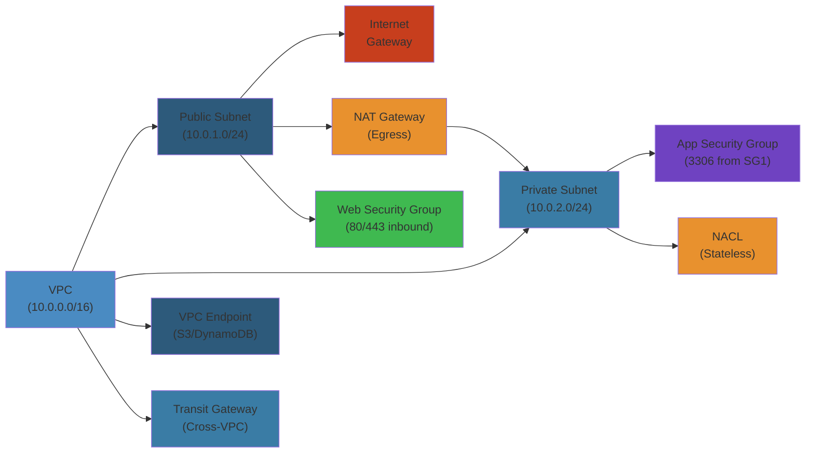

# 🖥️ EC2 Networking & Security — Complete Deep Dive




## Table of Contents


- [VPC Design Patterns](#vpc-design-patterns)
- [VPC Endpoints](#vpc-endpoints)
- [VPC Peering vs Transit Gateway](#vpc-peering-vs-transit-gateway)
- [Security Groups vs NACLs](#security-groups-vs-nacls)
- [Bastion Hosts vs SSM Session Manager](#bastion-hosts-vs-ssm-session-manager)
- [Instance Metadata & User Data](#instance-metadata--user-data)
- [Instance Profiles (IAM Roles for EC2)](#instance-profiles-iam-roles-for-ec2)
- [ENI Deep Dive](#eni-deep-dive)
- [ENA vs EFA vs ENA Express](#ena-vs-efa-vs-ena-express)
- [Placement Groups](#placement-groups)
- [Dedicated Hosts vs Dedicated Instances](#dedicated-hosts-vs-dedicated-instances)
- [Nitro System](#nitro-system)
- [Hibernate vs Stop vs Terminate](#hibernate-vs-stop-vs-terminate)
- [Systems Manager](#systems-manager)
- [EC2 Image Builder](#ec2-image-builder)
- [Simplest Mental Model](#simplest-mental-model)

---

## VPC Design Patterns


A VPC is a logically isolated network in AWS. Three subnet tiers for different workloads:

```text
+-------------------------------------------------------+
|                   VPC (10.0.0.0/16)                    |
|                                                       |
|  +----------------+  +----------------+  +----------+  |
|  | Public Subnet  |  | Private Subnet|  | Isolated  |  |
|  | 10.0.1.0/24   |  | 10.0.2.0/24   |  |10.0.3.0/24|  |
|  | IGW, ALB,     |  | NAT GW,       |  | DB, Redis |  |
|  | Bastion       |  | App Servers   |  | Internal  |  |
|  +----------------+  +----------------+  +----------+  |
+-------------------------------------------------------+
```

- **Public**: Route table -> IGW. For ALB, NAT Gateways, bastions.
- **Private**: Route table -> NAT Gateway for outbound. No direct inbound from internet.
- **Isolated**: No route to internet at all. For databases, internal caches, secrets.

**NAT Gateway vs NAT Instance**: NAT GW is managed, HA, scales up to 45 Gbps. NAT instance is deprecated, single EC2 in ASG.

## VPC Endpoints


Private access to AWS services without NAT Gateway or IGW.

| Type | Service | Cost | How |
|------|---------|------|-----|
| **Gateway** | S3, DynamoDB | Free | Route table prefix list |
| **Interface** | 130+ services | $/hr + $/GB | ENI in subnet (PrivateLink) |

**Gateway Endpoint**: Add prefix list to route table. No cost, automatically redundant. Traffic stays on AWS network.
**Interface Endpoint**: Creates ENI with private IP. Needs SG. Supports on-prem via PrivateLink + Direct Connect/VPN.

## VPC Peering vs Transit Gateway


```text
  Peering: VPC-A -- VPC-B, VPC-A -- VPC-C, VPC-B -- VPC-C (O(n^2) connections)
  TGW:     VPC-A -- TGW -- VPC-B, VPC-C, VPN, DX (O(n) connections)
```

| Feature | VPC Peering | Transit Gateway |
|---------|-------------|----------------|
| Topology | Point-to-point mesh | Hub-and-spoke star |
| Scale | < 100 VPCs | 1000s of VPCs |
| Transitive routing | No (no transitive peering) | Yes |
| Inter-region | Yes | Yes |
| VPN/Direct Connect | No | Yes |
| Route tables | Manual both sides | Centralized |

## Security Groups vs NACLs


| | Security Group | NACL |
|---|---|---|
| Scope | Instance (ENI) | Subnet |
| Rules | Allow only | Allow + Deny |
| State | Stateful | Stateless |
| Order | All evaluated | Numbered (1-32766), lowest first |
| Return traffic | Auto-allowed | Must be explicit |

**SG**: If inbound 443 allowed, outbound return traffic auto-allowed. **NACL**: Must explicitly allow outbound ephemeral ports (1024-65535) for return traffic. Use NACLs for deny lists (block bad IPs) and SGs for micro-segmentation.

## Bastion Hosts vs SSM Session Manager


**Bastion pros/cons**: EC2 in public subnet with SSH key, SG open on 22/3389, running 24/7, key management pain.

**SSM Session Manager**: Agent talks to SSM endpoint (outbound only). No public IP needed. IAM-based auth. Built-in CloudTrail logging. Port forwarding via `start-port-forwarding-session`.

**Pattern**: Never use bastions. Always SSM + EC2 Instance Connect.

## Instance Metadata & User Data


Available at `http://169.254.169.254/latest/meta-data/`. No auth (IMDSv1) or token-based (IMDSv2).

```bash
  # IMDSv2 (recommended)
  TOKEN=$(curl -X PUT http://169.254.169.254/latest/api/token \
    -H "X-aws-ec2-metadata-token-ttl-seconds: 21600")
  curl -H "X-aws-ec2-metadata-token: $TOKEN" \
    http://169.254.169.254/latest/meta-data/instance-id
  curl -H "X-aws-ec2-metadata-token: $TOKEN" \
    http://169.254.169.254/latest/meta-data/iam/security-credentials/my-role
```

**Metadata categories**: instance-id, ami-id, hostname, public-ipv4, local-ipv4, iam/security-credentials/role-name, placement/availability-zone, tags.

**User Data**: Script at `/latest/user-data/`. Runs as root on first boot. Use for bootstrap (install packages, configure apps).

**Enforce IMDSv2**: Launch template setting `MetadataOptions.HttpTokens=required`. Or IAM policy with `ec2:MetadataHttpTokens`.

## Instance Profiles (IAM Roles for EC2)


```text
  IAM Role (e.g., S3ReadOnly) -> Instance Profile (wrapper, 1 role) -> EC2 Instance
  Credentials at: http://169.254.169.254/latest/meta-data/iam/security-credentials/role-name
```

Credentials auto-rotated every ~6 hours by EC2. Never put AWS access keys on EC2 instances.

## ENI Deep Dive


**Elastic Network Interface** = virtual network card.

- **Primary ENI** (eth0): Cannot be detached. Attached at launch.
- **Secondary ENI** (eth1+): Can be attached/detached/moved. Survives stop/start.

**Use cases**: Management network (separate data/mgmt traffic), dual-homed instances (ENI per subnet), floating IPs (move ENI + IPs for failover), network appliances (keep source IP).

**Limits**: ENIs per instance vary by type (t3.nano = 2, m5.24xlarge = 15). Each ENI gets one primary IP + multiple secondary IPs.

## ENA vs EFA vs ENA Express


| Feature | ENA | EFA | ENA Express |
|---------|-----|-----|-------------|
| Use case | General networking | HPC, ML (MPI, NCCL) | Any TCP |
| Throughput | Up to 100 Gbps | 100 Gbps + RDMA | 25 Gbps per flow |
| Latency | Standard | < 10 us (OS bypass) | Reduced via SRD |
| OS bypass | No | Yes (libfabric -> NIC) | No |

**ENA**: Standard SR-IOV networking. All modern instances.
**EFA**: Bypasses kernel TCP stack. GPU direct RDMA. P4d, P5, etc.
**ENA Express**: Uses SRD (Scalable Reliable Datagrams). Multi-path load balancing for TCP. No app changes needed.

## Placement Groups


| Type | Strategy | Limit |
|------|----------|-------|
| **Cluster** | Same rack, low latency, 10 Gbps | Single AZ, placement group limit |
| **Spread** | Distinct hardware, fault isolation | 7 instances per AZ |
| **Partition** | Groups on separate racks | 7 partitions per AZ |

**Cluster** for HPC. **Spread** for critical small apps (max 7). **Partition** for large distributed systems like Kafka, Cassandra, HDFS.

## Dedicated Hosts vs Dedicated Instances


| Feature | Dedicated Host | Dedicated Instance |
|---------|---------------|-------------------|
| BYOL | Yes (per-socket, per-core) | No |
| Host visibility | Full (sockets, cores, host ID) | None |
| Auto-scaling | Manual placement | AWS managed |
| Billing | Per host (hourly) | Per instance + $2/hr surcharge |

**Use dedicated hosts** for Windows Server/SQL Server BYOL (per-core licensing). **Dedicated instances** when you need hardware isolation without BYOL.

## Nitro System


The Nitro system is the underlying platform for all current-generation EC2 instances.

**Nitro Cards**: VPC Card (SR-IOV networking, 100 Gbps), EBS Card (NVMe storage, 260K IOPS, encryption), NVMe Card (instance store).
**Nitro Security Chip**: Hardware root of trust. Measures firmware at boot. Prevents unauthorized access.
**Nitro Hypervisor**: Lightweight KVM-based. Passes CPU/memory directly. Near bare-metal performance.

## Hibernate vs Stop vs Terminate


| | Stop | Hibernate | Terminate |
|---|---|---|---|
| Root volume | EBS persisted | EBS persisted | Deleted |
| RAM | Lost | Saved to EBS | Lost |
| Boot time | Minutes | Seconds (RAM restore) | N/A |
| Instance ID | Preserved | Preserved | Deleted |
| Private IP | Preserved | Preserved | Released |
| Public IP | Released | Released | Released |

**Hibernate needs**: RAM < 150 GB, encrypted EBS root, supported instance type (C5, M5, R5, etc.), `hibernationOptions: configured=true`.

## Systems Manager


AWS Systems Manager is a suite for fleet management.

**Run Command**: Remote execution via SSM agent. No SSH needed. IAM-based. Targets tags/IDs.
**Patch Manager**: Automated patching with maintenance windows. Pre-defined or custom patch baselines.
**Parameter Store**: Hierarchical config storage. Free tier (4 KB, standard), Advanced (8 KB, policies, $0.05/param/month). Supports `SecureString` via KMS.
**Session Manager**: Shell access via IAM. Logged to S3/CloudWatch. Port forwarding available.
**State Manager**: Enforce configuration state. Bootstrap policies.
**Automation**: Step-by-step playbooks (e.g., stop instances, create AMIs).

## EC2 Image Builder


Automated AMI pipeline:

```text
  Source Image -> Build Recipe -> EC2 Build Instance -> Test -> Distribute
       |                              |                     |
  (Amazon Linux,               Install packages,      (Target regions,
   Windows, custom)             run scripts)            share accounts)
```

**Components**: Install software, configure OS, run validation tests. **Image Recipe**: Parent + components + block device mapping. **Infrastructure Config**: Instance type, subnet, SG, IAM role. **Distribution**: Copy to regions, share with accounts.

---

## Simplest Mental Model


> **EC2 networking is building a moat with controlled drawbridges around your castle.**
>
> VPC = castle wall. Security groups = gate guards who remember who they let out (stateful). NACLs = outer wall guards checking ID each time (stateless). IMDSv2 = password-protected notice board. Instance profiles = royal seals (IAM roles). ENA/EFA/ENA Express = gravel road vs fiber optic vs multi-lane highway. Nitro = superior castle foundation.
>
> **Key rule**: never trust the network. Use IMDSv2, SSM over SSH, IAM roles over keys, least-privilege SGs, encryption everywhere.


---

## Code Examples


```python
import boto3
import json

ec2 = boto3.client('ec2')
ssm = boto3.client('ssm')

# Enforce IMDSv2 on all instances
def enforce_imdsv2():
    instances = ec2.describe_instances(
        Filters=[{'Name': 'metadata-options.http-tokens', 'Values': ['optional']}]
    )
    for r in instances['Reservations']:
        for i in r['Instances']:
            ec2.modify_instance_metadata_options(
                InstanceId=i['InstanceId'],
                HttpTokens='required',
                HttpPutResponseHopLimit=2
            )

# Use SSM to run commands instead of SSH
def ssm_command(instance_id: str, command: str) -> str:
    resp = ssm.send_command(
        InstanceIds=[instance_id],
        DocumentName='AWS-RunShellScript',
        Parameters={'commands': [command]}
    )
    cmd_id = resp['Command']['CommandId']
    # Poll for completion
    while True:
        output = ssm.get_command_invocation(
            CommandId=cmd_id, InstanceId=instance_id
        )
        if output['Status'] in ['Success', 'Failed', 'TimedOut']:
            return output['StandardOutputContent']
        time.sleep(1)

# Generate a VPC with public/private/isolated tiers
def create_vpc_tiers(cidr: str = '10.0.0.0/16'):
    vpc = ec2.create_vpc(CidrBlock=cidr)
    vpc_id = vpc['Vpc']['VpcId']
    ec2.modify_vpc_attribute(VpcId=vpc_id, EnableDnsSupport={'Value': True})
    ec2.modify_vpc_attribute(VpcId=vpc_id, EnableDnsHostnames={'Value': True})

    tiers = {
        'public': '10.0.1.0/24',
        'private': '10.0.2.0/24',
        'isolated': '10.0.3.0/24'
    }
    for name, block in tiers.items():
        subnet = ec2.create_subnet(VpcId=vpc_id, CidrBlock=block)
        ec2.create_tags(Resources=[subnet['Subnet']['SubnetId']],
                        Tags=[{'Key': 'Name', 'Value': f'{name}-subnet'}])
    igw = ec2.create_internet_gateway()
    ec2.attach_internet_gateway(InternetGatewayId=igw['InternetGateway']['InternetGatewayId'],
                                 VpcId=vpc_id)
    return vpc_id
```

```bash
# Check IMDSv2 enforcement across all instances
aws ec2 describe-instances --query \
  'Reservations[*].Instances[*].[InstanceId,MetadataOptions.HttpTokens]' \
  --output table

# Port forwarding via SSM Session Manager
aws ssm start-session --target i-1234 \
  --document-name AWS-StartPortForwardingSession \
  --parameters '{"portNumber":["5432"],"localPortNumber":["15432"]}'
```

---

## Common Failure Modes


**Problem**: Security group rules accumulating unused allow rules, increasing blast radius

**Root cause**: Teams add rules for specific features and never clean up. Over years, a single SG can accumulate 50+ inbound rules allowing 0.0.0.0/0 on ports meant for internal use. Each extra rule increases the risk surface and makes audits harder. Stateful SGs mean opened egress ports remain open indefinitely.

**Detection**: AWS Trusted Advisor shows security groups with too many rules. `ec2:DescribeSecurityGroups` reveals rules referencing stale CIDRs or deprecated services. VPC Flow Logs show no traffic matching certain SG rules for 30+ days.

**Solution**: Implement least-privilege SGs — one SG per logical tier (web, app, db). Use automated cleanup with AWS Config managed rules (`ec2-security-group-unused-rule`). Tag SGs with expiration dates. Use VPC Flow Logs + Athena to identify unused rules and remove them. Always specify source IP/CIDR or security group reference — never `0.0.0.0/0` for non-public services.

**Problem**: Instance metadata service (IMDSv1) used by attackers to steal IAM credentials via SSRF

**Root cause**: IMDSv1 allows any process on the instance to GET `http://169.254.169.254/latest/meta-data/iam/security-credentials/role` without authentication. If an application is vulnerable to SSRF (Server-Side Request Forgery), an attacker can make the server fetch its own IAM credentials and exfiltrate them.

**Detection**: CloudTrail events from IMDS-scoped credentials show source IPs not matching the instance's expected network. Access from unusual geographies. GuardDuty finding: `UnauthorizedAccess:IAMUser/InstanceCredentialExfiltration`.

**Solution**: Enforce IMDSv2 across all instances (`HttpTokens=required`). IMDSv2 requires a PUT request with a TTL-limited token before accessing metadata. Set `HttpPutResponseHopLimit=1` to prevent containers from reaching the host's IMDS. Use IAM conditions to deny actions if `aws:SourceIdentity` doesn't match expected patterns. Run vulnerability scanning to detect SSRF-prone code.

---

## Interview Questions


### Q1: Explain the difference between Security Groups and NACLs, and when you would use each.


**Answer**: Security Groups are stateful, operate at the ENI level, and support allow-only rules evaluated as a set. Return traffic is automatically allowed. NACLs are stateless, operate at the subnet level, and support both allow and deny rules evaluated in numerical order (lowest first). Return traffic must be explicitly allowed. Use SGs for micro-segmentation between app tiers (web SG allows 443 from 0.0.0.0/0, app SG allows 8080 from web SG). Use NACLs as a second layer for deny lists — block known bad IPs at the subnet boundary. NACLs also protect against intra-VPC traffic that bypasses SGs (e.g., traffic through NAT Gateway). The most secure pattern is SG-based isolation with NACLs as a defense-in-depth layer.

### Q2: How would you architect EC2 networking for a multi-AZ application with strict isolation requirements?


**Answer**: Create one VPC with a /16 CIDR. In each AZ, create three subnets: public (ALB, NAT Gateway, bastion), private (application servers), and isolated (databases, Redis). Route tables: public → IGW, private → NAT GW, isolated → no internet route. Security groups: ALB SG (443 from 0.0.0.0/0), app SG (8080 from ALB SG only), DB SG (5432 from app SG only). Use VPC Endpoints for S3 and DynamoDB (gateway endpoints, free) and for SSM, ECR, CloudWatch (interface endpoints). Use Transit Gateway if connecting to multiple VPCs. Enforce IMDSv2. Use SSM Session Manager instead of SSH (no public IPs needed on app/db instances). Place instances in an Auto Scaling Group across all AZs. Use VPC Flow Logs to audit traffic patterns.


## Edge Cases


| Scenario | Challenge | Solution |
|----------|-----------|----------|
| **Security group rule limit** | Max 60 inbound + 60 outbound rules per SG | Use prefix lists for IP sets. Split across multiple SGs. Use AWS Firewall Manager for centralized management |
| **NAT gateway bandwidth** | Single NAT Gateway max 45 Gbps | Use multiple NAT Gateways (one per AZ). Distribute workloads across AZs. Use Gateway VPC Endpoints for S3/DynamoDB to bypass NAT |
| **VPC peering transitive routing** | VPC peering is non-transitive (A-B-C doesn't connect A-C) | Use Transit Gateway. Or use AWS PrivateLink for hub-and-spoke |
| **Flow log costs at scale** | 1000+ ENIs generate TBs of flow log data per day | Aggregate to S3, use Athena partitioning. Sample logs at 1:100 for analysis, 1:1 for security. Use custom format with only needed fields |
| **IPv6 dual-stack complexities** | Some services don't support IPv6 | Prefer IPv4 for general workloads. Use IPv6 only for workloads that need it. Use DNS64 + NAT64 for IPv6-only subnets |

## Cross-References


- [ECS Deployment Patterns](../ecs/02-ecs-deployment-patterns.md) — Security group-driven networking in ECS task definitions
- [EKS Operations](../eks/02-eks-operations.md) — VPC CNI, security groups for pods
- [DNS, CDN & Load Balancing](../../../11-networking/03-dns-cdn-loadbalancing.md) — Global load balancing, Route53 integration
- [CloudWatch Observability](../cloudwatch/02-cloudwatch-observability.md) — VPC flow logs monitoring, network telemetry

## Advanced Troubleshooting


### Diagnosing Network Connectivity Issues


```
Client → Internet Gateway → Route Table → Subnet → Security Group → NACL → ENI → EC2
  ↑                                                                                
  └─────────────── Check: Overlap? ────────────────────────────────┘
```

**Step-by-step**: (1) Check security group: does the SG allow inbound traffic on the port? (2) Check NACL: does the subnet NACL allow inbound AND outbound traffic? NACLs are stateless — return traffic needs separate rule. (3) Check route table: does the subnet route to an IGW? (4) Check internet gateway: is the IGW attached to the VPC? (5) Check the EC2 firewall (iptables/ufw if running). (6) Check the application: is it listening on 0.0.0.0 (not 127.0.0.1)?

### VPC Reachability Analyzer


AWS VPC Reachability Analyzer builds a graph of all networking components (SGs, NACLs, route tables, TGW attachments, VPC peering) and runs a path analysis between any two endpoints. It identifies which component blocks traffic — e.g., "Security group sg-123: port 443 blocked" or "Route table rtb-abc: no route to destination."

### Common EC2 Networking Commands


| Purpose | Command |
|---------|---------|
| Check SG rules | `aws ec2 describe-security-groups --group-ids sg-xxx` |
| Check NACL rules | `aws ec2 describe-network-acls --network-acl-ids acl-xxx` |
| Check route table | `aws ec2 describe-route-tables --route-table-ids rtb-xxx` |
| Test connectivity | `aws ec2 describe-instances --query "Reservations[].Instances[].NetworkInterfaces[].Association.PublicDnsName"` |
| Reachability analyzer | `aws ec2 create-network-insights-path --source $eni_id --destination $eni_id --protocol TCP --destination-port 443` |

## Interview Questions


### Q1 (Beginner): What is the difference between a security group and a network ACL?


**Answer**: Security groups are stateful, instance-level firewalls. If you allow inbound traffic, the return traffic is automatically allowed. NACLs are stateless, subnet-level firewalls — you must explicitly allow both inbound and outbound traffic. Security groups support allow rules only (no explicit deny). NACLs support both allow and deny rules, evaluated in order (lowest number first). Security groups are evaluated as a whole (all rules apply). NACLs use rule numbers (1-32766) and stop at the first matching rule. Use security groups for most access control, NACLs for subnet-wide deny rules (block known malicious IP ranges).

### Q2 (Mid-Level): How would you design a VPC for a multi-tier application (web, app, DB)?


**Answer**: Three tiers across three subnets: public subnet (web servers, load balancers) with route to IGW. Private app subnet (application servers) with route to NAT Gateway for outbound internet. Private DB subnet (RDS, ElastiCache) with no internet route. Security groups: Web SG → allow HTTP/HTTPS from 0.0.0.0/0. App SG → allow traffic from Web SG only (reference SG by ID). DB SG → allow traffic from App SG only, port 3306/5432. NACLs: deny all inbound/outbound as default, explicitly allow only needed ports. This creates defense-in-depth: even if an attacker penetrates the web tier, they can't reach the DB tier without a security group rule.

### Q3 (Senior): Design a multi-VPC network for a 500-microservice architecture with shared services.


**Answer**: Hub-and-spoke with AWS Transit Gateway: Hub VPC contains shared services (DNS, Active Directory, CI/CD, monitoring, artifact repos). Spoke VPCs per team/environment (dev, staging, prod). Each spoke VPC has its own subnets, route tables, NACLs, and per-service security groups. TGW attachments route traffic between spokes and hub. TGW route tables isolate spokes from each other (spoke A can't reach spoke B unless explicitly routed). For cross-spoke communication: either through hub (TGW) or direct VPC peering (only for high-traffic pairs). Network segmentation: prod spoke VPC has no internet route; all traffic goes through hub's egress VPC with centralized inspection (firewall, IDS/IPS). PrivateLink for service-to-service: each service exposes a NLB + PrivateLink endpoint, other services consume via interface endpoints in their VPC. This prevents VPC peering mesh complexity. Monitoring: VPC flow logs (aggregated to central S3), TGW attachment metrics, Reachability Analyzer for path debugging.

## Cross-References


- [ECS Deployment Patterns](../ecs/02-ecs-deployment-patterns.md) — Security group-driven networking in ECS task definitions
- [EKS Operations](../eks/02-eks-operations.md) — VPC CNI, security groups for pods
- [DNS, CDN & Load Balancing](../../../11-networking/03-dns-cdn-loadbalancing.md) — Global load balancing, Route53 integration
- [CloudWatch Observability](../cloudwatch/02-cloudwatch-observability.md) — VPC flow logs monitoring, network telemetry
- [IAM Advanced Patterns](../iam/02-iam-advanced-patterns.md) — VPC endpoints, S3 bucket policies with sourceVPC conditions