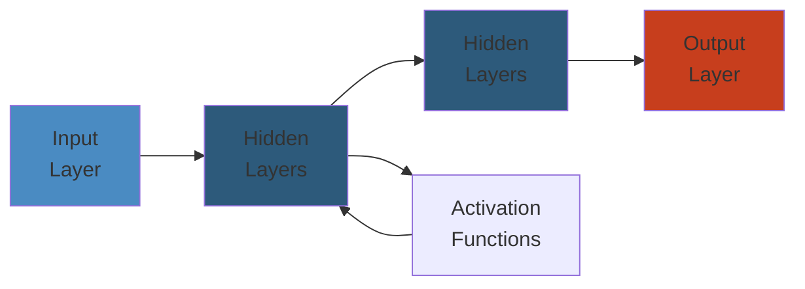

# 🐳 Amazon ECS — Complete Deep Dive

**Related**: [EKS](../eks/01-eks-deep-dive.md) · [EC2](../ec2/01-ec2-deep-dive.md) · [IAM](../iam/01-iam-deep-dive.md) · [CloudWatch](../cloudwatch/01-cloudwatch-deep-dive.md)

---




## Table of Contents

- [The Big Picture](#-the-big-picture)
- [1. Clusters](#1-clusters)
- [2. Task Definitions](#2-task-definitions)
- [3. Services](#3-services)
- [4. Fargate vs EC2 Launch Type](#4-fargate-vs-ec2-launch-type)
- [5. Service Auto-Scaling](#5-service-auto-scaling)
- [6. Load Balancing](#6-load-balancing)
- [7. Service Discovery](#7-service-discovery)
- [8. ECR](#8-ecr)
- [9. Task Placement](#9-task-placement)
- [10. Capacity Providers](#10-capacity-providers)
- [11. ECS Anywhere](#11-ecs-anywhere)
- [Simplest Mental Model](#-simplest-mental-model)

---

## 🧭 The Big Picture

```text
                    ┌──────────────────────────────┐
                    │      Amazon ECS               │
                    │ (Elastic Container Service)   │
                    ├──────────────────────────────┤
                    │ Run containers at scale       │
                    │ without managing orchestrator │
                    └──────────────┬───────────────┘
                                   │
            ┌──────────────────────┼──────────────────────┐
            ▼                      ▼                      ▼
    ┌──────────────┐      ┌──────────────┐      ┌──────────────┐
    │ Launch Types │      │  Networking  │      │  Storage     │
    │ • Fargate    │      │  • VPC       │      │  • EFS       │
    │ • EC2        │      │  • ALB/NLB   │      │  • EBS       │
    │ • External   │      │  • Service   │      │  • Bind      │
    │              │      │    Discovery │      │    Mounts    │
    └──────────────┘      └──────────────┘      └──────────────┘
```

---

## 1. Clusters

### Cluster Architecture

```text
┌──────────────────────────────────────────────────────┐
│                   ECS Cluster                        │
│                                                      │
│  ┌──────────────┐  ┌──────────────┐  ┌──────────────┐│
│  │  Service A   │  │  Service B   │  │  Service C   ││
│  │  (3 tasks)   │  │  (2 tasks)   │  │  (1 task)    ││
│  └──────┬───────┘  └──────┬───────┘  └──────┬───────┘│
│         ▼                 ▼                 ▼         │
│  ┌──────────────────────────────────────────────┐    │
│  │           Capacity Provider                   │    │
│  │      (Fargate / EC2 / External)               │    │
│  └──────────────────────────────────────────────┘    │
└──────────────────────────────────────────────────────┘
```

### Cluster Lifecycle

| State | Description |
|-------|-------------|
| ACTIVE | Cluster running, accepting tasks |
| PROVISIONING | Cluster being created |
| DEPROVISIONING | Cluster being deleted |
| INACTIVE | Cluster stopped (no charges) |

---

## 2. Task Definitions

### Task Definition Structure

```json
{
  "family": "my-app",
  "taskRoleArn": "arn:aws:iam::123456789012:role/ecs-task-role",
  "executionRoleArn": "arn:aws:iam::123456789012:role/ecs-execution-role",
  "networkMode": "awsvpc",
  "requiresCompatibilities": ["FARGATE"],
  "cpu": "512",
  "memory": "1024",
  "containerDefinitions": [
    {
      "name": "app",
      "image": "123456789012.dkr.ecr.us-east-1.amazonaws.com/my-app:latest",
      "portMappings": [{ "containerPort": 8080, "protocol": "tcp" }],
      "environment": [
        { "name": "LOG_LEVEL", "value": "INFO" }
      ],
      "secrets": [
        { "name": "DB_PASSWORD", "valueFrom": "arn:aws:ssm:...:parameter/db/password" }
      ],
      "logConfiguration": {
        "logDriver": "awslogs",
        "options": {
          "awslogs-group": "/ecs/my-app",
          "awslogs-region": "us-east-1"
        }
      },
      "healthCheck": {
        "command": ["CMD-SHELL", "curl -f http://localhost:8080/health || exit 1"],
        "interval": 30,
        "timeout": 5,
        "retries": 3,
        "startPeriod": 15
      }
    }
  ]
}
```

### Task Size (Fargate)

| CPU | Memory (MiB) | Network |
|-----|-------------|---------|
| 256 (.25 vCPU) | 512, 1024, 2048 | Up to 0.5 Gbps |
| 512 (.5 vCPU) | 1024-4096 | Up to 1 Gbps |
| 1024 (1 vCPU) | 2048-8192 | Up to 2 Gbps |
| 2048 (2 vCPU) | 4096-16384 | Up to 4 Gbps |
| 4096 (4 vCPU) | 8192-30720 | Up to 8 Gbps |
| 8192 (8 vCPU) | 16384-61440 | Up to 16 Gbps |
| 16384 (16 vCPU) | 32768-122880 | Up to 25 Gbps |

---

## 3. Services

### Service Model

```text
ECS Service = Scheduler for long-running tasks
  ┌──────────────────────────────────┐
  │ Service: my-web-app              │
  │ Task Def: my-app:12             │
  │ Launch: FARGATE                  │
  │ Desired: 3  Min: 2  Max: 10     │
  │                                 │
  │ ┌───┐ ┌───┐ ┌───┐              │
  │ │ T1│ │ T2│ │ T3│              │
  │ └───┘ └───┘ └───┘              │
  │  AZ-a  AZ-b  AZ-c               │
  │                                 │
  │ ALB Target Group: my-tg         │
  │ Auto Scaling: CPU > 70% → +2    │
  │ Deploy: Rolling                 │
  │ Circuit Breaker: rollback 50%   │
  └──────────────────────────────────┘
```

### Service Lifecycle

```text
Create Service
      │
      ▼
┌──────────────┐
│ Service ACTIVE│
│ Scheduler runs│
└──────┬───────┘
       ▼
┌──────────────┐
│ Task PROVISION│
│ Container pull│
└──────┬───────┘
   ├── Success → RUNNING
   └── Fail → STOPPED → Service replaces
```

### Deployment Types

| Type | Behavior | Zero-Downtime |
|------|----------|--------------|
| Rolling update | Gradually replace tasks | ✅ With health checks |
| Blue/Green (CodeDeploy) | Shift traffic between task sets | ✅ |
| External | Third-party CI/CD | ✅ |
| Canary (CodeDeploy) | % traffic to new version | ✅ |

---

## 4. Fargate vs EC2 Launch Type

### Comparison

| Aspect | Fargate | EC2 |
|--------|---------|-----|
| Management | Serverless | You manage EC2 |
| Pricing | Per task (vCPU+mem) | Per EC2 instance |
| Isolation | Per-task | Per-instance (shared kernel) |
| Scaling | Instant | Need capacity planning |
| GPU support | ❌ | ✅ |
| Cost optimization | Fargate Spot | Spot + ASG |
| EBS volumes | ❌ (EFS only) | ✅ |

### When to Choose

```text
FARGATE when:
  • No infra management wanted
  • Spiky workloads
  • Per-task billing preferred
  • No GPU/Windows needed

EC2 when:
  • Large predictable scale
  • Cost savings (reserved instances)
  • GPU/Windows containers
  • EBS volume attachments needed
```

---

## 5. Service Auto-Scaling

### Target Tracking

```json
{
  "TargetTrackingScalingPolicy": {
    "TargetValue": 70.0,
    "PredefinedMetricSpecification": {
      "PredefinedMetricType": "ECSServiceAverageCPUUtilization"
    },
    "ScaleOutCooldown": 60,
    "ScaleInCooldown": 120
  }
}
```

### Supported Metrics

| Metric | Description |
|--------|-------------|
| `ECSServiceAverageCPUUtilization` | CPU usage across tasks |
| `ECSServiceAverageMemoryUtilization` | Memory usage across tasks |
| `ALBRequestCountPerTarget` | Request count per task |

### Step Scaling

```text
Metric (CPU%)    Condition         Action
─────────────────────────────────────────
> 80%            High CPU          +3 tasks
> 60%            Moderate CPU      +2 tasks
< 30%            Low CPU           -1 task
< 10%            Very low CPU      -2 tasks
```

### Scaling Flow

```text
CPU > 70% (3 min sustained)
       │
       ▼
CloudWatch Alarm triggers
       │
       ▼
Application Auto Scaling
       │
       ▼
ECS Service updates desired count
       │
       ▼
New tasks launched
```

---

## 6. Load Balancing

### ALB with ECS

```text
┌──────────┐
│  ALB     │
│  :443    │
└────┬─────┘
     │
     ▼
┌──────────────┐
│ Target Group  │
│ (IP mode)    │
│ /health → 200│
└──────┬───────┘
        │
   ┌────┴────┐
   ▼         ▼
┌──────┐ ┌──────┐
│Task A│ │Task B│
│:8080 │ │:8080 │
└──────┘ └──────┘
```

### ALB vs NLB

| Feature | ALB (Layer 7) | NLB (Layer 4) |
|---------|--------------|--------------|
| Protocol | HTTP/HTTPS/gRPC | TCP/UDP/TLS |
| Features | Host/path routing, sticky sessions | Static IP, ultra-low latency |
| ECS mode | IP mode (recommended) | IP mode |
| Health checks | HTTP/HTTPS | TCP/HTTP/HTTPS |
| WebSocket | ✅ Native | ❌ |

---

## 7. Service Discovery

### AWS Cloud Map Integration

```text
┌────────────────────────────────────┐
│          Service Discovery         │
│                                    │
│  Service: my-app                   │
│  Namespace: my-namespace.local     │
│                                    │
│  Tasks register as DNS entries:    │
│  my-app.my-namespace.local         │
│    ├── A record: 10.0.1.5         │
│    ├── A record: 10.0.2.8         │
│    └── A record: 10.0.3.12        │
│                                    │
│  Other services resolve via DNS:   │
│  curl http://my-app.my-namespace   │
│    .local:8080/api                 │
└────────────────────────────────────┘
```

### Service Connect

```text
Service Connect = Service mesh without sidecars

┌────────────┐     ┌────────────┐
│ Service A  │────►│ Service B  │
│ (client)   │     │ (server)   │
│ port 8080  │     │ port 8080  │
└────────────┘     └────────────┘
       │                 │
   ECS agent        ECS agent
   (proxy)          (proxy)
       │                 │
       └─── TCP over ───┘
        localhost:30080

No sidecar containers needed!
```

---

## 8. ECR

### ECR Architecture

```text
┌──────────┐    docker push    ┌──────────┐
│  Docker  │──────────────────►│   ECR    │
│  Client  │                   │ Registry │
│  local   │                   ├──────────┤
└──────────┘                   │ my-app   │
                               │  :latest │
┌──────────┐   docker pull    │  :v1.2.3 │
│  ECS     │◄─────────────────│  :v1.2.4 │
│  Task    │                   │  :sha-abc│
└──────────┘                   └──────────┘
```

### Commands

```awscli
# Authenticate Docker to ECR
aws ecr get-login-password --region us-east-1 | \
  docker login --username AWS --password-stdin \
  123456789012.dkr.ecr.us-east-1.amazonaws.com

# Create repository
aws ecr create-repository \
  --repository-name my-app \
  --image-tag-mutability IMMUTABLE \
  --encryption-type AES256

# Tag and push
docker tag my-app:latest 123456789012.dkr.ecr.us-east-1.amazonaws.com/my-app:latest
docker push 123456789012.dkr.ecr.us-east-1.amazonaws.com/my-app:latest

# Scan for vulnerabilities
aws ecr start-image-scan \
  --repository-name my-app \
  --image-id imageTag=latest
```

### Lifecycle Policy

```json
{
  "rules": [
    {
      "rulePriority": 1,
      "description": "Keep only 10 latest tags",
      "selection": {
        "tagStatus": "any",
        "countType": "imageCountMoreThan",
        "countNumber": 10
      },
      "action": { "type": "expire" }
    }
  ]
}
```

---

## 9. Task Placement

### Placement Strategies (EC2 only)

```text
Strategy: binpack
  ┌────────────┐  ┌────────────┐  ┌────────────┐
  │ Instance A │  │ Instance B │  │ Instance C │
  │ ┌──┐ ┌──┐  │  │ ┌──┐      │  │            │
  │ │T1│ │T2│  │  │ │T3│      │  │            │
  │ └──┘ └──┘  │  │ └──┘      │  │            │
  └────────────┘  └────────────┘  └────────────┘
  (80% utilized)   (40% utilized)   (0% utilized)

Strategy: spread
  ┌────────────┐  ┌────────────┐  ┌────────────┐
  │ Instance A │  │ Instance B │  │ Instance C │
  │ ┌──┐      │  │ ┌──┐      │  │ ┌──┐      │
  │ │T1│      │  │ │T2│      │  │ │T3│      │
  │ └──┘      │  │ └──┘      │  │ └──┘      │
  └────────────┘  └────────────┘  └────────────┘
  (spread across instances)

Strategy: random
  Picks instance at random (default if no strategy)
```

### Placement Constraints

| Constraint | Description |
|------------|-------------|
| `distinctInstance` | Each task on a different instance |
| `memberOf` | Task runs on instances matching expression |
| Expression: `attribute:ecs.instance-type == t3.large` | |
| Expression: `attribute:ecs.availability-zone in [us-east-1a, us-east-1b]` | |

---

## 10. Capacity Providers

### Capacity Provider Strategy

```text
Cluster Capacity Strategy:

FARGATE (weight: 1, base: 5) + FARGATE_SPOT (weight: 3, base: 0)

First 5 tasks → Always FARGATE (base)
Task 6+       → Distributed by weight:
                 1/4 FARGATE, 3/4 FARGATE_SPOT

┌──────────────────────────────────────┐
│ Tasks:                               │
│ T1 T2 T3 T4 T5 (base → FARGATE)     │
│ T6 → FARGATE SPOT                    │
│ T7 → FARGATE SPOT                    │
│ T8 → FARGATE SPOT                    │
│ T9 → FARGATE                         │
│ T10 T11 T12 → SPOT                   │
└──────────────────────────────────────┘
```

### EC2 Capacity Providers

```text
┌──────────────────────────────────────┐
│ Auto Scaling Group ──► Capacity      │
│ (EC2 instances)        Provider      │
│                           │          │
│  ASG manages instance     │          │
│  count                     │          │
│  ECS Cluster Capacity     │          │
│  Provider manages         │          │
│  scaling of the ASG       │          │
└──────────────────────────────────────┘

Flow:
  ECS needs more capacity
    → Capacity provider scales up ASG
      → New EC2 instance launches
        → Instance registers with cluster
          → Tasks placed on instance
```

---

## 11. ECS Anywhere

### External Instances

```text
ECS Anywhere = Run ECS tasks on your own infrastructure

┌────────────────────┐     ┌────────────────────┐
│ AWS Cloud          │     │  On-Premises       │
│                    │     │                    │
│ ┌──────────────┐  │     │  ┌──────────────┐  │
│ │ ECS Cluster  │  │     │  │ Your Server   │  │
│ │              │  │     │  │ • SSD Agent  │  │
│ │ ECS Control  │◄─┼─────┼─►│ • Registers  │  │
│ │ Plane        │  │     │  │   with SSM   │  │
│ └──────────────┘  │     │  │ • Pulls task │  │
│                   │     │  │   definition │  │
│ ┌──────────────┐  │     │  └──────────────┘  │
│ │ SSM          │◄─┼─────┼─►  ┌──────────────┐│
│ │ (register)   │  │     │  │ Your Server 2 ││
│ └──────────────┘  │     │  └──────────────┘│
└────────────────────┘     └────────────────────┘
```

### Requirements

| Requirement | Detail |
|-------------|--------|
| OS | Linux (x86_64, ARM64) |
| Agent | ECS agent + SSM agent + Docker |
| Network | Internet access to AWS endpoints |
| Registration | SSM activation (register-on-premises) |

---

## 🧠 Simplest Mental Model

```text
ECS CLUSTER      =  A container parking lot. All your containers
                    live here, but where depends on the lot type.

FARGATE          =  Valet parking. Give keys (task definition),
                    they park it for you. Pay per spot, not the lot.

EC2 LAUNCH       =  Self-parking. You rent the entire parking
                    garage (EC2 instances) and fill it yourself.
                    Cheaper per spot if you fill the garage.

TASK DEFINITION  =  A blueprint for your container.
                    "One container, port 8080, 512MB RAM,
                    environment variables X,Y,Z."

SERVICE          =  A parking attendant who ensures there are
                    always exactly 3 of your cars in the lot.
                    If one leaves, they call another.

TASK             =  A single instance of your container.
                    Like one specific car parked right now.

SERVICE          =  Smart parking lot that adds more spots
AUTO-SCALING       when the line gets long and removes them
                    when it's empty.

CAPACITY         =  A parking lot that has a mix of self-park
PROVIDER           and valet sections. Tells ECS where to park
                    each car based on rules.

ECR              =  A warehouse full of container images.
                    Like a car dealership's inventory lot.

ECS ANYWHERE     =  Extending the parking lot to your own
                    private garage at home, managed by ECS.
```

---

**Next**: [EKS Deep Dive](../eks/01-eks-deep-dive.md) — Kubernetes on AWS
