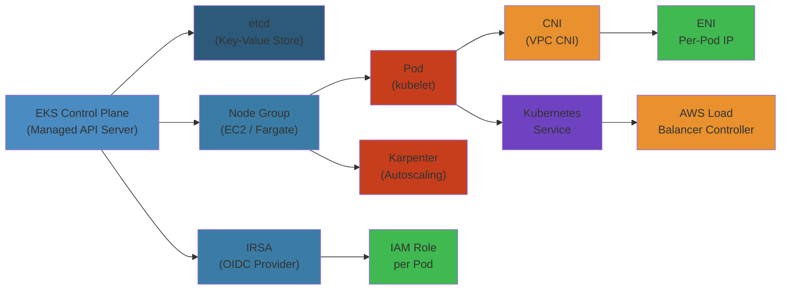

# ☸️ Amazon EKS — Complete Deep Dive

**Related**: [ECS](../ecs/01-ecs-deep-dive.md) · [EC2](../ec2/01-ec2-deep-dive.md) · [IAM](../iam/01-iam-deep-dive.md) · [ElastiCache](../elasticache/01-elasticache-deep-dive.md)

---




## Table of Contents


- [The Big Picture](#-the-big-picture)
- [1. Control Plane](#1-control-plane)
- [2. Node Groups](#2-node-groups)
- [3. Cluster Autoscaler](#3-cluster-autoscaler)
- [4. Karpenter](#4-karpenter)
- [5. IRSA](#5-irsa)
- [6. Pod Networking (CNI)](#6-pod-networking-cni)
- [7. Ingress Controllers](#7-ingress-controllers)
- [8. ALB/NLB](#8-albnlb)
- [9. EBS CSI Driver](#9-ebs-csi-driver)
- [10. EFS CSI](#10-efs-csi)
- [Simplest Mental Model](#-simplest-mental-model)

---

## 🧭 The Big Picture


```text
                    ┌──────────────────────────────┐
                    │      Amazon EKS               │
                    │ (Elastic Kubernetes Service)  │
                    ├──────────────────────────────┤
                    │ Managed Kubernetes control    │
                    │ plane. You manage worker      │
                    │ nodes (or use Fargate).       │
                    └──────────────┬───────────────┘
                                   │
        ┌──────────────────────────┼──────────────────────────┐
        ▼                          ▼                          ▼
┌──────────────┐          ┌──────────────┐          ┌──────────────┐
│ Control Plane│          │  Data Plane  │          │  Ecosystem   │
│ • k8s API   │          │ • Node groups│          │ • Helm      │
│ • etcd      │          │ • Fargate   │          │ • Istio     │
│ • scheduler │          │ • Karpenter │          │ • Prometheus│
│ • ha per AZ │          │ • Auto-scale│          │ • Fluent Bit│
└──────────────┘          └──────────────┘          └──────────────┘
```

---

## 1. Control Plane


### Managed Control Plane


```text
AWS manages control plane (free — pay only for worker nodes):

┌──────────────────────────────────────────────────┐
│  EKS Control Plane (multi-AZ, AWS-managed)        │
│                                                    │
│  ┌────────────────┐  ┌────────────────┐            │
│  │ AZ-a           │  │ AZ-b           │            │
│  │ ┌────────────┐ │  │ ┌────────────┐ │            │
│  │ │ API Server │ │  │ │ API Server │ │            │
│  │ └────────────┘ │  │ └────────────┘ │            │
│  │ ┌────────────┐ │  │ ┌────────────┐ │            │
│  │ │ etcd       │ │  │ │ etcd       │ │            │
│  │ └────────────┘ │  │ └────────────┘ │            │
│  └────────────────┘  └────────────────┘            │
│                                                    │
│  • API Server endpoint: XXXXX.gr7.us-east-1       │
│    .eks.amazonaws.com                              │
│  • Certificate Authority (CA) auto-rotated         │
│  • Not accessible from internet by default         │
└────────────────────────────────────────────────────┘
```

### Cluster Endpoint Access


| Access Type | Public | Private | Use Case |
|-------------|--------|---------|----------|
| Public | ✅ Enabled | ❌ Disabled | Dev/test with VPN |
| Private | ❌ Disabled | ✅ Enabled | Production, no internet |
| Public + Private | ✅ Enabled | ✅ Enabled | Hybrid (kubectl from internet, pods via private) |

### Version Lifecycle


```text
K8s Version Lifecycle:
  v1.27 ─► v1.28 ─► v1.29 ─► v1.30 ─► v1.31
    │                  │                    │
    │                  │                    │
    └─── 12 months ────┘                    │
    from release       └─── 12 months ──────┘

Upgrade path: Must upgrade one minor version at a time
  v1.27 → v1.28 → v1.29 (cannot skip to v1.30)
```

---

## 2. Node Groups


### Managed Node Groups


```text
┌──────────────────────────────────────────────┐
│         Managed Node Group                     │
│                                                │
│  ┌──────────────────────────────────────┐     │
│  │  Auto Scaling Group                  │     │
│  │  ┌────┐ ┌────┐ ┌────┐              │     │
│  │  │ EC2│ │ EC2│ │ EC2│   ...        │     │
│  │  └────┘ └────┘ └────┘              │     │
│  └──────────────────────────────────────┘     │
│                                                │
│  • AWS manages:                               │
│    - AMI updates (security patches)           │
│    - Scaling (via ASG)                        │
│    - Labels (kubernetes.io/role, etc.)        │
│    - Node join (automated bootstrap)          │
│  • You can: customize AMI via launch template  │
└──────────────────────────────────────────────┘
```

### Node Group Types


| Feature | Managed Node Group | Self-Managed |
|---------|-------------------|--------------|
 | AMI updates | Automated (with update process) | Manual |
| Node rotation | Rolling update support | Manual |
 | Launch template | Supported (optional) | Required |
| Scaling | ASG-managed | ASG-managed |
| Labels & taints | Automated | Manual |
| Support | AWS handles node health | You handle node health |

### Fargate on EKS


```text
┌──────────────────────────────────────────────┐
│          EKS Fargate Profiles                 │
│                                                │
│  Namespace Selector:                          │
│    fargate-team-* → Fargate                   │
│                                                │
│  ┌──────────────────────────────────────┐     │
│  │  Fargate Infrastructure               │     │
│  │  ┌──────────┐ ┌──────────┐            │     │
│  │  │ Pod A    │ │ Pod B    │            │     │
│  │  │ (Fargate)│ │ (Fargate)│            │     │
│  │  └──────────┘ └──────────┘            │     │
│  │  No EC2 nodes needed!                 │     │
│  └──────────────────────────────────────┘     │
│                                                │
│  Limitations:                                  │
│  • No DaemonSets                               │
│  • No privileged containers                    │
│  • No hostNetwork access                       │
│  • Supports only EFS (not EBS)                 │
└────────────────────────────────────────────────┘
```

---

## 3. Cluster Autoscaler


### How It Works


```text
1. Pod can't be scheduled (unschedulable)
2. Cluster Autoscaler detects pending pods
3. Checks node group min/max limits
4. Triggers ASG scale-out
5. New node joins cluster
6. Pending pods schedule on new node

Conversely:
1. Node has low utilization (<50% for 10+ min)
2. All pods on node can be rescheduled
3. Node is cordoned + drained
4. ASG scale-in terminates the node
```

### Configuration


```yaml
apiVersion: v1
kind: ConfigMap
metadata:
  name: cluster-autoscaler
  namespace: kube-system
data:
  config: |
    {
      "autoDiscovery": {
        "clusterName": "my-eks-cluster"
      },
      "maxNodeProvisionTime": "15m",
      "maxEmptyBulkDelete": 10,
      "scaleDownEnabled": true,
      "scaleDownDelayAfterAdd": "10m",
      "scaleDownDelayAfterDelete": "10m",
      "scaleDownDelayAfterFailure": "3m",
      "scaleDownUnneededTime": "10m",
      "scaleDownUtilizationThreshold": "0.5",
      "skipNodesWithLocalStorage": true,
      "skipNodesWithSystemPods": true
    }
```

### Comparison: Cluster Autoscaler vs Karpenter


| Aspect | Cluster Autoscaler | Karpenter |
|--------|-------------------|-----------|
| Architecture | Node-group based | Instance-type aware |
| Decision time | Minutes | Seconds |
| Instance diversity | Limited by ASG | Full AWS catalog |
| Bin packing | Basic | Advanced (consolidation) |
| Node termination | Slow (ASG + lifecycle) | Fast (direct EC2 API) |
| Multi-arch | Requires separate node groups | Native support |
| Consolidation | ❌ | ✅ (replaces inefficient nodes) |

---

## 4. Karpenter


### Karpenter Architecture


```text
┌──────────────────────────────────────────────┐
│               Karpenter                        │
│                                                │
│  Monitors unschedulable pods                   │
│        │                                       │
│        ▼                                       │
│  ┌──────────────────────┐                      │
│  │ Decision: best type  │                      │
│  │ • CPU/Memory request │                      │
│  │ • GPU needed?        │                      │
│  │ • Spot or On-Demand  │                      │
│  │ • Topology spread    │                      │
│  └──────────┬───────────┘                      │
│             │                                  │
│             ▼                                  │
│  ┌──────────────────────┐                      │
│  │ Launch EC2 instance  │                      │
│  │ (direct EC2 API)     │                      │
│  └──────────┬───────────┘                      │
│             │                                  │
│             ▼                                  │
│  ┌──────────────────────┐                      │
│  │ Instance ready in    │                      │
│  │ ~30-60 seconds       │                      │
│  └──────────────────────┘                      │
└──────────────────────────────────────────────┘
```

### Provisioner


```yaml
apiVersion: karpenter.sh/v1beta1
kind: NodePool
metadata:
  name: default
spec:
  template:
    spec:
      requirements:
        - key: "karpenter.k8s.aws/instance-category"
          operator: In
          values: ["c", "m", "r"]
        - key: "karpenter.k8s.aws/instance-cpu"
          operator: In
          values: ["2", "4", "8", "16"]
        - key: "karpenter.sh/capacity-type"
          operator: In
          values: ["on-demand", "spot"]
        - key: "kubernetes.io/arch"
          operator: In
          values: ["amd64", "arm64"]
      nodeClassRef:
        group: karpenter.k8s.aws
        kind: EC2NodeClass
        name: default
  limits:
    cpu: 1000
  disruption:
    consolidationPolicy: WhenUnderutilized
    expireAfter: 720h
---
apiVersion: karpenter.k8s.aws/v1beta1
kind: EC2NodeClass
metadata:
  name: default
spec:
  amiFamily: AL2
  role: "KarpenterNodeRole"
  subnetSelectorTerms:
    - tags:
        karpenter.sh/discovery: my-eks-cluster
  securityGroupSelectorTerms:
    - tags:
        karpenter.sh/discovery: my-eks-cluster
```

---

## 5. IRSA


### IAM Roles for Service Accounts


```text
Before IRSA:
  Pod inherits node instance role → all pods share same permissions

After IRSA:
  Each pod gets its own IAM role per service account

┌──────────────────┐
│  EKS Cluster     │
│                  │
│  ┌──────────────┐│     ┌──────────────────┐
│  │ Service Acct  ││     │ IAM Role         │
│  │ my-app-sa    │├────►│ arn:aws:iam::    │
│  │ annotation:   ││     │ ...:role/my-app │
│  │ role-arn     ││     └──────────────────┘
│  └──────┬───────┘│
│         │        │
│         ▼        │
│  ┌──────────────┐│
│  │ Pod my-app   ││     Can access:
│  │ (sts token)  ││     • S3 bucket X
│  │              ││     • DynamoDB table Y
│  └──────────────┘│     • etc.
└──────────────────┘
```

### Setup Steps


```text
1. Create IAM OIDC provider for EKS cluster
   aws eks describe-cluster --name my-cluster \
     --query "cluster.identity.oidc.issuer"

2. Create IAM role with trust policy:
   {
     "Effect": "Allow",
     "Principal": {
       "Federated": "arn:aws:iam::ACCOUNT:oidc-provider/OIDC_URL"
     },
     "Action": "sts:AssumeRoleWithWebIdentity",
     "Condition": {
       "StringEquals": {
         "oidc.eks.REGION.amazonaws.com/id/ISSUER:sub": "system:serviceaccount:NAMESPACE:SA_NAME"
       }
     }
   }

3. Annotate ServiceAccount:
   metadata:
     annotations:
       eks.amazonaws.com/role-arn: arn:aws:iam::ACCOUNT:role/my-role

4. Deploy pod using the annotated ServiceAccount
```

---

## 6. Pod Networking (CNI)


### AWS VPC CNI


```text
┌──────────────────────────────────────────────┐
│           AWS VPC CNI (Default)               │
│                                                │
│  Each pod gets a VPC IP address (ENI)          │
│                                                │
│  ┌──────────────┐  ┌──────────────┐           │
│  │  EC2 Node     │  │  EC2 Node     │           │
│  │  eth0: 10.0.1 │  │  eth0: 10.0.2 │           │
│  │  ├── veth →   │  │  ├── veth →   │           │
│  │  │   Pod A    │  │  │   Pod C    │           │
│  │  │   10.0.1.5 │  │  │   10.0.2.7 │           │
│  │  ├── veth →   │  │  ├── veth →   │           │
│  │  │   Pod B    │  │  │   Pod D    │           │
│  │  │   10.0.1.6 │  │  │   10.0.2.8 │           │
│  └──────────────┘  └──────────────┘           │
│                                                │
│  Pod-to-Pod: direct VPC routing                │
│  (no overlay, no NAT needed)                   │
│  Pods reachable from VPC natively              │
└────────────────────────────────────────────────┘
```

### CNI Custom Networking


```text
Secondary CIDR for pods (separate from node subnet):

┌──────────────────────────────┐
│ VPC CIDR: 10.0.0.0/16        │
│                              │
│ Node Subnet: 10.0.1.0/24    │
│ Pod Subnet:  10.1.0.0/16    │
│                              │
│ Benefits:                    │
│ • No ENI exhaustion          │
│ • More pod IPs               │
│ • Isolate pod traffic        │
└──────────────────────────────┘

CNI Prefix Delegation:
  • Assign /28 (16 IPs) per ENI instead of /32
  • More pods per node without more ENIs
  • Up to 110 pods/node on c5.large (vs 29 default)
```

### Calico / Cilium (Alternative CNIs)


| CNI | Network Policy | Encryption | Observability |
|-----|---------------|------------|---------------|
| AWS VPC CNI | Basic (SG per pod) | None | Basic |
| Calico | Full (K8s NetworkPolicy) | WireGuard | Felix metrics |
| Cilium | L3-L7 (eBPF) | IPsec/WireGuard | Hubble (L7 visibility) |
| Weave | Full | Encrypted overlay | Weave Scope |

---

## 7. Ingress Controllers


### AWS Load Balancer Controller


```text
┌──────────────────┐
│  Ingress Resource │
│  host: app.my.com│
│  path: /api/*    │
│  path: /web/*    │
└────────┬─────────┘
         │
         ▼
┌──────────────────────┐
│ AWS LB Controller     │
│ (watches Ingress CRDs)│
└────────┬─────────────┘
         │
         ▼
┌──────────────────┐
│  ALB (Layer 7)   │
│                   │
│  /api/* ───► TG-A│
│  /web/* ───► TG-B│
│  /* ──────► default│
└──────────────────┘
```

### Ingress Example


```yaml
apiVersion: networking.k8s.io/v1
kind: Ingress
metadata:
  name: my-app
  annotations:
    alb.ingress.kubernetes.io/scheme: internet-facing
    alb.ingress.kubernetes.io/target-type: ip
    alb.ingress.kubernetes.io/listen-ports: '[{"HTTPS":443}]'
    alb.ingress.kubernetes.io/certificate-arn: arn:aws:acm:us-east-1:...
    alb.ingress.kubernetes.io/ssl-redirect: "443"
spec:
  ingressClassName: alb
  rules:
    - host: api.myapp.com
      http:
        paths:
          - path: /v1
            pathType: Prefix
            backend:
              service:
                name: api-service
                port:
                  number: 8080
    - host: web.myapp.com
      http:
        paths:
          - path: /
            pathType: Prefix
            backend:
              service:
                name: web-service
                port:
                  number: 80
```

---

## 8. ALB/NLB


### ALB vs NLB with EKS


| Feature | ALB | NLB |
|---------|-----|-----|
| Layer | 7 (HTTP/HTTPS/gRPC) | 4 (TCP/UDP/TLS) |
| Target type | IP (pod) | IP or instance |
| Host-based routing | ✅ | ❌ |
| Path-based routing | ✅ | ❌ |
| Sticky sessions | ✅ (cookie) | ✅ (source IP) |
| SSL termination | ✅ (ACM) | ✅ (TLS listener) |
| WebSocket | ✅ | ❌ |
| Static IP | ❌ | ✅ (EIP) |
| PrivateLink | ❌ | ✅ |

### NLB for UDP/TCP Workloads


```yaml
apiVersion: v1
kind: Service
metadata:
  name: game-server
  annotations:
    service.beta.kubernetes.io/aws-load-balancer-type: "nlb"
    service.beta.kubernetes.io/aws-load-balancer-scheme: "internet-facing"
spec:
  type: LoadBalancer
  ports:
    - port: 7777
      targetPort: 7777
      protocol: UDP
  selector:
    app: game-server
```

---

## 9. EBS CSI Driver


### Storage Classes


```yaml
# gp3 storage class (default)
apiVersion: storage.k8s.io/v1
kind: StorageClass
metadata:
  name: gp3
provisioner: ebs.csi.aws.com
parameters:
  type: gp3
  iops: "3000"
  throughput: "125"
reclaimPolicy: Delete
volumeBindingMode: WaitForFirstConsumer
allowVolumeExpansion: true
---
# io2 storage class (high performance)
apiVersion: storage.k8s.io/v1
kind: StorageClass
metadata:
  name: io2
provisioner: ebs.csi.aws.com
parameters:
  type: io2
  iops: "10000"
reclaimPolicy: Retain
volumeBindingMode: WaitForFirstConsumer
```

### PVC Example


```yaml
apiVersion: v1
kind: PersistentVolumeClaim
metadata:
  name: mysql-data
spec:
  accessModes:
    - ReadWriteOnce
  storageClassName: gp3
  resources:
    requests:
      storage: 50Gi
---
apiVersion: v1
kind: Pod
metadata:
  name: mysql
spec:
  containers:
    - name: mysql
      image: mysql:8.0
      volumeMounts:
        - mountPath: /var/lib/mysql
          name: data
  volumes:
    - name: data
      persistentVolumeClaim:
        claimName: mysql-data
```

### EBS CSI Limitations


| Limitation | Detail |
|------------|--------|
| Access mode | `ReadWriteOnce` only (single node) |
| AZ bound | Volume must be in same AZ as pod's node |
| Fargate | ❌ Not supported |
| Replication | Must handle at app level (e.g., MySQL replication) |

---

## 10. EFS CSI


### EFS Architecture


```text
┌────────────────────────────────────┐
│        Amazon EFS (NFS v4)          │
│          Shared File System         │
├────────────────────────────────────┤
│                                    │
│  ┌──────────┐  ┌──────────┐        │
│  │ Pod A    │  │ Pod B    │        │
│  │ (AZ-a)   │  │ (AZ-b)   │        │
│  │ ──────── │  │ ──────── │        │
│  │ /data    │  │ /data    │        │
│  └────┬─────┘  └────┬─────┘        │
│       │              │             │
│       └──────┬───────┘             │
│              ▼                     │
│       ┌──────────────┐            │
│       │    EFS       │            │
│       │ Access Point │            │
│       └──────────────┘            │
└────────────────────────────────────┘
```

### EFS Storage Class


```yaml
apiVersion: storage.k8s.io/v1
kind: StorageClass
metadata:
  name: efs-sc
provisioner: efs.csi.aws.com
parameters:
  provisioningMode: efs-ap
  fileSystemId: fs-12345678
  directoryPerms: "700"
  gidRangeStart: "1000"
  gidRangeEnd: "2000"
  basePath: "/dynamic_provisioning"
---
apiVersion: v1
kind: PersistentVolumeClaim
metadata:
  name: shared-data
spec:
  accessModes:
    - ReadWriteMany
  storageClassName: efs-sc
  resources:
    requests:
      storage: 10Gi  # Not enforced (EFS is elastic)
```

### EBS vs EFS on EKS


| Feature | EBS | EFS |
|---------|-----|-----|
| Access mode | ReadWriteOnce | ReadWriteMany |
| Performance | High (IOPS provisioned) | Throughput-scaled |
| Use case | Databases | Shared config, logs |
| AZ scope | Single AZ | Multi-AZ |
| Backup | Snapshots | AWS Backup |
| Encryption | KMS | KMS |
| Fargate | ❌ | ✅ |

---

## 🧠 Simplest Mental Model


```text
EKS CONTROL    =  The brain of Kubernetes, managed by AWS.
PLANE            Like a smart building manager that AWS
                 maintains. You don't touch it.

NODE GROUPS    =  The workers in the building.
   Managed     =  Hired and trained by AWS. You say
                 "I need 5 people" (nodes), AWS handles rest.
   Self-Managed=  You hire, train, and pay each worker.

KARPENTER      =  An expert temp agency. When Kubernetes
                 needs more compute, Karpenter instantly
                 finds the perfect worker (instance type)
                 for the job. Cheaper, faster, smarter than
                 Cluster Autoscaler.

IRSA           =  Each worker pod gets its own badge
                 (IAM role). Pod A can enter S3 room.
                 Pod B can enter DynamoDB room. No sharing.

VPC CNI        =  Every pod gets its own phone number
                 (VPC IP address). Like each desk having
                 its own direct line, no switchboard.

ALB INGRESS    =  The front desk receptionist. Routes
                 visitors based on which entrance they use
                 (host) and what they ask for (path).

EBS CSI        =  A dedicated USB drive for one computer.
                 Fast, but only one pod can use it at a time.

EFS CSI        =  A network drive everyone can access.
                 Slower, but any pod can read/write.
```

---

**Next**: [ElastiCache Deep Dive](../elasticache/01-elasticache-deep-dive.md) — In-memory caching
