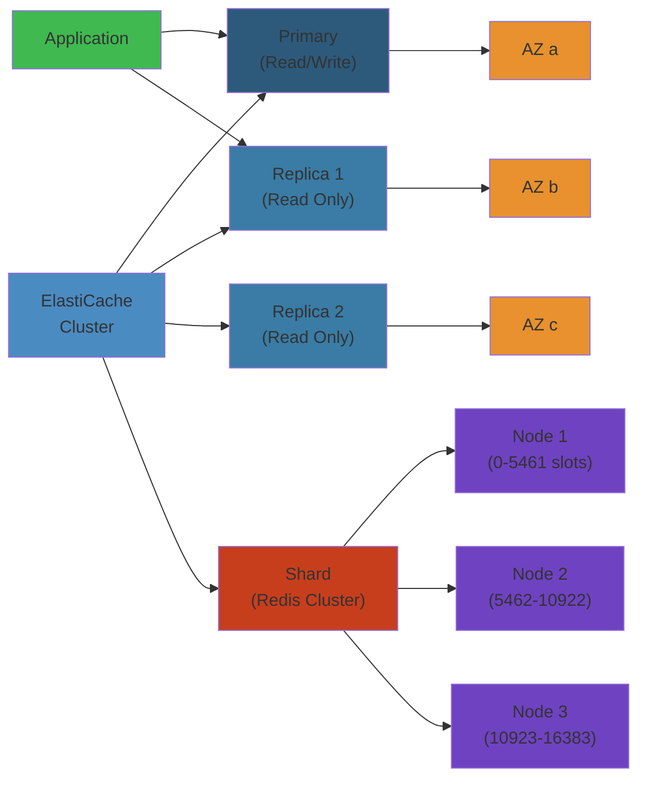

# ⚡💾 Amazon ElastiCache — Complete Deep Dive

**Related**: [RDS](../rds/01-rds-deep-dive.md) · [EC2](../ec2/01-ec2-deep-dive.md) · [CloudWatch](../cloudwatch/01-cloudwatch-deep-dive.md) · [IAM](../iam/01-iam-deep-dive.md)

---




## Table of Contents

- [The Big Picture](#-the-big-picture)
- [1. Redis vs Memcached](#1-redis-vs-memcached)
- [2. Cluster Modes](#2-cluster-modes)
- [3. Replication](#3-replication)
- [4. Persistence](#4-persistence)
- [5. Backup/Restore](#5-backuprestore)
- [6. Parameter Groups](#6-parameter-groups)
- [7. Security Groups](#7-security-groups)
- [8. Subnet Groups](#8-subnet-groups)
- [9. Auto-Failover](#9-auto-failover)
- [10. Use Cases](#10-use-cases)
- [Simplest Mental Model](#-simplest-mental-model)

---

## 🧭 The Big Picture

```text
                    ┌──────────────────────────────┐
                    │      Amazon ElastiCache       │
                    │      (In-Memory Caching)       │
                    ├──────────────────────────────┤
                    │ • Managed Redis & Memcached   │
                    │ • Sub-millisecond latency     │
                    │ • Fully managed (patching,    │
                    │   backups, failover)          │
                    └──────────────┬───────────────┘
                                   │
            ┌──────────────────────┼──────────────────────┐
            ▼                      ▼                      ▼
    ┌──────────────┐      ┌──────────────┐      ┌──────────────┐
    │  Caching     │      │  High Avail  │      │  Security    │
    │ • Session    │      │ • Replication│      │ • Encryption │
    │ • DB query   │      │ • Multi-AZ   │      │ • Auth token │
    │ • API resp   │      │ • Auto-fail  │      │ • VPC        │
    └──────────────┘      └──────────────┘      └──────────────┘
```

---

## 1. Redis vs Memcached

### Feature Comparison

| Feature | Redis (ElastiCache) | Memcached |
|---------|--------------------|-----------|
| **Data structures** | String, Hash, List, Set, Sorted Set, Streams, Bitmaps | Simple key-value (strings) |
| **Persistence** | ✅ AOF + RDB snapshots | ❌ No persistence |
| **Replication** | ✅ Multi-AZ, replicas | ❌ No replication |
| **Cluster mode** | ✅ Sharding (up to 500 nodes) | ❌ No native sharding |
| **Lua scripting** | ✅ | ❌ |
| **Pub/Sub** | ✅ | ❌ |
| **Transactions** | ✅ MULTI/EXEC | ❌ |
| **TTL** | ✅ Per key | ✅ Per key |
| **Max key size** | 512 MB | 1 MB |
| **Multi-threaded** | ⚠️ Partially (Redis 7+) | ✅ Fully |
| **Use case** | Complex caching, sessions, queues | Simple, high-throughput caching |

### Performance Comparison

```text
Throughput (GET/SET operations/sec):

Redis (single node):
  GET:   ~100,000 ops/s (1KB values)
  SET:   ~100,000 ops/s

Redis (cluster, 3 shards):
  GET:   ~300,000 ops/s
  SET:   ~300,000 ops/s

Memcached (single node):
  GET:   ~200,000 ops/s
  SET:   ~200,000 ops/s

Latency: Both < 1ms (in-region, same AZ)
```

### When to Choose

```text
Choose REDIS when:
  ✓ Need persistence (cache as source of truth)
  ✓ Need complex data types (queues, leaderboards)
  ✓ Need replication for high availability
  ✓ Need clustering for scaling
  ✓ Need Pub/Sub or sorted sets

Choose MEMCACHED when:
  ✓ Simple key-value caching only
  ✓ Need multi-threaded throughput
  ✓ No persistence needed
  ✓ No replication required
  ✓ Cost-sensitive (simpler = cheaper)
```

---

## 2. Cluster Modes

### Redis Cluster Mode Disabled

```text
┌──────────────────────────────────────┐
│ Cluster Mode: Disabled               │
│                                      │
│  ┌──────────────┐   Read/Write      │
│  │  Primary     │◄───────────────── │
│  │  (writes)    │                    │
│  └──────┬───────┘                    │
│         │ Async replication          │
│         ▼                            │
│  ┌──────────────┐    Read-only      │
│  │  Replica x 1 │◄───────────────── │
│  │  (reads)     │                    │
│  └──────────────┘                    │
│                                      │
│  • 1 primary + up to 5 replicas     │
│  • All data on one shard            │
│  • Max 1 node group                  │
│  • For smaller workloads             │
└──────────────────────────────────────┘
```

### Redis Cluster Mode Enabled

```text
┌──────────────────────────────────────────────┐
│ Cluster Mode: Enabled                         │
│                                                │
│  ┌──────────────┐  ┌──────────────┐  ┌──────┐ │
│  │ Shard 1      │  │ Shard 2      │  │Shard3│ │
│  │ ┌──┐ ┌──┐   │  │ ┌──┐ ┌──┐   │  │ ┌──┐ │ │
│  │ │P1│ │R1│   │  │ │P2│ │R2│   │  │ │P3│ │ │
│  │ └──┘ └──┘   │  │ └──┘ └──┘   │  │ └──┘ │ │
│  └──────┬───────┘  └──────┬───────┘  └──────┘ │
│         │                 │                    │
│         ▼                 ▼                    │
│  ┌──────────────────────────────────────┐    │
│  │       16384 hash slots                 │    │
│  │  Slots 0-5460: Shard 1               │    │
│  │  Slots 5461-10922: Shard 2            │    │
│  │  Slots 10923-16383: Shard 3           │    │
│  └──────────────────────────────────────┘    │
│                                                │
│  • 1-500 nodes (1-250 shards * 2 replicas)    │
│  • Auto-sharding via hash slots               │
│  • Scale horizontally by adding shards        │
│  • No cross-slot operations (MGET across keys)│
└────────────────────────────────────────────────┘
```

### Sharding Example

```redis
# Keys are hashed to determine shard
SET user:1234 "John"      # Slot 1234 → Shard 1
SET order:5678 "Details"  # Slot 5678 → Shard 2
SET session:9012 "token"  # Slot 9012 → Shard 3

# Cross-slot operation (FAILS in cluster mode):
MGET user:1234 order:5678
# -> MOVED error (different slots)

# Solution: Use hash tags
MGET {user}:1234 {user}:5678  # Same hash slot
```

---

## 3. Replication

### Multi-AZ Replication

```text
Redis Replication Group (Multi-AZ enabled):
                       Writes
                         │
                         ▼
┌─────────────────────────┐
│ Primary (AZ-a)          │
│ ┌───────────────────┐   │
│ │ All data (R/W)    │   │
│ └────────┬──────────┘   │
└──────────┼──────────────┘
           │ Async replication
     ┌─────┼─────┐
     │     │     │
     ▼     ▼     ▼
┌────────┐ ┌────────┐ ┌────────┐
│Replica │ │Replica │ │Replica │
│(AZ-b)  │ │(AZ-b)  │ │(AZ-c)  │
│Read-only│ │Read-only│ │Read-only│
└────────┘ └────────┘ └────────┘
```

### Replica Reads

```text
Application        Primary          Replica
   │                 │                 │
   │ SET user:1      │                 │
   │────────────────►│                 │
   │                 │ Replicate       │
   │                 │────────────────►│
   │                 │                 │
   │ GET user:1      │                 │
   │ (read from      │                 │
   │  replica)       │                 │
   │──────────────────────────────────►│
   │◄─────────────────────────────────│
   │                 │                 │
   │ ⚠️ Stale read possible!          │
   │ Replica may lag by milliseconds  │
```

---

## 4. Persistence

### RDB Snapshots

```text
RDB (Redis Database Backup):
┌──────────────────────────────────────────────┐
│ Snapshot every N minutes if M keys changed    │
│                                                │
│  Example: save 60 1000                        │
│  → Snapshot every 60 seconds if ≥1000 writes  │
│                                                │
│  ┌──────┐  ┌──────┐  ┌──────┐  ┌──────┐       │
│  │ RDB  │  │ RDB  │  │ RDB  │  │ RDB  │       │
│  │ t=0  │  │ t=60 │  │ t=120│  │ t=180│       │
│  └──────┘  └──────┘  └──────┘  └──────┘       │
│                                                │
│  Pros: Fast recovery, compact                  │
│  Cons: Data loss between snapshots            │
└────────────────────────────────────────────────┘
```

### AOF (Append-Only File)

```text
AOF Persistence:
┌──────────────────────────────────────────────┐
│ Every write operation logged to AOF file      │
│                                                │
│  SET user:1 "John"          → written         │
│  SET user:2 "Jane"          → written         │
│  DEL user:1                 → written         │
│                                                │
│  Rewrite (auto):                              │
│  ┌────────┐  ┌────────┐  ┌────────┐          │
│  │ AOF v1 │─►│ AOF v2 │─►│ AOF v3 │          │
│  │ 500MB  │  │ 250MB  │  │ 120MB  │          │
│  └────────┘  └────────┘  └────────┘          │
│  (Compacts by merging operations)             │
│                                                │
│  fsync options:                               │
│  • always  → safest, slowest                  │
│  • everysec → default (up to 1s data loss)    │
│  • no      → fastest, OS decides              │
└────────────────────────────────────────────────┘
```

### Persistence Comparison

| Aspect | RDB | AOF | AOF+RDB (mixed) |
|--------|-----|-----|------------------|
| Data loss | Up to last snapshot | Up to 1 sec (everysec) | Minimal |
| File size | Compact | Large (compacted via rewrite) | Medium |
| Recovery speed | Fast | Slow (replay) | Fast |
| Performance impact | Fork on save | Per-write (fsync) | Balanced |

---

## 5. Backup/Restore

### Automated Backups

```text
┌──────────────────────────────────────────────┐
│ Automated Backup (RDB snapshot to S3)         │
│                                                │
│  Retention: 1-35 days                         │
│  Window: configurable (e.g., 03:00-05:00)     │
│                                                │
│  Timeline:                                    │
│  ────┬───────┬───────┬───────┬───────┬───►     │
│      │       │       │       │       │          │
│    Daily backups → S3 (RDB file)               │
│                                                │
│  Cluster mode: one backup per shard           │
│  Restore: creates new cluster from backup     │
└────────────────────────────────────────────────┘
```

### Backup/Restore CLI

```awscli
# Create manual snapshot
aws elasticache create-snapshot \
  --replication-group-id my-redis-cluster \
  --snapshot-name pre-upgrade-backup

# Copy snapshot across regions
aws elasticache copy-snapshot \
  --source-snapshot-name my-backup \
  --target-snapshot-name my-backup-copy \
  --target-bucket backup-bucket-eu-west-1

# Restore from snapshot
aws elasticache create-cache-cluster \
  --cache-cluster-id restored-cluster \
  --snapshot-name my-backup \
  --cache-node-type cache.r6g.large \
  --engine redis \
  --num-cache-nodes 1
```

### Seed a New Cluster

```text
1. Export snapshot to S3
2. Download RDB file
3. Use with Redis: docker run redis /data/dump.rdb
4. Or upload to S3 in target region and restore

Use case: Pre-populate a dev cluster with
production data (sanitized).
```

---

## 6. Parameter Groups

### Custom Parameter Group

```json
{
  "CacheParameterGroupName": "my-redis-optimized",
  "CacheParameterGroupFamily": "redis7",
  "Description": "Optimized for write-heavy workload",
  "Parameters": {
    "maxmemory-policy": "allkeys-lru",
    "activedefrag": "yes",
    "active-defrag-threshold-lower": "10",
    "active-defrag-threshold-upper": "100",
    "active-defrag-cycle-min": "5",
    "active-defrag-cycle-max": "75",
    "lfu-log-factor": "10",
    "lfu-decay-time": "1",
    "timeout": "300",
    "tcp-keepalive": "300",
    "save": "900 1 300 10 60 10000"
  }
}
```

### Key Parameters

| Parameter | Default | Description |
|-----------|---------|-------------|
| `maxmemory-policy` | volatile-lru | Eviction policy when memory full |
| `timeout` | 0 | Connection close after idle seconds |
| `tcp-keepalive` | 300 | TCP keepalive interval |
| `activedefrag` | no | Automatic memory defragmentation |
| `reserved-memory` | 0 | Reserved memory per node (for OS) |
| `lfu-log-factor` | 10 | LFU counter growth rate |
| `save` | 900 1 300 10 60 10000 | RDB snapshot frequency |

### Eviction Policies

```text
maxmemory-policy options:

noeviction         ❌ Can't write when full (errors)
allkeys-lru        ✅ Evict least recently used keys
allkeys-lfu        ✅ Evict least frequently used keys
volatile-lru       ✅ Evict LRU keys with TTL
volatile-lfu       ✅ Evict LFU keys with TTL
allkeys-random     ✅ Evict random keys
volatile-random    ✅ Evict random keys with TTL
volatile-ttl       ✅ Evict keys with shortest TTL

Recommended: allkeys-lru for most caching workloads
             noeviction for persistent/critical data
```

---

## 7. Security Groups

### ElastiCache Security Model

```text
┌──────────────────────────────────────────────┐
│ Security Groups & Encryption                   │
│                                                │
│  VPC Security Group (Required):               │
│    Inbound: Redis 6379 from app security group│
│                                                  │
│  Encryption in Transit (TLS):                 │
│    • Enforce TLS between app and ElastiCache   │
│    • Redis AUTH token required                 │
│    • Port changes to 6379 (TLS)                │
│                                                  │
│  Encryption at Rest (KMS):                    │
│    • Encrypt RDB snapshots in S3              │
│    • Encrypt data on disk                     │
│    • AWS-managed or customer-managed CMK      │
│                                                  │
│  Redis AUTH:                                  │
│    • Token required for every connection      │
│    • redis-cli -a <token>                     │
│    • App config: password=<token>             │
└────────────────────────────────────────────────┘
```

### Security Group Rules

```json
{
  "IpPermissions": [
    {
      "IpProtocol": "tcp",
      "FromPort": 6379,
      "ToPort": 6379,
      "UserIdGroupPairs": [
        {
          "GroupId": "sg-app-tier",
          "Description": "App servers accessing ElastiCache"
        }
      ]
    }
  ]
}
```

---

## 8. Subnet Groups

### Subnet Group Purpose

```text
VPC (10.0.0.0/16)
┌──────────────────────────────────────────────┐
│                                              │
│  ┌────── AZ-a ──────┐ ┌────── AZ-b ──────┐  │
│  │ Subnet: 10.0.1.0/24│ │ Subnet: 10.0.2.0/24│  │
│  │ (cache-private-a)  │ │ (cache-private-b)  │  │
│  └────────────────────┘ └────────────────────┘  │
│                                              │
│  Subnet Group "my-cache-subnet-group":        │
│  Contains: subnet-private-a, subnet-private-b│
│                                              │
│  ElastiCache nodes distribute across these   │
│  subnets for Multi-AZ redundancy             │
└──────────────────────────────────────────────┘
```

### CLI

```awscli
# Create subnet group
aws elasticache create-cache-subnet-group \
  --cache-subnet-group-name my-cache-subnet-group \
  --cache-subnet-group-description "Redis subnet group" \
  --subnet-ids subnet-abc123 subnet-def456

# Create cluster with subnet group
aws elasticache create-cache-cluster \
  --cache-cluster-id my-redis \
  --cache-subnet-group-name my-cache-subnet-group \
  --cache-node-type cache.r6g.large \
  --engine redis \
  --num-cache-nodes 2
```

---

## 9. Auto-Failover

### Failover Flow

```text
Primary node failure detected
        │
        ▼
┌───────────────────────┐
│ Health check fails    │
│ (30s grace period)    │
└──────────┬────────────┘
           │
           ▼
┌───────────────────────┐
│ Replica election      │
│ (new primary picked)  │
└──────────┬────────────┘
           │
           ▼
┌───────────────────────┐
│ DNS CNAME update      │
│ to new primary        │
└──────────┬────────────┘
           │
           ▼
┌───────────────────────┐
│ Application reconnects│
│ (transparent)         │
└──────────┬────────────┘
           │
           ▼
┌───────────────────────┐
│ Old primary recovers  │
│ → becomes replica     │
└───────────────────────┘
```

### Requirements for Auto-Failover

```text
Redis Cluster Mode ENABLED:
  • Requires at least 2 shards with 1+ replica each
  • Multi-AZ automatically enabled
  • Auto-failover built-in via Redis cluster protocol

Redis Cluster Mode DISABLED:
  • Multi-AZ must be ENABLED on replication group
  • Requires at least 1 replica node
  • Replica must be in different AZ than primary
```

### Failover Initiation

```awscli
# Manual failover (for testing)
aws elasticache test-failover \
  --replication-group-id my-redis \
  --node-group-id 0001
```

---

## 10. Use Cases

### Caching Patterns

```text
Lazy Caching (Cache-Aside):
  Application                     Redis                Database
      │                            │                    │
      │ GET user:123               │                    │
      │───────────────────────────►│                    │
      │◄── MISS (nil)             │                    │
      │                            │                    │
      │ SELECT * FROM users        │                    │
      │ WHERE id=123               │───────────────────►│
      │◄───────────────────────────│                    │
      │                            │                    │
      │ SET user:123 result        │                    │
      │ (TTL: 300s)               │                    │
      │───────────────────────────►│                    │
      │                            │                    │
      │ Return result              │                    │
      │                            │                    │

Write-Through:
  SET user:123 → Write to Redis → Write to DB

Write-Behind (Async):
  Write to Redis → Async write to DB (via SQS/Lambda)
```

### Common Patterns

| Pattern | Description | TTL |
|---------|-------------|-----|
| **Session store** | User session data (cart, auth) | 30-60 min |
| **DB query cache** | Cache expensive queries | 5-15 min |
| **Rate limiting** | INCR + EXPIRE for request counting | 1-60 sec |
| **Leaderboard** | ZADD/ZRANGE for sorted scores | Persistent |
| **Message queue** | LPUSH/BRPOP for task processing | Until consumed |
| **Distributed lock** | SETNX + EXPIRE for mutual exclusion | 10-30 sec |
| **Geospatial** | GEOADD/GEORADIUS for location data | Variable |

### Real-World Example: DB Query Cache

```python
import redis
import json

cache = redis.Redis(
    host="my-redis.xxxxxx.ng.0001.use1.cache.amazonaws.com",
    port=6379,
    decode_responses=True
)

def get_user_orders(user_id: str):
    cache_key = f"orders:{user_id}"

    # Try cache first (Lazy Caching)
    cached = cache.get(cache_key)
    if cached:
        return json.loads(cached)

    # Cache miss — query database
    orders = db.query("SELECT * FROM orders WHERE user_id = %s", user_id)
    result = [order.to_dict() for order in orders]

    # Cache for 5 minutes
    cache.setex(cache_key, 300, json.dumps(result))
    return result

def invalidate_user_orders(user_id: str):
    """Call this when user creates a new order"""
    cache.delete(f"orders:{user_id}")
```

### Session Store with Redis

```python
# Session handling with Redis
from datetime import timedelta

class SessionStore:
    def __init__(self, redis_client):
        self.redis = redis_client

    def create_session(self, session_id: str, user_data: dict):
        self.redis.hset(f"session:{session_id}", mapping=user_data)
        self.redis.expire(f"session:{session_id}", timedelta(hours=2))

    def get_session(self, session_id: str):
        data = self.redis.hgetall(f"session:{session_id}")
        if not data:
            return None
        # Refresh TTL on access
        self.redis.expire(f"session:{session_id}", timedelta(hours=2))
        return data

    def delete_session(self, session_id: str):
        self.redis.delete(f"session:{session_id}")
```

---

## 🧠 Simplest Mental Model

```text
REDIS            =  A super-fast notebook (in-memory) where
                    everything is stored as typed data.
                    Can remember complex things: lists,
                    sets, sorted rankings.

MEMCACHED        =  A simple scratch pad. Write a note,
                    read a note. If power goes out,
                    notes are gone. Very simple and fast.

CLUSTER MODE     =  Instead of one notebook, split your data
                    across multiple notebooks by topic.
                    "A-M" in notebook 1, "N-Z" in notebook 2.

REPLICATION      =  A photocopier for your notebook.
                    Primary is the original. Replicas are
                    copies you can read from.

PERSISTENCE      =  Taking a photo (RDB) or writing a diary
                    (AOF) of your notebook so if it burns
                    down, you can recreate it.

AUTO-FAILOVER    =  If the primary notebook owner gets sick,
                    a replica takes over automatically.
                    No one notices the switch.

PARAMETER GROUP  =  Settings for how your notebook works:
                    • How long to keep sticky notes (TTL)
                    • What to throw away when full (LRU)
                    • How often to take photos (save)

EVICTION         =  When your notebook is full, you have to
   POLICY           throw stuff away. LRU = throw oldest.
                    LFU = throw least used. TTL = throw
                    expiring items first.
```

---

**Next**: [CloudWatch Deep Dive](../cloudwatch/01-cloudwatch-deep-dive.md) — Monitoring and observability
