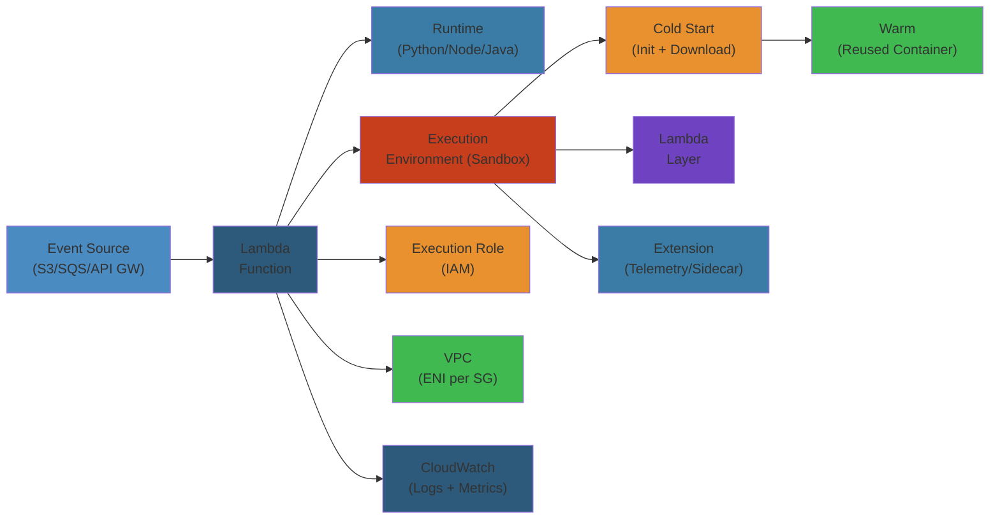
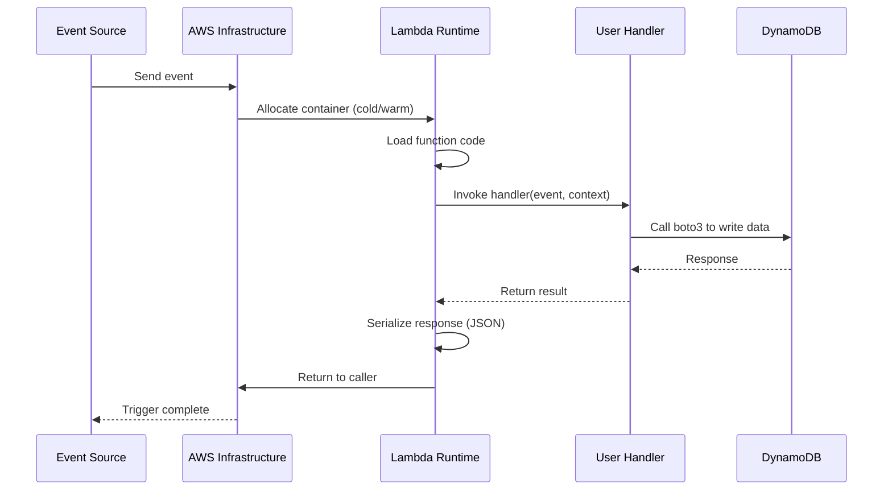

# ⚡ AWS Lambda — Complete Deep Dive

**Related**: [API Gateway](../api-gateway/01-api-gateway.md) · [S3](../s3/01-s3-deep-dive.md) · [CloudWatch](../cloudwatch/01-cloudwatch-deep-dive.md) · [DynamoDB](../dynamodb/01-dynamodb-deep-dive.md)

---




## Table of Contents

#### Step-by-Step
1. Process input
2. Validate
3. Execute
4. Return result

#### Code Example
```python
# Example implementation
pass
```

#### Real-World Scenario
This pattern is commonly used in production systems.


- [The Big Picture](#-the-big-picture)
- [1. Function Configuration](#1-function-configuration)
- [2. Triggers](#2-triggers)
- [3. Event Source Mapping](#3-event-source-mapping)
- [4. Layers](#4-layers)
- [5. VPC Integration](#5-vpc-integration)
- [6. Cold Starts](#6-cold-starts)
- [7. Reserved Concurrency](#7-reserved-concurrency)
- [8. Provisioned Concurrency](#8-provisioned-concurrency)
- [9. Destinations](#9-destinations)
- [10. Versions & Aliases](#10-versions--aliases)
- [11. Best Practices](#11-best-practices)
- [Simplest Mental Model](#-simplest-mental-model)

---

## 🧭 The Big Picture

#### Step-by-Step
1. Process input
2. Validate
3. Execute
4. Return result

#### Code Example
```python
# Example implementation
pass
```

#### Real-World Scenario
This pattern is commonly used in production systems.


```text
                     ┌─────────────────────────┐
                     │        AWS Lambda        │
                     │   Run code without       │
                     │   provisioning servers   │
                     ├─────────────────────────┤
                     │   • Event-driven         │
                     │   • Pay per invocation   │
                     │   • Auto-scaling         │
                     │   • Max 15 min execution │
                     └─────────────────────────┘
                                │
          ┌─────────────────────┼─────────────────────┐
          ▼                     ▼                     ▼
  ┌──────────────┐     ┌──────────────┐     ┌──────────────┐
  │  Triggers    │     │  Execution   │     │  Deployment  │
  │ • S3/SQS/SNS│     │  • Cold start│     │  • Versions  │
  │ • API GW    │     │  • Warm pool │     │  • Aliases   │
  │ • DynamoDB  │     │  • Concurrency│    │  • Layers    │
  │ • EventBridge│    │  • Throttle  │     │  • Container │
  └──────────────┘     └──────────────┘     └──────────────┘
```

---

## 1. Function Configuration

#### Step-by-Step
1. Process input
2. Validate
3. Execute
4. Return result

#### Code Example
```python
# Example implementation
pass
```

#### Real-World Scenario
This pattern is commonly used in production systems.


### Core Configuration

#### Step-by-Step
1. Process input
2. Validate
3. Execute
4. Return result

#### Code Example
```python
# Example implementation
pass
```

#### Real-World Scenario
This pattern is commonly used in production systems.


```text
┌──────────────────────────────────────────────────┐
│              Lambda Function                       │
├──────────────────────────────────────────────────┤
│  Name                : my-processor-function       │
│  Runtime             : Python 3.12 / Node.js 20   │
│  Architecture        : x86_64 | arm64 (Graviton)  │
│  Handler             : app.lambda_handler          │
│  Memory (MB)         : 128 - 10,240               │
│  Timeout (seconds)   : 1 - 900 (15 min)           │
│  Ephemeral Storage   : 512 MB - 10,240 MB         │
│  IAM Role            : lambda-execution-role      │
│  VPC                 : optional (VPC config)      │
│  DLQ/Destination     : SQS/SNS/EventBridge        │
└──────────────────────────────────────────────────┘
```

### Memory vs CPU Allocation

#### Step-by-Step
1. Process input
2. Validate
3. Execute
4. Return result

#### Code Example
```python
# Example implementation
pass
```

#### Real-World Scenario
This pattern is commonly used in production systems.


```text
Memory (MB)    CPU Allocation
─────────────────────────────
128            ~1% of 1 vCPU (burst)
512            ~10% of 1 vCPU
1024           ~20% of 1 vCPU
1536           ~30% of 1 vCPU
1792           ~1 full vCPU (threshold)
2048           ~1 full vCPU
3008           ~1.5 vCPUs
4096           ~2 vCPUs
5120           ~2.5 vCPUs
6144           ~3 vCPUs
7168           ~3.5 vCPUs
8192           ~4 vCPUs
10240          ~6 vCPUs

NOTE: CPU scales linearly with memory
      up to 1792 MB where you get 1 vCPU.
```

### Handler Signature (Python)

#### Step-by-Step
1. Process input
2. Validate
3. Execute
4. Return result

#### Code Example
```python
# Example implementation
pass
```

#### Real-World Scenario
This pattern is commonly used in production systems.


```python
# handler.py
import json
import os

def lambda_handler(event, context):
    """
    event:   Dict — event data from trigger
    context: Context object with runtime info
    """

    # Context methods
    function_name = context.function_name
    function_version = context.function_version
    invoked_function_arn = context.invoked_function_arn
    aws_request_id = context.aws_request_id
    log_group_name = context.log_group_name
    log_stream_name = context.log_stream_name
    memory_limit_in_mb = context.memory_limit_in_mb
    remaining_time_ms = context.get_remaining_time_in_millis()
    identity = context.identity  # Cognito identity
    client_context = context.client_context

    return {
        "statusCode": 200,
        "body": json.dumps({"message": "Hello from Lambda!"})
    }
```

### Step-by-Step

#### Step-by-Step
1. Process input
2. Validate
3. Execute
4. Return result

#### Code Example
```python
# Example implementation
pass
```

#### Real-World Scenario
This pattern is commonly used in production systems.


1. **Function deployment**: Upload code + dependencies to AWS Lambda and configure memory/timeout
2. **Event arrival**: Event source (S3, API Gateway, SQS) sends event to Lambda
3. **Container allocation**: AWS allocates a container (cold start creates new one) or reuses warm container
4. **Handler invocation**: Lambda runtime loads code and calls your handler function with `event` and `context`
5. **Execution**: Handler code runs with given memory and CPU allocation
6. **Result return**: Handler returns response (must be JSON-serializable for API Gateway, can be any for async)

### Code Example

#### Step-by-Step
1. Process input
2. Validate
3. Execute
4. Return result

#### Code Example
```python
# Example implementation
pass
```

#### Real-World Scenario
This pattern is commonly used in production systems.


```python
import json
import boto3
import time
from datetime import datetime

# Initialize AWS clients (reused across warm invocations)
s3_client = boto3.client('s3')
dynamodb = boto3.resource('dynamodb')
table = dynamodb.Table('ProcessedEvents')

def lambda_handler(event, context):
    """
    Process S3 events and store in DynamoDB
    Triggered by S3 PUT events
    """
    print(f"Function: {context.function_name}, Version: {context.function_version}")
    print(f"Memory: {context.memory_limit_in_mb}MB, Remaining: {context.get_remaining_time_in_millis()}ms")
    
    try:
        # Parse S3 event
        bucket = event['Records'][0]['s3']['bucket']['name']
        key = event['Records'][0]['s3']['object']['key']
        
        # Download from S3
        response = s3_client.get_object(Bucket=bucket, Key=key)
        data = response['Body'].read().decode('utf-8')
        
        # Process data
        processed = {
            'event_id': context.aws_request_id,
            'bucket': bucket,
            'key': key,
            'size': len(data),
            'timestamp': datetime.utcnow().isoformat(),
            'processed_at': int(time.time() * 1000)
        }
        
        # Store in DynamoDB
        table.put_item(Item=processed)
        
        return {
            'statusCode': 200,
            'body': json.dumps({'message': 'Processed', 'event_id': context.aws_request_id})
        }
        
    except Exception as e:
        print(f"Error processing event: {str(e)}")
        return {
            'statusCode': 500,
            'body': json.dumps({'error': str(e)})
        }
```

### Real-World Scenario

#### Step-by-Step
1. Process input
2. Validate
3. Execute
4. Return result

#### Code Example
```python
# Example implementation
pass
```

#### Real-World Scenario
This pattern is commonly used in production systems.


A company had a Lambda that processed 100 events/second from SQS. With default 128MB memory (1% vCPU), JSON parsing took 500ms per event, causing timeouts. After increasing memory to 1792MB (1 vCPU), the same code executed in 50ms, reducing p99 latency from 15 seconds to 100ms and cutting invocation errors from 20% to 0.1%.

### Diagram

#### Step-by-Step
1. Process input
2. Validate
3. Execute
4. Return result

#### Code Example
```python
# Example implementation
pass
```

#### Real-World Scenario
This pattern is commonly used in production systems.




---

## 2. Triggers

#### Step-by-Step
1. Process input
2. Validate
3. Execute
4. Return result

#### Code Example
```python
# Example implementation
pass
```

#### Real-World Scenario
This pattern is commonly used in production systems.


### Common Trigger Sources

#### Step-by-Step
1. Process input
2. Validate
3. Execute
4. Return result

#### Code Example
```python
# Example implementation
pass
```

#### Real-World Scenario
This pattern is commonly used in production systems.


```text
SYNCHRONOUS (request-response):
┌──────────────┐     ┌────────┐
│ API Gateway  │────►│ Lambda │────► Response
│ (REST/HTTP)  │     └────────┘
└──────────────┘
┌──────────────┐     ┌────────┐
│ ALB          │────►│ Lambda │────► Response
└──────────────┘     └────────┘
┌──────────────┐     ┌────────┐
│ Lex / Alexa  │────►│ Lambda │────► Response
└──────────────┘     └────────┘

ASYNCHRONOUS (event-driven):
┌──────────────┐     ┌────────┐
│ S3 (PUT/COPY)│────►│ Lambda │────► Destinations
└──────────────┘     └────────┘
┌──────────────┐
│ SNS Topic    │────►│ Lambda │
└──────────────┘     └────────┘
┌──────────────┐
│ EventBridge  │────►│ Lambda │
│ (scheduled)  │     └────────┘
└──────────────┘

POLL-BASED (streams/queues):
┌──────────────┐     ┌────────┐
│ DynamoDB     │◄────│ Lambda │  (poll + process)
│ Streams      │     └────────┘
└──────────────┘
┌──────────────┐
│ Kinesis      │◄────│ Lambda │
└──────────────┘
┌──────────────┐
│ SQS Queue    │◄────│ Lambda │
└──────────────┘
```

---

## 3. Event Source Mapping

#### Step-by-Step
1. Process input
2. Validate
3. Execute
4. Return result

#### Code Example
```python
# Example implementation
pass
```

#### Real-World Scenario
This pattern is commonly used in production systems.


### SQS Event Source Mapping

#### Step-by-Step
1. Process input
2. Validate
3. Execute
4. Return result

#### Code Example
```python
# Example implementation
pass
```

#### Real-World Scenario
This pattern is commonly used in production systems.


```json
{
  "EventSourceMapping": {
    "EventSourceArn": "arn:aws:sqs:us-east-1:123456789012:my-queue",
    "FunctionName": "my-function",
    "Enabled": true,
    "BatchSize": 10,
    "MaximumBatchingWindowInSeconds": 5,
    "ScalingConfig": {
      "MaximumConcurrency": 2
    },
    "FilterCriteria": {
      "Filters": [
        {
          "Pattern": "{\"eventType\": [\"order_created\"]}"
        }
      ]
    }
  }
}
```

### DynamoDB Streams Mapping

#### Step-by-Step
1. Process input
2. Validate
3. Execute
4. Return result

#### Code Example
```python
# Example implementation
pass
```

#### Real-World Scenario
This pattern is commonly used in production systems.


```text
DynamoDB Table
       │
       ▼
┌──────────────────┐
│ DynamoDB Streams │── 24hr retention
│ (CDC stream)     │
└────────┬─────────┘
         │ Poll every 0-5s
         ▼
┌──────────────────┐
│ Lambda (ESM)     │
│ Batch size: 100  │
│ Parallel: 4      │
└────────┬─────────┘
         │
         ▼
┌──────────────────┐
│ Process records  │
│ • INSERT         │
│ • MODIFY         │
│ • REMOVE         │
└──────────────────┘
```

### SQS Batch Processing Flow

#### Step-by-Step
1. Process input
2. Validate
3. Execute
4. Return result

#### Code Example
```python
# Example implementation
pass
```

#### Real-World Scenario
This pattern is commonly used in production systems.


```python
import json

def lambda_handler(event, context):
    for record in event["Records"]:
        try:
            body = json.loads(record["body"])
            process(body)
        except Exception as e:
            # The message stays in the queue (visibility timeout)
            # After maxReceiveCount → DLQ
            print(f"Failed to process: {e}")
            raise

    # If all succeed, messages are deleted from queue
    return {"batchItemFailures": []}
```

---

## 4. Layers

#### Step-by-Step
1. Process input
2. Validate
3. Execute
4. Return result

#### Code Example
```python
# Example implementation
pass
```

#### Real-World Scenario
This pattern is commonly used in production systems.


### Layer Structure

#### Step-by-Step
1. Process input
2. Validate
3. Execute
4. Return result

#### Code Example
```python
# Example implementation
pass
```

#### Real-World Scenario
This pattern is commonly used in production systems.


```text
Layer Package Structure:
layer.zip
  └── python/
      ├── requests/
      │   ├── __init__.py
      │   └── ...
      ├── pandas/
      │   ├── __init__.py
      │   └── ...
      └── numpy/
          ├── __init__.py
          └── ...
```

### Usage

#### Step-by-Step
1. Process input
2. Validate
3. Execute
4. Return result

#### Code Example
```python
# Example implementation
pass
```

#### Real-World Scenario
This pattern is commonly used in production systems.


```awscli
# Publish layer
aws lambda publish-layer-version \
  --layer-name python-deps \
  --description "Python 3.12 deps: requests, pandas" \
  --zip-file fileb://layer.zip \
  --compatible-runtimes python3.12

# Attach layer to function
aws lambda update-function-configuration \
  --function-name my-function \
  --layers arn:aws:lambda:us-east-1:123456789012:layer:python-deps:3
```

### Layer Limits

#### Step-by-Step
1. Process input
2. Validate
3. Execute
4. Return result

#### Code Example
```python
# Example implementation
pass
```

#### Real-World Scenario
This pattern is commonly used in production systems.


| Limit | Value |
|-------|-------|
| Max layers per function | 5 |
| Max unzipped size | 250 MB (all layers + function) |
| Max zip file | 50 MB (direct upload) / 250 MB (S3) |
| Layer versions kept | 100 (max per layer) |

---

## 5. VPC Integration

#### Step-by-Step
1. Process input
2. Validate
3. Execute
4. Return result

#### Code Example
```python
# Example implementation
pass
```

#### Real-World Scenario
This pattern is commonly used in production systems.


### VPC-Attached Lambda

#### Step-by-Step
1. Process input
2. Validate
3. Execute
4. Return result

#### Code Example
```python
# Example implementation
pass
```

#### Real-World Scenario
This pattern is commonly used in production systems.


```text
Without VPC:                        With VPC:
┌──────────┐                       ┌──────────┐
│ Lambda   │──► Internet           │ Lambda   │──► ENI
│ (public) │                       │ (VPC)    │    │
└──────────┘                       └──────────┘    │
                                                   ▼
                                           ┌──────────────────┐
                                           │ VPC Subnet       │
                                           │ (private)        │
                                           └────────┬─────────┘
                                                    │
                                           ┌────────▼─────────┐
                                           │  RDS / ElastiCache│
                                           │  (private)        │
                                           └──────────────────┘

To access Internet + VPC:
        Lambda → NAT Gateway → IGW → Internet
```

### VPC Configuration

#### Step-by-Step
1. Process input
2. Validate
3. Execute
4. Return result

#### Code Example
```python
# Example implementation
pass
```

#### Real-World Scenario
This pattern is commonly used in production systems.


```json
{
  "VpcConfig": {
    "SubnetIds": [
      "subnet-abc123",
      "subnet-def456"
    ],
    "SecurityGroupIds": [
      "sg-789012"
    ]
  }
}
```

### Cold Start Impact of VPC

#### Step-by-Step
1. Process input
2. Validate
3. Execute
4. Return result

#### Code Example
```python
# Example implementation
pass
```

#### Real-World Scenario
This pattern is commonly used in production systems.


```text
Cold Start Time (approx)

Without VPC:  ~50-200ms overhead
With VPC (ENI creation):  ~5-15 seconds overhead
  ┌──────────────────────────────────────┐
  │ Lambda Execution Role needs:         │
  │ ec2:CreateNetworkInterface           │
  │ ec2:DescribeNetworkInterfaces        │
  │ ec2:DeleteNetworkInterface           │
  └──────────────────────────────────────┘

Mitigation: Hyperplane ENI (AWS-managed)
  • Pre-created ENIs reduce VPC cold start
  • Available since 2020 for most regions
  • Still adds ~1-3s to cold starts
```

---

## 6. Cold Starts

#### Step-by-Step
1. Process input
2. Validate
3. Execute
4. Return result

#### Code Example
```python
# Example implementation
pass
```

#### Real-World Scenario
This pattern is commonly used in production systems.


### Cold Start Anatomy

#### Step-by-Step
1. Process input
2. Validate
3. Execute
4. Return result

#### Code Example
```python
# Example implementation
pass
```

#### Real-World Scenario
This pattern is commonly used in production systems.


```text
INIT Phase (cold start)                    INVOKE Phase (warm)
┌────────────────────┐                     ┌────────────────────┐
│ 1. Download code   │  (~50-200ms)        │ Execute handler    │
│ 2. Start runtime   │  (~100-300ms)       │ (function code)    │
│ 3. Init extensions │  (~0-100ms)         └────────────────────┘
│ 4. Init handler    │  (~0-500ms)         Duration: ~10-100ms
│    (global scope)  │
└─────────┬──────────┘
          │
    Total cold start: 0.2s - 10s+

Warm start: ~1-10ms (init skipped)
```

### Cold Start Duration by Runtime

#### Step-by-Step
1. Process input
2. Validate
3. Execute
4. Return result

#### Code Example
```python
# Example implementation
pass
```

#### Real-World Scenario
This pattern is commonly used in production systems.


| Runtime | Cold Start (approx) | Notes |
|---------|--------------------|-------|
| Python 3.12 | 50-100ms | Fastest |
| Node.js 20 | 100-200ms | Very fast |
| Go | 50-100ms | Compiled binary |
| Java 21 | 300ms-3s | JVM init |
| .NET 8 | 300ms-2s | JIT compilation |
| Ruby 3.2 | 100-300ms | Moderate |

### Mitigation Strategies

#### Step-by-Step
1. Process input
2. Validate
3. Execute
4. Return result

#### Code Example
```python
# Example implementation
pass
```

#### Real-World Scenario
This pattern is commonly used in production systems.


| Strategy | Impact | Cost Implication |
|----------|--------|-----------------|
| Provisioned Concurrency | Eliminates cold starts | Pay for idle concurrency |
| Smaller deployment package | Reduces download time | None |
| Minimize init code | Faster handler init | None |
| Graviton (arm64) | 10-20% faster | ~20% cheaper |
| Keep warm with scheduled invocations | Reduces frequency | Minimal (invocation cost) |
| Avoid VPC if possible | Eliminates ENI delay | None |
| Use SnapStart (Java) | 90% cold start reduction | Snapshot storage cost |

---

## 7. Reserved Concurrency

#### Step-by-Step
1. Process input
2. Validate
3. Execute
4. Return result

#### Code Example
```python
# Example implementation
pass
```

#### Real-World Scenario
This pattern is commonly used in production systems.


### How It Works

#### Step-by-Step
1. Process input
2. Validate
3. Execute
4. Return result

#### Code Example
```python
# Example implementation
pass
```

#### Real-World Scenario
This pattern is commonly used in production systems.


```text
Regional Concurrency Pool (e.g., 1000)
┌─────────────────────────────────────┐
│                                     │
│  Available: 150                     │
│                                     │
│  Function A (reserved: 200)         │
│  ┌──────────────────────────────┐   │
│  │   Can't exceed 200           │   │
│  └──────────────────────────────┘   │
│                                     │
│  Function B (reserved: 500)         │
│  ┌──────────────────────────────┐   │
│  │   Can't exceed 500           │   │
│  └──────────────────────────────┘   │
│                                     │
│  Function C: uses unreserved 150    │
│  Function D: uses unreserved 150    │
└─────────────────────────────────────┘

Reserved concurrency = 700 (A+B)
Available to others = 300
```

### Benefits

#### Step-by-Step
1. Process input
2. Validate
3. Execute
4. Return result

#### Code Example
```python
# Example implementation
pass
```

#### Real-World Scenario
This pattern is commonly used in production systems.


```text
Protection from runaway functions:
  Without Reserved (1000 pool):
    Function A (buggy, infinite loop) → Consumes 950
    Function B (production) → Throttled!

  With Reserved (200 for A, 500 for B):
    Function A → Limited to 200
    Function B → Has guaranteed 500
    No interference between functions
```

```awscli
aws lambda put-function-concurrency \
  --function-name my-function \
  --reserved-concurrent-executions 100
```

---

## 8. Provisioned Concurrency

#### Step-by-Step
1. Process input
2. Validate
3. Execute
4. Return result

#### Code Example
```python
# Example implementation
pass
```

#### Real-World Scenario
This pattern is commonly used in production systems.


### Provisioned vs Reserved

#### Step-by-Step
1. Process input
2. Validate
3. Execute
4. Return result

#### Code Example
```python
# Example implementation
pass
```

#### Real-World Scenario
This pattern is commonly used in production systems.


```text
Reserved Concurrency:
  Guarantees capacity but starts cold
  No warm instances maintained

Provisioned Concurrency:
  Guarantees capacity + warm instances ready
  Initializes before traffic arrives
  Additional cost (pay for warm instances)
```

### Application Auto Scaling

#### Step-by-Step
1. Process input
2. Validate
3. Execute
4. Return result

#### Code Example
```python
# Example implementation
pass
```

#### Real-World Scenario
This pattern is commonly used in production systems.


```json
{
  "ScalableTarget": {
    "ServiceNamespace": "lambda",
    "ResourceId": "function:my-function:prod",
    "ScalableDimension": "lambda:function:ProvisionedConcurrency",
    "MinCapacity": 10,
    "MaxCapacity": 100
  },
  "ScalingPolicy": {
    "TargetTrackingScalingPolicyConfiguration": {
      "TargetValue": 70.0,
      "PredefinedMetricSpecification": {
        "PredefinedMetricType": "LambdaProvisionedConcurrencyUtilization"
      }
    }
  }
}
```

### Warm Pool Lifecycle

#### Step-by-Step
1. Process input
2. Validate
3. Execute
4. Return result

#### Code Example
```python
# Example implementation
pass
```

#### Real-World Scenario
This pattern is commonly used in production systems.


```text
Provisioned Concurrency Warm Pool
        │
        ▼
┌───────────────────┐
│  INIT Phase       │── Code downloaded, runtime started
└─────────┬─────────┘
          │
          ▼
┌───────────────────┐
│  Handler init     │── Global scope executed
└─────────┬─────────┘
          │
          ▼
┌───────────────────┐
│  Ready for invoke │── Waiting for traffic
│  (warm)           │
└─────────┬─────────┘
          │
          ▼
┌───────────────────┐
│  Invoke handler   │── Actual execution
│  (no cold start)  │
└───────────────────┘
```

---

## 9. Destinations

#### Step-by-Step
1. Process input
2. Validate
3. Execute
4. Return result

#### Code Example
```python
# Example implementation
pass
```

#### Real-World Scenario
This pattern is commonly used in production systems.


### Destination Types

#### Step-by-Step
1. Process input
2. Validate
3. Execute
4. Return result

#### Code Example
```python
# Example implementation
pass
```

#### Real-World Scenario
This pattern is commonly used in production systems.


```text
On Success / On Failure
        │
        └── Can route to:
            ├── SQS Standard Queue
            ├── SNS Topic
            ├── Lambda (another function)
            └── EventBridge Event Bus
```

### Configuration

#### Step-by-Step
1. Process input
2. Validate
3. Execute
4. Return result

#### Code Example
```python
# Example implementation
pass
```

#### Real-World Scenario
This pattern is commonly used in production systems.


```json
{
  "EventInvokeConfig": {
    "FunctionName": "my-function",
    "Qualifier": "prod",
    "MaximumEventAgeInSeconds": 3600,
    "MaximumRetryAttempts": 2,
    "DestinationConfig": {
      "OnSuccess": {
        "Destination": "arn:aws:sqs:us-east-1:123456789012:success-queue"
      },
      "OnFailure": {
        "Destination": "arn:aws:sqs:us-east-1:123456789012:dlq-queue"
      }
    }
  }
}
```

### Async Invocation Flow with Destinations

#### Step-by-Step
1. Process input
2. Validate
3. Execute
4. Return result

#### Code Example
```python
# Example implementation
pass
```

#### Real-World Scenario
This pattern is commonly used in production systems.


```text
Invoke (async)
    │
    ▼
┌──────────────────┐
│ Lambda Service   │
│ • Enqueue event  │
│ • Return 202     │
└────────┬─────────┘
         │
         ▼
┌──────────────────┐
│ Retry (max 2)    │── After each failure, wait then retry
│ (1min, 2min)     │
└────────┬─────────┘
    │             │
  Success        Failure (after retries exhausted)
    │             │
    ▼             ▼
┌──────────┐ ┌──────────┐
│ OnSuccess│ │ OnFailure│
│ Destination│ │ Destination│
└──────────┘ └──────────┘
```

---

## 10. Versions & Aliases

#### Step-by-Step
1. Process input
2. Validate
3. Execute
4. Return result

#### Code Example
```python
# Example implementation
pass
```

#### Real-World Scenario
This pattern is commonly used in production systems.


### Versioning

#### Step-by-Step
1. Process input
2. Validate
3. Execute
4. Return result

#### Code Example
```python
# Example implementation
pass
```

#### Real-World Scenario
This pattern is commonly used in production systems.


```text
$LATEST (unstable, mutable)
    │
    ├── Publish → Version 1 (immutable)
    │
    ├── Update code
    │
    └── Publish → Version 2 (immutable)
    │
    ├── Update code
    │
    └── Publish → Version 3 (immutable)

Each version gets its own ARN with version number
and its own concurrency configuration.
```

### Aliases

#### Step-by-Step
1. Process input
2. Validate
3. Execute
4. Return result

#### Code Example
```python
# Example implementation
pass
```

#### Real-World Scenario
This pattern is commonly used in production systems.


```text
Aliases point to versions (can be changed):
┌─────────┐     ┌───────────┐
│  prod   │────►│ Version 3 │  (stable, tested)
└─────────┘     └───────────┘
┌─────────┐     ┌───────────┐
│  staging│────►│ Version 2 │  (pre-prod testing)
└─────────┘     └───────────┘
┌─────────┐     ┌───────────┐
│  dev    │────►│ Version 1 │  (development)
└─────────┘     └───────────┘
```

### Weighted Aliases (Canary Deployments)

#### Step-by-Step
1. Process input
2. Validate
3. Execute
4. Return result

#### Code Example
```python
# Example implementation
pass
```

#### Real-World Scenario
This pattern is commonly used in production systems.


```text
┌──────────┐
│  prod    │
└────┬─────┘
     │
     90% of traffic
     ├────────────────────────── Version 3 (stable)
     │
     10% of traffic
     ├────────────────────────── Version 4 (canary)

Controlled via routing config:
{
  "RoutingConfig": {
    "AdditionalVersionWeights": {
      "4": 0.1
    }
  }
}
```

---

## 11. Best Practices

#### Step-by-Step
1. Process input
2. Validate
3. Execute
4. Return result

#### Code Example
```python
# Example implementation
pass
```

#### Real-World Scenario
This pattern is commonly used in production systems.


### Performance

#### Step-by-Step
1. Process input
2. Validate
3. Execute
4. Return result

#### Code Example
```python
# Example implementation
pass
```

#### Real-World Scenario
This pattern is commonly used in production systems.


```do
├── Set memory based on workload needs (not minimum)
├── Initialize DB connections, HTTP clients outside handler
├── Use connection pooling for databases
├── Enable X-Ray tracing for observability
├── Keep deployment package under 10MB
├── Use arm64 (Graviton) for cost savings
└── Use SnapStart for Java functions

└── DON'T:
    ├── Don't store secrets in environment variables (use Secrets Manager)
    ├── Don't use /tmp for critical data (ephemeral)
    ├── Don't make synchronous calls without timeout
    └── Don't create recursive infinite loops
```

### Security

#### Step-by-Step
1. Process input
2. Validate
3. Execute
4. Return result

#### Code Example
```python
# Example implementation
pass
```

#### Real-World Scenario
This pattern is commonly used in production systems.


```text
┌──────────────────────────────────────────────┐
│ Lambda Security Checklist                     │
├──────────────────────────────────────────────┤
│ ☐ Use least privilege IAM execution role      │
│ ☐ Encrypt environment variables with KMS      │
│ ☐ Use private subnets when accessing RDS      │
│ ☐ Enable VPC flow logs for network monitoring  │
│ ☐ Use Lambda in a private API Gateway         │
│ ☐ Validate and sanitize all input events      │
│ ☐ Set function timeout to practical limit     │
│ ☐ Configure DLQ for failed async invocations  │
│ ☐ Enable AWS Config rules for Lambda          │
└──────────────────────────────────────────────┘
```

### Monitoring

#### Step-by-Step
1. Process input
2. Validate
3. Execute
4. Return result

#### Code Example
```python
# Example implementation
pass
```

#### Real-World Scenario
This pattern is commonly used in production systems.


```cloudwatch
# CloudWatch Metrics
Invocations — count of function invocations
Errors      — failed invocations count
Throttles   — requests throttled due to concurrency limits
Duration    — execution time in milliseconds
IteratorAge — stream-based functions (lag in ms)
ConcurrentExecutions — number of concurrent executions
ProvisionedConcurrencyUtilization — % of provisioned used
```

### Code Structure

#### Step-by-Step
1. Process input
2. Validate
3. Execute
4. Return result

#### Code Example
```python
# Example implementation
pass
```

#### Real-World Scenario
This pattern is commonly used in production systems.


```python
# ❌ BAD — global scope has expensive operations
import boto3
import json

# Database connection on every cold start
DB = boto3.resource("dynamodb").Table("my-table")

# ❌ BAD — heavy import at top level
import pandas as pd
import numpy as np
import tensorflow as tf

def lambda_handler(event, context):
    # Heavy init every cold start
    return {"status": "ok"}


# ✅ GOOD — lazy initialization
import boto3

def lambda_handler(event, context):
    table = get_table()  # cached after first cold start
    return table.get_item(Key={"id": event["id"]})

def get_table():
    if not hasattr(get_table, "table"):
        get_table.table = boto3.resource("dynamodb").Table("my-table")
    return get_table.table
```

---

## 🧠 Simplest Mental Model

#### Step-by-Step
1. Process input
2. Validate
3. Execute
4. Return result

#### Code Example
```python
# Example implementation
pass
```

#### Real-World Scenario
This pattern is commonly used in production systems.


```text
LAMBDA FUNCTION  =  A vending machine.
                    Put in event (coin) → get result (snack).
                    No one maintains the machine—
                    AWS keeps it running.

COLD START      =  First vending machine use of the day.
                    The machine spins up its cooling.
                    Takes a few seconds.

WARM START      =  Subsequent uses are instant.
                    The machine is already running.

CONCURRENCY     =  How many people can use the vending
                    machine simultaneously.
     Reserved   =  A machine just for your office.
     Provisioned = Machine is pre-stocked and ready
                    before lunch rush.

TRIGGERS        =  What causes the vending machine to dispense?
                    • Pulling the lever (API Gateway)
                    • Someone puts money in (S3 event)
                    • Every hour (EventBridge schedule)

DESTINATIONS    =  What happens after the snack drops?
                    On success → receipt prints
                    On failure → refund processed

LAYERS          =  Pre-packed supply crate for your machine.
                    Instead of stocking each item manually,
                    get a bulk supply of chips, soda, etc.

VERSIONS        =  Frozen recipe cards. V1 = original snacks.
                    V2 = new snacks. Aliases = signage
                    ("prod" = V2, "canary" = V3 for 10%).
```

---

## Interview Questions

#### Step-by-Step
1. Process input
2. Validate
3. Execute
4. Return result

#### Code Example
```python
# Example implementation
pass
```

#### Real-World Scenario
This pattern is commonly used in production systems.


### Beginner Level

#### Step-by-Step
1. Process input
2. Validate
3. Execute
4. Return result

#### Code Example
```python
# Example implementation
pass
```

#### Real-World Scenario
This pattern is commonly used in production systems.


**Q1: What is AWS Lambda and what are its key limitations?**

**Why interviewers ask this**: Tests understanding of serverless fundamentals — both benefits and constraints.

**Ideal answer structure**:
1. **What**: FaaS (Function as a Service) — run code without provisioning servers. Pay per invocation and duration.
2. **Benefits**: No servers, auto-scaling to thousands of concurrent executions, integrated with 200+ AWS services.
3. **Key limits**: 15-minute timeout, 10GB max memory, 6MB request/response payload (sync, 256KB for async), 1000 concurrent executions default (soft limit, can be raised), 512MB /tmp storage, 50MB zipped deployment package.
4. **Cold starts**: First invocation can take 0.5-5 seconds depending on runtime (Java/GraalVM slowest, Python/Node fastest, SnapStart helps).

**Common wrong answer**: "Lambda scales infinitely with no limits" — there are hard limits on concurrency, payload size, and execution duration.

**Q2**: What is a cold start and how do you mitigate it?

**Answer**: Cold start = time to create a new execution environment: 1) Download code (from S3 or container image). 2) Initialize runtime (Python/Node/Java). 3) Run initialization code outside handler. 4) Execute handler. Mitigations: 1) **Provisioned Concurrency** — keep N environments warm (expensive). 2) **Warmers** — CloudWatch Events pinging every 5 minutes (less reliable). 3) **SnapStart** (Java 11+) — snapshot microVM after init, restore on cold start (90% reduction). 4) **Minimize dependencies** — fewer jars/packages → smaller download. 5) **Use AWS Graviton** (arm64) — faster init, cheaper. 6) **Prefer Python/Node over Java** for latency-sensitive paths.

### Intermediate Level

#### Step-by-Step
1. Process input
2. Validate
3. Execute
4. Return result

#### Code Example
```python
# Example implementation
pass
```

#### Real-World Scenario
This pattern is commonly used in production systems.


**Q3: How does Lambda's synchronous invocation flow work end-to-end, including scaling and concurrency?**

**Answer**: 1) Invocation via API Gateway/ALB → Lambda service places request on internal queue. 2) Lambda service checks Reserved Concurrency → if exceeded, throttles with 429. 3) If capacity available, assigns an execution environment (sandbox) from the warm pool or creates a new one. 4) Sandbox runs handler with event, returns response. 5) Sandbox stays warm for ~5-15 minutes after last invocation (idle timeout). Scaling: Lambda starts with burst (500-3000 depending on region), then adds 500/min. Each sandbox processes one request at a time for sync invocations (concurrent requests = concurrent sandboxes). Provisioned Concurrency pre-creates sandboxes.

**Q4**: Compare Lambda with ECS Fargate. When would you use each?

**Answer**: **Lambda** — event-driven, short-lived (<15min), low volume, variable traffic, simple request-response. **Fargate** — long-running services (web servers, workers), predictable traffic patterns, need for larger resources (10GB+ memory), stateful workloads, container orchestration. Lambda auto-scales faster but has cold starts. Fargate ECS has constant latency but requires capacity planning. Cost: Lambda is cheaper for intermittent workloads (<10M invocations/month); Fargate is cheaper for steady-state high traffic. Choose Lambda for: webhooks, image processing, S3 events, IoT backends. Choose Fargate for: web APIs with consistent 1000+ RPS, ML inference, long-running streaming consumers.

### Senior Level

#### Step-by-Step
1. Process input
2. Validate
3. Execute
4. Return result

#### Code Example
```python
# Example implementation
pass
```

#### Real-World Scenario
This pattern is commonly used in production systems.


**Q5: Your Lambda function that processes S3 events is seeing high error rates and duplicate processing. Diagnose.**

**Why interviewers ask this**: Tests practical debugging of event-driven serverless architectures.

**Answer**: **Multiple issues possible**: 1) **S3 event notifications are at-least-once** — same event may be delivered multiple times. Add idempotency key (object ETag + event timestamp). 2) **Lambda retries** — on error, Lambda retries sync invocations 2x (3 total), async invocations 2x then DLQ. Check `X-Request-Id` for duplicate invocations. 3) **S3 PUT events** — an overwrite generates two events (PUT + potentially ETag mismatch with multipart upload). 4) **Concurrent overwrites** — two S3 PUTs → two Lambda invocations processing the same key simultaneously → race condition. Fix: DynamoDB idempotency table (check if `key+timestamp` processed). Use SQS FIFO queue as event source (deduplication). 5) **Error source**: check CloudWatch Logs for `Task timed out` (function duration > timeout) or out-of-memory (`/tmp` full).

**Q6**: Design a serverless real-time file processing pipeline. S3 bucket receives 10K files/minute, each 100MB. Files need to be validated, transformed, and loaded to Redshift.

**Answer**: 1) **S3 event → SQS queue** (buffer — decouple S3 → Lambda scaling). 2) **Lambda triggers on SQS**: batch of 10 messages, each processes one file (100MB). But Lambda has 15-min timeout and 10GB max memory — processing 100MB files may take 5-15 minutes. Idea: **split file processing into stages**: a) S3 event → Lambda (validation: schema check, file size, CRC) → write metadata to DynamoDB. b) **Step Functions** express workflow for transformation: parallel children map over file chunks (EC2/EMR for actual transformation), each writes to staging S3. c) **Redshift COPY** from staging S3 via `COPY` command or Spectrum. d) **Alternative**: use ECS Fargate tasks for transformation (100MB files fit better in 8GB+ container), triggered by SQS → EventBridge → ECS RunTask. 3) **Monitoring**: CloudWatch dashboard for SQS depth (buffer health), Lambda errors, Step Functions executions, Redshift load latency.

### Staff/Principal Level

#### Step-by-Step
1. Process input
2. Validate
3. Execute
4. Return result

#### Code Example
```python
# Example implementation
pass
```

#### Real-World Scenario
This pattern is commonly used in production systems.


**Q7: Your company has 500 Lambda functions across 10 microservices. Tracing a single request across these functions is nearly impossible. Design the observability strategy.**

**Why**: Tests ability to design observability for distributed serverless systems.

**Answer**: 1) **Distributed tracing**: AWS X-Ray with `AWS_DISTRIBUTED_TRACING_ENABLED=true`. Propagate trace ID via HTTP headers (API Gateway → Lambda → Step Functions → downstream). 2) **Structured logging**: JSON format with `correlationId`, `functionName`, `coldStart`, `memoryUsed`, `duration`. 3) **Centralized logging**: OpenSearch / CloudWatch Logs Insights with query patterns per trace ID. 4) **Enhanced monitoring**: Lambda Powertools (Python/TypeScript/Java) — auto-inject Lambda context into logs. 5) **Metrics**: Custom CloudWatch metrics: `ProcessingDuration`, `BatchSize`, `ErrorType` (timeout/memory/exception). 6) **Distributed trace across services**: SQS message attributes carry `TraceId`, propagated by Lambda Powertools. 7) **Step Functions tracing**: X-Ray integration for state machine executions — visualize entire workflow. 8) **Anti-patterns**: no correlated logging, inconsistent error codes, missing trace IDs in async invocations (SNS/SQS payloads must carry them).

**Q8**: Design a Lambda-based migration strategy to move a legacy monolithic Java application to serverless without downtime.

**Answer**: 1) **Strangler Fig pattern**: API Gateway routes traffic to both old monolith and new Lambda functions. 2) **Extract first**: Identify bounded contexts (e.g., user management, orders, payments). Extract the smallest, least-coupled one first (e.g., user management). 3) **Lambda composition**: Use Step Functions to orchestrate multiple Lambda functions for complex flows (order processing: validate → charge → ship). 4) **Data migration**: Dual-write strategy — monolith writes to both old and new DB (Neptune migration). 5) **Performance**: Use SnapStart for Java (init time reduction by 90%). Use Lambda Response Streaming for large payloads. 6) **Networking**: VPC Lambda with ENI per SG — limit to subnets that need DB access; use RDS Proxy to avoid connection storms. 7) **Gradual shift**: 5% → 25% → 50% → 100% traffic to Lambda, monitoring error rates, latency, and cost. 8) **Rollback**: Use canary deployments with Lambda aliases and weighted routing. Keep old monolith running at 0% desired capacity for fast rollback.

### Tricky Edge Cases

#### Step-by-Step
1. Process input
2. Validate
3. Execute
4. Return result

#### Code Example
```python
# Example implementation
pass
```

#### Real-World Scenario
This pattern is commonly used in production systems.


**Q9**: A Lambda function triggered by an S3 event writes output to the same S3 bucket. The function goes into infinite recursion and by the time it's stopped, you've incurred $10K in charges. How does this happen and how do you prevent it?

**Answer**: **Infinite recursion**: Lambda reads file from S3 → processes → writes result to same S3 bucket → result file triggers another Lambda invocation → repeats. Each invocation charges. Also: **S3 event amplification** — batch operations (multi-part uploads, incomplete multipart uploads, S3 replication events) generate multiple events. Prevention: 1) **Separate input/output buckets** — never read and write to the same bucket. 2) **Prefix/suffix filter** on S3 event notification (`prefix=incoming/`, `suffix=.input`). 3) **Reserved Concurrency = 1** for the function so only one invocation happens at a time (mitigation, not prevention). 4) **Budget alerts** — set CloudWatch Billing alarms at $100 threshold. 5) **DLQ on failure** — if something goes wrong, trap to DLQ. 6) **SQS queue between S3 and Lambda** — allows inspection and backpressure.

**Q10**: Lambda function running in a VPC with RDS. On cold start, the function times out connecting to RDS. Warm invocations work fine. Why?

**Answer**: **VPC cold start ENI creation delay**. Lambda creates an Elastic Network Interface (ENI) in your VPC on cold start — this takes 5-15 seconds. If the Lambda timeout is 3 seconds, the function times out before the ENI is ready. Also: **NAT Gateway** required for internet access from VPC Lambda (needs public subnet + NAT). The cold start + ENI setup + NAT route propagation + RDS connection creates a multi-second delay. Fix: 1) Increase Lambda timeout to 30+ seconds. 2) Use **RDS Proxy** — maintains connection pool so Lambda doesn't need to open new connections on each invocation. 3) Use **Provisioned Concurrency** to keep environments warm. 4) Use `Lambda-VPC` with managed NAT Gateway (not NAT instance). 5) Alternatively: move function outside VPC and use Secrets Manager + IAM database auth instead of direct VPC access.

