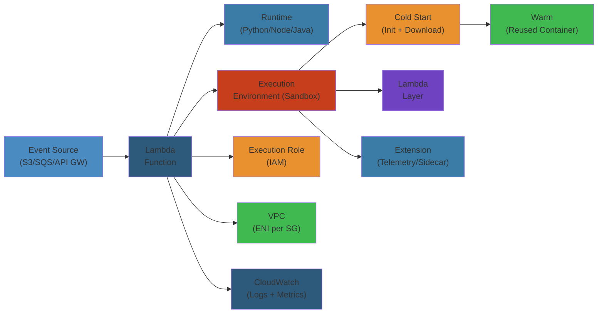

# ⚡ AWS Lambda — Complete Deep Dive

**Related**: [API Gateway](../api-gateway/01-api-gateway.md) · [S3](../s3/01-s3-deep-dive.md) · [CloudWatch](../cloudwatch/01-cloudwatch-deep-dive.md) · [DynamoDB](../dynamodb/01-dynamodb-deep-dive.md)

---




## Table of Contents

- [The Big Picture](#-the-big-picture)
- [1. Function Configuration](#1-function-configuration)
- [2. Triggers](#2-triggers)
- [3. Event Source Mapping](#3-event-source-mapping)
- [4. Layers](#4-layers)
- [5. VPC Integration](#5-vpc-integration)
- [6. Cold Starts](#6-cold-starts)
- [7. Reserved Concurrency](#7-reserved-concurrency)
- [8. Provisioned Concurrency](#8-provisioned-concurrency)
- [9. Destinations](#9-destinations)
- [10. Versions & Aliases](#10-versions--aliases)
- [11. Best Practices](#11-best-practices)
- [Simplest Mental Model](#-simplest-mental-model)

---

## 🧭 The Big Picture

```text
                     ┌─────────────────────────┐
                     │        AWS Lambda        │
                     │   Run code without       │
                     │   provisioning servers   │
                     ├─────────────────────────┤
                     │   • Event-driven         │
                     │   • Pay per invocation   │
                     │   • Auto-scaling         │
                     │   • Max 15 min execution │
                     └─────────────────────────┘
                                │
          ┌─────────────────────┼─────────────────────┐
          ▼                     ▼                     ▼
  ┌──────────────┐     ┌──────────────┐     ┌──────────────┐
  │  Triggers    │     │  Execution   │     │  Deployment  │
  │ • S3/SQS/SNS│     │  • Cold start│     │  • Versions  │
  │ • API GW    │     │  • Warm pool │     │  • Aliases   │
  │ • DynamoDB  │     │  • Concurrency│    │  • Layers    │
  │ • EventBridge│    │  • Throttle  │     │  • Container │
  └──────────────┘     └──────────────┘     └──────────────┘
```

---

## 1. Function Configuration

### Core Configuration

```text
┌──────────────────────────────────────────────────┐
│              Lambda Function                       │
├──────────────────────────────────────────────────┤
│  Name                : my-processor-function       │
│  Runtime             : Python 3.12 / Node.js 20   │
│  Architecture        : x86_64 | arm64 (Graviton)  │
│  Handler             : app.lambda_handler          │
│  Memory (MB)         : 128 - 10,240               │
│  Timeout (seconds)   : 1 - 900 (15 min)           │
│  Ephemeral Storage   : 512 MB - 10,240 MB         │
│  IAM Role            : lambda-execution-role      │
│  VPC                 : optional (VPC config)      │
│  DLQ/Destination     : SQS/SNS/EventBridge        │
└──────────────────────────────────────────────────┘
```

### Memory vs CPU Allocation

```text
Memory (MB)    CPU Allocation
─────────────────────────────
128            ~1% of 1 vCPU (burst)
512            ~10% of 1 vCPU
1024           ~20% of 1 vCPU
1536           ~30% of 1 vCPU
1792           ~1 full vCPU (threshold)
2048           ~1 full vCPU
3008           ~1.5 vCPUs
4096           ~2 vCPUs
5120           ~2.5 vCPUs
6144           ~3 vCPUs
7168           ~3.5 vCPUs
8192           ~4 vCPUs
10240          ~6 vCPUs

NOTE: CPU scales linearly with memory
      up to 1792 MB where you get 1 vCPU.
```

### Handler Signature (Python)

```python
# handler.py
import json
import os

def lambda_handler(event, context):
    """
    event:   Dict — event data from trigger
    context: Context object with runtime info
    """

    # Context methods
    function_name = context.function_name
    function_version = context.function_version
    invoked_function_arn = context.invoked_function_arn
    aws_request_id = context.aws_request_id
    log_group_name = context.log_group_name
    log_stream_name = context.log_stream_name
    memory_limit_in_mb = context.memory_limit_in_mb
    remaining_time_ms = context.get_remaining_time_in_millis()
    identity = context.identity  # Cognito identity
    client_context = context.client_context

    return {
        "statusCode": 200,
        "body": json.dumps({"message": "Hello from Lambda!"})
    }
```

---

## 2. Triggers

### Common Trigger Sources

```text
SYNCHRONOUS (request-response):
┌──────────────┐     ┌────────┐
│ API Gateway  │────►│ Lambda │────► Response
│ (REST/HTTP)  │     └────────┘
└──────────────┘
┌──────────────┐     ┌────────┐
│ ALB          │────►│ Lambda │────► Response
└──────────────┘     └────────┘
┌──────────────┐     ┌────────┐
│ Lex / Alexa  │────►│ Lambda │────► Response
└──────────────┘     └────────┘

ASYNCHRONOUS (event-driven):
┌──────────────┐     ┌────────┐
│ S3 (PUT/COPY)│────►│ Lambda │────► Destinations
└──────────────┘     └────────┘
┌──────────────┐
│ SNS Topic    │────►│ Lambda │
└──────────────┘     └────────┘
┌──────────────┐
│ EventBridge  │────►│ Lambda │
│ (scheduled)  │     └────────┘
└──────────────┘

POLL-BASED (streams/queues):
┌──────────────┐     ┌────────┐
│ DynamoDB     │◄────│ Lambda │  (poll + process)
│ Streams      │     └────────┘
└──────────────┘
┌──────────────┐
│ Kinesis      │◄────│ Lambda │
└──────────────┘
┌──────────────┐
│ SQS Queue    │◄────│ Lambda │
└──────────────┘
```

---

## 3. Event Source Mapping

### SQS Event Source Mapping

```json
{
  "EventSourceMapping": {
    "EventSourceArn": "arn:aws:sqs:us-east-1:123456789012:my-queue",
    "FunctionName": "my-function",
    "Enabled": true,
    "BatchSize": 10,
    "MaximumBatchingWindowInSeconds": 5,
    "ScalingConfig": {
      "MaximumConcurrency": 2
    },
    "FilterCriteria": {
      "Filters": [
        {
          "Pattern": "{\"eventType\": [\"order_created\"]}"
        }
      ]
    }
  }
}
```

### DynamoDB Streams Mapping

```text
DynamoDB Table
       │
       ▼
┌──────────────────┐
│ DynamoDB Streams │── 24hr retention
│ (CDC stream)     │
└────────┬─────────┘
         │ Poll every 0-5s
         ▼
┌──────────────────┐
│ Lambda (ESM)     │
│ Batch size: 100  │
│ Parallel: 4      │
└────────┬─────────┘
         │
         ▼
┌──────────────────┐
│ Process records  │
│ • INSERT         │
│ • MODIFY         │
│ • REMOVE         │
└──────────────────┘
```

### SQS Batch Processing Flow

```python
import json

def lambda_handler(event, context):
    for record in event["Records"]:
        try:
            body = json.loads(record["body"])
            process(body)
        except Exception as e:
            # The message stays in the queue (visibility timeout)
            # After maxReceiveCount → DLQ
            print(f"Failed to process: {e}")
            raise

    # If all succeed, messages are deleted from queue
    return {"batchItemFailures": []}
```

---

## 4. Layers

### Layer Structure

```text
Layer Package Structure:
layer.zip
  └── python/
      ├── requests/
      │   ├── __init__.py
      │   └── ...
      ├── pandas/
      │   ├── __init__.py
      │   └── ...
      └── numpy/
          ├── __init__.py
          └── ...
```

### Usage

```awscli
# Publish layer
aws lambda publish-layer-version \
  --layer-name python-deps \
  --description "Python 3.12 deps: requests, pandas" \
  --zip-file fileb://layer.zip \
  --compatible-runtimes python3.12

# Attach layer to function
aws lambda update-function-configuration \
  --function-name my-function \
  --layers arn:aws:lambda:us-east-1:123456789012:layer:python-deps:3
```

### Layer Limits

| Limit | Value |
|-------|-------|
| Max layers per function | 5 |
| Max unzipped size | 250 MB (all layers + function) |
| Max zip file | 50 MB (direct upload) / 250 MB (S3) |
| Layer versions kept | 100 (max per layer) |

---

## 5. VPC Integration

### VPC-Attached Lambda

```text
Without VPC:                        With VPC:
┌──────────┐                       ┌──────────┐
│ Lambda   │──► Internet           │ Lambda   │──► ENI
│ (public) │                       │ (VPC)    │    │
└──────────┘                       └──────────┘    │
                                                   ▼
                                           ┌──────────────────┐
                                           │ VPC Subnet       │
                                           │ (private)        │
                                           └────────┬─────────┘
                                                    │
                                           ┌────────▼─────────┐
                                           │  RDS / ElastiCache│
                                           │  (private)        │
                                           └──────────────────┘

To access Internet + VPC:
        Lambda → NAT Gateway → IGW → Internet
```

### VPC Configuration

```json
{
  "VpcConfig": {
    "SubnetIds": [
      "subnet-abc123",
      "subnet-def456"
    ],
    "SecurityGroupIds": [
      "sg-789012"
    ]
  }
}
```

### Cold Start Impact of VPC

```text
Cold Start Time (approx)

Without VPC:  ~50-200ms overhead
With VPC (ENI creation):  ~5-15 seconds overhead
  ┌──────────────────────────────────────┐
  │ Lambda Execution Role needs:         │
  │ ec2:CreateNetworkInterface           │
  │ ec2:DescribeNetworkInterfaces        │
  │ ec2:DeleteNetworkInterface           │
  └──────────────────────────────────────┘

Mitigation: Hyperplane ENI (AWS-managed)
  • Pre-created ENIs reduce VPC cold start
  • Available since 2020 for most regions
  • Still adds ~1-3s to cold starts
```

---

## 6. Cold Starts

### Cold Start Anatomy

```text
INIT Phase (cold start)                    INVOKE Phase (warm)
┌────────────────────┐                     ┌────────────────────┐
│ 1. Download code   │  (~50-200ms)        │ Execute handler    │
│ 2. Start runtime   │  (~100-300ms)       │ (function code)    │
│ 3. Init extensions │  (~0-100ms)         └────────────────────┘
│ 4. Init handler    │  (~0-500ms)         Duration: ~10-100ms
│    (global scope)  │
└─────────┬──────────┘
          │
    Total cold start: 0.2s - 10s+

Warm start: ~1-10ms (init skipped)
```

### Cold Start Duration by Runtime

| Runtime | Cold Start (approx) | Notes |
|---------|--------------------|-------|
| Python 3.12 | 50-100ms | Fastest |
| Node.js 20 | 100-200ms | Very fast |
| Go | 50-100ms | Compiled binary |
| Java 21 | 300ms-3s | JVM init |
| .NET 8 | 300ms-2s | JIT compilation |
| Ruby 3.2 | 100-300ms | Moderate |

### Mitigation Strategies

| Strategy | Impact | Cost Implication |
|----------|--------|-----------------|
| Provisioned Concurrency | Eliminates cold starts | Pay for idle concurrency |
| Smaller deployment package | Reduces download time | None |
| Minimize init code | Faster handler init | None |
| Graviton (arm64) | 10-20% faster | ~20% cheaper |
| Keep warm with scheduled invocations | Reduces frequency | Minimal (invocation cost) |
| Avoid VPC if possible | Eliminates ENI delay | None |
| Use SnapStart (Java) | 90% cold start reduction | Snapshot storage cost |

---

## 7. Reserved Concurrency

### How It Works

```text
Regional Concurrency Pool (e.g., 1000)
┌─────────────────────────────────────┐
│                                     │
│  Available: 150                     │
│                                     │
│  Function A (reserved: 200)         │
│  ┌──────────────────────────────┐   │
│  │   Can't exceed 200           │   │
│  └──────────────────────────────┘   │
│                                     │
│  Function B (reserved: 500)         │
│  ┌──────────────────────────────┐   │
│  │   Can't exceed 500           │   │
│  └──────────────────────────────┘   │
│                                     │
│  Function C: uses unreserved 150    │
│  Function D: uses unreserved 150    │
└─────────────────────────────────────┘

Reserved concurrency = 700 (A+B)
Available to others = 300
```

### Benefits

```text
Protection from runaway functions:
  Without Reserved (1000 pool):
    Function A (buggy, infinite loop) → Consumes 950
    Function B (production) → Throttled!

  With Reserved (200 for A, 500 for B):
    Function A → Limited to 200
    Function B → Has guaranteed 500
    No interference between functions
```

```awscli
aws lambda put-function-concurrency \
  --function-name my-function \
  --reserved-concurrent-executions 100
```

---

## 8. Provisioned Concurrency

### Provisioned vs Reserved

```text
Reserved Concurrency:
  Guarantees capacity but starts cold
  No warm instances maintained

Provisioned Concurrency:
  Guarantees capacity + warm instances ready
  Initializes before traffic arrives
  Additional cost (pay for warm instances)
```

### Application Auto Scaling

```json
{
  "ScalableTarget": {
    "ServiceNamespace": "lambda",
    "ResourceId": "function:my-function:prod",
    "ScalableDimension": "lambda:function:ProvisionedConcurrency",
    "MinCapacity": 10,
    "MaxCapacity": 100
  },
  "ScalingPolicy": {
    "TargetTrackingScalingPolicyConfiguration": {
      "TargetValue": 70.0,
      "PredefinedMetricSpecification": {
        "PredefinedMetricType": "LambdaProvisionedConcurrencyUtilization"
      }
    }
  }
}
```

### Warm Pool Lifecycle

```text
Provisioned Concurrency Warm Pool
        │
        ▼
┌───────────────────┐
│  INIT Phase       │── Code downloaded, runtime started
└─────────┬─────────┘
          │
          ▼
┌───────────────────┐
│  Handler init     │── Global scope executed
└─────────┬─────────┘
          │
          ▼
┌───────────────────┐
│  Ready for invoke │── Waiting for traffic
│  (warm)           │
└─────────┬─────────┘
          │
          ▼
┌───────────────────┐
│  Invoke handler   │── Actual execution
│  (no cold start)  │
└───────────────────┘
```

---

## 9. Destinations

### Destination Types

```text
On Success / On Failure
        │
        └── Can route to:
            ├── SQS Standard Queue
            ├── SNS Topic
            ├── Lambda (another function)
            └── EventBridge Event Bus
```

### Configuration

```json
{
  "EventInvokeConfig": {
    "FunctionName": "my-function",
    "Qualifier": "prod",
    "MaximumEventAgeInSeconds": 3600,
    "MaximumRetryAttempts": 2,
    "DestinationConfig": {
      "OnSuccess": {
        "Destination": "arn:aws:sqs:us-east-1:123456789012:success-queue"
      },
      "OnFailure": {
        "Destination": "arn:aws:sqs:us-east-1:123456789012:dlq-queue"
      }
    }
  }
}
```

### Async Invocation Flow with Destinations

```text
Invoke (async)
    │
    ▼
┌──────────────────┐
│ Lambda Service   │
│ • Enqueue event  │
│ • Return 202     │
└────────┬─────────┘
         │
         ▼
┌──────────────────┐
│ Retry (max 2)    │── After each failure, wait then retry
│ (1min, 2min)     │
└────────┬─────────┘
    │             │
  Success        Failure (after retries exhausted)
    │             │
    ▼             ▼
┌──────────┐ ┌──────────┐
│ OnSuccess│ │ OnFailure│
│ Destination│ │ Destination│
└──────────┘ └──────────┘
```

---

## 10. Versions & Aliases

### Versioning

```text
$LATEST (unstable, mutable)
    │
    ├── Publish → Version 1 (immutable)
    │
    ├── Update code
    │
    └── Publish → Version 2 (immutable)
    │
    ├── Update code
    │
    └── Publish → Version 3 (immutable)

Each version gets its own ARN with version number
and its own concurrency configuration.
```

### Aliases

```text
Aliases point to versions (can be changed):
┌─────────┐     ┌───────────┐
│  prod   │────►│ Version 3 │  (stable, tested)
└─────────┘     └───────────┘
┌─────────┐     ┌───────────┐
│  staging│────►│ Version 2 │  (pre-prod testing)
└─────────┘     └───────────┘
┌─────────┐     ┌───────────┐
│  dev    │────►│ Version 1 │  (development)
└─────────┘     └───────────┘
```

### Weighted Aliases (Canary Deployments)

```text
┌──────────┐
│  prod    │
└────┬─────┘
     │
     90% of traffic
     ├────────────────────────── Version 3 (stable)
     │
     10% of traffic
     ├────────────────────────── Version 4 (canary)

Controlled via routing config:
{
  "RoutingConfig": {
    "AdditionalVersionWeights": {
      "4": 0.1
    }
  }
}
```

---

## 11. Best Practices

### Performance

```do
├── Set memory based on workload needs (not minimum)
├── Initialize DB connections, HTTP clients outside handler
├── Use connection pooling for databases
├── Enable X-Ray tracing for observability
├── Keep deployment package under 10MB
├── Use arm64 (Graviton) for cost savings
└── Use SnapStart for Java functions

└── DON'T:
    ├── Don't store secrets in environment variables (use Secrets Manager)
    ├── Don't use /tmp for critical data (ephemeral)
    ├── Don't make synchronous calls without timeout
    └── Don't create recursive infinite loops
```

### Security

```text
┌──────────────────────────────────────────────┐
│ Lambda Security Checklist                     │
├──────────────────────────────────────────────┤
│ ☐ Use least privilege IAM execution role      │
│ ☐ Encrypt environment variables with KMS      │
│ ☐ Use private subnets when accessing RDS      │
│ ☐ Enable VPC flow logs for network monitoring  │
│ ☐ Use Lambda in a private API Gateway         │
│ ☐ Validate and sanitize all input events      │
│ ☐ Set function timeout to practical limit     │
│ ☐ Configure DLQ for failed async invocations  │
│ ☐ Enable AWS Config rules for Lambda          │
└──────────────────────────────────────────────┘
```

### Monitoring

```cloudwatch
# CloudWatch Metrics
Invocations — count of function invocations
Errors      — failed invocations count
Throttles   — requests throttled due to concurrency limits
Duration    — execution time in milliseconds
IteratorAge — stream-based functions (lag in ms)
ConcurrentExecutions — number of concurrent executions
ProvisionedConcurrencyUtilization — % of provisioned used
```

### Code Structure

```python
# ❌ BAD — global scope has expensive operations
import boto3
import json

# Database connection on every cold start
DB = boto3.resource("dynamodb").Table("my-table")

# ❌ BAD — heavy import at top level
import pandas as pd
import numpy as np
import tensorflow as tf

def lambda_handler(event, context):
    # Heavy init every cold start
    return {"status": "ok"}


# ✅ GOOD — lazy initialization
import boto3

def lambda_handler(event, context):
    table = get_table()  # cached after first cold start
    return table.get_item(Key={"id": event["id"]})

def get_table():
    if not hasattr(get_table, "table"):
        get_table.table = boto3.resource("dynamodb").Table("my-table")
    return get_table.table
```

---

## 🧠 Simplest Mental Model

```text
LAMBDA FUNCTION  =  A vending machine.
                    Put in event (coin) → get result (snack).
                    No one maintains the machine—
                    AWS keeps it running.

COLD START      =  First vending machine use of the day.
                    The machine spins up its cooling.
                    Takes a few seconds.

WARM START      =  Subsequent uses are instant.
                    The machine is already running.

CONCURRENCY     =  How many people can use the vending
                    machine simultaneously.
     Reserved   =  A machine just for your office.
     Provisioned = Machine is pre-stocked and ready
                    before lunch rush.

TRIGGERS        =  What causes the vending machine to dispense?
                    • Pulling the lever (API Gateway)
                    • Someone puts money in (S3 event)
                    • Every hour (EventBridge schedule)

DESTINATIONS    =  What happens after the snack drops?
                    On success → receipt prints
                    On failure → refund processed

LAYERS          =  Pre-packed supply crate for your machine.
                    Instead of stocking each item manually,
                    get a bulk supply of chips, soda, etc.

VERSIONS        =  Frozen recipe cards. V1 = original snacks.
                    V2 = new snacks. Aliases = signage
                    ("prod" = V2, "canary" = V3 for 10%).
```

---

**Next**: [RDS Deep Dive](../rds/01-rds-deep-dive.md) — Relational databases
