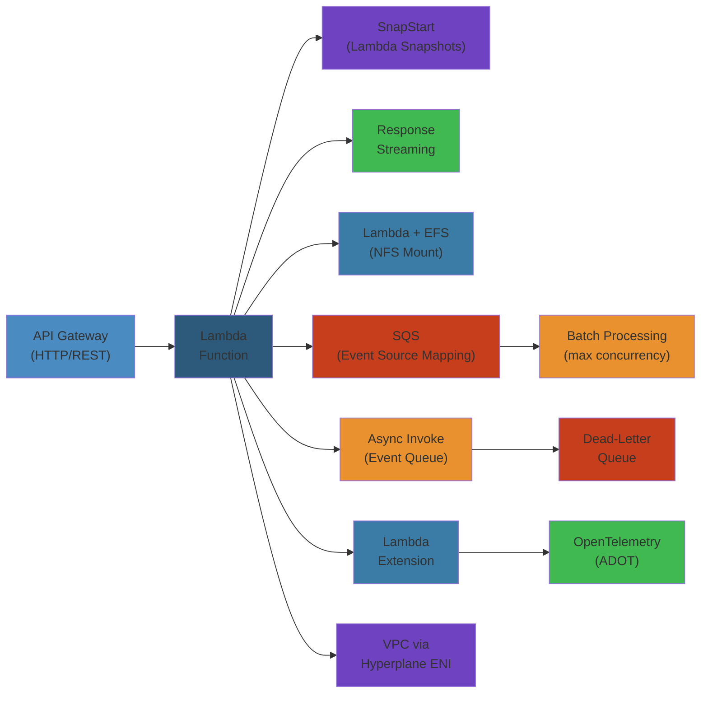
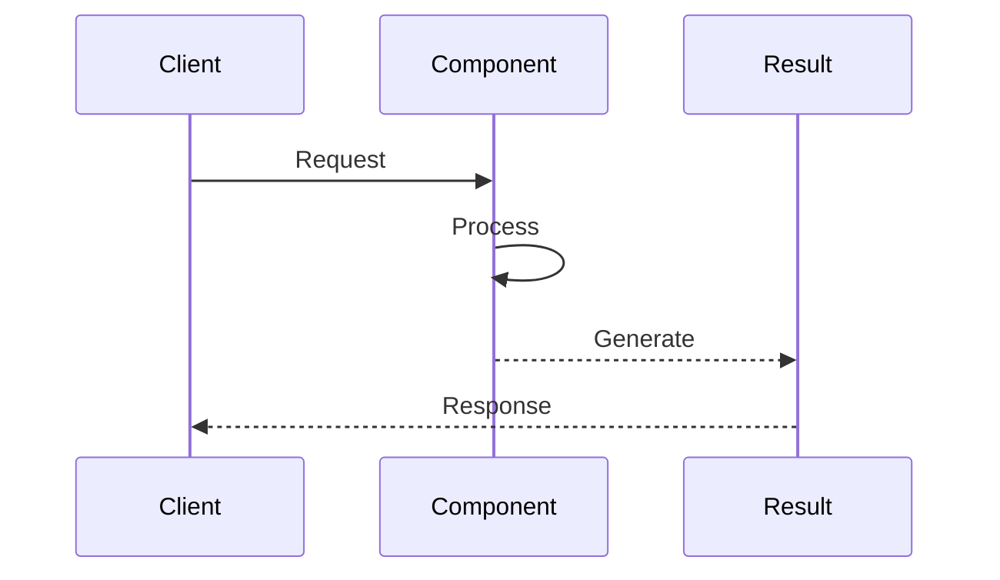

# ⚡ Lambda Advanced Patterns — Complete Deep Dive

**Related**: [Lambda Basics](01-lambda-deep-dive.md) · [S3](../s3/01-s3-deep-dive.md) · [API Gateway](../api-gateway/01-api-gateway.md) · [CloudWatch](../cloudwatch/02-cloudwatch-observability.md) · [DynamoDB](../dynamodb/01-dynamodb-deep-dive.md)

---




## Table of Contents

#### Step-by-Step
1. Process input
2. Validate
3. Execute
4. Return result

#### Code Example
```python
# Example implementation
pass
```

#### Real-World Scenario
This pattern is commonly used in production systems.


- [The Big Picture](#-the-big-picture)
- [1. Lambda Extensions](#1-lambda-extensions)
- [2. SnapStart](#2-snapstart)
- [3. Response Streaming](#3-response-streaming)
- [4. Lambda + EFS](#4-lambda--efs)
- [5. Lambda + VPC Deep Dive](#5-lambda--vpc-deep-dive)
- [6. Container Images](#6-container-images)
- [7. Provisioned Concurrency Strategy](#7-provisioned-concurrency-strategy)
- [8. Powertools (Telemetry, Tracing, Logging)](#8-powertools-telemetry-tracing-logging)
- [9. Cold Start Optimization](#9-cold-start-optimization)
- [10. Lambda + API Gateway](#10-lambda--api-gateway)
- [11. Lambda + SQS](#11-lambda--sqs)
- [12. Lambda + Step Functions](#12-lambda--step-functions)
- [13. Lambda + DynamoDB Streams](#13-lambda--dynamodb-streams)
- [14. Lambda + Kinesis](#14-lambda--kinesis)
- [15. Lambda + WebSockets](#15-lambda--websockets)
- [16. Lambda Destinations](#16-lambda-destinations)
- [17. Lambda Function URLs & @Edge](#17-lambda-function-urls--edge)
- [Simplest Mental Model](#-simplest-mental-model)

---

## 🧭 The Big Picture

#### Step-by-Step
1. Process input
2. Validate
3. Execute
4. Return result

#### Code Example
```python
# Example implementation
pass
```

#### Real-World Scenario
This pattern is commonly used in production systems.




---

## 1. Lambda Extensions

#### Step-by-Step
1. Process input
2. Validate
3. Execute
4. Return result

#### Code Example
```python
# Example implementation
pass
```

#### Real-World Scenario
This pattern is commonly used in production systems.


### Extension Types

#### Step-by-Step
1. Process input
2. Validate
3. Execute
4. Return result

#### Code Example
```python
# Example implementation
pass
```

#### Real-World Scenario
This pattern is commonly used in production systems.


```text
┌──────────────────────────────────────────────────────────┐
│              Lambda Extensions                             │
│                                                           │
│  Internal Extension (runs in-process):                     │
│  ┌────────────────────────────────────────────────────┐   │
│  │  • Runs alongside runtime in same process           │   │
│  │  • Limited to runtime-supported languages            │   │
│  └────────────────────────────────────────────────────┘   │
│                                                           │
│  External Extension (separate process):                    │
│  ┌────────────────────────────────────────────────────┐   │
│  │  • Runs as separate binary in /opt/extensions/       │   │
│  │  • Language-agnostic (Go, Rust, shell, etc.)        │   │
│  │  • Communicates via Runtime API                      │   │
│  │  • Two lifecycle hooks: INIT, SHUTDOWN               │   │
│  └────────────────────────────────────────────────────┘   │
│                                                           │
│  Use Cases:                                                │
│  ┌────────────────────────────────────────────────────┐   │
│  │  • Telemetry (ADOT, Datadog, New Relic, Lumigo)     │   │
│  │  • Secrets (AWS Parameters & Secrets Lambda Layer) │   │
│  │  • Security (CrowdStrike, Trend Micro)              │   │
│  │  • Custom runtime enhancements                      │   │
│  └────────────────────────────────────────────────────┘   │
└──────────────────────────────────────────────────────────┘
```

### Extension Lifecycle

#### Step-by-Step
1. Process input
2. Validate
3. Execute
4. Return result

#### Code Example
```python
# Example implementation
pass
```

#### Real-World Scenario
This pattern is commonly used in production systems.


```text
INIT Phase:
┌─────────────────────────────────────────────────────────┐
│  Runtime Init  ──► Extension Init (register with API)   │
│  Extensions can register for:                            │
│    • SHUTDOWN events                                     │
│    • INVOKE events (telemetry)                           │
└─────────────────────────────────────────────────────────┘

INVOKE Phase:
┌─────────────────────────────────────────────────────────┐
│  Runtime handles invocation                              │
│  Extensions can observe via telemetry API                │
└─────────────────────────────────────────────────────────┘

SHUTDOWN Phase:
┌─────────────────────────────────────────────────────────┐
│  Runtime stops   ──► Extension shutdown (cleanup)        │
│  • Close connections                                     │
│  • Flush telemetry                                       │
│  • Deregister from API                                   │
└─────────────────────────────────────────────────────────┘
```

### External Extension Script

#### Step-by-Step
1. Process input
2. Validate
3. Execute
4. Return result

#### Code Example
```python
# Example implementation
pass
```

#### Real-World Scenario
This pattern is commonly used in production systems.


```bash
#!/bin/sh
# /opt/extensions/my-telemetry-extension

set -e

# Register for INVOKE and SHUTDOWN events
API_URL="${AWS_LAMBDA_RUNTIME_API}"
REGISTER_URL="http://${API_URL}/2020-01-01/extension/register"
EVENT_URL="http://${API_URL}/2020-01-01/extension/event/next"

# Register
curl -s -X POST "$REGISTER_URL" \
  -H "Lambda-Extension-Name: my-telemetry" \
  -d '{"events": ["INVOKE", "SHUTDOWN"]}'

# Main loop
while true; do
  event=$(curl -s "$EVENT_URL")
  event_type=$(echo "$event" | jq -r '.eventType')

  if [ "$event_type" = "SHUTDOWN" ]; then
    echo "Shutting down, flushing telemetry..."
    break
  fi

  # Collect and send telemetry
  send_metrics
done
```

---

## 2. SnapStart

#### Step-by-Step
1. Process input
2. Validate
3. Execute
4. Return result

#### Code Example
```python
# Example implementation
pass
```

#### Real-World Scenario
This pattern is commonly used in production systems.


### How SnapStart Works

#### Step-by-Step
1. Process input
2. Validate
3. Execute
4. Return result

#### Code Example
```python
# Example implementation
pass
```

#### Real-World Scenario
This pattern is commonly used in production systems.


```text
Standard Init:                     SnapStart Init:
┌─────────────────────┐            ┌───────────────────────┐
│ Cold Start Path:     │            │ Cold Start Path:       │
│ 1. Download code     │            │ 1. Restore snapshot    │
│ 2. Start runtime     │            │    (pre-initialized)   │
│ 3. Run init code     │            │ 2. Handle invocation   │
│ 4. Handle invocation │            │                        │
│ Total: ~5-10s        │            │ Total: ~200-500ms      │
└─────────────────────┘            └───────────────────────┘
                                          │
                                    Snapshot created on:
                                    • First invocation after update
                                    • ~10s init time paid once
                                    • Cached for ~2 weeks
```

### SnapStart Configuration

#### Step-by-Step
1. Process input
2. Validate
3. Execute
4. Return result

#### Code Example
```python
# Example implementation
pass
```

#### Real-World Scenario
This pattern is commonly used in production systems.


```python
# Python - use lazy initialization
import boto3
import json

class DatabaseClient:
    def __init__(self):
        self._client = boto3.client('dynamodb')

    def query(self, table, key):
        return self._client.get_item(TableName=table, Key=key)

# ❌ Bad - runs during init (captured in snapshot)
db = DatabaseClient()

# ✅ Good - lazy initialization (runs after restore)
_db = None
def get_db():
    global _db
    if _db is None:
        _db = DatabaseClient()
    return _db

def handler(event, context):
    db = get_db()
    return db.query('users', event['key'])
```

### SnapStart Caveats

#### Step-by-Step
1. Process input
2. Validate
3. Execute
4. Return result

#### Code Example
```python
# Example implementation
pass
```

#### Real-World Scenario
This pattern is commonly used in production systems.


```text
SNAPSTART CAVEATS:
┌────────────────────────────────────────────────────────────┐
│ ✅ Random numbers work (CRNG re-seeded on resume)           │
│ ✅ TLS sessions work (new handshake on resume)              │
│ ✅ Network connections will fail (don't cache connections)  │
│ ✅ Timestamps in init may be stale (use current time)       │
│ ❌ Provisioned concurrency incompatible                     │
│ ❌ ARM (Graviton) currently unsupported                     │
│ ❌ x86 only                                                  │
│ ❌ Large execution environments (> 3GB RAM) not supported    │
│ ❌ Full bundle size must be < 1 GB (snapshot size)         │
│ ❌ Some SDK clients need re-init after restore              │
└────────────────────────────────────────────────────────────┘
```

---

## 3. Response Streaming

#### Step-by-Step
1. Process input
2. Validate
3. Execute
4. Return result

#### Code Example
```python
# Example implementation
pass
```

#### Real-World Scenario
This pattern is commonly used in production systems.


### Streamed vs Buffered Responses

#### Step-by-Step
1. Process input
2. Validate
3. Execute
4. Return result

#### Code Example
```python
# Example implementation
pass
```

#### Real-World Scenario
This pattern is commonly used in production systems.


```text
BUFFERED (Standard):
Client ──► API GW ──► Lambda (full response built in memory) ──► Client
         │                      │
         └── Wait for entire    │
             response (timeout) └── All data in memory

STREAMED:
Client ──► Lambda Function URL (ResponseStream invoke mode)
         │
         ├──► First chunk available in < 100ms
         ├──► Continue streaming data
         └──► Client processes incrementally
```

### Streaming Implementation

#### Step-by-Step
1. Process input
2. Validate
3. Execute
4. Return result

#### Code Example
```python
# Example implementation
pass
```

#### Real-World Scenario
This pattern is commonly used in production systems.


```python
import json

def handler(event, response_stream, context):
    # Write headers
    response_stream.write(json.dumps({"status": "processing"}).encode())
    response_stream.write(b"\n")

    # Stream results
    for record in process_large_dataset():
        response_stream.write(json.dumps(record).encode())
        response_stream.write(b"\n")

    # No return needed — stream is the response
```

### Use Cases

#### Step-by-Step
1. Process input
2. Validate
3. Execute
4. Return result

#### Code Example
```python
# Example implementation
pass
```

#### Real-World Scenario
This pattern is commonly used in production systems.


```text
STREAMING IS BEST FOR:
  • Large payloads (> 6 MB — Lambda buffer limit)
  • Time-to-first-byte sensitive apps (chat, real-time)
  • Processing large files chunk by chunk
  • SSE (Server-Sent Events) endpoints
  • CSV/JSON export with progressive download
  • Long-running LLM inference responses

STREAMING IS NOT FOR:
  • Simple API requests (< 1 MB response)
  • Synchronous workflows needing full result
  • Responses requiring post-processing
```

---

## 4. Lambda + EFS

#### Step-by-Step
1. Process input
2. Validate
3. Execute
4. Return result

#### Code Example
```python
# Example implementation
pass
```

#### Real-World Scenario
This pattern is commonly used in production systems.


### Architecture

#### Step-by-Step
1. Process input
2. Validate
3. Execute
4. Return result

#### Code Example
```python
# Example implementation
pass
```

#### Real-World Scenario
This pattern is commonly used in production systems.


```text
Lambda Function
      │
      │  Mount via EFS Access Point
      │  (mount path: /mnt/efs)
      ▼
┌──────────────────┐
│  EFS File System  │  NFS v4.1
│  (in same VPC)   │
├──────────────────┤
│  • Shared storage │
│  • Multiple Lambdas │
│  • Persistent     │
│  • Up to 8 TB     │
│  • POSIX compliant│
└──────────────────┘
```

### Configuration

#### Step-by-Step
1. Process input
2. Validate
3. Execute
4. Return result

#### Code Example
```python
# Example implementation
pass
```

#### Real-World Scenario
This pattern is commonly used in production systems.


```text
Requirements:
  • Lambda in VPC (same VPC as EFS)
  • EFS mount target in same AZ as Lambda
  • EFS access point configured
  • Security group allows NFS (2049) from Lambda

Limitations:
  • First access: ~500ms to mount (stays mounted for warm)
  • EFS is AZ-scoped (Lambda in AZ-a must use AZ-a mount)
  • Max throughput: depends on EFS burst credits
  • Cost: EFS storage + requests
  • Not suitable for high-throughput temp data
```

### EFS Access Point

#### Step-by-Step
1. Process input
2. Validate
3. Execute
4. Return result

#### Code Example
```python
# Example implementation
pass
```

#### Real-World Scenario
This pattern is commonly used in production systems.


```json
{
  "AccessPointId": "fsap-xxx",
  "ClientToken": "lambda-ap",
  "PosixUser": {
    "Uid": 1000,
    "Gid": 1000
  },
  "RootDirectory": {
    "Path": "/lambda/data",
    "CreationInfo": {
      "OwnerUid": 1000,
      "OwnerGid": 1000,
      "Permissions": "0755"
    }
  }
}
```

---

## 5. Lambda + VPC Deep Dive

#### Step-by-Step
1. Process input
2. Validate
3. Execute
4. Return result

#### Code Example
```python
# Example implementation
pass
```

#### Real-World Scenario
This pattern is commonly used in production systems.


### VPC Lambda Architecture

#### Step-by-Step
1. Process input
2. Validate
3. Execute
4. Return result

#### Code Example
```python
# Example implementation
pass
```

#### Real-World Scenario
This pattern is commonly used in production systems.


```text
Lambda (VPC Enabled)
      │
      ├── ENI Attached (Hyperplane ENI)
      │      │
      │      ├── Public Subnet (has NAT Gateway)
      │      │      │
      │      │      └── Internet (for external APIs)
      │      │
      │      └── Private Subnet
      │             │
      │             ├── RDS
      │             ├── ElastiCache
      │             └── Internal services
      │
      └── No Internet without NAT:
             Lambda in private subnet only
             Needs NAT Gateway for internet access
```

### NAT Gateway Costs

#### Step-by-Step
1. Process input
2. Validate
3. Execute
4. Return result

#### Code Example
```python
# Example implementation
pass
```

#### Real-World Scenario
This pattern is commonly used in production systems.


```text
NAT Gateway Costs:
┌────────────────────────────────────────────────────┐
│  NAT Gateway per hour:        $0.045                │
│  Data processed per GB:       $0.045                │
│  Per AZ you deploy:           1 NAT Gateway/AZ      │
│                                                      │
│  EXAMPLE (3 AZs, 1 TB/mo data):                      │
│  • NAT Gateway (3 × $0.045 × 730h)  = $98.55        │
│  • Data processing (1,000 GB × $0.045) = $45.00      │
│  • Total NAT cost:                  ~$143.55/mo     │
│                                                      │
│  VS VPC Endpoints (S3/DynamoDB):                    │
│  • Gateway Endpoint:               FREE              │
│  • Interface Endpoint:             $0.01/h + data    │
└────────────────────────────────────────────────────┘
```

### When VPC Is Worth It

#### Step-by-Step
1. Process input
2. Validate
3. Execute
4. Return result

#### Code Example
```python
# Example implementation
pass
```

#### Real-World Scenario
This pattern is commonly used in production systems.


```text
USE VPC LAMBDA WHEN:
  • Accessing RDS, ElastiCache, Redshift (private subnets)
  • Data must not traverse internet
  • Compliance requires VPC boundaries
  • Internal service mesh communication

AVOID VPC LAMBDA WHEN:
  • Only accessing S3/DynamoDB (use Gateway Endpoints)
  • Simple API calls to public endpoints
  • Cold start latency is critical (VPC adds ~10s)
  • Using VPC just for "security" (don't — use perimeter)
```

---

## 6. Container Images

#### Step-by-Step
1. Process input
2. Validate
3. Execute
4. Return result

#### Code Example
```python
# Example implementation
pass
```

#### Real-World Scenario
This pattern is commonly used in production systems.


### Container Image vs Zip

#### Step-by-Step
1. Process input
2. Validate
3. Execute
4. Return result

#### Code Example
```python
# Example implementation
pass
```

#### Real-World Scenario
This pattern is commonly used in production systems.


```text
┌──────────────────────┬──────────────────────┐
│    ZIP Archive       │   Container Image    │
├──────────────────────┼──────────────────────┤
│  Max 250 MB (unzip)  │  Max 10 GB (ECR)     │
│  AWS-managed runtime │  Custom runtime      │
│  Limited dependencies│  Any OS package      │
│  Fast deploy (~1s)   │  Slower deploy (~5s) │
│  Layers up to 5      │  Docker image layers │
│  No Docker needed    │  Docker needed       │
│  IDE-friendly        │  CI/CD pipeline      │
└──────────────────────┴──────────────────────┘

Use container for:
  • Large dependencies (ML models, heavy libs)
  • Custom runtime (C++, Rust, Cobol, etc.)
  • Consistent local → cloud env
  • Third-party tooling compatibility
```

### Dockerfile for Lambda

#### Step-by-Step
1. Process input
2. Validate
3. Execute
4. Return result

#### Code Example
```python
# Example implementation
pass
```

#### Real-World Scenario
This pattern is commonly used in production systems.


```dockerfile
FROM public.ecr.aws/lambda/python:3.12

# Install system dependencies
RUN yum install -y postgresql-devel gcc

# Install Python dependencies
COPY requirements.txt .
RUN pip install -r requirements.txt --target "${LAMBDA_TASK_ROOT}"

# Copy function code
COPY app.py .

# Set handler
CMD ["app.handler"]
```

### Base Images

#### Step-by-Step
1. Process input
2. Validate
3. Execute
4. Return result

#### Code Example
```python
# Example implementation
pass
```

#### Real-World Scenario
This pattern is commonly used in production systems.


```text
Lambda Base Images (ECR Public):
┌───────────────────────────────────────────────┐
│  python:3.12         python:3.11  python:3.10 │
│  nodejs:20           nodejs:18   nodejs:16    │
│  java:21             java:17     java:11      │
│  dotnet:8            dotnet:6                 │
│  go:1                rust:1                   │
│  ruby:3.3            ruby:3.2                 │
│  provided.al2023     provided.al2             │
└───────────────────────────────────────────────┘

AWS OS-only base images:
  public.ecr.aws/lambda/provided:al2023
  public.ecr.aws/lambda/provided:al2
```

---

## 7. Provisioned Concurrency Strategy

#### Step-by-Step
1. Process input
2. Validate
3. Execute
4. Return result

#### Code Example
```python
# Example implementation
pass
```

#### Real-World Scenario
This pattern is commonly used in production systems.


### Provisioned vs Reserved

#### Step-by-Step
1. Process input
2. Validate
3. Execute
4. Return result

#### Code Example
```python
# Example implementation
pass
```

#### Real-World Scenario
This pattern is commonly used in production systems.


```text
┌──────────────────────┬────────────────────────────┐
│  Reserved Concurrency│  Provisioned Concurrency    │
├──────────────────────┼────────────────────────────┤
│  No cold starts      │  No cold starts             │
│  Upper limit only    │  Pre-warmed environment     │
│  No cost (no idle)   │  Cost for idle capacity     │
│  Manages concurrency │  Manages initialization     │
│  Can still have cold │  Always ready to invoke     │
│  starts if unused    │  Pay for what you allocate  │
└──────────────────────┴────────────────────────────┘
```

### Application Auto-Scaling

#### Step-by-Step
1. Process input
2. Validate
3. Execute
4. Return result

#### Code Example
```python
# Example implementation
pass
```

#### Real-World Scenario
This pattern is commonly used in production systems.


```bash
# Register scaling target
aws application-autoscaling register-scalable-target \
  --service-namespace lambda \
  --resource-id function:my-function:prod \
  --scalable-dimension lambda:function:ProvisionedConcurrency \
  --min-capacity 10 \
  --max-capacity 100

# Create scaling policy (target tracking)
aws application-autoscaling put-scaling-policy \
  --service-namespace lambda \
  --resource-id function:my-function:prod \
  --scalable-dimension lambda:function:ProvisionedConcurrency \
  --policy-name my-scaling-policy \
  --policy-type TargetTrackingScaling \
  --target-tracking-scaling-policy-configuration '{
    "TargetValue": 0.7,
    "PredefinedMetricSpecification": {
      "PredefinedMetricType": "LambdaProvisionedConcurrencyUtilization"
    }
  }'
```

### Provisioned Concurrency Scheduling

#### Step-by-Step
1. Process input
2. Validate
3. Execute
4. Return result

#### Code Example
```python
# Example implementation
pass
```

#### Real-World Scenario
This pattern is commonly used in production systems.


```text
┌────────────────────────────────────────────────────┐
│  Schedule Provisioned Concurrency                    │
│                                                      │
│  Business Hours (9AM-5PM):                           │
│  • Provisioned: 100 units                            │
│  • Cost: ~$15/day for idle                           │
│                                                      │
│  Off Hours (5PM-9AM):                                │
│  • Provisioned: 0 (allow cold starts for batch)      │
│  • Cost: $0 for idle                                 │
│                                                      │
│  End of Month (spikes):                               │
│  • Provisioned: 500 units (scheduled via EventBridge) │
│  • + Application Auto-Scaling for overflow            │
└────────────────────────────────────────────────────┘
```

---

## 8. Powertools (Telemetry, Tracing, Logging)

#### Step-by-Step
1. Process input
2. Validate
3. Execute
4. Return result

#### Code Example
```python
# Example implementation
pass
```

#### Real-World Scenario
This pattern is commonly used in production systems.


### Powertools for Python

#### Step-by-Step
1. Process input
2. Validate
3. Execute
4. Return result

#### Code Example
```python
# Example implementation
pass
```

#### Real-World Scenario
This pattern is commonly used in production systems.


```python
from aws_lambda_powertools import Logger, Tracer, Metrics
from aws_lambda_powertools.event_handler import APIGatewayRestResolver
from aws_lambda_powertools.utilities.typing import LambdaContext
from aws_lambda_powertools.utilities import parameters

logger = Logger()
tracer = Tracer()
metrics = Metrics(namespace="MyApp")
app = APIGatewayRestResolver()

@app.get("/users/<user_id>")
@tracer.capture_method
def get_user(user_id: str):
    logger.info(f"Fetching user {user_id}")
    # Get parameter from SSM
    config = parameters.get_parameter("/myapp/config")
    return {"user_id": user_id, "config": config}

@metrics.log_metrics
@tracer.capture_lambda_handler
@logger.inject_lambda_context
def handler(event: dict, context: LambdaContext):
    return app.resolve(event, context)
```

### Structured Logging

#### Step-by-Step
1. Process input
2. Validate
3. Execute
4. Return result

#### Code Example
```python
# Example implementation
pass
```

#### Real-World Scenario
This pattern is commonly used in production systems.


```python
# Without Powertools
print(f"Processing order {order_id} for user {user_id}")
# Output: Processing order 123 for user 456
# Problem: Can't search/filter in CloudWatch Logs Insights

# With Powertools
logger.info("Processing order", extra={
    "order_id": order_id,
    "user_id": user_id,
    "amount": amount,
    "region": context.invoked_function_arn
})
# Output: {"level": "INFO", "message": "Processing order",
#          "order_id": "123", "user_id": "456", ...}
```

### Tracing with X-Ray

#### Step-by-Step
1. Process input
2. Validate
3. Execute
4. Return result

#### Code Example
```python
# Example implementation
pass
```

#### Real-World Scenario
This pattern is commonly used in production systems.


```python
from aws_lambda_powertools import Tracer

tracer = Tracer()

@tracer.capture_method
def get_user_preferences(user_id: str):
    with tracer.subsegment("Query DynamoDB") as seg:
        seg.put_annotation("UserID", user_id)
        response = table.get_item(Key={"PK": user_id})
        return response.get("Item")

@tracer.capture_lambda_handler
def handler(event, context):
    user = get_user_preferences(event["user_id"])
    return user
```

---

## 9. Cold Start Optimization

#### Step-by-Step
1. Process input
2. Validate
3. Execute
4. Return result

#### Code Example
```python
# Example implementation
pass
```

#### Real-World Scenario
This pattern is commonly used in production systems.


### Cold Start Anatomy

#### Step-by-Step
1. Process input
2. Validate
3. Execute
4. Return result

#### Code Example
```python
# Example implementation
pass
```

#### Real-World Scenario
This pattern is commonly used in production systems.


```text
COLD START (first invocation after idle):
         │
         ▼
┌─────────────────────────┐  Time (ms)
│  Download code          │  100-300
│  Start execution env    │  50-100
│  Initialize runtime     │  100-500
│  Initialize SDK clients │  200-1000
│  Run handler code       │  1-50
│  Return response        │  1-10
├─────────────────────────┤
│  TOTAL COLD START       │  500-2000ms (zip)
│                         │  1000-5000ms (container)
└─────────────────────────┘

WARM START (subsequent invocations):
         │
         ▼
┌─────────────────────────┐  Time (ms)
│  Run handler code       │  1-50
│  Return response        │  1-10
├─────────────────────────┤
│  TOTAL WARM START       │  2-60ms
└─────────────────────────┘
```

### Optimization Techniques

#### Step-by-Step
1. Process input
2. Validate
3. Execute
4. Return result

#### Code Example
```python
# Example implementation
pass
```

#### Real-World Scenario
This pattern is commonly used in production systems.


```text
COLD START OPTIMIZATIONS:
┌────────────────────────────────────────────────────┐
│  ✅ Use Graviton (ARM) — 20-30% faster cold starts │
│  ✅ Increase memory — CPU scales proportionally     │
│  ✅ Use SnapStart — 90% reduction (Java, x86)      │
│  ✅ Minimize deployment package — under 3 MB       │
│  ✅ Move SDK init outside handler (static init)    │
│  ✅ Use Provisioned Concurrency for critical paths  │
│  ✅ Use Powertools (lazy loading by default)        │
│  ✅ Prefer zip over container images                │
│  ✅ Use language with fast startup (Python, Node)   │
│  ❌ Avoid VPC if not needed (+10s cold start)       │
│  ❌ Avoid importing heavy libs at top level         │
└────────────────────────────────────────────────────┘
```

### Handler vs Init Pattern

#### Step-by-Step
1. Process input
2. Validate
3. Execute
4. Return result

#### Code Example
```python
# Example implementation
pass
```

#### Real-World Scenario
This pattern is commonly used in production systems.


```python
# INIT phase (runs once per cold start)
import boto3
dynamodb = boto3.client('dynamodb')

# ❌ Bad: heavy operation during import
# model = load_large_model("/opt/model.pkl")

def handler(event, context):
    # INVOKE phase (runs every time)
    table = event.get('table', 'default')
    result = dynamodb.get_item(TableName=table, Key={'pk': {'S': event['key']}})
    return result['Item']

# ✅ Better: lazy initialization
_model = None
def get_model():
    global _model
    if _model is None:
        _model = load_large_model("/opt/model.pkl")
    return _model
```

---

## 10. Lambda + API Gateway

#### Step-by-Step
1. Process input
2. Validate
3. Execute
4. Return result

#### Code Example
```python
# Example implementation
pass
```

#### Real-World Scenario
This pattern is commonly used in production systems.


### Proxy vs Lambda Integration

#### Step-by-Step
1. Process input
2. Validate
3. Execute
4. Return result

#### Code Example
```python
# Example implementation
pass
```

#### Real-World Scenario
This pattern is commonly used in production systems.


```text
LAMBDA PROXY (recommended):
API GW ──► Lambda receives full event (HTTP method, headers, body, query)
Lambda ──► Returns JSON with statusCode, headers, body, isBase64Encoded
  ✅ Simple, flexible, full control
  ✅ No mapping templates needed
  ⚠️ Must handle all response formatting in Lambda

LAMBDA (non-proxy):
API GW ──► Mapping template transforms request
Lambda ──► Returns any format
API GW ──► Response mapping template transforms output
  ✅ API GW handles transformations
  ❌ More complex, fewer features
  ❌ No catch-all routes
```

### Proxy Event Structure

#### Step-by-Step
1. Process input
2. Validate
3. Execute
4. Return result

#### Code Example
```python
# Example implementation
pass
```

#### Real-World Scenario
This pattern is commonly used in production systems.


```json
{
  "resource": "/users/{id}",
  "path": "/users/123",
  "httpMethod": "GET",
  "headers": {
    "Authorization": "Bearer xxx",
    "Content-Type": "application/json"
  },
  "queryStringParameters": {"fields": "name,email"},
  "pathParameters": {"id": "123"},
  "body": null,
  "isBase64Encoded": false,
  "requestContext": {
    "accountId": "123456789012",
    "stage": "prod",
    "requestId": "test-request-id",
    "identity": {"sourceIp": "12.34.56.78"},
    "authorizer": {"claims": {"sub": "user-xyz"}}
  }
}
```

### Response Format

#### Step-by-Step
1. Process input
2. Validate
3. Execute
4. Return result

#### Code Example
```python
# Example implementation
pass
```

#### Real-World Scenario
This pattern is commonly used in production systems.


```python
def handler(event, context):
    user_id = event['pathParameters']['id']
    data = get_user(user_id)

    return {
        "statusCode": 200,
        "headers": {
            "Content-Type": "application/json",
            "Cache-Control": "max-age=60"
        },
        "body": json.dumps(data),
        "isBase64Encoded": False
    }
```

---

## 11. Lambda + SQS

#### Step-by-Step
1. Process input
2. Validate
3. Execute
4. Return result

#### Code Example
```python
# Example implementation
pass
```

#### Real-World Scenario
This pattern is commonly used in production systems.


### Event Source Mapping

#### Step-by-Step
1. Process input
2. Validate
3. Execute
4. Return result

#### Code Example
```python
# Example implementation
pass
```

#### Real-World Scenario
This pattern is commonly used in production systems.


```text
SQS Queue ──► Lambda Poller ──► Lambda Function
                  │
                  ├── Long polling (WaitTimeSeconds=20)
                  ├── Batch size (1-10,000)
                  ├── Batch window (0-300s)
                  └── Partial batch response (since 2022)

Polling Behavior:
  • Poller maintains 5 long-poll connections
  • Max concurrency = Min(queue depth, unreserved concurrency)
  • Each poll returns up to batch_size messages
  • Messages stay visible until processed
```

### Partial Batch Response

#### Step-by-Step
1. Process input
2. Validate
3. Execute
4. Return result

#### Code Example
```python
# Example implementation
pass
```

#### Real-World Scenario
This pattern is commonly used in production systems.


```python
import json

def handler(event, context):
    batch_item_failures = []

    for record in event['Records']:
        try:
            process_message(json.loads(record['body']))
        except Exception as e:
            # Don't fail the batch — report individual failures
            batch_item_failures.append({
                "itemIdentifier": record['messageId']
            })

    return {
        "batchItemFailures": batch_item_failures
    }
```

### SQS Lambda Configuration

#### Step-by-Step
1. Process input
2. Validate
3. Execute
4. Return result

#### Code Example
```python
# Example implementation
pass
```

#### Real-World Scenario
This pattern is commonly used in production systems.


```bash
aws lambda create-event-source-mapping \
  --function-name my-function \
  --event-source-arn arn:aws:sqs:us-east-1:123456789012:my-queue \
  --batch-size 10 \
  --maximum-batching-window-in-seconds 60 \
  --function-response-types ReportBatchItemFailures
```

---

## 12. Lambda + Step Functions

#### Step-by-Step
1. Process input
2. Validate
3. Execute
4. Return result

#### Code Example
```python
# Example implementation
pass
```

#### Real-World Scenario
This pattern is commonly used in production systems.


### Integration Patterns

#### Step-by-Step
1. Process input
2. Validate
3. Execute
4. Return result

#### Code Example
```python
# Example implementation
pass
```

#### Real-World Scenario
This pattern is commonly used in production systems.


```text
Pattern 1: Task (call and wait)
SFN ──► Invoke Lambda ──► Wait for response
  ✅ Simple request-response
  ⚠️ Lambda max 15 min timeout

Pattern 2: Task (.sync)
SFN ──► Invoke Lambda ──► Lambda starts job ──► SFN polls for completion
  ✅ Long-running jobs
  ✅ Lambda can complete after 15 min (via callback)
  ⚠️ More complex

Pattern 3: Callback (.waitForTaskToken)
SFN ──► Invoke Lambda ──► SendTaskToken ──► SFN waits
  ✅ External process (SNS, SQS, human approval)
  ✅ Lambda passes token to external system
```

### Callback Pattern

#### Step-by-Step
1. Process input
2. Validate
3. Execute
4. Return result

#### Code Example
```python
# Example implementation
pass
```

#### Real-World Scenario
This pattern is commonly used in production systems.


```python
import boto3, json

sfn = boto3.client('stepfunctions')

def handler(event, context):
    task_token = event['taskToken']
    user_input = event['input']

    # Do async processing
    process_async(user_input, callback=lambda result:
        sfn.send_task_success(
            taskToken=task_token,
            output=json.dumps(result)
        )
    )

    return {"status": "processing"}
```

### Express vs Standard Workflows

#### Step-by-Step
1. Process input
2. Validate
3. Execute
4. Return result

#### Code Example
```python
# Example implementation
pass
```

#### Real-World Scenario
This pattern is commonly used in production systems.


```text
┌──────────────┬────────────────┬────────────────┐
│              │ Standard       │ Express         │
├──────────────┼────────────────┼────────────────┤
│ Duration     │ Up to 1 year   │ Up to 5 min    │
│ Execution    │ Exactly-once   │ At-least-once   │
│ Rate limit   │ Millions/mo    │ Unlimited      │
│ Cost/exec    │ Higher         │ Lower           │
│ Use case     │ Long-running   │ High-volume     │
│              │ orchestrations │ event processing │
│ History size │ 25,000 events  │ 30 events       │
└──────────────┴────────────────┴────────────────┘
```

---

## 13. Lambda + DynamoDB Streams

#### Step-by-Step
1. Process input
2. Validate
3. Execute
4. Return result

#### Code Example
```python
# Example implementation
pass
```

#### Real-World Scenario
This pattern is commonly used in production systems.


### Stream Processing

#### Step-by-Step
1. Process input
2. Validate
3. Execute
4. Return result

#### Code Example
```python
# Example implementation
pass
```

#### Real-World Scenario
This pattern is commonly used in production systems.


```text
DynamoDB Table ──► DynamoDB Streams ──► Lambda
      │                     │                │
      │  INSERT/UPDATE/     │  24h retention  │   Event Source Mapping
      │  DELETE             │                 │   (latest, trim horizon)
      └─────────────────────┴─────────────────┘

Record structure:
{
  "eventID": "xxx",
  "eventName": "INSERT",
  "eventSource": "aws:dynamodb",
  "dynamodb": {
    "Keys": {"PK": {"S": "user_123"}},
    "NewImage": {"name": {"S": "Alice"}, "age": {"N": "30"}},
    "OldImage": null,
    "SequenceNumber": "12345",
    "SizeBytes": 100
  }
}
```

### Filtering Streams

#### Step-by-Step
1. Process input
2. Validate
3. Execute
4. Return result

#### Code Example
```python
# Example implementation
pass
```

#### Real-World Scenario
This pattern is commonly used in production systems.


```python
def handler(event, context):
    for record in event['Records']:
        if record['eventName'] == 'INSERT':
            handle_new_user(record['dynamodb']['NewImage'])
        elif record['eventName'] == 'MODIFY':
            handle_update(record['dynamodb']['OldImage'],
                         record['dynamodb']['NewImage'])
        elif record['eventName'] == 'REMOVE':
            handle_delete(record['dynamodb']['OldImage'])
```

### Configuration

#### Step-by-Step
1. Process input
2. Validate
3. Execute
4. Return result

#### Code Example
```python
# Example implementation
pass
```

#### Real-World Scenario
This pattern is commonly used in production systems.


```bash
aws lambda create-event-source-mapping \
  --function-name my-function \
  --event-source-arn arn:aws:dynamodb:us-east-1:123456789012:table/my-table/stream/2025-01-01T00:00:00.000 \
  --starting-position LATEST \
  --batch-size 100 \
  --maximum-batching-window-in-seconds 10
```

---

## 14. Lambda + Kinesis

#### Step-by-Step
1. Process input
2. Validate
3. Execute
4. Return result

#### Code Example
```python
# Example implementation
pass
```

#### Real-World Scenario
This pattern is commonly used in production systems.


### Parallelization Factor

#### Step-by-Step
1. Process input
2. Validate
3. Execute
4. Return result

#### Code Example
```python
# Example implementation
pass
```

#### Real-World Scenario
This pattern is commonly used in production systems.


```text
Without parallelization:
Shard 1 ──► Lambda (1 concurrent execution per shard)
Shard 2 ──► Lambda
Shard 3 ──► Lambda
Total: 3 concurrent (one per shard)

With parallelization factor = 5:
Shard 1 ──► Lambda × 5 concurrent instances
Shard 2 ──► Lambda × 5 concurrent instances
Shard 3 ──► Lambda × 5 concurrent instances
Total: 15 concurrent (5 per shard)

Use when:
  • Processing is lightweight (< 100ms per record)
  • Need higher throughput per shard
  • Records can be processed out of order
```

### Batch Window

#### Step-by-Step
1. Process input
2. Validate
3. Execute
4. Return result

#### Code Example
```python
# Example implementation
pass
```

#### Real-World Scenario
This pattern is commonly used in production systems.


```bash
aws lambda create-event-source-mapping \
  --function-name my-function \
  --event-source-arn arn:aws:kinesis:us-east-1:123456789012:stream/my-stream \
  --starting-position LATEST \
  --batch-size 100 \
  --maximum-batching-window-in-seconds 60 \
  --parallelization-factor 5 \
  --bisect-batch-on-function-error \
  --maximum-retry-attempts 3
```

### Kinesis Processing

#### Step-by-Step
1. Process input
2. Validate
3. Execute
4. Return result

#### Code Example
```python
# Example implementation
pass
```

#### Real-World Scenario
This pattern is commonly used in production systems.


```python
import base64, json

def handler(event, context):
    for record in event['Records']:
        # Kinesis data is base64-encoded
        payload = base64.b64decode(record['kinesis']['data']).decode('utf-8')
        data = json.loads(payload)

        # Process record
        process(data)

        # Check sequence number for ordering
        seq = record['kinesis']['sequenceNumber']
        partition = record['kinesis']['partitionKey']
```

---

## 15. Lambda + WebSockets

#### Step-by-Step
1. Process input
2. Validate
3. Execute
4. Return result

#### Code Example
```python
# Example implementation
pass
```

#### Real-World Scenario
This pattern is commonly used in production systems.


### WebSocket API Architecture

#### Step-by-Step
1. Process input
2. Validate
3. Execute
4. Return result

#### Code Example
```python
# Example implementation
pass
```

#### Real-World Scenario
This pattern is commonly used in production systems.


```text
Client ──► WSS Connect ──► API Gateway WebSocket
         │                      │
         │   $connect ──────────┤
         │   $disconnect ───────┤
         │   $default ──────────┤ Send message to Lambda
         │                      │
         │                 ┌────┴────┐
         │                 │ Lambda  │ Process + send back
         │                 │         │
         │                 │ PostToConnection │
         │◄────────────────┴─────────┘
```

### Connection Management

#### Step-by-Step
1. Process input
2. Validate
3. Execute
4. Return result

#### Code Example
```python
# Example implementation
pass
```

#### Real-World Scenario
This pattern is commonly used in production systems.


```python
import boto3, json

client = boto3.client('apigatewaymanagementapi',
    endpoint_url="https://xxx.execute-api.us-east-1.amazonaws.com/prod")

def handler(event, context):
    route_key = event['requestContext']['routeKey']
    connection_id = event['requestContext']['connectionId']
    body = json.loads(event.get('body', '{}'))

    if route_key == '$connect':
        # Authenticate connection
        auth = body.get('auth_token')
        if not valid_token(auth):
            return {"statusCode": 401}

    elif route_key == '$disconnect':
        remove_connection(connection_id)

    elif route_key == 'sendMessage':
        # Send message to specific connection
        client.post_to_connection(
            ConnectionId=body['targetConnectionId'],
            Data=json.dumps({"message": body['text']})
        )

    return {"statusCode": 200}
```

---

## 16. Lambda Destinations

#### Step-by-Step
1. Process input
2. Validate
3. Execute
4. Return result

#### Code Example
```python
# Example implementation
pass
```

#### Real-World Scenario
This pattern is commonly used in production systems.


### Destinations Configuration

#### Step-by-Step
1. Process input
2. Validate
3. Execute
4. Return result

#### Code Example
```python
# Example implementation
pass
```

#### Real-World Scenario
This pattern is commonly used in production systems.


```text
On Success:
  ┌──────────────────────────────────────────────┐
  │  Lambda Invocation ──► Success ──► Dest       │
  │                          │                    │
  │                          ├──► SQS             │
  │                          ├──► SNS             │
  │                          ├──► Lambda          │
  │                          └──► EventBridge     │
  └──────────────────────────────────────────────┘

On Failure:
  ┌──────────────────────────────────────────────┐
  │  Lambda Invocation ──► Failure ──► Dest       │
  │                          │                    │
  │                          ├──► SQS (DLQ)       │
  │                          ├──► SNS             │
  │                          ├──► Lambda          │
  │                          └──► EventBridge     │
  └──────────────────────────────────────────────┘

Note: Only for async invocations (event-based)
      Synchronous/stream invocations must handle in-code ❌
```

### Destination Payload

#### Step-by-Step
1. Process input
2. Validate
3. Execute
4. Return result

#### Code Example
```python
# Example implementation
pass
```

#### Real-World Scenario
This pattern is commonly used in production systems.


```json
{
  "version": "1.0",
  "timestamp": "2025-01-01T00:00:00.000Z",
  "requestContext": {
    "requestId": "xxx",
    "functionArn": "arn:aws:lambda:...:function:my-function",
    "condition": "Success",
    "approximateInvokeCount": 1
  },
  "requestPayload": {"key": "value"},
  "responseContext": {
    "statusCode": 200,
    "executedVersion": "$LATEST",
    "functionError": null
  },
  "responsePayload": {"result": "success"}
}
```

### Configuration

#### Step-by-Step
1. Process input
2. Validate
3. Execute
4. Return result

#### Code Example
```python
# Example implementation
pass
```

#### Real-World Scenario
This pattern is commonly used in production systems.


```bash
aws lambda put-function-event-invoke-config \
  --function-name my-function \
  --destination-config '{
    "OnSuccess": {
      "Destination": "arn:aws:sqs:us-east-1:123456789012:success-queue"
    },
    "OnFailure": {
      "Destination": "arn:aws:sqs:us-east-1:123456789012:dlq-queue"
    }
  }'
```

---

## 17. Lambda Function URLs & @Edge

#### Step-by-Step
1. Process input
2. Validate
3. Execute
4. Return result

#### Code Example
```python
# Example implementation
pass
```

#### Real-World Scenario
This pattern is commonly used in production systems.


### Function URLs

#### Step-by-Step
1. Process input
2. Validate
3. Execute
4. Return result

#### Code Example
```python
# Example implementation
pass
```

#### Real-World Scenario
This pattern is commonly used in production systems.


```text
Lambda Function URL:
  https://<url-id>.lambda-url.<region>.on.aws/

  • No API Gateway needed
  • Built-in HTTPS (AWS managed TLS)
  • Auth: IAM or NONE (resource-based policy)
  • CORS configurable
  • 6 MB request/response limit
  • Synchronous invoke only
  • Supports response streaming

  Best for:
  • Simple webhooks
  • Internal tool UIs
  • Mobile app backends
  • Prototyping
```

### Lambda@Edge

#### Step-by-Step
1. Process input
2. Validate
3. Execute
4. Return result

#### Code Example
```python
# Example implementation
pass
```

#### Real-World Scenario
This pattern is commonly used in production systems.


```text
CloudFront ──► Lambda@Edge (at edge locations)
       │
       ├── Viewer Request (before cache check)
       ├── Origin Request (before fetch from origin)
       ├── Origin Response (after origin returns)
       └── Viewer Response (before response to client)

Constraints:
  • 5 sec timeout (viewer events)
  • 30 sec timeout (origin events)
  • 128 MB max memory
  • 1 MB max response (viewer)
  • No env variables, no layers
  • No VPC access
  • Must be in us-east-1
  • Replicas deployed at edge (cost!)

Common Use Cases:
  • URL rewriting / redirects
  • A/B testing (cookie-based)
  • Authentication (JWT validation)
  • Header manipulation
  • Device detection (mobile redirect)
  • Image transformation on-the-fly
  • Geo-based content selection
```

### Lambda@Edge Auth Example

#### Step-by-Step
1. Process input
2. Validate
3. Execute
4. Return result

#### Code Example
```python
# Example implementation
pass
```

#### Real-World Scenario
This pattern is commonly used in production systems.


```python
import json

def handler(event, context):
    request = event['Records'][0]['cf']['request']
    headers = request['headers']

    # Check auth cookie
    cookies = headers.get('cookie', [])
    auth_cookie = [c for c in cookies if 'auth_token=' in c.get('value', '')]

    if not auth_cookie:
        return {
            'status': '302',
            'statusDescription': 'Found',
            'headers': {
                'location': [{'key': 'Location', 'value': '/login'}]
            }
        }

    return request
```

---

## 🧠 Simplest Mental Model

#### Step-by-Step
1. Process input
2. Validate
3. Execute
4. Return result

#### Code Example
```python
# Example implementation
pass
```

#### Real-World Scenario
This pattern is commonly used in production systems.


```text
LAMBDA EXTENSIONS      = Apps running in the coat check room
                         of Lambda. They watch everything
                         (telemetry) or fetch your keys (secrets).

LAMBDA SNAPSTART       = Taking a photograph of the fully-set
                         dinner table. Next time, just put the
                         photo on the table — instant.

RESPONSE STREAMING     = A drinking fountain instead of a water
                         bottle. Data flows continuously.

LAMBDA + EFS           = A shared filing cabinet all Lambda
                         instances can access. Slow first draw
                         but persistent.

LAMBDA + VPC           = Lambda needs a phone line (ENI) to
                         call private services. Costs money
                         and takes time to set up.

PROVISIONED CONCURRENCY = Keeping 5 baristas ready before
                           morning rush. Costs when idle but
                           no wait time.

POWERTOOLS             = A utility belt with structured logging,
                         tracing, and metrics. Batman's Lambda.

COLD START OPTIMIZATION = Don't unpack your entire suitcase at
                          reception. Unpack only what you need
                          when you need it.

LAMBDA + API GW        = Lambda is the chef. API Gateway is the
                         waiter who formats orders and responses.

SQS PARTIAL BATCH      = If one dish in a 10-plate order is bad,
                         don't send the whole table back. Just
                         the bad plate.

STEP FUNCTIONS         = A flowchart come to life. Lambda runs
                         each step. SFN decides what comes next.

DESTINATIONS           = "If this succeeds, tell Bob. If it
                         fails, tell Alice." Post-it notes.
```

---

**Next**: [EC2 Networking & Security](../ec2/02-ec2-networking-security.md)
