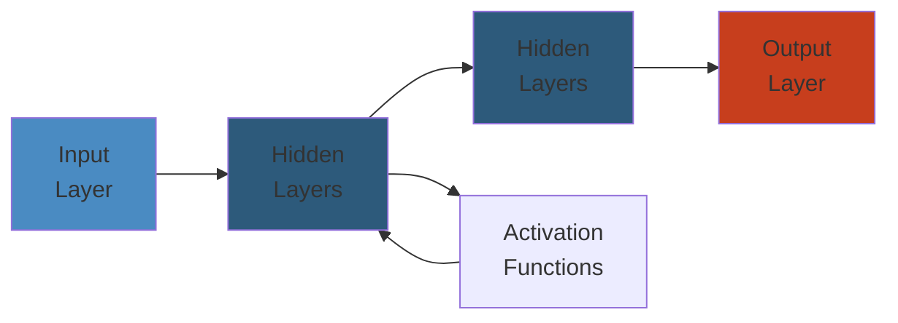

# 🗄️ Amazon RDS — Complete Deep Dive

**Related**: [EC2](../ec2/01-ec2-deep-dive.md) · [Lambda](../lambda/01-lambda-deep-dive.md) · [IAM](../iam/01-iam-deep-dive.md) · [CloudWatch](../cloudwatch/01-cloudwatch-deep-dive.md)

---




## Table of Contents

- [The Big Picture](#-the-big-picture)
- [1. DB Engines](#1-db-engines)
- [2. Multi-AZ](#2-multi-az)
- [3. Read Replicas](#3-read-replicas)
- [4. Backups](#4-backups)
- [5. Snapshots](#5-snapshots)
- [6. Parameter Groups](#6-parameter-groups)
- [7. Option Groups](#7-option-groups)
- [8. Encryption](#8-encryption)
- [9. Performance Insights](#9-performance-insights)
- [10. Auto-Scaling](#10-auto-scaling)
- [11. Maintenance Windows](#11-maintenance-windows)
- [Simplest Mental Model](#-simplest-mental-model)

---

## 🧭 The Big Picture

```text
                        ┌─────────────────────────┐
                        │      Amazon RDS          │
                        │ (Relational Database     │
                        │  Service)                │
                        ├─────────────────────────┤
                        │ Managed DB service       │
                        │ • Automated backups      │
                        │ • Multi-AZ failover      │
                        │ • Read replicas          │
                        │ • Patching & upgrades    │
                        └─────────────────────────┘
                                   │
              ┌────────────────────┼────────────────────┐
              ▼                    ▼                    ▼
      ┌──────────────┐    ┌──────────────┐    ┌──────────────┐
      │  High Avail  │    │   Scalability│    │   Security   │
      │  • Multi-AZ  │    │  • Read Rep. │    │  • Encryption│
      │  • Failover  │    │  • Auto-scale│    │  • VPC       │
      │  • Backup    │    │  • Storage   │    │  • IAM Auth  │
      └──────────────┘    └──────────────┘    └──────────────┘
```

---

## 1. DB Engines

### Engine Comparison

| Feature | Aurora MySQL | Aurora PG | MySQL | PostgreSQL | SQL Server | Oracle | MariaDB |
|---------|-------------|-----------|-------|-----------|------------|--------|---------|
| **Auto-scaling storage** | ✅ Up to 128TB | ✅ Up to 128TB | ✅ | ✅ | ❌ | ❌ | ✅ |
| **Multi-AZ** | ✅ (6 copies) | ✅ (6 copies) | ✅ | ✅ | ✅ | ✅ | ✅ |
| **Read replicas** | Up to 15 (global) | Up to 15 (global) | Up to 5 | Up to 5 (plus cross-region) | Up to 5 | Up to 5 (Active Data Guard) | Up to 5 |
| **Serverless** | ✅ v2 | ✅ v2 | ❌ | ❌ | ❌ | ❌ | ❌ |
| **Performance** | 5x MySQL | 3x PostgreSQL | Baseline | Baseline | Baseline | Baseline | Baseline |
| **License** | AWS | AWS | GPL | PostgreSQL | Microsoft | Oracle | GPL |

### Selecting an Engine

```text
Engine Selection Decision Tree:

Need MySQL compatibility?
  ├── Yes → Need higher performance?
  │         ├── Yes → Aurora MySQL
  │         └── No  → RDS MySQL
  │
  ├── No → Need PostgreSQL compatibility?
  │        ├── Yes → Need higher performance?
  │        │         ├── Yes → Aurora PostgreSQL
  │        │         └── No  → RDS PostgreSQL
  │        │
  │        └── No → Need commercial DB features?
  │                 ├── Oracle features & compatibility → RDS Oracle
  │                 └── SQL Server / .NET integration  → RDS SQL Server
```

### Engine-Specific Features

```text
MySQL:
  • Storage: gp2/gp3/io1
  • Max DB size: 64TB (gp3), 16TB (MySQL 8.0)
  • Max connections: {DBInstanceClassMemory/12582880}
  • Port: 3306

PostgreSQL:
  • Storage: gp2/gp3/io1
  • Extensions: PostGIS, pg_stat_statements, uuid-ossp
  • Port: 5432

Aurora:
  • Storage: Shared cluster volume (auto-scaling)
  • Max 128TB (no manual provisioning)
  • 6 copies across 3 AZs
  • Port: 3306 (MySQL) / 5432 (PostgreSQL)
```

---

## 2. Multi-AZ

### Architecture

```text
Multi-AZ Deployment (Synchronous Replication)

┌───────────────────┐        ┌───────────────────┐
│  AZ-a             │        │  AZ-b             │
│                   │        │                   │
│  ┌───────────┐    │        │  ┌───────────┐    │
│  │  Primary  │    │ Sync   │  │  Standby  │    │
│  │  (writer) │────┼────────┼─►│  (reader) │    │
│  └───────────┘    │        │  └───────────┘    │
│                   │        │                   │
│  ┌───────────┐    │        │  ┌───────────┐    │
│  │  EBS vol  │    │        │  │  EBS vol  │    │
│  └───────────┘    │        │  └───────────┘    │
└───────────────────┘        └───────────────────┘
         │                           │
         └── Automated synchronous replication ──┘
                (same region, different AZ)
```

### Failover Flow

```text
Primary DB becomes unavailable
        │
        ▼
┌───────────────────┐
│ Health check      │
│ fails (30s)       │
└─────────┬─────────┘
          │
          ▼
┌───────────────────┐
│ RDS detects       │
│ automatically    │
└─────────┬─────────┘
          │
          ▼
┌───────────────────┐
│ Standby promoted  │
│ to primary        │
│ (typically 60-120s)│
└─────────┬─────────┘
          │
          ▼
┌───────────────────┐
│ CNAME swap        │
│ (DNS propagated)  │
│ Endpoint unchanged│
└─────────┬─────────┘
          │
          ▼
┌───────────────────┐
│ Application       │
│ reconnects to     │
│ new primary       │
└───────────────────┘
```

### Multi-AZ vs Single-AZ

| Aspect | Single-AZ | Multi-AZ |
|--------|-----------|----------|
| SLA | 99.50% | 99.95% |
| Write availability | Single point | Automatic failover |
| Read scaling | None | Standby not accessible for reads |
| Replication | None | Synchronous |
| Cost | 1x instance + storage | 2x instance + 2x storage |
| Failover time | Manual (hours) | Automatic (1-3 min) |

---

## 3. Read Replicas

### Architecture

```text
Read Replica Flow:

                    ┌──────────────────┐
                    │  Primary DB      │
                    │  (writer)        │
                    └────────┬─────────┘
                             │ Async replication
              ┌──────────────┼──────────────┐
              │              │              │
              ▼              ▼              ▼
      ┌────────────┐ ┌────────────┐ ┌────────────┐
      │ RR 1       │ │ RR 2       │ │ RR 3       │
      │ (read-only)│ │ (read-only)│ │ (read-only)│
      │ AZ-a       │ │ AZ-b       │ │ eu-west-1  │
      └────────────┘ └────────────┘ └────────────┘
```

### Cross-Region Read Replica

```text
us-east-1                     eu-west-1
┌──────────────┐             ┌──────────────┐
│ Primary DB   │────────────►│ Read Replica  │
│ (writer)     │  Async VPN  │ (reader)      │
└──────────────┘             └──────────────┘

Limitations:
  • Additional charge for data transfer
  • ~1-5 second lag (cross-region)
  • Can't be promoted to primary in same region
```

### Promotion Flow

```text
Promote Read Replica to Primary:
        │
        ▼
┌───────────────────┐
│ Stop replication  │
│ (breaks replica   │
│  relationship)    │
└─────────┬─────────┘
          │
          ▼
┌───────────────────┐
│ Replica becomes   │
│ standalone DB     │
│ instance          │
└─────────┬─────────┘
          │
          ▼
┌───────────────────┐
│ Can now accept    │
│ writes            │
│ (full read/write) │
└───────────────────┘

Common use: Disaster recovery promotion
```

---

## 4. Backups

### Automated Backup

```text
┌────────────────────────────────────────────┐
│ Backup Window (30 min, configurable)        │
│                                             │
│ Daily snapshot (during window)              │
│ Transaction logs (every 5 minutes)          │
│                                             │
│ Retention: 0-35 days                        │
│                                             │
│ Backup Timeline:                            │
│ ─┬───────┬───────┬───────┬───────┬───────┬─►
│  │   S   │  S    │  S    │  S    │  S    │
│  │  nap  │  nap  │  nap  │  nap  │  nap  │
│  └───────┴───────┴───────┴───────┴───────┘
│  Logs: ════╤═══╤═══╤═══╤═══╤═══╤═══╤═══
│  PITR: Restore to any second within window
└────────────────────────────────────────────┘
```

### Point-in-Time Recovery (PITR)

```text
Point-in-Time Recovery:
        │
        ▼
┌────────────────────────────────────┐
│ 1. RDS chooses the latest snapshot │
│    before your target time          │
├────────────────────────────────────┤
│ 2. Applies transaction logs up to  │
│    the target timestamp             │
├────────────────────────────────────┤
│ 3. Creates a NEW DB instance       │
│    (not in-place restore)           │
├────────────────────────────────────┤
│ 4. New instance is independent     │
│    (can promote to primary)        │
└────────────────────────────────────┘
```

---

## 5. Snapshots

### Manual Snapshot

```text
Manual Snapshot:
  • User-initiated (can be automated via scripts)
  • Stored in S3 (visible in RDS console)
  • No expiration (retained until you delete it)
  • First snapshot: full size
  • Subsequent: incremental (only changed blocks)
  • Can be shared across accounts (read-only)
  • Can be copied across regions
```

### Snapshot Export to S3

```text
RDS Snapshot ──export──> S3 (Parquet format)
        │
        ▼
┌────────────────────────────────────┐
│ Can analyze with:                  │
│ • AWS Athena (SQL queries)         │
│ • AWS Glue (ETL jobs)              │
│ • Redshift Spectrum                │
│ • SageMaker (ML training)          │
└────────────────────────────────────┘
```

```awscli
# Create manual snapshot
aws rds create-db-snapshot \
  --db-instance-identifier my-db \
  --db-snapshot-identifier my-db-pre-upgrade

# Copy snapshot across regions
aws rds copy-db-snapshot \
  --source-db-snapshot-identifier arn:aws:rds:us-east-1:123456789012:snapshot:my-snapshot \
  --target-db-snapshot-identifier my-snapshot-copy \
  --source-region us-east-1 \
  --region eu-west-1

# Restore from snapshot
aws rds restore-db-instance-from-db-snapshot \
  --db-instance-identifier my-db-restored \
  --db-snapshot-identifier my-snapshot
```

---

## 6. Parameter Groups

### Parameter Group Types

```text
┌─────────────────────────────┐
│  Parameter Group            │
├─────────────────────────────┤
│  Static: require reboot     │
│  • shared_buffers (PG)      │
│  • innodb_buffer_pool_size  │
│  • max_connections          │
├─────────────────────────────┤
│  Dynamic: applied without    │
│  reboot                     │
│  • time_zone (MySQL)        │
│  • log_min_duration_statement│
│  • work_mem (PG)            │
└─────────────────────────────┘
```

### Custom Parameter Group Example (PostgreSQL)

```json
{
  "DBParameterGroupName": "my-pg-optimized",
  "DBParameterGroupFamily": "postgres16",
  "Description": "Optimized for analytics workload",
  "Parameters": {
    "shared_buffers": "{DBInstanceClassMemory/4096}",
    "effective_cache_size": "{DBInstanceClassMemory/2048}",
    "work_mem": "65536",
    "maintenance_work_mem": "{DBInstanceClassMemory/8192}",
    "random_page_cost": "1.1",
    "effective_io_concurrency": "200",
    "log_min_duration_statement": "1000",
    "idle_in_transaction_session_timeout": "300000"
  }
}
```

### Parameter Group Lifecycle

```text
Default PG ──> Create Custom PG ──> Modify parameters ──> Apply to DB
      │              │                     │                     │
  Engine-default  Copy of default     Static → reboot      Instance uses
                                      Dynamic → immediate   modified values
```

---

## 7. Option Groups

### Option Groups vs Parameter Groups

```text
Parameter Groups:
  Modify database engine parameters
  (buffer sizes, timeouts, logging)

Option Groups:
  Enable/disable features and extensions
  (SSL, encryption, Oracle APEX, SQL Server audit)
```

### Common Options

| Engine | Option | Purpose |
|--------|--------|---------|
| Oracle | APEX | Oracle Application Express |
| Oracle | NAT Network | Network Address Translation |
| Oracle | Timezone | Timezone file updates |
| SQL Server | TDE | Transparent Data Encryption |
| SQL Server | SQL Server Audit | Audit database activity |
| MySQL | MARIADB_AUDIT_PLUGIN | Audit log |
| MySQL | MEMCACHED | InnoDB memcached plugin |

---

## 8. Encryption

### Encryption at Rest

```text
RDS Encryption Flow:

Create DB Instance
        │
        ▼
┌─────────────────────────────┐
│ Enable encryption           │
│ (can't be done after        │
│  creation — must restore)   │
└────────┬────────────────────┘
         │
         ▼
┌─────────────────────────────┐
│ KMS Key (AWS managed or CMK)│
│ • Encrypt data in EBS       │
│ • Encrypt automated backups │
│ • Encrypt snapshots         │
│ • Encrypt read replicas     │
│   (same key or different)   │
└─────────────────────────────┘
```

### Encryption in Transit

```text
Application ──SSL/TLS──> RDS Instance
                         │
                         ├── Requires CA certificate on client
                         ├── Enforce SSL via parameter group:
                         │   MySQL: require_secure_transport=1
                         │   PG: rds.force_ssl=1
                         └── Ports: 3306 (MySQL), 5432 (PG)
```

### IAM Database Authentication

```text
┌──────────┐  Generate auth token   ┌──────────┐
│  EC2     │ ──────────────────────►│  RDS     │
│  (IAM    │  (boto3/rds.generate_db│  (IAM auth│
│   role)  │   auth_token)          │   enabled)│
│          │◄────────────────────────│          │
│          │  Token valid 15 min    │          │
│          │  Used as password      │          │
└──────────┘                       └──────────┘
```

```python
# Python example: IAM DB auth
import boto3
import pymysql

def get_connection():
    client = boto3.client("rds")
    token = client.generate_db_auth_token(
        DBHostname="my-db.abcdef.us-east-1.rds.amazonaws.com",
        Port=3306,
        DBUsername="iam_user",
        Region="us-east-1"
    )

    return pymysql.connect(
        host="my-db.abcdef.us-east-1.rds.amazonaws.com",
        user="iam_user",
        password=token,
        database="mydb"
    )
```

---

## 9. Performance Insights

### Performance Schema

```text
┌─────────────────────────────────────────────┐
│        Performance Insights Dashboard        │
│                                             │
│  ┌────────────┐  ┌──────────────────────┐   │
│  │ DB Load    │  │  Top SQL             │   │
│  │ (average   │  │  SELECT * FROM       │   │
│  │  sessions) │  │  orders WHERE ...    │──►│
│  │    ▲       │  │  UPDATE users SET    │──►│
│  │    │       │  │  ...                  │   │
│  │    └──────►│  └──────────────────────┘   │
│  │   Time     │                             │
│  └────────────┘                             │
│                                             │
│  Waits: CPU 40% / IO 35% / Lock 15% / Other│
│  Top waits by count: row lock wait, IO read │
└─────────────────────────────────────────────┘
```

### Retention Tiers

| Tier | Retention | Cost |
|------|-----------|------|
| Free (basic metrics) | 7 days | Free |
| Full (7 days) | 7 days | $0.015/hr per DB instance |
| Full (2 years) | Up to 2 years | $0.030/hr per DB instance |

### Enabling Performance Insights

```awscli
aws rds create-db-instance \
  --db-instance-identifier my-db \
  --enable-performance-insights \
  --performance-insights-retention-period 7
```

---

## 10. Auto-Scaling

### Storage Auto-Scaling

```text
Storage Auto-Scaling Behavior:
        │
        ▼
┌─────────────────────────────────┐
│ Monitor: Free storage space     │
│ Threshold: < 10% of allocated   │
│ or < 200MB (whichever lower)    │
├─────────────────────────────────┤
│ Scale up increment:             │
│ • 10% of current allocated      │
│ • Minimum: 5GB                  │
│ • Maximum: engine limit         │
├─────────────────────────────────┤
│ Cooldown: 6 hours between       │
│ scaling operations              │
├─────────────────────────────────┤
│ No downtime — transparent       │
│ to application                  │
└─────────────────────────────────┘
```

### Maximum Storage Thresholds

| Engine | Maximum Storage |
|--------|----------------|
| MySQL (gp3) | 64 TB |
| PostgreSQL (gp3) | 64 TB |
| MariaDB (gp3) | 64 TB |
| SQL Server | 16 TB |
| Oracle | 64 TB |
| Aurora | 128 TB (auto) |

---

## 11. Maintenance Windows

### Maintenance Types

```text
Maintenance Categories:
┌──────────────────────────────┐
│ OS Updates (RDS-managed)     │
│ • Security patches           │
│ • Minor OS updates           │
│ • Typically 15-30 min        │
├──────────────────────────────┤
│ DB Engine Minor Versions     │
│ • Bug fixes, security patches│
│ • May require reboot         │
│ • Can be deferred            │
├──────────────────────────────┤
│ DB Engine Major Versions     │
│ • New features, breaking     │
│ • Manual trigger required    │
│ • Longer downtime (upgrades) │
└──────────────────────────────┘
```

### Window Configuration

```json
{
  "PreferredMaintenanceWindow": "sun:05:00-sun:06:00",
  "AutoMinorVersionUpgrade": true,
  "BackupRetentionPeriod": 30,
  "PreferredBackupWindow": "03:00-03:30"
}
```

### Maintenance Best Practices

| Practice | Why |
|----------|-----|
| Set window during low traffic | Minimize impact |
| Use Multi-AZ | Failover during maintenance |
| Enable automatic minor version | Security patches |
| Test major upgrades in staging | Version compatibility |
| Monitor RDS events via SNS | Know when maintenance happens |
| Use parameter group for deferred changes | Control when configs apply |

---

## 🧠 Simplest Mental Model

```text
RDS INSTANCE    =  A managed database you rent.
                   Like hiring a DBA team to run
                   your MySQL/PostgreSQL for you.

MULTI-AZ        =  Two identical servers in different
                   buildings. If one catches fire,
                   the other takes over instantly.

READ REPLICA    =  A photocopy machine for your data.
                   Write to original, read from copies.
                   Copies can be in other cities.

BACKUPS         =  Daily photo of your data + every
                   5-minute note of changes.
                   Go back to any moment in time.

SNAPSHOTS       =  Manual photos you take before
                   big upgrades. "Before photo" to
                   restore if upgrade goes wrong.

PARAMETER GROUP =  Tuning knobs under the hood.
                   Change buffer sizes, timeout limits.
                   Some require engine restart.

PERFORMANCE     =  Dashboard showing exactly what's
INSIGHTS          slowing your DB down — CPU, IO,
                   or waiting for a locked row.

AUTO-SCALING    =  A smart storage unit that expands
                   when you run out of space.
                   No need to predict how big it gets.

MAINTENANCE     =  The 1-hour window at 3am Sunday
                   when AWS changes oil and filters.
                   Use Multi-AZ to avoid downtime.
```

---

**Next**: [IAM Deep Dive](../iam/01-iam-deep-dive.md) — Access management
