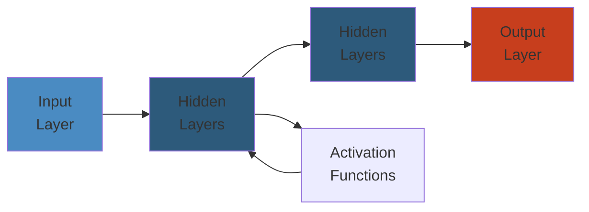

# 📦 Amazon S3 — Complete Deep Dive

**Related**: [EC2](../ec2/01-ec2-deep-dive.md) · [CloudWatch](../cloudwatch/01-cloudwatch-deep-dive.md) · [IAM](../iam/01-iam-deep-dive.md)

---




## Table of Contents

- [The Big Picture](#-the-big-picture)
- [1. Buckets & Objects](#1-buckets--objects)
- [2. Storage Classes](#2-storage-classes)
- [3. Versioning](#3-versioning)
- [4. Lifecycle Policies](#4-lifecycle-policies)
- [5. Encryption](#5-encryption)
- [6. Presigned URLs](#6-presigned-urls)
- [7. Static Hosting](#7-static-hosting)
- [8. Consistency Model](#8-consistency-model)
- [9. Cross-Region Replication](#9-cross-region-replication)
- [10. S3 Glacier](#10-s3-glacier)
- [11. Performance Optimization](#11-performance-optimization)
- [Simplest Mental Model](#-simplest-mental-model)

---

## 🧭 The Big Picture

```text
                         ┌─────────────────────────┐
                         │      Amazon S3           │
                         │  (Simple Storage Service)│
                         ├─────────────────────────┤
                         │  • Unlimited storage     │
                         │  • 99.999999999% durability │
                         │  • 99.99% availability   │
                         │  • Object storage (not block)│
                         └─────────────────────────┘
                                   │
          ┌────────────────────────┼────────────────────────┐
          ▼                        ▼                        ▼
  ┌──────────────┐        ┌──────────────┐        ┌──────────────┐
  │   Storage    │        │   Security   │        │   Analytics  │
  │   Classes    │        │   Encryption │        │  Athena/Redshift│
  │   Lifecycle  │        │   IAM/CORS   │        │  S3 Select   │
  └──────────────┘        └──────────────┘        └──────────────┘
```

---

## 1. Buckets & Objects

### Bucket Naming Rules

- Globally unique (across all AWS accounts, all regions)
- 3-63 characters, lowercase, no underscores
- Must start with lowercase letter or number
- Can't be formatted like IP address

### Object Structure

```text
┌─────────────────────────────────────────┐
│              S3 Object                  │
├─────────────────────────────────────────┤
│  Key          : path/to/file.pdf        │
│  Version ID   : 3fX9... (if versioned)  │
│  Value        : binary data (0 bytes - 5TB) │
│  Metadata     : system + user-defined   │
│  Tags         : up to 10 per object     │
│  ACL          : canned / custom         │
└─────────────────────────────────────────┘
```

### Anatomy of an S3 Key

```text
s3://bucket-name/path/to/object/file.txt
      │              │
      │              └── Key (including prefix)
      └── Bucket Name (globally unique)
```

### CRUD Operations

```awscli
# Create bucket
aws s3 mb s3://my-bucket --region us-east-1

# Upload object
aws s3 cp file.txt s3://my-bucket/path/file.txt

# List objects
aws s3 ls s3://my-bucket --recursive

# Delete object
aws s3 rm s3://my-bucket/path/file.txt

# Multi-part upload (for large files > 100MB)
aws s3 cp large-file.iso s3://my-bucket/ \
  --cli-write-timeout 0 --cli-read-timeout 0
```

### Multi-Part Upload Flow

```text
Upload large file
        │
        ▼
┌───────────────────┐
│ Initiate MPU      │ → UploadId returned
└─────────┬─────────┘
          │
          ▼
┌───────────────────┐
│ Upload Part 1     │ → ETag abc
│ Upload Part 2     │ → ETag def
│ Upload Part 3     │ → ETag ghi
│        ...        │
└─────────┬─────────┘
          │
          ▼
┌───────────────────┐
│ Complete MPU      │ → Single object assembled
└───────────────────┘
```

---

## 2. Storage Classes

### Comparison

| Class | Durability | Availability | Min Duration | Retrieval | Use Case |
|-------|-----------|-------------|-------------|-----------|----------|
| S3 Standard | 11 9's | 99.99% | None | Instant | Frequently accessed |
| S3 Intelligent-Tiering | 11 9's | 99.9% | None | Instant | Unknown patterns |
| S3 Standard-IA | 11 9's | 99.9% | 30 days | Instant | Infrequent, quick access |
| S3 One Zone-IA | 11 9's | 99.5% | 30 days | Instant | Recreatable data |
| S3 Glacier Instant Retrieval | 11 9's | 99.9% | 90 days | ms | Archived, instant access |
| S3 Glacier Flexible Retrieval | 11 9's | 99.99% | 90 days | 1-5 min | Archived, fast retrieval |
| S3 Glacier Deep Archive | 11 9's | 99.99% | 180 days | 12 hours | Last resort archive |

### Cost Hierarchy

```text
Higher Cost ───────────────────────────────────────────► Lower Cost

S3 Standard  >  INT  >  Std-IA  >  1Z-IA  >  Glacier IR  >  Glacier FR  >  Deep Archive

Faster Access ◄─────────────────────────────────────────── Slower Access
```

### Intelligent-Tiering

```text
┌─────────────────────────────────────────────┐
│        S3 Intelligent-Tiering                │
│                                             │
│  Frequent Access Tier  ─────────────────┐   │
│   (default, no cost)                    │   │
│                                         ▼   │
│                              Monitoring      │
│                              (30 days)       │
│                                         │   │
│  Infrequent Access Tier ◄────────────────┘   │
│   (+ monitoring fee)                         │
│                                         │   │
│  Archive Instant Tier ◄─────────────────┘   │
│   (90+ days)                                 │
│                                         │   │
│  Archive Access Tier ◄──────────────────┘   │
│   (90+ days)                                │
│                                         │   │
│  Deep Archive Tier ◄──────────────────────┘ │
│   (180+ days)                                │
└─────────────────────────────────────────────┘
```

---

## 3. Versioning

### How It Works

```text
Without Versioning                    With Versioning
┌──────────────┐                      ┌──────────────┐
│  my-file.txt │                      │  my-file.txt │
│  (overwrite) │                      │  (version 3) │◄── Latest
└──────────────┘                      │  my-file.txt │
                                      │  (version 2) │
                                      │  my-file.txt │
                                      │  (version 1) │
                                      └──────────────┘
```

### Enable Versioning

```awscli
# Enable versioning on a bucket
aws s3api put-bucket-versioning \
  --bucket my-bucket \
  --versioning-configuration Status=Enabled

# List object versions
aws s3api list-object-versions \
  --bucket my-bucket --prefix path/file.txt

# Get specific version
aws s3api get-object \
  --bucket my-bucket --key path/file.txt \
  --version-id 3fX9abc... my-file.txt

# Delete (creates delete marker)
aws s3api delete-object \
  --bucket my-bucket --key path/file.txt
```

### Delete Marker Behavior

```text
DELETE operation on versioned bucket:
        │
        ▼
┌─────────────────────────────┐
│  Delete Marker created      │
│  (version: 4, marker: true) │  ← Object appears deleted
├─────────────────────────────┤
│  my-file.txt (version 3)    │
│  my-file.txt (version 2)    │  ← Can be restored by
│  my-file.txt (version 1)    │     deleting the marker
└─────────────────────────────┘
```

### Versioning States

| State | Effect | Can Transition To |
|-------|--------|------------------|
| Unversioned (default) | Objects created with null version ID | Enabled or Suspended |
| Enabled | Every operation creates a new version | Suspended only |
| Suspended | New objects have null version ID, existing versions preserved | Enabled |

---

## 4. Lifecycle Policies

### Lifecycle Rule Structure

```json
{
  "Rules": [
    {
      "Id": "ArchiveLogs",
      "Status": "Enabled",
      "Filter": {
        "Prefix": "logs/"
      },
      "Transitions": [
        {
          "Days": 30,
          "StorageClass": "STANDARD_IA"
        },
        {
          "Days": 90,
          "StorageClass": "GLACIER"
        },
        {
          "Days": 365,
          "StorageClass": "DEEP_ARCHIVE"
        }
      ],
      "Expiration": {
        "Days": 2555
      }
    }
  ]
}
```

### Lifecycle Flow

```text
Object Created
      │
      ▼
┌─────────────┐    30 days     ┌──────────────┐
│ S3 Standard ├──────────────► │ Standard-IA   │
└─────────────┘                └──────┬───────┘
                                      │ 60 days
                                      ▼
                              ┌──────────────┐
                              │ Glacier IR    │
                              └──────┬───────┘
                                     │ 180 days
                                     ▼
                              ┌──────────────┐
                              │ Deep Archive  │
                              └──────┬───────┘
                                     │ 2555 days (7 years)
                                     ▼
                              ┌──────────────┐
                              │  Expired      │
                              │  (deleted)    │
                              └──────────────┘
```

### Abort Incomplete Multipart Uploads

```json
{
  "AbortIncompleteMultipartUpload": {
    "DaysAfterInitiation": 7
  }
}
```

---

## 5. Encryption

### Encryption Options

```text
Encryption at Rest (server-side):

┌─────────────────────────────────────────────────┐
│            SSE-S3                               │
│  S3 managed keys (AES-256)                      │
│  No additional charge, no key management        │
│  Default for all new buckets                    │
├─────────────────────────────────────────────────┤
│            SSE-KMS                             │
│  AWS KMS managed keys                           │
│  Separate permissions for key access            │
│  Can use customer-managed CMK                   │
│  Additional KMS charges apply                   │
├─────────────────────────────────────────────────┤
│            SSE-C                               │
│  Customer-provided encryption keys              │
│  You manage the keys, S3 does encryption        │
│  Must provide key with every request            │
├─────────────────────────────────────────────────┤
│            Client-Side                         │
│  Encrypt before uploading to S3                 │
│  S3 never sees plaintext                        │
│  SDK libraries available (S3C)                  │
└─────────────────────────────────────────────────┘
```

### Encryption in Transit

```text
Client ─── HTTPS (TLS) ───> S3 Endpoint
                    │
                    ◄── Recommended over HTTP
```

### Bucket Policy for Enforcing Encryption

```json
{
  "Effect": "Deny",
  "Principal": "*",
  "Action": "s3:PutObject",
  "Resource": "arn:aws:s3:::my-bucket/*",
  "Condition": {
    "StringNotEquals": {
      "s3:x-amz-server-side-encryption": "AES256"
    }
  }
}
```

---

## 6. Presigned URLs

### How They Work

```text
┌────────┐  Request URL    ┌──────────┐
│ Owner  │ ───────────────►│ AWS S3    │
│(IAM)   │                 │          │
│        │◄────────────────│          │
└────────┘  Presigned URL  └────┬─────┘
                                │
                          URL + Signature
                                │
┌────────┐                      │ ┌────────┐
│ Client │ ◄────────────────────┘ │ Client │
│  GET   │    Presigned URL        │  PUT   │
│(read)  │    (valid 1 hour)      │(write) │
└────────┘                        └────────┘
```

### CLI Examples

```awscli
# Generate presigned URL for GET (default 3600s)
aws s3 presign s3://my-bucket/file.pdf \
  --expires-in 3600

# Generate presigned URL for PUT
aws s3 presign s3://my-bucket/upload.pdf \
  --expires-in 300 --method PUT

# With custom parameters
aws s3api get-object --bucket my-bucket \
  --key file.pdf \
  --response-content-disposition "attachment; filename=download.pdf"
```

### Use Cases

| Use Case | Method | Expiration |
|----------|--------|------------|
| Private file sharing | GET | Hours (short-lived) |
| Direct browser upload | PUT | 5-15 minutes |
| Form upload from website | POST | 5 minutes |
| Temporary download link | GET | 1-7 days |

---

## 7. Static Hosting

### Configuration

```text
Static Website Endpoint:
http://<bucket-name>.s3-website-<region>.amazonaws.com
```

```json
{
  "IndexDocument": {
    "Suffix": "index.html"
  },
  "ErrorDocument": {
    "Key": "error.html"
  },
  "RoutingRules": [
    {
      "Condition": {
        "KeyPrefixEquals": "docs/"
      },
      "Redirect": {
        "ReplaceKeyPrefixWith": "documents/"
      }
    }
  ]
}
```

### Bucket Policy for Public Read

```json
{
  "Version": "2012-10-17",
  "Statement": [
    {
      "Effect": "Allow",
      "Principal": "*",
      "Action": "s3:GetObject",
      "Resource": "arn:aws:s3:::my-static-site/*"
    }
  ]
}
```

### Architecture with CloudFront

```text
                       ┌──────────┐
                       │  Route53 │
                       └────┬─────┘
                            │
                       ┌────▼─────┐
                       │CloudFront│
                       │  CDN     │
                       └────┬─────┘
                     ┌──────┴──────┐
                     │              │
               ┌─────▼────┐   ┌────▼─────┐
               │ S3 Bucket │   │ Custom   │
               │ (origin)  │   │ Origin   │
               └───────────┘   └──────────┘
```

---

## 8. Consistency Model

### Current Model (Strong Consistency)

```text
As of December 2020 — Strong Read-After-Write Consistency

READ after WRITE:
  Client:  PUT object X
           GET object X  →  ✅ Always returns latest version
           (no more "eventually consistent" behavior)

READ after DELETE:
  Client:  DELETE object X
           GET object X  →  ✅ 404 Not Found (immediate)

READ after OVERWRITE:
  Client:  PUT object X (v1)
           PUT object X (v2)
           GET object X  →  ✅ Returns v2 (immediate)

LIST after WRITE:
  Client:  PUT object X
           LIST bucket   →  ✅ Object X included
```

### What Is Still Eventually Consistent

| Operation | Behavior |
|-----------|----------|
| List objects after delete | Delete marker visible immediately |
| Cross-region replication | Asynchronous — minutes to hours |
| S3 Object Lambda | Depends on underlying object |
| Bucket operation propagation | New bucket policies take seconds |

---

## 9. Cross-Region Replication

### Replication Types

```text
SRR (Same-Region Replication)           CRR (Cross-Region Replication)

  us-east-1                    us-east-1          eu-west-1
  ┌──────────┐                 ┌──────────┐       ┌──────────┐
  │ Bucket A │                 │ Bucket A │──────►│ Bucket B │
  │ (source) ├─────────────┐   │ (source) │       │ (replica)│
  └──────────┘              │   └──────────┘       └──────────┘
                            ▼
                   ┌──────────────┐
                   │ Same Region  │
                   │ Bucket B     │
                   │ (replica)    │
                   └──────────────┘
```

### Setup Requirements

```json
{
  "Role": "arn:aws:iam::account:role/s3-replication-role",
  "Rules": [
    {
      "Status": "Enabled",
      "Filter": {
        "Prefix": "production/"
      },
      "Destination": {
        "Bucket": "arn:aws:s3:::destination-bucket",
        "StorageClass": "STANDARD_IA"
      },
      "DeleteMarkerReplication": { "Status": "Enabled" },
      "SourceSelectionCriteria": {
        "SseKmsEncryptedObjects": { "Status": "Enabled" }
      }
    }
  ]
}
```

### What Gets Replicated

| Item | Replicated? |
|------|-------------|
| New objects | ✅ Yes |
| Object metadata | ✅ Yes |
| ACL updates | ✅ Yes |
| Delete markers | ⚠️ Optional |
| Tags | ✅ Yes |
| Objects before enabling replication | ❌ No (use S3 Batch Replication) |
| SSE-KMS objects | ⚠️ If configured |
| Versioned deletions (permanent) | ❌ No |

---

## 10. S3 Glacier

### Retrieval Options

| Retrieval Option | Speed | Cost | Min Storage |
|-----------------|-------|------|-------------|
| **Expedited** | 1-5 minutes | High | 90 days |
| **Standard** | 3-5 hours | Medium | 90 days |
| **Bulk** | 5-12 hours | Low | 90 days |

### Glacier vs Deep Archive

```text
Feature                 Glacier             Deep Archive
──────────────────────────────────────────────────────────
Durability              11 9's              11 9's
Retrieval (Standard)    3-5 hours           12 hours
Retrieval (Bulk)        5-12 hours          48 hours
Min storage charge      90 days             180 days
Cost/GB/month           ~$0.004             ~$0.00099
Use case                Quarterly access    Last resort
```

### Restore Flow

```text
Object in Glacier
        │
        ▼
┌───────────────────┐
│ Initiate Restore  │
│ POST /restore     │
└─────────┬─────────┘
          │
          ▼
┌───────────────────┐
│ Temporary Copy    │  ← Available for defined period
│ Created in S3     │    (RRS, accessible)
└─────────┬─────────┘
          │
          ▼
┌───────────────────┐
│ Access via S3 GET │  ← Must use restored copy URL
│ within window     │
└─────────┬─────────┘
          │
          ▼
┌───────────────────┐
│ Temporary Copy    │  ← Deleted automatically
│ Expires           │
└───────────────────┘
```

---

## 11. Performance Optimization

### Best Practices

```text
DO:
├── Use multipart upload for objects > 100MB
├── Use S3 Transfer Acceleration for long distances
├── Use CloudFront CDN for frequent access
├── Use byte-range fetches for large file partial reads
├── Use S3 Select/Athena for filtering before download
└── Randomize key prefixes to avoid partition hotspots

DON'T:
├── Don't use sequential timestamps as key prefixes
├── Don't list buckets with 100M+ objects (use pagination)
├── Don't PUT/GET from same bucket across 1000s of requests/sec
└── Don't use S3 as a filesystem (no locking, no append)
```

### Key Prefix Strategy for High Throughput

```text
❌ BAD: Sequential prefixes (partition hotspot)
  logs/2025/01/01/10:00:00-001.log
  logs/2025/01/01/10:00:00-002.log
  logs/2025/01/01/10:00:00-003.log

✅ GOOD: Randomized prefixes (even distribution)
  logs/a1b2/2025-01-01T10:00:00Z
  logs/x9k3/2025-01-01T10:00:01Z
  logs/m4n7/2025-01-01T10:00:02Z
```

### Performance Limits

```text
S3 Performance:
  ┌────────────────────────────────────┐
  │ PUT/LIST/DELETE: 3,500 req/s      │
  │  per prefix                        │
  ├────────────────────────────────────┤
  │ GET/HEAD: 5,500 req/s per prefix   │
  ├────────────────────────────────────┤
  │ No limit on total requests         │
  │ (spread across prefixes)           │
  ├────────────────────────────────────┤
  │ Multipart: 10,000 parts max        │
  │ Part size: 5MB - 5GB (last part)   │
  └────────────────────────────────────┘
```

### S3 Transfer Acceleration

```text
Client (Tokyo) ───────────────────────────► S3 (Virginia)
        │                                        ▲
        │ Slow direct (~300ms)                   │
        │                                        │
        ▼                                        │
┌──────────────┐                                 │
│  Edge Location│──── AWS Edge Network ──────────┘
│  (Tokyo)      │    Optimized path (~120ms)
└──────────────┘
```

### Multipart Upload with CLI

```awscli
# Configure multipart thresholds
aws configure set s3.max_concurrent_requests 10
aws configure set s3.multipart_threshold 64MB
aws configure set s3.multipart_chunksize 16MB
aws configure set s3.max_bandwidth 100MB/s
```

---

## 🧠 Simplest Mental Model

```text
S3 BUCKET        =  A warehouse with infinite shelves
S3 OBJECT        =  A box on a shelf, with a label (key),
                    contents (data), and tags (metadata)

STORAGE CLASSES  =  Different shelf types:
   Standard      =  Front room shelves — grab instantly
   Standard-IA   =  Back room shelves — slightly more walk
   Glacier       =  Offsite deep storage vault — call ahead
   Deep Archive  =  Buried in a salt mine — 12 hour retrieval

VERSIONING       =  Each time you put a box, the warehouse
                    keeps the old box too. "Delete marker"
                    just hides the stack from view.

LIFECYCLE        =  Automatic moving crew: after 30 days,
                    move box to back room; after 90 days,
                    send to offsite vault; after 7 years,
                    shred it.

PRESIGNED URL    =  A time-limited access badge for the
                    warehouse. Expires automatically.

CRR              =  Automatic box duplication to another
                    warehouse in a different city.
```

---

**Next**: [EC2 Deep Dive](../ec2/01-ec2-deep-dive.md) — Virtual servers in the cloud
