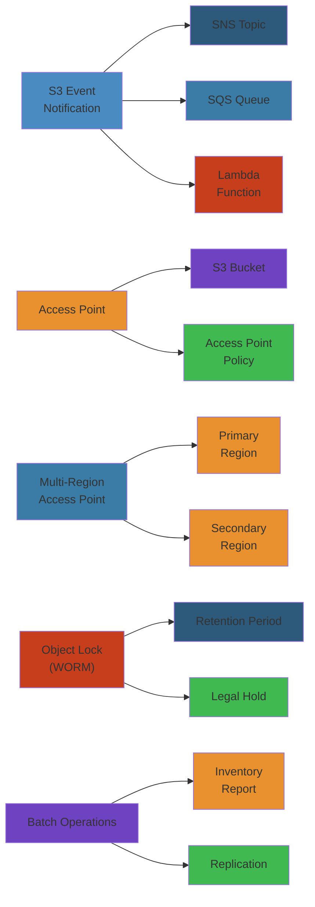

# 🪣 S3 Advanced Patterns — Complete Deep Dive

**Related**: [S3 Basics](01-s3-deep-dive.md) · [IAM](../iam/01-iam-deep-dive.md) · [CloudWatch](../cloudwatch/02-cloudwatch-observability.md) · [Lambda](../lambda/01-lambda-deep-dive.md)

---




## Table of Contents

#### Step-by-Step
1. Process input
2. Validate
3. Execute
4. Return result

#### Code Example
```python
# Example implementation
pass
```

#### Real-World Scenario
This pattern is commonly used in production systems.


- [The Big Picture](#-the-big-picture)
- [1. Event Notifications](#1-event-notifications)
- [2. Batch Operations](#2-batch-operations)
- [3. Object Lambda](#3-object-lambda)
- [4. Access Points & Multi-Region Access Points](#4-access-points--multi-region-access-points)
- [5. Object Lock (WORM)](#5-object-lock-worm)
- [6. S3 Select & Glacier Select](#6-s3-select--glacier-select)
- [7. Storage Lens](#7-storage-lens)
- [8. Intelligent-Tiering Deep Dive](#8-intelligent-tiering-deep-dive)
- [9. Replication (SRR, CRR, RTC)](#9-replication-srr-crr-rtc)
- [10. Transfer Acceleration](#10-transfer-acceleration)
- [11. Presigned URL Patterns](#11-presigned-url-patterns)
- [12. Static Hosting + CloudFront](#12-static-hosting--cloudfront)
- [13. API Consistency Deep Dive](#13-api-consistency-deep-dive)
- [14. Performance Optimization](#14-performance-optimization)
- [15. Security Deep Dive](#15-security-deep-dive)
- [16. Cost Optimization](#16-cost-optimization)
- [17. Cross-Account Access Patterns](#17-cross-account-access-patterns)
- [Simplest Mental Model](#-simplest-mental-model)

---

## 🧭 The Big Picture

#### Step-by-Step
1. Process input
2. Validate
3. Execute
4. Return result

#### Code Example
```python
# Example implementation
pass
```

#### Real-World Scenario
This pattern is commonly used in production systems.


```text
                         ┌──────────────────────────────┐
                         │     S3 Advanced Patterns      │
                         │  Beyond basic CRUD & storage  │
                         ├──────────────────────────────┤
                         │  • Event-driven processing    │
                         │  • Transform at read/write    │
                         │  • Policy-based access control│
                         │  • Cost-intelligent tiering   │
                         └──────────────────────────────┘
                                    │
        ┌──────────────────────────┼──────────────────────────┐
        ▼                          ▼                          ▼
┌──────────────┐          ┌──────────────┐          ┌──────────────┐
│   Processing │          │   Security   │          │   Cost    │
│ • EventBridge│          │ • Bucket Keys │          │ • Storage Lens│
│ • Batch Ops  │          │ • Access Pts │          │ • Lifecycle  │
│ • Object Lmd │          │ • Object Lock│          │ • INT Tiering│
│ • Select     │          │ • VPC Endpt  │          │ • Transfer Ac│
└──────────────┘          └──────────────┘          └──────────────┘
```

---

## 1. Event Notifications

#### Step-by-Step
1. Process input
2. Validate
3. Execute
4. Return result

#### Code Example
```python
# Example implementation
pass
```

#### Real-World Scenario
This pattern is commonly used in production systems.


### Event Types

#### Step-by-Step
1. Process input
2. Validate
3. Execute
4. Return result

#### Code Example
```python
# Example implementation
pass
```

#### Real-World Scenario
This pattern is commonly used in production systems.


| Event Type | Trigger | Use Case |
|-----------|---------|----------|
| `s3:ObjectCreated:*` | All creates | Ingest pipeline |
| `s3:ObjectCreated:Put` | PUT only | Upload tracking |
| `s3:ObjectCreated:Copy` | COPY only | Replication events |
| `s3:ObjectCreated:CompleteMultipartUpload` | MPU complete | Large file ingest |
| `s3:ObjectRemoved:*` | All deletes | Audit logging |
| `s3:ObjectRestore:*` | Glacier restore | Restore tracking |
| `s3:LifecycleExpiration:*` | Lifecycle | Compliance |
| `s3:ObjectTagging:*` | Tag changes | Metadata sync |

### Destination Comparison

#### Step-by-Step
1. Process input
2. Validate
3. Execute
4. Return result

#### Code Example
```python
# Example implementation
pass
```

#### Real-World Scenario
This pattern is commonly used in production systems.


```text
┌──────────────────┬──────────┬───────────┬──────────────┐
│                  │   SQS    │    SNS    │  Lambda      │
├──────────────────┼──────────┼───────────┼──────────────┤
│ Payload size max │ 256 KB  │ 256 KB    │ 256 KB       │
│ Ordering         │ Best-effort│ Best-effort│ N/A       │
│ Retry            │ DLQ     │ Retry policy│ DLQ config │
│ Filtering        │ Prefix/ │ Prefix/   │ Prefix/      │
│                  │ suffix  │ suffix    │ suffix       │
│ Throughput       │ High    │ High      │ High         │
│ Batch            │ Yes     │ No        │ Yes          │
└──────────────────┴──────────┴───────────┴──────────────┘
```

### Event Notification Configuration

#### Step-by-Step
1. Process input
2. Validate
3. Execute
4. Return result

#### Code Example
```python
# Example implementation
pass
```

#### Real-World Scenario
This pattern is commonly used in production systems.


```json
{
  "TopicConfigurations": [
    {
      "TopicArn": "arn:aws:sns:us-east-1:123456789012:my-topic",
      "Events": ["s3:ObjectCreated:*"],
      "Filter": {
        "Key": {
          "FilterRules": [
            { "Name": "prefix", "Value": "incoming/" },
            { "Name": "suffix", "Value": ".csv" }
          ]
        }
      }
    }
  ],
  "QueueConfigurations": [
    {
      "QueueArn": "arn:aws:sqs:us-east-1:123456789012:my-queue",
      "Events": ["s3:ObjectRemoved:*"]
    }
  ],
  "LambdaFunctionConfigurations": [
    {
      "LambdaFunctionArn": "arn:aws:lambda:us-east-1:123456789012:function:my-func",
      "Events": ["s3:ObjectCreated:*"]
    }
  ]
}
```

### Event Bridge Integration

#### Step-by-Step
1. Process input
2. Validate
3. Execute
4. Return result

#### Code Example
```python
# Example implementation
pass
```

#### Real-World Scenario
This pattern is commonly used in production systems.


```text
S3 Event ──► EventBridge ──► Rules ──► Targets (SQS, SNS, Lambda, Step Functions)
                   │
                   ├── Match detail-type: "Object Created"
                   ├── Match bucket name, object key pattern
                   ├── Filter on metadata, tags, size
                   └── Route to different targets per pattern
```

---

## 2. Batch Operations

#### Step-by-Step
1. Process input
2. Validate
3. Execute
4. Return result

#### Code Example
```python
# Example implementation
pass
```

#### Real-World Scenario
This pattern is commonly used in production systems.


### What S3 Batch Ops Can Do

#### Step-by-Step
1. Process input
2. Validate
3. Execute
4. Return result

#### Code Example
```python
# Example implementation
pass
```

#### Real-World Scenario
This pattern is commonly used in production systems.


```text
┌──────────────────────────────────────────────────────┐
│              S3 Batch Operations                       │
│                                                       │
│  Invoke:                                               │
│  ┌────────────────────────────────────────────────┐   │
│  │ • Copy objects between buckets                  │   │
│  │ • Set object tags, ACL, metadata                │   │
│  │ • Restore objects from Glacier/Deep Archive     │   │
│  │ • Invoke Lambda function per object             │   │
│  │ • Object Lock retention (extend)                │   │
│  └────────────────────────────────────────────────┘   │
│                                                       │
│  Trigger:                                              │
│  ┌────────────────────────────────────────────────┐   │
│  │ • S3 Inventory report (CSV)                    │   │
│  │ • CSV manifest (custom)                        │   │
│  │ • Job created via API/CLI/Console              │   │
│  └────────────────────────────────────────────────┘   │
│                                                       │
│  Monitoring:                                           │
│  ┌────────────────────────────────────────────────┐   │
│  │ • CloudWatch Events (job state changes)        │   │
│  │ • S3 Batch Operations Console                  │   │
│  │ • Completion report to SQS/SNS                 │   │
│  └────────────────────────────────────────────────┘   │
└──────────────────────────────────────────────────────┘
```

### Batch Ops Flow

#### Step-by-Step
1. Process input
2. Validate
3. Execute
4. Return result

#### Code Example
```python
# Example implementation
pass
```

#### Real-World Scenario
This pattern is commonly used in production systems.


```text
S3 Inventory ──► Batch Ops Job ──► Manifest ──► Per-object operations
       │                                      │
       ▼                                      ▼
CloudWatch                              Completion Report
Event: JobStateChange                        │
                                     ┌──────┴──────┐
                                     │ Succeeded: 95%│
                                     │ Failed: 5%   │
                                     └─────────────┘
```

### CLI Example

#### Step-by-Step
1. Process input
2. Validate
3. Execute
4. Return result

#### Code Example
```python
# Example implementation
pass
```

#### Real-World Scenario
This pattern is commonly used in production systems.


```bash
aws s3control create-job \
  --account-id 123456789012 \
  --operation '{"S3PutObjectTagging": {"TagSet": [{"Key":"archive","Value":"true"}]}}' \
  --manifest '{"Spec":{"Format":"S3BatchOperations_CSV_20180820","Fields":["Bucket","Key"]},"Location":{"ObjectArn":"arn:aws:s3:::my-inventory-bucket/inventory/manifest.csv"}}' \
  --report '{"Bucket":"arn:aws:s3:::report-bucket","Format":"Report_CSV_20180820","Enabled":true,"Prefix":"batch-reports/","ReportScope":"AllTasks"}' \
  --description "Archive all objects" \
  --priority 10 \
  --role-arn arn:aws:iam::123456789012:role/batch-ops-role
```

---

## 3. Object Lambda

#### Step-by-Step
1. Process input
2. Validate
3. Execute
4. Return result

#### Code Example
```python
# Example implementation
pass
```

#### Real-World Scenario
This pattern is commonly used in production systems.


### Architecture

#### Step-by-Step
1. Process input
2. Validate
3. Execute
4. Return result

#### Code Example
```python
# Example implementation
pass
```

#### Real-World Scenario
This pattern is commonly used in production systems.


```text
Client ──► S3 Object Lambda Access Point ──► S3 Object Lambda Function ──► S3
                                       │                                │
                                       │  Transform on read:            │
                                       │  • Redact PII                  │
                                       │  • Watermark images            │
                                       │  • Convert formats             │
                                       │  • Enrich with external data   │
                                       │  • Conditional access (geo IP) │
                                       └────────────────────────────────┘
```

### Lambda Function Payload

#### Step-by-Step
1. Process input
2. Validate
3. Execute
4. Return result

#### Code Example
```python
# Example implementation
pass
```

#### Real-World Scenario
This pattern is commonly used in production systems.


```json
{
  "xAmzRequestId": "request-id",
  "getObjectContext": {
    "inputS3Url": "https://s3-ap-.../original-object",
    "outputRoute": "io-route-id",
    "outputToken": "output-token"
  },
  "configuration": {
    "accessPointArn": "arn:aws:s3-object-lambda:us-east-1:123456789012:accesspoint/my-ap",
    "supportingAccessPointArn": "arn:aws:s3:us-east-1:123456789012:accesspoint/supporting-ap",
    "payload": "{}"
  },
  "userRequest": {
    "url": "https://my-ap-.../object-key",
    "headers": {
      "Accept": "image/png",
      "Authorization": "AWS4-HMAC-SHA256 ..."
    }
  }
}
```

### Use Case: PII Redaction

#### Step-by-Step
1. Process input
2. Validate
3. Execute
4. Return result

#### Code Example
```python
# Example implementation
pass
```

#### Real-World Scenario
This pattern is commonly used in production systems.


```python
import boto3, json

def lambda_handler(event, context):
    s3 = boto3.client('s3')
    url = event['getObjectContext']['inputS3Url']
    
    response = s3.get_object(Bucket='source-bucket', Key='file.csv')
    content = response['Body'].read().decode('utf-8')
    
    redacted = content.replace('[Ss]sn-\d{4}', '[REDACTED]')
    
    s3.write_get_object_response(
        Body=redacted.encode('utf-8'),
        RequestRoute=event['getObjectContext']['outputRoute'],
        RequestToken=event['getObjectContext']['outputToken']
    )
```

---

## 4. Access Points & Multi-Region Access Points

#### Step-by-Step
1. Process input
2. Validate
3. Execute
4. Return result

#### Code Example
```python
# Example implementation
pass
```

#### Real-World Scenario
This pattern is commonly used in production systems.


### S3 Access Points

#### Step-by-Step
1. Process input
2. Validate
3. Execute
4. Return result

#### Code Example
```python
# Example implementation
pass
```

#### Real-World Scenario
This pattern is commonly used in production systems.


```text
┌──────────────────────────────────────────┐
│          S3 Access Points                  │
│                                           │
│  Each AP has:                              │
│  • Unique DNS name (my-ap.s3-accesspoint..)│
│  • Own bucket policy (narrower scope)     │
│  • Network origin control (VPC/Internet)  │
│  • Own IAM policy evaluation              │
│                                           │
│  Benefits:                                 │
│  • Simplify multi-tenant access           │
│  • Isolate permissions per application    │
│  • VPC-only access without bucket policy  │
└──────────────────────────────────────────┘
```

### Multi-Region Access Points (MRAP)

#### Step-by-Step
1. Process input
2. Validate
3. Execute
4. Return result

#### Code Example
```python
# Example implementation
pass
```

#### Real-World Scenario
This pattern is commonly used in production systems.


```text
Global Client
       │
       ▼
┌──────────────────────┐
│   MRAP Endpoint      │  Global DNS anycast
│   (latency-based)    │
└──────┬───────────────┘
       │
       ├──► us-east-1 (primary bucket)
       │
       └──► eu-west-1 (secondary bucket)
       │
       └──► ap-southeast-1 (tertiary bucket)

Routing strategies:
  • Latency-based (default)
  • Failover (active/passive)
  • Geo-proximity
```

### MRAP CLI

#### Step-by-Step
1. Process input
2. Validate
3. Execute
4. Return result

#### Code Example
```python
# Example implementation
pass
```

#### Real-World Scenario
This pattern is commonly used in production systems.


```bash
# Create MRAP
aws s3control create-multi-region-access-point \
  --account-id 123456789012 \
  --details '{"Name":"global-access","Region":[{"Bucket":"us-east-1-bucket"},{"Bucket":"eu-west-1-bucket"}]}'

# Get routing status
aws s3control get-multi-region-access-point-routes \
  --account-id 123456789012 \
  --multi-region-access-point-id mr-ap-xxx
```

---

## 5. Object Lock (WORM)

#### Step-by-Step
1. Process input
2. Validate
3. Execute
4. Return result

#### Code Example
```python
# Example implementation
pass
```

#### Real-World Scenario
This pattern is commonly used in production systems.


### Retention Modes

#### Step-by-Step
1. Process input
2. Validate
3. Execute
4. Return result

#### Code Example
```python
# Example implementation
pass
```

#### Real-World Scenario
This pattern is commonly used in production systems.


```text
Retention Modes:
┌────────────────────────────────────────────────────┐
│  GOVERNANCE MODE                                    │
│  • Users with s3:BypassGovernanceRetention can  │
│    override (delete/overwrite)                      │
│  • Use: compliance teams, legal hold prep           │
└────────────────────────────────────────────────────┘
┌────────────────────────────────────────────────────┐
│  COMPLIANCE MODE                                    │
│  • No one — including root user — can override      │
│  • Retention period is absolute                     │
│  • Use: SEC 17a-4, FINRA, regulatory compliance     │
└────────────────────────────────────────────────────┘

Legal Hold:
┌────────────────────────────────────────────────────┐
│  LEGAL HOLD (independent of retention period)       │
│  • On/off flag per object                           │
│  • s3:PutObjectLegalHold permission required    │
│  • Use: litigation hold, investigations             │
└────────────────────────────────────────────────────┘
```

### Object Lock Configuration

#### Step-by-Step
1. Process input
2. Validate
3. Execute
4. Return result

#### Code Example
```python
# Example implementation
pass
```

#### Real-World Scenario
This pattern is commonly used in production systems.


```json
{
  "ObjectLockConfiguration": {
    "ObjectLockEnabled": "Enabled",
    "Rule": {
      "DefaultRetention": {
        "Mode": "GOVERNANCE",
        "Days": 365
      }
    }
  }
}
```

### Retention Period Diagram

#### Step-by-Step
1. Process input
2. Validate
3. Execute
4. Return result

#### Code Example
```python
# Example implementation
pass
```

#### Real-World Scenario
This pattern is commonly used in production systems.


```text
Object created with retention: 365 days
                │
                ▼
┌─────────────────────────────────────────────┐
│                  Retention Period             │
│  ┌─────────────────────────────────────────┐ │
│  │        Can extend, cannot shorten       │ │
│  │   Governance: privileged users bypass   │ │
│  │   Compliance: no override possible      │ │
│  └─────────────────────────────────────────┘ │
│  ├─────────────────────────────────────────┤ │
│  0                                        365│ │
└─────────────────────────────────────────────┘
```

---

## 6. S3 Select & Glacier Select

#### Step-by-Step
1. Process input
2. Validate
3. Execute
4. Return result

#### Code Example
```python
# Example implementation
pass
```

#### Real-World Scenario
This pattern is commonly used in production systems.


### S3 Select

#### Step-by-Step
1. Process input
2. Validate
3. Execute
4. Return result

#### Code Example
```python
# Example implementation
pass
```

#### Real-World Scenario
This pattern is commonly used in production systems.


```text
Client                        S3
  │                            │
  │  SELECT request            │
  │  SQL expression + file     │
  │───────────────────────────►│
  │                            │
  │            ┌───────────────┴───────┐
  │            │  S3 pushes filtering  │
  │            │  to storage layer     │
  │            │  (no data transfer    │
  │            │   of filtered-out rows)│
  │            └───────────────────────┘
  │                            │
  │◄───────────────────────────│
  │  Only matching rows        │
  │  (CSV/JSON/Parquet/BZ2/GZIP)│

Benefits:
  • Up to 400-600% performance improvement
  • Up to 80% cost reduction (less data transfer)
  • Server-side filtering — no EC2 needed
```

### S3 Select CLI

#### Step-by-Step
1. Process input
2. Validate
3. Execute
4. Return result

#### Code Example
```python
# Example implementation
pass
```

#### Real-World Scenario
This pattern is commonly used in production systems.


```bash
aws s3api select-object-content \
  --bucket my-bucket \
  --key logs/2025/data.csv \
  --expression "SELECT s._1, s._2 FROM s3object s WHERE s._3 > '2025-01-01'" \
  --expression-type SQL \
  --input-serialization '{"CSV": {"FileHeaderInfo": "NONE"}}' \
  --output-serialization '{"CSV": {}}' \
  "output.csv"
```

### Glacier Select

#### Step-by-Step
1. Process input
2. Validate
3. Execute
4. Return result

#### Code Example
```python
# Example implementation
pass
```

#### Real-World Scenario
This pattern is commonly used in production systems.


```text
Same as S3 Select but on archived objects (Glacier/Deep Archive)

Object in Glacier ──► POST /select (SQL query)
                    │
                    ▼
            Query runs on archived data
                    │
                    ▼
            Return only matching rows
                    │
                    ▼
            No need to restore entire object
```

---

## 7. Storage Lens

#### Step-by-Step
1. Process input
2. Validate
3. Execute
4. Return result

#### Code Example
```python
# Example implementation
pass
```

#### Real-World Scenario
This pattern is commonly used in production systems.


### Metrics Categories

#### Step-by-Step
1. Process input
2. Validate
3. Execute
4. Return result

#### Code Example
```python
# Example implementation
pass
```

#### Real-World Scenario
This pattern is commonly used in production systems.


```text
S3 Storage Lens:
┌──────────────────────────────────────────────┐
│                Free Metrics                    │
│  • Storage (bytes, object count)              │
│  • Cost-optimization (incomplete MPU, etc.)   │
│  • Data-protection (versioning, replication)  │
│  • Access-management (public/authenticated)   │
│  • Performance (request rates, latency)       │
│  • Activity (deletes, puts, gets)             │
│  • Aggregated at account/region/bucket level  │
├──────────────────────────────────────────────┤
│              Advanced Metrics ($)              │
│  • Detailed status codes (403, 404, 500)       │
│  • Prefix-level aggregation                   │
│  • Activity metrics by API operation           │
│  • Up to 15 months historical data            │
└──────────────────────────────────────────────┘
```

### Export to S3

#### Step-by-Step
1. Process input
2. Validate
3. Execute
4. Return result

#### Code Example
```python
# Example implementation
pass
```

#### Real-World Scenario
This pattern is commonly used in production systems.


```json
{
  "StorageLensConfiguration": {
    "Id": "my-dashboard",
    "AccountLevel": {
      "ActivityMetrics": { "IsEnabled": true },
      "BucketLevel": {
        "PrefixLevel": {
          "StorageMetrics": { "IsEnabled": true }
        }
      }
    },
    "DataExport": {
      "S3BucketDestination": {
        "Format": "CSV",
        "OutputSchemaVersion": "V_1",
        "Destination": "arn:aws:s3:::storage-lens-exports"
      }
    },
    "IsEnabled": true
  }
}
```

---

## 8. Intelligent-Tiering Deep Dive

#### Step-by-Step
1. Process input
2. Validate
3. Execute
4. Return result

#### Code Example
```python
# Example implementation
pass
```

#### Real-World Scenario
This pattern is commonly used in production systems.


### Tier Architecture

#### Step-by-Step
1. Process input
2. Validate
3. Execute
4. Return result

#### Code Example
```python
# Example implementation
pass
```

#### Real-World Scenario
This pattern is commonly used in production systems.


```text
Object Upload
      │
      ▼
┌────────────────────────┐
│  Frequent Access Tier  │  0c monitoring + 0c storage
└────────┬───────────────┘
         │ 30 days no access
         ▼
┌────────────────────────┐
│ Infrequent Access Tier │  $0.0025/1K objects monitoring
└────────┬───────────────┘
         │ 90 days no access
         ▼
┌────────────────────────┐
│ Archive Instant Tier   │  $0.0025/1K objects monitoring
└────────┬───────────────┘
         │ 90 days no access (optional)
         ▼
┌────────────────────────┐
│ Archive Access Tier    │  $0.0025/1K objects monitoring
└────────┬───────────────┘
         │ 180 days (optional)
         ▼
┌────────────────────────┐
│ Deep Archive Tier      │  $0.0025/1K objects monitoring
└────────────────────────┘
```

### When to Use Intelligent-Tiering

#### Step-by-Step
1. Process input
2. Validate
3. Execute
4. Return result

#### Code Example
```python
# Example implementation
pass
```

#### Real-World Scenario
This pattern is commonly used in production systems.


```text
BEST FOR:
┌────────────────────────────────────────────────────┐
│ ✓ Unknown or unpredictable access patterns          │
│ ✓ Data with seasonal access (month-end reports)    │
│ ✓ New workloads where pattern is unclear            │
│ ✓ Cost-sensitive workloads with moderate churn      │
└────────────────────────────────────────────────────┘

NOT FOR:
┌────────────────────────────────────────────────────┐
│ ✗ Known patterns (use direct class assignment)      │
│ ✗ Very short-lived objects (< 30 days)              │
│ ✗ Extremely large object counts (monitoring fees)  │
│ ✗ Data that must stay hot (set Standard directly)  │
└────────────────────────────────────────────────────┘
```

---

## 9. Replication (SRR, CRR, RTC)

#### Step-by-Step
1. Process input
2. Validate
3. Execute
4. Return result

#### Code Example
```python
# Example implementation
pass
```

#### Real-World Scenario
This pattern is commonly used in production systems.


### Replication Types Comparison

#### Step-by-Step
1. Process input
2. Validate
3. Execute
4. Return result

#### Code Example
```python
# Example implementation
pass
```

#### Real-World Scenario
This pattern is commonly used in production systems.


```text
┌──────────────┬────────────────┬────────────────┐
│              │      SRR       │      CRR       │
├──────────────┼────────────────┼────────────────┤
│ Use case     │ Aggregation,   │ Geo-redundancy,│
│              │ compliance,    │  DR, latency    │
│              │ log consolidation               │
├──────────────┼────────────────┼────────────────┤
│ Source/Dest  │ Same region    │ Different reg. │
│ Cost         │ No xfer cost   │ Data xfer cost │
│ Latency      │ Seconds        │ Minutes        │
│ Use with     │ Same-region    │ Cross-region   │
│ RTC          │ replication    │ replication    │
└──────────────┴────────────────┴────────────────┘
```

### Replication Time Control (RTC)

#### Step-by-Step
1. Process input
2. Validate
3. Execute
4. Return result

#### Code Example
```python
# Example implementation
pass
```

#### Real-World Scenario
This pattern is commonly used in production systems.


```text
S3 Replication:
│
├── Standard: Replicates within 15 minutes (most objects)
│
└── RTC (SLA): 99.99% of objects replicated within 15 minutes
        │
        ├── Additional cost
        ├── CloudWatch metrics (ReplicationTime, BytesPending)
        └── SNS notifications for replication failures

RTC Metrics:
  • ReplicationLatency (P99)
  • BytesPendingReplication
  • OperationsPendingReplication
  • ReplicationTime (P99)
```

### Replication Configuration

#### Step-by-Step
1. Process input
2. Validate
3. Execute
4. Return result

#### Code Example
```python
# Example implementation
pass
```

#### Real-World Scenario
This pattern is commonly used in production systems.


```json
{
  "ReplicationConfiguration": {
    "Role": "arn:aws:iam::123456789012:role/s3-replication-role",
    "Rules": [
      {
        "Status": "Enabled",
        "Priority": 1,
        "DeleteMarkerReplication": { "Status": "Enabled" },
        "Filter": { "Prefix": "prod/" },
        "Destination": {
          "Bucket": "arn:aws:s3:::dest-bucket",
          "ReplicationTime": {
            "Status": "Enabled",
            "Time": { "Minutes": 15 }
          },
          "Metrics": { "Status": "Enabled", "EventThreshold": { "Minutes": 15 } },
          "StorageClass": "STANDARD"
        },
        "SourceSelectionCriteria": {
          "SseKmsEncryptedObjects": { "Status": "Enabled" }
        }
      }
    ]
  }
}
```

---

## 10. Transfer Acceleration

#### Step-by-Step
1. Process input
2. Validate
3. Execute
4. Return result

#### Code Example
```python
# Example implementation
pass
```

#### Real-World Scenario
This pattern is commonly used in production systems.


### How TA Works

#### Step-by-Step
1. Process input
2. Validate
3. Execute
4. Return result

#### Code Example
```python
# Example implementation
pass
```

#### Real-World Scenario
This pattern is commonly used in production systems.


```text
Without TA:
Client (Sydney) ────────────► S3 (us-east-1)
  ~250ms RTT                         │
  Direct path, variable latency      │
                                     │
With TA:                             │
Client (Sydney) ──► Edge Location ──► S3 (us-east-1)
  (Sydney)           (Sydney)         │
                      AWS Backbone    │
                      ~100ms RTT      │

Speed improvement: 50-500% depending on distance
Cost: $0.04/GB for TA-enabled uploads
```

### Speed Test

#### Step-by-Step
1. Process input
2. Validate
3. Execute
4. Return result

#### Code Example
```python
# Example implementation
pass
```

#### Real-World Scenario
This pattern is commonly used in production systems.


```bash
# Test TA speed from your location
aws s3 cp /dev/null s3://your-bucket/test-accel \
  --region us-east-1 \
  --endpoint-url https://your-bucket.s3-accelerate.amazonaws.com

# Enable TA on bucket
aws s3api put-bucket-accelerate-configuration \
  --bucket your-bucket \
  --accelerate-configuration Status=Enabled
```

### When to Use TA

#### Step-by-Step
1. Process input
2. Validate
3. Execute
4. Return result

#### Code Example
```python
# Example implementation
pass
```

#### Real-World Scenario
This pattern is commonly used in production systems.


```text
USE TRANSFER ACCELERATION WHEN:
  • Uploading > 1 GB files from distant locations
  • Large datasets from global offices to central bucket
  • Time-sensitive uploads (news, media, backups)
  • Many concurrent uploaders across geographies

DON'T USE TA WHEN:
  • All clients in same region as bucket
  • Small objects (< 1 MB)
  • Download-heavy workloads (use CloudFront)
  • Cost is primary concern
```

---

## 11. Presigned URL Patterns

#### Step-by-Step
1. Process input
2. Validate
3. Execute
4. Return result

#### Code Example
```python
# Example implementation
pass
```

#### Real-World Scenario
This pattern is commonly used in production systems.


### Advanced Presigned URL Patterns

#### Step-by-Step
1. Process input
2. Validate
3. Execute
4. Return result

#### Code Example
```python
# Example implementation
pass
```

#### Real-World Scenario
This pattern is commonly used in production systems.


```bash
# Upload with server-side encryption
aws s3 presign s3://my-bucket/upload.pdf \
  --expires-in 300 \
  --method PUT \
  --headers "x-amz-server-side-encryption=AES256"

# Conditional presigned URL (restrict IP)
aws s3api get-object --bucket my-bucket --key file.pdf \
  --presign-expires 3600 \
  --cli-read-timeout 3600 \
  --cli-connect-timeout 3600

# Presigned URL for multipart upload
INIT_RESP=$(aws s3api create-multipart-upload --bucket my-bucket --key large.iso)
UPLOAD_ID=$(echo $INIT_RESP | jq -r '.UploadId')

# Generate presigned URL for each part
for i in $(seq 1 10); do
  aws s3api upload-part --bucket my-bucket --key large.iso \
    --upload-id $UPLOAD_ID --part-number $i \
    --presign-url
done
```

### SDK Generation (Python)

#### Step-by-Step
1. Process input
2. Validate
3. Execute
4. Return result

#### Code Example
```python
# Example implementation
pass
```

#### Real-World Scenario
This pattern is commonly used in production systems.


```python
import boto3
from botocore.config import Config

s3 = boto3.client('s3', config=Config(signature_version='s3v4'))

# Generate presigned POST (browser upload)
response = s3.generate_presigned_post(
    Bucket='my-bucket',
    Key='uploads/${filename}',
    Conditions=[
        {"bucket": "my-bucket"},
        ["starts-with", "$key", "uploads/"],
        {"acl": "private"},
        {"Content-Type": "image/*"},
        ["content-length-range", 0, 10485760]
    ],
    ExpiresIn=3600
)

# Generate presigned URL with KMS
url = s3.generate_presigned_url(
    ClientMethod='put_object',
    Params={
        'Bucket': 'my-bucket',
        'Key': 'file.pdf',
        'SSEKMSKeyId': 'arn:aws:kms:...',
        'ServerSideEncryption': 'aws:kms'
    },
    ExpiresIn=300
)
```

### Presigned URL Expiration Strategy

#### Step-by-Step
1. Process input
2. Validate
3. Execute
4. Return result

#### Code Example
```python
# Example implementation
pass
```

#### Real-World Scenario
This pattern is commonly used in production systems.


```text
┌────────────────────┬──────────────┬──────────────────────┐
│    Use Case        │  Expiration  │      Notes           │
├────────────────────┼──────────────┼──────────────────────┤
│ Direct upload      │  5 min       │ Short window for     │
│ (user upload)      │              │ malicious prevention │
├────────────────────┼──────────────┼──────────────────────┤
│ Email attachment   │  7 days      │ Long enough for      │
│ link               │              │ user to download     │
├────────────────────┼──────────────┼──────────────────────┤
│ Mobile app sync    │  1 hour      │ Session-based        │
├────────────────────┼──────────────┼──────────────────────┤
│ Batch processing   │  1 day       │ Large payloads       │
│ download link      │              │ with retries         │
└────────────────────┴──────────────┴──────────────────────┘
```

---

## 12. Static Hosting + CloudFront

#### Step-by-Step
1. Process input
2. Validate
3. Execute
4. Return result

#### Code Example
```python
# Example implementation
pass
```

#### Real-World Scenario
This pattern is commonly used in production systems.


### Architecture

#### Step-by-Step
1. Process input
2. Validate
3. Execute
4. Return result

#### Code Example
```python
# Example implementation
pass
```

#### Real-World Scenario
This pattern is commonly used in production systems.


```text
User ──► Route53 ──► CloudFront ──► S3 Bucket (Origin)
         │              │               │
         │  Alias       │  Cache         │  Origin Access Control
         │  Record      │  Behaviors     │  (OAC)
         │              │  • Default: *  │
         │              │  • Custom err  │
         │              │  • Lambda@Edge│
         │              │  • WAF         │
         └──────────────┴───────────────┘
```

### CloudFront Origin Access Control (OAC)

#### Step-by-Step
1. Process input
2. Validate
3. Execute
4. Return result

#### Code Example
```python
# Example implementation
pass
```

#### Real-World Scenario
This pattern is commonly used in production systems.


```json
{
  "Version": "2012-10-17",
  "Statement": [
    {
      "Effect": "Allow",
      "Principal": {
        "Service": "cloudfront.amazonaws.com"
      },
      "Action": "s3:GetObject",
      "Resource": "arn:aws:s3:::my-static-site/*",
      "Condition": {
        "StringEquals": {
          "AWS:SourceArn": "arn:aws:cloudfront::123456789012:distribution/E123456"
        }
      }
    }
  ]
}
```

### Custom Domain with SSL

#### Step-by-Step
1. Process input
2. Validate
3. Execute
4. Return result

#### Code Example
```python
# Example implementation
pass
```

#### Real-World Scenario
This pattern is commonly used in production systems.


```bash
# Request ACM certificate in us-east-1 (required for CloudFront)
aws acm request-certificate \
  --domain-name www.example.com \
  --validation-method DNS \
  --region us-east-1

# Create CloudFront distribution with S3 origin
aws cloudfront create-distribution \
  --origin-domain-name my-bucket.s3.us-east-1.amazonaws.com \
  --default-root-object index.html \
  --aliases www.example.com \
  --viewer-certificate-arn arn:aws:acm:us-east-1:123456789012:certificate/xxx \
  --ssl-protocols TLSv1.2_2021
```

### SPA Routing for CloudFront

#### Step-by-Step
1. Process input
2. Validate
3. Execute
4. Return result

#### Code Example
```python
# Example implementation
pass
```

#### Real-World Scenario
This pattern is commonly used in production systems.


```json
{
  "CustomErrorResponses": {
    "Quantity": 1,
    "Items": [
      {
        "ErrorCode": 404,
        "ResponsePagePath": "/index.html",
        "ResponseCode": 200,
        "ErrorCachingMinTTL": 0
      }
    ]
  }
}
```

---

## 13. API Consistency Deep Dive

#### Step-by-Step
1. Process input
2. Validate
3. Execute
4. Return result

#### Code Example
```python
# Example implementation
pass
```

#### Real-World Scenario
This pattern is commonly used in production systems.


### Strong Consistency (Dec 2020+)

#### Step-by-Step
1. Process input
2. Validate
3. Execute
4. Return result

#### Code Example
```python
# Example implementation
pass
```

#### Real-World Scenario
This pattern is commonly used in production systems.


```text
┌────────────────────────────────────────────────────┐
│     S3 Strong Consistency (post-Dec 2020)            │
│                                                      │
│  PUT object    ──► GET object      ✅ Latest version │
│  DELETE object ──► GET object      ✅ 404            │
│  PUT object v2 ──► GET object      ✅ v2             │
│  PUT object    ──► LIST bucket     ✅ Included       │
│                                                      │
│  Previously: eventually consistent (read-after-write) │
│  Now: immediate strong consistency for all GET/LIST  │
└────────────────────────────────────────────────────┘
```

### What Is NOT Strongly Consistent

#### Step-by-Step
1. Process input
2. Validate
3. Execute
4. Return result

#### Code Example
```python
# Example implementation
pass
```

#### Real-World Scenario
This pattern is commonly used in production systems.


```text
Operation                           Propagation Time
─────────────────────────────────────────────────────────
CRR replication                    Seconds to hours
SRR replication                    Seconds
Bucket policy change                Seconds (eventual)
Bucket configuration change         Seconds
Object Lock policy change           Seconds
ACL change propagation              Seconds (eventual)
Tags change visibility              Seconds
Availability zone failure recovery  Automatic (eventual)
```

### Write-Read Consistency Guarantee

#### Step-by-Step
1. Process input
2. Validate
3. Execute
4. Return result

#### Code Example
```python
# Example implementation
pass
```

#### Real-World Scenario
This pattern is commonly used in production systems.


```text
Request 1: PUT /bucket/obj     → 200 OK
Request 2: GET /bucket/obj      → Return latest data

Request 1: DELETE /bucket/obj   → 204 No Content
Request 2: GET /bucket/obj      → 404 Not Found

Request 1: PUT /bucket/obj (v1)
Request 2: PUT /bucket/obj (v2)
Request 3: GET /bucket/obj      → v2 (not v1)

Request 1: PUT /bucket/obj
Request 2: LIST /bucket/        → obj included in results
```

---

## 14. Performance Optimization

#### Step-by-Step
1. Process input
2. Validate
3. Execute
4. Return result

#### Code Example
```python
# Example implementation
pass
```

#### Real-World Scenario
This pattern is commonly used in production systems.


### Multipart Upload Deep Dive

#### Step-by-Step
1. Process input
2. Validate
3. Execute
4. Return result

#### Code Example
```python
# Example implementation
pass
```

#### Real-World Scenario
This pattern is commonly used in production systems.


```text
┌────────────────────────────────────────────────────┐
│        Multipart Upload Recommendations              │
│                                                      │
│  Object Size     │  Part Size    │  Parallel Parts  │
│  ───────────     │  ─────────    │  ──────────────  │
│  100 MB - 5 GB   │  5-50 MB      │  4-10            │
│  5 GB - 50 GB    │  50-500 MB    │  10-20           │
│  50 GB - 5 TB    │  500 MB-5 GB  │  20-50           │
│  5 TB+            │  Max 5 GB     │  Max 10,000      │
└────────────────────────────────────────────────────┘
```

### Byte-Range Fetches

#### Step-by-Step
1. Process input
2. Validate
3. Execute
4. Return result

#### Code Example
```python
# Example implementation
pass
```

#### Real-World Scenario
This pattern is commonly used in production systems.


```text
Client                          S3
  │                               │
  │ GET /object.pdf               │
  │ Range: bytes=0-1048575        │
  │──────────────────────────────►│
  │                               │
  │◄──────────────────────────────│
  │  206 Partial Content          │
  │  First 1 MB of file           │
  │                               │
  │ GET /object.pdf               │
  │ Range: bytes=1048576-2097151  │
  │──────────────────────────────►│
  │                               │
  │◄──────────────────────────────│
  │  Next 1 MB                    │

Use cases:
  • Video streaming (parallel chunk fetch)
  • Large file processing (memory constraints)
  • Partial download of large datasets
  • Resume interrupted downloads
```

### Connection Pooling & Retries

#### Step-by-Step
1. Process input
2. Validate
3. Execute
4. Return result

#### Code Example
```python
# Example implementation
pass
```

#### Real-World Scenario
This pattern is commonly used in production systems.


```python
import boto3
from botocore.config import Config

config = Config(
    max_pool_connections=50,          # Default 10
    retries={"max_attempts": 5},     # Default 4
    tcp_keepalive=True,
    connect_timeout=10,
    read_timeout=60
)

s3 = boto3.client('s3', config=config)
```

### Key Naming Strategy Performance

#### Step-by-Step
1. Process input
2. Validate
3. Execute
4. Return result

#### Code Example
```python
# Example implementation
pass
```

#### Real-World Scenario
This pattern is commonly used in production systems.


```text
PARTITION HOTSPOT (AVOID):
  timestamp/2025/01/01/12/30/45/file.log
           ▲ Sequential prefix = single partition
           │ All requests hit same partition

BETTER DISTRIBUTION:
  random-prefix/2025/01/01/12/30/45/file.log
  ▲───┬───▲  Random hex prefix (e.g., 4 chars)
      │     Creates 65,536 possible partitions
      │     5,500 GET/s per partition = 360M GET/s

BEST PRACTICE FOR HIGH THROUGHPUT:
  • Add 3-4 character hash prefix (hex)
  • Avoid sequential date/timestamps as first prefix
  • Use object key like: <hash>/yyyy/mm/dd/.../file
```

---

## 15. Security Deep Dive

#### Step-by-Step
1. Process input
2. Validate
3. Execute
4. Return result

#### Code Example
```python
# Example implementation
pass
```

#### Real-World Scenario
This pattern is commonly used in production systems.


### Bucket Policies vs ACLs vs Block Public Access

#### Step-by-Step
1. Process input
2. Validate
3. Execute
4. Return result

#### Code Example
```python
# Example implementation
pass
```

#### Real-World Scenario
This pattern is commonly used in production systems.


```text
┌────────────────────────────────────────────────────────────┐
│                 S3 Security Mechanisms                       │
│                                                             │
│  Block Public Access (highest priority):                    │
│  • Account-level (all buckets in account)                   │
│  • Bucket-level (single bucket)                             │
│  Overrides all other public access settings                 │
│                                                             │
│  Bucket Policies (recommended):                              │
│  • Resource-based policy attached to bucket                 │
│  • Supports conditions (IP, VPC, MFA, principal org)        │
│  • Cross-account access without sharing credentials         │
│                                                             │
│  ACLs (legacy, avoid):                                      │
│  • Sub-resource, less flexible                              │
│  • No condition support                                     │
│  • ACL disabled by default (new buckets since Apr 2023)     │
└────────────────────────────────────────────────────────────┘
```

### VPC Endpoint Policy

#### Step-by-Step
1. Process input
2. Validate
3. Execute
4. Return result

#### Code Example
```python
# Example implementation
pass
```

#### Real-World Scenario
This pattern is commonly used in production systems.


```json
{
  "Statement": [
    {
      "Effect": "Deny",
      "Principal": "*",
      "Action": "s3:*",
      "Resource": [
        "arn:aws:s3:::my-bucket",
        "arn:aws:s3:::my-bucket/*"
      ],
      "Condition": {
        "StringNotEquals": {
          "aws:SourceVpce": "vpce-xxx"
        }
      }
    }
  ]
}
```

### Bucket Key for SSE-KMS

#### Step-by-Step
1. Process input
2. Validate
3. Execute
4. Return result

#### Code Example
```python
# Example implementation
pass
```

#### Real-World Scenario
This pattern is commonly used in production systems.


```text
Without Bucket Key:
  Each S3 PUT/GET ──► KMS API call ──► $0.03 per 10K requests

With Bucket Key (enabled at bucket level):
  S3 ──► Generate bucket-level key (temp) ──► Used for 300s
  │                                        │
  │  1 KMS API call per 300 seconds window │
  │  Cost reduction: up to 99% KMS charges │
  └────────────────────────────────────────┘

Enable:
aws s3api put-bucket-encryption \
  --bucket my-bucket \
  --server-side-encryption-configuration '{
    "Rules":[{"ApplyServerSideEncryptionByDefault":{"SSEAlgorithm":"aws:kms","KMSMasterKeyID":"alias/my-key"},"BucketKeyEnabled":true}]
  }'
```

### Cross-Account Bucket Policy

#### Step-by-Step
1. Process input
2. Validate
3. Execute
4. Return result

#### Code Example
```python
# Example implementation
pass
```

#### Real-World Scenario
This pattern is commonly used in production systems.


```json
{
  "Version": "2012-10-17",
  "Statement": [
    {
      "Effect": "Allow",
      "Principal": {
        "AWS": "arn:aws:iam::TARGET-ACCOUNT:root"
      },
      "Action": [
        "s3:GetObject",
        "s3:PutObject"
      ],
      "Resource": "arn:aws:s3:::my-bucket/shared/*",
      "Condition": {
        "StringEquals": {
          "s3:x-amz-server-side-encryption": "AES256"
        }
      }
    }
  ]
}
```

---

## 16. Cost Optimization

#### Step-by-Step
1. Process input
2. Validate
3. Execute
4. Return result

#### Code Example
```python
# Example implementation
pass
```

#### Real-World Scenario
This pattern is commonly used in production systems.


### Cost Breakdown

#### Step-by-Step
1. Process input
2. Validate
3. Execute
4. Return result

#### Code Example
```python
# Example implementation
pass
```

#### Real-World Scenario
This pattern is commonly used in production systems.


```text
S3 Costs:
┌────────────────────────────────────────────────┐
│  Storage (per GB/month):                         │
│  Standard     $0.023/GB                         │
│  Standard-IA  $0.0125/GB                        │
│  Glacier IR   $0.0045/GB                        │
│  Glacier FR   $0.0036/GB                        │
│  Deep Archive $0.00099/GB                       │
├────────────────────────────────────────────────┤
│  Requests & Data Retrieval:                      │
│  PUT/COPY/POST/LIST    $0.005 per 1K requests    │
│  GET/SELECT/HEAD       $0.0004 per 1K requests   │
│  Glacier retrieval     Varies by speed            │
├────────────────────────────────────────────────┤
│  Data Transfer:                                   │
│  Internet egress       $0.09/GB (first 10TB)     │
│  Same-region xfer      $0.00                     │
│  Cross-region xfer     $0.02/GB                  │
│  CloudFront to origin  $0.00 (in-region)        │
├────────────────────────────────────────────────┤
│  Management:                                      │
│  Lifecycle transitions  $0.01 per 1K objects     │
│  Storage Lens           $0.02 per million metrics│
│  Batch ops              $1 per job + per-object   │
└────────────────────────────────────────────────┘
```

### Cost Optimization Checklist

#### Step-by-Step
1. Process input
2. Validate
3. Execute
4. Return result

#### Code Example
```python
# Example implementation
pass
```

#### Real-World Scenario
This pattern is commonly used in production systems.


```text
COST SAVING STRATEGIES:
┌────────────────────────────────────────────────────┐
│ ✅ Use lifecycle policies to auto-tier              │
│ ✅ Enable Intelligent-Tiering for unknown patterns  │
│ ✅ Use S3 Select — filter server-side, less data    │
│ ✅ Use CloudFront for frequently accessed data      │
│ ✅ Delete incomplete multipart uploads (> 7 days)   │
│ ✅ Use bucket keys to reduce KMS costs (99% saving) │
│ ✅ Compress objects before upload (gzip, bz2)       │
│ ✅ Use S3 Batch Ops to bulk-tier objects            │
│ ✅ Monitor with Storage Lens for waste              │
│ ✅ Set S3 Object Ownership (BucketOwnerEnforced)   │
│ ✅ Review Storage Lens dashboard monthly            │
└────────────────────────────────────────────────────┘
```

---

## 17. Cross-Account Access Patterns

#### Step-by-Step
1. Process input
2. Validate
3. Execute
4. Return result

#### Code Example
```python
# Example implementation
pass
```

#### Real-World Scenario
This pattern is commonly used in production systems.


### Cross-Account Patterns

#### Step-by-Step
1. Process input
2. Validate
3. Execute
4. Return result

#### Code Example
```python
# Example implementation
pass
```

#### Real-World Scenario
This pattern is commonly used in production systems.


```text
Pattern 1: Bucket Policy (resource-based)
Account A (owner) ──► Bucket Policy ──► Allow Account B
  Simple, but Account B IAM must still allow s3:GetObject

Pattern 2: IAM Role (cross-account role)
Account B ──► AssumeRole in Account A ──► Access bucket
  More audit trail, temporary credentials

Pattern 3: Access Point with policy
Account A ──► Create Access Point ──► AP policy ──► Account B
  Granular permissions per application
```

### Cross-Account CLI

#### Step-by-Step
1. Process input
2. Validate
3. Execute
4. Return result

#### Code Example
```python
# Example implementation
pass
```

#### Real-World Scenario
This pattern is commonly used in production systems.


```bash
# Account B assumes role in Account A
ROLE="arn:aws:iam::ACCOUNT-A:role/S3AccessRole"
CREDS=$(aws sts assume-role --role-arn $ROLE --role-session-name s3-session)

export AWS_ACCESS_KEY_ID=$(echo $CREDS | jq -r '.Credentials.AccessKeyId')
export AWS_SECRET_ACCESS_KEY=$(echo $CREDS | jq -r '.Credentials.SecretAccessKey')
export AWS_SESSION_TOKEN=$(echo $CREDS | jq -r '.Credentials.SessionToken')

aws s3 ls s3://account-a-bucket/
```

---

## 🧠 Simplest Mental Model

#### Step-by-Step
1. Process input
2. Validate
3. Execute
4. Return result

#### Code Example
```python
# Example implementation
pass
```

#### Real-World Scenario
This pattern is commonly used in production systems.


```text
S3 EVENT NOTIFICATIONS  = Tiny post-it note on every box that
                          falls off and lands on a conveyor belt
                          (SQS/SNS/Lambda). You sort them.

S3 BATCH OPERATIONS     = Robot army that processes every box
                          on a shelf. Give it a manifest (list)
                          and a command (tag/copy/restore).

S3 OBJECT LAMBDA        = A custom doorman who modifies every
                          package before handing it to the
                          requester. Redacts, watermarks.

ACCESS POINTS           = Separate entrances with separate rules.
                          Different doors for different teams.

OBJECT LOCK (WORM)      = A box with superglue on the lid.
                          Once shut, can't open for X days.
                          Compliance mode = glue is industrial.

INTELLIGENT-TIERING     = A smart shelf that moves boxes between
                          front room, back room, and basement
                          based on how often anyone visits them.

REPLICATION             = Ghost twin copy machine. Every box
                          you put on shelf A, a copy appears on
                          shelf B (same city or different city).

STORAGE LENS            = A security camera + accountant tracking
                          everything on every shelf. Tells you
                          your storage trend and waste.

TRANSFER ACCELERATION   = Instead of walking across the world,
                          hand your box to a local postal hub
                          that uses express courier network.

PRESIGNED URL           = A timed VIP pass. Shows "Valid until
                          5 PM." After that, the door locks.

CROSS-ACCOUNT ACCESS    = You own the warehouse. You give a
                          neighbor a key to one aisle only.
```

---

**Next**: [Lambda Advanced Patterns](../lambda/02-lambda-advanced-patterns.md)
