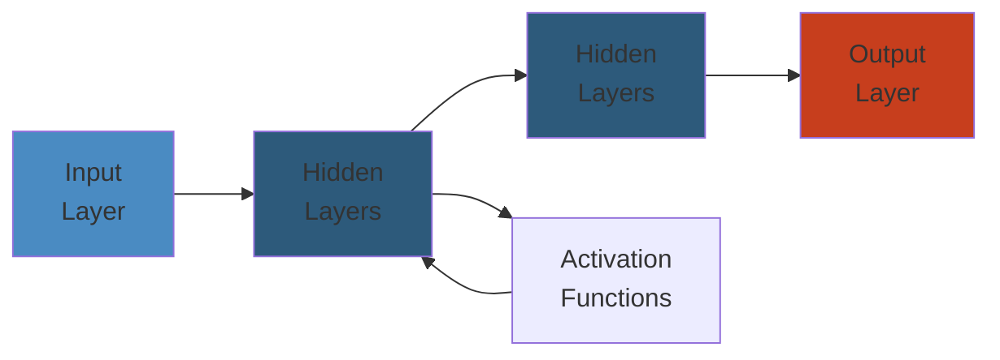

# Configuration Management — Senior/Principal Engineer Deep Dive

**Related**: [Infrastructure as Code](01-infrastructure-as-code.md) · [DevOps & SRE Practices](03-devops-sre-practices.md) · [Kubernetes Config Management](../data/kubernetes/05-kubernetes-storage.md)

---




## Table of Contents

- [The Configuration Management Problem](#the-configuration-management-problem)
- [Ansible Deep Dive](#ansible-deep-dive)
  - [Architecture: Agentless via SSH/WinRM](#architecture-agentless-via-sshwinrm)
  - [Playbook Execution Engine](#playbook-execution-engine)
  - [Modules: The Building Blocks](#modules-the-building-blocks)
  - [Fact Gathering Internals](#fact-gathering-internals)
  - [Idempotency: How Ansible Guarantees It](#idempotency-how-ansible-guarantees-it)
  - [Ansible Vault & Secrets](#ansible-vault--secrets)
  - [Roles, Collections, and Large-Scale Organization](#roles-collections-and-large-scale-organization)
  - [AWX / Ansible Automation Platform](#awx--ansible-automation-platform)
  - [Ansible Production Incidents](#ansible-production-incidents)
- [Puppet Deep Dive](#puppet-deep-dive)
  - [Declarative DSL & Resource Abstraction](#declarative-dsl--resource-abstraction)
  - [Puppet Server & Catalog Compilation](#puppet-server--catalog-compilation)
  - [Facts, Classes, and Environments](#facts-classes-and-environments)
  - [PuppetDB & StoreConfigs](#puppetdb--storeconfigs)
  - [Puppet Production Incidents](#puppet-production-incidents)
- [Chef Deep Dive](#chef-deep-dive)
  - [Cookbook/Resource/Recipe Architecture](#cookbookresourcerecipe-architecture)
  - [Chef Server vs Chef Solo vs Chef Zero](#chef-server-vs-chef-solo-vs-chef-zero)
  - [Ohai, Search, and Data Bags](#ohai-search-and-data-bags)
  - [Chef Production Incidents](#chef-production-incidents)
- [SaltStack Deep Dive](#saltstack-deep-dive)
  - [Master/Minion Architecture](#masterminion-architecture)
  - [States, Pillars, and Grains](#states-pillars-and-grains)
  - [Reactors and Event-Driven Automation](#reactors-and-event-driven-automation)
  - [SaltStack Production Incidents](#saltstack-production-incidents)
- [Idempotency Deep Dive](#idempotency-deep-dive)
  - [What Is True Idempotency?](#what-is-true-idempotency)
  - [Idempotency Failure Modes](#idempotency-failure-modes)
- [Convergence vs Push vs Pull](#convergence-vs-push-vs-pull)
- [Secrets Management in CM](#secrets-management-in-cm)
- [Scaling CM to 1000+ Nodes](#scaling-cm-to-1000-nodes)
- [Immutable Infrastructure: The Paradigm Shift](#immutable-infrastructure-the-paradigm-shift)
- [Cross-Tool Comparison](#cross-tool-comparison)
- [Failure Analysis Reference](#failure-analysis-reference)

---

## The Configuration Management Problem

Configuration Management (CM) tools ensure that a system's software, settings, and services are in a desired state. The fundamental problem:

```
State Machine of a Server:
┌─────────────────┐     ┌─────────────────┐     ┌─────────────────┐
│   Desired        │     │   Current        │     │   Actual         │
│   State          │     │   (Known)        │     │   (Real System)  │
│                  │     │   State          │     │                  │
│ nginx: 1.24     │     │ nginx: 1.22     │     │ nginx: 1.20     │
│ port: 443       │     │ port: 8443      │     │ port: 443       │
│ enabled: yes    │     │ enabled: no     │     │ enabled: yes    │
│ ssl: letsencrypt│     │ ssl: none       │     │ ssl: self-signed│
└────────┬────────┘     └────────┬────────┘     └────────┬────────┘
         │                       │                       │
         └───────────────────────┼───────────────────────┘
                                 │
                                 ▼
        ┌─────────────────────────────────────┐
        │        CM Tool Execution             │
        │                                      │
        │  Step 1: Discover current state      │
        │  Step 2: Compare with desired state  │
        │  Step 3: Apply corrections           │
        │  Step 4: Verify new state            │
        │  Step 5: Report                      │
        └─────────────────────────────────────┘
```

---

## Ansible Deep Dive

### Architecture: Agentless via SSH/WinRM

Ansible is unique among major CM tools — it requires no agent on managed nodes. It uses SSH (Linux/macOS) or WinRM (Windows) to push modules to targets, execute them, and collect results.

```
Ansible Architecture (Push Model):
╔═══════════════════════════════════════════════════════════════╗
║                    Control Node (Ansible)                      ║
║                                                               ║
║  ┌─────────────────────────────────────────────────────────┐  ║
║  │                     Ansible Engine                       │  ║
║  │                                                         │  ║
║  │  Playbook → Parsed (YAML) → Tasks List                   │  ║
║  │  Inventory → Grouped Hosts → Pattern Matching            │  ║
║  │  Roles/Collections → Task Reuse                          │  ║
║  │  Modules → Python scripts (or PowerShell for Windows)    │  ║
║  │  Plugins → Connection, callback, filter, lookup          │  ║
║  └─────────────────────────────────────────────────────────┘  ║
║                                                               ║
║  ┌─────────────────────────────────────────────────────────┐  ║
║  │                Connection Plugins                        │  ║
║  │                                                         │  ║
║  │  SSH (paramiko / native OpenSSH)  │ WinRM (pywinrm)    │  ║
║  │  Local │ Docker │ Kubernetes │ AWX │ Containers        │  ║
║  └─────────────────────────────────────────────────────────┘  ║
╚═══════════════════════════════════════════════════════════════╘
        │                        │
        ▼                        ▼
┌─────────────────┐   ┌─────────────────┐
│ Linux Node       │   │ Windows Node     │
│ (SSH Daemon)     │   │ (WinRM Service)  │
│                  │   │                  │
│ 1. Receive       │   │ 1. Receive       │
│    module + args │   │    module + args │
│ 2. Write temp    │   │ 2. Execute via   │
│    Python script │   │    PowerShell    │
│ 3. Execute with  │   │ 3. Return JSON   │
│    /usr/bin/python│  │    result        │
│ 4. Return JSON   │   │ 4. Clean up      │
│    result        │   │                  │
│ 5. Clean up      │   │                  │
└─────────────────┘   └─────────────────┘
```

**Key architectural properties:**
- No agent = no daemon, no cert management, no port listening on nodes
- Modules are **not installed** — they are copied to the target, executed, and deleted
- All modules must be **self-contained** Python or PowerShell scripts (with minimal dependencies)
- Control node is the **single source of truth** for all playbooks and roles

---

### Playbook Execution Engine

```
Ansible Playbook Execution Flow:
╔═══════════════════════════════════════════════════════════════╗
║  ansible-playbook site.yml                                   ║
╚═══════════════════════════════════════════════════════════════╘
        │
        ▼
┌─────────────────────────────────────────┐
│ 1. Parse Playbook YAML                  │
│    ├── Read site.yml                    │
│    ├── Expand includes (import_* / include_*) │
│    ├── Resolve variables                  │
│    └── Build list of plays + tasks        │
└─────────────────┬───────────────────────┘
                  ▼
┌─────────────────────────────────────────┐
│ 2. Load Inventory                        │
│    ├── Read inventory files (INI/YAML)  │
│    ├── Resolve host patterns             │
│    ├── Apply group/host variables        │
│    ├── Evaluate constructed groups       │
│    └── Build host list per play          │
└─────────────────┬───────────────────────┘
                  ▼
┌─────────────────────────────────────────┐
│ 3. Gather Facts (if enabled)             │
│    ├── For each host (in parallel)      │
│    ├── Run setup module                  │
│    ├── Collect 1000+ facts (CPU, mem,   │
│    │   disk, network, OS, virtualization)│
│    └── Store in per-host fact cache      │
└─────────────────┬───────────────────────┘
                  ▼
┌─────────────────────────────────────────┐
│ 4. For Each Play:                        │
│    ┌─────────────────────────────────┐  │
│    │ 4a. Select hosts for this play  │  │
│    │ 4b. Apply pre_tasks             │  │
│    │ 4c. Execute roles sequentially  │  │
│    │ 4d. Apply role tasks            │  │
│    │ 4e. Apply post_tasks            │  │
│    │ 4f. Register handlers           │  │
│    │ 4g. Execute handlers (notify)   │  │
│    └─────────────────────────────────┘  │
│    │
│    Parallelism: forks=N (default 5)     │
│    Each fork processes one host          │
└─────────────────┬───────────────────────┘
                  ▼
┌─────────────────────────────────────────┐
│ 5. Gather Results & Report               │
│    ├── SUCCESS/FAILED/CHANGED counts    │
│    ├── Callback plugins (stdout, log)   │
│    └── Return code to CI/CD             │
└─────────────────────────────────────────┘
```

**Playbook syntax details:**

```yaml
---
- name: Configure web servers
  hosts: web_servers
  gather_facts: yes
  become: yes
  vars:
    http_port: 80
    server_name: "{{ inventory_hostname }}"

  tasks:
    - name: Install nginx
      ansible.builtin.apt:
        name: nginx
        state: present

    - name: Configure nginx
      ansible.builtin.template:
        src: nginx.conf.j2
        dest: /etc/nginx/nginx.conf
      notify: restart nginx

    - name: Enable nginx
      ansible.builtin.systemd:
        name: nginx
        enabled: yes
        state: started

  handlers:
    - name: restart nginx
      ansible.builtin.systemd:
        name: nginx
        state: restarted
```

**Play vs. Playbook distinction:**

```
Playbook = Collection of plays executed sequentially
  ├── Play 1: "Install web servers" (hosts: web)
  │   ├── tasks
  │   └── handlers
  ├── Play 2: "Configure load balancers" (hosts: lb)
  │   ├── tasks
  │   └── handlers
  └── Play 3: "Verify deployment" (hosts: monitoring)
      └── tasks (validation checks)
```

**Task execution within a play:**

```
Per-Play Execution:
┌────────────────────────────────────────────────────────────┐
│                                                            │
│  TASK 1 (Install nginx)                                    │
│    Host A: ✓ already present (idempotent)                  │
│    Host B: ✗ changed (installed)                          │
│    Host C: ✓ already present                               │
│                                                            │
│  TASK 2 (Configure nginx)                                  │
│    Host A: ✗ changed (config updated)                     │
│    Host B: ✗ changed (config created)                     │
│    Host C: ✗ changed (config updated)                     │
│                                                            │
│  HANDLER: restart nginx (triggered once)                   │
│    Host A: restarted                                       │
│    Host B: restarted                                       │
│    Host C: restarted                                       │
│                                                            │
│  TASK 3 (Enable service)                                   │
│    Host A: ✓ already enabled                               │
│    Host B: ✓ already enabled                               │
│    Host C: ✗ changed (enabled)                            │
│                                                            │
│  Results: ok=7 changed=5 failed=0                         │
└────────────────────────────────────────────────────────────┘
```

---

### Modules: The Building Blocks

Modules are Ansible's unit of work. Each module is a self-contained script (usually Python) that performs a specific task and returns JSON.

**Module anatomy:**

```python
#!/usr/bin/python
# Ansible module: copy.py (simplified)

from ansible.module_utils.basic import AnsibleModule

def main():
    module = AnsibleModule(
        argument_spec=dict(
            src=dict(type='path', required=True),
            dest=dict(type='path', required=True),
            owner=dict(type='str'),
            group=dict(type='str'),
            mode=dict(type='raw'),
            backup=dict(type='bool', default=False),
            checksum=dict(type='str'),
        ),
        supports_check_mode=True,
    )

    src = module.params['src']
    dest = module.params['dest']

    # Check mode — report what would change, don't execute
    if module.check_mode:
        if not os.path.exists(dest) or not filecmp.cmp(src, dest):
            module.exit_json(changed=True, msg="File would be copied")
        module.exit_json(changed=False, msg="File is identical")

    # Normal execution
    if not os.path.exists(dest) or not filecmp.cmp(src, dest):
        shutil.copy2(src, dest)
        # Set permissions, owner, etc.
        module.exit_json(changed=True, msg="File copied",
                        dest=dest, checksum=md5(dest))
    else:
        module.exit_json(changed=False, msg="File already up to date",
                        dest=dest, checksum=md5(dest))

if __name__ == '__main__':
    main()
```

**Module return values — the JSON contract:**

```json
{
    "changed": true,
    "failed": false,
    "msg": "Configuration updated",
    "diff": {
        "before": "old_value",
        "after": "new_value"
    },
    "ansible_facts": {
        "nginx_version": "1.24.0"
    },
    "invocation": {
        "module_args": {
            "name": "nginx",
            "state": "started"
        }
    }
}
```

**Module types by category:**

| Category | Examples | Function |
|----------|----------|----------|
| **Package** | apt, yum, dnf, pip, gem, npm | Install/remove packages |
| **File** | copy, template, file, lineinfile | Manage files and content |
| **System** | service, systemd, user, group, cron | Manage system resources |
| **Network** | uri, get_url, nmcli, firewalld | Network operations |
| **Source Control** | git, hg, svn | Checkout repos |
| **Cloud** | ec2, s3, rds, gce, azure_rm | Cloud resource management |
| **Containers** | docker_container, k8s | Container orchestration |
| **Monitoring** | nagios, datadog, zabbix | Integration with monitoring |
| **Database** | mysql_db, postgresql_db, mongodb | Database operations |
| **Windows** | win_shell, win_file, win_service | Windows-specific |

---

### Fact Gathering Internals

Facts are system properties collected from managed nodes via the `setup` module.

```
Fact Collection Flow:
Control Node                Target Node
┌──────────┐               ┌──────────┐
│ setup     │──── SSH ────▶│ Collect  │
│ module    │              │          │
│ requested │              │ /proc/   │
│           │              │ /sys/    │
│           │              │ /etc/    │
│           │              │ uname    │
│           │              │ dmidecode│
│           │              │ lspci    │
│           │              │ mount    │
│           │              │ df       │
│           │              │ ip addr  │
│           │              │          │
│ Parse JSON│◀─── JSON ───│ Return   │
│ Store in  │              │ 1500+    │
│ fact cache│              │ key/value│
└──────────┘              └──────────┘
```

**Types of facts collected:**

```
ansible_* facts (partial list):
├── ansible_architecture: "x86_64"
├── ansible_distribution: "Ubuntu"
├── ansible_distribution_version: "22.04"
├── ansible_kernel: "5.15.0-91-generic"
├── ansible_memtotal_mb: 8192
├── ansible_processor_vcpus: 4
├── ansible_processor_cores: 2
├── ansible_processor_threads_per_core: 2
├── ansible_fqdn: "web01.example.com"
├── ansible_default_ipv4:
│   ├── address: "10.0.1.42"
│   ├── network: "10.0.1.0"
│   ├── netmask: "255.255.255.0"
│   └── gateway: "10.0.1.1"
├── ansible_devices:
│   ├── sda:
│   │   ├── partitions:
│   │   │   ├── sda1:
│   │   │   │   ├── size: "500.00 GB"
│   │   │   │   └── mount: "/"
│   │   │   └── sda2:
│   │   │       ├── size: "8.00 GB"
│   │   │       └── mount: "swap"
├── ansible_selinux:
│   ├── status: "enabled"
│   ├── mode: "enforcing"
│   └── policy: "targeted"
├── ansible_services: { ... }  # All systemd services
├── ansible_packages: { ... }  # All installed packages
└── ansible_mounts: [ ... ]    # All mounted filesystems
```

**Custom facts — extending discovery:**

```yaml
# /etc/ansible/facts.d/custom.fact (on managed node)
# INI format:
[application]
version = 3.2.1
deploy_path = /opt/myapp
health_endpoint = /healthz

# Or JSON:
# {"application": {"version": "3.2.1", "deploy_path": "/opt/myapp"}}
```

```yaml
# Using custom facts in playbooks
- name: Check application version
  debug:
    msg: "Current version: {{ ansible_local.custom.application.version }}"
```

**Fact caching strategies:**

| Cache Type | Backend | Persistence | Use Case |
|-----------|---------|-------------|----------|
| **JSON file** | Local filesystem | Playbook run | Simple, no persistence |
| **Redis** | Redis server | Configurable TTL | Large environments |
| **Memcached** | Memcached | Configurable TTL | Very large, distributed |
| **YAML/JSON** | Files | Configurable TTL | File-based cache |

```ini
# ansible.cfg
[defaults]
gathering = smart
fact_caching = redis
fact_caching_connection = localhost:6379:0
fact_caching_timeout = 3600
```

---

### Idempotency: How Ansible Guarantees It

Ansible's idempotency depends entirely on module implementation. The core principle:

```
All modules must:
  1. Check current state (pre-execution)
  2. Compare with desired state
  3. Only make changes if state differs
  4. Return "changed: true" only if modifications were made
  5. Return "changed: false" if state already matches

This is NOT automatic — it is enforced by:
  a) Module author discipline
  b) Testing (ansible-test sanity tests check for check_mode support)
  c) The AnsibleModule framework (provides check_mode, diff, no_log)
```

**Check mode — preview without changes:**

```bash
# Show what would change without actually changing anything
ansible-playbook site.yml --check

# Output:
PLAY [Configure web servers] **********************************
TASK [Install nginx] ******************************************
ok: [web01]    # Already installed, no change needed
ok: [web02]    # Already installed

TASK [Configure nginx] ****************************************
changed: [web01]  # Would update config file
changed: [web02]  # Would create config file

TASK [Start nginx] ********************************************
ok: [web01]    # Already running
ok: [web02]    # Already running

PLAY RECAP *****************************************************
web01 : ok=3    changed=1  unreachable=0 failed=0 skipped=0
web02 : ok=3    changed=1  unreachable=0 failed=0 skipped=0
```

**Idempotency verification pattern:**

```yaml
- name: Deploy application (idempotent)
  hosts: app_servers
  gather_facts: no
  serial: 1  # One at a time for canary

  tasks:
    - name: Verify initial state idempotency
      ansible.builtin.command: echo "Pre-flight check"
      changed_when: false

    - name: Deploy artifact
      ansible.builtin.get_url:
        url: "https://artifactory/app/{{ version }}/app.jar"
        dest: /opt/app/app.jar
        checksum: "sha256:{{ expected_checksum }}"
      # If the file already exists with the correct checksum,
      # this module returns changed=false automatically

    - name: Configure systemd
      ansible.builtin.template:
        src: app.service.j2
        dest: /etc/systemd/system/app.service
      notify: restart app

    - name: Ensure app is running
      ansible.builtin.systemd:
        name: app
        state: started
        daemon_reload: yes
      # If already running with correct config → changed=false

  handlers:
    - name: restart app
      ansible.builtin.systemd:
        name: app
        state: restarted
```

**Non-idempotent patterns to avoid:**

```yaml
# ANTI-PATTERN 1: sed replace without check
- ansible.builtin.shell: sed -i 's/old/new/' /etc/config
  # Runs every time, always reports "changed"!

# ANTI-PATTERN 2: Always-restart pattern
- ansible.builtin.command: /opt/app/bin/reload
  # Always triggers, even if nothing changed

# ANTI-PATTERN 3: append without idempotency check
- ansible.builtin.lineinfile:
    path: /etc/hosts
    line: "10.0.0.1 myserver"
    state: present
  # This IS idempotent (lineinfile checks if line exists)
  
- ansible.builtin.shell: echo "10.0.0.1 myserver" >> /etc/hosts
  # This is NOT idempotent (appends every run)

# Correct pattern for most tasks:
- ansible.builtin.template:    # ✓ Idempotent
- ansible.builtin.copy:        # ✓ Idempotent  
- ansible.builtin.apt:         # ✓ Idempotent
- ansible.builtin.systemd:     # ✓ Idempotent
```

---

### Ansible Vault & Secrets

Ansible Vault encrypts sensitive data at rest. Encrypted files can be decrypted at runtime.

**Vault workflow:**

```bash
# Create encrypted file
ansible-vault create secrets.yml

# Edit encrypted file (decrypts, opens $EDITOR, re-encrypts)
ansible-vault edit secrets.yml

# Encrypt existing file
ansible-vault encrypt vars/prod.yml

# Decrypt (for debugging)
ansible-vault decrypt vars/prod.yml

# View encrypted content
ansible-vault view secrets.yml

# Change password
ansible-vault rekey secrets.yml
```

```yaml
# secrets.yml (encrypted)
---
db_password: !vault |
          $ANSIBLE_VAULT;1.2;AES256;myuser
          6161616161616161616161616161616161616161616161616161616161616161
          6161616161616161616161616161616161616161616161616161616161616161
          6161616161616161616161616161616161616161616161616161616161616161
```

**Vault encryption details:**

```
Vault Header Format:
$ANSIBLE_VAULT;<version>;<cipher>;<user>

Cipher: AES256
  - Key derivation: PBKDF2-HMAC-SHA256 (10000 iterations)
  - Encrypted data: AES-256-CTR
  - HMAC: SHA256 (integrity check)

Password sources:
  1. --ask-vault-pass (interactive)
  2. --vault-password-file (script can decrypt)
  3. ANSIBLE_VAULT_PASSWORD_FILE environment variable
  4. ansible.cfg: vault_password_file = /path/to/script
```

**Multiple vault passwords (per-environment):**

```bash
# Structure:
group_vars/
├── prod/
│   └── vault.yml        # Encrypted with prod password
└── staging/
    └── vault.yml        # Encrypted with staging password

# Run:
ansible-playbook site.yml \
  --vault-id prod@~/.vault_pass_prod \
  --vault-id staging@~/.vault_pass_staging
```

**Best practices for secrets in Ansible:**

```
✓ Encrypt only the sensitive values, not entire files
  (Better: individual vault-encrypted variables)

✓ Use lookup plugins for external secret stores:
  ansible.builtin.lookup('hashi_vault', 'secret/data/prod/db')

✓ Never commit unencrypted secrets to VCS

✓ Rotate vault keys periodically

✓ Use different vault passwords per environment

✓ Integrate with Vault/Secrets Manager at runtime:
  ansible.builtin.lookup('amazon.aws.aws_secret', 'prod/db/password')

✓ Set no_log: true on tasks that use secrets
```

---

### Roles, Collections, and Large-Scale Organization

**Role directory structure:**

```
roles/
└── nginx/
    ├── tasks/
    │   ├── main.yml           ← Entry point
    │   ├── install.yml        ← Included by main
    │   ├── configure.yml
    │   └── security.yml
    ├── handlers/
    │   └── main.yml
    ├── templates/
    │   ├── nginx.conf.j2
    │   └── default.conf.j2
    ├── files/
    │   ├── dhparams.pem
    │   └── geoip.dat
    ├── vars/
    │   └── main.yml           ← High-priority (role) variables
    ├── defaults/
    │   └── main.yml           ← Low-priority default values
    ├── meta/
    │   └── main.yml           ← Metadata (author, dependencies)
    ├── library/               ← Custom modules bundled with role
    ├── module_utils/
    ├── lookup_plugins/
    └── tests/
        ├── inventory
        └── test.yml
```

**Role dependencies:**

```yaml
# roles/nginx/meta/main.yml
---
dependencies:
  - role: common
    vars:
      log_level: "{{ nginx_log_level | default('warn') }}"
  - role: ssl-cert
    vars:
      domain: "{{ nginx_domain }}"
    when: nginx_ssl_enabled
```

**Collections (Ansible 2.9+ / 4+):**

```
Collections provide namespaced distribution of content:

ansible.builtin         → Built-in modules (apt, copy, file, etc.)
community.general       → Community-maintained modules
community.docker        → Docker-related modules
amazon.aws              → AWS modules
cisco.ios               → Cisco IOS modules
redhat_cop.ah_configuration → Red Hat Automation Hub

Your Organization:
org_name/
└── collections/
    └── ansible_collections/
        └── myorg/
            └── platform/
                ├── roles/
                │   ├── base_hardening/
                │   ├── monitoring_agent/
                │   └── logging_forwarder/
                ├── plugins/
                │   ├── modules/
                │   │   └── custom_healthcheck.py
                │   └── filters/
                │       └── custom_filters.py
                └── meta/
                    └── runtime.yml
```

**Large-scale organization patterns:**

```
Pattern 1: Flat Inventory (small org, < 50 nodes)
inventory/
├── production/
│   ├── hosts             # [web], [db], [monitoring]
│   └── group_vars/
│       ├── all.yml
│       ├── web.yml
│       └── db.yml
├── staging/
└── test/

Pattern 2: Directory Inventory (medium org, 50-500 nodes)
inventory/
├── production/
│   ├── inventory.yml     # Host definitions
│   └── host_vars/
│       ├── web01.yml
│       ├── web02.yml
│       └── db01.yml
├── staging/
└── test/

Pattern 3: Dynamic Inventory (large org, 500-10000+ nodes)
# cloud-specific inventory scripts
inventory/
├── aws_ec2.yml          # Use aws_ec2 plugin
├── gcp_compute.yml      # Use gcp_compute plugin
└── openshift.yml        # Use k8s plugin
```

```yaml
# aws_ec2 inventory plugin (inventory/aws_ec2.yml)
plugin: amazon.aws.aws_ec2
regions:
  - us-east-1
  - us-west-2
hostnames:
  - tag:Name
  - private-dns-name
filters:
  tag:Environment: "{{ env }}"
  instance-state-name: running
keyed_groups:
  - key: tags.Role
    prefix: role
    separator: ""
  - key: placement.region
    prefix: aws_region
compose:
  ansible_host: public_ip_address
```

---

### AWX / Ansible Automation Platform

AWX is the open-source upstream of Red Hat Ansible Automation Platform. It provides a web UI, REST API, and task scheduler for Ansible.

```
AWX Architecture:
┌──────────────────────────────────────────────────────────┐
│                    AWX Cluster                            │
│                                                          │
│  ┌─────────────┐  ┌─────────────┐  ┌─────────────┐      │
│  │ AWX Web     │  │ AWX Task    │  │ AWX Task    │      │
│  │ Container   │  │ Container   │  │ Container   │      │
│  │ (Django)    │  │ (ansible-   │  │ (ansible-   │      │
│  │ REST API    │  │ runner)     │  │ runner)     │      │
│  │ UI          │  │             │  │             │      │
│  └──────┬──────┘  └──────┬──────┘  └──────┬──────┘      │
│         │                │                │              │
│         ▼                ▼                ▼              │
│  ┌─────────────────────────────────────────────────┐     │
│  │              PostgreSQL (AWX DB)                 │     │
│  │  ┌──────────┐ ┌────────────┐ ┌──────────────┐   │     │
│  │  │ Projects │ │ Inventories│ │ Job Templates │   │     │
│  │  │ (Git SCM)│ │ (static/   │ │ (playbook +   │   │     │
│  │  │          │ │  dynamic)  │ │  inventory +  │   │     │
│  │  │          │ │            │ │  credentials) │   │     │
│  │  └──────────┘ └────────────┘ └──────────────┘   │     │
│  └─────────────────────────────────────────────────┘     │
│                                                          │
│  ┌─────────────────────────────────────────────────┐     │
│  │              Execution Environment               │     │
│  │  (Container per job — isolated ansible-runner)   │     │
│  └─────────────────────────────────────────────────┘     │
└──────────────────────────────────────────────────────────┘
```

**Key AWX concepts:**

```
Projects     → SCM repos containing playbooks
Inventories  → Host definitions (static or dynamic)
Credentials  → SSH keys, vault passwords, cloud API keys
Templates    → Playbook + Inventory + Credentials bound together
Jobs         → Template executions (history, output, status)
Schedules    → Cron-like job scheduling
Workflows    → Multi-template workflows with branching
```

---

### Ansible Production Incidents

**Incident 1: The 2000-Node SSH Thundering Herd**

```
Scenario: Nightly playbook run across 2000 production nodes.

Timeline:
  02:00 — ansible-playbook site.yml (forks=30)
  02:00 — Control node established 30 SSH connections
  02:01 — 30 hosts: starting tasks...
  02:02 — SSH connection storm on network team's monitoring
  02:03 — Network team alerted: "2000+ SSH connections from x.x.x.x"
  02:04 — Firewall rate limiting kicks in → 60% of connections FAIL
  02:05 — Playbook fails: 1200 hosts unreachable
  02:06 — Retry: same issue (retry storm)
  02:10 — Manual kill: playbook stopped
  02:15 — Investigate: 2000 concurrent SSH connections saturated
         the control node's network stack AND the managed nodes'
         sshd_max_startups limits.

Root Cause:
  - forks=30 means 30 concurrent hosts, but each host gets multiple
    connections (fact gathering + module execution)
  - Default sshd_max_startups on most distros: 10:30:100
  - 2000 hosts * 3 connections = 6000 connection attempts
  - Connection storm triggered rate limiting on both sides

Fix:
  - Reduced forks to 10 for large-scale runs
  - Increased sshd_max_startups on managed nodes:
    MaxStartups 100:30:200
  - Enabled SSH pipelining (reduces per-host SSH connections):
    ansible.cfg: pipelining = True
  - Implemented rolling execution (serial: 50 per batch):
    - hosts: all
      serial: 50
  - Used ansible-pull instead for agentless-at-scale (each node
    pulls from git and runs locally)

Lesson: At scale, SSH connection management is critical.
        Pipelining and batch execution are mandatory.
```

**Incident 2: The Fact Cache Poisoning**

```
Scenario: Ansible uses fact caching with Redis. Facts are cached for
1 hour. A playbook relies on cached facts for conditional execution.

Timeline:
  09:00 — Playbook runs, gathers facts, caches in Redis
          (ansible_processor_vcpus=4, ansible_memtotal_mb=8192)
  09:30 — Ops team adds 8GB RAM to production hosts
  09:45 — Playbook runs again (cached facts from 09:00)
          ansible_memtotal_mb still shows 8192
          Conditional: "Configure Java heap to 4096"
          → 4096 set (based on old facts)
  09:50 — App team: "Java heap is too small, we have 16GB now!"
  10:00 — Force re-gather: ansible-playbook site.yml --flush-cache

Root Cause:
  - Fact cache TTL was 1 hour
  - System changes between cache refresh
  - Playbook conditionals based on stale facts
  - No invalidation mechanism for changed infrastructure

Fix:
  - Shortened fact cache TTL to 15 minutes
  - Added play-level cache invalidation:
    - name: Force fact refresh on critical hosts
      setup:
        cacheable: yes
      when: inventory_hostname in groups['critical']
  - Implemented fact cache monitoring:
    - Age of cached facts tracked
    - Alert if facts older than threshold
  - Designed playbooks to re-gather critical facts:
    - name: Always get current memory
      setup:
        filter: ansible_memtotal_mb
        gather_subset: '!all,hardware'

Lesson: Cached facts are stale facts.
        Critical decisions must always use current data.
```

**Incident 3: The Configuration Drift Cascade**

```
Scenario: 500-node fleet across 3 regions, all managed by Ansible.
One region (EU) has a config drift problem that keeps reappearing.

Timeline:
  Week 1: Deploy nginx 1.22 to all nodes
  Week 2: Security scanner finds nginx 1.22 has a CVE
  Week 3: Security team patches EU region manually (not via Ansible)
  Week 4: Nightly Ansible run on EU region
          → Ansible detects nginx 1.20 (manual "fix" downgraded?)
          → Wait, actually: Security downgraded nginx to 1.20
            as "stable workaround" but never updated playbooks
          → Ansible upgrades back to 1.22 → security fails again

  Week 5: Security scanner: EU is vulnerable again
  Week 5: Security team: "We patched this! Why is it back?"
  Week 5: Ops team: "Ansible runs nightly and resets state"
  Week 5: Security team patches via config mgmt → updates playbook

Root Cause:
  - Out-of-band changes (manual fixes) conflict with CM
  - No communication between security and ops teams
  - No process for temporary vs permanent fixes
  - No policy: "All changes must go through Ansible"

Fix:
  - Policy: All changes via CM, zero exceptions
  - Drift detection with alerting (not auto-remediation)
  - Security exceptions tracked in CM (with auto-expiry)
  - Process: emergency fix → create PR for Ansible → merge → apply

Lesson: CM tools only maintain desired state.
        If desired state is wrong, CM will enforce wrong state.
        Out-of-band changes will be overwritten.
```

**Incident 4: The Variable Precedence Nightmare**

```
Scenario: 50-node deployment with complex group/host variable hierarchy.

Ansible variable precedence (highest to lowest):
  1. extra vars (-e "var=value")
  2. include params
  3. role params
  4. set_facts / register vars
  5. vars file included by include_vars
  6. play-level vars_prompt
  7. play-level vars
  8. host facts / cached facts
  9. play-level vars_files
  10. role defaults
  11. block vars
  12. task vars (only for specific task)
  13. role vars (from roles/x/vars/main.yml)
  14. include_vars
  15. group_vars/all
  16. group_vars/*
  17. host_vars/*
  18. inventory vars
  19. vars from inventory plugin

Timeline:
  Deploy script passes -e "app_port=8080" (priority 1)
  But some hosts have group_vars staging: app_port=9090
  Wait — group_vars is priority 7. extra vars is priority 1.
  extra vars ALWAYS wins. But the Dev team expected group_vars
  to override extra vars.

  Deeper issue: Host has host_vars/web01.yml with app_port=3000
  But extra vars still overrides everything.

  Developer ran:
    ansible-playbook -e "app_port=8080" site.yml
  Expected: port 8080 for canary test
  Result: port 8080 everywhere (but they wanted 8080 for one host!)

  Correct pattern:
    ansible-playbook -e "host_port_override=8080" site.yml
    # Then in playbook:
    - set_fact:
        app_port: "{{ host_port_override | default(app_port) }}"
      when: inventory_hostname == "web01-canary"

Root Cause:
  - Variable precedence misunderstanding
  - No documentation of override patterns
  - Testing didn't cover variable resolution

Fix:
  - Documented variable precedence hierarchy for all teams
  - Created standard variable override patterns (prefix: override_)
  - Added variable validation in CI:
    - name: Validate no unexpected variable precedence
      assert:
        that:
          - app_port is defined
          - app_port != "3000" or inventory_hostname == "web01"
        fail_msg: "Unexpected variable value"
  - Built custom filter for variable resolution debugging:
    {{ variable | ansible.builtin.debug() }}

Lesson: Variable precedence is the #1 source of Ansible confusion.
        Document it, test it, validate it.
```

---

## Puppet Deep Dive

### Declarative DSL & Resource Abstraction

Puppet uses a declarative DSL where you describe desired state, and Puppet computes the steps to achieve it.

```
Puppet Resource Abstraction Layer (RAL):
╔═══════════════════════════════════════════════════════════════╗
║  Puppet DSL Code:                                             ║
║    package { 'nginx':                                         ║
║      ensure => installed,                                     ║
║    }                                                          ║
║    service { 'nginx':                                         ║
║      ensure  => running,                                      ║
║      enable  => true,                                         ║
║      require => Package['nginx'],                              ║
║    }                                                          ║
╚═══════════════════════════════════════════════════════════════╘
        │
        ▼
┌───────────────────────────────────────────────┐
│          Resource Abstraction Layer            │
│                                                │
│  Each resource type has:                       │
│    - provider (implementation)                 │
│    - properties (ensure, name, enable, etc.)   │
│    - metaparameters (before, require, notify,  │
│      subscribe, tag)                           │
│                                                │
│  Provider Selection (automatic or manual):     │
│    package { 'nginx':                          │
│      provider => 'apt',                        │
│    }                                           │
│                                                │
│  RAL discovers which provider is available:    │
│    apt, yum, rpm, gem, pip, chocolatey, ...    │
└──────────────────────┬────────────────────────┘
                       │
                       ▼
┌───────────────────────────────────────────────┐
│              Puppet Transaction                │
│                                                │
│  1. Get current state (provider.read)          │
│  2. Compare with desired state                  │
│  3. If different → compute changes             │
│  4. Apply changes (provider.create/update/     │
│      delete)                                   │
│  5. Verify new state                           │
│  6. Report                                     │
└───────────────────────────────────────────────┘
```

**Resource metaparameters (dependency ordering):**

```puppet
# Puppet does NOT use top-to-bottom ordering by default.
# It builds a dependency graph from metaparameters.

package { 'nginx':
  ensure => installed,
  before => Service['nginx'],  # nginx package must be installed first
}

service { 'nginx':
  ensure    => running,
  enable    => true,
  subscribe => File['/etc/nginx/nginx.conf'],  # restart if config changes
}

file { '/etc/nginx/nginx.conf':
  content  => template('nginx/nginx.conf.erb'),
  require  => Package['nginx'],  # must have package first
  notify   => Service['nginx'],  # signal service to restart
}
```

**Puppet resource graph:**

```
Full Dependency Graph:
  Package['nginx'] ──before──▶ Service['nginx']
        │                          ▲
        │ require                   │ subscribe
        ▼                          │
  File['nginx.conf'] ────notify────┘

Execution Order (topological sort):
  1. Package['nginx']       (install)
  2. File['nginx.conf']     (write config)
  3. Service['nginx']       (start/enable — triggered by notify)
```

---

### Puppet Server & Catalog Compilation

```
Puppet Architecture (Pull Model):
╔═══════════════════════════════════════════════════════════════╗
║                    Puppet Server                               ║
║  (JVM-based, runs on port 8140)                               ║
║                                                               ║
║  ┌─────────────────────────────────────────────┐              ║
║  │           Catalog Compilation                │              ║
║  │                                              │              ║
║  │  Agent Request:                              │              ║
║  │    certname: web01.example.com               │              ║
║  │    facts: { os: Ubuntu, ip: 10.0.1.42, ... } │             ║
║  │    environment: production                   │              ║
║  │                                              │              ║
║  │  Server Processing:                          │              ║
║  │    1. Parse manifests (Puppet DSL → AST)     │              ║
║  │    2. Evaluate classes based on facts        │              ║
║  │    3. Process Hiera data (key-value lookups) │              ║
║  │    4. Resolve templates (ERB/epp)            │              ║
║  │    5. Build dependency graph                 │              ║
║  │    6. Compile catalog (JSON/PSON)            │              ║
║  │    7. Sign catalog with server's private key │              ║
║  │    8. Return catalog to agent                │              ║
║  └─────────────────────────────────────────────┘              ║
╚═══════════════════════════════════════════════════════════════╘
        │                              ▲
        │ HTTPS (TLS)                  │ HTTPS (TLS)
        ▼                              │
╔═══════════════════════════════════════════════════════════════╗
║                    Puppet Agent                                ║
║  (Ruby, runs as daemon or via systemd timer)                  ║
║                                                               ║
║  ┌─────────────────────────────────────────────┐              ║
║  │           Agent Run Cycle                    │              ║
║  │                                              │              ║
║  │  1. Collect facts (Facter)                   │              ║
║  │  2. Send facts + certname to server          │              ║
║  │  3. Receive catalog                          │              ║
║  │  4. Apply catalog:                           │              ║
║  │     a. Resource ordering                     │              ║
║  │     b. Determine sync status for each         │              ║
║  │     c. In-sync → skip                        │              ║
║  │     d. Out-of-sync → apply                   │              ║
║  │  5. Send report back to server               │              ║
║  │  6. Sleep until next run (30 min default)    │              ║
║  └─────────────────────────────────────────────┘              ║
╚═══════════════════════════════════════════════════════════════╝
```

**Catalog structure (simplified):**

```json
{
  "catalog_uuid": "abc-123-def-456",
  "catalog_version": "1710891234",
  "environment": "production",
  "resources": [
    {
      "type": "Package",
      "title": "nginx",
      "parameters": {
        "ensure": "present",
        "provider": "apt",
        "before": ["Service[nginx]"]
      }
    },
    {
      "type": "File",
      "title": "/etc/nginx/nginx.conf",
      "parameters": {
        "ensure": "file",
        "content": "worker_processes auto;\\n...",
        "require": ["Package[nginx]"],
        "notify": ["Service[nginx]"]
      }
    }
  ],
  "edges": [
    {"source": "Package[nginx]", "target": "File[/etc/nginx/nginx.conf]"},
    {"source": "Package[nginx]", "target": "Service[nginx]"},
    {"source": "File[/etc/nginx/nginx.conf]", "target": "Service[nginx]"}
  ],
  "dependencies": {
    "Package[nginx]": [],
    "File[/etc/nginx/nginx.conf]": ["Package[nginx]"],
    "Service[nginx]": ["Package[nginx]", "File[/etc/nginx/nginx.conf]"]
  }
}
```

---

### Facts, Classes, and Environments

**Facter — system discovery (similar to Ansible facts):**

```ruby
# custom fact: /etc/puppetlabs/facter/facts.d/app_version.rb
Facter.add('app_version') do
  setcode do
    # Read version from deployed file
    if File.exist?('/opt/app/version.txt')
      File.read('/opt/app/version.txt').strip
    else
      'unknown'
    end
  end
end
```

```bash
# External facts (structured data)
# /etc/puppetlabs/facter/facts.d/deployment.yaml
---
datacenter: us-east-1a
service_tier: critical
backup_enabled: true
```

**Hiera — hierarchical data lookup:**

```yaml
# hiera.yaml
---
version: 5
defaults:
  datadir: data
  data_hash: yaml_data

hierarchy:
  - name: "Per-node data"
    path: "nodes/%{trusted.certname}.yaml"

  - name: "Per-role data"
    path: "roles/%{facts.role}.yaml"

  - name: "Per-environment data"
    path: "environments/%{server_facts.environment}.yaml"

  - name: "Common data"
    path: "common.yaml"
```

```yaml
# data/nodes/web01.example.com.yaml
nginx_listen_port: 443
ssl_certificate: "web01.example.com.crt"

# data/roles/webserver.yaml
nginx_max_workers: 4
nginx_keepalive_timeout: 65

# data/environments/production.yaml
monitoring_enabled: true
log_retention_days: 90

# data/common.yaml
ntp_servers:
  - 0.pool.ntp.org
  - 1.pool.ntp.org
```

```puppet
# Puppet class uses Hiera data
class nginx (
  Integer $listen_port,
  Integer $max_workers     = 4,
  Integer $keepalive_timeout = 65,
  Boolean $monitoring      = false,
) {
  package { 'nginx':
    ensure => installed,
  }

  file { '/etc/nginx/nginx.conf':
    content => template('nginx/nginx.conf.erb'),
    notify  => Service['nginx'],
  }

  service { 'nginx':
    ensure => running,
    enable => true,
  }
}
```

---

### PuppetDB & StoreConfigs

PuppetDB stores facts, reports, and resource data from all nodes. It enables cross-node queries.

```
PuppetDB Architecture:
┌──────────┐    ┌──────────┐    ┌──────────┐
│ Agent A  │    │ Agent B  │    │ Agent C  │
│ (facts +  │    │ (facts +  │    │ (facts +  │
│  report)  │    │  report)  │    │  report)  │
└─────┬────┘    └─────┬────┘    └─────┬────┘
      │               │               │
      └───────────────┼───────────────┘
                      │ HTTPS (port 8081)
                      ▼
              ┌──────────────┐
              │  PuppetDB    │
              │  (Clojure/   │
              │   on JVM)    │
              │              │
              │  Commands    │
              │  Queue       │
              │  (Async)     │
              └──────┬───────┘
                     │
                     ▼
              ┌──────────────┐
              │  PostgreSQL  │
              │              │
              │  - certnames │
              │  - facts     │
              │  - catalogs  │
              │  - reports   │
              │  - resources │
              └──────────────┘
```

**PuppetDB query usage:**

```puppet
# StoreConfigs — query resources from other nodes
# Requires puppetdb module and storeconfigs backend

# Get all IP addresses of nodes with role 'webserver'
$web_servers = puppetdb_query([
  'from', 'resources',
  ['and',
    ['=', 'type', 'Class'],
    ['=', 'title', 'Nginx'],
    ['=', 'parameters.ensure', 'running']
  ]
])

file { '/etc/nginx/upstream.conf':
  content => template('nginx/upstream.conf.erb'),
  # Template iterates over $web_servers to create upstream blocks
}
```

---

### Puppet Production Incidents

**Incident 1: The Catalog Compilation Meltdown**

```
Scenario: Puppet Server runs out of memory, agents fail to get catalogs.

Timeline:
  08:00 — New Puppet module deployed with complex logic
  08:30 — Puppet Server memory climbs from 2GB to 6GB
  08:45 — OOM killer terminates Puppet Server
  08:46 — All agents: "Failed to retrieve catalog from server"
  08:50 — Puppet Server restarts, immediately OOM again
  09:00 — Manual debug: catalog compilation takes 45 seconds per node
           (previously 2 seconds per node)

Root Cause:
  New module had an infinite loop in a custom function:
    def self.slow_function(data)
      data.each do |k, v|
        # Bug: recursive call without base case
        data.merge!(slow_function(v))
      end
    end
  This caused exponential catalog compilation time.
  For 2000 nodes, each compilation consumed 3GB+.

Fix:
  - Implemented compilation timeout:
    JVM heap: -Xmx4g (down from unlimited)
    Catalog timeout: catalog_ttl = 30s
  - Added compilation profiling:
    puppet Server compile --profile
  - CI/CD pipeline includes compilation time test:
    puppet parser validate + puppet apply --noop on test nodes
  - Deployed compilation timeout guard in Puppet Server config:
    jruby-puppet:
      max-active-instances: 4  # limit concurrent compilations
      max-requests-per-instance: 100000

Lesson: Catalog compilation is the server-side bottleneck.
        Profile, timeout, and limit compilation resources.
```

**Incident 2: The Certificate Chaos**

```
Scenario: New Puppet agents can't register, existing agents get
"certificate verify failed" errors.

Timeline:
  11:00 — Puppet Server's CA certificate expires
  11:01 — New agent attempts to register:
           "Exiting; no signed certificate"
  11:02 — Existing agents:
           "SSL_connect returned=1 errno=0 state=error: certificate verify failed"
  11:05 — All Puppet runs failing across the fleet
  11:10 — Teams notice no config updates for 30 minutes+ (daemon runs every 30m)

Root Cause:
  Puppet Server CA certificate had a 5-year validity.
  It expired at 11:00 today.
  No monitoring of certificate expiry.
  No alert on Puppet Server health.

Fix:
  - Regenerated CA certificate (required manual intervention)
  - Set up certificate expiry monitoring:
    - puppet ssl check (bundled tool)
    - External monitoring: Prometheus blackbox exporter on port 8140
  - Implemented automated CA renewal:
    - Puppet Server 8+ supports automatic CA rotation
  - Alert threshold: 30 days before expiry
  - Documented CA recovery runbook

Lesson: Certificate management is infrastructure-critical.
         Monitor expiry dates. Automate renewal.
```

---

## Chef Deep Dive

### Cookbook/Resource/Recipe Architecture

Chef uses Ruby DSL with a three-tier resource model: Cookbooks (packages), Recipes (ordered collections), Resources (individual state declarations).

```
Chef Resource Model:
╔═══════════════════════════════════════════════════════════════╗
║  Cookbook: webserver                                          ║
║  ┌─────────────────────────────────────────────────────────┐  ║
║  │  Recipe: default.rb                                      │  ║
║  │    package 'nginx' do                                    │  ║
║  │      action :install                                     │  ║
║  │    end                                                    │  ║
║  │                                                          │  ║
║  │    template '/etc/nginx/nginx.conf' do                   │  ║
║  │      source  'nginx.conf.erb'                            │  ║
║  │      owner   'root'                                      │  ║
║  │      group   'root'                                      │  ║
║  │      mode    '0644'                                      │  ║
║  │      notifies :restart, 'service[nginx]'                 │  ║
║  │    end                                                    │  ║
║  │                                                          │  ║
║  │    service 'nginx' do                                    │  ║
║  │      action [:enable, :start]                             │  ║
║  │      subscribes :reload, 'template[/etc/nginx/nginx.conf]'│  ║
║  │    end                                                    │  ║
║  │                                                          │  ║
║  │    # Custom resource usage                                │  ║
║  │    nginx_site 'default' do                                │  ║
║  │      action :enable                                       │  ║
║  │    end                                                    │  ║
║  └─────────────────────────────────────────────────────────┘  ║
║                                                               ║
║  Resources:                                                    ║
║    resources/                                                  ║
║    ├── nginx_site.rb         ← Custom resource               ║
║    └── nginx_vhost.rb                                          ║
║                                                               ║
║  Templates:                                                    ║
║    templates/default/                                          ║
║    └── nginx.conf.erb                                          ║
║                                                               ║
║  Attributes:                                                   ║
║    attributes/default.rb                                       ║
║                                                               ║
║  Libraries:                                                    ║
║    libraries/helper.rb                                         ║
║                                                               ║
║  Metadata:                                                     ║
║    metadata.rb                                                 ║
╚═══════════════════════════════════════════════════════════════╝
```

**Chef resource providers and idempotency:**

```ruby
# Custom resource with idempotency built in
# resources/nginx_site.rb

property :name, String, name_property: true
property :enabled, [true, false], default: true
property :template_source, String
property :cookbook, String

action :enable do
  link "/etc/nginx/sites-enabled/#{new_resource.name}" do
    to "/etc/nginx/sites-available/#{new_resource.name}"
    not_if { ::File.symlink?("/etc/nginx/sites-enabled/#{new_resource.name}") }
  end
end

action :disable do
  link "/etc/nginx/sites-enabled/#{new_resource.name}" do
    action :delete
    only_if { ::File.symlink?("/etc/nginx/sites-enabled/#{new_resource.name}") }
  end
end

action_class do
  # Helper methods for this resource
  def site_enabled?
    ::File.symlink?("/etc/nginx/sites-enabled/#{new_resource.name}")
  end
end
```

---

### Chef Server vs Chef Solo vs Chef Zero

```
Chef Deployments:
┌────────────────────────────────────────────────────────────────┐
│                                                               │
│  Chef Solo (discontinued, legacy)                             │
│    ┌──────────────┐                                           │
│    │  Chef Recipe │                                           │
│    │  (local)      │──▶ Apply directly                        │
│    │  cookbooks/   │   No server, no search, no roles          │
│    └──────────────┘   Simple, but limited                      │
│                                                               │
│  Chef Zero (local mode, Chef 12+)                             │
│    ┌──────────────┐                                           │
│    │  Chef Client  │──▶ In-memory Chef Server                 │
│    │  (with -z)    │   Runs locally, no separate server        │
│    │  cookbooks/   │   Supports search, roles, environments    │
│    └──────────────┘   Great for testing                       │
│                                                               │
│  Chef Server (production)                                     │
│    ┌──────────────────────────────────────────────────┐      │
│    │  Chef Server Cluster                              │      │
│    │                                                    │      │
│    │  ┌──────────────┐  ┌──────────────┐               │      │
│    │  │  Nginx        │  │  PostgreSQL   │               │      │
│    │  │  (front-end)  │  │  (data store) │               │      │
│    │  └──────┬───────┘  └──────────────┘               │      │
│    │         │                                          │      │
│    │  ┌──────┴───────┐                                 │      │
│    │  │  Erlang VM    │                                 │      │
│    │  │  (Chef Server │                                 │      │
│    │  │   API)        │                                 │      │
│    │  │               │                                 │      │
│    │  │  - Cookbook   │                                 │      │
│    │  │    storage    │                                 │      │
│    │  │  - Node data  │                                 │      │
│    │  │  - Search     │                                 │      │
│    │  │  - Policyfile │                                 │      │
│    │  └──────────────┘                                 │      │
│    └──────────────────────────────────────────────────┘      │
│                                                               │
│     ┌──────────────┐     ┌──────────────┐     ┌───────────┐  │
│     │  Chef Client  │     │  Chef Client  │     │  Chef     │  │
│     │  (node A)    │     │  (node B)    │     │  Client   │  │
│     │               │     │               │     │  (node C) │  │
│     └──────────────┘     └──────────────┘     └───────────┘  │
└────────────────────────────────────────────────────────────────┘
```

**Chef workflow:**

```
1. Chef Client runs (daemon or cron/chef-client)
2. Authenticate with Chef Server (API key or signed header)
3. Node object is loaded:
   ├── Run list (ordered recipes/roles to apply)
   ├── Attributes (node['platform'], node['fqdn'], custom)
   ├── Ohai (system discovery)
   └── Environment (dev/staging/prod)
4. Chef Server compiles node object
5. Chef Client synchronizes cookbooks from server
6. Chef Client builds Resource Collection:
   ┌──────────────────────────────────────────┐
   │  Resource Collection (ordered)           │
   │                                          │
   │  [0] package "nginx"                     │
   │  [1] directory "/etc/nginx"              │
   │  [2] template "/etc/nginx/nginx.conf"    │
   │  [3] service "nginx"                     │
   │  ...                                     │
   │                                          │
   │  Each resource has:                      │
   │    - type (package, template, service)   │
   │    - name/identity                       │
   │    - action (install, create, start)     │
   │    - properties (version, content, mode) │
   │    - guards (not_if, only_if)            │
   │    - notifications (notifies, subscribes)│
   └──────────────────────────────────────────┘
7. Chef Client convergences (applies) Resource Collection:
   For each resource:
     a. Load current resource state
     b. Compare with desired state
     c. If different: execute action, set updated flag
     d. Handle notifications (delayed/immediate)
8. Chef Client sends run summary to server
9. Chef Server stores run data (searchable)
```

---

### Ohai, Search, and Data Bags

**Ohai — Chef's fact-gathering tool:**

```ruby
# Ohai plugin example
Ohai.plugin(:CustomApp) do
  provides 'custom_app'

  collect_data(:linux) do
    custom_app Mash.new

    if File.exist?('/opt/app/version.txt')
      custom_app['version'] = File.read('/opt/app/version.txt').strip
    end

    custom_app['health'] = http_get('http://localhost/healthz') rescue 'unreachable'
  end
end
```

**Chef Search — cross-node queries:**

```ruby
# Search for all nodes with role "webserver"
web_nodes = search(:node, 'role:webserver AND chef_environment:production')

# Use search results in template
template '/etc/nginx/upstreams.conf' do
  source 'upstreams.conf.erb'
  variables(
    servers: web_nodes.map { |n| n['ipaddress'] }
  )
end
```

**Encrypted Data Bags — Chef's secret storage:**

```bash
# Create data bag
knife data bag create secrets

# Create encrypted secret
knife data bag from file secrets db_passwords.json --secret-file /path/to/secret_key

# Data bag structure (db_passwords.json):
# {
#   "id": "db_passwords",
#   "production": {
#     "password": "supersecret123"
#   },
#   "staging": {
#     "password": "devpass456"
#   }
# }
```

```ruby
# Recipe accessing encrypted data bag
db_secrets = data_bag_item('secrets', 'db_passwords')
password = db_secrets[node.chef_environment]['password']

# Or with chef-vault for more security
include_recipe 'chef-vault'
password = chef_vault_item('secrets', 'db_password')[node.chef_environment]
```

---

### Chef Production Incidents

**Incident 1: The Convergent Race Condition**

```
Scenario: 2 cookbooks converge simultaneously on overlapping resources.

Recipe A (firewall):
  execute 'ufw-allow-http' do
    command 'ufw allow 80/tcp'
    not_if 'ufw status | grep "80/tcp"'
  end

Recipe B (security-hardening):
  execute 'ufw-default-deny' do
    command 'ufw default deny'
    not_if 'ufw status | grep "Default: deny (incoming)"'
  end

Problem: Both cookbooks are in the same node's run list.
  If ufw isn't configured, Recipe A runs first → allows http.
  Recipe B runs second → ufw default deny RESETS all rules!
  Recipe A's allow rule is wiped out.

  Worse: The order depends on Chef's run list and cookbook
  dependencies. A small change in metadata.rb can flip ordering.

Root Cause:
  - Implicit ordering dependency between supposedly independent recipes
  - No test that validates combined execution
  - Two teams independently developing overlapping cookbooks

Fix:
  - Combined recipes into a single cookbook with explicit order:
    recipe 'firewall::configure' do
      # Step 1: default deny
      # Step 2: specific allows
      # Step 3: enable
    end
  - Added integration tests (Test Kitchen + Inspec):
    - Test that ufw:allow and ufw:default-deny work together
  - Implemented Chef's dependency graph for cookbook ordering:
    metadata.rb: depends 'firewall-base' (ensures ordering)

Lesson: Concurrent resource management is a fundamental CM challenge.
        Ordering dependencies must be explicit and tested.
```

---

## SaltStack Deep Dive

### Master/Minion Architecture

SaltStack uses a pub/sub message bus (ZeroMQ or TCP) for communication.

```
SaltStack Architecture:
╔═══════════════════════════════════════════════════════════════╗
║                    Salt Master                                ║
║                                                              ║
║  ┌──────────────┐  ┌──────────────┐  ┌──────────────┐      ║
║  │  Publisher   │  │  Request     │  │  Event       │      ║
║  │  (ZeroMQ     │  │  Server      │  │  Bus         │      ║
║  │   PUB)       │  │  (ZeroMQ     │  │  (ZeroMQ     │      ║
║  │   port 4505  │  │   REP)      │  │   PUB)       │      ║
║  │              │  │   port 4506 │  │   port 4507  │      ║
║  │  Sends jobs  │  │  Receives   │  │  Fires events│      ║
║  │  to minions  │  │  results    │  │  to reactors │      ║
║  └──────┬───────┘  └──────┬───────┘  └──────┬───────┘      ║
╚═══════════════════════════════════════════════════════════════╘
          │                    │                  │
          │ TCP/Publish        │ TCP/Response     │
          │                    │                  │
          ▼                    ▼                  ▼
┌──────────────────────────────────────────────────────────────┐
│                    Minions (N nodes)                          │
│                                                              │
│  Each Minion:                                                 │
│  ┌─────────────────────────────────────┐                    │
│  │  - Salt Minion daemon (Python)      │                    │
│  │  - Manages grains (local facts)     │                    │
│  │  - Executes modules (functions)     │                    │
│  │  - Applies states (SLS files)       │                    │
│  │  - Publishes events to master        │                    │
│  │  - Fires reactors (event handlers)  │                    │
│  └─────────────────────────────────────┘                    │
└──────────────────────────────────────────────────────────────┘
```

**Salt execution flow:**

```
Master → Minion communication:

1. Master publishes job via PUB socket (port 4505)
   ┌──────────────────┐
   │ Job: "state.apply"│
   │ Target: web*       │
   │ JID: 20240315.1234│
   │ Data: { state:    │
   │         nginx }   │
   └──────────────────┘

2. Minion receives job, executes locally
   ┌──────────────────┐
   │ Check targeting: │
   │ "web*" matches?  │
   │ Yes → execute     │
   │ No → ignore       │
   └──────────────────┘

3. Minion returns results via REP socket (port 4506)
   ┌──────────────────┐
   │ JID: 20240315.1234│
   │ Success: True     │
   │ Changes: [        │
   │  { pkg: installed │
   │    service:       │
   │    started }      │
   │ ]                 │
   └──────────────────┘
```

---

### States, Pillars, and Grains

**States (SLS — Salt State files):**

```yaml
# /srv/salt/nginx/init.sls
nginx:
  pkg.installed:
    - name: nginx
    - version: 1.24.0

  service.running:
    - name: nginx
    - enable: True
    - require:
      - pkg: nginx
    - watch:
      - file: /etc/nginx/nginx.conf

/etc/nginx/nginx.conf:
  file.managed:
    - source: salt://nginx/files/nginx.conf.jinja
    - template: jinja
    - user: root
    - group: root
    - mode: 644
    - defaults:
      worker_processes: {{ grains.num_cpus }}
      server_name: {{ pillar.server_name }}
```

**Pillars (secure, encrypted, master-only data):**

```yaml
# /srv/pillar/nginx.sls
nginx:
  config:
    server_name: web01.example.com
    ssl_cert: /etc/ssl/certs/server.crt
    ssl_key: /etc/ssl/private/server.key
    upstreams:
      - app01.internal:8080
      - app02.internal:8080
  auth:
    basic_user: admin
    basic_password: {{ pillar.secrets.nginx_password }}

# /srv/pillar/secrets.sls (encrypted with GPG)
#!gpg
secrets:
  nginx_password: |
    -----BEGIN PGP MESSAGE-----
    hQEMAwL...
    -----END PGP MESSAGE-----
```

**Grains (minion-local data):**

```yaml
# /etc/salt/grains (on minion)
role: webserver
datacenter: us-east-1a
environment: production

# In states:

include:
  - nginx
  - monitoring.node_exporter

include:
  - postgresql
  - monitoring.pgbouncer

```

**Grains can be static or dynamic:**

```python
# /srv/salt/_grains/custom_app_grain.py
def custom_app_grain():
    grains = {}
    grains['app_version'] = 'unknown'

    try:
        with open('/opt/app/version.txt', 'r') as f:
            grains['app_version'] = f.read().strip()
    except IOError:
        pass

    return grains
```

---

### Reactors and Event-Driven Automation

Salt's event system enables reactive automation:

```
Event Flow:
┌──────────┐    ┌──────────────────┐    ┌──────────┐
│ Minion   │    │   Event Bus      │    │ Reactor  │
│          │    │                  │    │          │
│ Fire     │───▶│ salt/beacon/     │───▶│ Trigger  │
│ Event:   │    │  disk/usage/     │    │ State    │
│ disk >    │    │  minion01        │    │ Cleanup  │
│ 90%      │    └──────────────────┘    │ job      │
└──────────┘                            └──────────┘
                                            │
                                            ▼
                                     ┌──────────┐
                                     │ Minion   │
                                     │          │
                                     │ Run      │
                                     │ disk_    │
                                     │ cleanup  │
                                     │ state    │
                                     └──────────┘
```

```yaml
# /srv/reactor/disk_alert.sls
disk_alert:
  runner.state.highstate:
    - args:
      - tgt: {{ data.id }}
      - mods: disk_cleanup
```

**Beacons (minion-side event generators):**

```yaml
# /etc/salt/minion.d/beacons.conf
beacons:
  diskusage:
    - interval: 300
    - /:
      - warning: 80
      - critical: 90
  service:
    - services:
      nginx:
        onchange: True
        delay: 60
    - interval: 60
```

---

### SaltStack Production Incidents

**Incident 1: ZeroMQ Socket Flood**

```
Scenario: 3000 minions, all sending results simultaneously.

Symptom: Master stops responding. Minions timeout. Jobs stuck.

Root Cause:
  - ZeroMQ's default high-water mark (HWM) was hit
  - Master's REP socket couldn't process results fast enough
  - Backpressure caused buffer overflow → dropped messages
  - Minions retried → made it worse (thundering herd)

Metrics at time of incident:
  Master worker queue depth: 15000
  Average job processing time: 45 seconds (normal: 2 seconds)
  Minion connection timeout rate: 80%

Fix:
  - Increased ZeroMQ buffer sizes:
    zmq_backlog: 4096  # default: 1000
  - Increased worker threads:
    worker_threads: 30  # default: 5
  - Implemented minion-side batch processing:
    batch: 100          # process 100 minions at a time
  - Tuned TCP buffer sizes:
    sudo sysctl -w net.core.rmem_max=134217728
    sudo sysctl -w net.core.wmem_max=134217728
  - Vertical scaling: increased master memory and CPU

Lesson: ZeroMQ has configurable backpressure limits.
        At scale, defaults are insufficient. Batch operations.
```

---

## Idempotency Deep Dive

### What Is True Idempotency?

```
Definition: An operation is idempotent if applying it N times produces
the same result as applying it once.

In CM: Running a playbook/state/catalog on a system in the desired state
should produce zero changes.

Mathematical:
  f(f(x)) = f(x)  for all x

In practice:
  apply(desired_state, current_state) = desired_state
  apply(desired_state, desired_state) = desired_state
```

**Idempotency by CM tool:**

| Tool | Guarantee | Mechanism | Enforcement |
|------|-----------|-----------|-------------|
| Ansible | Module-level | Each module checks before acting | Module author discipline |
| Puppet | Resource-level | RAL compares/providers check | Built into RAL |
| Chef | Resource-level | Resource loads current state | Resource author discipline |
| Salt | State-level | State compiler checks each state | Built into state system |

**True idempotency example:**

```yaml
# Ansible: True idempotency
- name: Set file permissions
  ansible.builtin.file:
    path: /etc/app/config.yml
    owner: root
    group: root
    mode: '0644'
  # Run 1: → changed (file exists but wrong perms)
  # Run 2: → ok (file already has correct perms)
  # Run 3: → ok (no change needed)
```

**False idempotency example (common bug):**

```yaml
# NOT idempotent — always reports changed
- name: Add configuration line
  ansible.builtin.shell: |
    echo "setting=value" >> /etc/app/config
  # Run 1: → changed (line added)
  # Run 2: → changed (line added AGAIN!)
  # Run 3: → changed (line added AGAIN!)
  # File grows unboundedly!
```

---

### Idempotency Failure Modes

**Mode 1: Timestamp-based modules**

```yaml
# BUG: Always reports changed due to timestamp
- name: Set timezone
  ansible.builtin.command: timedatectl set-timezone UTC
  # Problem: timedatectl returns success even if already UTC
  # But Ansible sees return code 0 = changed? OR no diff?

  # Correct:
  - name: Get current timezone
    ansible.builtin.command: timedatectl show -p Timezone --value
    register: current_tz
    changed_when: false

  - name: Set timezone
    ansible.builtin.command: timedatectl set-timezone UTC
    when: current_tz.stdout != 'UTC'
```

**Mode 2: Service restart on every run**

```puppet
# Puppet: incorrect idempotency
service { 'nginx':
  ensure    => running,
  enable    => true,
  # BUG: Missing 'subscribe' or 'notify' — service starts every run
}

# Correct:
service { 'nginx':
  ensure    => running,
  enable    => true,
  subscribe => File['/etc/nginx/nginx.conf'],  # only restarts if config changes
}
```

**Mode 3: Package installation always reports changed**

```ruby
# Chef: incorrect package resource
package 'nginx' do
  action :install
  # Some package managers return 'installed' but Chef marks changed
  # because of version string mismatch in metadata
  
  version '1.24.0-1ubuntu1'  # Pinning helps
end
```

**Mode 4: Template with non-deterministic content**

```yaml
# Ansible: template that produces different output on each run
- name: Generate config
  ansible.builtin.template:
    src: config.j2
    dest: /etc/app/config.yml

# config.j2:
# timestamp: {{ ansible_date_time.iso8601 }}
# 
# BUG: Timestamp changes every run → always "changed"!
# FIX: Remove timestamp or use UUID for correlation only
```

**Mode 5: Command modules with no guard**

```yaml
- name: Always run update
  ansible.builtin.command: /opt/app/update.sh
  # Always runs, always reports changed
  # Cannot determine if update was needed

  # Fix with guard:
  - name: Check if update needed
    ansible.builtin.stat:
      path: /opt/app/update-required.flag
    register: update_flag

  - name: Run update
    ansible.builtin.command: /opt/app/update.sh
    when: update_flag.stat.exists
```

---

## Convergence vs Push vs Pull

| Model | Tools | How It Works | When State Checked | Use Case |
|-------|-------|-------------|-------------------|----------|
| **Push** | Ansible, Salt (ad-hoc) | Control node initiates all actions | On demand (triggered) | Ad-hoc, CI/CD, small fleets |
| **Pull** | Puppet, Chef, Salt (state) | Agents check in periodically | Scheduled (every 30min) | Large fleets, agent-based |
| **Convergence** | All | Periodic or event-driven enforcement | Continuous or timer | Drift prevention, compliance |

```
Push vs Pull Trade-offs:

PUSH (Ansible, triggered runs)
  ┌─────────┐     SSH       ┌─────────┐
  │ Control  │──────────────▶│ Node 1  │
  │ Node     │──────────────▶│ Node 2  │
  │          │──────────────▶│ Node 3  │
  └─────────┘               └─────────┘
  
  ✓ All nodes execute simultaneously
  ✓ No daemon on nodes
  ✓ Easy to see results immediately
  ✓ Works with ephemeral infra (containers, spot instances)
  ✗ Control node becomes bottleneck at scale
  ✗ Node orchestration (batching, serial runs) is manual
  ✗ Failure handling: one node can block others

PULL (Puppet, Chef, Salt minion)
  ┌─────────┐    Poll     ┌─────────┐
  │ Master   │◀───────────│ Node 1  │  (every 30 min)
  │ (Catalog │◀───────────│ Node 2  │  (every 30 min)
  │  Server) │    Poll    ┌─────────┘
  └─────────┘◀───────────│ Node 3  │  (every 30 min)
                          └─────────┘
  
  ✓ Scales to 10K+ nodes (no centralized push bottleneck)
  ✓ Nodes self-heal (agent detects drift on next run interval)
  ✓ Resilient to network partitions (retries on next check-in)
  ✓ No control node to maintain connections to N nodes
  ✗ Requires agent on every node
  ✗ Time window between check-ins (drift exists for up to 30min)
  ✗ Certificate management complexity
  ✗ Harder to see immediate results

CONVERGENCE (Continuous synchronization)
  ┌─────────┐  Watches   ┌─────────┐
  │ Agent    │──────────▶│ Desired  │
  │ (Always  │◀──────────│ State    │
  │  running)│  Detects  │ Enforcer │
  └─────────┘  Drift     └─────────┘

  ✓ Minimal drift window (seconds to minutes)
  ✓ Self-healing by default
  ✗ Higher resource consumption (always running)
  ✗ Can mask operator mistakes (auto-reverts manual changes)
  ✗ Resource contention with running services
```

**Choosing the right model:**

```
If you have:
  - < 500 nodes, frequent changes, CI/CD heavy
    → Push (Ansible)

  - 500-10000 nodes, stable infra, compliance needs
    → Pull (Puppet, Chef, Salt)

  - Transient infrastructure (auto-scaling, containers)
    → Push (Ansible) or image-based (immutable)

  - Regulatory compliance (must check state every X minutes)
    → Pull with scheduled intervals

  - Hybrid:
    → Push for deploys, Pull for drift compliance
    (Use both Ansible and Puppet, or Ansible Tower for push
     + Puppet agent for pull drift detection)
```

---

## Secrets Management in CM

| Tool | Built-in Secret Storage | Integration Options |
|------|------------------------|-------------------|
| **Ansible** | Ansible Vault (AES-256, PBKDF2) | HashiCorp Vault, AWS Secrets Manager, GCP Secret Manager, Azure Key Vault |
| **Puppet** | Hiera eyaml (PKCS7) | Vault via module (hiera-vault), Deferred functions (resolve at agent runtime) |
| **Chef** | Encrypted data bags (AES-256-GCM) | chef-vault (per-key per-node), Vault via cookbook |
| **Salt** | Pillar with GPG encryption | Vault sdb module, AWS SSM Parameter Store |

**Secret injection patterns:**

```yaml
# Pattern 1: Encrypted at rest, decrypted at runtime (all tools)
# pros: simple, no external dependency
# cons: key management, key rotation

# Pattern 2: External secret store (all tools)
# pros: centralized, audited, rotated, no keys in CM
# cons: network dependency, latency, availability

# Pattern 3: Secrets as environment variables
# pros: not in files / config / state
# cons: leak via /proc, docker inspect, logs

# Pattern 4: Secretless (temporary credentials, JIT)
# pros: no secrets to manage
# cons: complex, requires identity-aware infrastructure
```

---

## Scaling CM to 1000+ Nodes

**Infrastructure scaling checklist:**

```
Agent deployment:
  □ Automated bootstrap (kickstart/cloud-init + CM agent install)
  □ Certificate auto-signing (with hostname validation)
  □ Agent configuration management (via CM itself)
  □ Agent health monitoring

Master/Server scaling (Pull tools):
  □ Load balancer in front of multiple servers (Puppet/Chef)
  □ Infrastructure as Code for CM infrastructure itself
  □ Database (PostgreSQL) clustering and backups
  □ Compilation/run concurrency limits
  □ Queue management (batch minions)

Control node scaling (Push tools):
  □ SSH connection pooling (Ansible pipelining)
  □ Fact caching (Redis/DB shared)
  □ Batch execution (forks, serial)
  □ Parallel execution across AZs

Communication:
  □ TLS with proper cipher selection
  □ Maximum concurrent connections
  □ Port and bandwidth requirements
  □ Firewall rules for CM traffic

Monitoring:
  □ CM success/failure rate metrics
  □ Agent check-in aging (last seen timestamp)
  ☐ Compilation/run duration P99
  □ Saturation metrics (server CPU, memory, queue depth)
```

---

## Immutable Infrastructure: The Paradigm Shift

**Mutable vs Immutable:**

```
Mutable Infrastructure (CM):
  Deploy → Run CM → Update packages → Modify config → Patch files
  ┌─────────────────────────────────────────────────────────┐
  │  Server lives for months. Packages upgraded in place.   │
  │  Config drift is constant battle. Patient state vs      │
  │  desired state. Snowflakes inevitable.                  │
  └─────────────────────────────────────────────────────────┘

Immutable Infrastructure (AMI/Image):
  Build → Create image → Deploy image → Terminate old
  ┌─────────────────────────────────────────────────────────┐
  │  Server lives for hours. No in-place changes.           │
  │  Patch = build new image + redeploy.                    │
  │  Drift impossible — any change requires new instance.   │
  └─────────────────────────────────────────────────────────┘
```

**CM in an immutable world:**

```
CM tools still have roles in immutable infrastructure:

  1. Image Baking (Packer + CM)
     packer {
       provisioner "ansible" {
         playbook = "image_build.yml"
       }
     }
     → CM used to create golden AMIs/containers

  2. Base State (first boot)
     cloud-init + ansible-pull / puppet apply
     → CM runs once at boot to register node, configure DNS,
       join cluster, apply non-image-specific config

  3. Orchestration (not configuration)
     Ansible for rolling updates, canary analysis,
     zero-downtime deployments
     → CM used for deploy management, not state enforcement

  4. Compliance auditing
     Periodic CM run to validate image hasn't diverged
     → Detection only (auto-remediation would violate immutability)
```

**When CM still wins over immutable:**

```
Immutable advantages: no drift, consistent, auditable, rollback via
image version

CM advantages over immutable:
  1. Boot time — No image build needed
  2. Customization — More variables, fewer images
  3. Legacy — Existing infrastructure
  4. Stateful — Databases, caches can't be fully immutable
  5. Cost — No need for image pipeline, fewer storage costs

Hybrid approach:
  Base OS + security patches → CM-managed (mutable for OS)
  Application + config → Image-based (immutable for app)
  Orchestration → CM-managed (deploy logic)
```

---

## Cross-Tool Comparison

| Dimension | Ansible | Puppet | Chef | SaltStack |
|-----------|---------|--------|------|-----------|
| **Language** | YAML (playbooks) | Ruby DSL | Ruby DSL | YAML + Jinja / Python |
| **Architecture** | Push (agentless) | Pull (agent) | Pull (agent) | Push or Pull (agent) |
| **Transport** | SSH / WinRM | HTTPS (TLS) | HTTPS (API) | ZeroMQ / TCP |
| **Idempotency** | Module-level | Resource-level | Resource-level | State-level |
| **State storage** | JSON (fact cache) | PostgreSQL (PuppetDB) | PostgreSQL (Chef Server) | File/DB (Master) |
| **Secrets** | Vault (AES-256) | Hiera eyaml / Deferred | Encrypted data bags | Pillar (GPG) |
| **Scale** | < 500 nodes (push) | 10000+ nodes (pull) | 5000+ nodes (pull) | 10000+ nodes |
| **Learning curve** | Easiest | Medium | Medium-Hard | Medium |
| **Windows support** | Good (WinRM) | Good | Good | Moderate |
| **Agent required** | No | Yes | Yes | Yes (for pull) |
| **Orchestration** | Built-in | MCollective/Choria | Chef Automate | Salt Reactor |
| **Cloud support** | Excellent (300+ modules) | Moderate | Moderate | Good |
| **Containers** | Good (docker/k8s modules) | Limited | Limited | Good (Docker/K8s) |
| **Testing** | Molecule, ansible-test | rspec-puppet, beaker | ChefSpec, Test Kitchen | Kitchen-Salt |
| **Best for** | Quick automation, CI/CD | Large stable fleets, compliance | Enterprise, Windows shops | Event-driven, large scale |

**When to use which tool:**

```
Choose Ansible when:
  - You need quick, agentless automation
  - Your fleet is < 500 nodes or ephemeral
  - Teams prefer YAML over Ruby/Python DSL
  - CI/CD integration is primary use case
  - Windows + Linux hybrid environments

Choose Puppet when:
  - You manage 1000+ nodes with strict compliance
  - Declarative resource model is preferred
  - You need fine-grained reporting and auditing
  - Your team has Ruby experience
  - You want a pull-based model for resilience

Choose Chef when:
  - You have strong Ruby expertise
  - You need policy-based infrastructure (Policyfile)
  - You're already in the HashiStack ecosystem
  - Windows-first environments (best Windows support)
  - You need robust testing frameworks

Choose SaltStack when:
  - You need event-driven automation
  - ZeroMQ performance for 10000+ nodes
  - You want both push and pull flexibility
  - Python-centric teams
  - Real-time reaction to infrastructure events
```

---

## Failure Analysis Reference

| Failure | Symptom | Root Cause | Mitigation | Detection |
|---------|---------|------------|------------|-----------|
| Non-idempotent command | Playbook always shows changed | Missing changed_when/guard | Audit modules, add guards | `--check --diff`, compare runs |
| SSH connection storm | Unreachable hosts, timeout | Too many concurrent SSH | Reduce forks, use pipelining | Monitor SSH connection rate |
| Stale facts | Wrong conditional decisions | Fact cache too old | Shorten TTL, selective refresh | Cache age metrics |
| Certificate expiry | Agent can't authenticate | CA cert expired | Monitor expiry, auto-renew | Certificate expiry monitoring |
| Variable precedence | Wrong config applied | Conflicting variable sources | Document hierarchy, validate | Variable resolution audit |
| Concurrent modification | Config overwritten in loop | Timing on overlapping runs | Serial groups, orchestration | Lock files, monitoring |
| Compilation OOM | Server crashes on catalog build | Complex module, infinite loop | Limit memory, profile optimization | Memory usage monitoring |
| Hiera lookup miss | Class gets wrong data | Missing hierarchy level | Validate all paths, fallbacks | Test hierarchy with dummy data |
| Module conflict | Action fails, resource clash | Two modules manage same resource | Define ownership, use resource guard | Test with combined deployment |
| Network partition | Nodes miss config update | Temporary network failure | Pull model self-heals on reconnect | Agent check-in monitoring |
| Package version drift | Different versions across fleet | Varying repo state, dependency | Pin versions, lock repos | Package version audit |
| Secret in logs | Password in CI output | Print secret in debug/verbose | no_log: true, mask in CI | Secret scanning on CI logs |
| Template error | Config file malformed | Wrong variable in template | Test templates with valid data | Syntax validation in CI |
| Agent upgrade breakage | Agents stop reporting | Protocol version mismatch | Canary upgrades, compatibility test | Staged agent upgrade |
| Master failure | No state updates | Master process crash | HA master, failover, LB | Health check on service |
| Disk full on master | Reports not stored, agents fail | Log rotation not configured | Enable log rotation, alert disk | Disk usage monitoring |

**Production readiness checklist:**

```
Configuration Management — PRD Checklist
─────────────────────────────────────────
□ Tool selected based on fleet size and team skill
□ Idempotent modules/states validated for all operations
□ Idempotency tests in CI (run twice, verify zero change on second run)
□ Secret storage strategy (vault, encrypted data bags, or external)
□ Fact/state caching with appropriate TTL
□ Agent/service monitoring (check-in metrics, last-seen)
□ Certificate management with expiry monitoring
□ Environment separation (dev/staging/prod with isolated data)
□ Variable precedence documented and tested
□ Batch execution strategy (serial, forks, limit)
□ Rollback plan (previous state restoration)
□ Testing framework (Molecule / Test Kitchen / rspec-puppet)
□ Static analysis (linting, syntax check, security scan)
□ Drift detection and alerting (not auto-remediation for prod)
□ Disaster recovery: master/server backup and restore
□ Immutable infrastructure consideration
```

---

**Navigation**: [Infrastructure as Code](01-infrastructure-as-code.md) → [DevOps & SRE Practices](03-devops-sre-practices.md) → back to [Index](../indexes.md)
