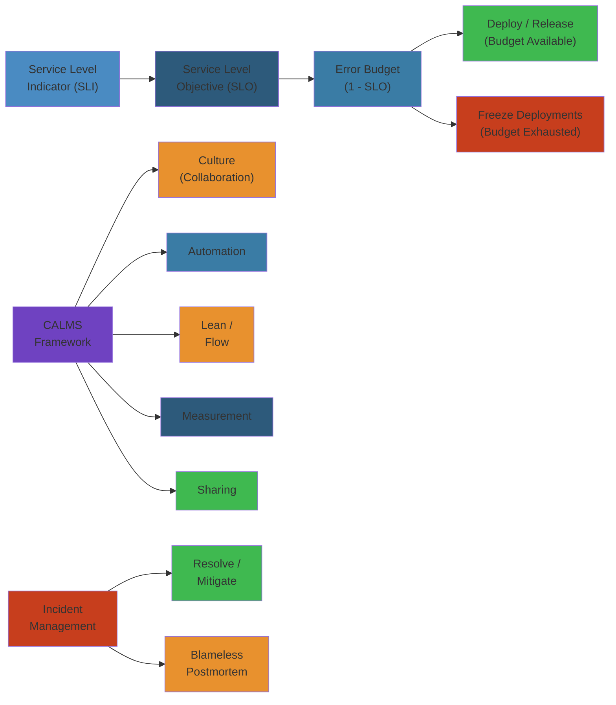
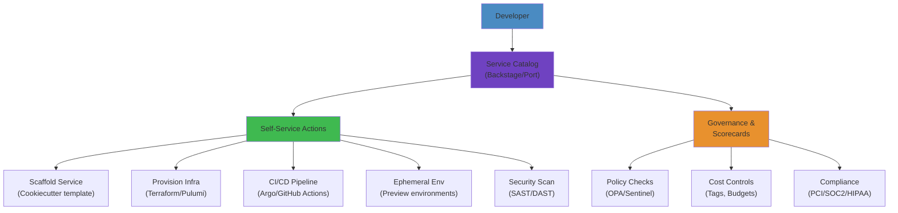

# DevOps & SRE Practices — Senior/Principal Engineer Deep Dive

**Related**: [Infrastructure as Code](/06-devops/01-infrastructure-as-code.md) · [Configuration Management](/06-devops/02-configuration-management.md) · [Kubernetes Operations](/07-kubernetes/02-advanced-k8s.md) · [Observability](/data/observability/)

---




## Table of Contents


- [DevOps Culture: CALMS Framework](#devops-culture-calms-framework)
- [SRE Principles Deep Dive](#sre-principles-deep-dive)
  - [SLIs, SLOs, and SLAs](#slis-slos-and-slas)
  - [Error Budget Math](#error-budget-math)
  - [Error Budget Policies & Enforcement](#error-budget-policies--enforcement)
- [Toil: Definition, Measurement, Reduction](#toil-definition-measurement-reduction)
- [Incident Management](#incident-management)
  - [Severity Classification](#severity-classification)
  - [Incident Response Flow](#incident-response-flow)
  - [Postmortems & Blameless Culture](#postmortems--blameless-culture)
- [DevSecOps: Shift Left Security](#devsecops-shift-left-security)
  - [CI/CD Security Gates](#cicd-security-gates)
  - [Supply Chain Security](#supply-chain-security)
- [Production Readiness Reviews](#production-readiness-reviews)
- [Change Management: Progressive Delivery](#change-management-progressive-delivery)
  - [Canary Deployments](#canary-deployments)
  - [Blue-Green Deployments](#blue-green-deployments)
  - [Feature Flags](#feature-flags)
- [On-Call & Incident Rotation Design](#on-call--incident-rotation-design)
- [Enterprise Adoption Patterns](#enterprise-adoption-patterns)
- [Failure Analysis Reference](#failure-analysis-reference)

---

## DevOps Culture: CALMS Framework


DevOps is not a tool, a team, or a title. It is a cultural and professional movement that stresses communication, collaboration, integration, and automation.

**CALMS — The five pillars:**

```
C  Culture        ───  Collaboration, shared responsibility, trust
A  Automation     ───  Eliminate manual work, reduce errors
L  Lean           ───  Small batches, flow efficiency, eliminate waste
M  Measurement    ───  Data-driven decisions, evidence-based improvement
S  Sharing        ───  Knowledge sharing, blameless learning, feedback
```

**Culture — The hardest part:**

```
Traditional IT                          DevOps
──────────────────────────────────      ──────────────────────────────────
Dev throws code over the wall           Dev + Ops collaborate from day 1
"Works on my machine"                   "It works in production"
Blame-oriented incident review          Blameless postmortems
Silos: dev / QA / ops / security        Cross-functional teams
Manual handoffs                         Automated pipelines
Deploy windows (quarterly)              Deploy anytime (continuous)
"Change is risky"                       "Change is safe (small, frequent)"
```

**The DORA metrics:**

```
DORA's Four Key Metrics:
┌──────────────────────────────────────────────────────────────┐
│  Metric              │ Elite   │ High    │ Medium  │ Low     │
│──────────────────────┼─────────┼─────────┼─────────┼─────────│
│  Deploy Frequency     │ On-demand│ Weekly  │ Monthly │ < Monthly│
│  Lead Time for Change │ < 1 day │ < 1 week│ 1-6 mo  │ > 6 mo  │
│  Time to Restore (MTTR)│ < 1 hr │ < 1 day │ < 1 week│ > 1 week│
│  Change Failure Rate  │ 0-5%    │ 0-15%   │ 0-15%   │ 15-30%  │
└──────────────────────────────────────────────────────────────┘

Elite performers:
  - 208x more frequent deployments
  - 106x faster lead time
  - 2,604x faster time to restore
  - 7x lower change failure rate
```

---

## SRE Principles Deep Dive


### SLIs, SLOs, and SLAs


```
Service Level Hierarchy:
┌──────────────────────────────────────────────────────────────┐
│                     SLA (Contract)                            │
│  "99.95% uptime, refund if below"                            │
│  Legal commitment. Written in contract.                       │
│  Penalties if violated.                                      │
└──────────────────────────────────────────────────────────────┘
        │ Informed by
        ▼
┌──────────────────────────────────────────────────────────────┐
│                     SLO (Target)                              │
│  "99.9% latency under 200ms over rolling 28 days"            │
│  Internal target. Drives engineering decisions.              │
│  Ambition level. Can be tighter than SLA.                    │
└──────────────────────────────────────────────────────────────┘
        │ Measured by
        ▼
┌──────────────────────────────────────────────────────────────┐
│                     SLI (Measurement)                         │
│  "actual latency p99 = 187ms over last 5 minutes"           │
│  Raw measurement. What we actually observe.                  │
│  Must be precise, reliable, and available in real-time.      │
└──────────────────────────────────────────────────────────────┘
```

**SLI — What to measure:**

```
Request/Service SLIs:
  ┌─ Latency:    Time to respond (p50, p95, p99)
  ├─ Availability: Fraction of requests that succeed
  ├─ Throughput:  Requests per second
  ├─ Error rate:  5xx rate, application errors
  └─ Saturation:  How "full" the service is

Storage SLIs:
  ┌─ Latency:      Read/write latency
  ├─ Availability: Fraction of operations that succeed
  ├─ Durability:   Probability of data loss
  └─ Throughput:   IOPS, bandwidth

Data Pipeline SLIs:
  ┌─ Freshness:    Age of latest data
  ├─ Completeness: Fraction of expected data received
  └─ Correctness:  Schema validation pass rate

Infrastructure SLIs:
  ┌─ Instance health:   % of instances passing health checks
  ├─ Config drift:      % of nodes with no drift
  └─ Resource usage:    CPU, memory, disk utilization
```

**SLO — Setting the target:**

```
Good SLO characteristics:
  ✓ Specific:     "99.9%" not "high availability"
  ✓ Measurable:   Countable via SLIs
  ✓ Achievable:   Realistic, not aspirational
  ✓ Relevant:     Matters to users
  ✓ Time-bound:   Rolling window (28 days, 30 days)

SLO examples:
  API latency:     99% of GET requests < 200ms (rolling 28 days)
  API availability: 99.95% of requests return non-5xx (28 days)
  Data freshness:   95% of data < 5 minutes old (1 hour window)
  Pipeline SLA:     99.99% of events delivered within 60 seconds
```

**SLO design patterns:**

```
Multi-tier SLOs:
  Tier 1 (Critical): 99.99% availability, p99 < 50ms
    → Payments, authentication, core API
  Tier 2 (Important): 99.9% availability, p99 < 200ms
    → Search, recommendations, user profiles
  Tier 3 (Best effort): 99% availability
    → Analytics, reporting, batch jobs

Per-user-class SLOs:
  Free tier:     99.5% availability
  Paid tier:     99.9% availability
  Enterprise:    99.99% availability
  (Same service, different priority queues / scaling)

Burn rate SLOs:
  Based on error budget consumption velocity.
  Alert if error budget is being consumed too fast.
  e.g., "Alert if we'll exhaust error budget in 3 days at current rate"
```

---

### Error Budget Math


**The fundamental equation:**

```
Error Budget = 1 - SLO

For 99.9% SLO:
  Error budget = 1 - 0.999 = 0.001 = 0.1% of requests can fail

Time-based interpretation (for availability SLO):
  Monthly:  0.001 × 30 days × 24 hr × 60 min = 43.2 minutes downtime allowed
  Quarterly: 0.001 × 90 days × 24 hr × 60 min = 129.6 minutes
  Yearly:    0.001 × 365 days × 24 hr × 60 min = 525.6 minutes (~8.7 hours)
```

**Common SLO percentages and allowed downtime:**

```
SLO        ──  Monthly Downtime  ──  Yearly Downtime  ──  Error Budget %
───────        ───────────────       ──────────────       ──────────────
99% (one 9)    7.2 hours             87.6 hours            1.0%
99.9% (three 9s) 43.2 minutes        8.7 hours             0.1%
99.95%         21.6 minutes          4.4 hours             0.05%
99.99% (four 9s) 4.3 minutes         52.6 minutes          0.01%
99.999% (five 9s) 25.9 seconds       5.26 minutes          0.001%
```

**Error budget consumption rate:**

```
Error Budget Consumption Rate:
  C = (1 - actual_SLI) / (1 - SLO_target)

  If SLO = 99.9% and actual SLI = 99.95%:
    C = (1 - 0.9995) / (1 - 0.999) = 0.0005 / 0.001 = 0.5
    We're consuming at 50% of budget → healthy

  If SLO = 99.9% and actual SLI = 99.85%:
    C = (1 - 0.9985) / (1 - 0.999) = 0.0015 / 0.001 = 1.5
    We're consuming at 150% of budget → trouble

  If C > 1: Error budget is being depleted (unsustainable)
  If C < 1: Error budget is accumulating (may be too conservative)
```

**Error budget alerting — multi-window, multi-burn-rate:**

```
Google's approach: Alert on error budget burn rate, not remaining budget.

Burn rate B = how fast we're consuming the budget relative to the SLO window.
  B = C (consumption rate)

Alert thresholds:
  Critical: B ≥ 14 for 6 hours   (will exhaust budget in ~14.6 days)
  Warning:  B ≥ 6  for 24 hours  (will exhaust budget in ~30 days)
  Notice:   B ≥ 2  for 2 weeks   (will exhaust budget at end of window)

Example rule for Prometheus (Alertmanager):
  expr: (
    (
      1 - (
        sum(rate(requests_total{status=~"5.."}[1h])) /
        sum(rate(requests_total[1h]))
      )
    ) > 0.001 * 14
  )
  for: 6h
  labels:
    severity: critical
  annotations:
    summary: "Error budget burn rate critical (14x budget)"
```

---

### Error Budget Policies & Enforcement


```
What happens when error budget is exhausted?

Policy options (choose based on culture):

Option 1: Freeze Feature Releases
  - No deploys until budget recovers
  - Forces team to focus on reliability
  - "Release train doesn't leave unless the engine is fixed"

Option 2: Rollback Pressure
  - Automatically rollback if deploy causes budget exhaustion
  - Strong feedback loop: "You broke it, you roll it back"

Option 3: SLO Violation Review
  - Postmortem required before any new features
  - Engineering time allocated to reliability work
  - Budget recovery plan must be approved

Option 4: Soft Warning (Google's approach)
  - SREs can say "no" to further changes
  - But typically just triggers focused reliability work
  - Feature development continues if risk is acceptable

Error budget policy enforcement:
  ┌──────────────────────────────────────────────────────────┐
  │                    Error Budget Tracker                    │
  │                                                          │
  │   Remaining: 62% (of 0.1% monthly budget)               │
  │   Consumption rate: 0.8x (sustainable)                   │
  │                                                          │
  │   ════════════════════════════════════════════════        │
  │   ■■■■■■■■■■■■■■■■■■■■■■■■■■░░░░░░░░░░░░░░░            │
  │   │   Used (38%)          │  Remaining (62%)   │        │
  │   └───────────────────────┴────────────────────┘        │
  │                                                          │
  │   Status: ✅ Healthy — Releases permitted               │
  │   Predicted exhaustion: Never (at current rate)         │
  └──────────────────────────────────────────────────────────┘
```

---

## Toil: Definition, Measurement, Reduction


**What is toil?**

```
Toil = Manual, repetitive, automatable, tactical, non-value-adding work

Characteristics:
  1. Manual:     Requires human intervention (no script)
  2. Repetitive:  Done regularly (daily, weekly)
  3. Automatable: Could be done by a machine
  4. Tactical:    No enduring value (firefighting, not building)
  5. Non-scaling: 2x nodes = 2x work (doesn't scale with system)
```

**Examples of toil vs engineering:**

```
TOIL (should automate)              ENGINEERING (valuable work)
──────────────────────────────      ──────────────────────────────
Manually restarting crashed         Building auto-remediation
  services                            for common failure modes
SSH-ing into servers to check       Developing monitoring dashboards
  logs for errors                     and alerting rules
Manually approving every            Building progressive delivery
  deployment                          pipelines
Rotating passwords by hand          Implementing automated secret
  in all systems                      rotation
Responding to the same alert         Fixing the root cause so the
  every night                          alert stops firing
Creating JIRA tickets for            Automating compliance reporting
  compliance evidence
Paging an engineer because           Building self-healing systems
  disk is 95% full
```

**Measuring toil:**

```
Toil ratio = hours spent on toil / total engineering hours

Target: < 50% toil ratio
         (Google SRE standard)

Measurement approach:
  1. Time tracking (ticket tags, time estimates)
  2. On-call event classification
  3. Survey: "What fraction of your week is toil?"
  4. Retrospective analysis of ticket queues

Tier classification for tickets/incidents:
  Tier 0: Automated (no human touch)
  Tier 1: Human reviews automated output (< 5 min)
  Tier 2: Manual fix with runbook (< 30 min)
  Tier 3: Investigate novel problem (no runbook, > 30 min)
  Tier 4: Engineering project (no existing solution)

  Target: > 80% of events in Tier 0-1
```

**Toil reduction strategies:**

```
Strategy 1: Automate the Common Case
  Problem: "Disk full alerts every day"
  Fix: Auto-cleanup script + monitoring
  Effort: 2 days to build
  Impact: Saves 2 hours/week permanently

Strategy 2: Eliminate the Root Cause
  Problem: "Service X crashes every Tuesday"
  Fix: Fix the memory leak in service X
  Effort: 2 weeks
  Impact: No more Tuesday crashes

Strategy 3: Reduce Frequency
  Problem: "Weekly database maintenance"
  Fix: Better indexing → monthly maintenance
  Effort: 1 week

Strategy 4: Shift Left
  Problem: "Deploy fails because of config errors"
  Fix: Validate config in CI/CD before deploy
  Effort: 3 days

Strategy 5: Accept Imperfection
  Problem: "A rare edge case causes 0.01% errors"
  Fix: Don't fix it (within error budget)
  Effort: None (accept)
```

---

## Incident Management


### Severity Classification


```
Severity Levels:
SEV-0 ─── Critical ─── Full system outage, data loss, security breach
   Examples:
   - All users cannot access service
   - Customer data exposed
   - Payment processing stopped
   - DNS/hosting failure

SEV-1 ─── Major ─── Major feature unavailable, partial outage
   Examples:
   - Core feature broken (e.g., login, search)
   - Performance degradation > 50%
   - Single region/DC down
   - SLI below SLO for > 5 minutes

SEV-2 ─── Moderate ─── Degraded but usable, minor feature broken
   Examples:
   - Non-critical feature broken
   - Performance degradation 10-50%
   - Error rate elevated but not critical
   - Console/UI glitches

SEV-3 ─── Minor ─── Single user, cosmetic, non-urgent
   Examples:
   - One user account issue
   - Typo in documentation
   - Non-critical monitoring alert
   - Internal tool issue

SEV-4 ─── Informational ─── No user impact, just tracking
   Examples:
   - Investigative ticket
   - Cleanup task
   - Feature request (bugs already tracked)
```

**Severity guidelines:**

```
Determining severity:
  ┌──────────────────────────────────────────────────────────┐
  │  Question 1: Is user-facing functionality affected?       │
  │  ├── No  → SEV-3 or SEV-4                                 │
  │  └── Yes → Continue                                       │
  │                                                            │
  │  Question 2: Is it ALL users or some?                     │
  │  ├── All → SEV-0 or SEV-1                                 │
  │  └── Some → SEV-2 or SEV-3                                │
  │                                                            │
  │  Question 3: Is there a workaround?                       │
  │  ├── Yes, immediate → SEV-2                                │
  │  ├── Yes, complex → SEV-1                                 │
  │  └── No → SEV-0 or SEV-1                                  │
  │                                                            │
  │  Question 4: Is data at risk?                             │
  │  ├── Yes → SEV-0 (immediate!)                            │
  │  └── No → based on above                                  │
  └──────────────────────────────────────────────────────────┘
```

---

### Incident Response Flow


```
Incident Response Lifecycle:
╔═══════════════════════════════════════════════════════════════╗
║                        INCIDENT                                ║
╚═══════════════════════════════════════════════════════════════╘
        │
        ▼
┌──────────────────────────────────────────────────────────────┐
│  1. DETECT                                                      │
│                                                                 │
│  How the incident is discovered:                                │
│  - Monitoring alert fires                                       │
│  - User reports issue (support ticket)                           │
│  - Automated health check fails                                  │
│  - Manual observation (dashboards)                              │
│                                                                 │
│  Output: Alert + preliminary severity assessment               │
└──────────────────────────────────────────────────────────────┘
        │
        ▼
┌──────────────────────────────────────────────────────────────┐
│  2. RESPOND                                                     │
│                                                                 │
│  Actions:                                                       │
│  - Engineer acknowledges page                                  │
│  - Incident declared (with severity)                            │
│  - Communication channel established (#incident-slack)          │
│  - Initial assessment: what's broken, who's affected            │
│  - Stakeholders notified (if SEV-0/1)                          │
│                                                                 │
│  Roles during response:                                         │
│    IC   (Incident Commander)  ─── Coordinates                  │
│    TL   (Technical Lead)      ─── Debugs, fixes               │
│    Comms                     ─── Updates status to org        │
│    Scribe                    ─── Takes notes for postmortem    │
└──────────────────────────────────────────────────────────────┘
        │
        ▼
┌──────────────────────────────────────────────────────────────┐
│  3. MITIGATE                                                    │
│                                                                 │
│  Actions (not necessarily in order):                            │
│  - Rollback recent change                                       │
│  - Scale up / failover                                          │
│  - Enable feature flag to disable broken feature                │
│  - Apply hotfix                                                 │
│  - Block bad traffic (WAF, rate limit)                          │
│  - Restore from backup                                          │
│                                                                 │
│  Note: Mitigation is NOT the same as fix.                       │
│        Goal is to restore service, not fix root cause.          │
│        Root cause fix happens in "Learn" phase.                │
└──────────────────────────────────────────────────────────────┘
        │
        ▼
┌──────────────────────────────────────────────────────────────┐
│  4. RESOLVE                                                     │
│                                                                 │
│  Service is restored to normal.                                 │
│  Monitoring confirms SLIs within SLO.                           │
│  Incident declared resolved.                                     │
│  Communication: "All clear" notification                        │
│  Incident channel is archived (or paused).                      │
│  Temporary mitigation is in place.                              │
└──────────────────────────────────────────────────────────────┘
        │
        ▼
┌──────────────────────────────────────────────────────────────┐
│  5. LEARN                                                       │
│                                                                 │
│  Action items:                                                  │
│  - Schedule postmortem (within 48 hours)                       │
│  - Gather timeline from chat logs, monitoring, deploys          │
│  - Determine root cause(s) — NOT blame                         │
│  - Write postmortem document                                    │
│  - Create action items with owners                             │
│  - Track action items to completion                            │
│                                                                 │
│  Goal: Reduce severity or likelihood of recurrence.            │
│        Not: Punish the person who caused it.                   │
└──────────────────────────────────────────────────────────────┘
```

**Incident response roles — more detail:**

```
Incident Commander (IC):
  ✓ Single point of command (only one IC at a time)
  ✓ Delegates work, does NOT debug themselves
  ✓ Tracks timeline
  ✓ Makes decisions about severity, escalation
  ✓ Decides when to declare/declare-resolved
  ✗ NOT the most senior person in the room

Technical Lead (TL):
  ✓ Leads debugging efforts
  ✓ Coordinates multiple sub-teams if needed
  ✓ Makes technical decisions (rollback? scale? fix forward?)
  ✓ Reports findings to IC
  ✗ Does NOT manage communication or timeline

Scribe:
  ✓ Records timeline of actions and observations
  ✓ Captures commands run, decisions made, data observed
  ✓ Documents what was tried that didn't work
  ✓ Creates raw material for postmortem
  ✗ Does NOT participate in debugging

Communications Lead:
  ✓ Updates status page (internal and external)
  ✓ Crafts messages for stakeholders
  ✓ Manages ETA expectations
  ✓ Coordinates with PR/legal for SEV-0
  ✗ Does NOT participate in debugging
```

**Incident response — communication templates:**

```
Initial Alert:
  [SEV-1] Service degradation on API
  Detected: 14:32 UTC (monitoring alert: error rate > 5%)
  Severity: SEV-1 (partial outage)
  Impact: All API users seeing 503 errors on /orders endpoint
  IC: @alice  TL: @bob   Channel: #incident-api-20240315

Update (every 15-30 min):
  [SEV-1] API degradation — Update #3
  Time: 15:15 UTC
  What we know: /orders endpoint crashing due to DB connection pool
  exhausted after upstream DB migration. Rolling back DB migration.
  ETA: 15 minutes for rollback
  Impact: Reduced — error rate dropped to 2%

Resolved:
  [SEV-1] API degradation — RESOLVED
  Time: 15:28 UTC
  Root cause: DB migration changed connection string → pool exhausted
  Mitigation: Rolled back DB migration
  Current status: All systems normal
  Postmortem scheduled: Wednesday 10:00
```

---

### Postmortems & Blameless Culture


**Postmortem structure:**

```markdown
# Postmortem: API Degradation — 2024-03-15

## Summary


14-minute degradation of /orders API endpoint.
Error rate peaked at 12%. P99 latency spiked to 8s (norm: 200ms).

## Severity


SEV-1 (partial outage)

## Timeline


14:30 — Upstream team deploys DB migration (add column to orders table)
14:31 — /orders error rate begins rising (2%, 4%, 8%)
14:32 — Monitoring alert fires: "Error rate > 5%"
14:32 — @alice paged, declares SEV-1
14:33 — Incident channel opened. @bob joins as TL
14:35 — Rollback of DB migration initiated
14:42 — Error rate returning to normal
14:44 — All systems normal. Incident resolved.
14:45 — All-clear communicated

## Detection


Monitoring alert: HighErrorRate /orders API (threshold: 5% errors)

## Impact


- 14 minutes of elevated error rates
- ~12,000 failed requests (0.8% of daily API volume)
- No data loss (errors were 503s, not data corruption)
- No financial impact (requests retried successfully after resolution)

## Root Cause


DB migration v2.3.14 added a new column to the `orders` table with:
  ALTER TABLE orders ADD COLUMN region_id INT NOT NULL DEFAULT 0;

The migration script included `NOT NULL` + `DEFAULT` — this caused
PostgreSQL to rewrite the table (add column with default on existing rows).
During the rewrite, row-level locks caused connection pool exhaustion
for the /orders endpoint.

## Contributing Factors


1. DB migration design: Adding column with NOT NULL + DEFAULT on a
   production table with >50M rows triggered table rewrite
2. No canary: Migration was applied directly to prod (not staged)
3. No load test: Migration was not tested with production-scale data
4. Communication gap: API team was not notified of planned migration

## What Went Well


- Monitoring detected the issue within 60 seconds
- Rollback mechanism worked correctly (3 min to revert)
- On-call engineer responded within 1 minute
- Clear roles (IC/TL) enabled parallel work

## What Went Wrong


- Migration was not reviewed by API team
- No mechanism to test migrations on prod-like data volume
- Alert threshold was reactive, not predictive

## Action Items


| Action | Owner | Due |
|--------|-------|-----|
| Implement canary framework for DB migrations | @bob | 04-01 |
| Add migration load testing to CI pipeline | @alice | 04-15 |
| Create coordination channel for prod DB changes | @carol | 03-22 |
| Investigate pg_repack for online DDL | @dave | 04-01 |
| Review all pending migrations for table rewrite risk | @bob | 03-25 |

## Lessons Learned


1. DB migrations must be treated as high-risk operations
2. Table rewrites with NOT NULL + DEFAULT are dangerous at scale
3. Cross-team communication for shared infrastructure is essential
4. Our rollback process is solid — that's good

## Follow-up


- Postmortem reviewed in team retro (03-18)
- Action items tracked in JIRA Epic: RELIABILITY-42
```

**Blameless culture — principles:**

```
Blameless does NOT mean:
  ✗ No accountability
  ✗ "Accidents happen, oh well"
  ✗ Ignoring repeated mistakes
  ✗ Protecting incompetence

Blameless means:
  ✓ Assume good intentions
  ✓ Focus on systems, not individuals
  ✓ "How did the system allow this to happen?"
  ✓ Fix the process, not the person
  ✓ Everyone makes mistakes — strong systems prevent them
  ✓ Share the learning, not the shame

The "5 Whys" — root cause analysis technique:
  Problem: /orders API went down

  Why? → DB connection pool exhausted
  Why? → Table rewrite held locks too long
  Why? → NOT NULL + DEFAULT caused table rewrite
  Why? → Migration script didn't account for table size
  Why? → No load testing with prod-scale data
  Why? → CI pipeline doesn't include scale testing

  Action: Add scale testing to migration CI pipeline
  Environment fix, not a person fix.
```

---

## DevSecOps: Shift Left Security


### CI/CD Security Gates


```
Shift Left — security as early as possible:
╔═══════════════════════════════════════════════════════════════╗
║                        SECURITY GATES                          ║
╚═══════════════════════════════════════════════════════════════╘
        │                           │
        ▼                           ▼
┌─────────────────┐     ┌─────────────────────────────┐
│  IDE / Pre-commit │     │  Commit / PR                │
│                    │     │                             │
│  • Secrets scan    │     │  • SAST (Semgrep/CodeQL)    │
│  (git-secrets,     │     │  • Dependency audit         │
│   trufflehog)      │     │  (npm audit, pip audit)     │
│  • Linting (ESLint │     │  • License compliance       │
│   with security    │     │  • IaC scan (tfsec/checkov) │
│   rules)           │     │  • Container scan (Trivy)   │
│  • Pre-commit hooks│     │  • Secret scan (CI level)   │
└─────────────────┘     └──────────────┬──────────────┘
        │                               │
        ▼                               ▼
┌─────────────────┐     ┌─────────────────────────────┐
│  Build / Package  │     │  Deploy / Release           │
│                    │     │                             │
│  • SBOM generation │     │  • Container policy         │
│  (CycloneDX)       │     │   (Kyverno, OPA)           │
│  • Image signing   │     │  • Admission control        │
│  (Cosign)          │     │  • Runtime scan (Falco)     │
│  • Image vulnerability │  │  • Compliance check         │
│    scan (Grype)    │     │  • DAST (OWASP ZAP)        │
│  • Supply chain    │     │  • Penetration test         │
│    attestation     │     │                             │
└─────────────────┘     └─────────────────────────────┘
```

**Security gate implementation:**

```yaml
# .github/workflows/security.yml — CI security gates
name: Security Scan
on: [pull_request]

jobs:
  secrets:
    runs-on: ubuntu-latest
    steps:
      - uses: actions/checkout@v4
      - name: Scan for secrets
        uses: trufflesecurity/trufflehog@v3
        with:
          extra_args: --only-verified

  sast:
    runs-on: ubuntu-latest
    steps:
      - uses: actions/checkout@v4
      - name: Semgrep SAST
        uses: semgrep/semgrep-action@v1
        with:
          config: p/default  # or p/owasp-top-ten

  deps:
    runs-on: ubuntu-latest
    steps:
      - uses: actions/checkout@v4
      - name: Dependency check
        uses: dependency-check/Dependency-Check_Action@main
        with:
          project: 'my-service'
          path: '.'
          format: 'HTML'

  iac:
    runs-on: ubuntu-latest
    steps:
      - uses: actions/checkout@v4
      - name: IaC scan
        uses: aquasecurity/trivy-action@master
        with:
          scan-type: 'config'
          scan-ref: './infrastructure'
          format: 'sarif'
          output: 'trivy-results.sarif'
```

**Gate enforcement policies:**

```
Blocking vs Non-blocking gates:

NON-BLOCKING (info — warns, doesn't block):
  ┌─ Linting suggestions
  ├─ Best practice violations
  ├─ Low severity vulnerabilities
  └─ License information

BLOCKING (fails CI, prevents merge):
  ┌─ Secrets in code
  ├─ Critical/high CVEs (CVSS >= 7)
  ├─ IaC with public exposure (e.g., S3 public access)
  ├─ Hardcoded credentials
  └─ Blocklisted dependencies (known malware)

Conditional blocking:
  ┌─ Medium CVEs: block only for production deployments
  ├─ SAST findings: block only if critical path
  └─ Compliance violations: block only for regulated workloads
```

---

### Supply Chain Security


```
Supply Chain Threats:
┌──────────────────────────────────────────────────────────┐
│  Threat                           │ Mitigation           │
│──────────────────────────────────┼──────────────────────│
│  Malicious package (typosquatting) │ Package verification │
│  Compromised build tool            │ Reproducible builds  │
│  Dependency confusion              │ Scoped packages      │
│  Man-in-the-middle (package repo)  │ Integrity hashes    │
│  Upstream supply chain attack      │ SBOM + attestation  │
│  Building from untrusted code      │ Signed commits      │
└──────────────────────────────────────────────────────────┘

Mitigation stack:
  SLSA (Supply Chain Levels for Software Artifacts):
    Level 1: Build scripted (automated, not manual)
    Level 2: Build service + source control + signed provenance
    Level 3: Hardened build + non-falsifiable provenance
    Level 4: Two-party review + hermetic builds + all of above

  SBOM (Software Bill of Materials):
    Generate:  cyclonedx-bom / syft
    Store:     alongside release artifacts
    Verify:    grype / trivy for vulnerability correlation
    Share:     OWASP CycloneDX format

  Cosign (container signing):
    # Sign image
    cosign sign --key cosign.key ghcr.io/org/app:v1.2.3

    # Verify before deploy
    cosign verify --key cosign.pub ghcr.io/org/app:v1.2.3
```

---

## Production Readiness Reviews


A structured review of a service before it goes live.

```
Production Readiness Review (PRR) checklist:

□ ARCHITECTURE
  □ Service dependencies documented (internal + external)
  □ Single points of failure identified
  □ Data flow diagram up to date
  □ Capacity planning completed
  □ Multi-AZ / multi-region design documented

□ DEPLOYMENT
  □ CI/CD pipeline working
  □ Automated rollback tested
  □ Canary / blue-green deployment implemented
  □ Database migration plan reviewed
  □ Feature flags for risky features

□ MONITORING & ALERTING
  □ SLIs defined and instrumented
  □ SLOs documented with error budget
  □ Dashboards created (at-a-glance + drill-down)
  □ Alerts configured with appropriate severity
  □ Runbooks written for each alert
  □ On-call team trained on runbooks

□ RESILIENCE
  □ Graceful degradation (degraded mode, not crash)
  □ Retry logic with exponential backoff + jitter
  □ Circuit breakers for downstream dependency failures
  □ Rate limiting configured
  □ Bulkhead / thread pool isolation

□ SECURITY
  □ Secrets not in code
  □ Authentication / authorization enforced
  □ Network segmentation (internal-only where possible)
  □ Input validation
  □ Dependency vulnerabilities scanned
  □ Container images signed

□ DATA
  □ Backup and restore procedure tested
  □ Data retention policy defined
  □ Encryption at rest and in transit
  □ Data loss scenarios documented

□ DISASTER RECOVERY
  □ Recovery Time Objective (RTO) documented
  □ Recovery Point Objective (RPO) documented
  □ DR plan tested (at least in staging)
  □ Failover procedures documented
```

**PRR process flow:**

```
PRR Process:
┌──────────────────────────────────────────────────────────┐
│  Development Phase           │ Production Phase           │
│                             │                            │
│  ┌──────────────────┐       │  ┌──────────────────┐     │
│  │ Team develops    │       │  │ Service running   │     │
│  │ service          │       │  │ in production     │     │
│  └────────┬─────────┘       │  └──────────────────┘     │
│           │                 │                            │
│           ▼                 │           ▲                │
│  ┌──────────────────┐       │           │                │
│  │ Self-assessment   │       │  ┌───────┴──────────┐    │
│  │ (team fills       │───────┼──▶│ Ongoing review   │    │
│  │  out PRR doc)     │       │  │ SLI violations    │    │
│  └────────┬─────────┘       │  │ trigger re-review │    │
│           │                 │  └──────────────────┘    │
│           ▼                 │                            │
│  ┌──────────────────┐       │                            │
│  │ PRR Review       │       │                            │
│  │ (team + SRE +    │       │                            │
│  │  security)       │────────┘                            │
│  └────────┬─────────┘                                    │
│           │                                               │
│  ┌────────┴─────────┐    ┌─────────────────────┐        │
│  │  PASS / FAIL     │───▶│ Action items tracked │        │
│  └──────────────────┘    │ to closure           │        │
│                          └──────────────────────┘        │
└──────────────────────────────────────────────────────────┘
```

---

## Change Management: Progressive Delivery


### Canary Deployments


```
Canary Deployment Flow:
═══════════════════════════════════════════════════════════════

                      v1.2.3 (new)     v1.2.2 (current)
                         │                  │
                         ▼                  ▼
  ┌─────────────────────────────────────────────────────────┐
  │  Step 1: Deploy to canary (1% of traffic)                │
  │                                                         │
  │  ┌────────┐  ┌────────┐  ┌────────┐  ┌────────┐       │
  │  │        │  │        │  │        │  │        │       │
  │  │ v1.2.3 │  │ v1.2.2 │  │ v1.2.2 │  │ v1.2.2 │       │
  │  │ (canary)│  │        │  │        │  │        │       │
  │  └────────┘  └────────┘  └────────┘  └────────┘       │
  │  Monitor: error rate, latency, CPU, memory              │
  └─────────────────────────────────────────────────────────┘
                          │
                          ▼
  ┌─────────────────────────────────────────────────────────┐
  │  Step 2: Expand canary (10% of traffic)                  │
  │                                                         │
  │  ┌────────┐  ┌────────┐  ┌────────┐  ┌────────┐       │
  │  │        │  │        │  │        │  │        │       │
  │  │ v1.2.3 │  │ v1.2.3 │  │ v1.2.2 │  │ v1.2.2 │       │
  │  │        │  │        │  │        │  │        │       │
  │  └────────┘  └────────┘  └────────┘  └────────┘       │
  │  Monitor: compare 10% vs 90% — SLIs must match          │
  └─────────────────────────────────────────────────────────┘
                          │
                          ▼
  ┌─────────────────────────────────────────────────────────┐
  │  Step 3: Roll to 100%                                    │
  │                                                         │
  │  ┌────────┐  ┌────────┐  ┌────────┐  ┌────────┐       │
  │  │        │  │        │  │        │  │        │       │
  │  │ v1.2.3 │  │ v1.2.3 │  │ v1.2.3 │  │ v1.2.3 │       │
  │  │        │  │        │  │        │  │        │       │
  │  └────────┘  └────────┘  └────────┘  └────────┘       │
  └─────────────────────────────────────────────────────────┘
                          │
                          ▼
  ┌─────────────────────────────────────────────────────────┐
  │  Step 4: Canary analysis — compare SLIs: canary vs control │
  │                                                         │
  │  Metric         │ Canary (v1.2.3) │ Control (v1.2.2)   │
  │  ───────────────┼────────────────┼────────────────────│
  │  Error rate     │ 0.05%          │ 0.04%              │
  │  p50 latency    │ 45ms           │ 42ms               │
  │  p99 latency    │ 210ms          │ 198ms              │
  │  CPU usage      │ 42%            │ 38%                │
  │                                                         │
  │  Decision: ✅ Promote — no significant regression       │
  │            ❌ Rollback — p99 latency exceeds SLO         │
  └─────────────────────────────────────────────────────────┘
```

**Canary analysis — statistical significance:**

```python
# Canary analysis: is the difference statistically significant?
# Using two-proportion z-test for error rate comparison

import numpy as np
from scipy import stats

def canary_analysis(canary_errors, canary_total, control_errors, control_total):
    """
    Determine if canary error rate is statistically higher than control.
    Returns (z_stat, p_value, is_significant)
    """
    p_canary = canary_errors / canary_total
    p_control = control_errors / control_total

    # Pooled proportion
    p_pool = (canary_errors + control_errors) / (canary_total + control_total)

    # Standard error
    se = np.sqrt(p_pool * (1 - p_pool) * (1/canary_total + 1/control_total))

    # Z-statistic
    z = (p_canary - p_control) / se

    # p-value (one-tailed: is canary worse?)
    p_value = 1 - stats.norm.cdf(z)

    # Significant at alpha = 0.05
    is_significant = p_value < 0.05

    return z, p_value, is_significant

# Example:
# Canary: 12 errors out of 20,000 requests
# Control: 8 errors out of 20,000 requests
z, p, sig = canary_analysis(12, 20000, 8, 20000)
print(f"z={z:.2f}, p={p:.4f}, significant={sig}")
# → z=0.87, p=0.1912, significant=False
# → Difference could be random variation. Proceed.
```

---

### Blue-Green Deployments


```
Blue-Green Deployment:
═══════════════════════════════════════════════════════════════

Before deployment:
  ┌─────────────────────────────────────────────────┐
  │  Load Balancer                                    │
  │  (100% traffic → BLUE)                            │
  │         │                                         │
  │         ▼                                         │
  │  ┌──────────────┐    ┌──────────────┐            │
  │  │   BLUE       │    │   GREEN      │            │
  │  │  (active)    │    │  (idle)      │            │
  │  │  v1.2.2      │    │              │            │
  │  │  ├─ web01    │    │              │            │
  │  │  ├─ web02    │    │              │            │
  │  │  └─ web03    │    │              │            │
  │  └──────────────┘    └──────────────┘            │
  └─────────────────────────────────────────────────┘

Step 1 — Deploy to GREEN:
  ┌─────────────────────────────────────────────────┐
  │  Load Balancer                                    │
  │  (100% traffic → BLUE)                            │
  │         │                                         │
  │         ▼                                         │
  │  ┌──────────────┐    ┌──────────────┐            │
  │  │   BLUE       │    │   GREEN      │            │
  │  │  (active)    │    │  (deploying) │            │
  │  │  v1.2.2      │    │  v1.2.3      │            │
  │  └──────────────┘    │  ├─ web04    │            │
  │                      │  ├─ web05    │            │
  │                      │  └─ web06    │            │
  │                      └──────────────┘            │
  └─────────────────────────────────────────────────┘

Step 2 — Test GREEN:
  ┌─────────────────────────────────────────────────┐
  │  Load Balancer                                    │
  │  (100% traffic → BLUE, direct GREEN for testing)  │
  │                                                    │
  │  Smoke tests run against GREEN directly            │
  │  Internal team verifies GREEN                      │
  └─────────────────────────────────────────────────┘

Step 3 — Swap traffic:
  ┌─────────────────────────────────────────────────┐
  │  Load Balancer                                    │
  │  (100% traffic → GREEN)                           │
  │         │                                         │
  │         ▼                                         │
  │  ┌──────────────┐    ┌──────────────┐            │
  │  │   BLUE       │    │   GREEN      │            │
  │  │  (standby)   │    │  (active)    │            │
  │  │  v1.2.2      │    │  v1.2.3      │            │
  │  └──────────────┘    └──────────────┘            │
  └─────────────────────────────────────────────────┘

Step 4 — Rollback if needed:
  ┌─────────────────────────────────────────────────┐
  │  Load Balancer                                    │
  │  (100% traffic → BLUE) — instant rollback!        │
  │         │                                         │
  │         ▼                                         │
  │  ┌──────────────┐    ┌──────────────┐            │
  │  │   BLUE       │    │   GREEN      │            │
  │  │  (active)    │    │  (standby)   │            │
  │  │  v1.2.2      │    │  v1.2.3      │            │
  │  └──────────────┘    └──────────────┘            │
  └─────────────────────────────────────────────────┘

Considerations:
  - Requires 2x capacity (both environments running simultaneously)
  - Database schema changes must be backward-compatible
  - Sessions: must handle session migration or use shared session store
  - Cost: double infrastructure during deployment
  - Best for: stateless services, web apps, APIs
```

---

### Feature Flags


Feature flags decouple deployment from release.

```
Feature Flag Architecture:
╔═══════════════════════════════════════════════════════════════╗
║                       Application                              ║
║                                                               ║
║  if (featureFlags.isEnabled("new-checkout-flow")) {           ║
║      return newCheckoutFlow();  // new code (flagged)        ║
║  } else {                                                     ║
║      return oldCheckoutFlow();  // old code (default)        ║
║  }                                                             ║
║                                                               ║
║  Feature Flag Client: LaunchDarkly / Flagsmith / Split        ║
║    ├── Local cache (fast path)                                ║
║    └── Streaming updates (real-time toggle)                   ║
╚═══════════════════════════════════════════════════════════════╝

Flag Use Cases:
┌──────────────────────────────────────────────────────────┐
│  Type          │ Example              │ Duration          │
│────────────────┼──────────────────────┼─────────────────│
│  Release flag  │ New checkout flow    │ Days to weeks    │
│  Ops flag      │ "Disable feature X"  │ Permanent        │
│  Experiment    │ A/B test variant     │ Hours to weeks   │
│  Permission    │ Beta access          │ Permanent        │
│  Kill switch   │ Emergency disable    │ Permanent        │
└──────────────────────────────────────────────────────────┘

Flag Management — best practices:
  1. Use a feature flag service (not environment variables)
  2. Set stale flag reminders (auto-expire after N days)
  3. Test with flags both on and off
  4. Remove flags after the feature is fully released
  5. Be careful with nested flags (flag explosion)
  6. Have a "kill all flags" override for emergencies
```

---

## On-Call & Incident Rotation Design


```
On-Call Rotation Models:

Model 1: Primary + Secondary (recommended)
  ┌────────────────────────────────────────────────────┐
  │  Week 1: Alice (primary) + Bob (secondary)          │
  │  Week 2: Bob (primary) + Carol (secondary)          │
  │  Week 3: Carol (primary) + Alice (secondary)        │
  │                                                      │
  │  Primary: First responder — pages, handles incident │
  │  Secondary: Backup — handles other pages,            │
  │              supports primary during incidents       │
  │                                                      │
  │  Escalation: Primary → Secondary → Engineering Lead │
  └────────────────────────────────────────────────────┘

Model 2: Follow-the-Sun
  ┌────────────────────────────────────────────────────┐
  │  US East (9-5 ET) → US West (9-5 PT) → APAC → EMEA │
  │                                                      │
  │  Each region handles their business hours            │
  │  Handoff at end of shift                             │
  │  Weekends rotate between regions                     │
  └────────────────────────────────────────────────────┘

Model 3: Pod/Team-based
  ┌────────────────────────────────────────────────────┐
  │  Team A on-call for their own services              │
  │  Team B on-call for their own services              │
  │  Platform team on-call for infrastructure           │
  │                                                      │
  │  Escalation path: service team → platform team      │
  │  (if the issue is infra, not app)                   │
  └────────────────────────────────────────────────────┘
```

**On-call scheduling best practices:**

```
Rotation length:
  ┌─ 7 days (common): Good balance of context vs burnout
  ├─ 3 days (outage-heavy): Prevents fatigue after SEVs
  ├─ 14 days (stable services): More context, but burned out after
  └─ 24 hours (follow-the-sun): Works well with global teams

Team size:
  At least 4 people per rotation
  Less than 4: too frequent on-call (burnout)
  More than 8: too infrequent (lack of practice)

On-call compensation:
  - Time off in lieu (next day off after page)
  - On-call pay (industry: 10-20% of salary)
  - Recognition in performance reviews

Page response SLOs:
  SEV-0: Respond within 5 minutes
  SEV-1: Respond within 15 minutes
  SEV-2: Respond within 30 minutes
  SEV-3: Next business day

Alert fatigue prevention:
  - Each alert must have a runbook (or be deleted)
  - Alert should require action (if no action, no alert)
  - Target: < 5 pages per shift per person
  - Auto-silence known issues during incident
  - No alert for the same issue that triggered investigation
```

---

## Enterprise Adoption Patterns


**Pattern 1: The Platform Team Model**

```
Organization Structure:
╔═══════════════════════════════════════════════════════════════╗
║                    CTO / VP Engineering                        ║
╚═══════════════════════════════════════════════════════════════╘
        │
        ├─────────────────────────────────────────────────────┐
        │                                                     │
  ┌─────┴────────────┐                              ┌────────┴────────────┐
  │  Platform Team    │                              │  Product Teams      │
  │                   │                              │                     │
  │  Infrastructure   │                              │  Team A (Service X) │
  │  CI/CD Pipelines  │                              │  Team B (Service Y) │
  │  Observability    │                              │  Team C (Service Z) │
  │  SRE Practices    │                              │                     │
  │  Security Tooling │                              │  Each team:         │
  │                   │                              │  - On-call for own  │
  │  Owns:            │                              │    service          │
  │  - K8s clusters   │                              │  - Can deploy own   │
  │  - CI/CD infra    │                              │    changes          │
  │  - Monitoring     │                              │  - Uses platform    │
  │  - Secrets store  │                              │    tooling          │
  │  - Service mesh   │                              │                     │
  └───────────────────┘                              └─────────────────────┘
```

**Pattern 2: SRE Embedded Model**

```
Each product team has an embedded SRE:
╔═══════════════════════════════════════════════════════════════╗
║  SRE Organization (reports to CTO)                            ║
║                                                               ║
║  ┌──────────────────────────────────────────────────────┐    ║
║  │  SRE Manager                                           │    ║
║  │                                                        │    ║
║  │  SRE Alice → Team A (e-commerce)  (50% SRE, 50% team) │    ║
║  │  SRE Bob   → Team B (search)       (50% SRE, 50% team) │    ║
║  │  SRE Carol → Team C (payments)     (50% SRE, 50% team) │    ║
║  └──────────────────────────────────────────────────────┘    ║
║                                                               ║
║  SRE responsibilities per team:                               ║
║    - Define SLOs with product team                            ║
║    - Build monitoring and alerting                            ║
║    - Run production readiness reviews                         ║
║    - Consult on architecture                                  ║
║    - Write runbooks                                           ║
║    - On-call rotation (shared with dev team)                  ║
╚═══════════════════════════════════════════════════════════════╝
```

**Pattern 3: DevOps Transformation Phases**

```
Phase 0 — Siloed (current state):
  Dev team deploys → throws over wall → Ops handles
  Deploys: monthly. Incidents: weekly. CM: none.
  → Pain: slow, brittle, burnout

Phase 1 — Automation:
  Infrastructure as Code (Terraform/Ansible)
  CI/CD pipeline for all services
  Basic monitoring (CPU, disk, memory)
  → Key metric: Time to deploy reduced from weeks to hours

Phase 2 — Standardization:
  Golden paths for service creation
  Production Readiness Review mandatory
  Shared observability stack (logs, metrics, traces)
  On-call rotation established
  → Key metric: Change failure rate < 10%

Phase 3 — SRE Adoption:
  SLOs defined for all critical services
  Error budgets implemented as decision framework
  Blameless postmortems for all SEV-0/1
  Toil measured and reduced quarterly
  → Key metric: Toil < 50% of engineering time

Phase 4 — Platform Engineering:
  Internal developer platform (IDP)
  Self-service infrastructure (preview envs, CI/CD templates)
  Service catalog with ownership and SLAs
  Security gates in CI/CD (shift left)
  → Key metric: Self-service adoption rate

Phase 5 — Reliability Culture:
  Chaos engineering experimentation
  Capacity planning automated
  Auto-remediation for common failure modes
  Reliability is everyone's responsibility
  → Key metric: P50 deployment time < 10 min, MTTR < 1 hour
```

**Enterprise adoption — common anti-patterns:**

```
Anti-pattern 1: "DevOps Team"
  Problem: Create a "DevOps Team" that all other teams hand off to.
  Result: New silo, same problems, different name.
  Fix: Platform team that enables others, not does the work for them.

Anti-pattern 2: Tool-first
  Problem: Buy/mandate tools before understanding culture.
  "We need Kubernetes" without understanding WHY.
  Result: Expensive, unused tools. High burnout.
  Fix: Culture first, process second, tools third.

Anti-pattern 3: SRE as "The No Team"
  Problem: SRE is seen as a blocker — "SRE says no to deploys."
  Result: Teams bypass SRE, shadow IT, tension.
  Fix: SRE should say "yes, but..." not just "no."

Anti-pattern 4: On-call without support
  Problem: Devs on-call for their own service with no training.
  No runbooks. No escalation path. No follow-up.
  Result: Burnout, turnover, alerts ignored.
  Fix: Training, runbooks, incident response training, follow-up.

Anti-pattern 5: Perfect SLOs
  Problem: Set SLOs at 99.999% because "that's what we should have."
  Result: Impossible to meet, error budget always exhausted,
          meaningless metric, no trust.
  Fix: Start with realistic SLOs, measure, improve.
```

---

## Platform Engineering


Platform Engineering is the practice of building Internal Developer Platforms (IDPs) that provide self-service capabilities, golden paths, and governance — enabling product teams to move faster while platform teams maintain control over infrastructure.

### Internal Developer Platform (IDP)




### Developer Portals & Platforms


| Feature | Backstage | Port | Humanitec | Cortex |
|---------|-----------|------|-----------|--------|
| **Open source** | Yes (CNCF) | No | No | No |
| **Service catalog** | Yes | Yes | Yes | Yes |
| **Scorecards** | Yes (plugins) | Yes | Yes | Yes |
| **Infrastructure provisioning** | Via plugins (Terraform) | Via self-service actions | Yes (native) | Via integrations |
| **Scorecards** | Custom | Built-in, template-based | Built-in | Built-in |
| **Backend** | Node.js + PostgreSQL | SaaS (managed) | SaaS + Agent | SaaS + Agent |
| **Plugins** | 200+ | 50+ | 30+ | 40+ |

**Backstage Software Catalog (YAML):**
```yaml
# catalog-info.yaml
apiVersion: backstage.io/v1alpha1
kind: Component
metadata:
  name: checkout-service
  description: Checkout and payment orchestration
  annotations:
    backstage.io/techdocs-ref: dir:.
    github.com/project-slug: org/checkout-service
    argocd/app-name: checkout-production
    pagerduty.com/service-id: PXXXXX
spec:
  type: service
  lifecycle: production
  owner: team-payments
  system: payment-platform
  dependsOn:
    - component:payment-gateway
    - resource:dynamodb-checkout
  providesApis:
    - checkout-api

---
apiVersion: backstage.io/v1alpha1
kind: API
metadata:
  name: checkout-api
  description: Checkout REST API
spec:
  type: openapi
  lifecycle: production
  owner: team-payments
  definition:
    $text: https://github.com/org/checkout-service/blob/main/openapi.yaml
```

### Platform Teams vs Product Teams


```
Platform Team Responsibilities:
  - Infrastructure provisioning (K8s, VPCs, databases)
  - CI/CD pipeline templates
  - Observability stack (Prometheus, Grafana, Loki)
  - Security tooling (SAST, dependency scanning)
  - Secrets management (Vault, External Secrets)
  - Service mesh and networking
  - Cost governance and tagging
  - Compliance and audit support

Product Team Responsibilities:
  - Application code and business logic
  - Service ownership (develop, deploy, monitor)
  - Feature flags and progressive delivery
  - SLO definition and error budget tracking
  - On-call for their own services
  - Capacity planning for their services

Interaction Model:
  Platform enables, not blocks
  Product teams self-serve via IDP
  Platform provides golden paths (not golden handcuffs)
```

### Golden Paths and Paved Roads


```text
Golden Path = The recommended, fully supported way to build and deploy
              a service. Not mandatory, but all tooling, monitoring,
              support assumes you follow it.

Paved Road = Golden Path + security + compliance + cost controls

What a Golden Path includes:
  Source:   Repository template (cookiecutter, Backstage scaffolder)
            with: CI/CD, Dockerfile, health checks, metrics, logging

  Infra:    Terraform/Pulumi module with: deployment, service, HPA,
            PDB, network policy, IAM, secrets

  CI/CD:    GitHub Actions / GitLab CI pipeline
            Build → test → security scan → image push → deploy

  Observability:
            Dashboard template (RED metrics, SLO burn rate)
            Alert rules and runbooks pre-configured
            Log aggregation and trace sampling

  On-call:  Runbook template, escalation policy
            PagerDuty integration

Example Golden Path Metadata:
  # The platform provides this. Team fills in the values.
  template:
    name: go-http-service
    parameters:
      service_name: { description: "Service name" }
      team: { description: "Owning team" }
      criticality: tier1 | tier2 | tier3
      database: postgres | dynamodb | none
---
```

### Platform Maturity Model


| Level | Name | Characteristics | Adoption |
|-------|------|-----------------|----------|
| **0** | Ad Hoc | No platform, every team does their own infra | Manual, slow, inconsistent |
| **1** | Standardized | Shared IaC modules, CI/CD templates, monitoring stack | 20-40% adoption |
| **2** | Self-Service | Developer portal, service catalog, golden paths | 40-70% adoption |
| **3** | Automated Governance | Scorecards, policy as code, cost controls, compliance automation | 70-90% adoption |
| **4** | Autonomous | Self-healing workloads, auto-remediation, predictive cost optimization | 90%+ adoption |

**Moving through levels:**
```text
Level 0 → 1: Create shared modules, CI/CD templates, standardize observability
Level 1 → 2: Build service catalog, establish golden paths, enable self-service
Level 2 → 3: Add scorecards, policy enforcement, cost governance
Level 3 → 4: Auto-remediation, predictive scaling, continuous compliance
```

### Service Catalogs


```text
What a Service Catalog entry contains:
  - Basic info: Name, description, owner, lifecycle (prod/staging/deprecated)
  - Links: Runbook, dashboard, repository, on-call schedule
  - Dependencies: Upstream services, databases, queues
  - SLIs/SLOs: Current performance against targets
  - Scorecards: Security, reliability, cost, operations scores
  - Deployment info: CI/CD status, latest version, deployment frequency
  - API docs: OpenAPI/Swagger specs
  - Cost: Monthly infrastructure cost by component

Scorecard Example:
  ┌─────────────────────────────────────────────┐
  │  Service Readiness Scorecard                 │
  │  ═══════════════════════════════════════     │
  │  ■ SLO Defined                      ✓  20%  │
  │  ■ Dashboard Created                ✓  20%  │
  │  ■ On-Call Rotation Setup           ✗   0%  │
  │  ■ Runbook Written                  ✓  20%  │
  │  ■ Security Scan in CI/CD           ✓  20%  │
  │  ■ Backup Verified                  ✗   0%  │
  │  ──────────────────────────               │
  │  Overall:            80% (Passing)        │
  └─────────────────────────────────────────────┘
```

### Self-Service Infrastructure Actions


```typescript
// Backstage scaffolder action: Scaffold new microservice
import { createTemplateAction } from '@backstage/plugin-scaffolder-node';

export const createServiceAction = () => createTemplateAction<{
  serviceName: string;
  team: string;
  criticality: 'tier1' | 'tier2' | 'tier3';
  databaseType: 'postgres' | 'dynamodb' | 'none';
}>({
  id: 'platform:create-service',
  schema: {
    input: {
      required: ['serviceName', 'team', 'criticality'],
      type: 'object',
      properties: {
        serviceName: { type: 'string' },
        team: { type: 'string' },
        criticality: { type: 'string', enum: ['tier1', 'tier2', 'tier3'] },
        databaseType: { type: 'string', enum: ['postgres', 'dynamodb', 'none'] },
      },
    },
  },
  async handler(ctx) {
    const { serviceName, team, criticality, databaseType } = ctx.input;

    // 1. Clone template repository
    // 2. Replace template variables
    // 3. Push to new repository
    // 4. Create ArgoCD Application
    // 5. Provision resources (Terraform)
    // 6. Register in Backstage catalog
    // 7. Create PagerDuty schedule
    // 8. Set up monitoring dashboard

    ctx.logger.info(`Created service ${serviceName}`);
  },
});
```

### Scorecards & Governance


```yaml
# Scorecard definition (Backstage)
apiVersion: backstage.io/v1alpha1
kind: Scorecard
metadata:
  name: production-readiness
spec:
  checks:
    - id: has-slo
      name: SLO Defined
      rules:
        - property: metadata.annotations['slo/latency-p99']
          exists: true
    - id: has-dashboard
      name: Dashboard Exists
      rules:
        - property: metadata.annotations['grafana/dashboard-uid']
          exists: true
    - id: has-oncall
      name: On-Call Rotation Setup
      rules:
        - property: metadata.annotations['pagerduty/service-id']
          exists: true
    - id: has-runbook
      name: Runbook Exists
      rules:
        - property: metadata.links
          condition: ANY
          rules:
            - property: title
              matches: "(?i)runbook"
    - id: has-backup-test
      name: Backup Verified
      rules:
        - property: metadata.annotations['platform/last-backup-test']
          age: < 90d

  thresholds:
    - name: production
      target: 80
      severity: blocking
    - name: staging
      target: 60
      severity: warning
```

**Production Considerations:**
- IDP is a product — treat it with product management practices
- Measure platform adoption metrics (services using golden path, self-service rate)
- Platform team should be 1:5 to 1:10 ratio with product teams
- Don't build everything — compose existing tools (Backstage, Argo, Crossplane)
- Golden paths should be the easiest path, not the only path
- Scorecards warn/gate, they don't block — empower teams to fix issues
- Collect feedback continuously (platform satisfaction surveys)

---

## Failure Analysis Reference


```
DevOps/SRE — Common Failure Patterns:
┌──────────────────────────────────────────────────────────────┐
│  Pattern                    │ Symptom           │ Prevention │
│─────────────────────────────┼──────────────────┼────────────│
│  Alert fatigue              │ Pages ignored     │ Audit/trim │
│  "SLO is 99.999%"           │ Error budget      │ Realistic  │
│                             │ always red        │ SLOs       │
│  No postmortem follow-up    │ Same incident     │ Track      │
│                             │ repeats           │ actions    │
│  Change freeze culture      │ Deployments stop  │ Error      │
│                             │ after SEV         │ budgets    │
│  Blaming individuals        │ Incidents hidden  │ Blameless  │
│                             │ from reporting    │ culture    │
│  "But it passes CI"         │ Prod failures     │ Production │
│                             │ despite green CI  │ parity     │
│  Single on-call person      │ Burnout,          │ Rotation   │
│                             │ missed pages      │ with > 4   │
│  No runbooks                │ Slow incident     │ Runbooks   │
│                             │ response          │ required   │
│  Feature flag debt          │ Cannot remove     │ Expiry     │
│                             │ old flags         │ on flags   │
│  SLO without SLI            │ "We meet SLO" —   │ Measure    │
│                             │ no data           │ from day 1 │
└──────────────────────────────────────────────────────────────┘
```

**Production readiness checklist (summary):**

```
□ SLIs instrumented for all critical paths
□ SLOs defined (realistic, with error budget)
□ Error budget monitoring + burn rate alerts
□ Incident response process documented + trained
□ Blameless postmortem practice established
□ Toil measured (< 50% target)
□ On-call rotation: > 4 people, < 1 week shifts
□ CI/CD security gates (SAST, dependency scan, IaC scan)
□ Feature flags for risky changes
□ Canary/blue-green deployment capability
□ Production Readiness Review completed
□ Runbooks written for all alerts
□ Disaster recovery plan tested
□ SLSA level 2+ for critical paths
□ SBOM generated and stored for all releases
```

---

**Navigation**: [Infrastructure as Code](/06-devops/01-infrastructure-as-code.md) · [Configuration Management](/06-devops/02-configuration-management.md) · back to [Index](/08-databases/internals/indexes.md)

## Related

- [Kubernetes Basics](/07-kubernetes/01-kubernetes-basics.md)
- [Advanced K8S](/07-kubernetes/02-advanced-k8s.md)
- [Kubernetes Networking](/07-kubernetes/03-kubernetes-networking.md)
- [Kubernetes Security](/07-kubernetes/04-kubernetes-security.md)
- [Kubernetes Storage](/07-kubernetes/05-kubernetes-storage.md)
- [Kubernetes Observability](/07-kubernetes/06-kubernetes-observability.md)
