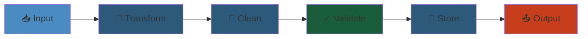

# 06 — DevOps & CI/CD

The intersection of development and operations—automating the build, test, deploy, and operate lifecycle. Covers infrastructure as code, CI/CD pipelines, configuration management, containerization, SRE practices, security integration (DevSecOps), and the cultural practices that enable rapid, reliable software delivery.

## Table of Contents

- [Infrastructure as Code](#infrastructure-as-code)
  - [Terraform / OpenTofu](#terraform--opentofu)
  - [Pulumi](#pulumi)
  - [AWS CDK](#aws-cdk)
  - [CloudFormation](#cloudformation)
  - [Crossplane](#crossplane)
- [CI/CD Pipelines](#cicd-pipelines)
  - [GitHub Actions](#github-actions)
  - [GitLab CI](#gitlab-ci)
  - [Jenkins](#jenkins)
  - [ArgoCD](#argocd)
  - [Other CI/CD Tools](#other-cicd-tools)
  - [Pipeline Patterns](#pipeline-patterns)
- [Configuration Management](#configuration-management)
  - [Ansible](#ansible)
  - [Puppet](#puppet)
  - [Chef](#chef)
  - [SaltStack](#saltstack)
- [Docker](#docker)
  - [Images & Dockerfiles](#images--dockerfiles)
  - [Docker Engine](#docker-engine)
  - [Compose & Multi-Container Apps](#compose--multi-container-apps)
  - [Best Practices](#best-practices)
- [SRE Practices](#sre-practices)
  - [Service Level Objectives](#service-level-objectives)
  - [Incident Management](#incident-management)
  - [Toil Automation](#toil-automation)
  - [Capacity Planning](#capacity-planning)
- [DevSecOps](#devsecops)
  - [Shift-Left Security](#shift-left-security)
  - [SAST / DAST / SCA](#sast--dast--sca)
  - [Container Security](#container-security)
  - [Secrets Management](#secrets-management)
  - [Compliance as Code](#compliance-as-code)
- [Learning Path](#learning-path)
- [Cross-References](#cross-references)

---

## Infrastructure as Code

The practice of managing infrastructure (networks, VMs, load balancers, databases) through machine-readable definition files, not manual processes.

### Terraform / OpenTofu

The dominant IaC tool. Declarative HCL, plan/apply workflow, state management.

- **Core Concepts** — HCL syntax, resources, data sources, providers, modules, state (local vs remote), backend, terraform init/plan/apply/destroy
- **State Management** — remote state (S3 + DynamoDB locking, Terraform Cloud, GCS, Azure Storage); state file contents, sensitive values, state migration
- **Modules** — input variables, outputs, local values; module registry, version constraints; composition patterns
- **Workspaces** — environment management; locals vs terraform.workspace
- **Expressions** — conditionals, for loops, splat, template strings, for_each vs count
- **Provisioners** — file, remote-exec, local-exec; last resort pattern
- **Providers** — AWS, GCP, Azure, Kubernetes, Helm, random, TLS, http; provider versioning, provider aliases
- **Testing** — terraform validate, fmt, tflint, checkov, tfsec, sentinel policies
- **OpenTofu** — fork of Terraform (v1.6+); fully open-source, backward compatible; state encryption (native), sorted outputs, more CLI-friendly plan

### Pulumi

Infrastructure as code in real programming languages (TypeScript, Python, Go, C#, Java, YAML).

- **Core** — same foundational concepts as Terraform (state, resources, providers) but express in native languages (loops, conditionals, functions)
- **State** — managed backend (Pulumi Cloud, self-managed S3/GCS/Azure Blob), stack references
- **Automation API** — embed IaC into applications (dynamic infrastructure, ephemeral environments)
- **Crosswalk** — AWS/GCP/Azure collections (high-level components that encapsulate best practices)

### AWS CDK

Define AWS infrastructure using TypeScript, Python, Java, C#, Go.

- **Constructs** — L1 (CloudFormation resources), L2 (curated with sensible defaults), L3 (patterns like Lambda REST API, EC2 VPC)
- **Core** — App, Stack, Environment; context, parameters, conditions, removal policy
- **Custom Resources** — Lambda-backed resources for missing CloudFormation coverage
- **CDK Pipelines** — self-mutating CI/CD pipelines using CodePipeline
- **cdk watch** — hotswap + deploy on file change (development speed)

### CloudFormation

AWS-native IaC (JSON/YAML). Declarative resource definitions.

- **Resources, Parameters, Mappings, Conditions, Outputs** — intrinsic functions (Fn::Join, Ref, GetAtt), pseudo parameters
- **Change Sets** — preview before apply
- **StackSets** — deploy across accounts/regions; self-managed vs service-managed
- **Nested Stacks** — compose stacks; custom resource backing
- **Drift Detection** — detect manual changes to resources
- **Service Catalog** — portfolio/products for approved infrastructure

### Crossplane

Kubernetes-native control plane for provisioning and managing cloud infrastructure.

- **Managed Resources** — represent cloud resources as K8s CRDs (RDSInstance, Bucket, VPC)
- **Composition** — compose multiple resources into a custom XR (Composite Resource)
- **Provider** — connects control plane to cloud APIs (AWS, GCP, Azure)
- **Claim Pattern** — developer claims an XR → Crossplane provisions + manages underlying resources
- **Composition Functions** — transform claims to composed resources

---

## CI/CD Pipelines

### GitHub Actions

CI/CD natively integrated with GitHub. YAML workflow definitions.

- **Workflows** — events (push, pull_request, schedule, workflow_dispatch), jobs, steps, actions
- **Actions** — marketplace (official + community), custom Docker container + JavaScript actions
- **Runners** — GitHub-hosted (Ubuntu, Windows, macOS, Arm) vs self-hosted (scale sets/EC2)
- **Matrix Builds** — run across OS/language version combinations
- **Artifacts** — upload/download; caching (dependency cache, action cache)
- **Secrets & Environments** — repository secrets, environment-level protection rules (required reviewers)
- **Composite Actions** — reusable multi-step action definitions
- **Deployments** — OIDC for cloud auth (no static creds), environment URLs, deployment protection rules

### GitLab CI

Built-in CI/CD for GitLab. `.gitlab-ci.yml` in repo root.

- **Pipelines** — stages, jobs, needs (DAG), rules, only/except, when, parallel
- **Runners** — shared, group, project; specific tags, autoscaling (Docker Machine, Kubernetes)
- **Cache & Artifacts** — dependency caching, pipeline artifacts between stages
- **Environment** — deployments, stop environments, rollback; dynamic environments (per-branch)
- **Protected Variables** — per-environment, maskable
- **Auto DevOps** — automatic pipeline generation (build, test, code quality, SAST, DAST, dependency scanning, license compliance)
- **Include** — reusing pipeline templates (local, project, remote, template)

### Jenkins

Extensible automation server. Declining adoption but still widespread in enterprise.

- **Pipelines** — Declarative (opinionated) vs Scripted (flexible Groovy); pipeline as code in Jenkinsfile
- **Agents** — master/agent architecture; static vs dynamic (Docker, Kubernetes), label-based matching
- **Shared Libraries** — reusable pipeline code in a central repo
- **Plugins** — 1000+ plugin ecosystem (Git, Docker, Kube, AWS, Slack, Jira)
- **Blue Ocean** — modern UX for pipeline visualization
- **Multi-branch Pipeline** — automatic pipeline per branch
- **Configuration as Code** — JCasC (Jenkins Configuration as Code) plugin for job definitions

### ArgoCD

GitOps deployment tool for Kubernetes. Syncs desired state from Git repo to cluster.

- **Applications** — source (Git repo path), destination (cluster + namespace), sync policy (manual, automated prune/self-heal)
- **Application Sets** — generators (list, git, clusters, SCM, pull request, matrix); template to create many apps
- **Sync Strategies** — hook-based (pre/post sync), wave ordering, sync windows (maintenance)
- **Health Assessment** — custom resource health via Lua scripts, resource customizations
- **SSO** — Dex, OIDC, GitHub, GitLab, Okta; RBAC
- **Notifications** — email, Slack, webhook; notification templates
- **Image Updater** — auto-update image tag in Git repo when new image is built
- **Rollback** — revert to previous sync by reapplying history

### Other CI/CD Tools

- **CircleCI** — fast, config validation, parallelism, orbs (reusable config packages)
- **Bitbucket Pipelines** — integrated with Bitbucket, deploy environments
- **Travis CI** — managed CI, open source free tier (declining adoption)
- **Buildkite** — hybrid model: your agents, their orchestration; high customization
- **Tekton** — Kubernetes-native CI/CD building blocks (Tasks, Pipelines, Triggers)

### Pipeline Patterns

- **Trunk-Based Development** — short-lived branches, merge often; no long-lived feature branches
- **Git Flow** — feature → develop → release → main (suitable for scheduled releases)
- **Release Branching** — main always deployable; release branches for stable versions
- **Deployment Strategies** — Rolling (in-place replace), Blue-Green (parallel), Canary (gradual), A/B (traffic splitting)
- **Manual Gates** — approval steps for production; environment protection rules
- **Artifact Promotion** — build once, promote through environments; artifact registry versioning

---

## Configuration Management

Tools for ensuring servers are in a desired state (packages, files, services, users).

### Ansible

Agentless, push-based, YAML playbooks. Most popular CM tool.

- **Architecture** — control node (Linux), managed nodes (any Python host); push via SSH, no agent
- **Playbooks** — YAML sequences of plays; plays contain tasks (modules), hosts pattern, variables, handlers
- **Modules** — core (package, copy, template, service, yum, apt, file, user, git, docker), custom, roles
- **Inventory** — static (INI/YAML), dynamic (cloud API queries), groups, host vars, group vars
- **Roles** — reusable, shareable (Ansible Galaxy); directory convention (tasks, handlers, templates, vars, defaults, meta)
- **Templates** — Jinja2 for dynamic file generation; conditional, loop, variable substitution
- **Ansible Vault** — encrypted variables/files within playbooks; edit/view/rekey
- **AWX / Tower** — Web UI, RBAC, REST API, job scheduling, inventory sync

### Puppet

Declarative, Ruby DSL (or YAML with Hiera), agent-based (pull model).

- **Architecture** — master (PUPPET Master) + agents; HTTPS-based communication; Puppet Server + Puppet DB
- **Manifests** — `.pp` files: resources (package, file, service, user, exec), classes, defined types, variables
- **Resource Abstraction** — providers abstract OS-specific implementations
- **Modules** — Forge modules; classes, defined types, templates (ERB/eRuby), facts, Hiera data
- **Facts** — system information collected by Facter (OS, IP, memory, etc.); custom facts
- **Hiera** — hierarchical data store; levels (common → environment → role → node); YAML/JSON backends
- **PuppetDB** — store collected data, queries (PQL), exported resources

### Chef

Ruby DSL, agent-based (pull). Recipes → Cookbooks → Roles.

- **Architecture** — Chef Server + Workstation (knife) + Nodes (chef-client); convergence model
- **Resources** — package, service, template, file, directory, execute; idempotent by design
- **Recipes** — policies (Ruby DSL); attributes, templates (ERB), files, libraries
- **Cookbooks** — collections of recipes + attributes + templates + files + metadata
- **Roles & Environments** — role-specific run lists; environment-specific attributes
- **Chef Solo** — run without Chef Server (local mode); Chef Infra Client for full server
- **Ohai** — system data collection (similar to Facter)

### SaltStack

Dual push/pull mode (hybrid). Python-based, master/minion architecture.

- **Architecture** — Salt Master + Minions (agents); ZeroMQ message bus, async
- **State Files** — YAML + Jinja2 (like Ansible); SLS files; states (pkg, file, service, user, cmd)
- **Execution Modules** — ad-hoc remote execution; grains (minion data), pillars (secure config data)
- **GitFS** — fileserver backend (states, pillars directly from Git)
- **Salt SSH** — agentless mode (SSH transport), no minion required
- **Salt Cloud** — provision instances from cloud APIs within Salt states

---

## Docker

### Images & Dockerfiles

- **Dockerfile** — instructions: FROM (base image), RUN (shell commands), COPY/ADD (files), ENV, ARG, WORKDIR, EXPOSE, CMD vs ENTRYPOINT, HEALTHCHECK, USER, VOLUME
- **Multi-stage Builds** — separate build (large image with tools) from runtime (minimal image); COPY --from=builder pattern
- **Layers** — build cache, layer ordering (least-changing first), layer size optimization; squash
- **Image Tagging** — semantic versioning, latest, git SHA; image digests for immutability
- **Base Images** — Alpine (small, musl libc), distroless (Google, minimal), slim variants; security scanning for CVEs
- **Registries** — Docker Hub (public), ECR, GCR, Artifact Registry, Harbor (private), Nexus, Quay

### Docker Engine

- **Architecture** — dockerd (server daemon), containerd (OCI runtime), runc (low-level container runtime); shim process
- **Container Isolation** — namespaces (pid, net, mount, ipc, uts, user, cgroup), cgroups (CPU, memory, I/O, PID limits)
- **Networking** — bridge (default, NAT), host (no isolation), overlay (multi-host), macvlan, ipvlan, none; port mapping, internal networks, DNS
- **Storage** — volumes (named, anonymous, bind mounts), tmpfs (in-memory); drivers: overlay2, devicemapper, aufs; volumes vs bind mounts
- **Logging** — json-file, journald, syslog, fluentd, awslogs, gcp, splunk; log rotation
- **Security** — rootless mode, seccomp (system call filtering), AppArmor, SELinux, Capabilities (dropping), read-only rootfs
- **Resource Constraints** — --memory/--memory-reservation, --cpus/--cpu-shares, --pids-limit, --blkio-weight

### Compose & Multi-Container Apps

- **docker-compose.yml** — services, networks, volumes, configs, secrets; environment variables, .env file
- **Profiles** — enable/disable services based on profile (dev, staging, production-like)
- **Healthchecks** — service health check, depends_on conditions, service links
- **Replicas** — scale services (simple replication within Compose)
- **Extends / Merge** — base compose file, override per environment (compose.override.yml vs compose.prod.yml)

### Best Practices

- **Minimal Base Images** — avoid full OS images; use distroless, Alpine, or scratch for Go binaries
- **Layer Caching** — order layers from least-to-most frequently changing; separate dependency install from app code
- **Non-Root User** — create and use non-root user inside container (USER directive)
- **Single Process per Container** — one concern per container; use init system (tini) for signal handling
- **Health Checks** — HEALTHCHECK instruction, liveness/readiness for orchestrators
- **Security Scanning** — Docker Scout, Trivy, Grype, Snyk; scan in CI, fail on critical/high CVEs

---

## SRE Practices

Site Reliability Engineering—applying software engineering to operations problems.

### Service Level Objectives

- **SLI (Service Level Indicator)** — measured metric (latency, error rate, throughput, availability, durability)
- **SLO (Service Level Objective)** — target range for SLI (e.g., 99.9% availability, p99 latency < 200ms)
- **SLA (Service Level Agreement)** — contractual commitment (often looser than SLO)
- **Error Budget** — 1 - SLO; allowed time/requests that can fail; burn rate alerts, budget exhaustion stops releases
- **Burn Rate Alerts** — page when error rate would exhaust budget in configured time (1h, 6h, 3d)

### Incident Management

- **Severity Levels** — Sev1 (critical/outage), Sev2 (major impairment), Sev3 (minor), Sev4 (cosmetic)
- **Incident Lifecycle** — Detect → Triage → Mitigate → Resolve → Postmortem
- **Incident Command System** — Incident Commander (IC), Operations Lead, Communications Lead, Scribe
- **Postmortems** — blameless, root cause analysis (5 Whys), action items, timelines
- **On-call** — schedules (follow-the-sun, primary-secondary), escalation paths, alert fatigue reduction

### Toil Automation

- **Toil Definition** — manual, repetitive, automatable, tactical, devoid of enduring value, scales linearly
- **Automation Targets** — deployment, incident response runbooks, backup/restore, user management, log analysis, capacity provisioning
- **Runbooks** — documented procedures; goals: reduce MTTR, enable less-experienced on-call; tools: PagerDuty, Opsgenie, FireHydrant

### Capacity Planning

- **Demand Forecasting** — historical growth + seasonality + planned launches
- **Load Testing** — k6, Locust, Gatling, JMeter; soak test, spike test, stress test
- **Resource Quota Management** — namespace quotas (K8s), account limits (cloud), soft/hard limits
- **Autoscaling** — predictive vs reactive; horizontal (add instances) vs vertical (bigger instance)

---

## DevSecOps

Integrating security into the DevOps lifecycle—shifting left, automating security checks.

### Shift-Left Security

- **Security in Design** — threat modeling before coding (STRIDE, PASTA)
- **Pre-commit Hooks** — detect secrets, large files, linting issues
- **CI Security Gates** — fail pipeline on critical/high findings (SAST, DAST, SCA, container scan)

### SAST / DAST / SCA

- **SAST (Static Application Security Testing)** — analyze source code for vulnerabilities (SQL injection, XSS, insecure crypto). Tools: SonarQube, Semgrep, Checkmarx, Fortify, CodeQL (GitHub)
- **DAST (Dynamic Application Security Testing)** — test running application (HTTP requests, fuzzing). Tools: OWASP ZAP, Burp Suite, Acunetix, HCL AppScan
- **SCA (Software Composition Analysis)** — identify open-source dependencies with known CVEs. Tools: Snyk, Dependabot, Renovate, Trivy, OWASP Dependency-Check, Black Duck
- **Secret Scanning** — detect hardcoded secrets (API keys, passwords, tokens). Tools: git-secrets, truffleHog, ggshield (GitGuardian), Gitleaks

### Container Security

- **Image Scanning** — scan for CVEs in base images and installed packages. Tools: Trivy, Grype, Docker Scout, Snyk, Anchore
- **Image Signing** — verify image origin and integrity (Cosign, Notary, Sigstore)
- **Runtime Security** — monitor container behavior; detect anomalies (Falco, Tracee, Sysdig Secure)
- **Policy Enforcement** — OPA/Gatekeeper, Kyverno (K8s admission); prohibit privileged containers, root user, host network

### Secrets Management

- **Tools** — HashiCorp Vault, AWS Secrets Manager, GCP Secret Manager, Azure Key Vault, SOPS, sealed-secrets, external-secrets-operator (K8s)
- **Rotation** — automatic rotation schedules, rotation via Lambda/Cloud Functions
- **Access** — fine-grained access policies, audit logging, dynamic secrets (Vault)
- **CI Secrets** — inject secrets at build/deploy time; never bake into images

### Compliance as Code

- **Policy as Code** — OPA (Rego), Sentinel (HashiCorp), Kyverno (K8s); automated policy checking in CI (terraform plan checks)
- **Compliance Frameworks** — CIS Benchmarks (K8s, Docker, Linux), PCI DSS, SOC 2, HIPAA, FedRAMP
- **Automated Auditing** — CloudTrail/Cloud Audit logging, config rules (AWS Config, GCP Policy Intelligence), drift detection
- **Infrastructure Compliance** — checkov, tfsec, cfn_nag; scan IaC templates before apply

---

## Learning Path

1. **Stage 1** — Linux fundamentals (processes, filesystem, networking), shell scripting, Git
2. **Stage 2** — Docker & containerization (Dockerfile, Compose, registry), CI pipelines (GitHub Actions/GitLab CI basics)
3. **Stage 3** — Infrastructure as Code (Terraform), configuration management (Ansible), CI/CD patterns (blue-green, canary)
4. **Stage 4** — Kubernetes, GitOps (ArgoCD), observability (Prometheus + Grafana), SRE practices (SLOs, error budgets)
5. **Stage 5** — DevSecOps (SAST/DAST/SCA integration), secret management, compliance as code, platform engineering (Backstage, Crossplane)

---

## Cross-References

| Domain | Connection |
|--------|-----------|
| [01 — AI/ML](../01-ai-ml/) | MLOps pipelines, model CI/CD, infrastructure for training/inference |
| [02 — Data Engineering](../02-data-engineering/) | Data pipeline CI/CD, IaC for data infrastructure, Airflow on K8s |
| [03 — Backend](../03-backend/) | Backend CI/CD, containerized deployment, environment parity |
| [05 — Cloud](../05-cloud/) | IaC targets (AWS/GCP/Azure), cloud CI/CD services (CodePipeline, Cloud Build), managed build services |
| [07 — Kubernetes](../07-kubernetes/) | Container orchestration, GitOps (ArgoCD), Helm, K8s-native CI (Tekton), K8s IaC |
| [08 — Databases](../08-databases/) | Database migration CI/CD, IaC for database instances, backup automation |
| [09 — Distributed Systems](../09-distributed-systems/) | Distributed CI/CD systems, deployment at scale, consensus for coordination |
| [10 — Messaging](../10-messaging/) | Event-driven CI/CD triggers, pipeline notification systems |
| [11 — Networking](../11-networking/) | Network IaC, TLS automation, DNS automation in pipelines |
| [14 — SRE/Observability](../14-sre-observability/) | Monitoring infrastructure, observability pipeline, alerting systems |
