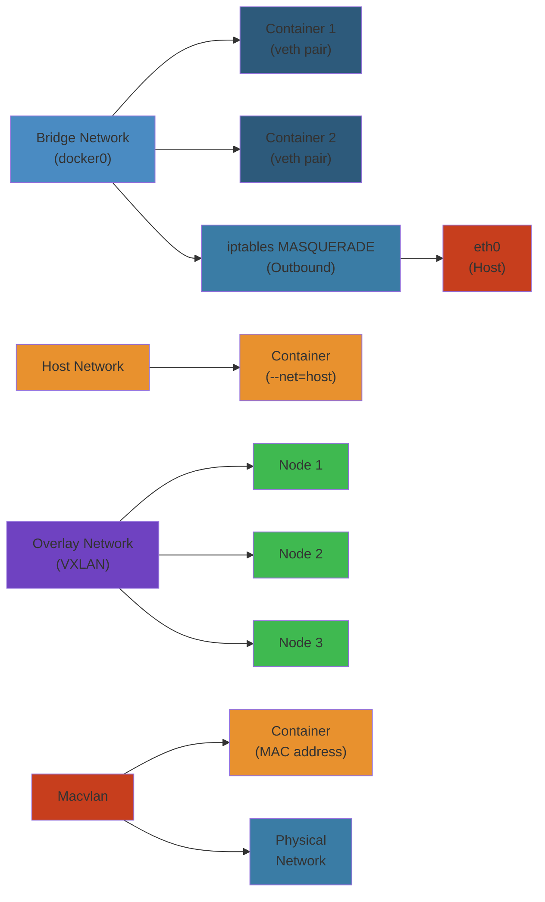

# 🌐 Docker Networking & Security — Complete Deep Dive

**Related**: [Docker Basics](/06-devops/docker/01-container-basics.md) · [Compose & Orchestration](/06-devops/docker/02-compose-orchestration.md) · [Production Operations](/06-devops/docker/04-docker-production-operations.md) · [Kubernetes Networking](/07-kubernetes/03-kubernetes-networking.md)

---




## Table of Contents


- [CNM / Libnetwork Model](#-cnm--libnetwork-model)
- [Bridge Network Deep Dive](#-bridge-network-deep-dive)
- [Host / None / Container Networking](#-host--none--container-networking)
- [Macvlan & Ipvlan](#-macvlan--ipvlan)
- [Overlay Networking (VXLAN)](#-overlay-networking-vxlan)
- [Network Plugins (Calico, Weave, Flannel)](#-network-plugins-calico-weave-flannel)
- [Ingress / Egress Traffic Control](#-ingress--egress-traffic-control)
- [Swarm Routing Mesh](#-swarm-routing-mesh)
- [Docker Security Fundamentals](#-docker-security-fundamentals)
- [Seccomp & AppArmor Profiles](#-seccomp--apparmor-profiles)
- [Capabilities & Read-Only Rootfs](#-capabilities--read-only-rootfs)
- [Docker Content Trust & Notary](#-docker-content-trust--notary)
- [Docker Secrets Management](#-docker-secrets-management)
- [Rootless Docker & User Namespace Remapping](#-rootless-docker--user-namespace-remapping)
- [gVisor vs Kata Containers](#-gvisor-vs-kata-containers)
- [Container Isolation Primitives (Namespaces)](#-container-isolation-primitives-namespaces)
- [Docker Bench Security](#-docker-bench-security)
- [Simplest Mental Model](#-simplest-mental-model)

---

## 🧭 CNM / Libnetwork Model


```text
Docker uses the Container Network Model (CNM) — libnetwork is the implementation.

  +-- Sandbox (namespace) ---+
  |   eth0 @ 172.17.0.2     |
  |   lo @ 127.0.0.1        |
  +--------------------------+
         |  veth pair
         |
  +-- Bridge (docker0) ------+
  |   172.17.0.0/16          |
  |   iptables MASQUERADE    |
  +--------------------------+
         |  eth0 (host)
         |
  [ Physical Network ]
```

| CNM Element | Description |
|---|---|
| **Sandbox** | Network namespace containing interfaces, routes, DNS config |
| **Endpoint** | veth pair — one end in sandbox, other on bridge |
| **Network** | Collection of endpoints with same bridging/switching rules |

Libnetwork drivers: `bridge`, `host`, `overlay`, `macvlan`, `ipvlan`, `none`, and 3rd-party plugins.

---

## 🔌 Bridge Network Deep Dive


### Default Bridge (docker0)


```text
  Container A          Container B
  eth0@vethA           eth0@vethB
    |                     |
  vethA---docker0---vethB
              |
        eth0 (host)
              |
        192.168.1.5
```

```bash
# Inspect default bridge
docker network inspect bridge
ip link show docker0
iptables -t nat -L -n  # POSTROUTING MASQUERADE
iptables -L -n         # FORWARD chain

# Container published ports create DNAT rules:
iptables -t nat -L DOCKER  # DNAT: host:8080 → container:80
```

### User-Defined Bridge


```bash
docker network create --driver bridge --subnet 10.5.0.0/16 --gateway 10.5.0.1 mynet
docker run --net mynet --ip 10.5.0.42 alpine
```

| Feature | Default Bridge | User Bridge |
|---|---|---|
| **DNS resolution** | By IP only (no --link) | Automatic name resolution |
| **Custom IP** | No | Yes |
| **Isolation** | All containers exposed | Controlled via attach/detach |
| **Links** | Deprecated links | Automatic resolution |

### iptables & NAT


```text
Outbound (container → internet):
  Container(172.17.0.2) --src--> docker0 --MASQUERADE--> eth0(HOST_IP:rand_port)

Inbound (internet → container port 8080):
  eth0:8080 --DNAT--> docker0:172.17.0.2:80

  Rules live in:
    -t nat: PREROUTING (DNAT), POSTROUTING (MASQUERADE)
    -t filter: FORWARD (inter-container)
```

```bash
# Block inter-container communication
docker network create --internal isolated
iptables -I FORWARD -i docker0 -o docker0 -j DROP
```

---

## 🏠 Host / None / Container Networking


### Host Mode


```dockerfile
docker run --net host nginx  # Shares host namespace, no isolation
```
```text
  Container          Host
  ─────────          ─────────
  skips sandbox → shares eth0, lo, iptables
  No bridge, no veth, no NAT — lowest latency
  Use case: performance-sensitive workloads, daemonsets
```

### None Mode


```dockerfile
docker run --net none alpine  # Only loopback
```
```text
  Container has only lo (127.0.0.1)
  No external connectivity
  Use case: security sandbox, offline computation
```

### Container Mode


```dockerfile
docker run --net container:other-container alpine
```
```text
  Container shares network stack (eth0, lo, ports) with another.
  Use case: sidecar proxy sharing loopback with app container.
  Equivalent to Kubernetes pod shared network namespace.
```

---

## 🏷️ Macvlan & Ipvlan


### Macvlan


```text
Host eth0 (192.168.1.0/24)
  ├── macvlan-sub1 ── Container A (192.168.1.10, MAC: aa:bb:cc:01)
  ├── macvlan-sub2 ── Container B (192.168.1.11, MAC: aa:bb:cc:02)
  └── macvlan-sub3 ── Container C (192.168.1.12, MAC: aa:bb:cc:03)

Each container gets its own MAC on the physical network.
The switch sees each container as a separate host.
```

```bash
docker network create -d macvlan \
  --subnet=192.168.1.0/24 \
  --gateway=192.168.1.1 \
  -o parent=eth0 my-macvlan
```

**Limitation**: Host cannot communicate with containers on same macvlan bridge (needs sub-interface).

### Ipvlan (L2 / L3)


```text
Host eth0
  └── ipvlan ── Container A (192.168.1.10, same MAC)
              └ Container B (192.168.1.11, same MAC)
              └ Container C (192.168.1.12, same MAC)

All containers share host MAC. Switch sees one MAC.
L3 mode: each container gets a different subnet, host routes between them.
```

```bash
docker network create -d ipvlan \
  --subnet=192.168.1.0/24 \
  -o parent=eth0 \
  -o ipvlan_mode=l2 my-ipvlan
```

---

## 🌉 Overlay Networking (VXLAN)


```text
  Host A                         Host B
┌──────────┐                  ┌──────────┐
│ Container │                 │ Container │
│ 10.0.0.2  │                 │ 10.0.0.3  │
└────┬─────┘                  └────┬─────┘
     │ veth                        │ veth
┌────┴─────┐                  ┌────┴─────┐
│ docker_g │                  │ docker_g │
│ bridge   │                  │ bridge   │
└────┬─────┘                  └────┬─────┘
     │ VXLAN tunnel (UDP 4789)     │
┌────┴─────┐                  ┌────┴─────┐
│ eth0     │                  │ eth0     │
│ 192.168 │                  │ 192.168  │
└──────────┘                  └──────────┘
     ╲                            ╱
      ╲══════════════════════════╱
          Underlay (physical net)
```

```bash
# Initialize Swarm (enables overlay)
docker swarm init --advertise-addr 192.168.1.10

# Create overlay network
docker network create -d overlay --attachable my-overlay
```

### VXLAN Encapsulation


```text
Original Packet:
  [ Eth | IP | TCP | Payload ]

VXLAN Encapsulated:
  [ Outer Eth | Outer IP (UDP 4789) | VXLAN (24-bit VNI) | Inner Eth | Inner IP | TCP | Payload ]

VNI = VXLAN Network Identifier (24-bit = 16M networks)
```

### Gossip Protocol


```text
  ┌─────┐          ┌─────┐
  │Node1│◄────────►│Node2│
  └──┬──┘          └──┬──┘
     │                 │
     │◄───────────────►│
  ┌──┴──┐          ┌──┴──┐
  │Node3│          │Node4│
  └─────┘          └─────┘

- SWIM gossip protocol (Scalable Weakly-consistent Infection-style)
- Serf + memberlist for cluster membership
- Convergence: O(log N) rounds
- Failure detection: indirect probing via random peers
```

---

## 🔌 Network Plugins (Calico, Weave, Flannel)


| Plugin | Model | Encryption | Network Policy | Best For |
|---|---|---|---|---|
| **Flannel** | VXLAN / host-gw | No | No (needs Calico) | Simplicity |
| **Calico** | BGP (no overlay) | WireGuard | Yes (k8s NetworkPolicy) | Performance + policy |
| **Weave** | VXLAN + fastpath | Yes (NaCl) | Yes | Simplicity + encryption |
| **Cilium** | eBPF | WireGuard / IPSec | Yes (L3-L7) | Performance + API-aware |

```bash
# Flannel (basic overlay)
flanneld --iface=eth0 --etcd-endpoints=http://127.0.0.1:4001

# Calico (BGP peering)
calicoctl node status
calicoctl get ipPool -o yaml
```

---

## 🚦 Ingress / Egress Traffic Control


### Ingress Traffic


```text
  Internet ──► Host:8080 ──DNAT──► docker0 ──► Container:80

  iptables -A PREROUTING -t nat -p tcp --dport 8080 -j DNAT --to-destination 172.17.0.2:80
  iptables -A FORWARD -p tcp -d 172.17.0.2 --dport 80 -j ACCEPT
```

### Egress Traffic


```text
  Container:80 ──► docker0 ──MASQUERADE──► Host:random_port ──► Internet

  iptables -t nat -A POSTROUTING -s 172.17.0.0/16 ! -o docker0 -j MASQUERADE
```

---

## 🔄 Swarm Routing Mesh


```text
  ┌──────────┐       ┌──────────┐       ┌──────────┐
  │ Host A   │       │ Host B   │       │ Host C   │
  │ ┌──────┐ │       │ ┌──────┐ │       │ ┌──────┐ │
  │ │nginx │ │       │ │nginx │ │       │       │ │
  │ └──:80─┘ │       │ └──:80─┘ │       │       │ │
  │          │       │          │       │          │
  └──────────┘       └──────────┘       └──────────┘
         │                  │                  │
    ─────┴──────────────────┴──────────────────┴────── LB (IPVS)

  Any node:80 → any container:80 on any node
  Uses IPVS to load-balance across overlay
```

```bash
# Swarm service with routing mesh
docker service create --name web --publish 80:80 nginx

# Bypass routing mesh (direct host access only)
docker service create --name web --publish mode=host,target=80,published=80 nginx
```

---

## 🛡️ Docker Security Fundamentals


### Security Layers


```text
  ┌─────────────────────────────────────┐
  │          Docker Content Trust       │  Image signing
  ├─────────────────────────────────────┤
  │      Seccomp / AppArmor Profile     │  Syscall filtering
  ├─────────────────────────────────────┤
  │     Capability Dropping (--cap-drop)│  Kernel capability pruning
  ├─────────────────────────────────────┤
  │        Read-only Rootfs             │  Filesystem protection
  ├─────────────────────────────────────┤
  │    User Namespace Remapping         │  UID/GID isolation
  ├─────────────────────────────────────┤
  │       Namespace Isolation           │  pid,net,mnt,uts,ipc,user,cgroup,time
  ├─────────────────────────────────────┤
  │   cgroups v2 Resource Control       │  CPU, memory, IO limits
  └─────────────────────────────────────┘
```

```bash
# Run a container with minimum privileges
docker run --rm \
  --read-only \
  --tmpfs /tmp \
  --cap-drop=ALL \
  --cap-add=NET_BIND_SERVICE \
  --security-opt=no-new-privileges:true \
  --security-opt=seccomp=default.json \
  --user 1000:1000 \
  nginx
```

---

## 🔒 Seccomp & AppArmor Profiles


### Seccomp (Secure Computing Mode)


```text
Default Docker seccomp profile blocks ~44 syscalls out of ~300+
(e.g., mount, kexec_load, swapon, bpf, ptrace, perf_event_open)

docker run --security-opt seccomp:/path/to/profile.json
```

```json
{
  "defaultAction": "SCMP_ACT_ERRNO",
  "architectures": ["SCMP_ARCH_X86_64"],
  "syscalls": [
    {
      "names": ["accept", "read", "write", "open", "close", "stat", "mmap"],
      "action": "SCMP_ACT_ALLOW"
    }
  ]
}
```

```bash
# Check current seccomp
docker inspect --format '{{.HostConfig.SecurityOpt}}' container-name

# Whitelist mode (default), blacklist mode (--privileged)
docker run --privileged  # Disables seccomp completely
```

### AppArmor (MAC)


```text
AppArmor is a Mandatory Access Control (MAC) system — path-based.
Docker applies a default profile: docker-default.

  docker run --security-opt apparmor=my-custom-profile
```

```
# /etc/apparmor.d/docker-custom
#include <tunables/global>

profile docker-custom flags=(attach_disconnected) {
  #include <abstractions/base>

  network inet tcp,
  network inet udp,

  /usr/sbin/nginx r,
  /var/log/nginx/** rw,
  /etc/nginx/** r,

  deny /etc/shadow r,
  deny /root/** rw,
}
```

```bash
# Load profile
apparmor_parser -r /etc/apparmor.d/docker-custom
# Run with profile
docker run --security-opt apparmor=docker-custom nginx
```

---

## 🎯 Capabilities & Read-Only Rootfs


### Capability Dropping


```text
Linux kernel capabilities break ALL privileges (~40 capabilities) into granular units:

  CAP_CHOWN, CAP_NET_BIND_SERVICE, CAP_SYS_ADMIN, CAP_SYS_PTRACE, ...

Default Docker: grants ~40 capabilities (like a normal root user)
Best practice: drop ALL, add only what's needed.
```

```bash
# Minimal web server
docker run --cap-drop=ALL --cap-add=NET_BIND_SERVICE nginx

# Database container
docker run --cap-drop=ALL --cap-add=SETGID,SETUID,DAC_OVERRIDE postgres

# What capabilities does this container have?
docker run --rm -it alpine getpcaps 1
```

### Read-Only Rootfs


```bash
docker run --read-only --tmpfs /var/run --tmpfs /tmp nginx

# --read-only prevents writes to / (except tmpfs mounts)
# All writes go to tmpfs (volatile) or named volumes
```

Common patterns:
```bash
# Stack tmpfs+volume for writable paths
docker run --read-only \
  -v app-data:/var/lib/app \
  --tmpfs /tmp:noexec,nosuid,size=64M \
  myapp
```

---

## 📝 Docker Content Trust & Notary


```bash
# Enable DCT — all push/pull must be signed
export DOCKER_CONTENT_TRUST=1

# Push signed image
docker push myrepo/app:latest

# Sign without DCT env
docker trust sign myrepo/app:latest
```

```text
┌──────────┐     ┌───────────┐     ┌──────────┐
│ Developer│────►│ Notary    │◄────│ Docker   │
│ (key)    │     │ Server    │     │ Client   │
└──────────┘     └───────────┘     └──────────┘
                     │
               ┌─────┴─────┐
               │ TUF Metadata │
               │ (root, targets│
               │  snapshot,    │
               │  timestamp)   │
               └───────────────┘

TUF (The Update Framework):
- Root key: offline, HSM, rare use
- Target key: signs image tags
- Snapshot + timestamp keys: auto-rotated
```

```bash
# Key management
docker trust key generate alice
docker trust signer add --key alice.pub myrepo alice
docker trust inspect --pretty myrepo/app:latest
```

---

## 🔐 Docker Secrets Management


```bash
# Swarm mode only for native secrets
echo "db_password_123" | docker secret create db_pass v1

# Mount secret into service
docker service create \
  --secret source=db_pass,target=/run/secrets/db_pass,uid=1000,gid=1000,mode=0400 \
  myapp
```

```yaml
# docker-compose (Swarm mode)
version: "3.9"
services:
  web:
    image: myapp
    secrets:
      - db_pass

secrets:
  db_pass:
    external: true
```

```text
┌─────────┐
│ Manager │── encrypts secret ──► Raft log (encrypted at rest)
└────┬────┘
     │ decrypts & mounts on schedule
     ▼
┌─────────┐
│ Worker  │── /run/secrets/db_pass (tmpfs, in-memory)
└─────────┘
```

---

## 👤 Rootless Docker & User Namespace Remapping


### Rootless Docker


```text
┌─ Container ─┐          ┌─ Host ─────────────┐
│  root (0)   │          │  dockremap user     │
│  process    │  remap   │  (UID 100000)       │
│             │─────────►│                     │
│  uid 1000   │          │  UID 101000         │
└─────────────┘          └─────────────────────┘

User namespace remapping:
  dockerd --userns-remap=default
  Container root → host dockremap (usually UID 65536+)
```

```bash
# Enable user namespace remapping
echo '{"userns-remap":"default"}' > /etc/docker/daemon.json
systemctl restart docker

# Rootless mode (no root daemon at all)
dockerd-rootless-setuptool.sh install
export DOCKER_HOST=unix:///run/user/$UID/docker.sock
```

### Caveats


```text
- Cannot share namespaces (--net=host, --pid=host) with host
- --privileged is ignored
- May break volume mount permissions (UID shifted)
- Some storage drivers not supported (devicemapper)
```

---

## 🏖️ gVisor vs Kata Containers


```text
                  ┌─────────────────────────────────────────┐
                  │        Traditional Docker               │
                  │  Container ── syscall ──► Linux Kernel  │
                  └─────────────────────────────────────────┘

                  ┌─────────────────────────────────────────┐
                  │        gVisor (runsc)                   │
                  │  Container ── syscall ──► Sentry (Go)   │
                  │  Sentry ── host syscall ──► Linux Kernel│
                  │  2nd syscall boundary, ~50% perf loss   │
                  └─────────────────────────────────────────┘

                  ┌─────────────────────────────────────────┐
                  │        Kata Containers                  │
                  │  Container ──► Lightweight VM (QEMU/Firecracker) │
                  │  Each container = its own kernel         │
                  │  ~95% isolation of VM, ~70% of native    │
                  └─────────────────────────────────────────┘
```

| Feature | gVisor (runsc) | Kata Containers | Traditional Docker |
|---|---|---|---|
| **Isolation** | Application sandbox | Hardware VM | Namespace/cgroup |
| **Attack surface** | ~200 syscalls | Complete kernel | Full kernel |
| **Perf overhead** | ~50-70% | ~10-30% | ~0-3% |
| **Compatibility** | High (not complete) | Near-native | Native |

---

## 📦 Container Isolation Primitives (Namespaces)


```text
Linux namespaces — the 8 pillars of container isolation:

  ┌─────────────────────────────────────────────────────┐
  │                    Container                        │
  │  ┌──────┐ ┌──────┐ ┌──────┐ ┌──────┐ ┌──────┐     │
  │  │ pid  │ │ net  │ │ mnt  │ │ uts  │ │ ipc  │     │
  │  └──────┘ └──────┘ └──────┘ └──────┘ └──────┘     │
  │  ┌──────┐ ┌──────┐ ┌──────┐                        │
  │  │ user │ │ cgroup│ │ time │                        │
  │  └──────┘ └──────┘ └──────┘                        │
  └─────────────────────────────────────────────────────┘
```

| Namespace | Isolates | Created By |
|---|---|---|
| **pid** | Process IDs | `CLONE_NEWPID` — container sees only its PID tree |
| **net** | Network stack (interfaces, routes, iptables) | `CLONE_NEWNET` |
| **mnt** | Mount points (filesystem tree) | `CLONE_NEWNS` |
| **uts** | Hostname, domain name | `CLONE_NEWUTS` |
| **ipc** | System V IPC, POSIX message queues | `CLONE_NEWIPC` |
| **user** | UID/GID mapping (remap root) | `CLONE_NEWUSER` |
| **cgroup** | Cgroup root directory | `CLONE_NEWCGROUP` (since Linux 4.6) |
| **time** | System time (CLOCK_MONOTONIC, CLOCK_BOOTTIME) | `CLONE_NEWTIME` (since Linux 5.6) |

```bash
# Inspect namespaces of a running container
PID=$(docker inspect -f '{{.State.Pid}}' container_name)
ls -la /proc/$PID/ns/

# Enter container network namespace
nsenter -t $PID -n ip addr
```

---

## 🛡️ Docker Bench Security


```bash
# Run the security audit
docker run --rm --net host --pid host \
  -v /etc:/etc \
  -v /var:/var \
  -v $(which docker):/usr/bin/docker \
  docker/docker-bench-security
```

```text
Checks organized in sections:
  [1] Host Configuration
  [2] Docker Daemon Configuration
  [3] Container Images & Build
  [4] Container Runtime
  [5] Docker Security Operations
  [6] Docker Swarm Configuration
  [7] Community Benchmarks

Sample findings:
  [WARN] 1.1.1 - Ensure docker.service file ownership is set to root:root
  [PASS] 4.1 - Ensure container user is non-root
```

### Visual: Docker Network & Security Layers

```mermaid
graph TD
    Container["Container A<br/>eth0"] -->|Bridge| Bridge["Bridge Network<br/>docker0"]
    Bridge -->|IP Routes| Host["Host Network<br/>Stack"]
    Host -->|iptables| Rules["NAT Rules<br/>Port Mapping"]
    Rules -->|External| Internet["External Network<br/>Internet"]
    
    Container -->|Seccomp| Syscall["Syscall Filter<br/>Deny dangerous calls"]
    Container -->|Capabilities| Cap["Capabilities<br/>Drop CAP_NET_ADMIN"]
    Container -->|AppArmor| AppArmor["AppArmor Profile<br/>File restrictions"]
    Syscall -->|Restrict| Kernel["Linux Kernel"]
    Cap -->|Restrict| Kernel
    AppArmor -->|Restrict| Kernel
    
    Container -->|Namespaces| NS["Namespaces"]
    NS -->|PID| PidNS["PID Namespace<br/>Isolated processes"]
    NS -->|NET| NetNS["NET Namespace<br/>Isolated stack"]
    NS -->|Mount| MountNS["Mount Namespace<br/>Isolated filesystem"]
    NS -->|UTS| UtsNS["UTS Namespace<br/>Isolated hostname"]
    
    Container -->|Read-Only| RO["Read-Only Filesystem<br/>/tmp volume"]
    RO -->|Immutable| Safe["Safe Execution"]
    
    style Container fill:#5f1e1e,stroke:#ef4444
    style Bridge fill:#3a7ca5,stroke:#00d4ff
    style Host fill:#3a7ca5,stroke:#00d4ff
    style Rules fill:#3a7ca5,stroke:#00d4ff
    style Internet fill:#3a7ca5,stroke:#00d4ff
    style Syscall fill:#1e5f3f,stroke:#34d399
    style Cap fill:#1e5f3f,stroke:#34d399
    style AppArmor fill:#1e5f3f,stroke:#34d399
    style Kernel fill:#1e3a5f,stroke:#00d4ff
    style NS fill:#3a7ca5,stroke:#00d4ff
    style PidNS fill:#1e5f3f,stroke:#34d399
    style NetNS fill:#1e5f3f,stroke:#34d399
    style MountNS fill:#1e5f3f,stroke:#34d399
    style UtsNS fill:#1e5f3f,stroke:#34d399
    style RO fill:#1e5f3f,stroke:#34d399
    style Safe fill:#1e5f3f,stroke:#34d399
```



---

## 🧠 Simplest Mental Model


```text
┌──────────────────────────────────────────────────────────────────┐
│                                                                   │
│   Docker Networking = Plumbing between containers + the world    │
│                                                                   │
│   Bridge   = virtual switch for containers on same host           │
│   Overlay  = virtual switch across hosts (via VXLAN tunnel)       │
│   Host     = container uses host's network directly (no pipe)     │
│   Macvlan  = container gets its own MAC on physical LAN           │
│                                                                   │
│   Docker Security = Minimizing trust in the container             │
│                                                                   │
│   Capabilities = root's superpowers, drop all, add only needed   │
│   Seccomp     = block dangerous syscalls (deny safe approach)    │
│   AppArmor    = file path permissions for container               │
│   Read-only   = container filesystem never writable               │
│   Namespaces  = walls between container and host                  │
│                                                                   │
└──────────────────────────────────────────────────────────────────┘
```


## Practical Example


See code examples above for practical usage patterns.