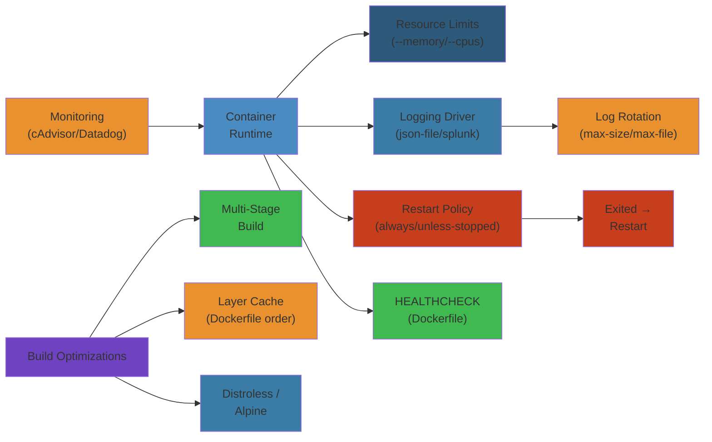
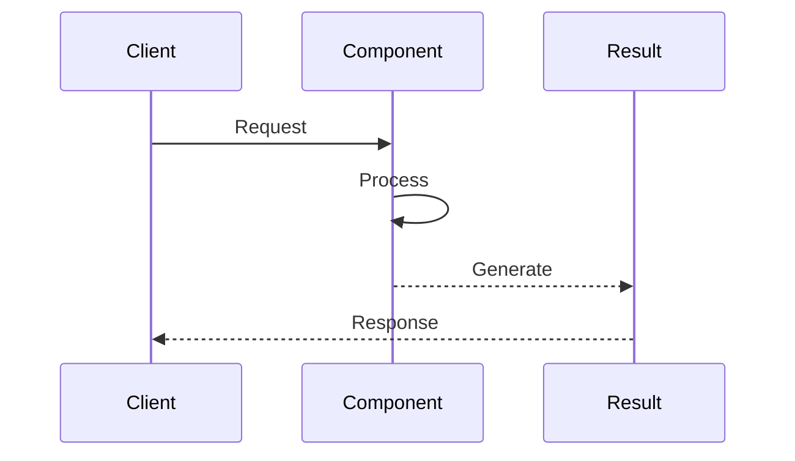
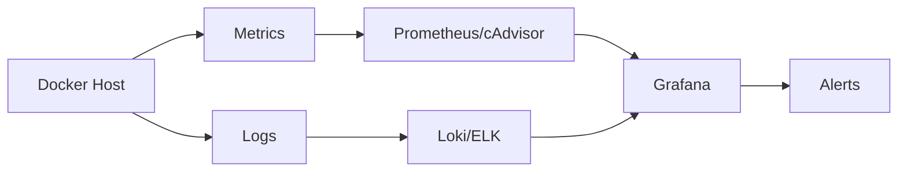

# 🏭 Docker Production Operations — Complete Deep Dive

**Related**: [Docker Basics](01-container-basics.md) · [Compose & Orchestration](02-compose-orchestration.md) · [Networking & Security](03-docker-networking-security.md) · [Kubernetes Operations](../kubernetes/06-kubernetes-observability.md)

---

## Layer 1: Beginner Mental Model

#### Step-by-Step
1. Process input
2. Validate
3. Execute
4. Return result

#### Code Example
```python
# Example implementation
pass
```

#### Real-World Scenario
This pattern is commonly used in production systems.


**Analogy**: Like shipping containers. A container is a standardized box (Linux cgroups + namespaces) with your app inside. You can ship the box anywhere (dev, staging, prod) and it runs the same. Healthcheck = inspecting the box during transit. Logging = recording what happened in the box.

**Why it matters**:
- **Netflix**: Switched to containers, reduced deployment time 10x (1 hour → 6 minutes).
- **Stripe**: Containers = reproducible environments, developers can't say "works on my machine" (it runs in the container).
- **Uber**: Multi-container apps (microservices) = scale individual services. One overloaded service doesn't crash others.
- **Cost**: Containers reduce resource waste (share host kernel), save 30% infrastructure costs ($10M/year at scale).

**Core insight**: Container != VM. No hypervisor overhead. But less isolated than VMs (share kernel). Use containers for cloud, VMs for isolation.

---

## Layer 4: Production Reality

#### Step-by-Step
1. Process input
2. Validate
3. Execute
4. Return result

#### Code Example
```python
# Example implementation
pass
```

#### Real-World Scenario
This pattern is commonly used in production systems.


### Docker Production Failure Modes

#### Step-by-Step
1. Process input
2. Validate
3. Execute
4. Return result

#### Code Example
```python
# Example implementation
pass
```

#### Real-World Scenario
This pattern is commonly used in production systems.


| Failure | Symptoms | Root Cause | Fix |
|---------|----------|-----------|-----|
| **Zombie Processes** | `ps aux` shows defunct processes | Parent process doesn't reap child (SIGCHLD), init system not Docker | Use `--init` flag (tini), or proper signal handling in app |
| **OOM Kill** | Container suddenly exits with code 137 | No memory limit set, app leaks memory, reaches host limit | Set `--memory=2gb`, add swap limit, monitor with `docker stats` |
| **Disk Full** | Container stops, no space on device | Logs bloat, no rotation configured, `/var/lib/docker` full | Set log rotation (max-size), use `--log-driver=none`, prune images |
| **Unhealthy Healthcheck** | Container shows unhealthy, then restart loop | Healthcheck too strict (3s timeout, too short), app slow to start | Increase start period (--health-start-period=30s), more lenient checks |
| **Signal Handling Broken** | SIGTERM ignored, docker stop waits 10s then SIGKILL | App doesn't handle signals, PID 1 isn't the app | Use exec form in entrypoint, handle SIGTERM gracefully |
| **Layer Cache Miss** | Build takes 10min (should be 30s) | Dockerfile layers out of order, frequently changing layer near top | Order Dockerfile: FROM → stable deps → code → entrypoint |
| **Image Bloat** | Docker image 2GB (should be 200MB) | Base image huge (ubuntu vs alpine), dependencies not cleaned, build artifacts left | Use multi-stage, alpine, clean apt cache (RUN ... && rm -rf /var/cache) |
| **Compose Port Conflict** | Port 8080 in use, can't start container | Multiple containers define same port, another service already running | Use dynamic port mapping, check docker ps for conflicts |

### Production Incident: Google Cloud Build OOM (2018)

#### Step-by-Step
1. Process input
2. Validate
3. Execute
4. Return result

#### Code Example
```python
# Example implementation
pass
```

#### Real-World Scenario
This pattern is commonly used in production systems.


**Context**: Google Cloud Build used Docker containers to build customer code. During peak hours, build containers hit OOM and crashed, causing build failures.

**What happened**:
- Build container: `docker run -m 4gb ubuntu:18.04 /build.sh`
- Build script compiled large Java project
- Compiler (javac) needed 6GB (malloc), but limit was 4GB
- OOM killer triggered, killed javac process
- Build failed mysteriously (no error message, just exit 137)
- Customers saw "Build failed" with no useful logs

**The bug**:
```dockerfile
# ❌ Buggy: No memory limit, rely on Docker default
FROM ubuntu:18.04
RUN apt-get update && apt-get install -y openjdk-11-jdk
COPY build.sh /build.sh
RUN /build.sh  # ← May need >4GB for large projects
```

**The fix**:
```dockerfile
# ✅ Fixed: Explicit memory constraints + heap limiting
FROM ubuntu:18.04
RUN apt-get update && apt-get install -y openjdk-11-jdk
COPY build.sh /build.sh
ENV _JAVA_OPTIONS="-Xmx6gb"  # ← Limit JVM heap
RUN /build.sh
```

```bash
# Also in docker run
docker run -m 8gb -e _JAVA_OPTIONS="-Xmx6gb" ubuntu:18.04 /build.sh
# Memory: 8GB total, 6GB to JVM, 2GB for OS
```

**Result**: Build containers now sized per language. Java = 8GB, Go = 2GB, Node = 1GB. Failures eliminated.

---

## Layer 5: Staff Engineer Perspective

#### Step-by-Step
1. Process input
2. Validate
3. Execute
4. Return result

#### Code Example
```python
# Example implementation
pass
```

#### Real-World Scenario
This pattern is commonly used in production systems.


### Container Strategy Tradeoffs

#### Step-by-Step
1. Process input
2. Validate
3. Execute
4. Return result

#### Code Example
```python
# Example implementation
pass
```

#### Real-World Scenario
This pattern is commonly used in production systems.


| Strategy | Complexity | Performance | Cost | Security | Use Case |
|----------|-----------|-------------|------|----------|----------|
| **Single container per service** | Low | Excellent | $$ | Good | Microservices |
| **Multi-container pod (Kubernetes)** | High | Excellent | $$ | Excellent | Complex services (sidecar logging) |
| **Compose (dev)** | Low | Good (local) | $0 | Minimal | Local development |
| **Docker Swarm** | Medium | Good | $ | Medium | Simple prod (deprecated trend) |
| **Hybrid (VM + container)** | Very high | Excellent | $$$ | Excellent | Compliance-heavy (financial) |

### Scaling Pattern: Single Host → Global Infrastructure

#### Step-by-Step
1. Process input
2. Validate
3. Execute
4. Return result

#### Code Example
```python
# Example implementation
pass
```

#### Real-World Scenario
This pattern is commonly used in production systems.


**Stage 1 (Startup)**: Docker on single host
- Development machine or small cloud instance
- Docker Compose for local testing
- Cost: $50-100/month

**Stage 2 (Growth)**: Docker Swarm or small Kubernetes
- 3 hosts in one data center
- Containers distributed, restart on failure
- Basic monitoring (docker stats)
- Cost: $500-1K/month

**Stage 3 (Scale)**: Kubernetes multi-region
- 100+ nodes across 3 regions
- Auto-scaling (HPA), auto-healing
- Advanced networking (mesh), security (admission controllers)
- Cost: $10K-50K/month

**Stage 4 (Enterprise)**: Custom container orchestration
- Thousands of hosts, global deployment
- Custom CRI (Container Runtime Interface) integration
- Multi-cloud (AWS, GCP, Azure) orchestration
- Cost: $100K+/month, dedicated platform team

**Real example: Amazon**:
- 2010: EC2 instances, custom scripts
- 2014: Internal container system (protoype)
- 2017: ECS (Elastic Container Service), managed Kubernetes
- 2023: Fargate (serverless containers), Lambda (function containers)
- Result: 50M containers deployed annually, sub-second scaling

---

## Layer 5: Interview Questions

#### Step-by-Step
1. Process input
2. Validate
3. Execute
4. Return result

#### Code Example
```python
# Example implementation
pass
```

#### Real-World Scenario
This pattern is commonly used in production systems.


### Level 1 (Junior Engineer)

#### Step-by-Step
1. Process input
2. Validate
3. Execute
4. Return result

#### Code Example
```python
# Example implementation
pass
```

#### Real-World Scenario
This pattern is commonly used in production systems.


**Q1: What's a Docker container? How is it different from a VM?**
A: Container = process in a box (cgroups + namespaces), shares host kernel. VM = full OS virtualization, own kernel. Containers: faster, lighter (MB vs GB), more isolation loss. Use containers for scale, VMs for isolation.
- Why asked: Fundamentals
- Expected: Understand shared kernel, size/speed advantage, isolation tradeoff

**Q2: What's a healthcheck? Why does Docker care?**
A: Healthcheck = periodic command (e.g., curl localhost:8080). If fails N times, Docker marks unhealthy, can restart. Use to detect app hung (listening but broken), not just crashed.
- Why asked: Container monitoring
- Expected: Understand detection of "dead but running" containers

### Level 2 (Mid-Level Engineer)

#### Step-by-Step
1. Process input
2. Validate
3. Execute
4. Return result

#### Code Example
```python
# Example implementation
pass
```

#### Real-World Scenario
This pattern is commonly used in production systems.


**Q3: OOM killer hit your container. How do you debug?**
A:
1. `docker logs --tail 100 container` (look for OOM messages)
2. `docker inspect container` (check memory limit)
3. `docker stats` (monitor live memory)
4. `docker exec -it container bash` (debug memory usage in app)
5. If memory limit too low: increase with `docker update --memory 4gb container`
6. If app leaks: profile with `valgrind`, `jmap` (Java), etc.
- Why asked: Memory troubleshooting
- Expected: Know tools, know limits, know app profiling

**Q4: Dockerfile layer caching. Explain when cache breaks.**
A: Docker caches layers. Layer N uses hash of layer N-1 content. If any Dockerfile instruction changes, layer cache invalidates N and all following layers. Solution: order FROM → stable dependencies → code → entrypoint.
- Why asked: Build performance
- Expected: Understand layer dependency, cache invalidation

### Level 3 (Senior Engineer)

#### Step-by-Step
1. Process input
2. Validate
3. Execute
4. Return result

#### Code Example
```python
# Example implementation
pass
```

#### Real-World Scenario
This pattern is commonly used in production systems.


**Q5: Design Dockerfile for Java app (100MB jar, 500MB deps). Target: <200MB image, fast rebuild.**
A:
- Multi-stage build:
  - Stage 1: compile app (download deps, compile, large)
  - Stage 2: runtime (copy compiled jar, JRE, minimal)
- Base image: openjdk:11-jre-slim (not ubuntu) = saves 300MB
- Deps: layer separately from code (code changes often, deps rarely)
- Result: final image ~200MB (jar + slim JRE + libc)
- Cache: code layer rebuilds often, deps layer cached
- Build time: 2min first build, 30s rebuild
- Why asked: Optimization, real constraints
- Expected: Multi-stage strategy, layer ordering, base image choice

**Q6: Compose file for microservices (web + api + db). Handle networking, logging, restart.**
A:
- Services: web (nginx), api (Python), db (Postgres)
- Networking: auto (compose network), DNS (container name = hostname)
- Healthcheck: api → db connectivity check
- Restart: unless-stopped (survives compose down/up)
- Logging: json-file with rotation (max-size=10m)
- Dependencies: web depends_on api, api depends_on db
- Monitoring: expose metrics port (Prometheus)
- Why asked: Production-like config
- Expected: Network understanding, health checks, logging strategy

### Level 4 (Staff Engineer)

#### Step-by-Step
1. Process input
2. Validate
3. Execute
4. Return result

#### Code Example
```python
# Example implementation
pass
```

#### Real-World Scenario
This pattern is commonly used in production systems.


**Q7: Migrate 100 services from VMs to Docker. Plan the rollout.**
A:
- Phase 1 (2 weeks): Containerize top 10 services (highest value), test in staging
- Phase 2 (2 weeks): Parallel run (Docker + VM) on 10 services, monitor parity
- Phase 3 (4 weeks): Rollout: 25% → 50% → 100% by service criticality
- Risk: config drift (configs live outside container), secrets exposure (don't put in image)
- Mitigation: use ConfigMap/Secret for config, scan images (Docker Scout), canary traffic
- Cost savings: VMs → containers = 30% infrastructure cost reduction
- Ops training: team must learn Docker debugging, log aggregation
- Rollback: keep VM images, revert traffic if issues found
- Timeline: 2 months full migration, 1 month stabilization
- Why asked: Large-scale migration, risk management
- Expected: Phased approach, risk mitigation, cost/benefit

**Q8: Design container image registry strategy for company with 10K+ images.**
A:
- Centralized registry (Docker Hub, ECR, Artifactory) with caching layer
- Tagging: app:v1.2.3 (semantic versioning), app:latest (skip in prod)
- Scanning: every image scanned for vulnerabilities (CVE database)
- Storage: store in S3/GCS (cheap), cache locally (fast pulls)
- Access control: RBAC by team, secrets rotated
- Retention: delete images >6 months old (save storage costs)
- Mirrors: copy popular images to regional registries (faster pulls)
- Cost: centralized = $10K/month, mirrors = +$5K/month
- Monitoring: pull failures, scan failures alert
- Why asked: Scale, security, operational patterns
- Expected: Centralization strategy, scanning, access control, cost awareness

---




## Table of Contents

#### Step-by-Step
1. Process input
2. Validate
3. Execute
4. Return result

#### Code Example
```python
# Example implementation
pass
```

#### Real-World Scenario
This pattern is commonly used in production systems.


- [Logging Drivers](#-logging-drivers)
- [Resource Constraints](#-resource-constraints)
- [Healthcheck Best Practices](#-healthcheck-best-practices)
- [Restart Policies](#-restart-policies)
- [Stop / Start / Signal Handling](#-stop--start--signal-handling)
- [Build Cache Optimization](#-build-cache-optimization)
- [Dockerfile Best Practices](#-dockerfile-best-practices)
- [Docker Registry](#-docker-registry)
- [Registry Comparison](#-registry-comparison)
- [Compose Production Patterns](#-compose-production-patterns)
- [Compose Profiles & Watch](#-compose-profiles--watch)
- [Docker Swarm Stack Deploy](#-docker-swarm-stack-deploy)
- [OCI Runtime Spec & Containerd Snapshotters](#-oci-runtime-spec--containerd-snapshotters)
- [Docker Scout](#-docker-scout)
- [Simplest Mental Model](#-simplest-mental-model)

---

## 📝 Logging Drivers

#### Step-by-Step
1. Process input
2. Validate
3. Execute
4. Return result

#### Code Example
```python
# Example implementation
pass
```

#### Real-World Scenario
This pattern is commonly used in production systems.


### Driver Comparison

#### Step-by-Step
1. Process input
2. Validate
3. Execute
4. Return result

#### Code Example
```python
# Example implementation
pass
```

#### Real-World Scenario
This pattern is commonly used in production systems.




| Driver | Pros | Cons |
|---|---|---|
| **json-file** | Always available, simple | No rotation by default, disk bloat |
| **journald** | Structured, systemd integrated | Binary format, harder to tail |
| **syslog** | Centralized, standard | UDP loss, text only |
| **gelf** | Chunked, compressed | Needs Graylog server |
| **fluentd** | Many outputs (ES, S3, etc.) | Extra daemon, resource cost |
| **awslogs** | Managed CloudWatch | AWS lock-in, cost |

```bash
# Configure logging driver per container
docker run --log-driver=fluentd --log-opt fluentd-address=localhost:24224 nginx

# Global in daemon.json
echo '{"log-driver":"json-file","log-opts":{"max-size":"10m","max-file":"3"}}' > /etc/docker/daemon.json

# Read json-file logs
docker logs --tail 100 --follow container_name
docker logs --since 2024-01-01T00:00:00 container_name
```

---

## ⚖️ Resource Constraints

#### Step-by-Step
1. Process input
2. Validate
3. Execute
4. Return result

#### Code Example
```python
# Example implementation
pass
```

#### Real-World Scenario
This pattern is commonly used in production systems.


### CPU

#### Step-by-Step
1. Process input
2. Validate
3. Execute
4. Return result

#### Code Example
```python
# Example implementation
pass
```

#### Real-World Scenario
This pattern is commonly used in production systems.


```text
  ┌── CPU Shares (soft limit) ──────────────────────────┐
  │  docker run --cpu-shares=512                        │
  │  Default: 1024, proportional scheduling              │
  │  2 containers: 1024 + 512 → first gets 2/3, second 1/3│
  └──────────────────────────────────────────────────────┘

  ┌── CPU Quota (hard limit) ───────────────────────────┐
  │  docker run --cpus=1.5                              │
  │  Maps to --cpu-period=100000 --cpu-quota=150000     │
  │  Container gets max 1.5 cores regardless of load    │
  └──────────────────────────────────────────────────────┘

  ┌── CPU Pinning ──────────────────────────────────────┐
  │  docker run --cpuset-cpus=0,2                       │
  │  Container runs only on CPU 0 and CPU 2             │
  └──────────────────────────────────────────────────────┘
```

### Memory & Swap

#### Step-by-Step
1. Process input
2. Validate
3. Execute
4. Return result

#### Code Example
```python
# Example implementation
pass
```

#### Real-World Scenario
This pattern is commonly used in production systems.


```bash
docker run --memory=512m --memory-swap=1g --memory-swappiness=0

# --memory=512m        : hard limit, OOM-kill if exceeded
# --memory-swap=1g     : total (memory+swap), so swap = 512m
# --memory-swappiness=0: disable anonymous page swapping
# --memory-reservation=256m: soft limit, best-effort
```

### OOM Killer Behavior

#### Step-by-Step
1. Process input
2. Validate
3. Execute
4. Return result

#### Code Example
```python
# Example implementation
pass
```

#### Real-World Scenario
This pattern is commonly used in production systems.


```text
  Container exceeds --memory ──► OOM killer
       │
       ├── Adjust OOM score:
       │   docker run --oom-score-adj=-500  (lower = less likely killed)
       │   docker run --oom-score-adj=1000  (higher = first to kill)
       │
       └── Disable OOM killer (risk of system hang):
           docker run --oom-kill-disable
           (only works when --memory is also set)
```

### Block IO

#### Step-by-Step
1. Process input
2. Validate
3. Execute
4. Return result

#### Code Example
```python
# Example implementation
pass
```

#### Real-World Scenario
This pattern is commonly used in production systems.


```bash
# Read/Write bandwidth limits (bps)
docker run --device-read-bps=/dev/sda:1mb --device-write-bps=/dev/sda:2mb

# IOPS limits
docker run --device-read-iops=/dev/sda:100 --device-write-iops=/dev/sda:200
```

---

## ❤️ Healthcheck Best Practices

#### Step-by-Step
1. Process input
2. Validate
3. Execute
4. Return result

#### Code Example
```python
# Example implementation
pass
```

#### Real-World Scenario
This pattern is commonly used in production systems.


```dockerfile
FROM node:18
COPY . /app
WORKDIR /app

HEALTHCHECK --interval=30s --timeout=3s --start-period=10s --retries=3 \
  CMD curl -f http://localhost:8080/health || exit 1

CMD ["node", "server.js"]
```

```text
  ―――――――――――――――――――――――――――――――――――――――――――――――――――――――――
  Timeline:
  start ──[start-period:10s]──► ──[interval:30s]──► ──[interval]──►
                                  │                    │
                                  ├ health check       ├ health check
                                  │                    │
                                  ◄──timeout:3s──►     ◄──timeout:3s──►

  After start-period: failure starts counting
  3 consecutive failures (retries:3) → container marked unhealthy
  ─――――――――――――――――――――――――――――――――――――――――――――――――――――――――
```

```yaml
# docker-compose healthcheck
services:
  web:
    image: myapp
    healthcheck:
      test: ["CMD", "curl", "-f", "http://localhost:8080/health"]
      interval: 30s
      timeout: 3s
      retries: 3
      start_period: 10s
```

```bash
# Inspect health
docker inspect --format='{{.State.Health.Status}}' container_name
docker inspect --format='{{json .State.Health.Log}}' container_name | jq .
```

---

## 🔄 Restart Policies

#### Step-by-Step
1. Process input
2. Validate
3. Execute
4. Return result

#### Code Example
```python
# Example implementation
pass
```

#### Real-World Scenario
This pattern is commonly used in production systems.


| Policy | Behavior |
|---|---|
| **no** | Never restart (default for standalone containers) |
| **on-failure** | Restart on non-zero exit code, optional `--restart=on-failure:3` (max retry) |
| **always** | Always restart unless explicitly stopped |
| **unless-stopped** | Always restart except when manually stopped |

```bash
docker run --restart=always nginx
docker run --restart=on-failure:5 myapp
```

```text
Backoff strategy for restart:
  Attempt 1: immediate
  Attempt 2: 2s delay
  Attempt 3: 4s delay
  Attempt 4: 8s delay
  ...cap at 1 minute

docker events --filter 'event=die' --filter 'event=restart'
```

---

## ⏹️ Stop / Start / Signal Handling

#### Step-by-Step
1. Process input
2. Validate
3. Execute
4. Return result

#### Code Example
```python
# Example implementation
pass
```

#### Real-World Scenario
This pattern is commonly used in production systems.


```text
  Graceful shutdown flow:

  docker stop mycontainer (wait 10s default)
       │
       ├──► SIGTERM sent to PID 1
       │       │
       │       ├── App handles SIGTERM → cleanup → exit(0)
       │       └── App ignores SIGTERM
       │
       └──► After 10s → SIGKILL sent
               │
               └── Force kill (no cleanup)
```

```bash
# Custom stop timeout
docker stop -t 30 mycontainer

# Send arbitrary signal
docker kill -s HUP mycontainer

# Set stop signal in Dockerfile
STOPSIGNAL SIGQUIT

# Wait until container exits
docker wait mycontainer
```

### PID 1 Responsibility

#### Step-by-Step
1. Process input
2. Validate
3. Execute
4. Return result

#### Code Example
```python
# Example implementation
pass
```

#### Real-World Scenario
This pattern is commonly used in production systems.


```text
  Container process is PID 1 — must:
    1. Forward signals to child processes (if using init system)
    2. Reap zombie processes (children whose parent died)

  Solutions:
    - Use tini (--init flag): docker run --init alpine
    - Use dumb-init as ENTRYPOINT
    - Application handles signals correctly
```

```dockerfile
FROM alpine
RUN apk add --no-cache tini
ENTRYPOINT ["/sbin/tini", "--"]
CMD ["/app/start.sh"]
```

---

## 🏗️ Build Cache Optimization

#### Step-by-Step
1. Process input
2. Validate
3. Execute
4. Return result

#### Code Example
```python
# Example implementation
pass
```

#### Real-World Scenario
This pattern is commonly used in production systems.


### Layer Ordering

#### Step-by-Step
1. Process input
2. Validate
3. Execute
4. Return result

#### Code Example
```python
# Example implementation
pass
```

#### Real-World Scenario
This pattern is commonly used in production systems.


```dockerfile
# BAD: changes source code invalidates npm install cache
COPY . .
RUN npm install

# GOOD: package.json first, then source
WORKDIR /app
COPY package.json package-lock.json ./
RUN npm install
COPY . .
```

### Multi-Stage Build

#### Step-by-Step
1. Process input
2. Validate
3. Execute
4. Return result

#### Code Example
```python
# Example implementation
pass
```

#### Real-World Scenario
This pattern is commonly used in production systems.


```dockerfile
# Stage 1: Build
FROM node:18-alpine AS builder
WORKDIR /app
COPY package*.json ./
RUN npm ci
COPY . .
RUN npm run build

# Stage 2: Production (tiny image)
FROM node:18-alpine AS runner
WORKDIR /app
COPY --from=builder /app/dist ./dist
COPY --from=builder /app/node_modules ./node_modules
EXPOSE 3000
CMD ["node", "dist/index.js"]
```

### BuildKit

#### Step-by-Step
1. Process input
2. Validate
3. Execute
4. Return result

#### Code Example
```python
# Example implementation
pass
```

#### Real-World Scenario
This pattern is commonly used in production systems.


```bash
# Enable BuildKit
export DOCKER_BUILDKIT=1
docker build .

# BuildKit features:
#   --secret: pass secrets without leaving layers
#   --ssh: forward SSH agent
#   --cache-from: remote cache
#   --output: direct output (type=local, type=tar)

docker build --secret id=npmrc,src=$HOME/.npmrc .
```

### --cache-from

#### Step-by-Step
1. Process input
2. Validate
3. Execute
4. Return result

#### Code Example
```python
# Example implementation
pass
```

#### Real-World Scenario
This pattern is commonly used in production systems.


```bash
# Use registry image as cache source
docker build --cache-from myapp:cache --tag myapp:latest .

# Pull cache image first
docker pull myapp:cache || true
docker build --cache-from myapp:cache --tag myapp:latest .
```

---

## 📜 Dockerfile Best Practices

#### Step-by-Step
1. Process input
2. Validate
3. Execute
4. Return result

#### Code Example
```python
# Example implementation
pass
```

#### Real-World Scenario
This pattern is commonly used in production systems.


```dockerfile
# 1. Use specific tags (not latest)
FROM node:18.17.0-alpine

# 2. Combine RUN commands
RUN apt-get update && \
    apt-get install -y --no-install-recommends curl && \
    apt-get clean && \
    rm -rf /var/lib/apt/lists/*

# 3. COPY before ADD (prefer COPY)
COPY --chown=node:node --chmod=644 . /app

# 4. Use ADD only for archives/tarballs
ADD https://example.com/file.tar.gz /tmp/

# 5. Set explicit USER (not root)
RUN addgroup -S appgroup && adduser -S appuser -G appgroup
USER appuser

# 6. Use EXPOSE for documentation
EXPOSE 3000/tcp

# 7. HEALTHCHECK
HEALTHCHECK --interval=30s CMD curl -f http://localhost:3000/health

# 8. LABEL for metadata
LABEL org.opencontainers.image.source="https://github.com/myorg/myapp"
LABEL org.opencontainers.image.description="Production web service"
```

### .dockerignore

#### Step-by-Step
1. Process input
2. Validate
3. Execute
4. Return result

#### Code Example
```python
# Example implementation
pass
```

#### Real-World Scenario
This pattern is commonly used in production systems.


```
**/node_modules
**/.git
**/dist
**/coverage
**/.env
**/*.md
Dockerfile
.gitignore
```

---

## 📦 Docker Registry

#### Step-by-Step
1. Process input
2. Validate
3. Execute
4. Return result

#### Code Example
```python
# Example implementation
pass
```

#### Real-World Scenario
This pattern is commonly used in production systems.


### Push / Pull

#### Step-by-Step
1. Process input
2. Validate
3. Execute
4. Return result

#### Code Example
```python
# Example implementation
pass
```

#### Real-World Scenario
This pattern is commonly used in production systems.


```bash
# Login
docker login myregistry.com
docker login myregistry.com --username myuser --password-stdin

# Tag and push
docker tag myapp:latest myregistry.com/team/myapp:latest
docker push myregistry.com/team/myapp:latest

# Pull
docker pull myregistry.com/team/myapp:latest
```

```yaml
# docker-compose with private registry
services:
  web:
    image: myregistry.com/team/web:latest
```

### Garbage Collection

#### Step-by-Step
1. Process input
2. Validate
3. Execute
4. Return result

#### Code Example
```python
# Example implementation
pass
```

#### Real-World Scenario
This pattern is commonly used in production systems.


```text
Registry storage (blobs + manifests):

  ┌─────────────────────────────────────┐
  │  /docker/registry/v2               │
  │  ├── blobs/                        │
  │  │   └── sha256/  (content-addressed)│
  │  ├── repositories/                 │
  │  │   └── myapp/                    │
  │  │       ├── _manifests/           │
  │  │       └── _layers/              │
  │  └── trash/  (deleted but not GC'd)│
  └─────────────────────────────────────┘
```

```bash
# Registry GC
docker exec registry /bin/registry garbage-collect /etc/docker/registry/config.yml
docker exec registry /bin/registry garbage-collect -m /etc/docker/registry/config.yml

# Dry run
docker exec registry /bin/registry garbage-collect --dry-run /etc/docker/registry/config.yml
```

### Storage Backends

#### Step-by-Step
1. Process input
2. Validate
3. Execute
4. Return result

#### Code Example
```python
# Example implementation
pass
```

#### Real-World Scenario
This pattern is commonly used in production systems.


```bash
# S3 backend
echo '{
  "storage": {
    "s3": {
      "accesskey": "AKIA...",
      "secretkey": "...",
      "bucket": "docker-registry",
      "region": "us-east-1"
    }
  }
}' > config.yml
```

---

## 🔍 Registry Comparison

#### Step-by-Step
1. Process input
2. Validate
3. Execute
4. Return result

#### Code Example
```python
# Example implementation
pass
```

#### Real-World Scenario
This pattern is commonly used in production systems.


| Feature | Docker Hub | ECR | GCR | ACR | Harbor |
|---|---|---|---|---|---|
| **Type** | Public/SaaS | AWS managed | GCP managed | Azure managed | Self-hosted |
| **Vulnerability Scan** | Docker Scout | ECR Scan | Container Analysis | Defender for Cloud | Trivy/Clair |
| **Geo-replication** | No | Cross-region | Global | Geo-redundant | Pull-through cache |
| **Retention Policy** | No | Lifecycle rules | TTL | Tags auto-purge | Auto-purge |
| **Rate Limits** | 100 pulls/6h (anon) | No | No | No | No |
| **Access Control** | Teams/Orgs | IAM + policy | IAM + roles | RBAC + AAD | RBAC + AD/LDAP |

---

## 📋 Compose Production Patterns

#### Step-by-Step
1. Process input
2. Validate
3. Execute
4. Return result

#### Code Example
```python
# Example implementation
pass
```

#### Real-World Scenario
This pattern is commonly used in production systems.


### depends_on with Healthcheck

#### Step-by-Step
1. Process input
2. Validate
3. Execute
4. Return result

#### Code Example
```python
# Example implementation
pass
```

#### Real-World Scenario
This pattern is commonly used in production systems.


```yaml
services:
  db:
    image: postgres:16
    healthcheck:
      test: ["CMD-SHELL", "pg_isready -U postgres"]
      interval: 5s
      timeout: 5s
      retries: 5

  app:
    build: .
    depends_on:
      db:
        condition: service_healthy
    restart: unless-stopped
```

### Restart Policies

#### Step-by-Step
1. Process input
2. Validate
3. Execute
4. Return result

#### Code Example
```python
# Example implementation
pass
```

#### Real-World Scenario
This pattern is commonly used in production systems.


```yaml
services:
  worker:
    image: myworker
    restart: unless-stopped
    deploy:
      replicas: 3
      resources:
        limits:
          cpus: "0.5"
          memory: "256M"
        reservations:
          cpus: "0.25"
          memory: "128M"
```

---

## 🎭 Compose Profiles & Watch

#### Step-by-Step
1. Process input
2. Validate
3. Execute
4. Return result

#### Code Example
```python
# Example implementation
pass
```

#### Real-World Scenario
This pattern is commonly used in production systems.


### Profiles

#### Step-by-Step
1. Process input
2. Validate
3. Execute
4. Return result

#### Code Example
```python
# Example implementation
pass
```

#### Real-World Scenario
This pattern is commonly used in production systems.


```yaml
services:
  app:
    image: myapp
    profiles: ["production", "staging"]

  redis:
    image: redis

  debug:
    image: debugger
    profiles: ["debug"]
    # Only started with: docker compose --profile debug up
```

```bash
# Start only production services
docker compose --profile production up

# Start multiple profiles
docker compose --profile production --profile staging up
```

### Compose Watch (Hot Reload)

#### Step-by-Step
1. Process input
2. Validate
3. Execute
4. Return result

#### Code Example
```python
# Example implementation
pass
```

#### Real-World Scenario
This pattern is commonly used in production systems.


```yaml
services:
  app:
    build: .
    develop:
      watch:
        - path: ./src
          action: sync
          target: /app/src
          ignore:
            - node_modules/
            - .git/
        - path: ./package.json
          action: rebuild
```

```bash
docker compose watch
```

---

## 🔄 Docker Swarm Stack Deploy

#### Step-by-Step
1. Process input
2. Validate
3. Execute
4. Return result

#### Code Example
```python
# Example implementation
pass
```

#### Real-World Scenario
This pattern is commonly used in production systems.


```yaml
# stack.yml
version: "3.9"
services:
  web:
    image: nginx
    ports:
      - target: 80
        published: 80
        mode: host
    deploy:
      mode: replicated
      replicas: 3
      update_config:
        parallelism: 1
        delay: 10s
        order: start-first
      rollback_config:
        parallelism: 1
        order: stop-first
      resources:
        limits:
          cpus: "0.5"
          memory: "512M"

  db:
    image: postgres
    volumes:
      - pgdata:/var/lib/postgresql/data
    secrets:
      - db_password

volumes:
  pgdata:
    driver: rexray/ebs

secrets:
  db_password:
    file: ./secrets/db_password.txt
```

```bash
# Deploy stack
docker stack deploy -c stack.yml myapp

# Rolling update
docker service update --image myapp:v2 --update-parallelism 2 web_web

# Rollback (automatic or manual)
docker service update --rollback web_web
```

---

## 📦 OCI Runtime Spec & Containerd Snapshotters

#### Step-by-Step
1. Process input
2. Validate
3. Execute
4. Return result

#### Code Example
```python
# Example implementation
pass
```

#### Real-World Scenario
This pattern is commonly used in production systems.


### OCI Runtime Spec

#### Step-by-Step
1. Process input
2. Validate
3. Execute
4. Return result

#### Code Example
```python
# Example implementation
pass
```

#### Real-World Scenario
This pattern is commonly used in production systems.


```text
OCI defines three specs:
  1. Runtime Spec (config.json + rootfs) — how to run a container
  2. Image Spec — how to build container images (layers, manifest)
  3. Distribution Spec — how to push/pull images

runtime.json fields:
  - process (args, env, cwd, capabilities, rlimits)
  - root (path, readonly)
  - mounts (source, destination, type, options)
  - linux (namespaces, cgroupsPath, seccomp, resources)
  - hooks (prestart, poststart, poststop)
```

### Containerd Snapshotters

#### Step-by-Step
1. Process input
2. Validate
3. Execute
4. Return result

#### Code Example
```python
# Example implementation
pass
```

#### Real-World Scenario
This pattern is commonly used in production systems.


```text
  ┌─ Container ─┐    ┌─ containerd ────┐    ┌─ Snapshotter ──┐
  │             │    │                 │    │               │
  │ runc/runc   │◄───│ containerd      │◄───│ overlayfs     │
  │ (OCI)       │    │ ctr, crictl,    │    │ devmapper     │
  │             │    │ nerdctl         │    │ fuse-overlayfs│
  └─────────────┘    └─────────────────┘    │ stargz        │
                                            └───────────────┘
```

```bash
# List snapshotters
ctr snapshot list
ctr snapshot --snapshotter=overlayfs

# Compare snapshotters
nerdctl info --format '{{.Driver}}'
```

| Snapshotter | Description | Use Case |
|---|---|---|
| **overlayfs** | COW on overlayfs, OCI layer mount | Default for Linux |
| **devmapper** | Thin-provisioned LVM | Older kernels, no overlayfs |
| **fuse-overlayfs** | FUSE-based overlay | Rootless Docker |
| **stargz** | Lazy pulling (estargz) | Faster startup (cold start) |

### Stargz Lazy Pulling

#### Step-by-Step
1. Process input
2. Validate
3. Execute
4. Return result

#### Code Example
```python
# Example implementation
pass
```

#### Real-World Scenario
This pattern is commonly used in production systems.


```text
Standard pull: Download ALL layers → mount → start
Stargz pull:   Download metadata + start → lazy-load blocks on access

  ─ ─ ─ ─ ─ ─ ─ ─ ─ ─ ─ ─ ─ ─ ─ ─ ─ ─ ─ ─
  Time saved: only read blocks from registry
  when container actually touches them.
  ─ ─ ─ ─ ─ ─ ─ ─ ─ ─ ─ ─ ─ ─ ─ ─ ─ ─ ─ ─
```

---

## 🔭 Docker Scout

#### Step-by-Step
1. Process input
2. Validate
3. Execute
4. Return result

#### Code Example
```python
# Example implementation
pass
```

#### Real-World Scenario
This pattern is commonly used in production systems.


```bash
# Enable Docker Scout
docker scout quickview myapp:latest

# Detailed analysis
docker scout cves myapp:latest
docker scout recommendations myapp:latest

# Compare two versions
docker scout compare myapp:v1 myapp:v2

# Policy-based (fail build if critical CVE)
docker scout policy myapp:latest
```

```text
Docker Scout workflow:
  1. Analyze image layers and SBOM (SPDX format)
  2. Match packages against CVE databases (NVD, GHSA, RedHat, Ubuntu)
  3. Show fix version, severity, CVSS score
  4. Generate SBOM: docker scout sbom myapp:latest
  5. Policy evaluation: pass/fail gates for CI/CD
```

---

## 🧠 Simplest Mental Model

#### Step-by-Step
1. Process input
2. Validate
3. Execute
4. Return result

#### Code Example
```python
# Example implementation
pass
```

#### Real-World Scenario
This pattern is commonly used in production systems.


```text
┌──────────────────────────────────────────────────────────────────┐
│                                                                   │
│    Docker Production = Keeping containers running safely at scale│
│                                                                   │
│    Logging  = Where does container output go?                    │
│    Resource = How much CPU/memory can it use?                    │
│    Health   = Is the app actually working?                       │
│    Restart  = What happens when it crashes?                      │
│    Build    = How to make images fast and small                  │
│    Registry = Where to store and serve images                    │
│    Swarm    = Multi-host orchestration (K8s-lite)                │
│    Scout    = Vulnerability scanner for your images              │
│                                                                   │
└──────────────────────────────────────────────────────────────────┘
```


## Observability

#### Step-by-Step
1. Process input
2. Validate
3. Execute
4. Return result

#### Code Example
```python
# Example implementation
pass
```

#### Real-World Scenario
This pattern is commonly used in production systems.




### Key Metrics

#### Step-by-Step
1. Process input
2. Validate
3. Execute
4. Return result

#### Code Example
```python
# Example implementation
pass
```

#### Real-World Scenario
This pattern is commonly used in production systems.


| Metric | Unit | Threshold | Indicates |
|--------|------|-----------|-----------|
| Container CPU usage | % | < 80% of limit | CPU contention |
| Container memory usage | % | < 80% of limit | Memory pressure |
| Container restart count | count/min | 0 | CrashLoop |
| Image pull latency | s | < 30s | Registry issues |
| Docker daemon file descriptors | count | < 70% of ulimit | Daemon health |
| Layer cache hit rate | % | > 50% | Build efficiency |
| Disk usage (overlay2) | % | < 80% | Cleanup needed |

### Logs

#### Step-by-Step
1. Process input
2. Validate
3. Execute
4. Return result

#### Code Example
```python
# Example implementation
pass
```

#### Real-World Scenario
This pattern is commonly used in production systems.


- **ERROR**: Container exit code != 0, OOMKilled, daemon errors, storage driver errors
- **WARN**: Image pull slow, container restart, resource limit approaching, DNS resolution slow
- **INFO**: Container start/stop, image pull complete, daemon ready, network created

### Alerts

#### Step-by-Step
1. Process input
2. Validate
3. Execute
4. Return result

#### Code Example
```python
# Example implementation
pass
```

#### Real-World Scenario
This pattern is commonly used in production systems.


| Severity | Condition | Response |
|----------|-----------|----------|
| P0 | Container restarts > 3/min | Investigate crash |
| P1 | Disk usage > 85% | Clean up images/volumes |
| P1 | Daemon unresponsive | Restart dockerd |
| P2 | Image pull > 60s | Check registry mirror |

### Dashboards

#### Step-by-Step
1. Process input
2. Validate
3. Execute
4. Return result

#### Code Example
```python
# Example implementation
pass
```

#### Real-World Scenario
This pattern is commonly used in production systems.


**Docker Host Dashboard**: container count, CPU/memory/disk per container, restart rate, image size distribution, layer usage.
