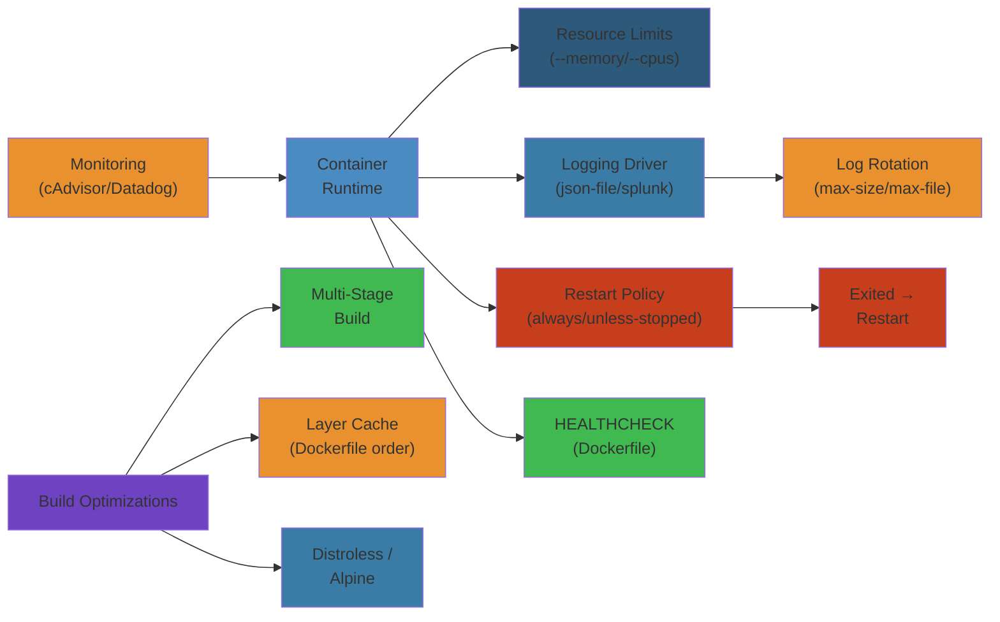
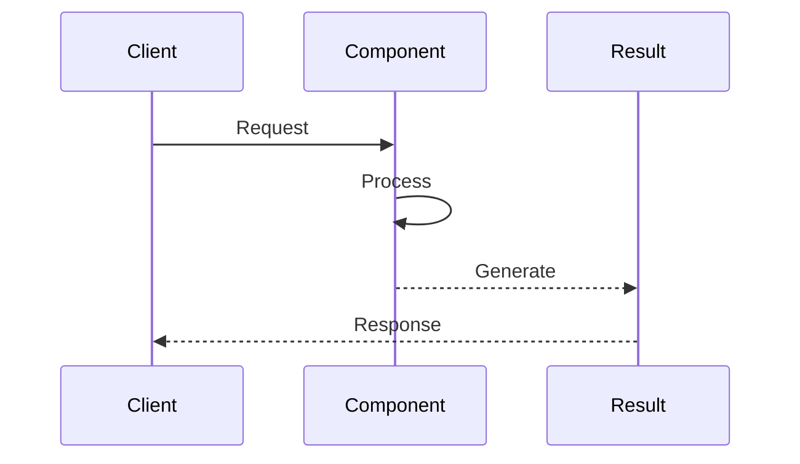

# 🏭 Docker Production Operations — Complete Deep Dive

**Related**: [Docker Basics](01-container-basics.md) · [Compose & Orchestration](02-compose-orchestration.md) · [Networking & Security](03-docker-networking-security.md) · [Kubernetes Operations](../kubernetes/06-kubernetes-observability.md)

---




## Table of Contents

- [Logging Drivers](#-logging-drivers)
- [Resource Constraints](#-resource-constraints)
- [Healthcheck Best Practices](#-healthcheck-best-practices)
- [Restart Policies](#-restart-policies)
- [Stop / Start / Signal Handling](#-stop--start--signal-handling)
- [Build Cache Optimization](#-build-cache-optimization)
- [Dockerfile Best Practices](#-dockerfile-best-practices)
- [Docker Registry](#-docker-registry)
- [Registry Comparison](#-registry-comparison)
- [Compose Production Patterns](#-compose-production-patterns)
- [Compose Profiles & Watch](#-compose-profiles--watch)
- [Docker Swarm Stack Deploy](#-docker-swarm-stack-deploy)
- [OCI Runtime Spec & Containerd Snapshotters](#-oci-runtime-spec--containerd-snapshotters)
- [Docker Scout](#-docker-scout)
- [Simplest Mental Model](#-simplest-mental-model)

---

## 📝 Logging Drivers

### Driver Comparison



| Driver | Pros | Cons |
|---|---|---|
| **json-file** | Always available, simple | No rotation by default, disk bloat |
| **journald** | Structured, systemd integrated | Binary format, harder to tail |
| **syslog** | Centralized, standard | UDP loss, text only |
| **gelf** | Chunked, compressed | Needs Graylog server |
| **fluentd** | Many outputs (ES, S3, etc.) | Extra daemon, resource cost |
| **awslogs** | Managed CloudWatch | AWS lock-in, cost |

```bash
# Configure logging driver per container
docker run --log-driver=fluentd --log-opt fluentd-address=localhost:24224 nginx

# Global in daemon.json
echo '{"log-driver":"json-file","log-opts":{"max-size":"10m","max-file":"3"}}' > /etc/docker/daemon.json

# Read json-file logs
docker logs --tail 100 --follow container_name
docker logs --since 2024-01-01T00:00:00 container_name
```

---

## ⚖️ Resource Constraints

### CPU

```text
  ┌── CPU Shares (soft limit) ──────────────────────────┐
  │  docker run --cpu-shares=512                        │
  │  Default: 1024, proportional scheduling              │
  │  2 containers: 1024 + 512 → first gets 2/3, second 1/3│
  └──────────────────────────────────────────────────────┘

  ┌── CPU Quota (hard limit) ───────────────────────────┐
  │  docker run --cpus=1.5                              │
  │  Maps to --cpu-period=100000 --cpu-quota=150000     │
  │  Container gets max 1.5 cores regardless of load    │
  └──────────────────────────────────────────────────────┘

  ┌── CPU Pinning ──────────────────────────────────────┐
  │  docker run --cpuset-cpus=0,2                       │
  │  Container runs only on CPU 0 and CPU 2             │
  └──────────────────────────────────────────────────────┘
```

### Memory & Swap

```bash
docker run --memory=512m --memory-swap=1g --memory-swappiness=0

# --memory=512m        : hard limit, OOM-kill if exceeded
# --memory-swap=1g     : total (memory+swap), so swap = 512m
# --memory-swappiness=0: disable anonymous page swapping
# --memory-reservation=256m: soft limit, best-effort
```

### OOM Killer Behavior

```text
  Container exceeds --memory ──► OOM killer
       │
       ├── Adjust OOM score:
       │   docker run --oom-score-adj=-500  (lower = less likely killed)
       │   docker run --oom-score-adj=1000  (higher = first to kill)
       │
       └── Disable OOM killer (risk of system hang):
           docker run --oom-kill-disable
           (only works when --memory is also set)
```

### Block IO

```bash
# Read/Write bandwidth limits (bps)
docker run --device-read-bps=/dev/sda:1mb --device-write-bps=/dev/sda:2mb

# IOPS limits
docker run --device-read-iops=/dev/sda:100 --device-write-iops=/dev/sda:200
```

---

## ❤️ Healthcheck Best Practices

```dockerfile
FROM node:18
COPY . /app
WORKDIR /app

HEALTHCHECK --interval=30s --timeout=3s --start-period=10s --retries=3 \
  CMD curl -f http://localhost:8080/health || exit 1

CMD ["node", "server.js"]
```

```text
  ―――――――――――――――――――――――――――――――――――――――――――――――――――――――――
  Timeline:
  start ──[start-period:10s]──► ──[interval:30s]──► ──[interval]──►
                                  │                    │
                                  ├ health check       ├ health check
                                  │                    │
                                  ◄──timeout:3s──►     ◄──timeout:3s──►

  After start-period: failure starts counting
  3 consecutive failures (retries:3) → container marked unhealthy
  ─――――――――――――――――――――――――――――――――――――――――――――――――――――――――
```

```yaml
# docker-compose healthcheck
services:
  web:
    image: myapp
    healthcheck:
      test: ["CMD", "curl", "-f", "http://localhost:8080/health"]
      interval: 30s
      timeout: 3s
      retries: 3
      start_period: 10s
```

```bash
# Inspect health
docker inspect --format='{{.State.Health.Status}}' container_name
docker inspect --format='{{json .State.Health.Log}}' container_name | jq .
```

---

## 🔄 Restart Policies

| Policy | Behavior |
|---|---|
| **no** | Never restart (default for standalone containers) |
| **on-failure** | Restart on non-zero exit code, optional `--restart=on-failure:3` (max retry) |
| **always** | Always restart unless explicitly stopped |
| **unless-stopped** | Always restart except when manually stopped |

```bash
docker run --restart=always nginx
docker run --restart=on-failure:5 myapp
```

```text
Backoff strategy for restart:
  Attempt 1: immediate
  Attempt 2: 2s delay
  Attempt 3: 4s delay
  Attempt 4: 8s delay
  ...cap at 1 minute

docker events --filter 'event=die' --filter 'event=restart'
```

---

## ⏹️ Stop / Start / Signal Handling

```text
  Graceful shutdown flow:

  docker stop mycontainer (wait 10s default)
       │
       ├──► SIGTERM sent to PID 1
       │       │
       │       ├── App handles SIGTERM → cleanup → exit(0)
       │       └── App ignores SIGTERM
       │
       └──► After 10s → SIGKILL sent
               │
               └── Force kill (no cleanup)
```

```bash
# Custom stop timeout
docker stop -t 30 mycontainer

# Send arbitrary signal
docker kill -s HUP mycontainer

# Set stop signal in Dockerfile
STOPSIGNAL SIGQUIT

# Wait until container exits
docker wait mycontainer
```

### PID 1 Responsibility

```text
  Container process is PID 1 — must:
    1. Forward signals to child processes (if using init system)
    2. Reap zombie processes (children whose parent died)

  Solutions:
    - Use tini (--init flag): docker run --init alpine
    - Use dumb-init as ENTRYPOINT
    - Application handles signals correctly
```

```dockerfile
FROM alpine
RUN apk add --no-cache tini
ENTRYPOINT ["/sbin/tini", "--"]
CMD ["/app/start.sh"]
```

---

## 🏗️ Build Cache Optimization

### Layer Ordering

```dockerfile
# BAD: changes source code invalidates npm install cache
COPY . .
RUN npm install

# GOOD: package.json first, then source
WORKDIR /app
COPY package.json package-lock.json ./
RUN npm install
COPY . .
```

### Multi-Stage Build

```dockerfile
# Stage 1: Build
FROM node:18-alpine AS builder
WORKDIR /app
COPY package*.json ./
RUN npm ci
COPY . .
RUN npm run build

# Stage 2: Production (tiny image)
FROM node:18-alpine AS runner
WORKDIR /app
COPY --from=builder /app/dist ./dist
COPY --from=builder /app/node_modules ./node_modules
EXPOSE 3000
CMD ["node", "dist/index.js"]
```

### BuildKit

```bash
# Enable BuildKit
export DOCKER_BUILDKIT=1
docker build .

# BuildKit features:
#   --secret: pass secrets without leaving layers
#   --ssh: forward SSH agent
#   --cache-from: remote cache
#   --output: direct output (type=local, type=tar)

docker build --secret id=npmrc,src=$HOME/.npmrc .
```

### --cache-from

```bash
# Use registry image as cache source
docker build --cache-from myapp:cache --tag myapp:latest .

# Pull cache image first
docker pull myapp:cache || true
docker build --cache-from myapp:cache --tag myapp:latest .
```

---

## 📜 Dockerfile Best Practices

```dockerfile
# 1. Use specific tags (not latest)
FROM node:18.17.0-alpine

# 2. Combine RUN commands
RUN apt-get update && \
    apt-get install -y --no-install-recommends curl && \
    apt-get clean && \
    rm -rf /var/lib/apt/lists/*

# 3. COPY before ADD (prefer COPY)
COPY --chown=node:node --chmod=644 . /app

# 4. Use ADD only for archives/tarballs
ADD https://example.com/file.tar.gz /tmp/

# 5. Set explicit USER (not root)
RUN addgroup -S appgroup && adduser -S appuser -G appgroup
USER appuser

# 6. Use EXPOSE for documentation
EXPOSE 3000/tcp

# 7. HEALTHCHECK
HEALTHCHECK --interval=30s CMD curl -f http://localhost:3000/health

# 8. LABEL for metadata
LABEL org.opencontainers.image.source="https://github.com/myorg/myapp"
LABEL org.opencontainers.image.description="Production web service"
```

### .dockerignore

```
**/node_modules
**/.git
**/dist
**/coverage
**/.env
**/*.md
Dockerfile
.gitignore
```

---

## 📦 Docker Registry

### Push / Pull

```bash
# Login
docker login myregistry.com
docker login myregistry.com --username myuser --password-stdin

# Tag and push
docker tag myapp:latest myregistry.com/team/myapp:latest
docker push myregistry.com/team/myapp:latest

# Pull
docker pull myregistry.com/team/myapp:latest
```

```yaml
# docker-compose with private registry
services:
  web:
    image: myregistry.com/team/web:latest
```

### Garbage Collection

```text
Registry storage (blobs + manifests):

  ┌─────────────────────────────────────┐
  │  /docker/registry/v2               │
  │  ├── blobs/                        │
  │  │   └── sha256/  (content-addressed)│
  │  ├── repositories/                 │
  │  │   └── myapp/                    │
  │  │       ├── _manifests/           │
  │  │       └── _layers/              │
  │  └── trash/  (deleted but not GC'd)│
  └─────────────────────────────────────┘
```

```bash
# Registry GC
docker exec registry /bin/registry garbage-collect /etc/docker/registry/config.yml
docker exec registry /bin/registry garbage-collect -m /etc/docker/registry/config.yml

# Dry run
docker exec registry /bin/registry garbage-collect --dry-run /etc/docker/registry/config.yml
```

### Storage Backends

```bash
# S3 backend
echo '{
  "storage": {
    "s3": {
      "accesskey": "AKIA...",
      "secretkey": "...",
      "bucket": "docker-registry",
      "region": "us-east-1"
    }
  }
}' > config.yml
```

---

## 🔍 Registry Comparison

| Feature | Docker Hub | ECR | GCR | ACR | Harbor |
|---|---|---|---|---|---|
| **Type** | Public/SaaS | AWS managed | GCP managed | Azure managed | Self-hosted |
| **Vulnerability Scan** | Docker Scout | ECR Scan | Container Analysis | Defender for Cloud | Trivy/Clair |
| **Geo-replication** | No | Cross-region | Global | Geo-redundant | Pull-through cache |
| **Retention Policy** | No | Lifecycle rules | TTL | Tags auto-purge | Auto-purge |
| **Rate Limits** | 100 pulls/6h (anon) | No | No | No | No |
| **Access Control** | Teams/Orgs | IAM + policy | IAM + roles | RBAC + AAD | RBAC + AD/LDAP |

---

## 📋 Compose Production Patterns

### depends_on with Healthcheck

```yaml
services:
  db:
    image: postgres:16
    healthcheck:
      test: ["CMD-SHELL", "pg_isready -U postgres"]
      interval: 5s
      timeout: 5s
      retries: 5

  app:
    build: .
    depends_on:
      db:
        condition: service_healthy
    restart: unless-stopped
```

### Restart Policies

```yaml
services:
  worker:
    image: myworker
    restart: unless-stopped
    deploy:
      replicas: 3
      resources:
        limits:
          cpus: "0.5"
          memory: "256M"
        reservations:
          cpus: "0.25"
          memory: "128M"
```

---

## 🎭 Compose Profiles & Watch

### Profiles

```yaml
services:
  app:
    image: myapp
    profiles: ["production", "staging"]

  redis:
    image: redis

  debug:
    image: debugger
    profiles: ["debug"]
    # Only started with: docker compose --profile debug up
```

```bash
# Start only production services
docker compose --profile production up

# Start multiple profiles
docker compose --profile production --profile staging up
```

### Compose Watch (Hot Reload)

```yaml
services:
  app:
    build: .
    develop:
      watch:
        - path: ./src
          action: sync
          target: /app/src
          ignore:
            - node_modules/
            - .git/
        - path: ./package.json
          action: rebuild
```

```bash
docker compose watch
```

---

## 🔄 Docker Swarm Stack Deploy

```yaml
# stack.yml
version: "3.9"
services:
  web:
    image: nginx
    ports:
      - target: 80
        published: 80
        mode: host
    deploy:
      mode: replicated
      replicas: 3
      update_config:
        parallelism: 1
        delay: 10s
        order: start-first
      rollback_config:
        parallelism: 1
        order: stop-first
      resources:
        limits:
          cpus: "0.5"
          memory: "512M"

  db:
    image: postgres
    volumes:
      - pgdata:/var/lib/postgresql/data
    secrets:
      - db_password

volumes:
  pgdata:
    driver: rexray/ebs

secrets:
  db_password:
    file: ./secrets/db_password.txt
```

```bash
# Deploy stack
docker stack deploy -c stack.yml myapp

# Rolling update
docker service update --image myapp:v2 --update-parallelism 2 web_web

# Rollback (automatic or manual)
docker service update --rollback web_web
```

---

## 📦 OCI Runtime Spec & Containerd Snapshotters

### OCI Runtime Spec

```text
OCI defines three specs:
  1. Runtime Spec (config.json + rootfs) — how to run a container
  2. Image Spec — how to build container images (layers, manifest)
  3. Distribution Spec — how to push/pull images

runtime.json fields:
  - process (args, env, cwd, capabilities, rlimits)
  - root (path, readonly)
  - mounts (source, destination, type, options)
  - linux (namespaces, cgroupsPath, seccomp, resources)
  - hooks (prestart, poststart, poststop)
```

### Containerd Snapshotters

```text
  ┌─ Container ─┐    ┌─ containerd ────┐    ┌─ Snapshotter ──┐
  │             │    │                 │    │               │
  │ runc/runc   │◄───│ containerd      │◄───│ overlayfs     │
  │ (OCI)       │    │ ctr, crictl,    │    │ devmapper     │
  │             │    │ nerdctl         │    │ fuse-overlayfs│
  └─────────────┘    └─────────────────┘    │ stargz        │
                                            └───────────────┘
```

```bash
# List snapshotters
ctr snapshot list
ctr snapshot --snapshotter=overlayfs

# Compare snapshotters
nerdctl info --format '{{.Driver}}'
```

| Snapshotter | Description | Use Case |
|---|---|---|
| **overlayfs** | COW on overlayfs, OCI layer mount | Default for Linux |
| **devmapper** | Thin-provisioned LVM | Older kernels, no overlayfs |
| **fuse-overlayfs** | FUSE-based overlay | Rootless Docker |
| **stargz** | Lazy pulling (estargz) | Faster startup (cold start) |

### Stargz Lazy Pulling

```text
Standard pull: Download ALL layers → mount → start
Stargz pull:   Download metadata + start → lazy-load blocks on access

  ─ ─ ─ ─ ─ ─ ─ ─ ─ ─ ─ ─ ─ ─ ─ ─ ─ ─ ─ ─
  Time saved: only read blocks from registry
  when container actually touches them.
  ─ ─ ─ ─ ─ ─ ─ ─ ─ ─ ─ ─ ─ ─ ─ ─ ─ ─ ─ ─
```

---

## 🔭 Docker Scout

```bash
# Enable Docker Scout
docker scout quickview myapp:latest

# Detailed analysis
docker scout cves myapp:latest
docker scout recommendations myapp:latest

# Compare two versions
docker scout compare myapp:v1 myapp:v2

# Policy-based (fail build if critical CVE)
docker scout policy myapp:latest
```

```text
Docker Scout workflow:
  1. Analyze image layers and SBOM (SPDX format)
  2. Match packages against CVE databases (NVD, GHSA, RedHat, Ubuntu)
  3. Show fix version, severity, CVSS score
  4. Generate SBOM: docker scout sbom myapp:latest
  5. Policy evaluation: pass/fail gates for CI/CD
```

---

## 🧠 Simplest Mental Model

```text
┌──────────────────────────────────────────────────────────────────┐
│                                                                   │
│    Docker Production = Keeping containers running safely at scale│
│                                                                   │
│    Logging  = Where does container output go?                    │
│    Resource = How much CPU/memory can it use?                    │
│    Health   = Is the app actually working?                       │
│    Restart  = What happens when it crashes?                      │
│    Build    = How to make images fast and small                  │
│    Registry = Where to store and serve images                    │
│    Swarm    = Multi-host orchestration (K8s-lite)                │
│    Scout    = Vulnerability scanner for your images              │
│                                                                   │
└──────────────────────────────────────────────────────────────────┘
```
