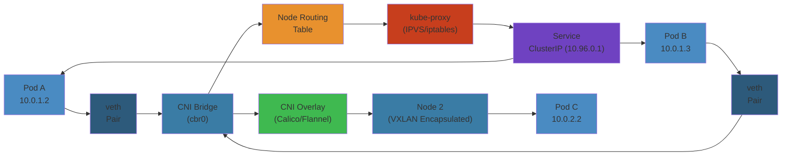

# 🌐 Kubernetes Networking — Complete Deep Dive




## ToC

#### Step-by-Step
1. Process input
2. Validate
3. Execute
4. Return result

#### Code Example
```python
# Example implementation
pass
```

#### Real-World Scenario
This pattern is commonly used in production systems.

- CNI Model | CNI Plugins | Pod Networking | Service Types | kube-proxy | EndpointSlices | CoreDNS | Ingress vs Gateway API | Network Policies | Cilium eBPF | Multi-Cluster | NodePort vs hostPort vs externalIP vs LB

---

## CNI Model

#### Step-by-Step
1. Process input
2. Validate
3. Execute
4. Return result

#### Code Example
```python
# Example implementation
pass
```

#### Real-World Scenario
This pattern is commonly used in production systems.


```
                     Node (Linux Host)
  +-----------------+    +-----------------+
  |   Pod A          |    |   Pod B          |
  | eth0 (veth)      |    | eth0 (veth)      |
  +--------+---------+    +--------+---------+
           |                       |
  +--------+-----------------------+--------+
  |               cni0 bridge              |
  +--------------------+-------------------+
              +---------+---------+
              |   eth0 (host NIC)  |
              +---------+---------+
```

**Flow:** kubelet -> pause container (netns) -> CNI ADD -> veth pair -> cni0 bridge -> IPAM -> routes

---

## CNI Plugins

#### Step-by-Step
1. Process input
2. Validate
3. Execute
4. Return result

#### Code Example
```python
# Example implementation
pass
```

#### Real-World Scenario
This pattern is commonly used in production systems.


| Plugin | Model | Encap | Key feature |
|--------|-------|-------|-------------|
| Flannel | Overlay | VXLAN | Simple |
| Calico | L3 | None/IPIP | NetworkPolicy, eBPF |
| Cilium | eBPF | VXLAN/None | L7, Hubble, ClusterMesh |
| Canal | Flannel+Calico | VXLAN | Both net + policy |
| Antrea | OVS | VXLAN/Geneve | Traceflow |

**Need policy?** Calico/Cilium/Antrea. **Need eBPF?** Cilium. **Simple?** Flannel.

---

## Pod Networking

#### Step-by-Step
1. Process input
2. Validate
3. Execute
4. Return result

#### Code Example
```python
# Example implementation
pass
```

#### Real-World Scenario
This pattern is commonly used in production systems.


**IP-per-Pod:** Each pod gets 1 IP from CNI IPAM. All containers share IP via pause container netns (localhost).

```yaml
spec:
  containers:
  - ports:
    - containerPort: 8080
      hostPort: 30080
```

---

## Service Types

#### Step-by-Step
1. Process input
2. Validate
3. Execute
4. Return result

#### Code Example
```python
# Example implementation
pass
```

#### Real-World Scenario
This pattern is commonly used in production systems.


**ClusterIP (default):** Virtual IP, cluster-internal. **NodePort:** All nodes listen 30000-32767, DNAT to pod.

```yaml
spec:
  type: LoadBalancer
  externalTrafficPolicy: Local   # preserve client IP
```

**LoadBalancer:** `Cluster` mode (SNAT, lose IP) vs `Local` mode (preserve IP). **ExternalName:** CNAME to external DNS.

---

## kube-proxy Modes

#### Step-by-Step
1. Process input
2. Validate
3. Execute
4. Return result

#### Code Example
```python
# Example implementation
pass
```

#### Real-World Scenario
This pattern is commonly used in production systems.


| Mode | Lookup | Scaling |
|------|--------|---------|
| iptables | O(n) chain | Simple |
| IPVS | O(1) hash | 10K+ services |
| userspace | Proxy | Deprecated |

---

## EndpointSlices

#### Step-by-Step
1. Process input
2. Validate
3. Execute
4. Return result

#### Code Example
```python
# Example implementation
pass
```

#### Real-World Scenario
This pattern is commonly used in production systems.


```yaml
kind: EndpointSlice
addressType: IPv4
ports:
- name: http
  port: 8080
endpoints:
- addresses: ["10.1.0.1"]
  conditions: {ready: true}
  topology:
    kubernetes.io/hostname: node-1
    topology.kubernetes.io/zone: us-east-1a
```

**Why:** Max 100/slice, only changed slices update, topology-aware.

---

## CoreDNS

#### Step-by-Step
1. Process input
2. Validate
3. Execute
4. Return result

#### Code Example
```python
# Example implementation
pass
```

#### Real-World Scenario
This pattern is commonly used in production systems.


```
  DNS: <service>.<namespace>.svc.cluster.local
  Example: my-svc.default.svc.cluster.local -> ClusterIP
```

```yaml
data:
  Corefile: |
    .:53 {
        errors
        health
        kubernetes cluster.local in-addr.arpa ip6.arpa {
          pods insecure
          ttl 30
        }
        prometheus :9153
        forward . /etc/resolv.conf
        cache 30
        loadbalance round_robin
    }
```

---

## Ingress vs Gateway API

#### Step-by-Step
1. Process input
2. Validate
3. Execute
4. Return result

#### Code Example
```python
# Example implementation
pass
```

#### Real-World Scenario
This pattern is commonly used in production systems.


### Ingress (v1)

#### Step-by-Step
1. Process input
2. Validate
3. Execute
4. Return result

#### Code Example
```python
# Example implementation
pass
```

#### Real-World Scenario
This pattern is commonly used in production systems.

```yaml
apiVersion: networking.k8s.io/v1
kind: Ingress
spec:
  rules:
  - host: app.example.com
    http:
      paths:
      - path: /api
        pathType: Prefix
        backend:
          service:
            name: api-svc
            port: 80
```

### Gateway API

#### Step-by-Step
1. Process input
2. Validate
3. Execute
4. Return result

#### Code Example
```python
# Example implementation
pass
```

#### Real-World Scenario
This pattern is commonly used in production systems.

```yaml
apiVersion: gateway.networking.k8s.io/v1
kind: Gateway
spec:
  gatewayClassName: istio
  listeners:
  - protocol: HTTPS
    port: 443
    tls:
      certificateRefs:
      - name: app-tls
---
apiVersion: gateway.networking.k8s.io/v1
kind: HTTPRoute
spec:
  parentRefs:
  - name: prod-gateway
  rules:
  - matches:
    - path:
        type: PathPrefix
        value: /api
    backendRefs:
    - name: api-svc
      port: 80
    - name: api-v2-svc
      port: 80
      weight: 10             # 10% canary
```

| Feature | Ingress | Gateway API |
|---------|---------|-------------|
| Traffic split | annotation | native weight |
| Protocols | HTTP/HTTPS | HTTP, TCP, TLS, UDP, gRPC |

---

## Network Policies

#### Step-by-Step
1. Process input
2. Validate
3. Execute
4. Return result

#### Code Example
```python
# Example implementation
pass
```

#### Real-World Scenario
This pattern is commonly used in production systems.


### Default Deny

#### Step-by-Step
1. Process input
2. Validate
3. Execute
4. Return result

#### Code Example
```python
# Example implementation
pass
```

#### Real-World Scenario
This pattern is commonly used in production systems.

```yaml
spec:
  podSelector: {}
  policyTypes:
  - Ingress
```

### Selective Allow

#### Step-by-Step
1. Process input
2. Validate
3. Execute
4. Return result

#### Code Example
```python
# Example implementation
pass
```

#### Real-World Scenario
This pattern is commonly used in production systems.

```yaml
spec:
  podSelector:
    matchLabels:
      app: postgres
  ingress:
  - from:
    - namespaceSelector:
        matchLabels:
          kubernetes.io/metadata.name: api
      podSelector:
        matchLabels:
          app: backend
    ports:
    - protocol: TCP
      port: 5432
```

**Rules:** ingress.from = podSelector / namespaceSelector / ipBlock. Default: no policy = all allowed. With policy = deny-all-except-matched.

---

## Cilium eBPF

#### Step-by-Step
1. Process input
2. Validate
3. Execute
4. Return result

#### Code Example
```python
# Example implementation
pass
```

#### Real-World Scenario
This pattern is commonly used in production systems.


```bash
hubble observe --from-pod default/nginx --to-pod default/api
hubble observe --verdict DROPPED
```

**CiliumNetworkPolicy (L7):** match HTTP method + path in policies.

**Cluster Mesh:** Direct eBPF routing across clusters, no gateway. Needs CA sharing + non-overlapping CIDRs.

---

## NodePort vs hostPort vs externalIP vs LoadBalancer

#### Step-by-Step
1. Process input
2. Validate
3. Execute
4. Return result

#### Code Example
```python
# Example implementation
pass
```

#### Real-World Scenario
This pattern is commonly used in production systems.


| Feature | NodePort | hostPort | externalIP | LB |
|---------|----------|----------|------------|-----|
| Port | 30000-32767 | Any | Any | Cloud |
| Client IP | SNAT | Preserved | Preserved | Varies |
| Cloud | Manual | Manual | Manual | Auto |
| Use | Dev | DaemonSet | Legacy | Prod |

```yaml
spec:
  externalIPs:
  - 192.168.1.100
```

---

## Simplest Mental Model

#### Step-by-Step
1. Process input
2. Validate
3. Execute
4. Return result

#### Code Example
```python
# Example implementation
pass
```

#### Real-World Scenario
This pattern is commonly used in production systems.


```
K8s networking = apartment building mail system

+------------------------------------------------------------------------------+
|  Pod = apartment unit (own IP)  |  veth = mail slot  |  bridge = lobby table |
|  Service = front desk forwarding mail  |  ClusterIP = virtual mailbox #     |
|  NodePort = lobby door  |  Ingress = doorman  |  NetworkPolicy = floor rules |
|  CNI = postal service  |  CoreDNS = phone book  |  Cilium = security cameras |
|                                                                              |
|  Core: every pod gets a real IP (no NAT between pods)                       |
|  Services decouple client from changing pod IPs                             |
+------------------------------------------------------------------------------+


---

## Code Examples

#### Step-by-Step
1. Process input
2. Validate
3. Execute
4. Return result

#### Code Example
```python
# Example implementation
pass
```

#### Real-World Scenario
This pattern is commonly used in production systems.


```python
# Simulate kube-proxy iptables DNAT logic
import random

class KubeProxySimulator:
    def __init__(self):
        self.services = {}
        self.endpoints = {}

    def add_service(self, name: str, cluster_ip: str, port: int):
        self.services[name] = {'cluster_ip': cluster_ip, 'port': port}

    def add_endpoints(self, service: str, pod_ips: list):
        self.endpoints[service] = pod_ips

    def dnat(self, service: str) -> str:
        # iptables random DNAT
        return random.choice(self.endpoints.get(service, []))

    def iptables_chain(self, service: str) -> str:
        # Generate pseudo-iptables rules
        rules = f"*nat\n:KUBE-SVC-{service} - [0:0]\n"
        for i, ip in enumerate(self.endpoints.get(service, [])):
            rules += f"-A KUBE-SVC-{service} -m statistic --mode random "
            rules += f"--probability 0.{1/(len(self.endpoints)-i)} "
            rules += f"-j DNAT --to-destination {ip}:8080\n"
        return rules

# CoreDNS mock
class CoreDNSResolver:
    def __init__(self):
        self.records = {}

    def add_record(self, svc: str, namespace: str, cluster_ip: str):
        fqdn = f"{svc}.{namespace}.svc.cluster.local"
        self.records[fqdn] = cluster_ip

    def resolve(self, fqdn: str) -> str:
        return self.records.get(fqdn, "NXDOMAIN")

# Simulate network policy evaluation
class NetworkPolicyEngine:
    def __init__(self):
        self.policies = []

    def add_policy(self, pod_selector: dict, ingress_rules: list):
        self.policies.append({'pod_selector': pod_selector,
                              'ingress': ingress_rules})

    def allow_traffic(self, src_pod: dict, dst_pod: dict, port: int) -> bool:
        for policy in self.policies:
            if all(dst_pod.get(k) == v for k, v in policy['pod_selector'].items()):
                for rule in policy['ingress']:
                    if port in rule.get('ports', [port]):
                        return True
        return False  # default deny if any policy applies
```

```bash
# Debug pod-to-pod connectivity
NS=default; SRC_POD=$(kubectl get pod -n $NS -l app=frontend -o name | head -1)
DST_IP=$(kubectl get pod -n $NS -l app=backend -o jsonpath='{.status.podIP}')
kubectl exec -n $NS $SRC_POD -- ping -c 3 $DST_IP

# Trace iptables for a service
SVC_NAME=my-svc
kubectl get svc $SVC_NAME -o jsonpath='{.spec.clusterIP}'
iptables-save | grep $SVC_NAME | head -20
```

---

## Common Failure Modes

#### Step-by-Step
1. Process input
2. Validate
3. Execute
4. Return result

#### Code Example
```python
# Example implementation
pass
```

#### Real-World Scenario
This pattern is commonly used in production systems.


**Problem**: kube-proxy iptables rule explosion causing latency and packet loss

**Root cause**: Each Service with N endpoints generates O(N) iptables DNAT rules. At 10,000+ services, the total iptables chain length causes rule evaluation to take milliseconds per packet. CONNTRACK table fills up, causing random packet drops. Node CPU usage from netfilter operations spikes, especially during service churn.

**Detection**: `iptables-save | wc -l` shows 100K+ rules. `kubectl get svc -A | wc -l` exceeds 5000. Node monitoring shows high `softirq` CPU. Pod-to-pod latency becomes erratic. `conntrack -S` shows high `insert_failed` count.

**Solution**: Switch kube-proxy to IPVS mode (`kube-proxy --proxy-mode=ipvs`) — O(1) hash-based forwarding regardless of endpoint count. Or switch to Cilium with eBPF, which uses a BPF map (hash table) for service lookup — no linear rule scanning. For existing clusters, consolidate services and avoid creating per-pod services.

**Problem**: DNS resolution failures causing pod startup delays and intermittent connection errors

**Root cause**: CoreDNS runs as a deployment. Under load, CoreDNS pods get throttled by `kube-proxy` iptables rules trying to reach themselves (NAT loop). Pods starting up hit DNS before the cache is warm. High QPS from misconfigured `ndots:5` causes excessive DNS queries (every name lookup tries 5 domain suffixes before failing).

**Detection**: Application logs show `Temporary failure in name resolution` or connection timeouts. CoreDNS metrics show high `coredns_dns_requests_total` for NXDOMAIN. Pod startup times are inconsistent (3-10s extra). `kubectl exec` DNS queries from pods exhibit 5-second timeouts.

**Solution**: Set `ndots: 1` or `ndots: 2` in pod DNS config to reduce search domain expansion. Use NodeLocal DNSCache (DaemonSet) to cache DNS locally on each node, bypassing iptables DNAT for DNS traffic. Run CoreDNS with `autopath` plugin. Set `NegativeCache` TTL. Size CoreDNS appropriately — add HPA based on CPU/memory.

---

## Interview Questions

#### Step-by-Step
1. Process input
2. Validate
3. Execute
4. Return result

#### Code Example
```python
# Example implementation
pass
```

#### Real-World Scenario
This pattern is commonly used in production systems.


### Q1: How does a Kubernetes Service forward traffic to pods, and what are the performance implications of each mode?

#### Step-by-Step
1. Process input
2. Validate
3. Execute
4. Return result

#### Code Example
```python
# Example implementation
pass
```

#### Real-World Scenario
This pattern is commonly used in production systems.


**Answer**: A Service is a virtual IP backed by EndpointSlices, and kube-proxy on each node programs forwarding rules. In **iptables mode**, each endpoint becomes a DNAT rule — random selection uses `statistic --mode random`. For large services (500+ endpoints), rule chains can be thousands of lines, causing non-trivial per-packet latency. In **IPVS mode**, the kernel hash table does O(1) lookup — much faster at scale. In **eBPF mode** (Cilium), BPF maps replace iptables entirely, with the lowest latency and best scalability. The ClusterIP is managed by the node's network stack (not a real device) — `iptables -t nat -L` shows the rules translating ClusterIP:Port to pod IPs.

### Q2: How would you design cluster networking to support 5000+ services across 200 nodes?

#### Step-by-Step
1. Process input
2. Validate
3. Execute
4. Return result

#### Code Example
```python
# Example implementation
pass
```

#### Real-World Scenario
This pattern is commonly used in production systems.


**Answer**: Avoid iptables mode — use Cilium with eBPF for O(1) service lookup and native XDP for packet forwarding. Use a pod CIDR large enough for projected pod density (e.g., /16 per node or /64 for IPv6). Enable CNI prefix delegation (AWS VPC CNI) or use a non-VPC CNI like Calico with IPIP encapsulation if VPC IPs are limited. Deploy NodeLocal DNSCache to avoid DNS conntrack issues. Use EndpointSlice (enabled by default in 1.21+) to reduce API server load from endpoint updates. Avoid hostPort and use NodePort only for debugging. Consider Gateway API for advanced traffic routing instead of many Ingress resources.


## Edge Cases

#### Step-by-Step
1. Process input
2. Validate
3. Execute
4. Return result

#### Code Example
```python
# Example implementation
pass
```

#### Real-World Scenario
This pattern is commonly used in production systems.


| Scenario | Challenge | Solution |
|----------|-----------|----------|
| **Service mesh sidecar startup race** | App starts before sidecar, fails to connect to other services | Use `holdApplicationUntilProxyStarts` (Istio). Configure init container to wait for sidecar ready. Set `traffic.sidecar.istio.io/includeInboundPorts` |
| **DNS resolution failures in pods** | CoreDNS overloaded, pod can't resolve service names | Autoscale CoreDNS: `kubectl autoscale deployment coredns --cpu-percent=70 --min=2 --max=10`. Use node-local DNS cache. Set `ndots: 1` in pod dnsConfig |
| **Network policy blocking kube-dns** | IP range of CoreDNS not included in policy | Add policy: `ipBlock.cidr: <cluster-ip-range>` for DNS. Or label CoreDNS pods and use podSelector. Always test policies with `kubectl run -it --rm debug --image=nicolaka/netshoot` |
| **MTU mismatch between CNI and underlying network** | Packet fragmentation, performance degradation | Set `mtu: 1460` (Calico) or `vpc-mtu: 1460` (AWS VPC CNI). Match underlying network MTU (AWS 9001, GCP 1460). Test with `ping -M do -s 1472` |
| **Ingress controller scaling under DDoS** | Ingress pods overwhelmed, control plane also impacted | Use Cloud LB in front of ingress (NLB/ALB). Set HPA on ingress controller. WAF at edge. Rate limiting per IP with `nginx.ingress.kubernetes.io/limit-rps` |

## Cross-References

#### Step-by-Step
1. Process input
2. Validate
3. Execute
4. Return result

#### Code Example
```python
# Example implementation
pass
```

#### Real-World Scenario
This pattern is commonly used in production systems.


- [EKS Networking](../../05-cloud/aws/eks/02-eks-operations.md) — AWS VPC CNI, security groups per pod
- [DNS, CDN & Load Balancing](../../11-networking/03-dns-cdn-loadbalancing.md) — Ingress vs LoadBalancer vs NodePort service comparison
- [Kubernetes Security](../04-kubernetes-security.md) — Network policies, zero trust, service mesh
- [Kubernetes Observability](../06-kubernetes-observability.md) — Network monitoring with Cilium Hubble, metrics