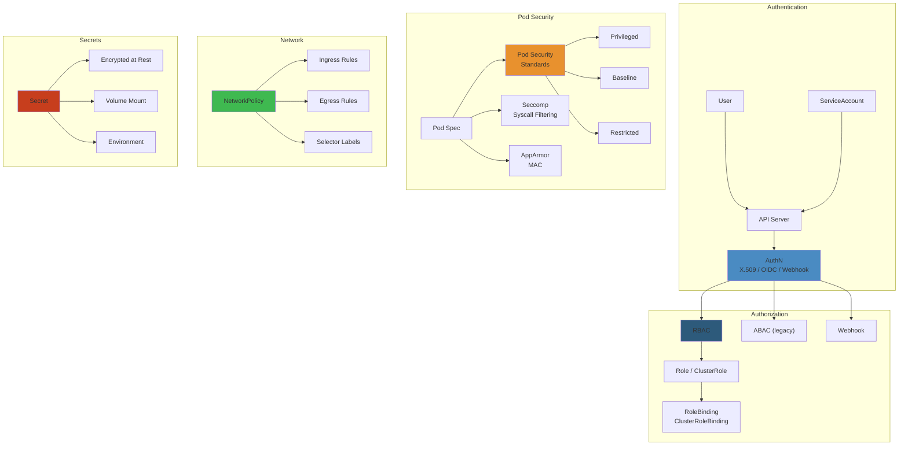

# 🔐 Kubernetes Security — Complete Deep Dive




---

## LAYER 1: Beginner's Mental Model 🧠


### Real-World Analogy


**Kubernetes Security = Apartment Building Security**

- **RBAC (Role-Based Access)** = Keys. Janitor gets key to hallway, residents get key to apartment, nobody gets master key
- **Pod Security Standards** = Building codes. Stove must have safety valve, doors need locks (prevents dangerous configs)
- **NetworkPolicy** = Firewall. Apartment can only receive visitors from registered list (white-list access)
- **Secrets** = Vault. Passwords locked in safe, not written on wall
- **ServiceAccount** = ID card. App has identity, proves it's allowed to do things

### Why It Matters


**Without security (everything open):**
```
Attacker gains access to 1 container
→ Can access all other containers
→ Can read all secrets (DB passwords, API keys)
→ Can modify other apps
→ Result: Entire cluster compromised
```

**With Kubernetes security (layered):**
```
Attacker gains access to container A
→ RBAC: Can only access pod A's namespace
→ NetworkPolicy: Can only talk to pod B (blocked from others)
→ Secrets: Encrypted, attacker can't read passwords
→ SecurityContext: Can't run as root (limited damage)
Result: Blast radius contained to pod A
```

---

## LAYER 4: Production Failures 🚨


### Common K8s Security Failures


| Failure | Symptom | Root Cause | Prevention |
|---------|---------|-----------|-----------|
| **Over-Permissive RBAC** | Dev reads prod secrets | Role has `*` on `*` (admin) | Use least privilege, audit RBAC |
| **Unencrypted Secrets** | Attacker reads etcd, gets passwords | Encryption disabled | Enable `EncryptionAtRest` in API server |
| **Pod Escape** | Container breaks out to host | No SecurityContext, runs as root | Use PodSecurityPolicy / PSA |
| **Lateral Movement** | Pod talks to all others | No NetworkPolicy | Default deny all, allow specific flows |
| **Image From Anywhere** | Pulls malicious image from attacker registry | No image registry policy | Use `ImagePolicyWebhook`, scan images |
| **Unpatched Kubelet** | Kernel exploit, complete node compromise | Node not updated in 6 months | Automated node patching, drain + upgrade |

### Real Incident: Capital One Kubernetes Breach (2019)


**Problem:** Attacker accessed Kubernetes through misconfigured IAM role.

```
Timeline:
1. CloudTrail shows IAM role overly permissive
2. Attacker exploits Pod → escapes to host
3. Gets AWS credentials from EC2 metadata service
4. Can now list all S3 buckets
5. Downloads 100M customer records

Root causes:
- SecurityContext not enforced (pod ran as root)
- RBAC too permissive (service account could list all secrets)
- No NetworkPolicy (pod could reach metadata service)
- No audit logging (didn't detect until later)
```

### Prevention Checklist


```yaml
# SecurityContext: prevent root + limit capabilities
spec:
  securityContext:
    runAsNonRoot: true
    runAsUser: 1000
    fsReadOnlyRootFilesystem: true
    capabilities:
      drop: ["ALL"]

# PodSecurityPolicy / PSA: enforce at cluster level
apiVersion: policy/v1beta1
kind: PodSecurityPolicy
metadata:
  name: restricted
spec:
  privileged: false
  allowPrivilegeEscalation: false
  requiredDropCapabilities: ["ALL"]
  runAsUser:
    rule: "MustRunAsNonRoot"
  fsGroup:
    rule: "MustRunAs"
    ranges: [{min: 1000, max: 65535}]

# NetworkPolicy: whitelist only needed flows
apiVersion: networking.k8s.io/v1
kind: NetworkPolicy
metadata:
  name: app-policy
spec:
  podSelector:
    matchLabels:
      app: web
  policyTypes:
  - Ingress
  ingress:
  - from:
    - namespaceSelector:
        matchLabels:
          name: ingress
    ports:
    - protocol: TCP
      port: 8080

# Secrets: use external secret manager
apiVersion: v1
kind: SecretProviderClass
metadata:
  name: vault-secrets
spec:
  provider: vault
  parameters:
    vaultAddress: "https://vault:8200"
```

---

## Interview Questions 💼


### Level 1: Junior


**Q: What's RBAC? Give an example.**

A: RBAC = Role-based access control. Define what users/serviceaccounts can do.

```yaml
Role: "pod-reader" can "get,watch,list" "pods"
RoleBinding: User "alice" has role "pod-reader"
Result: alice can read pods, not delete them
```

### Level 2: Intermediate


**Q: Design RBAC for a team: frontend devs (1 ns), backend devs (1 ns), ops (all ns).**

A:
```yaml
# Frontend devs: can deploy in frontend ns only
- Role: deploy-frontend (actions: create, get, list pods/deployments)
- RoleBinding: group "frontend-devs" in namespace "frontend"

# Backend devs: can deploy in backend ns
- Role: deploy-backend (same as above)
- RoleBinding: group "backend-devs" in namespace "backend"

# Ops: admin on all namespaces
- ClusterRole: cluster-admin
- ClusterRoleBinding: group "ops"
```

### Level 3: Senior


**Q: Design network policies for microservices: web → api → database.**

A:
```yaml
# Web can accept from ingress, talk to api only
NetworkPolicy:
  selector: web
  ingress: from ingress-controller
  egress: to api (port 8080)

# API can talk to web and database only
NetworkPolicy:
  selector: api
  ingress: from web
  egress: to database (port 5432)

# Database: no ingress except from api
NetworkPolicy:
  selector: database
  ingress: from api
```

---

## Production Story: Uber Kubernetes Security


Challenge: Uber runs 1000+ microservices in Kubernetes. One pod compromise = $1M loss.

**Defense layers:**
1. RBAC: Each service gets identity, can only read its own secrets
2. PSA: Blocks privileged pods (limits blast radius)
3. NetworkPolicy: Services can only talk to dependencies
4. Secrets: Encrypted at rest, rotated every 30 days
5. Runtime: Falco monitors unusual syscalls
6. Audit: All API calls logged to SecurityHub

**Result:** Even if 1 pod compromised, attacker limited to that microservice's data.

---
graph LR
    RBAC["RBAC<br/>(Role/ClusterRole)"] --> SUBJ["Subject<br/>(User/ServiceAccount)"]
    SUBJ --> ROLE_B["Role / ClusterRole<br/>(Rules)"]
    ROLE_B --> BIND["RoleBinding /<br/>ClusterRoleBinding"]
    PSA["Pod Security<br/>Standards"] --> POL["Policy<br/>(Privileged/Baseline/Restricted)"]
    POL --> POD["Pod<br/>Admission"]
    NP["NetworkPolicy"] --> POD_SEL["Pod Selector<br/>(labels)"]
    NP --> RULE["Ingress / Egress<br/>Rules (CIDR/Port)"]
    FALCO["Falco<br/>(Runtime Security)"] --> SYSCALL["Syscall<br/>Monitoring"]
    SECRET["Secrets<br/>(etcd encrypted)"] --> CSI["Secrets Store CSI<br/>(Vault/AWS)"]
    style RBAC fill:#4a8bc2
    style SUBJ fill:#2d5a7b
    style ROLE_B fill:#3a7ca5
    style BIND fill:#6f42c1
    style PSA fill:#c73e1d
    style POL fill:#e8912e
    style POD fill:#3fb950
    style NP fill:#e8912e
    style POD_SEL fill:#3a7ca5
    style RULE fill:#2d5a7b
    style FALCO fill:#c73e1d
    style SYSCALL fill:#e8912e
    style SECRET fill:#6f42c1
    style CSI fill:#3fb950
```

## ToC


- RBAC | Pod Security Standards | PSA | Network Policies | ServiceAccount | Secrets | SecurityContext | PDB | OPA Gatekeeper | Kyverno | KMS | Image Security | Falco

---

## RBAC


```
  +-------------+          +-------------+
  | Role (ns)   |          | ClusterRole |
  | get pods    |          | get nodes   |
  +------+------+          +------+------+
         |                        |
         v                        v
  +-------------+          +-------------+
  | RoleBinding |          | ClusterRole  |
  | User: alice |          | Binding      |
  +-------------+          | User: admin  |
                           +-------------+
```

```yaml
apiVersion: rbac.authorization.k8s.io/v1
kind: Role
metadata:
  namespace: default
  name: pod-reader
rules:
- apiGroups: [""]
  resources: ["pods"]
  verbs: ["get", "watch", "list"]
---
kind: RoleBinding
subjects:
- kind: User
  name: alice
roleRef:
  kind: Role
  name: pod-reader
```

```bash
kubectl auth can-i create pods --namespace prod
kubectl auth can-i get secrets --as system:serviceaccount:default:app-sa
```

---

## Pod Security Standards


| Level | Policy |
|-------|--------|
| **Privileged** | Unrestricted |
| **Baseline** | No privileged, hostPath, hostNetwork |
| **Restricted** | All baseline + non-root, no NET_RAW, seccomp RuntimeDefault |

**Restricted violations:** `runAsNonRoot: false`, `capabilities.drop: ["ALL"]` missing, `seccompProfile.type != RuntimeDefault`, `allowPrivilegeEscalation: true`

---

## Pod Security Admission


**Labels on namespace:** `pod-security.kubernetes.io/enforce: restricted`, `audit: baseline`, `warn: restricted`

**Modes:** enforce (reject), audit (log), warn (warning). Replaces PSP in v1.25.

---

## Network Policies


```yaml
apiVersion: networking.k8s.io/v1
kind: NetworkPolicy
metadata:
  name: default-deny
spec:
  podSelector: {}
  policyTypes:
  - Ingress
---
apiVersion: networking.k8s.io/v1
kind: NetworkPolicy
metadata:
  name: allow-dns
spec:
  podSelector: {}
  policyTypes:
  - Egress
  egress:
  - to:
    - namespaceSelector: {}
      podSelector:
        matchLabels:
          k8s-app: kube-dns
    ports:
    - protocol: UDP
      port: 53
```

**Cross-ns isolation:** Without explicit allow, pods in ns-A cannot reach ns-B.

---

## ServiceAccount


```yaml
apiVersion: v1
kind: ServiceAccount
metadata:
  name: app-sa
---
apiVersion: v1
kind: Pod
spec:
  serviceAccountName: app-sa
```

**Token projection (short-lived):**
```yaml
volumes:
- name: token
  projected:
    sources:
    - serviceAccountToken:
        path: token
        expirationSeconds: 3600
```

---

## Secrets


```yaml
apiVersion: v1
kind: Secret
type: Opaque
data:
  password: MWYyZDFlMmU2N2Rm     # base64, NOT secure alone
```

**Encryption at rest:**
```yaml
apiVersion: apiserver.config.k8s.io/v1
kind: EncryptionConfiguration
resources:
- resources:
  - secrets
  providers:
  - aescbc:
      keys:
      - name: key1
        secret: c2VjcmV0LWtleS0zMg==
  - identity: {}
```

**External Secrets Operator:**
```yaml
apiVersion: external-secrets.io/v1beta1
kind: ExternalSecret
spec:
  secretStoreRef:
    name: aws-secretsmanager
    kind: ClusterSecretStore
  target:
    name: db-credentials
  data:
  - secretKey: password
    remoteRef:
      key: /prod/db/password
```

---

## SecurityContext


```yaml
spec:
  securityContext:
    runAsUser: 1000
    fsGroup: 2000
    seccompProfile:
      type: RuntimeDefault
  containers:
  - name: app
    securityContext:
      runAsNonRoot: true
      capabilities:
        drop: ["ALL"]
        add: ["NET_BIND_SERVICE"]
      allowPrivilegeEscalation: false
      readOnlyRootFilesystem: true
```

---

## PodDisruptionBudget


```yaml
apiVersion: policy/v1
kind: PodDisruptionBudget
spec:
  minAvailable: 2
  selector:
    matchLabels:
      app: my-app
```

**Protects:** node drain, autoscaler, rolling updates. **Not:** node failures, crashes.

---

## OPA Gatekeeper


```
  Admission Request -> Gatekeeper -> OPA Engine
                           |
                     +-----v------+
                     | Constraint  |
                     | Template    |
                     | (rego)      |
                     +-----+-------+
                           |
                     +-----v-------+
                     | Constraint   |
                     | instances    |
                     +-------------+
```

```rego
package k8srequiredlabels
violation[{"msg": msg}] {
  input.request.kind.kind == "Namespace"
  provided := {label | input.request.object.metadata.labels[label]}
  required := {label | label := input.parameters.labels[_]}
  missing := required - provided
  count(missing) > 0
  msg := sprintf("Missing labels: %v", [missing])
}
```

---

## Kyverno


```yaml
# Validate
apiVersion: kyverno.io/v1
kind: ClusterPolicy
spec:
  validationFailureAction: Enforce
  rules:
  - name: check-readonly
    match:
      any:
      - resources:
          kinds:
          - Pod
    validate:
      message: "readOnlyRootFilesystem required"
      pattern:
        spec:
          containers:
          - securityContext:
              readOnlyRootFilesystem: "true"
---
# Image verification
apiVersion: kyverno.io/v1
kind: ClusterPolicy
metadata:
  name: verify-image
spec:
  rules:
  - name: verify-cosign
    match:
      any:
      - resources:
          kinds:
          - Pod
    verifyImages:
    - image: "ghcr.io/myorg/*"
      attestors:
      - entries:
        - keys:
            publicKeys: |
              -----BEGIN PUBLIC KEY-----
              ...
```

---

## KMS Encryption


```yaml
apiVersion: apiserver.config.k8s.io/v1
kind: EncryptionConfiguration
resources:
- resources:
  - secrets
  providers:
  - kms:
      name: my-kms
      endpoint: unix:///var/run/kmsplugin/socket.sock
      cachesize: 1000
```

**Providers:** AWS KMS, GCP Cloud KMS, Azure Key Vault, Vault

---

## Image Security


```yaml
apiVersion: v1
kind: Secret
type: kubernetes.io/dockerconfigjson
data:
  .dockerconfigjson: <base64>
---
apiVersion: v1
kind: Pod
spec:
  imagePullSecrets:
  - name: regcred
```

**Cosign:** `cosign sign --key cosign.key ghcr.io/myorg/app:v1`

---

## Falco


```
  Syscall -> Kernel Driver (ebpf) -> Userspace Daemon -> Rules -> Alert
```

```yaml
rule: Terminal shell in container
condition: spawned_process and container
  and shell_procs and proc.tty != 0
output: "Shell in container: %proc.name"
priority: WARNING
```

**Outputs:** stdout, HTTP, Slack, PagerDuty, Falcosidekick

---

## Simplest Mental Model


```
K8s security = paranoid apartment building

+------------------------------------------------------------------------------+
|  RBAC = keycard system  |  ServiceAccount = machine badge                    |
|  Secrets = envelopes (not in git!)  |  SecurityContext = no sharp objects   |
|  NetworkPolicy = "apt 3 no-call apt 7"  |  Falco = security cameras         |
|  Gatekeeper/Kyverno = building rules ("every unit needs extinguisher")      |
|  PodSecurity = "no guests with weapons" check at door                       |
|                                                                              |
|  Core: least privilege at every layer. Assume every container compromised.   |
+------------------------------------------------------------------------------+


## Practical Example


See code examples above for practical usage patterns.

## Production Failure Modes


### Failure 1: RBAC Wildcard Grants Allow Lateral Movement


| Aspect | Detail |
|--------|--------|
| **Symptoms** | Compromised pod can read all secrets in cluster. Attacker escalates from web app to cluster-admin. Security audit reveals `*` verbs on many `ClusterRole` resources |
| **Root Cause** | Developers granted `cluster-admin` ClusterRole for convenience. CI/CD pipelines have `secrets:*` access across all namespaces. Default service accounts have permissive roles. RBAC not reviewed after initial setup |
| **Detection** | `kubectl auth can-i --list --as system:serviceaccount:production:web-app` shows `list secrets` across all namespaces. `kubectl get clusterrolebinding -o wide` shows too many subjects bound to `cluster-admin` |
| **Recovery** | Create per-namespace Roles, not ClusterRoles. Bind only necessary verbs: `get, list, watch` not `create, update, delete, patch`. Use `kubectl auth reconcile` to apply least-privilege roles |
| **Prevention** | Use least-privilege RBAC: Role (namespaced) over ClusterRole. Use `automountServiceAccountToken: false` for pods that don't need API access. Audit RBAC quarterly with `kubectl audit` or `kube-bench`. Use OPA/Gatekeeper to enforce RBAC policies |

### Failure 2: Pod Security Standards Not Enforced — Privileged Container Escapes


| Aspect | Detail |
|--------|--------|
| **Symptoms** | Container runs as root. Host filesystem mounted. Host network access. Compromised container leads to node compromise |
| **Root Cause** | Pod Security Admission not configured. Pod runs with `securityContext: privileged: true`. HostPath volumes mounted. Containers can escape to host via `/proc` or `/sys` access |
| **Detection** | `kubectl describe pod` shows `privileged: true`. `kubectl get psp` shows no PodSecurityPolicies. `kubectl get ns --show-labels` shows no `pod-security.kubernetes.io` label |
| **Recovery** | Apply Pod Security Standards: `kubectl label ns default pod-security.kubernetes.io/enforce=restricted`. Migrate pods to meet restricted standard. Use `kubectl gatekeeper` to enforce policies |
| **Prevention** | Enable Pod Security Admission in K8s 1.23+. Use Baseline profile as minimum: prevent hostPID, hostNetwork, privileged. Use Restricted profile for production: drop all capabilities, readOnlyRootFilesystem, seccomp=RuntimeDefault. Use OPA/Gatekeeper for custom policies |

### Failure 3: etcd Encryption Not Enabled — Secrets Stored in Plaintext


| Aspect | Detail |
|--------|--------|
| **Symptoms** | Snapshot of etcd reveals all Secrets, ConfigMaps, tokens in plaintext. Anyone with etcd backup can extract credentials |
| **Root Cause** | `--encryption-provider-config` flag not set on kube-apiserver. Default: all data stored in etcd in plaintext. Backup files stored in S3 without encryption |
| **Detection** | `kubectl get secrets -o yaml` decodes base64 and reveals plaintext. `ETCDCTL_ENDPOINTS` `etcdctl get /registry/secrets/default/my-secret` shows plaintext |
| **Recovery** | Configure encryption provider: `aesgcm` or `aescbc` or `kms`. Enable encryption at rest. Rewrite all existing secrets: `kubectl get secrets --all-namespaces -o json | kubectl replace -f -` |
| **Prevention** | Enable etcd encryption at cluster creation. Use KMS provider (AWS KMS, GCP Cloud KMS, Azure Key Vault) for key management. Rotate encryption keys every 90 days. Encrypt etcd backups with separate KMS key |

### Failure 4: Service Mesh mTLS Certificate Rotation Failure


| Aspect | Detail |
|--------|--------|
| **Symptoms** | All service-to-service communication fails. `upstream connect error or disconnect/reset before headers` errors. Istio/Linkerd proxy sidecar crashes with TLS errors |
| **Root Cause** | mTLS certificate expires. cert-manager not configured for auto-renewal. SPIRE/Vault certificate authority not reachable during renewal. Pods started with expired workload certificates |
| **Detection** | `istioctl proxy-status` shows stale certificate. `openssl s_client -connect service.namespace:443 -showcerts` shows `certificate has expired`. Prometheus: `istio_requests_total{response_code="503", response_flags="UC"}` |
| **Recovery** | Restart sidecar proxies: `kubectl rollout restart deployment`. Re-issue certificates via cert-manager: `kubectl delete certificate --all -n istio-system`. Trigger SDS reconnection |
| **Prevention** | Configure cert-manager with short-lived certs (24h) and auto-renewal. Use SPIRE for workload identity: each pod gets unique SPIFFE ID. Monitor cert expiry: `days_until_expiry < 30` alert. Test rotation: terminate certificates manually in staging |

### Failure 5: NetworkPolicy Denies Everything — No Exceptions for Monitoring


| Aspect | Detail |
|--------|--------|
| **Symptoms** | Prometheus can't scrape metrics. Fluentd can't send logs. Can't exec into pods. Ingress controller returns 503. Alert: `TargetDown`, `KubeletDown` |
| **Root Cause** | NetworkPolicy applied with `podSelector: {}` and `policyTypes: [Ingress, Egress]` — denies all traffic. Monitoring/liveness probes blocked. DNS resolution fails. Aggressive default-deny policy without exceptions |
| **Detection** | `kubectl exec -it pod -- curl -s http://localhost:8080/healthz` times out. Prometheus targets show `DOWN`. CoreDNS shows `connection refused` for services |
| **Recovery** | Add allow rules: (1) allow ingress from monitoring namespace. (2) allow egress to DNS (port 53 UDP/TCP). (3) allow ingress on health check port from kubelet. (4) allow egress to API server. Remove policy, test each exception incrementally |
| **Prevention** | Apply policies incrementally: start with allow-all, then add deny rules one by one. Use network policy visualization (Cilium Hubble, Calico Enterprise). Test with `kubectl run netshoot --image=nicolaka/netshoot`. Use `kubectl np-validator` to validate policies before applying |

## Edge Cases


| Scenario | Challenge | Solution |
|----------|-----------|----------|
| **Secrets in ConfigMaps** | Base64-encoded passwords in ConfigMaps (not Secrets) | Scan with `trivy config .` or `kubeaudit`. Always use Secrets for sensitive data |
| **ImagePullSecrets exposure** | Registry credentials accessible via pod spec | Use workload identity (IRSA, Workload Identity Federation) instead of static credentials |
| **OIDC token size limit** | Large ID tokens exceed kube-apiserver max header size | Use OIDC with request headers for groups; keep ID token claims minimal |
| **Webhook TLS certificate** | Admission webhook fails, all operations blocked | Deploy webhook without `failurePolicy: Fail`. Use `Ignore` during initial rollout, then switch to `Fail` |
| **AppArmor/SELinux profile missing** | Pod runs without any MAC restrictions | Use `containerRuntimeDefault` seccomp profile. Enable AppArmor via annotation in K8s < 1.30 |

## Interview Questions


### Q1 (Beginner): What are the main security concerns when deploying containers in Kubernetes?


**Answer**: Five main concerns: (1) Container escape — container breaks out to host via kernel exploits. Mitigation: run as non-root, drop capabilities, seccomp. (2) Secret leakage — API tokens, DB passwords stored in plaintext in etcd. Mitigation: encrypt at rest, use KMS. (3) Network attacks — pod-to-pod communication not isolated. Mitigation: NetworkPolicies. (4) Supply chain — compromised base images with malware. Mitigation: image scanning with Trivy, signed images with Cosign. (5) Excessive permissions — pods with cluster-admin roles. Mitigation: least-privilege RBAC, Pod Security Standards.

### Q2 (Mid-Level): How does Kubernetes RBAC work? Design RBAC for a multi-team cluster.


**Answer**: K8s RBAC uses four resources: (1) Role — set of permissions within a namespace. (2) ClusterRole — set of permissions cluster-wide. (3) RoleBinding — binds Role to user/group/SA within a namespace. (4) ClusterRoleBinding — binds ClusterRole cluster-wide. Multi-team design: per-team namespace. Each team has Role (full access within their namespace) + RoleBinding to team's AD group. Cluster-level access: read-only ClusterRole for monitoring. Admin access to SRE team only via ClusterRoleBinding to SRE AD group. Avoid ClusterRoleBindings for developer teams. Use `kubectl auth can-i` to verify permissions. Example: team-a namespace with Role `team-a-admin` bound to `team-a@company.com` AD group. SRE team with ClusterRole `cluster-admin` bound to `sre@company.com`.

### Q3 (Senior): Design a zero-trust network security model for Kubernetes.


**Answer**: Zero trust means no implicit trust based on network location. Every request must be authenticated, authorized, and encrypted. Implementation: (1) Service mesh (Istio/Linkerd) for mTLS between all pods. Workload identity via SPIFFE certificates. mTLS ensures every request is encrypted and verified. (2) NetworkPolicies: default-deny ingress/egress per namespace. Explicit allow rules for specific traffic. Example: allow traffic from `app=frontend` to `app=backend` on port 8080 only. (3) RBAC: every service account has minimal permissions. (4) Admission control: OPA/Gatekeeper enforces policies: no privileged containers, no host network, required labels. (5) Secret management: External Secrets Operator syncs from Vault/AWS Secrets Manager, never stores in etcd. (6) Audit logging: enabled for API server, Cilium Hubble for network flow logs. (7) Supply chain security: signed images, vulnerability scanning before deployment. Cilium + Hubble is a modern approach: eBPF-based network security with identity-aware policies and flow visibility.

### Q4 (Staff): How would you detect and respond to a container escape in a production cluster?


**Answer**: Detection: (1) Falco rules: "Spawned process outside container", "Write below binary directory", "Shell in container with host network". (2) Audit log: suspicious `exec` into pod, unexpected `create pod` with privileged settings. (3) Cilium Hubble: anomalous network connections from pod to external hosts. (4) Node-level: kernel auditd detects syscall anomalies. Response: (1) Immediately cordon node: `kubectl cordon node`. (2) Drain affected pods: `kubectl drain node --ignore-daemonsets --delete-emptydir-data`. (3) Capture forensic data: container filesystem snapshot, node memory dump (via /proc/kcore), network connections (tcpdump/pcap). (4) Isolate node from cluster network (security group, iptables). (5) Revoke all service account tokens on compromised node. (6) Rotate all secrets the pod had access to (DB passwords, API keys). (7) Analyze: check if lateral movement occurred via same service account in other namespaces. (8) Deploy new node with updated kernel. Prevention: AppArmor profiles, seccomp, `readOnlyRootFilesystem: true`, no privileged containers, `allowPrivilegeEscalation: false`.

## Cross-References


- [Kubernetes Networking](/07-kubernetes/03-kubernetes-networking.md) — Network policies, Cilium, service mesh
- [Microservices Security](/16-microservices/08-security-identity.md) — OAuth2, JWT validation, API gateway
- [EKS IAM](/05-cloud/aws/eks/02-eks-operations.md) — IRSA, pod identity, IAM roles for service accounts
- [Backend Roadmap](/21-roadmaps/01-backend-engineer.md) — Phase 3 security, Phase 4 OS internals

## Related

- [Readme](/05-cloud/README.md)
- [Cloudwatch Deep Dive](/05-cloud/aws/cloudwatch/01-cloudwatch-deep-dive.md)
- [Cloudwatch Observability](/05-cloud/aws/cloudwatch/02-cloudwatch-observability.md)
- [Ec2 Deep Dive](/05-cloud/aws/ec2/01-ec2-deep-dive.md)
- [Ec2 Networking Security](/05-cloud/aws/ec2/02-ec2-networking-security.md)
- [Ecs Deep Dive](/05-cloud/aws/ecs/01-ecs-deep-dive.md)
