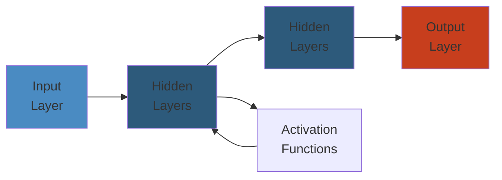

# 🔐 Kubernetes Security — Complete Deep Dive




## ToC
- RBAC | Pod Security Standards | PSA | Network Policies | ServiceAccount | Secrets | SecurityContext | PDB | OPA Gatekeeper | Kyverno | KMS | Image Security | Falco

---

## RBAC

```
  +-------------+          +-------------+
  | Role (ns)   |          | ClusterRole |
  | get pods    |          | get nodes   |
  +------+------+          +------+------+
         |                        |
         v                        v
  +-------------+          +-------------+
  | RoleBinding |          | ClusterRole  |
  | User: alice |          | Binding      |
  +-------------+          | User: admin  |
                           +-------------+
```

```yaml
apiVersion: rbac.authorization.k8s.io/v1
kind: Role
metadata:
  namespace: default
  name: pod-reader
rules:
- apiGroups: [""]
  resources: ["pods"]
  verbs: ["get", "watch", "list"]
---
kind: RoleBinding
subjects:
- kind: User
  name: alice
roleRef:
  kind: Role
  name: pod-reader
```

```bash
kubectl auth can-i create pods --namespace prod
kubectl auth can-i get secrets --as system:serviceaccount:default:app-sa
```

---

## Pod Security Standards

| Level | Policy |
|-------|--------|
| **Privileged** | Unrestricted |
| **Baseline** | No privileged, hostPath, hostNetwork |
| **Restricted** | All baseline + non-root, no NET_RAW, seccomp RuntimeDefault |

**Restricted violations:** `runAsNonRoot: false`, `capabilities.drop: ["ALL"]` missing, `seccompProfile.type != RuntimeDefault`, `allowPrivilegeEscalation: true`

---

## Pod Security Admission

**Labels on namespace:** `pod-security.kubernetes.io/enforce: restricted`, `audit: baseline`, `warn: restricted`

**Modes:** enforce (reject), audit (log), warn (warning). Replaces PSP in v1.25.

---

## Network Policies

```yaml
apiVersion: networking.k8s.io/v1
kind: NetworkPolicy
metadata:
  name: default-deny
spec:
  podSelector: {}
  policyTypes:
  - Ingress
---
apiVersion: networking.k8s.io/v1
kind: NetworkPolicy
metadata:
  name: allow-dns
spec:
  podSelector: {}
  policyTypes:
  - Egress
  egress:
  - to:
    - namespaceSelector: {}
      podSelector:
        matchLabels:
          k8s-app: kube-dns
    ports:
    - protocol: UDP
      port: 53
```

**Cross-ns isolation:** Without explicit allow, pods in ns-A cannot reach ns-B.

---

## ServiceAccount

```yaml
apiVersion: v1
kind: ServiceAccount
metadata:
  name: app-sa
---
apiVersion: v1
kind: Pod
spec:
  serviceAccountName: app-sa
```

**Token projection (short-lived):**
```yaml
volumes:
- name: token
  projected:
    sources:
    - serviceAccountToken:
        path: token
        expirationSeconds: 3600
```

---

## Secrets

```yaml
apiVersion: v1
kind: Secret
type: Opaque
data:
  password: MWYyZDFlMmU2N2Rm     # base64, NOT secure alone
```

**Encryption at rest:**
```yaml
apiVersion: apiserver.config.k8s.io/v1
kind: EncryptionConfiguration
resources:
- resources:
  - secrets
  providers:
  - aescbc:
      keys:
      - name: key1
        secret: c2VjcmV0LWtleS0zMg==
  - identity: {}
```

**External Secrets Operator:**
```yaml
apiVersion: external-secrets.io/v1beta1
kind: ExternalSecret
spec:
  secretStoreRef:
    name: aws-secretsmanager
    kind: ClusterSecretStore
  target:
    name: db-credentials
  data:
  - secretKey: password
    remoteRef:
      key: /prod/db/password
```

---

## SecurityContext

```yaml
spec:
  securityContext:
    runAsUser: 1000
    fsGroup: 2000
    seccompProfile:
      type: RuntimeDefault
  containers:
  - name: app
    securityContext:
      runAsNonRoot: true
      capabilities:
        drop: ["ALL"]
        add: ["NET_BIND_SERVICE"]
      allowPrivilegeEscalation: false
      readOnlyRootFilesystem: true
```

---

## PodDisruptionBudget

```yaml
apiVersion: policy/v1
kind: PodDisruptionBudget
spec:
  minAvailable: 2
  selector:
    matchLabels:
      app: my-app
```

**Protects:** node drain, autoscaler, rolling updates. **Not:** node failures, crashes.

---

## OPA Gatekeeper

```
  Admission Request -> Gatekeeper -> OPA Engine
                           |
                     +-----v------+
                     | Constraint  |
                     | Template    |
                     | (rego)      |
                     +-----+-------+
                           |
                     +-----v-------+
                     | Constraint   |
                     | instances    |
                     +-------------+
```

```rego
package k8srequiredlabels
violation[{"msg": msg}] {
  input.request.kind.kind == "Namespace"
  provided := {label | input.request.object.metadata.labels[label]}
  required := {label | label := input.parameters.labels[_]}
  missing := required - provided
  count(missing) > 0
  msg := sprintf("Missing labels: %v", [missing])
}
```

---

## Kyverno

```yaml
# Validate
apiVersion: kyverno.io/v1
kind: ClusterPolicy
spec:
  validationFailureAction: Enforce
  rules:
  - name: check-readonly
    match:
      any:
      - resources:
          kinds:
          - Pod
    validate:
      message: "readOnlyRootFilesystem required"
      pattern:
        spec:
          containers:
          - securityContext:
              readOnlyRootFilesystem: "true"
---
# Image verification
apiVersion: kyverno.io/v1
kind: ClusterPolicy
metadata:
  name: verify-image
spec:
  rules:
  - name: verify-cosign
    match:
      any:
      - resources:
          kinds:
          - Pod
    verifyImages:
    - image: "ghcr.io/myorg/*"
      attestors:
      - entries:
        - keys:
            publicKeys: |
              -----BEGIN PUBLIC KEY-----
              ...
```

---

## KMS Encryption

```yaml
apiVersion: apiserver.config.k8s.io/v1
kind: EncryptionConfiguration
resources:
- resources:
  - secrets
  providers:
  - kms:
      name: my-kms
      endpoint: unix:///var/run/kmsplugin/socket.sock
      cachesize: 1000
```

**Providers:** AWS KMS, GCP Cloud KMS, Azure Key Vault, Vault

---

## Image Security

```yaml
apiVersion: v1
kind: Secret
type: kubernetes.io/dockerconfigjson
data:
  .dockerconfigjson: <base64>
---
apiVersion: v1
kind: Pod
spec:
  imagePullSecrets:
  - name: regcred
```

**Cosign:** `cosign sign --key cosign.key ghcr.io/myorg/app:v1`

---

## Falco

```
  Syscall -> Kernel Driver (ebpf) -> Userspace Daemon -> Rules -> Alert
```

```yaml
rule: Terminal shell in container
condition: spawned_process and container
  and shell_procs and proc.tty != 0
output: "Shell in container: %proc.name"
priority: WARNING
```

**Outputs:** stdout, HTTP, Slack, PagerDuty, Falcosidekick

---

## Simplest Mental Model

```
K8s security = paranoid apartment building

+------------------------------------------------------------------------------+
|  RBAC = keycard system  |  ServiceAccount = machine badge                    |
|  Secrets = envelopes (not in git!)  |  SecurityContext = no sharp objects   |
|  NetworkPolicy = "apt 3 no-call apt 7"  |  Falco = security cameras         |
|  Gatekeeper/Kyverno = building rules ("every unit needs extinguisher")      |
|  PodSecurity = "no guests with weapons" check at door                       |
|                                                                              |
|  Core: least privilege at every layer. Assume every container compromised.   |
+------------------------------------------------------------------------------+
