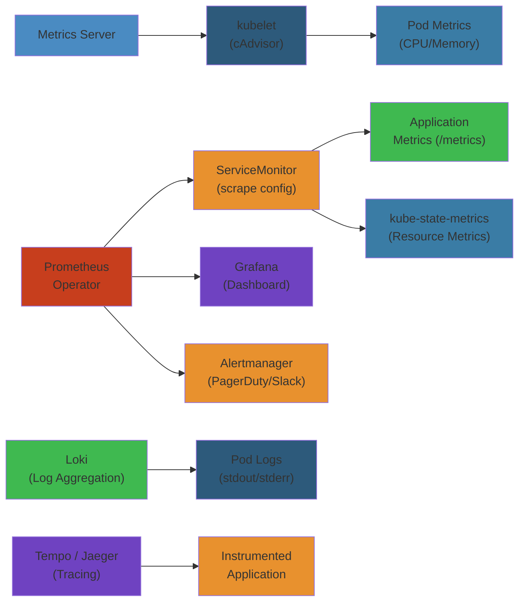

# 📊 Kubernetes Observability — Complete Deep Dive




## ToC


- Metrics Server | kube-state-metrics | Prometheus Operator | VictoriaMetrics vs Prometheus | Grafana | Loki | OpenTelemetry | Jaeger/Tempo | cAdvisor | Eviction | Custom Metrics API

---

## Metrics Server


```
  +-----------+     +-----------+     +-----------+
  | Metrics   |---->| kubelet   |---->| cAdvisor  |
  | Server    |<----| (Summary  |<----| (built-in)|
  +-----------+     +-----------+     +-----------+
       |
       | /apis/metrics.k8s.io/v1beta1
       v
  +-----------+
  | HPA/VPA   |
  | kubectl   |
  | top       |
  +-----------+
```

```bash
kubectl top nodes
kubectl top pods -A
kubectl get --raw /apis/metrics.k8s.io/v1beta1/nodes | jq
```

### HPA Integration


```yaml
apiVersion: autoscaling/v2
kind: HorizontalPodAutoscaler
spec:
  minReplicas: 3
  maxReplicas: 20
  metrics:
  - type: Resource
    resource:
      name: cpu
      target:
        type: Utilization
        averageUtilization: 70
```

---

## kube-state-metrics


**Key metrics:**
```
kube_deployment_status_replicas{deployment="my-app"}
kube_pod_status_phase{phase="Running|Failed"}
kube_node_status_condition{condition="Ready"}
```

**Cardinality:** Use `--metric-labels-allowlist` to restrict pod labels on large clusters.

---

## Prometheus Operator


```
  +------------------+     +------------------+
  | ServiceMonitor   |     | PodMonitor       |
  +--------+---------+     +--------+---------+
           |                        |
           v                        v
  +------------------+     +------------------+
  | Prometheus       |---->| Alertmanager     |
  | (scrape, store)  |     | (dedup, route)   |
  +------------------+     +------------------+
```

### ServiceMonitor & Rules


```yaml
apiVersion: monitoring.coreos.com/v1
kind: ServiceMonitor
spec:
  selector:
    matchLabels:
      app: my-app
  namespaceSelector:
    matchNames:
    - prod
  endpoints:
  - port: metrics
    interval: 15s
---
apiVersion: monitoring.coreos.com/v1
kind: PrometheusRule
spec:
  groups:
  - name: app.rules
    rules:
    - alert: HighErrorRate
      expr: |
        sum(rate(http_requests_total{status=~"5.."}[5m]))
        / sum(rate(http_requests_total[5m])) > 0.05
      for: 5m
      severity: critical
---
apiVersion: monitoring.coreos.com/v1
kind: AlertmanagerConfig
spec:
  route:
    receiver: pagerduty
  receivers:
  - name: pagerduty
    pagerdutyConfigs:
    - routingKey:
        name: pagerduty-key
```

**Thanos:** Prometheus sidecar -> S3/GCS -> Thanos Query + Compactor for long-term HA storage.

---

## VictoriaMetrics vs Prometheus


| Feature | Prometheus | VictoriaMetrics |
|---------|-----------|----------------|
| Storage | Local TSDB | Local + object store |
| HA | Thanos needed | Built-in (vmcluster) |
| Downsampling | Thanos | Built-in |
| Resource usage | Higher | 30-50% less |
| Retention | Days-weeks | Months-years |

```yaml
apiVersion: apps/v1
kind: Deployment
metadata:
  name: victoria-metrics
spec:
  template:
    spec:
      containers:
      - name: main
        image: victoriametrics/victoria-metrics:v1.95.0
        args:
        - -storageDataPath=/data
        - -retentionPeriod=12
```

---

## Grafana Dashboards


**Essential:** Cluster Overview (node/pod resources), Pod Details (per-pod metrics), Nodes (conditions, errors), etcd (leader changes, latency p99)

```yaml
apiVersion: v1
kind: ConfigMap
metadata:
  labels:
    grafana_dashboard: "1"
data:
  cluster-dashboard.json: |
    { "title": "Kubernetes Cluster Overview", "panels": [...] }
```

---

## Loki


```
  +----------+     +----------+     +----------+
  | Promtail |---->| Loki     |---->| Grafana  |
  | (logs)   |     | (store)  |     | (explore)|
  +----------+     +----------+     +----------+
```

**Promtail config:**
```yaml
scrape_configs:
- job_name: kubernetes-pods
  kubernetes_sd_configs:
  - role: pod
  relabel_configs:
  - source_labels: [__meta_kubernetes_namespace]
    target_label: namespace
  - source_labels: [__meta_kubernetes_pod_name]
    target_label: pod
```

**LogQL:**
```logql
{app="nginx", namespace="prod"} |= "error"
rate({app="nginx"} |= "error" [5m])
sum by(pod) (count_over_time({app="nginx"} |= "error" [5m]))
{app="api"} | json | method = "POST" and status >= 500
```

---

## OpenTelemetry


```
  App (auto-instr) -> OTel Collector -> Jaeger/Tempo (traces)
                                    -> Prometheus (metrics)
                                    -> Loki (logs)

  Collector pipeline:
  Receivers (OTLP, Prom) -> Processors (batch, attr, k8s) -> Exporters
```

```yaml
receivers:
  otlp:
    protocols:
      grpc:
        endpoint: 0.0.0.0:4317
processors:
  batch:
    timeout: 1s
  memory_limiter:
    limit_mib: 512
  k8sattributes:
    extract:
      metadata:
      - k8s.pod.uid
      - k8s.namespace.name
      - k8s.node.name
exporters:
  otlp:
    endpoint: tempo:4317
  prometheus:
    endpoint: 0.0.0.0:8889
service:
  pipelines:
    traces:
      receivers: [otlp]
      processors: [k8sattributes, batch]
      exporters: [otlp]
    metrics:
      receivers: [otlp, prometheus]
      processors: [batch]
      exporters: [prometheus]
```

**Auto-instrumentation:** `Instrumentation` CRD + namespace annotation `instrumentation.opentelemetry.io/inject-java: "true"`

---

## Jaeger/Tempo


```
  Service A -> OTel Col -> Tempo/Jaeger -> S3 -> Grafana Explore Traces
```

**Tail sampling (OTel):** Sample 100% errors + 100% traces >1s + 10% probabilistic.

**Exemplars:** Link metrics to traces. Click scatter point in Grafana -> open trace. `http_request_duration_seconds_bucket{le="0.5"} 12 {trace_id="abc"}`

---

## cAdvisor


**Embedded in kubelet.** Exposes `/metrics/cadvisor`.

```bash
kubectl get --raw /api/v1/nodes/node-1/proxy/metrics/cadvisor
kubectl get --raw /api/v1/nodes/node-1/proxy/stats/summary
```

**Key metrics:** `container_cpu_usage_seconds_total`, `container_memory_working_set_bytes`, `container_network_receive_bytes_total`, `container_oom_events_total`

---

## Eviction Pressure


**Memory:** `--eviction-hard=memory.available<100Mi`. Eviction order: BestEffort > Burstable > Guaranteed.

**Disk:** `--eviction-hard=nodefs.available<10%,imagefs.available<15%`. GC dead containers + unused images.

**PID:** `--eviction-hard=pids.available<10%`.

```promql
kube_node_status_condition{condition="MemoryPressure",status="true"}
increase(container_oom_events_total[5m]) > 0
```

---

## Custom Metrics API


**prometheus-adapter:**
```yaml
rules:
- seriesQuery: 'http_requests_total{namespace!="",pod!=""}'
  resources:
    overrides:
      namespace: {resource: namespace}
      pod: {resource: pod}
  name:
    matches: "^http_requests_total$"
    as: "requests_per_second"
  metricsQuery: 'sum(rate(<<.Series>>{<<.LabelMatchers>>}[2m])) by (<<.GroupBy>>)'
```

**HPA with custom metrics:**
```yaml
apiVersion: autoscaling/v2
kind: HorizontalPodAutoscaler
spec:
  metrics:
  - type: Pods
    pods:
      metric:
        name: requests_per_second
      target:
        type: AverageValue
        averageValue: 100
```

**VPA:**
```yaml
apiVersion: autoscaling.k8s.io/v1
kind: VerticalPodAutoscaler
spec:
  targetRef:
    apiVersion: apps/v1
    kind: Deployment
    name: my-app
  updatePolicy:
    updateMode: Auto
  resourcePolicy:
    containerPolicies:
    - containerName: "*"
      minAllowed:
        cpu: 100m
        memory: 128Mi
      maxAllowed:
        cpu: 4
        memory: 8Gi
```

---

## Simplest Mental Model


```
K8s observability = hospital monitoring system

+------------------------------------------------------------------------------+
|  Metrics Server = vitals now  |  ksm = patient chart board                   |
|  Prometheus = central monitor  |  Thanos = records archive                   |
|  Grafana = all patient charts  |  Loki = nurse's log book                   |
|  Promtail = nurse writing logs  |  OpenTelemetry = standard chart format     |
|  Jaeger/Tempo = patient journey ER->Xray->Surgery->Recovery                 |
|  cAdvisor = per-patient machine readouts  |  HPA = call more nurses          |
|                                                                              |
|  Core: Metrics (what is happening) + Logs (what happened) + Traces (where)  |
|  = full observability. If only one, logs are most useful.                   |
+------------------------------------------------------------------------------+


## Production Failure Modes


### Failure 1: Prometheus Memory Exhaustion from High-Cardinality Metrics


| Aspect | Detail |
|--------|--------|
| **Symptoms** | Prometheus OOM killed. Scrape failures. Dashboards show gaps. Alertmanager fires `PrometheusNotificationQueueRunningFull` |
| **Root Cause** | High-cardinality label values: `user_id`, `request_id`, `session_id`, `pod_name` added as metric labels. A single metric `http_requests_total` with `user_id` label explodes cardinality from 10 to 10M series. Prometheus memory usage scales with series count |
| **Detection** | `prometheus_tsdb_head_series` > 5M. Prometheus logs: `error creating in-memory series, series limit exceeded`. `/metrics` endpoint for `http_requests_duration_seconds_bucket` shows 100K+ unique label combinations |
| **Recovery** | Drop high-cardinality labels via relabel_config: `action: labeldrop`, `regex: (user_id|request_id|session_id)`. Increase `storage.tsdb.retention.time`. Add `--storage.tsdb.max-block-duration` |
| **Prevention** | Set `--storage.tsdb.retention.time=15d`. Use recording rules to aggregate high-cardinality metrics. Configure `sample_limit: 10000` per scrape target. Audit metrics before deploying new application |

### Failure 2: DaemonSet Log Shipper (Fluentd/Vector) Unable to Keep Up


| Aspect | Detail |
|--------|--------|
| **Symptoms** | Logs missing from Loki/ELK. Fluentd pod OOM. Node disk fills with buffered logs. Prometheus: `fluentd_output_status_emit_count` flatlines |
| **Root Cause** | Log volume exceeds shipper throughput. Default buffer configuration is memory-based, fills up under load. Output (Loki/Elasticsearch) cannot accept log writes quickly enough. Kubernetes generates 100MB/s of kubelet/SDN logs that overwhelm the pipeline |
| **Detection** | `fluentd_output_status_buffer_queue_length` growing. `fluentd_output_status_retry_count` > 0. Prometheus: `loki_distributor_lines_received_total` flat. Elasticsearch: `cluster: health yellow` |
| **Recovery** | Switch from memory buffer to file buffer: `buffer_type file`, `buffer_path /var/log/fluentd-buffer`. Increase `flush_interval`. Scale log shipper DaemonSet resource limits |
| **Prevention** | Use file-based buffers (not memory). Set `total_limit_size: 10GB`. Drop unnecessary logs: ignore kubelet, SDN, audit logs. Use log sampling: 1:100 for debug, 1:1 for errors |

### Failure 3: kube-state-metrics Causing API Server Load


| Aspect | Detail |
|--------|--------|
| **Symptoms** | API server high CPU. kube-state-metrics OOM. `kubectl` commands slow. Prometheus scrape timeouts |
| **Root Cause** | kube-state-metrics watches all resources across all namespaces. With 10000+ pods, it generates 100K+ metrics per scrape. Each metric is labeled with resource name/namespace, causing high cardinality |
| **Detection** | API server metrics: `apiserver_request_total{verb="WATCH"}` high for kube-state-metrics SA. Prometheus: `prometheus_target_scrape_pool_exceeded_sample_limit_total` |
| **Recovery** | Limit kube-state-metrics to specific resources: `--resources=pods,nodes,deployments`. Use kube-state-metrics sharding for large clusters: `--shard=0 --total-shards=10` |
| **Prevention** | Deploy kube-state-metrics with resource limits. Use `--metric-labels-allowlist` to reduce label cardinality. Use prometheus-operator ServiceMonitor with `sampleLimit: 50000` |

### Failure 4: Jaeger/Tempo Trace Sampling Overwhelming Storage


| Aspect | Detail |
|--------|--------|
| **Symptoms** | Jaeger/Tempo query slow. Storage backend (S3/GCS) costs increase 10x. Trace search can't complete within timeout |
| **Root Cause** | Head-based sampling captures every trace (100% sampling). High-throughput service (10K req/s) generates 10K traces/s. Each trace has 10+ spans, each span = 1-2KB JSON. Total: 200MB/s write to storage |
| **Detection** | `tempo_ingester_bytes_received_total` growing rapidly. S3 `ListBucket` costs spike. Jaeger `jaeger_collector_spans_received` > 100K/sec |
| **Recovery** | Enable probabilistic sampling (1% of traces). Use tail-based sampling: capture traces with errors or high latency regardless of probability |
| **Prevention** | Start with 1% sampling. Use adaptive sampling (OpenTelemetry Collector): auto-adjusts sampling rate based on traffic. Store only error traces at 100%, success traces at 1% |

### Failure 5: Grafana Dashboard Permissions Inconsistency


| Aspect | Detail |
|--------|--------|
| **Symptoms** | Team A can't see their dashboard. Team B sees wrong data source. Dashboard shows "No data" for some users. Organization configuration confusion |
| **Root Cause** | Grafana uses Organization model by default. Dashboards are organization-scoped. Users from org A assigned dashboard from org B. RBAC misconfiguration |
| **Detection** | Dashboard JSON export shows `orgId: 1` for org A users. Grafana API: `GET /api/org` returns `id: 2` for affected users |
| **Recovery** | Switch to Grafana Cloud or Grafana Enterprise with unified RBAC. Use folders for team-level access. Apply `Admin` role to team leads |
| **Prevention** | Use Grafana 10+ with unified RBAC (not legacy org model). Define teams, assign dashboards to folders, grant folder permissions per team. Test: create test user per team and verify access before rollout |

## Edge Cases


| Scenario | Challenge | Solution |
|----------|-----------|----------|
| **Prometheus federation latency** | Cross-cluster metric queries are slow | Use Thanos or Cortex for global view. Avoid Prometheus federation for real-time queries |
| **Loki query timeout** | LogQL query scanning GBs of logs | Add time range filter. Use structured metadata to reduce scan. Pre-aggregate logs via recording rules |
| **Alertmanager deduplication** | Same alert from 3 replicas fires 3 times | Use `repeat_interval`. Set `group_wait` and `group_interval`. Ensure `alertmanager-config` has correct `-cluster.listen-address` |
| **Custom metrics HPA scaling delay** | HPA doesn't react quickly | Reduce `--horizontal-pod-autoscaler-sync-period`. Use KEDA with Prometheus scaler for faster response |
| **OTel collector bottleneck** | Single OTel collector can't handle all spans | Deploy OTel collector as DaemonSet (agent on each node) + deployment (gateway for cross-service). Use load balancing exporter |

## Interview Questions


### Q1 (Beginner): What are the four golden signals of monitoring and why do they matter?


**Answer**: The four golden signals from Google SRE: (1) Latency — time to service a request (average, p50, p95, p99). (2) Traffic — demand on the system (QPS, req/s, active users). (3) Errors — rate of failed requests (HTTP 5xx, exceptions, business errors). (4) Saturation — how "full" the service is (CPU, memory, disk I/O, queue depth). They matter because each signal covers a different failure mode: latency catches slowdowns, traffic catches load spikes, errors catch application bugs, saturation catches resource exhaustion. Without all four, you miss important failure types.

### Q2 (Mid-Level): How does Prometheus service discovery work in Kubernetes?


**Answer**: Prometheus uses the Kubernetes API to discover scrape targets. It watches for pod/service/endpoint changes via the Kubernetes API server. For pods: annotations `prometheus.io/scrape: "true"` mark targets. prometheus-operator uses CRDs: ServiceMonitor (selects services by labels), PodMonitor (selects pods by labels), ProbeMonitor (for blackbox probing). The operator generates Prometheus configuration: each ServiceMonitor becomes a scrape job with relabeling rules. ServiceMonitor selects services with matching labels, then discovers endpoints (ready pods) via endpoints API. Relabeling adds metadata labels: `__meta_kubernetes_namespace`, `__meta_kubernetes_pod_name`, `__meta_kubernetes_service_name`. These become metric labels for filtering and grouping.

### Q3 (Senior): Design an observability platform for a 2000-service microservice architecture.


**Answer**: Three pillars: metrics, logs, traces. Metrics: Prometheus (per-cluster) -> Thanos/Cortex (global view). 2000 services x 1000 metrics each = 2M active series. Thanos sidecar on each Prometheus, object storage (S3) for long-term retention. Query via Thanos Querier. Logs: Loki (per-cluster) with object storage backend. Structured logging (JSON, not free text). logql for querying. 2000 services x 100MB/s = 200GB/s log volume. Sampling at agent level: 1:100 for debug, 1:1 for errors. Traces: OpenTelemetry Collector (agent on each node) -> Tempo (per region). 1% sampling for success, 100% for errors. OTel Collector with batch processor. Storage: S3 for trace data. Correlation: use `trace_id` in logs, `service` label in metrics. Integration: Grafana as unified dashboard. Prometheus as alert source. Service graph: Tempo service graph shows dependency latency. Cost management: labels with high cardinality (user_id, request_id) are the #1 cost driver. Enforce label policy via OPA.

## Cross-References


- [Prometheus Deep Dive](/05-cloud/prometheus/01-prometheus.md) — Alerting rules, recording rules, service discovery
- [CloudWatch Observability](/05-cloud/aws/cloudwatch/02-cloudwatch-observability.md) — AWS-native monitoring, container insights
- [Kubernetes Operations](/05-cloud/aws/eks/02-eks-operations.md) — Node monitoring, cluster autoscaler metrics
- [Distributed Tracing](/06-distributed-systems/04-distributed-tracing.md) — W3C trace context, sampling strategies
- [Stream Processing](/09-distributed-systems/04-stream-processing.md) — Real-time metrics aggregation, anomaly detection

## Related

- [Readme](/05-cloud/README.md)
- [Cloudwatch Deep Dive](/05-cloud/aws/cloudwatch/01-cloudwatch-deep-dive.md)
- [Cloudwatch Observability](/05-cloud/aws/cloudwatch/02-cloudwatch-observability.md)
- [Ec2 Deep Dive](/05-cloud/aws/ec2/01-ec2-deep-dive.md)
- [Ec2 Networking Security](/05-cloud/aws/ec2/02-ec2-networking-security.md)
- [Ecs Deep Dive](/05-cloud/aws/ecs/01-ecs-deep-dive.md)
