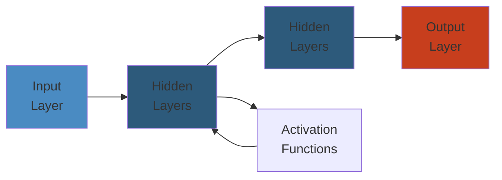

# 🔄 Kubernetes GitOps & Operator Patterns — Complete Deep Dive




## Scope

Production-grade reference for GitOps workflows with ArgoCD, progressive delivery with Argo Rollouts, Workflows & Events, operator pattern with controller-runtime, Helm/Kustomize packaging, and policy-as-code with OPA Gatekeeper / Kyverno.

## Table of Contents

- [GitOps Principles](#gitops-principles)
- [ArgoCD Architecture](#argocd-architecture)
- [Sync Strategies & Waves](#sync-strategies--waves)
- [ApplicationSets](#applicationsets)
- [Argo Rollouts](#argo-rollouts)
- [Argo Workflows](#argo-workflows)
- [Argo Events](#argo-events)
- [Operator Pattern](#operator-pattern)
- [Helm Packaging](#helm-packaging)
- [Kustomize](#kustomize)
- [OPA Gatekeeper / Kyverno](#opa-gatekeeper--kyverno)
- [Failure Analysis](#failure-analysis)

---

## GitOps Principles

```
  ┌─────────────────────────────────────────────────────────────┐
  │                  GitOps Core Principles                       │
  │                                                             │
  │  1. Declarative — entire system described as code            │
  │  2. Versioned — every change in Git, single source of truth  │
  │  3. Immutable — no manual changes, always via PR             │
  │  4. Pull-based — operator pulls desired state from Git       │
  │  5. Reconciled — continuous drift detection + correction     │
  └─────────────────────────────────────────────────────────────┘

  Traditional (Push) vs GitOps (Pull):

  Push:  CI/CD Pipeline ──kubectl apply──► Kubernetes
  Pull:  Git Repo ──watch──► ArgoCD ──sync──► Kubernetes
                              │
                              └── Diff detected? → auto-sync
```

---

## ArgoCD Architecture

### Component Architecture

```
  ┌───────────────────────────────────────────────┐
  │               ArgoCD Namespace                  │
  │                                                 │
  │  ┌─────────────┐      ┌────────────────────┐   │
  │  │ API Server   │      │  Repo Server       │   │
  │  │ (gRPC/REST)  │◄────►│  (Git operations)  │   │
  │  │ port 443     │      │  port 8081         │   │
  │  └──────┬───────┘      └────────────────────┘   │
  │         │                                        │
  │         │              ┌────────────────────┐   │
  │         │              │ Application        │   │
  │         │              │ Controller         │   │
  │         └──────────────►  (reconciliation   │   │
  │                        │   loop, status)    │   │
  │                        └─────────┬──────────┘   │
  │                                  │              │
  │  ┌─────────────┐      ┌─────────┴──────────┐   │
  │  │  Redis Cache │      │  Dex/SSO           │   │
  │  │  (state)    │      │  (OIDC provider)   │   │
  │  └─────────────┘      └────────────────────┘   │
  └───────────────────────────────────────────────┘
```

### Application CRD

```yaml
apiVersion: argoproj.io/v1alpha1
kind: Application
metadata:
  name: my-app
  namespace: argocd
spec:
  project: default
  source:
    repoURL: https://github.com/company/helm-charts.git
    targetRevision: HEAD
    path: charts/my-app
    helm:
      valueFiles:
        - values-prod.yaml
      parameters:
        - name: replicaCount
          value: "5"
  destination:
    server: https://kubernetes.default.svc
    namespace: production
  syncPolicy:
    automated:
      prune: true           # delete resources removed from Git
      selfHeal: true         # revert manual changes
      allowEmpty: false
    syncOptions:
      - CreateNamespace=true
      - PrunePropagationPolicy=foreground
      - PruneLast=true        # prune after successful sync
  revisionHistoryLimit: 10
```

---

## Sync Strategies & Waves

### Sync Flow

```
  Git Commit ──► ArgoCD detects drift
                     │
                     ▼
              ┌──────────────┐
              │  Sync Phases  │
              │  PreSync      │  ├── Hook: db migration job
              │  Sync         │  ├── Resource creation
              │  PostSync     │  └── Hook: smoke test
              └──────────────┘
                     │
                     ▼
              ┌──────────────┐
              │  Sync Waves   │  Ordered groups
              │  Wave -5      │  CRDs (install first)
              │  Wave -4      │  Namespaces
              │  Wave -3      │  Secrets & ConfigMaps
              │  Wave -2      │  Storage (PVC, StorageClass)
              │  Wave -1      │  Networking (Ingress, Service)
              │  Wave 0       │  Workloads (Deployments)
              └──────────────┘
                     │
                     ▼
              ┌──────────────┐
              │  Health Check │
              │  Sync = green │
              └──────────────┘
```

### Sync Waves Annotation

```yaml
apiVersion: v1
kind: Namespace
metadata:
  name: production
  annotations:
    argocd.argoproj.io/sync-wave: "-4"   # created before workloads
---
apiVersion: v1
kind: Secret
metadata:
  name: db-credentials
  namespace: production
  annotations:
    argocd.argoproj.io/sync-wave: "-3"   # secrets before deployments
---
apiVersion: apps/v1
kind: Deployment
metadata:
  name: web-app
  namespace: production
  annotations:
    argocd.argoproj.io/sync-wave: "0"    # workloads last
```

### Sync Hooks

```yaml
# PreSync hook: run DB migration before deployment
apiVersion: batch/v1
kind: Job
metadata:
  name: db-migration
  namespace: production
  annotations:
    argocd.argoproj.io/hook: PreSync
    argocd.argoproj.io/hook-delete-policy: HookSucceeded  # cleanup on success
spec:
  template:
    spec:
      containers:
      - name: migrate
        image: myapp:1.0.0
        command: ["./migrate-db.sh"]
      restartPolicy: Never
  backoffLimit: 2

---
# SyncFail hook: rollback notification
apiVersion: v1
kind: ConfigMap
metadata:
  name: rollback-notification
  namespace: production
  annotations:
    argocd.argoproj.io/hook: SyncFail
    argocd.argoproj.io/hook-delete-policy: BeforeHookCreation
data:
  message: "Sync failed for revision {{ .argocd.app.spec.source.targetRevision }}"

---
# PostSync hook: smoke test
apiVersion: batch/v1
kind: Job
metadata:
  name: smoke-test
  namespace: production
  annotations:
    argocd.argoproj.io/hook: PostSync
    argocd.argoproj.io/hook-delete-policy: HookSucceeded
spec:
  template:
    spec:
      containers:
      - name: test
        image: curlimages/curl
        command: ["sh", "-c", "curl -f http://web-app:8080/health"]
      restartPolicy: Never
```

---

## ApplicationSets

### ApplicationSet Generators

```yaml
apiVersion: argoproj.io/v1alpha1
kind: ApplicationSet
metadata:
  name: multi-cluster-apps
  namespace: argocd
spec:
  generators:
    # List generator — explicit list
    - list:
        elements:
          - cluster: prod-east
            url: https://prod-east.example.com
            env: production
          - cluster: prod-west
            url: https://prod-west.example.com
            env: production

    # Git generator — per-directory or per-file
    - git:
        repoURL: https://github.com/company/cluster-configs.git
        revision: HEAD
        directories:
          - path: clusters/*

    # Cluster generator — all registered clusters
    - clusters:
        selector:
          matchLabels:
            env: production

    # Pull Request generator — ephemeral environments per PR
    - pullRequest:
        github:
          owner: company
          repo: myapp
          api: https://api.github.com
          labels:
            - preview-env

    # Matrix generator — combine two generators
    - matrix:
        generators:
          - list:
              elements:
                - env: staging
                - env: production
          - git:
              repoURL: https://github.com/company/services.git
              revision: HEAD
              directories:
                - path: services/*

  template:
    metadata:
      name: '{{ env }}-{{ path.basename }}'
    spec:
      project: default
      source:
        repoURL: https://github.com/company/helm-charts.git
        targetRevision: HEAD
        path: 'charts/{{ path.basename }}'
        helm:
          parameters:
            - name: environment
              value: '{{ env }}'
      destination:
        server: '{{ url }}'
        namespace: '{{ env }}'
```

---

## Argo Rollouts

### Blue-Green Deployment

```yaml
apiVersion: argoproj.io/v1alpha1
kind: Rollout
metadata:
  name: web-app
spec:
  replicas: 10
  revisionHistoryLimit: 2
  selector:
    matchLabels:
      app: web-app
  template:
    metadata:
      labels:
        app: web-app
    spec:
      containers:
      - name: app
        image: myapp:1.0.0
        ports:
        - containerPort: 8080
  strategy:
    blueGreen:
      activeService: web-app-active    # serves live traffic
      previewService: web-app-preview   # new version service
      autoPromotionEnabled: false       # manual promotion
      # Scale up preview to 100% before cutover
      previewReplicaCount: 10
      # Post-promotion: scale down old ReplicaSet after N seconds
      scaleDownDelaySeconds: 60
      # Analysis before promotion
      prePromotionAnalysis:
        templates:
        - templateName: smoke-test
      postPromotionAnalysis:
        templates:
        - templateName: success-rate
      # Abort if analysis fails
      abortScaleDownDelaySeconds: 30
```

### Canary Deployment with Traffic Routing

```yaml
apiVersion: argoproj.io/v1alpha1
kind: Rollout
metadata:
  name: web-app-canary
spec:
  replicas: 10
  selector:
    matchLabels:
      app: web-app
  template:
    metadata:
      labels:
        app: web-app
    spec:
      containers:
      - name: app
        image: myapp:1.0.0
  strategy:
    canary:
      steps:
      - setWeight: 10           # 10% traffic to canary
      - pause: {duration: 1m}   # observe for 1 minute
      - setWeight: 30
      - pause: {duration: 5m}
      - setWeight: 50
      - pause: {duration: 5m}
      - setWeight: 75
      - pause: {duration: 5m}
      - setWeight: 100          # full traffic to new version
      trafficRouting:
        nginx:
          stableIngress: web-app-ingress   # Nginx ingress
        # ambassador:
        #   mappings:
        #   - web-app-mapping
        # smi:
        #   trafficSplitName: web-app-split
      analysis:
        templates:
        - templateName: success-rate
        - templateName: latency-check
```

### Analysis Template

```yaml
apiVersion: argoproj.io/v1alpha1
kind: AnalysisTemplate
metadata:
  name: success-rate
spec:
  metrics:
  - name: success-rate
    interval: 30s               # evaluate every 30s
    count: 10                   # total evaluations
    failureLimit: 2             # fail after 2 failures
    successCondition: result >= 0.99   # 99% success rate
    provider:
      prometheus:
        address: http://prometheus:9090
        query: >
          sum(rate(
            http_requests_total{
              status=~"2..|3..",
              kubernetes_namespace="production",
              kubernetes_pod_name=~"{{ rollout.metadata.name }}-.*"
            }[1m]
          )) /
          sum(rate(
            http_requests_total{
              kubernetes_namespace="production",
              kubernetes_pod_name=~"{{ rollout.metadata.name }}-.*"
            }[1m]
          ))

---
apiVersion: argoproj.io/v1alpha1
kind: AnalysisTemplate
metadata:
  name: latency-check
spec:
  metrics:
  - name: p99-latency
    interval: 30s
    count: 5
    failureLimit: 1
    successCondition: result <= 500   # p99 < 500ms
    provider:
      prometheus:
        address: http://prometheus:9090
        query: >
          histogram_quantile(0.99,
            sum(rate(
              http_request_duration_seconds_bucket{
                kubernetes_namespace="production",
                kubernetes_pod_name=~"{{ rollout.metadata.name }}-.*"
              }[1m]
            )) by (le)
          )
```

---

## Argo Workflows

### DAG Workflow

```yaml
apiVersion: argoproj.io/v1alpha1
kind: Workflow
metadata:
  generateName: ci-pipeline-
spec:
  entrypoint: main
  templates:
  - name: main
    dag:
      tasks:
      - name: lint
        template: lint-task
      - name: build
        template: build-task
        dependencies: [lint]
      - name: unit-test
        template: test-task
        dependencies: [lint]
      - name: integration-test
        template: integration-task
        dependencies: [build]
      - name: deploy-staging
        template: deploy-task
        dependencies: [unit-test, integration-test]
        arguments:
          parameters: [{name: env, value: staging}]
      - name: e2e-test
        template: e2e-task
        dependencies: [deploy-staging]
      - name: deploy-production
        template: deploy-task
        dependencies: [e2e-test]
        arguments:
          parameters: [{name: env, value: production}]

  - name: lint-task
    container:
      image: golangci/golangci-lint:v1.55
      command: [golangci-lint, run, ./...]

  - name: build-task
    container:
      image: golang:1.21
      command: [go, build, -o, /tmp/app]
    outputs:
      artifacts:
      - name: binary
        path: /tmp/app
        s3:
          key: builds/{{ workflow.id }}/app
          endpoint: s3.amazonaws.com
          bucket: my-build-artifacts
          accessKeySecret:
            name: aws-creds
            key: accesskey
          secretKeySecret:
            name: aws-creds
            key: secretkey

  - name: deploy-task
    inputs:
      parameters:
      - name: env
    container:
      image: bitnami/kubectl:latest
      command: [kubectl, set, image, deployment/my-app, app=myapp:{{ workflow.id }}, -n, '{{ inputs.parameters.env }}']
```

### Cron Workflow

```yaml
apiVersion: argoproj.io/v1alpha1
kind: CronWorkflow
metadata:
  name: nightly-cleanup
spec:
  schedule: "0 2 * * *"          # 2 AM daily
  timezone: "America/New_York"
  startingDeadlineSeconds: 300
  concurrencyPolicy: Replace     # kill previous if still running
  workflowSpec:
    entrypoint: cleanup
    templates:
    - name: cleanup
      container:
        image: bitnami/kubectl:latest
        command:
        - sh
        - -c
        - |
          kubectl delete pod --field-selector=status.phase=Succeeded
          kubectl delete pod --field-selector=status.phase=Failed
```

---

## Argo Events

### Event Source + Sensor + Trigger

```yaml
# Event Source: listen for GitHub webhook
apiVersion: argoproj.io/v1alpha1
kind: EventSource
metadata:
  name: github-events
spec:
  service:
    ports:
    - port: 12000
      targetPort: 12000
  github:
    myapp-repo:
      repositories:
      - owner: company
        names:
        - myapp
      webhook:
        endpoint: /push
        port: "12000"
        url: https://webhook.company.com
        method: POST
      events:
      - push
      webhookSecret:
        name: github-webhook-secret
        key: secret

---
# Sensor: map event to triggers
apiVersion: argoproj.io/v1alpha1
kind: Sensor
metadata:
  name: github-sensor
spec:
  dependencies:
  - name: push-event
    eventSourceName: github-events
    eventName: myapp-repo
    filters:
      data:
      - path: body.ref
        type: string
        value: refs/heads/main
  triggers:
  - template:
      name: workflow-trigger
      k8s:
        operation: create
        source:
          resource:
            apiVersion: argoproj.io/v1alpha1
            kind: Workflow
            metadata:
              generateName: ci-pipeline-
            spec:
              entrypoint: main
              templates: ...
        parameters:
        - src:
            dependencyName: push-event
            dataKey: body.head_commit.id
          dest: spec.arguments.parameters.0.value
```

---

## Operator Pattern

### Reconciliation Loop

```
  ┌─────────────────────────────────────────────────────────────┐
  │              Controller Reconciliation Loop                    │
  │                                                             │
  │  ┌──────────┐    ┌──────────┐    ┌──────────┐               │
  │  │  Watch   │───►│  Informer│───►│ Workqueue│               │
  │  │ (List-   │    │ (Event   │    │ (Rate    │               │
  │  │  Watch)  │    │  Handler)│    │  Limited)│               │
  │  └──────────┘    └──────────┘    └────┬─────┘               │
  │                                       │                     │
  │                                       ▼                     │
  │  ┌──────────┐    ┌──────────┐    ┌──────────┐               │
  │  │  Update  │◄───│ Reconciler│◄───│  Worker   │              │
  │  │  Status  │    │ (Reconcile│    │ (Goroutine)             │
  │  │          │    │  loop)    │    │          │               │
  │  └──────────┘    └──────────┘    └──────────┘               │
  │                                                             │
  │  Flow:                                                      │
  │  1. Informer watches CRD changes                            │
  │  2. Event handler enqueues reconcile request                │
  │  3. Worker dequeues, calls Reconciler.Reconcile()           │
  │  4. Reconciler reads desired state (spec)                   │
  │  5. Diff with current state (status + children)             │
  │  6. Apply changes (create/update/delete children)           │
  │  7. Update status subresource                               │
  │  8. Return result (re-queue on error with backoff)          │
  └─────────────────────────────────────────────────────────────┘
```

### controller-runtime Operator

```go
package controllers

import (
    "context"
    "fmt"
    "time"

    appsv1 "k8s.io/api/apps/v1"
    corev1 "k8s.io/api/core/v1"
    "k8s.io/apimachinery/pkg/api/errors"
    metav1 "k8s.io/apimachinery/pkg/apis/meta/v1"
    "k8s.io/apimachinery/pkg/runtime"
    "k8s.io/apimachinery/pkg/types"
    "k8s.io/client-go/tools/record"
    ctrl "sigs.k8s.io/controller-runtime"
    "sigs.k8s.io/controller-runtime/pkg/client"
    "sigs.k8s.io/controller-runtime/pkg/controller/controllerutil"
    "sigs.k8s.io/controller-runtime/pkg/log"
    "sigs.k8s.io/controller-runtime/pkg/predicate"

    myappv1 "github.com/company/my-operator/api/v1"
)

// MyAppReconciler reconciles a MyApp object
type MyAppReconciler struct {
    client.Client
    Scheme  *runtime.Scheme
    Recorder record.EventRecorder
}

//+kubebuilder:rbac:groups=myapp.company.io,resources=myapps,verbs=get;list;watch;create;update;patch;delete
//+kubebuilder:rbac:groups=myapp.company.io,resources=myapps/status,verbs=get;update;patch
//+kubebuilder:rbac:groups=myapp.company.io,resources=myapps/finalizers,verbs=update
//+kubebuilder:rbac:groups=apps,resources=deployments,verbs=get;list;watch;create;update;patch;delete

func (r *MyAppReconciler) Reconcile(ctx context.Context, req ctrl.Request) (ctrl.Result, error) {
    log := log.FromContext(ctx)

    // 1. Fetch the MyApp instance
    myapp := &myappv1.MyApp{}
    if err := r.Get(ctx, req.NamespacedName, myapp); err != nil {
        if errors.IsNotFound(err) {
            return ctrl.Result{}, nil  // deleted
        }
        return ctrl.Result{}, err
    }

    // 2. Handle deletion — finalizer logic
    if myapp.ObjectMeta.DeletionTimestamp.IsZero() {
        if !controllerutil.ContainsFinalizer(myapp, "myapp.company.io/finalizer") {
            controllerutil.AddFinalizer(myapp, "myapp.company.io/finalizer")
            if err := r.Update(ctx, myapp); err != nil {
                return ctrl.Result{}, err
            }
        }
    } else {
        // Finalizer cleanup
        if controllerutil.ContainsFinalizer(myapp, "myapp.company.io/finalizer") {
            if err := r.cleanupExternalResources(ctx, myapp); err != nil {
                return ctrl.Result{}, err
            }
            controllerutil.RemoveFinalizer(myapp, "myapp.company.io/finalizer")
            if err := r.Update(ctx, myapp); err != nil {
                return ctrl.Result{}, err
            }
        }
        return ctrl.Result{}, nil
    }

    // 3. Reconcile deployment
    deployment, err := r.reconcileDeployment(ctx, myapp)
    if err != nil {
        r.Recorder.Event(myapp, corev1.EventTypeWarning,
            "DeploymentFailed", fmt.Sprintf("Failed to reconcile Deployment: %v", err))
        return ctrl.Result{RequeueAfter: 10 * time.Second}, err
    }

    // 4. Reconcile service
    if err := r.reconcileService(ctx, myapp); err != nil {
        return ctrl.Result{RequeueAfter: 10 * time.Second}, err
    }

    // 5. Update status
    myapp.Status.AvailableReplicas = deployment.Status.AvailableReplicas
    myapp.Status.Ready = deployment.Status.ReadyReplicas >= *myapp.Spec.Replicas
    if err := r.Status().Update(ctx, myapp); err != nil {
        return ctrl.Result{}, err
    }

    r.Recorder.Event(myapp, corev1.EventTypeNormal,
        "Reconciled", "Successfully reconciled MyApp")

    return ctrl.Result{RequeueAfter: 30 * time.Second}, nil
}

func (r *MyAppReconciler) reconcileDeployment(ctx context.Context, myapp *myappv1.MyApp) (*appsv1.Deployment, error) {
    dep := &appsv1.Deployment{
        ObjectMeta: metav1.ObjectMeta{
            Name:      myapp.Name,
            Namespace: myapp.Namespace,
        },
    }

    _, err := controllerutil.CreateOrUpdate(ctx, r.Client, dep, func() error {
        dep.Spec.Replicas = myapp.Spec.Replicas
        dep.Spec.Selector = &metav1.LabelSelector{
            MatchLabels: map[string]string{"app": myapp.Name},
        }
        dep.Spec.Template = corev1.PodTemplateSpec{
            ObjectMeta: metav1.ObjectMeta{
                Labels: map[string]string{"app": myapp.Name},
            },
            Spec: corev1.PodSpec{
                Containers: []corev1.Container{
                    {
                        Name:  "app",
                        Image: myapp.Spec.Image,
                        Ports: []corev1.ContainerPort{
                            {ContainerPort: myapp.Spec.Port},
                        },
                    },
                },
            },
        }
        return controllerutil.SetControllerReference(myapp, dep, r.Scheme)
    })

    return dep, err
}

func (r *MyAppReconciler) cleanupExternalResources(ctx context.Context, myapp *myappv1.MyApp) error {
    log.FromContext(ctx).Info("Cleaning up external resources", "myapp", myapp.Name)
    return nil
}

// SetupWithManager wires the controller
func (r *MyAppReconciler) SetupWithManager(mgr ctrl.Manager) error {
    return ctrl.NewControllerManagedBy(mgr).
        For(&myappv1.MyApp{}).
        Owns(&appsv1.Deployment{}).     // auto-reconcile on child changes
        WithEventFilter(predicate.GenerationChangedPredicate{}).  // ignore status-only changes
        Complete(r)
}
```

### CRD Definition

```yaml
apiVersion: apiextensions.k8s.io/v1
kind: CustomResourceDefinition
metadata:
  name: myapps.myapp.company.io
spec:
  group: myapp.company.io
  names:
    kind: MyApp
    plural: myapps
    singular: myapp
    shortNames:
    - ma
  scope: Namespaced
  versions:
  - name: v1
    served: true
    storage: true
    schema:
      openAPIV3Schema:
        type: object
        properties:
          spec:
            type: object
            required: ["replicas", "image"]
            properties:
              replicas:
                type: integer
                minimum: 1
                maximum: 100
              image:
                type: string
              port:
                type: integer
                default: 8080
          status:
            type: object
            properties:
              availableReplicas:
                type: integer
              ready:
                type: boolean
    subresources:
      status: {}      # /status endpoint
    additionalPrinterColumns:
    - name: Replicas
      type: integer
      jsonPath: .spec.replicas
    - name: Ready
      type: boolean
      jsonPath: .status.ready
```

---

## Helm Packaging

### Chart Structure

```
  charts/my-app/
  ├── Chart.yaml              # metadata, version, dependencies
  ├── values.yaml             # default configuration values
  ├── values-prod.yaml        # environment-specific overrides
  ├── values-staging.yaml
  ├── templates/
  │   ├── _helpers.tpl        # templates helpers (define blocks)
  │   ├── deployment.yaml     # Deployment template
  │   ├── service.yaml        # Service template
  │   ├── ingress.yaml        # Ingress template
  │   ├── configmap.yaml      # ConfigMap template
  │   ├── secret.yaml         # Secret template (with lookups)
  │   ├── hpa.yaml            # HPA template
  │   ├── pdb.yaml            # PodDisruptionBudget
  │   └── tests/
  │       └── test-connection.yaml  # chart test pod
  ├── crds/
  │   └── myapp-crd.yaml      # CRDs (installed first)
  └── NOTES.txt               # post-installation notes
```

### Values and Templating

```yaml
# values.yaml
replicaCount: 3
image:
  repository: myapp
  tag: latest
  pullPolicy: IfNotPresent

service:
  type: ClusterIP
  port: 8080

ingress:
  enabled: true
  className: nginx
  hosts:
    - host: myapp.company.com
      paths:
      - path: /
        pathType: Prefix
  tls:
  - secretName: myapp-tls
    hosts:
    - myapp.company.com

resources:
  limits:
    cpu: 1
    memory: 512Mi
  requests:
    cpu: 500m
    memory: 256Mi

autoscaling:
  enabled: true
  minReplicas: 3
  maxReplicas: 20
  targetCPUUtilizationPercentage: 70

env:
  - name: ENVIRONMENT
    value: production
  - name: DB_HOST
    valueFrom:
      secretKeyRef:
        name: db-credentials
        key: host

nodeSelector: {}
tolerations: []
affinity: {}
```

### Helm Hooks

```yaml
# templates/migration-job.yaml
apiVersion: batch/v1
kind: Job
metadata:
  name: "{{ .Release.Name }}-migrate"
  annotations:
    "helm.sh/hook": pre-upgrade,pre-install  # run before install/upgrade
    "helm.sh/hook-weight": "-5"               # lower = earlier
    "helm.sh/hook-delete-policy": hook-succeeded,before-hook-creation
spec:
  template:
    spec:
      restartPolicy: Never
      containers:
      - name: migrate
        image: "{{ .Values.image.repository }}:{{ .Values.image.tag }}"
        command: ["./migrate"]
```

---

## Kustomize

### Base + Overlays Structure

```
  k8s/
  ├── base/
  │   ├── kustomization.yaml      # base config
  │   ├── deployment.yaml
  │   ├── service.yaml
  │   └── configmap.yaml
  └── overlays/
      ├── production/
      │   ├── kustomization.yaml   # environment patches
      │   ├── replica_patch.yaml   # strategic merge patch
      │   └── ingress.yaml
      └── staging/
          ├── kustomization.yaml
          └── replica_patch.yaml
```

### Kustomization Examples

```yaml
# base/kustomization.yaml
apiVersion: kustomize.config.k8s.io/v1beta1
kind: Kustomization

resources:
- deployment.yaml
- service.yaml
- configmap.yaml

commonLabels:
  app.kubernetes.io/managed-by: kustomize
  app.kubernetes.io/part-of: myapp

namePrefix: myapp-

configMapGenerator:
- name: app-config
  literals:
  - LOG_LEVEL=info
  - CACHE_TTL=300

secretGenerator:
- name: app-secrets
  envs:
  - secrets.env

images:
- name: myapp
  newTag: 1.0.0

patches:
  # JSON patch — add sidecar
  - target:
      kind: Deployment
      name: myapp
    patch: |-
      - op: add
        path: /spec/template/spec/containers/-
        value:
          name: sidecar
          image: sidecar:latest

replacements:
- source:
    kind: ConfigMap
    name: app-config
    fieldPath: data.LOG_LEVEL
  targets:
  - select:
      kind: Deployment
    fieldPaths:
    - spec.template.spec.containers.[name=app].env.[name=LOG_LEVEL].value

---
# overlays/production/kustomization.yaml
apiVersion: kustomize.config.k8s.io/v1beta1
kind: Kustomization

resources:
- ../../base
- ingress.yaml

patches:
- path: replica_patch.yaml
# Strategic merge patch
#   apiVersion: apps/v1
#   kind: Deployment
#   metadata:
#     name: myapp
#   spec:
#     replicas: 10
```

---

## OPA Gatekeeper / Kyverno

### OPA Gatekeeper — Constraint Template

```rego
# templates/mandatory_labels_template.yaml
apiVersion: templates.gatekeeper.sh/v1
kind: ConstraintTemplate
metadata:
  name: k8srequiredlabels
spec:
  crd:
    spec:
      names:
        kind: K8sRequiredLabels
      validation:
        openAPIV3Schema:
          type: object
          properties:
            labels:
              type: array
              items:
                type: string
  targets:
    - target: admission.k8s.gatekeeper.sh
      rego: |
        package k8srequiredlabels

        violation[{"msg": msg}] {
          provided := {label | input.review.object.metadata.labels[label]}
          required := {label | label := input.parameters.labels[_]}
          missing := required - provided
          count(missing) > 0
          msg := sprintf("Missing labels: %v", [missing])
        }

---
# constraints/all_ns_must_have_owner.yaml
apiVersion: constraints.gatekeeper.sh/v1beta1
kind: K8sRequiredLabels
metadata:
  name: ns-must-have-owner
spec:
  match:
    kinds:
      - apiGroups: [""]
        kinds: ["Namespace"]
  parameters:
    labels:
      - "owner"
      - "cost-center"
```

### Kyverno — ClusterPolicy

```yaml
apiVersion: kyverno.io/v1
kind: ClusterPolicy
metadata:
  name: require-labels
spec:
  validationFailureAction: Enforce     # Audit or Enforce
  background: true                     # audit existing resources
  rules:
  - name: check-required-labels
    match:
      any:
      - resources:
          kinds:
          - Pod
          - Deployment
          - Service
    validate:
      message: "Labels 'app.kubernetes.io/name' and 'app.kubernetes.io/version' are required"
      pattern:
        metadata:
          labels:
            app.kubernetes.io/name: "?*"
            app.kubernetes.io/version: "?*"

  - name: block-latest-tag
    match:
      any:
      - resources:
          kinds:
          - Deployment
          - StatefulSet
    validate:
      message: "Using 'latest' tag is not allowed"
      pattern:
        spec:
          template:
            spec:
              containers:
              - image: "!*:latest"

  - name: generate-network-policy
    match:
      any:
      - resources:
          kinds:
          - Namespace
    generate:
      apiVersion: networking.k8s.io/v1
      kind: NetworkPolicy
      name: default-deny
      namespace: "{{ request.object.metadata.name }}"
      synchronize: true
      data:
        spec:
          podSelector: {}
          policyTypes:
          - Ingress
          - Egress

  - name: mutate-probes
    match:
      any:
      - resources:
          kinds:
          - Deployment
    mutate:
      patchStrategicMerge:
        spec:
          template:
            spec:
              containers:
              - (name): "*"
                resources:
                  limits:
                    memory: "512Mi"
                readinessProbe:
                  httpGet:
                    path: /health
                    port: 8080
                  initialDelaySeconds: 5
                  periodSeconds: 10
```

---

## Failure Analysis

### 1. ArgoCD Out of Sync (Stuck)

```
  Symptoms:
    - Application status: OutOfSync
    - Sync fails repeatedly
    - Phase: Error or Unknown

  Root Causes:
    1. Resource already exists with different owner (orphaned)
       Check: kubectl get <resource> -n <ns> -o yaml | grep ownerReferences
    2. CRD version mismatch (Helm chart referencing non-existent API)
       Check: helm template | grep apiVersion
    3. Namespace not created (sync wave wrong order)
       Check: sync wave annotations
    4. Immutable field change (e.g., selector labels on Deployment)
       Check: "field is immutable" error in controller logs

  Resolution:
    - argocd app sync my-app --prune --force
    - Delete blocking resource and let re-sync recreate
    - Update sync wave annotations
    - Use Replace=true sync option for immutable fields
```

### 2. Rollout Stuck or Aborted

```
  Symptoms:
    - Rollout phase: Paused (with abort condition)
    - Canary/blue-green stuck in step
    - Analysis runs failed

  Root Causes:
    1. Analysis metric query failing (invalid PromQL)
       Check: analysis run status, metric provider connectivity
    2. Service selector mismatch (active service not pointing to new RS)
       Check: kubectl describe svc web-app-active
    3. Traffic routing misconfigured (nginx ingress annotation issue)
       Check: rollout status, traffic routing config
    4. Insufficient replicas to serve both versions in canary
       Check: replica count during canary (need extra capacity)

  Resolution:
    - argoproj/rollout abort my-app         # rollback
    - argoproj/rollout promote my-app       # force promote (careful)
    - Fix analysis template and retry
    - Ensure services use correct label selectors
```

### 3. Operator Reconciliation Loop Failure

```
  Symptoms:
    - CRD status shows Ready=false
    - Operator logs: continuous error + backoff
    - Workqueue depth growing
    - Controller resource usage high

  Root Causes:
    1. API server throttling (rate limit)
       Check: kube-apiserver request count
    2. Informer watch timeout (resource version too old)
       Check: controller logs: "too old resource version"
    3. Panic in Reconciler (nil pointer, out of bounds)
       Check: operator pod logs for stack trace
    4. Resource conflict (conflict updating status subresource)
       Check: "Operation cannot be fulfilled" error

  Resolution:
    - Increase client-side QPS: mgr.GetClient() rate limiter
    - Increase resync period: mgr options.SyncPeriod
    - Add recovery: defer recover() in Reconcile
    - Use retry.RetryOnConflict for updates
    - Limit concurrent reconciles: MaxConcurrentReconciles=5
```

### 4. Kyverno/Gatekeeper Policy Enforcement Issues

```
  Symptoms:
    - Resources being created but violating policy
    - Admission controller timeout
    - ValidatingWebhookConfiguration failure

  Root Causes:
    1. Webhook timeout (default 30s, but config can be < 10s)
       Check: ValidatingWebhookConfiguration failurePolicy
    2. Rego compilation error in Gatekeeper template
       Check: constraint status.errors
    3. Kyverno policy exception not configured
       Check: policyExceptions for known workloads
    4. Missing RBAC for webhook cert rotation
       Check: cert-manager certificate expiry

  Resolution:
    - Increase webhook timeout: timeoutSeconds: 20
    - Compile Rego offline: opa eval --format pretty
    - Add policyExceptions for known system workloads
    - Switch to failurePolicy: Ignore temporarily
    - Use Kyverno backgroundScan: false for perf
```
