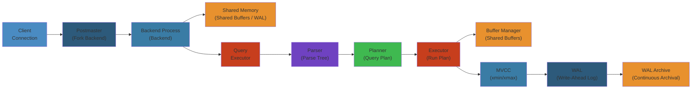
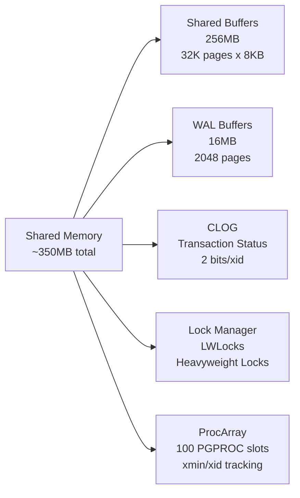
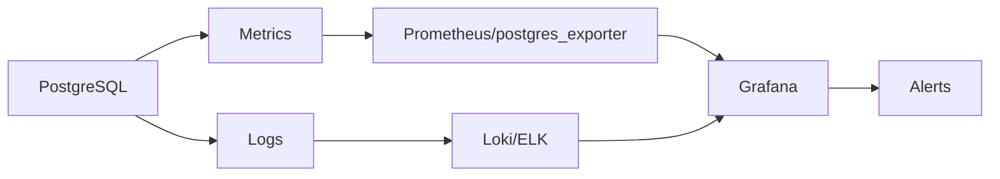

# 🐘 PostgreSQL Internals — Complete Deep Dive

> **Scope**: PostgreSQL process architecture, shared memory, connection lifecycle, shared buffers and buffer manager, MVCC, WAL, query processing (parser/planner/executor), vacuum/autovacuum, indexing (B-tree/GiST/GIN/BRIN/Bloom), replication (streaming/logical), backup/PITR — complete internal architecture of the world's most advanced open-source database.

> **Related**: [01-linux-kernel-architecture.md](../os/01-linux-kernel-architecture.md), [03-memory-management.md](../os/03-memory-management.md), [04-io-models.md](../os/04-io-models.md)

---

## LAYER 1: Beginner's Mental Model 🧠

### Why PostgreSQL?

PostgreSQL = **ACID guarantees you trust with your life**

**Facebook transactional systems:** Every payment, every user state change = PostgreSQL ✓ (you can rely on)
**SQLite in phone:** Fast but can lose data if crash (acceptable risk for mobile)
**Redis in-memory:** Super fast but data goes away if reboot (OK for cache, not for ledger)

PostgreSQL trades speed for **correctness**: Your data won't be corrupted, even if server explodes.

### Real Impact

```
Bug in app: Processes 1000 refunds, crashes halfway → 500 processed

Without PostgreSQL:
  500 customers got refunds, 500 didn't (inconsistent)
  Finance: "Which 500?" → Audit nightmare

With PostgreSQL (ACID):
  Either all 1000 refund OR zero refund (transaction atomicity)
  Finance: "It failed, retry" → Clear
```

**Cost of data corruption:** $1M+ in audits + refunds

---

## LAYER 4: Production Failures & Debugging 🚨

### Common PostgreSQL Failures

| Failure | Symptom | Root Cause | Prevention |
|---------|---------|-----------|-----------|
| **Bloat** | Query slow, table 50GB (should be 5GB) | Too many dead rows (undead tuples) | Aggressive autovacuum settings |
| **Transaction Wraparound** | DB goes read-only | xid counter wraps (2B tx limit) | Vacuum before 1M txs before wraparound |
| **Connection Pool Exhaustion** | "FATAL: sorry, too many clients" | All 100 connections in use, app leaks | Use pgBouncer, set max_connections |
| **Replication Lag** | Standby reads old data | Primary too fast for standby | Increase wal_keep_size |
| **Checkpoint Stall** | IO spikes, query 10s → 60s | Checkpoint writing all dirty pages | Increase checkpoint_timeout |
| **OOM Crash** | Process killed, server restarts | work_mem too high per backend | Set to (RAM / max_connections) |

### Real Production Incident: Transaction Wraparound (2 Week Downtime)

**Company:** Large SaaS running PostgreSQL for 10 years

**Problem:** Database went read-only without warning. Every write failed.

```
Timeline:
T-8 weeks: Autovacuum not running (admin disabled for "performance")
T-2 weeks: xid counter at 2B-1M (approaching wraparound limit)
T-1 week: Database becomes read-only unexpectedly
T-0: Debugging nightmare:
  - Logs: "database shut down in recovery"
  - Reality: PostgreSQL protecting data integrity
  - Every write: "ERROR: database is shut down"

Investigation:
  - SELECT max(datfrozenxid) FROM pg_database;
  - Result: 2147483646 (2^31-1, max xid!)
  - Recovery: Full vacuum of entire database
  - Duration: 2 weeks (50 million transactions, 10TB data)
  - During recovery: Read-only mode, no writes possible
  - Revenue impact: $500K (SaaS unavailable)

Fix:
- Aggressive autovacuum: vacuum_cost_delay = 0
- Schedule maintenance window monthly
- Monitor: SELECT max(datfrozenxid) regularly
```

### Observability

```sql
-- Monitor transaction age
SELECT datname, age(datfrozenxid) as tx_age 
FROM pg_database 
WHERE datname NOT IN ('template0', 'template1');

-- Monitor autovacuum
SELECT schemaname, relname, last_vacuum, last_autovacuum
FROM pg_stat_user_tables
WHERE relname = 'large_table';

-- Monitor bloat
SELECT pg_size_pretty(pg_total_relation_size('table_name'));
SELECT (SELECT EXTRACT(EPOCH FROM NOW())) - 
       (SELECT EXTRACT(EPOCH FROM CREATION_TIME)) as table_age;
```

---

## Interview Questions 💼

### Level 1: Junior

**Q: What's MVCC? Why is it important?**

A: MVCC (Multi-Version Concurrency Control) = Each transaction sees consistent snapshot of data. Multiple versions of same row exist simultaneously.

```sql
-- Transaction A: SELECT age FROM users WHERE id=1; → sees age=30
-- Transaction B: UPDATE users SET age=31 WHERE id=1; (in progress)
-- Transaction A: Still sees age=30 (not affected by B's changes)
-- Transaction B: COMMIT; Now new queries see age=31
```

**Q: What's WAL (Write-Ahead Log)?**

A: Write log first, then apply to database. If crash, replay log to recover data.

### Level 2: Intermediate

**Q: Design autovacuum strategy for a table with 1M inserts/day and 100K deletes/day.**

A:
```sql
ALTER TABLE events SET (
  autovacuum_vacuum_scale_factor = 0.01,  -- vacuum if 1% dead rows
  autovacuum_analyze_scale_factor = 0.005, -- analyze if 0.5% changes
  autovacuum_vacuum_cost_delay = 10,      -- spread cost over time
  autovacuum_vacuum_cost_limit = 1000     -- limit per cycle
);
```

### Level 3: Senior

**Q: Standby in replication is 1 hour behind primary. How do you fix it?**

A: Bottleneck analysis:
1. Network latency: Check pg_stat_replication.sync_state
2. Standby apply speed: Slow disk or high wal_receiver_timeout
3. Primary WAL generation: Too fast (high transaction rate)

Fix:
```sql
-- Increase standby parallelism
max_parallel_workers_per_gather = 8

-- Increase WAL parallelism on primary
max_wal_senders = 10
wal_level = logical
```

---

## Production Story: Stripe PostgreSQL at 1M Transactions/sec

Challenge: PostgreSQL must handle payment scale reliably.

**Stripe's approach:**
1. **Horizontal scaling:** Sharding by customer_id (each shard: 1-2M customers)
2. **Read replicas:** Analytics offloaded to replicas
3. **Connection pooling:** PgBouncer handles 100K connections
4. **MVCC tuning:** Aggressive vacuum (wraparound = death)
5. **WAL streaming:** Continuous archival to S3

**Result:**
- Millions of payments/day (each ACID-guaranteed)
- Zero data loss (despite hardware failures)
- <10ms latency (99th percentile)

**Key lesson:** PostgreSQL is not slow. Misconfiguration is slow.

---




## Table of Contents

1. [Process Architecture](#1-process-architecture)
2. [Shared Memory](#2-shared-memory)
3. [Connection Lifecycle](#3-connection-lifecycle)
4. [Shared Buffers & Buffer Manager](#4-shared-buffers--buffer-manager)
5. [MVCC](#5-mvcc)
6. [Transaction Manager & CLOG](#6-transaction-manager--clog)
7. [WAL — Write-Ahead Log](#7-wal--write-ahead-log)
8. [Query Processing](#8-query-processing)
9. [Vacuum & Autovacuum](#9-vacuum--autovacuum)
10. [Indexing](#10-indexing)
11. [Replication](#11-replication)
12. [Backup & PITR](#12-backup--pitr)
13. [Internals](#13-internals)
14. [Failure Analysis](#14-failure-analysis)
15. [Edge Cases](#15-edge-cases)
16. [Performance](#16-performance)
17. [Simplest Mental Model](#17-simplest-mental-model)

---

## 1. Process Architecture

```
┌────────────────────────────────────────────────────────────┐
│                 PostgreSQL Process Model                    │
│                                                             │
│  ┌──────────┐   ┌──────────┐   ┌──────────┐               │
│  │Postmaster│──►│ Backend  │──►│ Backend  │  ...          │
│  │(parent)  │   │(child 1) │   │(child 2) │               │
│  └─────┬────┘   └──────────┘   └──────────┘               │
│        │                                                    │
│        ├──► WAL Writer     ├──► Autovacuum Launcher        │
│        ├──► Checkpointer   ├──► Archiver                   │
│        ├──► Stats Collector├──► WAL Sender                 │
│        └──► Logical Replication Launcher                   │
│                                                             │
│  On connection: postmaster fork() → backend for each conn  │
│  Children share System V shared memory                     │
└────────────────────────────────────────────────────────────┘
```

- **postmaster**: Parent — listens on TCP port 5432, forks for each connection, restarts dead children
- **backend** (child): One per client connection, owns transaction state, per-backend memory (work_mem)
- **wal_writer**: Flushes WAL buffer every WAL_WRITER_FLUSH_MS (default 200ms)
- **checkpointer**: Writes dirty buffers to disk, updates REDO point, writes pg_control
- **bgwriter**: Writes dirty buffers between checkpoints, spreads I/O
- **autovacuum launcher**: Schedules workers based on table stats
- **stats collector**: Collects pg_stat_* via UDP messages from backends
- **wal_sender**: Sends WAL to standbys
- **wal_receiver** (standby): Receives WAL from primary

### Process Architecture: Step-by-Step

#### Step-by-Step

1. **postmaster initializes** — Reads postgresql.conf, initializes shared memory (shared_buffers, CLOG, lock manager), creates PID file.
2. **postmaster listens** — Binds to TCP 5432 (or unix socket), enters event loop with select()/poll().
3. **Client connects** — postmaster accepts TCP connection, forks new backend process (copy of postmaster code).
4. **Backend initializes** — Allocates PGPROC slot, initializes transaction state (xid=0, xmin=invalid), allocates work_mem.
5. **Backend waits for commands** — Reads SQL from client, parses, plans, executes (see Query Processing section).
6. **Background processes run** — wal_writer, checkpointer, autovacuum, archiver run independently via postmaster supervision.

#### Code Example

```bash
# Check PostgreSQL processes
ps aux | grep postgres
# postmaster: parent
# postgres: backend (one per connection)
# postgres: wal writer     # Flush WAL every 200ms
# postgres: autovacuum launcher

# Monitor processes and memory
ps aux --sort=-%mem | grep postgres | head -5

# Check shared memory usage
ipcs -m | grep postgres
# Key: 0x12345678, Size: 2GB (shared_buffers + WAL + CLOG + etc.)

# View max_connections setting
psql -c "SHOW max_connections;"
# Output: 100 (default)

# Count active backends
SELECT count(*) FROM pg_stat_activity WHERE state != 'idle';
```

#### Real-World Scenario

A cloud database provider had max_connections=200 configured. Under load, 95% of connections were idle (in transaction holding locks). New connection attempts got "sorry, too many clients" errors. They investigated via `pg_stat_activity`, found 150 idle-in-transaction connections from a batch job, and reduced connection lifetime from 1 hour to 5 minutes via pgBouncer pooling, freeing up slots for real queries.

#### Diagram

```mermaid
graph TD
    Client1["Client 1<br/>TCP:5432"]
    Client2["Client 2<br/>TCP:5432"]
    PM["postmaster<br/>Listen & Fork"]
    B1["Backend 1<br/>PID 1234"]
    B2["Backend 2<br/>PID 1235"]
    WW["wal_writer<br/>Flush WAL"]
    CP["checkpointer<br/>Dirty buffers"]
    AV["autovacuum<br/>launcher"]
    
    Client1 --> PM
    Client2 --> PM
    PM -->|fork()| B1
    PM -->|fork()| B2
    PM -->|fork()| WW
    PM -->|fork()| CP
    PM -->|fork()| AV
```

---

## 2. Shared Memory

```
┌───────────────────────────────────────────────────────────┐
│                PostgreSQL Shared Memory                    │
│                                                            │
│  ┌────────────────────────────────────────────────────┐   │
│  │ shared_buffers (default 128MB, recommended 25% RAM) │   │
│  │ ┌────┐ ┌────┐ ┌────┐ ┌────┐ ┌────┐ ┌────┐ ┌────┐ │   │
│  │ │buf0│ │buf1│ │buf2│ │... │ │... │ │... │ │bufN│ │   │
│  │ └────┘ └────┘ └────┘ └────┘ └────┘ └────┘ └────┘ │   │
│  └────────────────────────────────────────────────────┘   │
│                                                            │
│  ┌─────────────┐ ┌──────┐ ┌──────────┐ ┌───────────────┐ │
│  │ WAL Buffers │ │CLOG  │ │ Lock Mgr │ │  ProcArray   │ │
│  │ (16MB)      │ │      │ │(LWLocks+ │ │ (PGPROC[])   │ │
│  │             │ │      │ │ HWT locks)│ │              │ │
│  └─────────────┘ └──────┘ └──────────┘ └───────────────┘ │
└───────────────────────────────────────────────────────────┘
```

Key shared memory regions:
- **shared_buffers**: Buffer pool (8KB blocks), clock-sweep eviction
- **WAL buffers**: WAL write cache before flush (wal_buffers)
- **CLOG**: Commit log — transaction status bits (2 bits per xid)
- **Lock Manager**: LWLock hash table + heavyweight lock hash table
- **ProcArray**: Array of PGPROC — tracks xmin, xid per backend for snapshot building

### Shared Memory: Deep Dive

#### Step-by-Step

1. **Postmaster allocates shared_buffers** — At startup, requests SysV shared memory segment of size `shared_buffers` (default 128MB).
2. **Each buffer is 8KB** — Matched to OS page size, one buffer header + one page (database page).
3. **Clock-sweep eviction** — Each backend has a current position in buffer ring; advances to find clean page to evict.
4. **WAL buffers allocated** — Separate 16MB shared region for WAL pages before flush to disk.
5. **CLOG allocated** — 2 bits per transaction ID track status (in progress / committed / aborted / sub-committed).
6. **Lock manager initializes** — LWLocks (lightweight locks) for buffer pins, CLOG access; heavyweight locks for row-level locks.
7. **ProcArray created** — Array of PGPROC structures (one per max_connections), tracks xmin/xid for snapshot generation.

#### Code Example

```sql
-- Check shared_buffers configuration
SHOW shared_buffers;
-- Output: 256MB (adjust to 25% of RAM for production)

-- View buffer hit ratio
SELECT 
  sum(heap_blks_read) as disk_reads,
  sum(heap_blks_hit) as cache_hits,
  ROUND(
    100.0 * sum(heap_blks_hit) / 
    (sum(heap_blks_hit) + sum(heap_blks_read)), 2
  ) as cache_hit_ratio
FROM pg_statio_user_tables;
-- Output: cache_hit_ratio > 99% is good (data is in RAM)

-- Check CLOG size and wraparound status
SELECT datname, age(datfrozenxid) as tx_age_days
FROM pg_database
WHERE datname NOT IN ('template0', 'template1');
-- Output: tx_age_days < 2147483646 (2^31-1) or database goes read-only

-- View shared memory allocation
SELECT 
  name,
  setting,
  unit
FROM pg_settings
WHERE name IN ('shared_buffers', 'wal_buffers', 'max_connections')
ORDER BY name;
```

#### Real-World Scenario

A fintech platform set shared_buffers=64MB on a 256GB server. Disk I/O was 40% (slow), cache hit ratio only 87%. They increased shared_buffers to 64GB (25% of RAM) and saw disk I/O drop to <5%, cache hit ratio jump to 99.8%, and query latency cut in half. Cost: zero (just a config change).

#### Diagram



---

## 3. Connection Lifecycle

```
Client                   Postmaster                Backend
  │                           │                       │
  │  TCP connect (5432)       │                       │
  │──────────────────────────►│                       │
  │                    fork()│────► backend process   │
  │ StartupMessage           │                       │
  │──────────────────────────────────────────────────►│
  │ Authentication (SCRAM-SHA-256)                    │
  │◄──────────────────────────────────────────────────│
  │ ReadyForQuery ('Z')       │                       │
  │◄──────────────────────────────────────────────────│
  │ Query: SELECT ...                                 │
  │──────────────────────────────────────────────────►│
  │ Result rows                                       │
  │◄──────────────────────────────────────────────────│
  │ Disconnect (EOF)          │                       │
  │──────────────────────────────────────────────────►│
  │                           │◄──── exit ───────────│
```

- pg_hba.conf controls authentication: `host all all 0.0.0.0/0 scram-sha-256`
- StartupMessage: user, database, application_name, protocol version
- SCRAM-SHA-256: Salted Challenge Response — stores salted password hash
- Postmaster receives SIGCHLD on backend exit, cleans up

---

## 4. Shared Buffers & Buffer Manager

```
Buffer Descriptor:
  ┌──────────────────────────────┐
  │ buf_id: 42                   │
  │ tag: {db=12345, rel=67890,  │
  │       fork=MAIN, block=100} │
  │ state: BM_DIRTY | BM_VALID  │
  │ refcount: 2     (pins)      │
  │ usage_count: 3  (clock-swp) │
  │ io_in_progress: false       │
  └──────────────────────────────┘
```

### Buffer Access

```
ReadBuffer(rel, block):
  1. Hash lookup buffer tag → hit → pin, return
  2. Miss → clock-sweep victim → find unpinned buffer
  3. If victim dirty → flush to disk
  4. Read block from disk into victim buffer
  5. Pin, set usage_count=1, return

Clock sweep:
  pointer→ buf0(uc=3) → buf1(uc=0) → buf2(uc=1) → ...
            skip        evict!        decrement→0
```

### Checkpoint Phases

```
1. Checkpoint Begin: WAL record, update REDO point
2. Write: flush ALL dirty buffers to disk
3. Sync: fsync all files
4. Checkpoint End: WAL record, update pg_control

Parameters:
  checkpoint_timeout (default 5min)
  max_wal_size (default 1GB) — triggers checkpoint before hitting this
  checkpoint_completion_target (0.9) — spread I/O over 90% of interval
```

---

## 5. MVCC

### Tuple Header

```
HeapPage:
  ┌────────────────────────────────┐
  │ PageHeaderData (24 bytes)      │
  │ pd_lsn, pd_checksum,           │
  │ pd_lower, pd_upper, pd_special │
  ├────────────────────────────────┤
  │ ItemIdData[] (line pointers):  │
  │ lp_off, lp_flags, lp_len       │  ← 4 bytes each
  ├────────────────────────────────┤
  │ Free space                     │
  ├────────────────────────────────┤
  │ HeapTupleHeaderData[]:          │
  │ ┌────────────────────────────┐ │
  │ │ t_xmin (creating xid)      │ │
  │ │ t_xmax (deleting xid)      │ │
  │ │ t_cid (command id)         │ │
  │ │ t_ctid (next version tid) │ │
  │ │ t_infomask (hint bits)     │ │
  │ │ t_hoff (header offset)     │ │
  │ │ NULL bitmap / OID          │ │
  │ │ Data (aligned)             │ │
  │ └────────────────────────────┘ │
  └────────────────────────────────┘
```

### Snapshot & Visibility

```
Snapshot { xmin, xmax, xip[] }

Visible if:
  1. t_xmin committed (CLOG says COMMITTED) OR
     t_xmin < xmin (old) → visible
  2. t_xmin in xip[] → INVISIBLE (transaction in progress)
  3. t_xmin aborted → INVISIBLE
  4. t_xmax == 0 → never deleted → VISIBLE
  5. t_xmax committed → DEAD

Hint bits (t_infomask):
  HEAP_XMIN_COMMITTED — skip CLOG lookup (set by first accessor after commit)
  HEAP_XMIN_INVALID   — skip CLOG (aborted)
  HEAP_XMAX_COMMITTED — delete is committed
```

### UPDATE = DELETE + INSERT

```
UPDATE person SET name='Bob' WHERE id=1;

Before:  Tuple1: name='Alice', t_xmin=100, t_xmax=0
During:  Tuple1: t_xmax=105 (deleted)
         Tuple2: name='Bob', t_xmin=105, t_xmax=0
         Tuple1.t_ctid → Tuple2 (version chain)

After commit:
  Snapshot < 105: sees Alice
  Snapshot >= 105: sees Bob
  Tuple1 is dead → needs vacuum
```

### HOT (Heap-Only Tuple)

When update doesn't change indexed columns: chain via t_ctid, no new index entry. Saves index maintenance, improves UPDATE performance for non-indexed column changes.

---

## 6. Transaction Manager & CLOG

### CLOG

```
2 bits per transaction:
  0x00 = IN_PROGRESS
  0x01 = COMMITTED
  0x02 = ABORTED
  0x03 = SUB_COMMITTED

Storage: pg_xact/
  8KB page covers 32,768 transactions
  Checkpoint: truncates old CLOG pages
```

### Transaction ID Wraparound

```
xid is 32-bit — wraps at 4 billion

Old tuples with xmin near 4 billion look "future" after wrap.
Fix: FREEZE — set xmin to FrozenTransactionId (2).

autovacuum_freeze_max_age = 200 million (default)
  → Forces autovacuum to freeze old tuples
  → Prevents wraparound shutdown
```

---

## 7. WAL — Write-Ahead Log

### Principle

```
Write log BEFORE data:
  1. Every change: write to WAL first
  2. Data file written lazily
  3. Crash recovery: replay WAL from last checkpoint

WAL Segment: 16MB each
  /pg_wal/000000010000000000000001
  (timeline + LSN high + LSN low)
```

### LSN (Log Sequence Number)

```
LSN = segment + offset (e.g., 1/ABCD1234)

Stored in page header (pd_lsn)
On recovery: if pd_lsn >= WAL LSN → page already updated, skip
Used for: hot standby conflict detection, replication progress
```

### WAL Record

```
XLogRecord (28 bytes header):
  xl_tot_len | xl_xid | xl_prev | xl_info | xl_rmid
  + block references (relfilenode, block number)
  + main data (tuple changes)
  + backup block (full page image — 8KB)

Full Page Image (FPI):
  First modification after checkpoint → write full page to WAL
  Protects against torn pages
  Config: full_page_writes = on (DO NOT disable)
```

### WAL Config

```
wal_level = replica (default), logical, minimal
synchronous_commit: off (fast, unsafe), local (safe), remote_write, remote_apply, on
wal_buffers = 16MB
wal_sync_method = open_datasync | fdatasync | fsync
```

---

## 8. Query Processing

```
SQL ──► Parser ──► Analyzer ──► Rewriter ──► Planner ──► Executor
        (gram.y)   (catalog)    (rules,views) (cost-based)  (volcano)
```

### Planner

```
Cost parameters:
  seq_page_cost = 1.0
  random_page_cost = 4.0 (set to 1.1 for SSD!)
  cpu_tuple_cost = 0.01
  cpu_operator_cost = 0.0025

Join strategies:
  Nested Loop:   O(|R| * |S|) — small inner, good index
  Hash Join:     O(|R| + |S|) — large join
  Merge Join:    O(|R| + |S|) — sorted inputs
```

### Executor (Volcano Model)

```
Plan: Sort ← IndexScan (age > 25)
  ExecSort() pulls all tuples from child, sorts, returns
  ExecIndexScan() iterates index, checks visibility, returns matching
  Each node has: ExecInit, ExecProcNode (next), ExecEnd
```

---

## 9. Vacuum & Autovacuum

### VACUUM Steps

```
VACUUM table:
  1. Scan pages, find dead tuples (t_xmax committed, not visible)
  2. Remove dead index entries
  3. Compact page, update FSM
  4. Update visibility map (all-visible flag)
  5. Update pg_class stats
  6. Truncate trailing empty pages
```

### FSM (Free Space Map)

```
pg_freespacemap (fork #1): tree structure
  Internal nodes: max free space in subtree
  Leaf nodes: longest free chunk per 8KB page
  Used by: INSERT to find page with enough space

Visibility Map (fork #2):
  1 bit all-visible, 1 bit all-frozen per page
  Speeds: VACUUM skips all-visible pages, index-only scans skip heap
```

### Autovacuum Trigger

```
Trigger: n_dead_tup > threshold + scale_factor * n_live_tup
  default: 50 + 0.2 * n_live_tup

Cost-based delay:
  Each read/write page has cost (default 1 per page)
  When cost > autovacuum_vacuum_cost_limit (200)
  Sleep autovacuum_vacuum_cost_delay (2ms)
```

### TOAST

```
When row > ~2KB: large fields moved to pg_toast_<relfilenode>
  EXTENDED: compress then TOAST (default for text/bytea)
  EXTERNAL: TOAST without compression
  MAIN: prefer inline, TOAST if necessary
  PLAIN: never TOAST
```

---

## 10. Indexing

### B-tree (Lehman & Yao)

```
Page: Items sorted by key | Special: btpo_prev/next/level/flags

Structure:
  Metapage → Root (internal) → Internal pages → Leaf pages (tid, key)

Index deduplication (PostgreSQL 13+):
  Multiple identical keys stored once with tid list
  Suffix truncation: internal keys shortened (saves space, faster compare)

Page splits: L&Y algorithm — half of items move to new right sibling,
  parent updated with new high key. Concurrent access via "right link" pointers.
```

### GiST (Generalized Search Tree)

```
Balanced tree for: R-tree (spatial), full-text ranking, tsvector
  Extensible: implement consistent(), union(), compress(), decompress()
  Used by: PostGIS (geometry), pg_trgm, btree_gist (exclusion constraints)
```

### GIN (Generalized Inverted Index)

```
Inverted index for: arrays, full-text search (tsvector), JSONB
  Posting tree: TIDs sorted by item pointer
  Posting list: compressed TID list for small sets
  Fast: GIN_FAST_UPDATE = on → pending list (delayed merge)
```

### BRIN (Block Range Index)

```
For large tables with natural ordering (time-series, log data)
  Stores min/max per block range (default 128 pages per range)
  Very small index (0.1% of table size)
  Lossy: may return false positives → seq scan within range only

Bloom:
  Bloom filter index for arbitrary multi-column equality queries
  False-positive allowed; space-efficient
```

---

## 11. Replication

### Streaming Replication

```
Primary (WAL sender)                   Standby (WAL receiver)
  │                                          │
  │  WalSnd: sends WAL as generated          │
  │─────────────────────────────────────────►│  WalRcv: writes to pg_wal/
  │                                          │  Startup: replays WAL (continuous)
  │                                          │
  │  Synchronous replicate: wait for ACK     │
  │  synchronous_standby_names: '1' (any)    │
  │                         'FIRST 2' (priority)                  │
  │                         'ANY 2'  (quorum)                    │
  │                                          │
  │  Cascading: standby → another standby    │
  │  hot_standby = on → read-only queries    │
  └──────────────────────────────────────────┘
```

### Logical Replication

```
Publication (primary)                 Subscription (standby)
  ├── Logical decoding of WAL           ├── Apply changes (INSERT/UPDATE/DELETE)
  ├── Replication slot tracks position  ├── Different table structure allowed
  ├── Per-table granularity             ├── Bi-directional possible
  └── Origin tracking avoids loops      └── Conflict resolution

Use cases:
  - Upgrade PostgreSQL version (logical — no binary compat needed)
  - Selective replication (specific tables)
  - Data integration / CDC (Change Data Capture)
  - Multi-master (via bidirectional)

Tools:
  pgoutput: built-in logical decoding plugin
  wal2json: output as JSON (for external consumers like Kafka)
  decoderbufs: protobuf output
  pglogical: third-party (from 2ndQuadrant)
  Debezium: CDC via Kafka Connect + pgoutput
```

---

## 12. Backup & PITR

### pg_basebackup

```bash
pg_basebackup -h primary -D /backup/base -X stream -P
  --wal-method=stream  # WAL fetched during backup
  --progress           # show progress
  --format=tar         # tar output (default)

Creates: base backup + WAL from start to finish
Used for: replica setup, base for PITR
```

### Continuous Archiving & PITR

```
WAL segments continuously copied to archive:
  archive_mode = on
  archive_command = 'cp %p /archive/%f'

PITR recovery:
  restore_command = 'cp /archive/%f %p'
  recovery_target_time = '2024-01-15 10:30:00'
  (or: recovery_target_xid, recovery_target_lsn)

  Steps:
    1. Restore base backup
    2. Set restore_command + recovery_target
    3. Start PostgreSQL → enters recovery mode
    4. Startup process replays WAL until target
    5. Database consistent → ready for queries (target_recovery)
```

---

## 13. Internals

### ProcArray

```c
// Simulated PGPROC — backend process descriptor
typedef struct PGPROC {
    int pid;                    // Backend PID
    PGXACT *pgxact;             // Transaction state
    Latch procLatch;            // For signaling (kill, cancel)
    int backendId;              // Shared memory slot
    LWLock *myLock;             // Lock for this process
    bool isBackgroundWorker;    // Or regular backend
} PGPROC;

// pgxact tracks:
//   xid — current transaction ID
//   xmin — oldest transaction this backend cares about (for snapshots)
//   vacuumFlags
```

### Lock Manager

```
Two-level locking:
  1. LWLock (Lightweight Lock): spinlock + sleep backing
     Used for: shared buffers (individual buffer locks), WAL insert
     Modes: Exclusive (write), Shared (read)

  2. Heavyweight Lock: table-level, row-level
     Modes: AccessShare (SELECT), RowShare, RowExclusive (UPDATE/DELETE),
            ShareUpdateExclusive (VACUUM), Share, ShareRowExclusive, Exclusive,
            AccessExclusive (ALTER TABLE, DROP)
     Deadlock detection: directed graph, timeout-based
```

### WAL Insert Lock

```c
// WAL insert is protected by WALInsertLocks (per-ring buffer segment)
// Each backend reserves space in WAL buffer via atomic increment
// Then copies WAL data, advances shared pointer
// wal_writer flushes WAL buffer to disk

ReserveWALInsert():
  - Reserve space (WALInsertLock on current segment)
  - Copy data to WAL buffer
  - Release lock, advance insert position

FlushWAL():
  - Wait until WAL flushed to LSN (XLogFlush)
  - fsync or open_datasync
```

---

## 14. Failure Analysis

### Database Crash and Recovery

```
Crash → postmaster restarts → recovery mode:
  1. Read pg_control → find REDO point
  2. Startup process replays WAL from REDO point to end
  3. WAL with full page images ensures page-level consistency
  4. When all WAL applied → database consistent → ready

If pg_control corrupt: pg_resetwal (emergency, loses transactions)
```

### Transaction ID Wraparound Shutdown

```
When oldest unfrozen xid is approaching 2^31-1:
  - WARNING: "database is approaching transaction wraparound"
  - Then: ERROR — database shuts down
  - Emergency: start in single-user mode, VACUUM (FREEZE) all tables

Prevention:
  - autovacuum_freeze_max_age = 200M (default)
  - Monitor pg_database.datfrozenxid
  - Schedule aggressive VACUUM FREEZE during maintenance
```

### Replication Lag

```
Causes:
  - Network latency
  - Standby underpowered (can't replay WAL fast enough)
  - Long-running queries on standby blocking WAL replay (conflict)
  - WAL archiving slow (archive_command blocks WAL recycling)

Detection:
  pg_stat_replication: replay_lag, write_lag, flush_lag
  pg_stat_wal_receiver: last_msg_send_time, last_msg_receipt_time

Standby query conflicts:
  Vacuum on primary → removes tuples visible to standby query
  → Conflict: query cancelled after max_standby_streaming_delay (30s)
```

### OOM in PostgreSQL

```
Causes:
  - work_mem too large with many concurrent sort/hash operations
    (work_mem * max_connections * concurrent_operations = OOM)
  - shared_buffers too large + other system processes
  - Connection storm (backend per connection)

Mitigation:
  - work_mem = 4-64MB (not GB)
  - hash_mem_multiplier = 1.5 (PostgreSQL 15+)
  - max_connections = 100-500 (not 5000)
  - Use connection pooler (PgBouncer, Pgpool-II)
```

---

## 15. Edge Cases

- **Concurrent VACUUM + queries**: VACUUM skips pages visible to any active snapshot; long-running queries delay dead tuple cleanup
- **HOT update failure**: Not enough space on same page for new tuple → fallback to non-HOT update (index maintenance needed)
- **GIN pending list large**: GIN_FAST_UPDATE = on → pending list grows → query slowdown → periodic cleanup needed
- **BRIN page range skew**: Data inserted not in natural order → BRIN ranges overlap → poor selectivity
- **pg_upgrade + replication**: Streaming replication incompatible across major versions → use logical replication for upgrade
- **checkpoint I/O spike**: checkpoint_completion_target too low → all I/O at checkpoint start → I/O spike
- **full_page_writes WAL storm**: After crash/restart, every page gets FPI → checkpoint burst
- **Replication slot disk fill**: Logical slot not consumed → pg_wal can't recycle → disk full
- **Standby query conflict**: Primary vacuum, standby query blocked → max_standby_streaming_delay exceeded → query cancelled
- **TOAST + UPDATE**: Large TOAST values rewritten on every UPDATE even if unchanged (pg_reuse_toast = off in older versions)
- **Sequence exhaustion**: BIGSERIAL (int8) wraps only after 9 quintillion; but SERIAL (int4) wraps at 2 billion
- **pg_stat_statements reset**: Resets all query stats → loss of query performance history
- **Autovacuum not running**: Disabled or max workers reached → bloat accumulates → table bloat and index bloat

---

## 16. Performance

### Key Tuning Parameters

```
# Memory
shared_buffers = RAM * 0.25       # (but not > 8-16GB without huge pages)
effective_cache_size = RAM * 0.75 # helps planner estimate index scans
work_mem = 4-64MB                 # per sort/hash operation
maintenance_work_mem = 256MB-1GB  # VACUUM, CREATE INDEX
wal_buffers = 64MB                # WAL write cache

# Checkpoint
checkpoint_timeout = 15min
max_wal_size = 4GB
checkpoint_completion_target = 0.9  # spread I/O

# Planner
random_page_cost = 1.1        # SSD (default 4.0 is for HDD)
effective_io_concurrency = 200  # SSD can handle concurrent I/O

# Autovacuum
autovacuum_vacuum_scale_factor = 0.01  # aggressive (default 0.2)
autovacuum_vacuum_threshold = 100
autovacuum_max_workers = 4
```

### Buffer Cache Sizing

```
shared_buffers hit rate:
  pg_buffercache: SELECT count(*) FILTER (WHERE isdirty) ...
  pg_statio_all_tables: heap_blks_hit / (heap_blks_hit + heap_blks_read)
  Target: > 99% hit rate for OLTP

If hit rate < 99%:
  - Increase shared_buffers
  - Check for seq scans flushing buffer pool
  - Consider pg_prewarm (warm cache after restart)
```

### WAL Generation Rate

```
WAL rate depends on:
  - Frequency of data modifications
  - full_page_writes (FPI after checkpoint)
  - wal_compression = on (saves ~50% WAL on FPI)

High WAL generation:
  - Monitor: pg_wal/ directory growth
  - Monitor: pg_stat_bgwriter (checkpoints_timed vs checkpoints_req)
  - If checkpoints_req > checkpoints_timed: increase max_wal_size
```

### Vacuum Bloat

```
Table bloat detection:
  pgstattuple: SELECT * FROM pgstattuple('table');
  pg_freespacemap: check free space per page
  pg_stat_all_tables: n_dead_tup trending up

Index bloat:
  pgstatindex: avg_leaf_density < 75% → index needs REINDEX
  pg_indexes_size: index size vs table size (index > table = bloat)
```

---

## 17. Simplest Mental Model

> **PostgreSQL is a giant ledger book. Multiple scribes (backend processes) write entries simultaneously, each with their own inkwell (memory). The buffer pool is the open book on the desk — frequently read pages stay on the desk, old pages go back to the shelf (disk). MVCC means nobody crosses out entries — they write a new line and mark the old one as outdated, so a scribe who started reading sees the old entry while a new one writing sees the new one. WAL is a diary: before making any change, a scribe writes in the diary first. If the book is destroyed (crash), you reconstruct from the diary. Vacuum is a clerk who periodically comes by, tears out outdated pages, and compacts the remaining ones. Autovacuum is the same clerk but on a timer — cleaning before the book overflows. Indexes are the tabbed dividers: B-tree is alphabetical tabs, GiST is spatial dividers for maps, GIN is the index at the back of a textbook. Every design choice in PostgreSQL prioritizes data safety and correctness first, then performance — because a mistake in a database loses facts, not just time.**


## Query Execution Flow: Step-by-Step

```
1. Parser: "SELECT * FROM users WHERE id=1"
   ↓
2. Semantic Analyzer: Validate tables/columns exist
   ↓
3. Optimizer: Generate execution plans
   - Plan A: Full table scan (cost: 1000)
   - Plan B: Index on id (cost: 10) ← CHOSEN
   ↓
4. Planner: Build execution tree
   - IndexScan(users, id=1)
   └─ Filter(WHERE condition)
   ↓
5. Executor: Run physical operations
   - Fetch row from index
   - Apply filter
   - Return result
```

### Real Bottleneck Examples

**Missing Index** (1000ms)
```sql
-- Slow: full table scan
SELECT * FROM orders WHERE customer_id = 5;
-- Fix: CREATE INDEX idx_orders_cust ON orders(customer_id);
```

**Bad Join Order** (30s)
```sql
-- Slow: joins small × large
SELECT * FROM items i
JOIN orders o ON i.id = o.item_id
WHERE o.created > '2024-01-01';

-- Better: filter first, then join
SELECT * FROM orders o
WHERE o.created > '2024-01-01'
JOIN items i ON o.item_id = i.id;
```


## Observability



### Key Metrics

| Metric | Unit | Threshold | Indicates |
|--------|------|-----------|-----------|
| Cache hit ratio (shared_buffers) | % | > 99% | Buffer cache effectiveness |
| Connection count | count | < 80% of max_connections | Pool exhaustion |
| Replication lag | bytes / s | < 10MB / < 60s | Replica health |
| Autovacuum worker count | count | > 0 | Dead tuple cleanup |
| Dead tuple ratio | % | < 20% | Vacuum effectiveness |
| Transaction ID age | count | < 1B (out of 2B) | XID wraparound risk |
| Query latency (p99) | ms | < 200ms | Query performance |
| Checkpoint frequency | /h | < 10 | WAL generation rate |

### Logs

- **ERROR**: Deadlock detected, out of shared memory, connection failures, replication conflict
- **WARN**: Long queries > 5s, checkpoint frequency high, autovacuum triggered, replication lag
- **INFO**: Checkpoint complete, backup start/end, autovacuum run, config reload
- **DEBUG**: Slow queries (enable `log_min_duration_statement`), lock waits

### Alerts

| Severity | Condition | Response |
|----------|-----------|----------|
| P0 | Replication lag > 60s | Check replica I/O, increase resources |
| P0 | Cache hit ratio < 95% | Increase shared_buffers, tune queries |
| P1 | Connection count > 90% of max | Kill idle connections, add pooler |
| P1 | Dead tuple ratio > 30% | Manual VACUUM |
| P2 | XID age > 1.5B | Emergency vacuum, wraparound risk |

### Dashboards

**PostgreSQL Overview**: active connections, cache hit ratio, transactions per second, query latency (p50/p99), dead tuple ratio, replication lag, autovacuum activity, checkpoint frequency.


## Common Failures

### Failure: Connection Pool Exhaustion

- **Symptoms**: New connections fail with "remaining connection slots reserved". Application timeouts and 500s.
- **Root Cause**: max_connections too low. Application doesn't return connections. Idle-in-transaction sessions. Middleware pool (pgbouncer) undersized.
- **Detection**: `pg_stat_activity` shows many idle connections. CloudWatch `DatabaseConnections` at max. Logs: "FATAL: remaining connection slots are reserved".
- **Recovery**: 1) `SELECT pg_terminate_backend(pid) WHERE state='idle'`. 2) Increase max_connections (requires restart). 3) Deploy pgbouncer. 4) Set `idle_in_transaction_session_timeout`.
- **Prevention**: Set connection pool limits per-application. Monitor with CloudWatch alarm at 80%. Use RDS Proxy.

### Failure: Replication Lag

- **Symptoms**: Read replicas return stale data. Replica lag grows until WAL segments removed.
- **Root Cause**: Replica cannot keep up with write rate. Long-running queries on replica block WAL replay. Insufficient replica IOPS.
- **Detection**: `pg_stat_replication.replay_lag`. CloudWatch `ReplicaLag` metric. `pg_wal_lsn_diff()`.
- **Recovery**: 1) Scale up replica. 2) Kill long queries on replica. 3) Rebuild replica if WAL removed.
- **Prevention**: Monitor `wal_keep_segments`. Use replication slots. Ensure replica has sufficient IOPS.

### Failure: Autovacuum Bloat

- **Symptoms**: Table size >> data size. Query performance degrades. I/O increases.
- **Root Cause**: High write rate generates dead tuples faster than autovacuum cleans. Autovacuum cost limit throttles cleanup.
- **Detection**: `pg_stat_user_tables.n_dead_tup` increasing. Table size via `pg_total_relation_size`. Autovacuum workers at 100% CPU.
- **Recovery**: 1) `VACUUM (VERBOSE, ANALYZE)` heavy tables. 2) `REINDEX TABLE`. 3) Tune autovacuum.
- **Prevention**: Set `autovacuum_vacuum_scale_factor=0.01`. Increase `autovacuum_vacuum_cost_limit=2000`. Monitor dead tuple ratio.

### Failure: XID Wraparound

- **Symptoms**: Database becomes read-only, or crashes with "database is not accepting commands to avoid wraparound". Emergency.
- **Root Cause**: Transaction ID (32-bit counter) wraps after 2B transactions. If autovacuum doesn't freeze XIDs before 2B, PostgreSQL stops accepting writes.
- **Detection**: `SELECT age(datfrozenxid) FROM pg_database` approaching 2 billion. WARNING logs: "database X may be wrapped around".
- **Recovery**: 1) Single-user mode `VACUUM FREEZE` (downtime required). 2) Create new database and copy data.
- **Prevention**: Ensure autovacuum is never disabled. Monitor `age(datfrozenxid)`. Set `autovacuum_freeze_max_age=500000000`.

### Failure: Checkpoint Storm

- **Symptoms**: Regular I/O spikes every checkpoint interval. WAL write latency spikes during checkpoint. Query latency spikes.
- **Root Cause**: Checkpoint writes all dirty buffers at once. `max_wal_size` too small causes frequent checkpoints. `checkpoint_completion_target` too aggressive.
- **Detection**: I/O wait spikes at regular intervals. `pg_stat_bgwriter.buffers_checkpoint` high. `checkpoint_write_time` increasing.
- **Recovery**: 1) Increase `max_wal_size` (e.g., 2x current WAL generation per checkpoint). 2) Increase `checkpoint_timeout` to 15-30min.
- **Prevention**: Set `max_wal_size` to 2-3x of WAL generated between checkpoints. Set `checkpoint_completion_target=0.9`. Monitor `pg_stat_bgwriter`.
