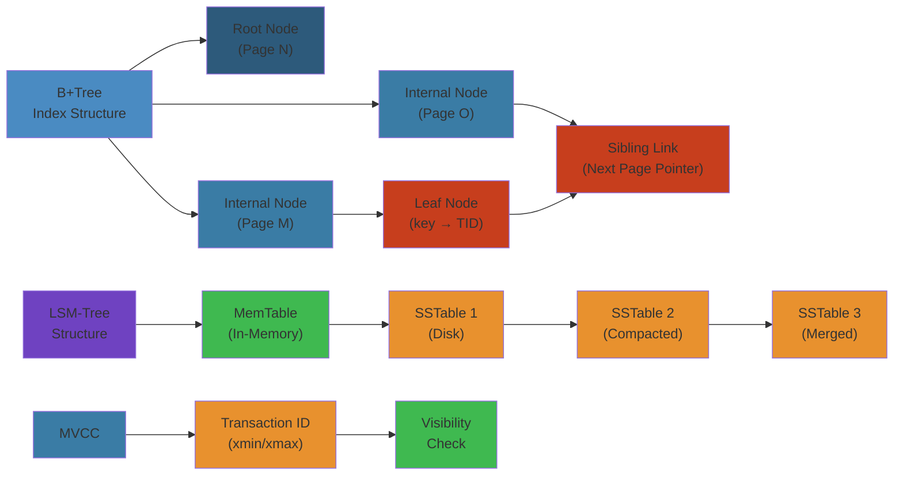
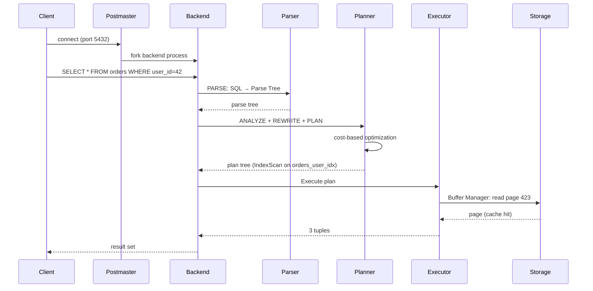

# 🗄️ Relational Database Internals — Complete Deep Dive




## Table of Contents


1. [Storage Engines](#storage-engines)
2. [B+tree Internals](#btree-internals)
3. [LSM-tree Internals](#lsm-tree-internals)
4. [Indexing](#indexing)
5. [Transaction Management](#transaction-management)
6. [MVCC](#mvcc)
7. [Concurrency Control](#concurrency-control)
8. [Simplest Mental Model](#simplest-mental-model)

---

## Storage Engines


```text
┌────────────────────────────────────────────────────────────┐
│              Storage Engine Landscape                       │
├──────────┬───────────┬──────────────┬──────────────────────┤
│  B-tree  │  B+tree   │  LSM-tree    │  Heap + Hash         │
│  InnoDB  │  PG, MySQL│  RocksDB,    │  MySQL MEMORY        │
│  SQLite  │  Oracle   │  Cassandra   │  Heap tables         │
└──────────┴───────────┴──────────────┴──────────────────────┘
```

| Property | B+tree | LSM-tree | Hash |
|----------|--------|----------|------|
| Point read | O(log N) | O(K log N) | O(1) |
| Write | O(log N) | O(log N) amortized | O(1) |
| Write amplification | Low (1-3x) | High (10-40x) | None |

---

## B+tree Internals


### Page Structure (PostgreSQL 8KB pages)


```text
┌──────────────────────────────────┐
│  PageHeaderData (24B)           │
│  ItemIdData[] (4B each) ← down  │
│  ↓ free space ↑                 │
│  Items (tuples/index) → up      │
└──────────────────────────────────┘
```

### Internal vs Leaf Nodes


```text
            ┌──────────┐
            │  Root    │
            │ [5,20,50]│
            └────┬─────┘
         ┌───────┼───────┐
         ▼       ▼       ▼
    ┌────────┐ ┌────────┐ ┌────────┐
    │ Internal │ ......   │ internal│
    └────┬────┘           └────┬────┘
     ┌───┼───┐            ┌───┼───┐
     ▼   ▼   ▼            ▼   ▼   ▼
    ┌─┐ ┌─┐ ┌─┐          ┌─┐ ┌─┐ ┌─┐
    │L│ │L│ │L│  ...      │L│ │L│ │L│ ← leaf (data + sibling ptr)
    └─┘ └─┘ └─┘          └─┘ └─┘ └─┘
```

- Internal: key + child pointer, no data
- Leaf: key + TID, sibling links for range scan
- Fanout ~300-500 for 8KB with 20B keys
- Height = 1 + ceil(log_fanout(N)) → 5 levels for 1B rows

### Split/Merge


```python
def btree_insert(tree, key, value):
    leaf = find_leaf(tree.root, key)
    leaf.insert(key, value)
    if leaf.is_overflow():
        mid = len(leaf.keys) // 2
        new_leaf = LeafNode(keys=leaf.keys[mid:], values=leaf.values[mid:])
        leaf.keys, leaf.values = leaf.keys[:mid], leaf.values[:mid]
        tree.insert_into_parent(leaf, new_leaf.keys[0], new_leaf)

def btree_delete(tree, key):
    leaf = find_leaf(tree.root, key)
    leaf.delete(key)
    if leaf.is_underflow():
        if leaf.can_borrow_from(leaf.sibling):
            leaf.borrow_from(leaf.sibling)
        else:
            tree.merge_nodes(leaf, leaf.sibling)
```

### Buffer Pool


```python
class BufferPool:
    def __init__(self, pool_size=1000):
        self.pages = {}
        self.replacer = ClockReplacer(pool_size)

    def fetch_page(self, page_id):
        if page_id in self.pages:
            return self.pages[page_id]
        frame = self.evict_frame()
        page = self.read_from_disk(page_id)
        self.pages[page_id] = page
        return page
```

| Algorithm | Strategy | Used By |
|-----------|----------|---------|
| LRU | Evict least recently used | Simple (fails under scans) |
| CLOCK | Circular scan w/ reference bit | PostgreSQL |
| 2Q | Two queues: hot/warm | PG (archived) |
| ARC | Adaptive recency/frequency | ZFS, InnoDB |

---

## LSM-tree Internals


```text
Write Buffer → flush → L0 SST (overlapping keys)
                        │ compaction
                        ▼
                    L1 SST (sorted, non-overlapping)
                        │ compaction
                        ▼
                    L2 SST (10x larger)
```

- **Memtable**: In-memory sorted tree (Red-Black/SkipList)
- **SSTable**: Immutable on-disk sorted file + index + bloom filter
- **WAL**: Crash recovery for memtable
- **Compaction**: Background merge to bound reads

### Compaction Strategies


**Size-tiered (Cassandra):** N SSTables → compact → larger SST → next level. Triggers at file count threshold.

**Leveled (LevelDB/RocksDB):** L0 overlapping, L1+ non-overlapping, 10x size ratio per level. Write amp ~10-40x, better space amp.

### Bloom Filter


```python
class BloomFilter:
    def __init__(self, n, fpr=0.01):
        m = -n * math.log(fpr) / (math.log(2)**2)
        self.bits = bytearray(int(m))
        self.k = int(m / n * math.log(2))

    def add(self, key):
        for h in self.hashes:
            self.bits[h(key) % len(self.bits)] = 1

    def might_contain(self, key):
        return all(self.bits[h(key) % len(self.bits)] for h in self.hashes)
```

No false negatives, configurable false positive rate (~0.1-5%).

---

## Indexing


### Primary vs Secondary


- **Clustered** (InnoDB): Data stored in index order (table = index)
- **Heap** (PostgreSQL): Data stored separately, index points to TID

```sql
CREATE INDEX idx_multi ON users (last_name, first_name, dob);
-- Column order: equality cols first, then range, then sort

-- Partial: only index relevant subset
CREATE INDEX idx_active ON users (email) WHERE status = 'active';

-- Covering: avoid heap lookup
CREATE INDEX idx_cov ON orders (user_id) INCLUDE (total, status);

-- Functional
CREATE INDEX idx_lower ON users (LOWER(email));
```

| Index | Use Case |
|-------|----------|
| B-tree | Default: =, <, >, BETWEEN, IN, LIKE |
| GiST | Geometry, full-text, fuzzy |
| GIN | JSONB, arrays, full-text (contains) |
| BRIN | Correlated data, time-series (100-1000x smaller) |
| Hash | Equality only (O(1)) |

---

## Transaction Management


### ACID


- **Atomicity**: All-or-nothing via WAL + UNDO
- **Consistency**: Constraints + triggers
- **Isolation**: MVCC/locking prevent interference
- **Durability**: Committed data survives crashes

### Isolation Levels


```text
                    Dirty Read  Non-Repeatable  Phantom
READ UNCOMMITTED   Possible    Possible        Possible
READ COMMITTED     Safe        Possible        Possible
REPEATABLE READ    Safe        Safe            Possible (PG: Safe)
SERIALIZABLE       Safe        Safe            Safe
```

---

## MVCC


Each transaction sees the database as of its snapshot time. PostgreSQL tracks via XMIN/XMAX in tuple header:

```python
def is_visible(tuple, snapshot):
    if is_aborted(tuple.xmin): return False
    if tuple.xmin > snapshot.xmax: return False
    if tuple.xmin in snapshot.xip: return False
    if tuple.xmax == 0 or is_aborted(tuple.xmax): return True
    if tuple.xmax > snapshot.xmax: return True
    if tuple.xmax in snapshot.xip: return True
    if is_committed(tuple.xmax): return False
    return True
```

| Feature | PostgreSQL | MySQL (InnoDB) |
|---------|-----------|----------------|
| Old versions | In-page dead tuples | Undo logs |
| Cleanup | VACUUM | Purge thread |

---

## Concurrency Control


**2PL (Two-Phase Locking):** Growing phase (acquire locks) → shrinking phase (release). SS2PL: hold all locks until commit.

**OCC (Optimistic):** Read → Validate → Write. Abort on conflict.

**SSI (Serializable Snapshot Isolation):** Detects rw-conflict cycles between concurrent transactions, aborts one.

**Deadlock Detection:** Build wait-for graph, find cycles, abort youngest/lowest-cost transaction.

---

## Simplest Mental Model


```
A database is a fancy key-value store that:
1. ORGANIZES data in pages on disk (B+tree, LSM)
2. CACHES hot pages in memory (buffer pool)
3. FINDS rows fast (indexes)
4. PROTECTS writes (WAL)
5. GIVES each tx its own view (MVCC)
6. PREVENTS chaos w/ concurrent writes (locks/OCC)

B+tree = phone book sorted for lookup
MVCC   = git branches for each transaction
WAL    = black box recorder for writes
```


---

## Code Examples


```python
import struct

# Minimal B+tree node implementation
class BPlusTreeNode:
    def __init__(self, is_leaf=False):
        self.is_leaf = is_leaf
        self.keys = []
        self.children = []  # child pointers for internal, values for leaf

class BPlusTree:
    def __init__(self, order=4):
        self.order = order
        self.root = BPlusTreeNode(is_leaf=True)

    def search(self, key):
        return self._search(self.root, key)

    def _search(self, node, key):
        i = 0
        while i < len(node.keys) and key > node.keys[i]:
            i += 1
        if node.is_leaf:
            if i < len(node.keys) and node.keys[i] == key:
                return node.children[i]
            return None
        return self._search(node.children[i], key)

    def insert(self, key, value):
        self._insert(self.root, key, value)

    def _insert(self, node, key, value):
        if node.is_leaf:
            i = 0
            while i < len(node.keys) and key > node.keys[i]:
                i += 1
            node.keys.insert(i, key)
            node.children.insert(i, value)
            if len(node.keys) > self.order:
                self._split(node)
        else:
            pass  # recurse to children, handle splits upward

# Buffer pool with CLOCK replacement (PostgreSQL-style)
class ClockReplacer:
    def __init__(self, pool_size: int):
        self.frames = [{'page_id': None, 'ref': False} for _ in range(pool_size)]
        self.hand = 0

    def evict(self) -> int:
        while True:
            if not self.frames[self.hand]['ref']:
                victim = self.hand
                self.hand = (self.hand + 1) % len(self.frames)
                return victim
            self.frames[self.hand]['ref'] = False
            self.hand = (self.hand + 1) % len(self.frames)

    def pin(self, frame_id: int):
        self.frames[frame_id]['ref'] = True

# WAL simulation
class WriteAheadLog:
    def __init__(self):
        self.records = []
        self.flushed = 0

    def append(self, lsn: int, page_id: int, data: bytes):
        self.records.append({'lsn': lsn, 'page_id': page_id, 'data': data.hex()})

    def flush(self):
        self.flushed = len(self.records)
```

---

## Common Failure Modes


**Problem**: Index bloat from dead tuples and MVCC overhead

**Root cause**: In PostgreSQL, UPDATE = INSERT + mark old tuple dead. Dead tuples accumulate in indexes, wasting space and slowing scans. Without regular VACUUM, indexes can grow to 5-10x the actual live data size. The B+tree internal nodes remain pointing to pages that contain mostly dead tuples.

**Detection**: `pgstattuple` extension shows `dead_tuple_percent > 20%`. `pg_stat_user_tables` shows `n_dead_tup` growing while `last_autovacuum` is old. Index scan times increase gradually over weeks.

**Solution**: Tune autovacuum: lower `autovacuum_vacuum_scale_factor` (0.01 for busy tables). Use `VACUUM` regularly (not VACUUM FULL, which locks). Set fillfactor to 70-80 for tables with frequent updates. Use REINDEX CONCURRENTLY for online index rebuilds. For extremely write-heavy tables, consider partitioning to keep dead tuple counts manageable per partition.

**Problem**: Transaction ID wraparound causing emergency autovacuum and downtime

**Root cause**: PostgreSQL uses 32-bit transaction IDs (~4 billion). When XID counter approaches the wraparound point (2 billion from 0), PostgreSQL forces emergency VACUUM FREEZE on all tables. This can saturate I/O for hours and block writes.

**Detection**: `SELECT age(relfrozenxid) FROM pg_class` shows values approaching 2 billion. `datfrozenxid` in `pg_database` is old. Warnings in Postgres logs: `database "mydb" must be vacuumed within X transactions`.

**Solution**: Monitor XID age as a critical alert. Tune autovacuum to run aggressively enough to freeze tuples before the emergency threshold. Set `autovacuum_freeze_max_age = 500000000`. For large tables, manually schedule VACUUM FREEZE during maintenance windows. In extreme cases, use `vacuumdb --all --freeze` with multiple jobs.

---

## Interview Questions


### Q1: How does MVCC work in PostgreSQL versus MySQL InnoDB, and what are the trade-offs?


**Answer**: PostgreSQL stores old tuple versions in the same data page (dead tuples). Visibility is determined by comparing XMIN/XMAX in the tuple header against the transaction snapshot. This means no separate undo storage, but creates bloat that VACUUM must clean. InnoDB stores old versions in a separate undo tablespace (rollback segments), keeping the data page clean. This means no VACUUM equivalent, but undo logs grow large under long-running transactions. PostgreSQL's approach is better for read-heavy workloads (no undo lookup overhead), while InnoDB is better for write-heavy workloads (less bloat). PostgreSQL needs VACUUM tuning; InnoDB needs undo tablespace management.

### Q2: How would you implement ACID transactions across a distributed database?


**Answer**: Implement a two-phase commit (2PC) protocol or use a consensus-based approach. In 2PC, a coordinator asks all participants to PREPARE (write WAL, make data durable but uncommitted). If all PREPARE succeeds, the coordinator sends COMMIT; otherwise, it sends ABORT. The failure mode is the coordinator crashing after PREPARE but before COMMIT — participants hold locks until recovery. Modern distributed databases like Spanner use TrueTime (clock synchronization) + Paxos for external consistency. CockroachDB uses a combination of Raft for replication and a transaction coordinator with MVCC timestamps. The key trade-off is between consistency guarantees and latency — synchronous replication across multiple datacenters adds significant latency.


> **Run the live simulator**: [btree-visualizer.html](/08-databases/btree-visualizer.html) — insert keys into an Order-4 B+Tree and watch node splits and tree growth in real-time.


## Related

- [Cap Consistency](09-distributed-systems/01-cap-consistency.md)
- [Consensus Replication](09-distributed-systems/01-consensus-replication.md)
- [Consensus Raft](09-distributed-systems/02-consensus-raft.md)
- [Distributed Transactions](09-distributed-systems/02-distributed-transactions.md)
- [Distributed Caching](09-distributed-systems/03-distributed-caching.md)
- [Distributed Storage](09-distributed-systems/03-distributed-storage.md)

## Runtime Flow: PostgreSQL Query Execution

```
Step  Component                            Action              Time
────  ────────────────────────────────     ───────────────     ──────
  1   Client sends query string            libpq / pg driver    0ms
  2   PostgreSQL receives on port 5432     Postmaster process   0.1ms
  3   Fork or assign backend process       Postmaster: fork()   1-5ms
  4   Parse: SQL text → parse tree         Parser (gram.y)     0.1-1ms
  5   Analyze: parse tree → query tree     Analyzer             0.05ms
  6   Rewrite: rules + views expansion     Rewriter             0.05ms
  7   Plan: query tree → plan tree         Planner (optimizer)  1-50ms
      ├── Scan method selection (seq scan vs index scan)
      ├── Join order (nested loop / hash / merge)
      └── Cost estimation via pg_class + pg_stats
  8   Execute: plan tree → tuples          Executor             1-1000ms
      ├── ExecInitNode (open files, pin buffers)
      ├── ExecProcNode (fetch tuples)
      ├── Buffer Manager (page cache lookup)
      └── Storage Engine (heap/index read)
  9   Return tuples to client              DestReceiver         0.1ms
```


