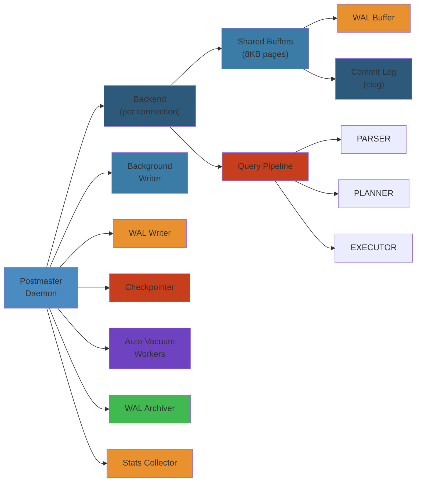
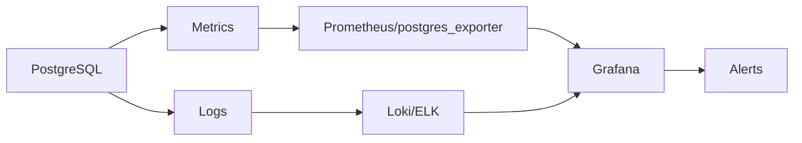

# 🐘 PostgreSQL Architecture — Complete Deep Dive




## Table of Contents


1. [Process Architecture](#process-architecture)
2. [Shared Memory](#shared-memory)
3. [Query Pipeline](#query-pipeline)
4. [WAL](#wal)
5. [Vacuum](#vacuum)
6. [Memory Contexts](#memory-contexts)
7. [Simplest Mental Model](#simplest-mental-model)

---

## Process Architecture


PostgreSQL uses a **multi-process** model (not threaded):

```text
┌──────────────────────────────────────────────────────────┐
│                      postmaster                          │
│  (forks children on connection, crash recovery)          │
├──────────────────────────────────────────────────────────┤
│                                                          │
│  ┌────────┐  ┌────────┐  ┌────────┐                     │
│  │ Backend│  │ Backend│  │ Backend│  ... (1 per conn)   │
│  └────────┘  └────────┘  └────────┘                     │
│                                                          │
│  ┌───────┐  ┌─────────┐  ┌────────┐  ┌───────────────┐ │
│  │ WAL   │  │ Check-  │  │ BG     │  │Autovacuum     │ │
│  │Writer │  │ pointer │  │Writer  │  │Launcher+Worker│ │
│  └───────┘  └─────────┘  └────────┘  └───────────────┘ │
│  ┌───────┐  ┌─────────┐  ┌──────────────┐              │
│  │Archiv.│  │ Stats   │  │Logical Repl. │              │
│  │       │  │Collector│  │Launcher/Work │              │
│  └───────┘  └─────────┘  └──────────────┘              │
└──────────────────────────────────────────────────────────┘
```

| Process | Role |
|---------|------|
| **postmaster** | Startup, fork on connect, signal handling, crash recovery |
| **Backend** | Execute queries (one per connection) |
| **WAL Writer** | Flush WAL buffer to disk every `wal_writer_delay` |
| **Checkpointer** | Write all dirty buffers, update control file |
| **BG Writer** | Periodically write dirty buffers (smoothing checkpoints) |
| **Autovacuum** | Schedule and execute VACUUM based on tuple churn |
| **Stats Collector** | Collect table/index/function I/O stats |
| **Archiver** | Copy WAL segments to archive |
| **Logical Replication** | Decode WAL, send logical changes to subscribers |

---

## Shared Memory


```text
┌──────────────────────────────────────────────────────────┐
│                    Shared Memory                          │
├──────────────────────────────────────────────────────────┤
│ ┌──────────────┐  ┌───────────┐  ┌────────────────────┐ │
│ │Shared Buffers│  │WAL Buffers│  │CLOG (2 bits per tx)│ │
│ │(8KB pages)   │  │(WAL data) │  │(committed/aborted) │ │
│ └──────────────┘  └───────────┘  └────────────────────┘ │
│ ┌──────────────┐  ┌───────────┐  ┌────────────────────┐ │
│ │Lock Manager  │  │Predicate  │  │Process Table       │ │
│ │(row/table)   │  │Lock Table │  │(PGPROC for each)   │ │
│ └──────────────┘  └───────────┘  └────────────────────┘ │
│ ┌──────────────┐  ┌───────────┐                          │
│ │Plan Cache    │  │Tuple Vis. │                          │
│ │(cached plans)│  │(snapshots)│                          │
│ └──────────────┘  └───────────┘                          │
└──────────────────────────────────────────────────────────┘
```

- **shared_buffers**: 25% of RAM recommended
- **WAL Buffers**: Staging area before flush (default 16MB)
- **CLOG**: 2 bits per transaction status

---

## Query Pipeline


```text
Client → PARSER (scan.l + gram.y) → raw parse tree
       → ANALYZER (resolve OIDs, types, wildcards) → query tree
       → REWRITER (views, rules, subquery flattening)
       → PLANNER (cost-based: path gen, join order, scan method)
       → EXECUTOR (init → exec proc node → return tuples)
```

### Planner


```sql
EXPLAIN SELECT * FROM users WHERE email = 'alice@ex.com';

-- Seq Scan on users  (cost=0.00..35.00 rows=10 width=100)
--   Filter: (email = 'alice@ex.com'::text)

-- Index Scan  (cost=0.28..8.30 rows=1 width=100)
--   Index Cond: (email = 'alice@ex.com'::text)
```

Cost formula:
```text
seq_page_cost × pages + cpu_tuple_cost × tuples + cpu_operator_cost × quals
Defaults: seq_page_cost=1.0, random_page_cost=4.0, cpu_tuple_cost=0.01
```

**Join Methods:**
- **Nested Loop**: O(N×M), inner small + indexed
- **Hash Join**: O(N+M), medium unindexed
- **Merge Join**: O(N+M), both presorted

**Scan Methods:**
```text
Seq Scan      → full table (no index or small table)
Index Scan    → index + heap fetch
Index-Only    → all cols in index (no heap)
Bitmap Scan   → combine multiple indexes (bitmap AND/OR)
TID Scan      → direct by ctid
```

### Plan Node Details


**Seq Scan:** Iterates all pages, extracts tuples matching filter. Cost proportional to `relpages × seq_page_cost`.

**Index Scan:** Walk B+tree from root to leaf (height ~3-5), then fetch tuple from heap via TID. If multiple tuples on same page, only fetch page once.

**Index-Only Scan:** All required columns present in index → no heap fetch. Requires visibility map to know which tuples are all-visible.

**Bitmap Scan:** Combines multiple index scans via bitmap operations:
```text
Index A: [bitmap of pages matching cond_a]
Index B: [bitmap of pages matching cond_b]
         → AND/OR → Bitmap Heap Scan
```
Good for when each index is selective but together they narrow significantly.

### pg_stat_activity


```sql
-- View all active backend processes
SELECT pid, state, query_start, wait_event_type,
       wait_event, backend_type, query
FROM pg_stat_activity
WHERE state IS NOT NULL
ORDER BY query_start;

-- Find blocking sessions
SELECT blocked.pid AS blocked_pid,
       blocking.pid AS blocking_pid,
       blocked.query AS blocked_query
FROM pg_stat_activity blocked
JOIN pg_stat_activity blocking
  ON blocking.pid = ANY(pg_blocking_pids(blocked.pid));
```

### Executor


```python
class Executor:
    def ExecutePlan(self, plan):
        estate = self.InitPlan(plan)
        while True:
            slot = plan.ExecProcNode(estate)
            if slot is None:
                break
            yield self.make_tuple(slot)

    def ExecProcNode(self, node):
        typ = type(node)
        if typ is SeqScan: return self.ExecSeqScan(node)
        elif typ is IndexScan: return self.ExecIndexScan(node)
        elif typ is NestedLoop: return self.ExecNestedLoop(node)
        elif typ is HashJoin: return self.ExecHashJoin(node)
```

---

## WAL


Every modification is logged before data page write:

```text
Backend → WAL Buffer (shared mem) → WAL Writer → WAL Segment (pg_wal/)
```

**XLOG Record:** xl_xid (tx ID), xl_prev (prev LSN), xl_crc, block data (full page image or change vector).

**LSN = 32-bit segment + 32-bit offset** — points to any record in WAL.

**Checkpoint types:**
- **Full**: Flush all dirty buffers to disk
- **Incremental** (PG16+): Partial flush
- **Restartpoint**: Checkpoint on replica

**Full Page Writes:** After checkpoint, first modification to each page writes entire page (prevents torn pages).

### Replication


```text
Streaming: Primary → WAL stream → Standby
            └── WAL sender ──→ WAL receiver ─┘

Logical:   Publisher → row-by-row changes → Subscriber
            └── Output plugin (pgoutput) → Apply worker ─┘
```

---

## Vacuum


Dead tuple lifecycle: UPDATE creates new tuple version, old becomes dead → VACUUM removes.

```sql
SHOW autovacuum_vacuum_threshold;      -- 50
SHOW autovacuum_vacuum_scale_factor;   -- 0.2
```

**Trigger:** `dead_tuples >= threshold + scale_factor × reltuples`

| Command | Effect | Lock |
|---------|--------|------|
| `VACUUM` | Remove dead tuples, update FSM/VM | ShareUpdateExclusiveLock |
| `VACUUM FULL` | Rewrite entire table | AccessExclusiveLock |

**XID Wraparound:** 32-bit XIDs (~4B). At 2B, danger. `VACUUM FREEZE` marks tuples as frozen. Check with `SELECT age(relfrozenxid) FROM pg_class;`

---

## Memory Contexts


```text
TopMemoryContext
├── CacheMemoryContext (syscache, relcache)
├── TopTransactionContext (current tx data)
├── PortalContext (per-cursor)
├── ExecutorContext (per-query)
│   └── ExprContext (per-tuple eval)
└── ErrorContext (error recovery)
```

```sql
-- View memory usage
SELECT * FROM pg_backend_memory_contexts ORDER BY total_bytes DESC;
```

Each query runs in its own context. At end of query, entire context is reset — guaranteed cleanup.

---

## Simplest Mental Model


```
PostgreSQL is a factory with dedicated workers:

1. POSTMASTER = receptionist (forks workers per customer)
2. BACKENDS = cashiers (one per customer, serves them)
3. WAL WRITER = stenographer (writes everything in journal)
4. CHECKPOINTER = janitor (ensures ledger matches storage)
5. VACUUM = cleanup crew (takes out dead-tuple trash)
6. SHARED MEMORY = whiteboard (shared notes between workers)
7. MEMORY CONTEXTS = binder sections (tear out one when done)
```


---

## Code Examples


```python
import psycopg2
import psutil
import os

# Monitor backend processes
def pg_process_overview(conn):
    with conn.cursor() as cur:
        cur.execute("""
            SELECT pid, backend_type, state, wait_event_type,
                   query_start, backend_start, application_name
            FROM pg_stat_activity
            WHERE backend_type = 'client backend'
            ORDER BY query_start
        """)
        for row in cur:
            proc = psutil.Process(row[0])
            mem_mb = proc.memory_info().rss / 1024 / 1024
            cpu_pct = proc.cpu_percent(interval=0.1)
            print(f"PID={row[0]} Type={row[1]} State={row[2]} "
                  f"Mem={mem_mb:.0f}MB CPU={cpu_pct:.1f}%")

# Simulate query pipeline stages
class Parser:
    def parse(self, sql: str) -> list:
        tokens = sql.replace("(", " ( ").replace(")", " ) ").split()
        return tokens  # simplified — real parser uses bison grammar

class Planner:
    def estimate_cost(self, table: str, filter_col: str) -> dict:
        return {
            'seq_scan': 1000 * 1.0,       # seq_page_cost * pages
            'index_scan': 50 * 4.0 + 10,  # random_page_cost * index_pages
            'chosen': 'index_scan'
        }

class Executor:
    def execute(self, plan: dict) -> list:
        if plan['chosen'] == 'index_scan':
            return [{'id': 1, 'email': 'alice@example.com'}]
        return []

# Memory context exploration
with conn.cursor() as cur:
    cur.execute("SELECT name, total_bytes, parent FROM pg_backend_memory_contexts")
    for row in cur:
        indent = "  " * (row[2] is not None)
        print(f"{indent}{row[0]}: {row[1] / 1024:.0f}KB")
```

---

## Common Failure Modes


**Problem**: Checkpoint burst — periodic I/O spikes every `checkpoint_timeout` interval

**Root cause**: The checkpointer process flushes all dirty buffers accumulated since the last checkpoint. If the write rate is high (e.g., 100MB/s), a 15-minute checkpoint flushes 90GB at once, saturating disk I/O and causing query latency spikes. This is the most common cause of "periodic slowdown" in PostgreSQL.

**Detection**: I/O utilization graph shows a sawtooth pattern every 15 minutes. `pg_stat_bgwriter` shows `checkpoints_timed` incrementing and `buffers_checkpoint` is large. Application latency graph mirrors the pattern.

**Solution**: Increase `checkpoint_completion_target` to 0.9 to spread writes across the checkpoint window. Increase `max_wal_size` to reduce checkpoint frequency. Enable `wal_compression` to reduce WAL volume. For NVMe, set `dirty_background_ratio` and `dirty_ratio` in the OS to control kernel flushing.

**Problem**: WAL sender falling behind (replication lag) causing data loss risk

**Root cause**: The primary generates WAL faster than a standby can apply it. Common causes: standby with slower hardware, long-running queries on standby blocking WAL replay, network bandwidth saturation, or `wal_keep_size` too small causing replication slot to be removed.

**Detection**: `pg_stat_replication` shows `replay_lag` growing. `pg_wal_lsn_diff()` shows increasing gap. Monitoring alerts on replication lag > some threshold. Standby data is increasingly stale.

**Solution**: Ensure standby hardware matches primary. Set `hot_standby_feedback = on` to prevent query conflicts. Increase `wal_keep_size` or use replication slots with `max_slot_wal_keep_size`. For cross-region replication, use synchronous replication for critical data or accept async lag. Add monitoring with lag alerts at 10s, 60s, and 300s thresholds.

---

## Interview Questions


### Q1: Why does PostgreSQL use a multi-process model instead of multi-threaded, and what are the implications?


**Answer**: PostgreSQL uses fork-based multi-process for isolation: if a backend crashes, it doesn't take down other connections. Shared memory is used for the buffer pool, WAL buffers, and lock manager — processes communicate through this. The trade-off: each connection has its own memory context (~10MB overhead), making 10,000 connections impractical without a pooler. Threaded databases (MySQL, Oracle) use less memory per connection because threads share the same address space, but a crash in any thread can corrupt shared state. PostgreSQL's approach favors stability and isolation over raw connection density.

### Q2: How does the PostgreSQL query planner choose between a sequential scan and an index scan?


**Answer**: The planner estimates the cost of each scan method using `seq_page_cost`, `random_page_cost`, `cpu_tuple_cost`, and `cpu_operator_cost`. For a sequential scan, cost = `seq_page_cost × pages + cpu_tuple_cost × tuples + cpu_operator_cost × filter_ops`. For an index scan, cost = `random_page_cost × index_pages + cpu_tuple_cost × expected_tuples + ...`. The planner uses table statistics (reltuples, relpages) and column statistics (most-common-values, histogram bounds, correlation) to estimate selectivity. A seq scan is preferred when the table is small (< 10% of shared_buffers), the query selects a large fraction of rows (> 5-10%), or there's no useful index. The key knob is `random_page_cost` — setting it to 1.1 (NVMe) vs the default 4.0 (HDD) makes the planner correctly choose index scans on SSD systems.


## Edge Cases


| Scenario | Challenge | Solution |
|----------|-----------|----------|
| **XID wraparound** | Transaction ID counter wraps after 2B transactions, old data becomes visible | Monitor `age(datfrozenxid)` > 1B. Set `autovacuum_freeze_max_age` = 200M. Schedule manual VACUUM FREEZE during maintenance |
| **Connection pool exhaustion** | 500+ connections overwhelm shared_buffers | Use PgBouncer in transaction mode. Pool size = 2x CPU cores. Set `max_connections` conservatively (200-500) |
| **Checkpoint storm** | All dirty buffers written at once, I/O spikes, WAL writes stall | Set `max_wal_size` = 2x checkpoint_completion_target. Use `checkpoint_timeout` = 15 min. Monitor `pg_stat_bgwriter` buffers_backend vs buffers_checkpoint ratio |
| **Replication lag > WAL retention** | Standby can't catch up, requires full rebuild | Set `wal_keep_segments` large enough for max replication lag. Monitor `pg_stat_replication` replay_lag. Use replication slots with `max_slot_wal_keep_size` |
| **Autovacuum not keeping up** | Table bloat, transaction wraparound risk | Tune `autovacuum_vacuum_scale_factor` = 0.01 for large tables. Set `autovacuum_vacuum_cost_limit` = 2000. Monitor `pg_stat_user_tables.n_dead_tup` ratio |

## Cross-References


- [Database Internals](../../08-databases/01-db-internals.md) — B-tree page structure, MVCC visibility checks, LSM-tree compactions
- [NoSQL Databases](../05-nosql-databases.md) — Document, wide-column, and KV comparison
- [Distributed Transactions](../../09-distributed-systems/02-distributed-transactions.md) — 2PC, Saga, Outbox patterns
- [Redis Caching](../../08-databases/04-redis-caching.md) — Cache-aside, write-through, invalidation strategies


## Observability




### Key Metrics


| Metric | Unit | Threshold | Indicates |
|--------|------|-----------|-----------|
| Cache hit ratio (shared_buffers) | % | > 99% | Buffer cache effectiveness |
| Connection count | count | < 80% of max_connections | Pool exhaustion |
| Replication lag | bytes / s | < 10MB / < 60s | Replica health |
| Autovacuum worker count | count | > 0 | Dead tuple cleanup |
| Dead tuple ratio | % | < 20% | Vacuum effectiveness |
| Transaction ID age | count | < 1B (out of 2B) | XID wraparound risk |
| Query latency (p99) | ms | < 200ms | Query performance |
| Checkpoint frequency | /h | < 10 | WAL generation rate |

### Logs


- **ERROR**: Deadlock detected, out of shared memory, connection failures, replication conflict
- **WARN**: Long queries > 5s, checkpoint frequency high, autovacuum triggered, replication lag
- **INFO**: Checkpoint complete, backup start/end, autovacuum run, config reload
- **DEBUG**: Slow queries (enable `log_min_duration_statement`), lock waits

### Alerts


| Severity | Condition | Response |
|----------|-----------|----------|
| P0 | Replication lag > 60s | Check replica I/O, increase resources |
| P0 | Cache hit ratio < 95% | Increase shared_buffers, tune queries |
| P1 | Connection count > 90% of max | Kill idle connections, add pooler |
| P1 | Dead tuple ratio > 30% | Manual VACUUM |
| P2 | XID age > 1.5B | Emergency vacuum, wraparound risk |

### Dashboards


**PostgreSQL Overview**: active connections, cache hit ratio, transactions per second, query latency (p50/p99), dead tuple ratio, replication lag, autovacuum activity, checkpoint frequency.


## Common Failures


### Failure: Connection Pool Exhaustion


- **Symptoms**: New connections fail with "remaining connection slots reserved". Application timeouts and 500s.
- **Root Cause**: max_connections too low. Application doesn't return connections. Idle-in-transaction sessions. Middleware pool (pgbouncer) undersized.
- **Detection**: `pg_stat_activity` shows many idle connections. CloudWatch `DatabaseConnections` at max. Logs: "FATAL: remaining connection slots are reserved".
- **Recovery**: 1) `SELECT pg_terminate_backend(pid) WHERE state='idle'`. 2) Increase max_connections (requires restart). 3) Deploy pgbouncer. 4) Set `idle_in_transaction_session_timeout`.
- **Prevention**: Set connection pool limits per-application. Monitor with CloudWatch alarm at 80%. Use RDS Proxy.

### Failure: Replication Lag


- **Symptoms**: Read replicas return stale data. Replica lag grows until WAL segments removed.
- **Root Cause**: Replica cannot keep up with write rate. Long-running queries on replica block WAL replay. Insufficient replica IOPS.
- **Detection**: `pg_stat_replication.replay_lag`. CloudWatch `ReplicaLag` metric. `pg_wal_lsn_diff()`.
- **Recovery**: 1) Scale up replica. 2) Kill long queries on replica. 3) Rebuild replica if WAL removed.
- **Prevention**: Monitor `wal_keep_segments`. Use replication slots. Ensure replica has sufficient IOPS.

### Failure: Autovacuum Bloat


- **Symptoms**: Table size >> data size. Query performance degrades. I/O increases.
- **Root Cause**: High write rate generates dead tuples faster than autovacuum cleans. Autovacuum cost limit throttles cleanup.
- **Detection**: `pg_stat_user_tables.n_dead_tup` increasing. Table size via `pg_total_relation_size`. Autovacuum workers at 100% CPU.
- **Recovery**: 1) `VACUUM (VERBOSE, ANALYZE)` heavy tables. 2) `REINDEX TABLE`. 3) Tune autovacuum.
- **Prevention**: Set `autovacuum_vacuum_scale_factor=0.01`. Increase `autovacuum_vacuum_cost_limit=2000`. Monitor dead tuple ratio.

### Failure: XID Wraparound


- **Symptoms**: Database becomes read-only, or crashes with "database is not accepting commands to avoid wraparound". Emergency.
- **Root Cause**: Transaction ID (32-bit counter) wraps after 2B transactions. If autovacuum doesn't freeze XIDs before 2B, PostgreSQL stops accepting writes.
- **Detection**: `SELECT age(datfrozenxid) FROM pg_database` approaching 2 billion. WARNING logs: "database X may be wrapped around".
- **Recovery**: 1) Single-user mode `VACUUM FREEZE` (downtime required). 2) Create new database and copy data.
- **Prevention**: Ensure autovacuum is never disabled. Monitor `age(datfrozenxid)`. Set `autovacuum_freeze_max_age=500000000`.

### Failure: Checkpoint Storm


- **Symptoms**: Regular I/O spikes every checkpoint interval. WAL write latency spikes during checkpoint. Query latency spikes.
- **Root Cause**: Checkpoint writes all dirty buffers at once. `max_wal_size` too small causes frequent checkpoints. `checkpoint_completion_target` too aggressive.
- **Detection**: I/O wait spikes at regular intervals. `pg_stat_bgwriter.buffers_checkpoint` high. `checkpoint_write_time` increasing.
- **Recovery**: 1) Increase `max_wal_size` (e.g., 2x current WAL generation per checkpoint). 2) Increase `checkpoint_timeout` to 15-30min.
- **Prevention**: Set `max_wal_size` to 2-3x of WAL generated between checkpoints. Set `checkpoint_completion_target=0.9`. Monitor `pg_stat_bgwriter`.
