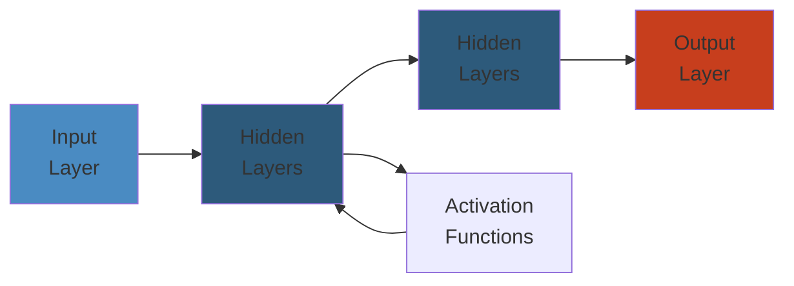

# 🐘 PostgreSQL Architecture — Complete Deep Dive




## Table of Contents
1. [Process Architecture](#process-architecture)
2. [Shared Memory](#shared-memory)
3. [Query Pipeline](#query-pipeline)
4. [WAL](#wal)
5. [Vacuum](#vacuum)
6. [Memory Contexts](#memory-contexts)
7. [Simplest Mental Model](#simplest-mental-model)

---

## Process Architecture

PostgreSQL uses a **multi-process** model (not threaded):

```text
┌──────────────────────────────────────────────────────────┐
│                      postmaster                          │
│  (forks children on connection, crash recovery)          │
├──────────────────────────────────────────────────────────┤
│                                                          │
│  ┌────────┐  ┌────────┐  ┌────────┐                     │
│  │ Backend│  │ Backend│  │ Backend│  ... (1 per conn)   │
│  └────────┘  └────────┘  └────────┘                     │
│                                                          │
│  ┌───────┐  ┌─────────┐  ┌────────┐  ┌───────────────┐ │
│  │ WAL   │  │ Check-  │  │ BG     │  │Autovacuum     │ │
│  │Writer │  │ pointer │  │Writer  │  │Launcher+Worker│ │
│  └───────┘  └─────────┘  └────────┘  └───────────────┘ │
│  ┌───────┐  ┌─────────┐  ┌──────────────┐              │
│  │Archiv.│  │ Stats   │  │Logical Repl. │              │
│  │       │  │Collector│  │Launcher/Work │              │
│  └───────┘  └─────────┘  └──────────────┘              │
└──────────────────────────────────────────────────────────┘
```

| Process | Role |
|---------|------|
| **postmaster** | Startup, fork on connect, signal handling, crash recovery |
| **Backend** | Execute queries (one per connection) |
| **WAL Writer** | Flush WAL buffer to disk every `wal_writer_delay` |
| **Checkpointer** | Write all dirty buffers, update control file |
| **BG Writer** | Periodically write dirty buffers (smoothing checkpoints) |
| **Autovacuum** | Schedule and execute VACUUM based on tuple churn |
| **Stats Collector** | Collect table/index/function I/O stats |
| **Archiver** | Copy WAL segments to archive |
| **Logical Replication** | Decode WAL, send logical changes to subscribers |

---

## Shared Memory

```text
┌──────────────────────────────────────────────────────────┐
│                    Shared Memory                          │
├──────────────────────────────────────────────────────────┤
│ ┌──────────────┐  ┌───────────┐  ┌────────────────────┐ │
│ │Shared Buffers│  │WAL Buffers│  │CLOG (2 bits per tx)│ │
│ │(8KB pages)   │  │(WAL data) │  │(committed/aborted) │ │
│ └──────────────┘  └───────────┘  └────────────────────┘ │
│ ┌──────────────┐  ┌───────────┐  ┌────────────────────┐ │
│ │Lock Manager  │  │Predicate  │  │Process Table       │ │
│ │(row/table)   │  │Lock Table │  │(PGPROC for each)   │ │
│ └──────────────┘  └───────────┘  └────────────────────┘ │
│ ┌──────────────┐  ┌───────────┐                          │
│ │Plan Cache    │  │Tuple Vis. │                          │
│ │(cached plans)│  │(snapshots)│                          │
│ └──────────────┘  └───────────┘                          │
└──────────────────────────────────────────────────────────┘
```

- **shared_buffers**: 25% of RAM recommended
- **WAL Buffers**: Staging area before flush (default 16MB)
- **CLOG**: 2 bits per transaction status

---

## Query Pipeline

```text
Client → PARSER (scan.l + gram.y) → raw parse tree
       → ANALYZER (resolve OIDs, types, wildcards) → query tree
       → REWRITER (views, rules, subquery flattening)
       → PLANNER (cost-based: path gen, join order, scan method)
       → EXECUTOR (init → exec proc node → return tuples)
```

### Planner

```sql
EXPLAIN SELECT * FROM users WHERE email = 'alice@ex.com';

-- Seq Scan on users  (cost=0.00..35.00 rows=10 width=100)
--   Filter: (email = 'alice@ex.com'::text)

-- Index Scan  (cost=0.28..8.30 rows=1 width=100)
--   Index Cond: (email = 'alice@ex.com'::text)
```

Cost formula:
```text
seq_page_cost × pages + cpu_tuple_cost × tuples + cpu_operator_cost × quals
Defaults: seq_page_cost=1.0, random_page_cost=4.0, cpu_tuple_cost=0.01
```

**Join Methods:**
- **Nested Loop**: O(N×M), inner small + indexed
- **Hash Join**: O(N+M), medium unindexed
- **Merge Join**: O(N+M), both presorted

**Scan Methods:**
```text
Seq Scan      → full table (no index or small table)
Index Scan    → index + heap fetch
Index-Only    → all cols in index (no heap)
Bitmap Scan   → combine multiple indexes (bitmap AND/OR)
TID Scan      → direct by ctid
```

### Plan Node Details

**Seq Scan:** Iterates all pages, extracts tuples matching filter. Cost proportional to `relpages × seq_page_cost`.

**Index Scan:** Walk B+tree from root to leaf (height ~3-5), then fetch tuple from heap via TID. If multiple tuples on same page, only fetch page once.

**Index-Only Scan:** All required columns present in index → no heap fetch. Requires visibility map to know which tuples are all-visible.

**Bitmap Scan:** Combines multiple index scans via bitmap operations:
```text
Index A: [bitmap of pages matching cond_a]
Index B: [bitmap of pages matching cond_b]
         → AND/OR → Bitmap Heap Scan
```
Good for when each index is selective but together they narrow significantly.

### pg_stat_activity

```sql
-- View all active backend processes
SELECT pid, state, query_start, wait_event_type,
       wait_event, backend_type, query
FROM pg_stat_activity
WHERE state IS NOT NULL
ORDER BY query_start;

-- Find blocking sessions
SELECT blocked.pid AS blocked_pid,
       blocking.pid AS blocking_pid,
       blocked.query AS blocked_query
FROM pg_stat_activity blocked
JOIN pg_stat_activity blocking
  ON blocking.pid = ANY(pg_blocking_pids(blocked.pid));
```

### Executor

```python
class Executor:
    def ExecutePlan(self, plan):
        estate = self.InitPlan(plan)
        while True:
            slot = plan.ExecProcNode(estate)
            if slot is None:
                break
            yield self.make_tuple(slot)

    def ExecProcNode(self, node):
        typ = type(node)
        if typ is SeqScan: return self.ExecSeqScan(node)
        elif typ is IndexScan: return self.ExecIndexScan(node)
        elif typ is NestedLoop: return self.ExecNestedLoop(node)
        elif typ is HashJoin: return self.ExecHashJoin(node)
```

---

## WAL

Every modification is logged before data page write:

```text
Backend → WAL Buffer (shared mem) → WAL Writer → WAL Segment (pg_wal/)
```

**XLOG Record:** xl_xid (tx ID), xl_prev (prev LSN), xl_crc, block data (full page image or change vector).

**LSN = 32-bit segment + 32-bit offset** — points to any record in WAL.

**Checkpoint types:**
- **Full**: Flush all dirty buffers to disk
- **Incremental** (PG16+): Partial flush
- **Restartpoint**: Checkpoint on replica

**Full Page Writes:** After checkpoint, first modification to each page writes entire page (prevents torn pages).

### Replication

```text
Streaming: Primary → WAL stream → Standby
            └── WAL sender ──→ WAL receiver ─┘

Logical:   Publisher → row-by-row changes → Subscriber
            └── Output plugin (pgoutput) → Apply worker ─┘
```

---

## Vacuum

Dead tuple lifecycle: UPDATE creates new tuple version, old becomes dead → VACUUM removes.

```sql
SHOW autovacuum_vacuum_threshold;      -- 50
SHOW autovacuum_vacuum_scale_factor;   -- 0.2
```

**Trigger:** `dead_tuples >= threshold + scale_factor × reltuples`

| Command | Effect | Lock |
|---------|--------|------|
| `VACUUM` | Remove dead tuples, update FSM/VM | ShareUpdateExclusiveLock |
| `VACUUM FULL` | Rewrite entire table | AccessExclusiveLock |

**XID Wraparound:** 32-bit XIDs (~4B). At 2B, danger. `VACUUM FREEZE` marks tuples as frozen. Check with `SELECT age(relfrozenxid) FROM pg_class;`

---

## Memory Contexts

```text
TopMemoryContext
├── CacheMemoryContext (syscache, relcache)
├── TopTransactionContext (current tx data)
├── PortalContext (per-cursor)
├── ExecutorContext (per-query)
│   └── ExprContext (per-tuple eval)
└── ErrorContext (error recovery)
```

```sql
-- View memory usage
SELECT * FROM pg_backend_memory_contexts ORDER BY total_bytes DESC;
```

Each query runs in its own context. At end of query, entire context is reset — guaranteed cleanup.

---

## Simplest Mental Model

```
PostgreSQL is a factory with dedicated workers:

1. POSTMASTER = receptionist (forks workers per customer)
2. BACKENDS = cashiers (one per customer, serves them)
3. WAL WRITER = stenographer (writes everything in journal)
4. CHECKPOINTER = janitor (ensures ledger matches storage)
5. VACUUM = cleanup crew (takes out dead-tuple trash)
6. SHARED MEMORY = whiteboard (shared notes between workers)
7. MEMORY CONTEXTS = binder sections (tear out one when done)
```


---

## Code Examples

```python
# Example implementation
# [Add language-specific code demonstrating core concept]
pass
```

---

## Common Failure Modes

**Problem**: [Key issue in production]

**Root cause**: [Why it happens]

**Solution**: [How to fix]

---

## Interview Questions

### Q1: [Core concept question]

**Answer**: [Detailed explanation with trade-offs]

### Q2: [Design/architecture question]

**Answer**: [Best practices and reasoning]
