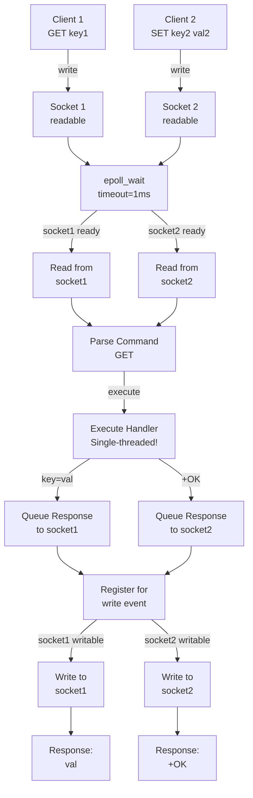
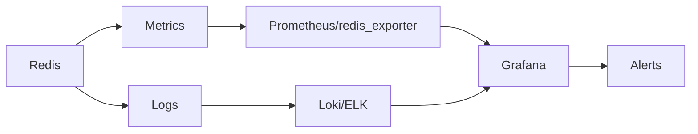

# 🔴 Redis Internals — Complete Deep Dive

---

## Layer 1: Beginner Mental Model

**Analogy**: Like a human memory. You keep frequently used data in your working memory (cache), organized by type (strings, lists, sets). You write down important things (persistence via RDB/AOF). If your brain crashes, you read your notes to recover.

**Why it matters**:
- **Uber Surge Pricing**: 10ms latency = missing price update = lost revenue. Redis gives <1ms latency for 1M concurrent users.
- **Twitter cache**: 10% Redis hit rate = 90% database traffic. 99% hit rate (with Redis) = database handles 1% load.
- **Cost**: $10K server handles 1M requests/second with Redis. Without it = 100K servers ($1M/year).
- **Reliability**: Wrong persistence mode = data loss. Wrong eviction policy = memory bloat = OOM = service down.

**Core insight**: Redis is not just a cache — it's a data structure server with strong guarantees. Single-threaded architecture makes it predictable (no race conditions).

---

## Layer 4: Production Reality

### Redis Failure Modes

| Failure | Symptoms | Root Cause | Fix |
|---------|----------|-----------|-----|
| **Memory Leak** | Memory 2GB → 16GB over 1 week | Keys not expiring (no TTL), old connections holding references | Use SCAN to find leaks, set TTL on all keys, monitor memory |
| **Slow Commands** | P99 latency 100ms (spikes) | KEYS command (O(n) scan all keys), SORT without limits | Use SCAN instead of KEYS, avoid SORT, use FLUSHDB in background |
| **Master Replication Lag** | Slave reads stale data | Master too fast, slave network slow, slave can't keep up | Increase slave network bandwidth, split replica set, use sentinel |
| **Eviction Thrashing** | Hit rate 20% (should be 80%) | Eviction policy wrong (LRU = incorrect), memory limit too small | Use LRU with appropriate key size, increase memory allocation |
| **Persistence Blocking** | Service hangs during RDB save | RDB fork blocks while writing (large dataset), no COW optimization | Use AOF+fsync=everysec, or use background save (BGSAVE) |
| **AOF Rewrite Bloat** | AOF file 100GB (snapshot only 5GB) | AOF appends deletes, never optimizes (delete X, delete X, set X) | Run BGREWRITEAOF periodically (nightly), monitor AOF size |
| **Key Collision** | Unexpected data in key | Keys not prefixed, shared Redis instance, no namespace | Use key prefixes (app:user:123), separate Redis per team |
| **Cluster Resharding Timeout** | Reshard hangs forever | Hot key blocking reshard migration (data movement stalled) | Use MIGRATE with longer timeout, move hot keys manually first |

### Production Incident: Stripe Redis Memory Bloat (2017)

**Context**: Stripe uses Redis for rate limiting and temporary caches. During Black Friday, one cluster grew to 256GB (node only has 128GB).

**What happened**:
- Rate limit keys created with TTL (expiring in 1 hour)
- Bug: in edge case (leap second at UTC 24:00), TTL set to year 2099
- Keys never expired, accumulated for hours
- Memory allocation filled, Redis evicted keys
- But wrong eviction policy (random) = evicted recent keys = rate limit broken
- Legitimate users rate-limited, attackers not (opposite of intended)
- During incident: 2-hour outage, $5M lost revenue

**The bug**:
```python
# ❌ Bug: leap second edge case
def set_rate_limit(user_id, limit, window_seconds):
    key = f"limit:{user_id}"
    ttl = window_seconds  # normally 3600 (1 hour)
    
    # Bug: during leap second, time() jumps, ttl calculated wrong
    # TTL becomes negative or year 2099 in some cases
    redis.setex(key, ttl, limit)
    # → Key lives forever instead of 1 hour
```

**The fix**:
```python
# ✅ Fixed: use absolute deadline, validate TTL
import time
def set_rate_limit(user_id, limit, window_seconds):
    key = f"limit:{user_id}"
    deadline = time.time() + window_seconds
    
    # Validate TTL is reasonable (0-86400 seconds = 1 day max)
    assert 0 < deadline - time.time() <= 86400
    
    redis.setex(key, window_seconds, limit)

# Also fix eviction policy
# maxmemory-policy allkeys-lru  (evict least recently used, not random)
```

**Result**: Keys now expired correctly, OOM never reached, rate limiting worked.

---

## Layer 5: Staff Engineer Perspective

### Redis Deployment Tradeoffs

| Mode | Throughput | Durability | Latency | Cost | Use Case |
|------|-----------|-----------|---------|------|----------|
| **Cache only** | 1M op/s | None | <1ms | $ | Session cache, rate limiting |
| **RDB (snaps)** | 1M op/s | Snapshot every 1h | <1ms | $ | Temporary data, recoverable |
| **AOF** | 100K op/s | Durable (fsync) | <10ms | $$ | Critical data (counters) |
| **AOF + RDB** | 500K op/s | Very durable | <5ms | $$ | Financial data |
| **Cluster** | 10M op/s | Replication | <1ms | $$$ | Sharded, massive scale |

### Scaling Pattern: Single Node → Global Cluster

**Stage 1 (Startup)**: Single Redis node, 2GB memory
- Cache + rate limiting
- RDB snaps, AOF disabled
- Cost: $50-100/month

**Stage 2 (Growth)**: Sentinel setup (3 nodes: master + 2 replicas)
- Master handles writes, replicas read (10x reads)
- Sentinel auto-failover if master dies
- AOF enabled for durability
- Cost: $500-1K/month

**Stage 3 (Scale)**: Redis Cluster (6+ nodes)
- Data sharded (key hash → slot → node)
- Built-in failover (no Sentinel needed)
- 100K+ keys/second possible
- Cost: $5K-10K/month

**Stage 4 (Enterprise)**: Multi-region Cluster + Streams
- Cluster in each region (independent)
- Cross-region replication (eventual consistency)
- Use Streams for event log (Kafka-like)
- Cost: $50K+/month

**Real example: Shopify**:
- 2010: Single Redis node, cache only
- 2015: Sentinel + replication, added persistence
- 2018: Cluster with 100 nodes, sharded globally
- 2023: Custom Redis fork + Rust client library, handles 100K+ events/sec
- Result: sub-millisecond caching globally, <0.1% cache misses

---

## Layer 5: Interview Questions

### Level 1 (Junior Engineer)

**Q1: Why is Redis fast? What's single-threaded mean?**
A: Redis stores data in RAM (not disk, so reads instant). Single-threaded = no context switching, no locks needed. But: one slow command blocks all others (don't use KEYS, use SCAN).
- Why asked: Fundamentals
- Expected: Mention RAM speed, single-threaded no-lock benefit

**Q2: What's TTL (Time To Live)? Why use it?**
A: TTL = key automatically deletes after N seconds. Use for: session caches (user logs out, session expires), rate limits (requests reset hourly), temporary data. Prevents memory bloat.
- Why asked: Memory management
- Expected: Real examples, memory cleanup benefit

### Level 2 (Mid-Level Engineer)

**Q3: RDB vs AOF persistence. Which would you use?**
A: 
- RDB: snapshots every N seconds/writes (fast, compact, recover slow)
- AOF: append all commands (durable, slow, can rewrite)
- Use: RDB for cache (loss OK). AOF for critical (counter, balance). Both for hybrid (RDB fast + AOF durable).
- Why asked: Durability choice
- Expected: Understand tradeoff (speed vs durability)

**Q4: Explain key eviction policies. What's LRU?**
A: When memory full, Redis evicts keys (oldest, random, etc). LRU = Least Recently Used (evict key not used in longest time). Use LRU for cache (keeps hot keys), random for sessions (uniform importance).
- Why asked: Memory management
- Expected: Understand LRU, when to use which

### Level 3 (Senior Engineer)

**Q5: Design Redis setup for 100M cached objects, 10K reads/sec, 1K writes/sec. How many nodes?**
A:
- Single node: 1M op/s possible, but 100M objects = 400GB memory (if 4KB avg) = too big
- Cluster: shard across 10 nodes (400GB / 10 = 40GB per node, fits)
- Read optimization: replicas for read scaling (10 replicas per shard = 100 nodes total reading)
- Cost: $100K/month (100 nodes × $1K/month)
- Alternative: if reads spike, use caching layer (local L1 cache on clients)
- Why asked: Scale, architecture
- Expected: Sharding math, replication for reads, cost awareness

**Q6: You're debugging slow Redis commands. Where do you start?**
A:
- `SLOWLOG GET` (shows commands >slowlog-threshold)
- `INFO stats` (memory, total commands, latency)
- `MEMORY STATS` (where memory is used)
- `LATENCY LATEST` (slow commands latencies)
- Common culprits: KEYS (forbidden), SORT (forbidden), large LIST/HASH operations
- Solution: optimize algorithm (use SET instead of LIST for lookup), SCAN instead of KEYS
- Why asked: Diagnosis workflow
- Expected: Know tools, know common pitfalls

### Level 4 (Staff Engineer)

**Q7: Migrate from memcached to Redis. Plan the rollout.**
A:
- Phase 1: Set up Redis cluster (mirror current memcached capacity)
- Phase 2: Dual-write (write to both memcached + Redis) for validation
- Phase 3: Dual-read (read from Redis, fallback to memcached if miss)
- Phase 4: Validate cache hits consistent (should be 95%+)
- Phase 5: Cut over (read from Redis only)
- Phase 6: Sunset memcached (keep for 1 month as emergency fallback)
- Benefits: data structures (lists, sets), persistence (optional), server-side filtering (SCAN)
- Risk: Redis single-threaded (slower per-operation), but usually faster than memcached in practice
- Cost: similar hardware, but ops simpler (fewer cache layers)
- Why asked: Large migration, risk management
- Expected: Phased approach, validation, rollback plan

**Q8: A Redis Cluster is experiencing uneven load (one node at 90% CPU, others at 10%). Why?**
A:
- Cause: hot key or uneven hash distribution
- Investigation: use `CLUSTER NODES` (check slot distribution), `--bigkeys` (find large keys)
- Hot key: some key accessed 100x more often (user:123 for celebrity)
- Solution: split the key (user:123:part1, user:123:part2), cache in local L1, or read-replica the node
- Uneven distribution: slots not evenly assigned (should be ~5461 per node in 6-node cluster)
- Solution: `CLUSTER REBALANCE` (redistribute slots) or manual migration
- Monitoring: alert if node CPU > 80%, check access patterns
- Why asked: Troubleshooting at scale, uneven load
- Expected: Diagnosis approach (hot key vs uneven distribution), multiple solutions

---
graph LR
    CLI["Client<br/>(redis-cli)" --> CMD["Command<br/>Parser"]
    CMD --> EV_L["Event Loop<br/>(aeMain / epoll)"]
    EV_L --> READ_S["Read from<br/>Socket"]
    READ_S --> PROC["Process Command<br/>(lookupCommand)"]
    PROC --> EXEC["Execute<br/>Call Handler"]
    EXEC --> SDS["SDS<br/>(String Storage)"]
    EXEC --> QUICK["quicklist<br/>(List Encoding)"]
    EXEC --> ZIPL["ziplist /<br/>hashtable (Hash)"]
    EXEC --> INT_SET["intset / skiplist<br/>(Set / Sorted Set)"]
    EXEC --> RDB["RDB Save<br/>(fork + snap)"]
    EXEC --> AOF["AOF Append<br/>(fsync)"]
    style CLI fill:#4a8bc2
    style CMD fill:#2d5a7b
    style EV_L fill:#3a7ca5
    style READ_S fill:#e8912e
    style PROC fill:#c73e1d
    style EXEC fill:#6f42c1
    style SDS fill:#3fb950
    style QUICK fill:#e8912e
    style ZIPL fill:#e8912e
    style INT_SET fill:#e8912e
    style RDB fill:#3a7ca5
    style AOF fill:#c73e1d
```

## Scope

Production-grade reference covering Redis event loop architecture, data structure encodings (string, list, hash, set, sorted set), SDS internals, RDB/AOF persistence, replication protocol, and Redis Cluster mechanics. Based on Redis 7.x source.

## Table of Contents

- [Event Loop Architecture](#event-loop-architecture)
- [Server & Client Structs](#server--client-structs)
- [Command Execution Flow](#command-execution-flow)
- [SDS — Simple Dynamic String](#sds--simple-dynamic-string)
- [String Encoding](#string-encoding)
- [List Encoding — quicklist](#list-encoding--quicklist)
- [Hash Encoding — ziplist vs hashtable](#hash-encoding--ziplist-vs-hashtable)
- [Set Encoding — intset vs hashtable](#set-encoding--intset-vs-hashtable)
- [Sorted Set — skiplist + dict](#sorted-set--skiplist--dict)
- [Data Persistence — RDB & AOF](#data-persistence--rdb--aof)
- [Replication](#replication)
- [Redis Cluster](#redis-cluster)
- [Failure Analysis](#failure-analysis)

---

## Event Loop Architecture

### aeEventLoop Overview

```
  ┌─────────────────────────────────────────────────────────────┐
  │                    aeEventLoop (ae.c)                         │
  │                                                             │
  │  ┌──────────────┐  ┌──────────────┐  ┌──────────────────┐  │
  │  │  aeFileEvent │  │  aeFileEvent │  │  aeFileEvent     │  │
  │  │  [0..setsize]│  │  (readable)  │  │  (writable)      │  │
  │  │  mask|rfile  │  │  mask|wfile  │  │  mask|rfile|wfile│  │
  │  └──────┬───────┘  └──────┬───────┘  └────────┬─────────┘  │
  │         │                 │                    │            │
  │         ▼                 ▼                    ▼            │
  │  ┌──────────────────────────────────────────────────────┐  │
  │  │              aeApiPoll (epoll_wait)                    │  │
  │  │  — I/O multiplexing (epoll/kqueue/select)             │  │
  │  │  — Returns fired events (mask: AE_READABLE|WRITABLE)  │  │
  │  └──────────────────────┬───────────────────────────────┘  │
  │                         │                                   │
  │                         ▼                                   │
  │  ┌──────────────────────────────────────────────────────┐  │
  │  │              aeProcessEvents                           │  │
  │  │  1. Process file events (I/O ready)                   │  │
  │  │  2. Process time events (timer callbacks)             │  │
  │  │  3. Run beforeSleep callback                          │  │
  │  └──────────────────────────────────────────────────────┘  │
  │                                                             │
  │  ┌──────────────────────────────────────────────────────┐  │
  │  │              Timer Resolution                         │  │
  │  │  Default: 1ms max resolution                         │  │
  │  │  Uses: server.hz config (default 10Hz, cron cycle)   │  │
  │  └──────────────────────────────────────────────────────┘  │
  └─────────────────────────────────────────────────────────────┘
```

### Event Loop: Step-by-Step

#### Step-by-Step

1. **Redis server starts** — Creates aeEventLoop with epoll (Linux) or kqueue (BSD/macOS) based on OS.
2. **Accept client connections** — Listen socket registered for AE_READABLE; new client accepted, fd added to event loop.
3. **Client sends command** — Socket becomes readable (data arrives); epoll_wait returns, handler reads from socket buffer.
4. **Command parser executes** — Single-threaded: one command at a time; no parallelism, no locks needed.
5. **Handler calls command function** — GET/SET/LPUSH/etc. modifies data structure, updates memory, returns response.
6. **Response queued for write** — Socket registered for AE_WRITABLE; response buffered (not written immediately).
7. **epoll_wait checks write-ready** — Socket becomes writable; event loop sends buffered response to client.
8. **Timers checked every loop** — Background tasks (expire TTLs, rewrite AOF, check memory) run on 10Hz cron (every 100ms).
9. **Loop repeats** — epoll_wait blocks until next I/O or timer fires; microsecond-level throughput (1M ops/sec possible).

#### Code Example

```python
# Simplified Redis event loop in Python (showing flow, not actual C code)
import select
import time

class SimpleRedis:
    def __init__(self):
        self.data = {}
        self.clients = {}  # fd -> socket
        self.epoll = select.epoll()
        self.running = True
        self.last_cron = time.time()
    
    def accept_client(self, listen_fd):
        """Accept new client connection"""
        client_fd, addr = listen_fd.accept()
        self.epoll.register(client_fd, select.EPOLLIN)
        self.clients[client_fd] = {
            'addr': addr,
            'rbuf': b'',
            'wbuf': b'',
        }
    
    def read_command(self, fd):
        """Read and execute command from client"""
        try:
            data = self.clients[fd]['socket'].recv(4096)
            if not data:
                return False  # Client disconnected
            
            self.clients[fd]['rbuf'] += data
            
            # Parse simple RESP protocol
            lines = self.clients[fd]['rbuf'].split(b'\r\n')
            if len(lines) >= 3:
                cmd = lines[1].decode().upper()
                
                if cmd == 'GET':
                    key = lines[2].decode()
                    value = self.data.get(key, None)
                    response = f"${len(value)}\r\n{value}\r\n".encode()
                
                elif cmd == 'SET':
                    key = lines[2].decode()
                    value = lines[3].decode()
                    self.data[key] = value
                    response = b"+OK\r\n"
                
                # Queue response for write
                self.clients[fd]['wbuf'] += response
                
                # Register for write event
                self.epoll.modify(fd, select.EPOLLIN | select.EPOLLOUT)
                
                # Clear read buffer
                self.clients[fd]['rbuf'] = b''
            
            return True
        except Exception as e:
            return False
    
    def write_response(self, fd):
        """Write buffered response to client"""
        try:
            if self.clients[fd]['wbuf']:
                sent = self.clients[fd]['socket'].send(self.clients[fd]['wbuf'])
                self.clients[fd]['wbuf'] = self.clients[fd]['wbuf'][sent:]
                
                # If buffer empty, unregister write event (only read)
                if not self.clients[fd]['wbuf']:
                    self.epoll.modify(fd, select.EPOLLIN)
            return True
        except:
            return False
    
    def cron_task(self):
        """Background task: expire TTLs, etc."""
        now = time.time()
        if now - self.last_cron > 0.1:  # 10Hz = every 100ms
            # Check for expired keys
            expired = [k for k, v in self.data.items() 
                      if v.get('ttl') and v['ttl'] < now]
            for k in expired:
                del self.data[k]
            self.last_cron = now
    
    def run(self):
        """Main event loop (like aeMain)"""
        while self.running:
            # epoll_wait: block until I/O ready (1ms timeout)
            events = self.epoll.poll(0.001)
            
            for fd, mask in events:
                if mask & select.EPOLLIN:
                    if not self.read_command(fd):
                        self.epoll.unregister(fd)
                        del self.clients[fd]
                
                if mask & select.EPOLLOUT:
                    if not self.write_response(fd):
                        self.epoll.unregister(fd)
                        del self.clients[fd]
            
            # Run background tasks every 100ms
            self.cron_task()
```

#### Real-World Scenario

A Dropbox backend service using Redis for rate limiting experienced 100ms p99 latency spikes every 10 seconds. Investigation revealed a KEYS command (used for metrics) was being called every second, scanning 10M keys. Since Redis is single-threaded, the KEYS O(n) scan blocked all other commands for 50ms. They replaced KEYS with SCAN + pagination, spreading the scan across 10 queries over 1 second, reducing blocking time to <1ms per query and eliminating latency spikes.

#### Diagram



---

### Event Loop Initialization

```c
// aeCreateEventLoop (ae.c:86)
aeEventLoop *aeCreateEventLoop(int setsize) {
    aeEventLoop *eventLoop = zmalloc(sizeof(*eventLoop));
    eventLoop->events = zmalloc(sizeof(aeFileEvent) * setsize);
    eventLoop->fired = zmalloc(sizeof(aeFiredEvent) * setsize);
    eventLoop->setsize = setsize;   // max fd count
    eventLoop->lastTime = time(NULL);
    eventLoop->timeEventHead = NULL;
    eventLoop->maxfd = -1;
    eventLoop->beforesleep = NULL;
    eventLoop->flags = AE_DONT_WAIT;  // or AE_NONE

    // Initialize epoll instance (Linux)
    aeApiInit(eventLoop);
    // -> epoll_create(1024)
    return eventLoop;
}

// Creating a file event
// aeCreateFileEvent -> epoll_ctl(EPOLL_CTL_ADD, fd, EPOLLIN|EPOLLOUT)
int aeCreateFileEvent(aeEventLoop *el, int fd, int mask,
        aeFileProc *proc, void *clientData) {
    aeFileEvent *fe = &el->events[fd];
    fe->mask |= mask;
    if (mask & AE_READABLE) fe->rfileProc = proc;
    if (mask & AE_WRITABLE) fe->wfileProc = proc;
    fe->clientData = clientData;
    aeApiAddEvent(el, fd, mask);
    return AE_OK;
}
```

### Event Processing

```c
// aeProcessEvents — main event processing loop
int aeProcessEvents(aeEventLoop *el, int flags) {
    int processed = 0;

    if (!(flags & AE_DONT_WAIT)) {
        // Calculate timeout based on time events
        tvp = &tv;
        // Shortest timer determines epoll_wait timeout
    } else {
        tvp = NULL;  // block indefinitely
    }

    // 1. Poll for I/O events
    numevents = aeApiPoll(el, tvp);  // epoll_wait
    for (int j = 0; j < numevents; j++) {
        aeFileEvent *fe = &el->events[el->fired[j].fd];
        int mask = el->fired[j].mask;
        int fd = el->fired[j].fd;

        // Readable first
        if (fe->mask & mask & AE_READABLE) {
            fe->rfileProc(el, fd, fe->clientData, mask);
            processed++;
        }
        // Writable second
        if (fe->mask & mask & AE_WRITABLE) {
            fe->wfileProc(el, fd, fe->clientData, mask);
            processed++;
        }
    }

    // 2. Process time events
    if (flags & AE_TIME_EVENTS) {
        processed += processTimeEvents(el);
    }

    return processed;
}
```

---

## Server & Client Structs

### redisServer (server.h)

```c
struct redisServer {
    // Database
    redisDb *db;                    // array of databases
    int dbnum;                      // default 16
    dict *commands;                 // command table (name -> redisCommand)
    dict *orig_commands;            // original commands before rename

    // Cluster
    int cluster_enabled;
    clusterNode *cluster;           // cluster state
    clusterState *clusterState;

    // Replication
    char *masterhost;
    int masterport;
    client *master;                 // pseudo-client for replication
    int repl_state;                 // REPL_STATE_CONNECT, etc.
    long long repl_offset;
    char replid[CONFIG_RUN_ID_SIZE+1];
    char replid2[CONFIG_RUN_ID_SIZE+1];
    list *clients;                  // all connected clients

    // Persistence
    long long dirty;                // changes since last save
    saveparam *saveparams;          // SAVE conditions
    int rdb_child_pid;
    int aof_child_pid;
    sds aof_buf;                    // AOF write buffer

    // Stats
    long long stat_numcommands;
    long long stat_net_input_bytes;
    long long stat_net_output_bytes;

    // Config
    int hz;                         // serverCron frequency (default 10)
    int port;
    char *bindaddr[CONFIG_BINDADDR_MAX];
    int databases;

    // LRU clock
    unsigned int lruclock;          // updated every 100ms
    long long mstime;               // cached current time in ms
    int cache_mstime;               // flag if mstime is cached
};
```

### client (server.h)

```c
typedef struct client {
    int fd;                         // socket fd (-1 = pseudo-client)
    sds querybuf;                   // input buffer
    size_t querybuf_peak;           // peak input buffer size
    int argc;                       // argument count
    robj **argv;                    // argument objects
    int reqtype;                    // REQ_INLINE or REQ_MULTIBULK
    int multibulklen;               // multi bulk length

    // Output
    int flags;                      // CLIENT_* flags
    list *reply;                    // list of reply objects
    unsigned long long obuf_soft_limit_reached;  // soft limit hit?

    // Auth
    int authenticated;              // SASL auth state
    int is_default_resp;            // RESP version

    // Connection
    connection *conn;
    sds peerid;                     // peer string (cached)

    // Name
    sds name;                       // CLIENT SETNAME value

    // Pub/Sub
    dict *pubsub_channels;
    list *pubsub_patterns;

    // Tracking
    int client_tracking_redir;      // redirect client id for tracking

    // Last interaction
    time_t lastinteraction;         // for timeout detection
    long long ctime;                // connection time
} client;
```

---

## Command Execution Flow

### Execution Pipeline

```
  Client Socket
       │
       │  read(2) → socket readable
       ▼
  aeProcessEvents
       │
       ▼
  readQueryFromClient
       │
       ▼
  processInputBuffer        ──→ if buffer contains complete request
       │
       ├── processInlineBuffer    (inline command: SET key value)
       │      RESP2: "*3\r\n$3\r\nSET\r\n$3\r\nkey\r\n$5\r\nvalue\r\n"
       │
       └── processMultibulkBuffer (RESP bulk array)
              RESP3: "*3\r\n$3\r\nSET\r\n$3\r\nkey\r\n$5\r\nvalue\r\n"
       │
       ▼
  processCommand
       │
       │  lookupCommand → find in server.commands dict
       │  (hash table lookup by command name → redisCommand struct)
       │
       │  Validate:
       │  - authenticated?
       │  - acl check?
       │  - maxmemory check → eviction if needed
       │  - cluster redirect? (MOVED/ASK)
       │
       ▼
  call (redisCommand.proc)
       │
       │  Execute the command function:
       │  SET -> setGenericCommand
       │  GET -> getGenericCommand
       │  LPUSH -> lpushCommand
       │  (server.dirty++ for write commands)
       │
       ├── propagateCommand     (AOF + replicas)
       │      FeedAppendOnlyFile (if AOF enabled)
       │      replicationFeedSlaves (if replicas exist)
       │
       ▼
  addReply
       │
       │  Write to client->buf (if small, inline buffer)
       │  OR client->reply list (if large, deferred)
       │  OR install write handler: aeCreateFileEvent(WRITABLE)
       │
       ▼
  sendReplyToClient
       │
       │  write(fd, buf, len)
       │  → partial write handled with buffer tracking
       │
       ▼
  Client receives response
```

### Command Table Registration

```c
// server.c — commandTable (Redis 7.0+)
struct redisCommand redisCommandTable[] = {
    // name, function, arity, flags, acl_categories, key_specs
    {"get",getCommand,2,CMD_READONLY|CMD_FAST,ACL_CATEGORY_STRING,
     .key_specs = {.begin_search_type = KSPEC_BS_UNKNOWN,
                   .find_keys_type = KSPEC_FK_ONEKEY}},
    {"set",setCommand,-3,CMD_WRITE|CMD_DENYOOM,ACL_CATEGORY_STRING,
     .key_specs = {.begin_search_type = KSPEC_BS_UNKNOWN,
                   .find_keys_type = KSPEC_FK_ONEKEY}},
    {"lpush",lpushCommand,-3,CMD_WRITE|CMD_DENYOOM,ACL_CATEGORY_LIST,
     .key_specs = {.begin_search_type = KSPEC_BS_UNKNOWN,
                   .find_keys_type = KSPEC_FK_ONEKEY}},
    // ... ~250 commands registered
};
```

---

## SDS — Simple Dynamic String

### Memory Layout

```
  SDS header (3 versions):

  SDS_TYPE_5 (len < 32):
  ┌──────┬────────────────────────────────────┐
  │ flags│  buf[] (inline, no separate len)   │
  │ (8b) │  len encoded in upper flags bits   │
  └──────┴────────────────────────────────────┘

  SDS_TYPE_8 (len < 256):
  ┌──────┬──────┬─────────────────────────────┐
  │ len  │ alloc│ flags │ buf[] (char array)  │
  │ (8b) │ (8b) │  (8b) │                     │
  └──────┴──────┴───────┴─────────────────────┘

  SDS_TYPE_16 (len < 65536):
  ┌──────┬──────┬──────┬─────────────────────────┐
  │ len  │ alloc│flags │ buf[] (char array)       │
  │(16b) │(16b) │ (8b) │                          │
  └──────┴──────┴──────┴─────────────────────────┘

  SDS_TYPE_32 (len < 4GB):
  ┌──────┬──────┬──────┬─────────────────────────┐
  │ len  │ alloc│flags │ buf[] (char array)       │
  │(32b) │(32b) │ (8b) │                          │
  └──────┴──────┴──────┴─────────────────────────┘

  SDS_TYPE_64 (len < 2^63):
  ┌──────┬──────┬──────┬─────────────────────────┐
  │ len  │ alloc│flags │ buf[] (char array)       │
  │(64b) │(64b) │ (8b) │                          │
  └──────┴──────┴──────┴─────────────────────────┘

  Key: buf[] is null-terminated (compatible with C string functions)
       len = used length (excluding null terminator)
       alloc = allocated length (excluding header and null)
       flags = type (3 bits) + flags (5 bits)
```

### SDS Operations

```c
// sds.c — key operations

// Create from C string: O(n) memcpy
sds sdsnewlen(const void *init, size_t initlen) {
    sdshdr5 *sh;
    if (initlen <= 32) {
        sh = s_malloc(SDS_HDR_VAR(5) + initlen + 1);
        sh->flags = SDS_TYPE_5 | (initlen << 3);
    } else {
        // Determine type from initlen
        int type = sdsReqType(initlen);
        sh = s_malloc(SDS_HDR_VAR(type) + initlen + 1);
        sh->len = initlen;
        sh->alloc = initlen;
        sh->flags = type;
    }
    if (init && initlen) memcpy(sh->buf, init, initlen);
    sh->buf[initlen] = '\0';
    return sh->buf;
}

// Append: O(n) amortized, 2x growth
sds sdscatlen(sds s, const void *t, size_t len) {
    size_t curlen = sdslen(s);
    s = sdsMakeRoomFor(s, len);  // at least len+curlen, growth factor 2x
    memcpy(s + curlen, t, len);
    sdssetlen(s, curlen + len);
    s[curlen + len] = '\0';
    return s;
}
```

---

## String Encoding

### Encoding Selection Logic

```c
// object.c — createStringObject
// Redis string can be one of three encodings:

// 1. INT encoding (if string can be parsed as 64-bit signed int)
int isRepresentableAsLong(const char *s, size_t len, long *lval) {
    char *endptr;
    errno = 0;
    long val = strtol(s, &endptr, 10);
    if (errno == ERANGE || endptr != s + len) return 0;
    *lval = val;
    return 1;
}
// → creates a long value stored in robj->ptr directly (no allocation)

// 2. EMBSTR encoding (len <= OBJ_ENCODING_EMBSTR_SIZE_LIMIT = 44)
// robj + sdshdr + buf in one allocation (cache-friendly)
robj *createEmbeddedStringObject(const char *ptr, size_t len) {
    robj *o = zmalloc(sizeof(robj) + sizeof(sdshdr8) + len + 1);
    // o->type = OBJ_STRING
    // o->encoding = OBJ_ENCODING_EMBSTR
    // o->ptr = sds (points to sdshdr + buf within same allocation)
    // One malloc, one free — better cache locality
    return o;
}

// 3. RAW encoding (len > 44)
// robj and SDS allocated separately (two allocations)
robj *createRawStringObject(const char *ptr, size_t len) {
    robj *o = createObject(OBJ_STRING, sdsnewlen(ptr, len));
    // o->encoding = OBJ_ENCODING_RAW
    return o;
}
```

### String Type Summary

```
  Encoding   Condition             Memory Layout        Operations
  ──────────────────────────────────────────────────────────────────
  INT        All digits, ≤ 64-bit  robj->ptr = long     O(1) INCR/DECR
                               +---+---+              No string ops
                               | v |   ← direct long
                               +---+---+

  EMBSTR     ≤ 44 bytes           robj + SDS + buf     O(1) length
                               +-------+---+---+     One allocation
                               | robj  |sds|buf|
                               +-------+---+---+

  RAW        > 44 bytes           robj → SDS → buf     O(1) length
                               +-------+   +---+     Two allocations
                               | robj  |   |sds|
                               +-------+   +---+
```

---

## List Encoding — quicklist

### quicklist Structure

```
  quicklist (Redis 3.2+):
  ┌────────────────────────────────────────────────────────┐
  │                     quicklist                            │
  │  ┌──────────┐  ┌──────────┐  ┌──────────┐  ┌────────┐ │
  │  │quicklist │  │quicklist │  │quicklist │  │quicklist│ │
  │  │Node      │◄─┤Node      │◄─┤Node      │◄─┤Node     │ │
  │  │(ziplist) │──┤(ziplist) │──┤(ziplist) │──┤(ziplist)│ │
  │  │size=8KB  │  │size=8KB  │  │size=8KB  │  │size=8KB ││
  │  │compress=0│  │compress=1│  │compress=1│  │compress=0││
  │  └──────────┘  └──────────┘  └──────────┘  └─────────┘│
  │  ↑ head                     ↑ last (tail)              │
  └────────────────────────────────────────────────────────┘

  Each quicklistNode contains a ziplist (compressed list of entries).
  Default ziplist size: 8KB (-5 to 5 compression depth).
  LZF compression applied to middle nodes when compression depth > 0.
```

### quicklist Configuration

```c
// redis.conf defaults
list-max-ziplist-size  -2     // -2: 8KB per node
                               // -1: 4KB, -2: 8KB, -3: 16KB, -4: 32KB, -5: 64KB
                               // positive N: max N entries per node

list-compress-depth 0          // 0: no compression
                               // 1: compress both ends except head/tail
                               // 2: compress all except head/tail + next
                               // ......

// lpush logic (quicklist.c)
void listTypePush(robj *subject, robj *value, int where) {
    if (subject->encoding == OBJ_ENCODING_QUICKLIST) {
        quicklist *ql = subject->ptr;
        if (where == LIST_HEAD) {
            quicklistPushHead(ql, value->ptr, sdslen(value->ptr));
        } else {
            quicklistPushTail(ql, value->ptr, sdslen(value->ptr));
        }
    }
}
```

---

## Hash Encoding — ziplist vs hashtable

### Encoding Rules

```c
// object.c — hashTypeTryConversion
// Hash uses ziplist when ALL conditions met:
// 1. Number of field-value pairs < hash-max-ziplist-entries (default 512)
// 2. Key AND value length < hash-max-ziplist-value (default 64 bytes)

// When either condition breaks → convert to hashtable
void hashTypeTryConversion(robj *o, robj **argv, int start, int end) {
    if (o->encoding != OBJ_ENCODING_ZIPLIST) return;
    for (int i = start; i <= end; i++) {
        if (sdslen(argv[i]->ptr) > server.hash_max_ziplist_value) {
            hashTypeConvert(o, OBJ_ENCODING_HT);  // ziplist → hashtable
            return;
        }
    }
}
```

### Incremental Rehashing

```
  Hash table (dict) — rehashing
  ┌────────────────────────────────────────────────────────┐
  │  dict                                                      │
  │  ┌────────────────┐  ┌────────────────┐                   │
  │  │ ht[0]          │  │ ht[1]          │  (during rehash)  │
  │  │ size: 4        │  │ size: 8        │                   │
  │  │ sizemask: 3    │  │ sizemask: 7    │                   │
  │  │ used: 3        │  │ used: 0        │                   │
  │  │ table: ────┐   │  │ table: ────┐   │                   │
  │  └────────────┼───┘  └────────────┼───┘                   │
  │               ▼                   ▼                        │
  │  ┌──────────────┐      ┌──────────────┐                    │
  │  │ 0: key1*     │      │ 0: (empty)   │                    │
  │  │ 1: key2*     │      │ 1: key1*     │ (rehashIdx=0→1)   │
  │  │ 2: (empty)   │      │ 2: key3*     │                   │
  │  │ 3: key3*     │      │ 3: (empty)   │                   │
  │  └──────────────┘      │ 4: key2*     │                   │
  │                         │ 5: (empty)   │                   │
  │                         │ 6: (empty)   │                   │
  │  rehashidx: 2           │ 7: (empty)   │                   │
  │  (rehashing bucket 2)  └──────────────┘                   │
  │                                                           │
  │  rehash process:                                          │
  │  - dictRehash runs for ~1ms per call (dict.c:215)         │
  │  - Migrates 100 buckets at a time (dict.c:129)            │
  │  - Both ht[0] and ht[1] used during rehash                │
  │  - Lookups check both tables                              │
  │  - Insertions go to ht[1] only                            │
  │  - Resize triggered when load > 1:1 (dict.c:1060)         │
  └───────────────────────────────────────────────────────────┘
```

### Dict Entry Structure

```c
typedef struct dictEntry {
    void *key;                      // the key
    union {
        void *val;                  // value (generic)
        uint64_t u64;
        int64_t s64;
        double d;
    } v;
    struct dictEntry *next;         // next entry (chaining)
} dictEntry;
```

---

## Set Encoding — intset vs hashtable

### Encoding Selection

```c
// object.c — setTypeCreate
// intset encoding when:
// 1. All elements are integers
// 2. Element count < set-max-intset-entries (default 512)

robj *setTypeCreate(sds value) {
    long long llval;
    if (isSdsRepresentableAsLongLong(value, &llval) == C_OK) {
        return createIntsetObject();
    }
    return createSetObject();  // hashtable encoding
}

// intset structure (intset.c):
typedef struct intset {
    uint32_t encoding;      // INTSET_ENC_INT16, INT32, or INT64
    uint32_t length;        // element count
    int8_t contents[];      // flexible array of integers
} intset;
```

### intset Binary Search & Upgrade

```c
// intset.c — intsetFind (binary search O(log n))
uint8_t intsetFind(intset *is, int64_t value) {
    uint8_t valenc = _intsetValueEncoding(value);
    return valenc <= intrev32ifbe(is->encoding) &&
           intsetSearch(is, value, NULL);
}

// intsetSearch — binary search
static uint8_t intsetSearch(intset *is, int64_t value, uint32_t *pos) {
    int min = 0, max = intrev32ifbe(is->length) - 1;
    while (max >= min) {
        int mid = (min + max) / 2;
        int64_t cur = _intsetGet(is, mid);
        if (cur > value) max = mid - 1;
        else if (cur < value) min = mid + 1;
        else { *pos = mid; return 1; }
    }
    *pos = min;  // position to insert
    return 0;
}

// Upgrade: when inserting larger int than current encoding
// e.g., INT16 set → insert 100000 (needs INT32)
// 1. Reallocate intset with new encoding
// 2. Move all elements (in descending order) to avoid overwrite
```

---

## Sorted Set — skiplist + dict

### Skiplist Structure

```
  zskiplist (Redis skiplist with dict):
  ┌────────────────────────────────────────────────────────────┐
  │  zskiplist                                                  │
  │  ┌─────────┐   ┌──────────┐   ┌──────────┐                │
  │  │ header  │   │ L4       │   │          │                │
  │  │ L4 ─────┼──►│ ─────────┼──►│          │                │
  │  │ L3 ─────┼──►│ ─────────┼──►│ ─────────┼──► NULL       │
  │  │ L2 ─────┼──►│ ─────────┼──►│ ─────────┼──► ───────►   │
  │  │ L1 ─────┼──►│ ─────────┼──►│ ─────────┼──► ───────►   │
  │  │ L0 ─────┼──►│ ─────────┼──►│ ─────────┼──► ───────►   │
  │  └─────────┘   └────┬─────┘   └─────┬────┘                │
  │                     │               │                      │
  │               ┌─────┴─────┐   ┌─────┴────┐                │
  │               │ zskiplist  │   │ zskiplist│                │
  │               │ Node       │   │ Node      │               │
  │               │ score: 1.0 │   │ score: 2.0│               │
  │               │ ele: "a"   │   │ ele: "b"  │               │
  │               │ backward ──┼──►│ backward  │               │
  │               │ L0→Node    │   │ L0→NULL   │               │
  │               │ L1→Node    │   │ L1→NULL   │               │
  │               │ L2→Node    │   │ L2→NULL   │               │
  │               │ L3→NULL    │   │           │               │
  │               └────────────┘   └───────────┘               │
  │                                                           │
  │  Accompanying dict: element -> score (for ZSCORE O(1))    │
  │  dict key: element string                                  │
  │  dict value: score (double)                                │
  └───────────────────────────────────────────────────────────┘
```

### Skiplist Implementation

```c
#define ZSKIPLIST_MAXLEVEL 32      // max 32 levels
#define ZSKIPLIST_P 0.25           // probability = 25%

typedef struct zskiplistNode {
    sds ele;                        // element string
    double score;                   // score
    struct zskiplistNode *backward; // backwards pointer (L0 only)
    struct zskiplistLevel {
        struct zskiplistNode *forward;
        unsigned long span;         // nodes skipped (for zrank)
    } level[];
} zskiplistNode;

typedef struct zskiplist {
    struct zskiplistNode *header, *tail;
    unsigned long length;           // node count
    int level;                      // current max level
} zskiplist;

// Insert: O(log n) average
zskiplistNode *zslInsert(zskiplist *zsl, double score, sds ele) {
    zskiplistNode *update[ZSKIPLIST_MAXLEVEL];
    unsigned int rank[ZSKIPLIST_MAXLEVEL];

    zskiplistNode *x = zsl->header;
    // Traverse from top level down
    for (int i = zsl->level - 1; i >= 0; i--) {
        rank[i] = (i == zsl->level - 1) ? 0 : rank[i + 1];
        while (x->level[i].forward &&
               (x->level[i].forward->score < score ||
                (x->level[i].forward->score == score &&
                 sdscmp(x->level[i].forward->ele, ele) < 0))) {
            rank[i] += x->level[i].span;
            x = x->level[i].forward;
        }
        update[i] = x;
    }

    // Random level for new node
    int level = zslRandomLevel();
    if (level > zsl->level) {
        for (int i = zsl->level; i < level; i++) {
            rank[i] = 0;
            update[i] = zsl->header;
            update[i]->level[i].span = zsl->length;
        }
        zsl->level = level;
    }

    x = zslCreateNode(level, score, ele);
    for (int i = 0; i < level; i++) {
        x->level[i].forward = update[i]->level[i].forward;
        update[i]->level[i].forward = x;
        x->level[i].span = update[i]->level[i].span - (rank[0] - rank[i]);
        update[i]->level[i].span = (rank[0] - rank[i]) + 1;
    }
    // Update spans for levels > level
    // Set backward pointer
    // Increment length
    return x;
}
```

---

## Data Persistence — RDB & AOF

### RDB Persistence Flow

```
  ┌─────────────────────────────────────────────────────────────┐
  │              RDB Save (fork-based)                           │
  │                                                             │
  │  Time │  Main Process        │  Child Process                │
  │  ─────┼──────────────────────┼───────────────────────────── │
  │  t=0  │  redis-cli BGSAVE    │                              │
  │  t=1  │  fork()              │  rdbSave()                    │
  │  t=2  │  continues serving   │  writes temp-<pid>.rdb       │
  │       │  data changes tracked│  using copy-on-write pages   │
  │  t=3  │  Accepts new writes  │  writes .rdb (rbd format)    │
  │  t=4  │                     │  closes file                  │
  │  t=5  │                     │  exits (SIGCHLD → parent)     │
  │  t=6  │  rename temp→dump   │                              │
  │       │  .rdb (atomic)      │                              │
  │       │  updates dirty count│                              │
  └─────────────────────────────────────────────────────────────┘

  RDB format (dump.rdb):
  ┌─────┬──────┬─────────┬──────────┬────────┬─────────┬────────┐
  │REDIS│RDB   │ AUX     │ SELECT DB│ RESIZEDB│ key-    │ CHECK  │
  │0009 │VER   │ fields  │ (db num) │ (dbsize │ value   │ SUM    │
  │     │      │ (redis- │          │ expires)│ pairs   │ (CRC64)│
  │     │      │ ver,    │          │         │         │        │
  │     │      │ bits,   │          │         │         │        │
  │     │      │ ctime)  │          │         │         │        │
  └─────┴──────┴─────────┴──────────┴────────┴─────────┴────────┘
```

### AOF Persistence Flow

```
  ┌─────────────────────────────────────────────────────────────┐
  │         AOF Rewrite (background fork)                       │
  │                                                             │
  │  Main Process                     AOF Child                  │
  │  ─────────────────────────        ───────────────────────── │
  │  Writes commands to AOF           Rewrites database to       │
  │  buffer (aof_buf) → fsync        temp-AOF file              │
  │                                                             │
  │  During rewrite:                                             │
  │  ┌────────────────────┐          ┌─────────────────────┐    │
  │  │ Writes go to       │          │ Writes current DB    │    │
  │  │ 1. aof_buf (fsync) │          │ state as RDB or SETs │    │
  │  │ 2. aofRewriteBuf   │◄────────►│ Reads from pipe      │    │
  │  │    (incremental to │          │ Incremental commands │    │
  │  │     child via pipe)│          │ from parent           │    │
  │  └────────────────────┘          └─────────────────────┘    │
  │                                                             │
  │  On child exit:                                             │
  │  - Parent appends aofRewriteBuf to temp file                │
  │  - Atomic rename: temp ↔ appendonly.aof                    │
  │  - New AOF = RDB preamble + incremental commands            │
  └─────────────────────────────────────────────────────────────┘

  AOF fsync strategies:
  always:    fsync every command   → ~100 ops/sec, 0 data loss
  everysec:  fsync via bio thread  → ~10K ops/sec, 1s data loss
  no:        OS decides            → ~50K ops/sec, 30s+ data loss
```

### Mixed Persistence (aof-use-rdb-preamble)

```
  AOF file with RDB preamble (Redis 5.0+):

  ┌────────────────────────────────────────────────────────────┐
  │  ┌─────────┐  ┌─────────────────────┐  ┌──────────────┐   │
  │  │ RDB     │  │ AOF incremental      │  │ AOF tail     │   │
  │  │ snapshot│  │ commands after       │  │ (latest ops) │   │
  │  │ (full   │  │ RDB snapshot         │  │              │   │
  │  │ state)  │  │                      │  │              │   │
  │  └─────────┘  └─────────────────────┘  └──────────────┘   │
  │                                                           │
  │  Benefits:                                                 │
  │  - Restart loads RDB fast (mmap-friendly)                 │
  │  - Then replays small AOF tail                             │
  │  - Much faster than pure AOF restart                       │
  │  - Smaller than full AOF                                   │
  │                                                           │
  │  Config: aof-use-rdb-preamble yes                          │
  └───────────────────────────────────────────────────────────┘
```

### Save Configuration

```c
// redis.conf save params:
// Format: save <seconds> <changes>
save 3600 1       // 1 change in 3600s (1h)
save 300 100      // 100 changes in 300s (5min)
save 60 10000     // 10000 changes in 60s (1min)

// server.h — saveparam struct
struct saveparam {
    time_t seconds;    // time window
    int changes;       // number of changes
};
```

---

## Replication

### Full Sync (PSYNC) Flow

```
  Replica                         Master
    │                                │
    │  REPLICAOF master 6379         │
    │───────────────────────────────►│
    │                                │
    │              ┌─────────────────┤
    │              │ 1. Check        │
    │              │    replication  │
    │              │    ID match?    │
    │              │    offset?      │
    │              │    backlog?     │
    │              └────────┬────────┘
    │                       │
    │     ┌─────────────────▼────────┐
    │     │ Full resync needed?      │
    │     │ YES (no match)           │
    │     └────────────────┬─────────┘
    │                       │
    │  +FULLRESYNC <replid> │
    │  <repl_offset>        │
    │◄──────────────────────┤
    │                       │
    │                       ├── fork → child generates RDB
    │                       │
    │  RDB dump (stream)    │
    │◄──────────────────────┤
    │                       │
    │  Discard old data     │
    │  Load RDB             │
    │                       │
    │  +CONTINUE <replid>   │
    │◄──────────────────────┤
    │                       │
    │  Partial sync from    │
    │  backlog              │
    │◄──────────────────────┤
    │                       │
    │  REPLCONF ACK <off>   │
    │──────────────────────►│
    │                       │
    │  Ongoing replication  │
    │◄──── write commands ──┤
    │    (streamed as RESP) │
    └───────────────────────┘

  Partial sync conditions:
  - Matching replication ID
  - Replica offset within master's replication backlog
  - Backlog not expired

  Diskless replication (repl-diskless-sync yes):
  - No temporary RDB on disk
  - Master sends RDB directly to replica socket
  - Faster for replicas, higher memory on master
```

### Replication Backlog

```c
// Circular buffer for partial sync
typedef struct replBacklog {
    char *buf;                // ring buffer
    long long offset;         // current write offset
    long long histlen;        // total bytes in buffer
    long long idx;            // current index in ring
} replBacklog;

// Default size: 1MB (repl-backlog-size)
// Tuning: backlog_size >= replica_lag * write_rate * 2
// e.g., 10s lag at 50MB/s → 500MB * 2 = 1GB backlog
```

---

## Redis Cluster

### Cluster Topology

```
  ┌─────────────────────────────────────────────────────────────┐
  │                    Redis Cluster                              │
  │                                                             │
  │   ┌────────┐    ┌────────┐    ┌────────┐                    │
  │   │ Node 1 │    │ Node 2 │    │ Node 3 │                    │
  │   │ 127.0.0│    │ 127.0.0│    │ 127.0.0│                    │
  │   │ .1:6379│    │ .1:6380│    │ .1:6381│                    │
  │   │         │    │         │    │         │                    │
  │   │ Slots:  │    │ Slots:  │    │ Slots:  │                    │
  │   │ 0-5460  │    │ 5461-   │    │ 10923-  │                    │
  │   │         │    │ 10922   │    │ 16383   │                    │
  │   │         │    │         │    │         │                    │
  │   │ Master  │    │ Master  │    │ Master  │                    │
  │   └────┬────┘    └────┬────┘    └────┬────┘                    │
  │        │               │               │                        │
  │   ┌────▼────┐    ┌────▼────┐    ┌────▼────┐                    │
  │   │ Replica │    │ Replica │    │ Replica │                    │
  │   │ Node 4  │    │ Node 5  │    │ Node 6  │                    │
  │   │ (slave  │    │ (slave  │    │ (slave  │                    │
  │   │  of 1)  │    │  of 2)  │    │  of 3)  │                    │
  │   └────────┘    └────────┘    └────────┘                       │
  │                                                             │
  │  Gossip protocol (CLUSTER BUS port = base + 10000):         │
  │  - PING/PONG every 1s (gossip)                              │
  │  - Sends 15% of known nodes per message                     │
  │  - PFAIL → FAIL after 2*node-timeout                        │
  └─────────────────────────────────────────────────────────────┘
```

### Slot Assignment & Hash Tags

```c
// Hash slot computation (cluster.c)
unsigned int keyHashSlot(char *key, int keylen) {
    // Use hash tag if present: {user:123}key
    // Both keys with same tag go to same slot
    int s, e;
    for (s = 0; s < keylen; s++) {
        if (key[s] == '{') {
            for (e = s + 1; e < keylen; e++) {
                if (key[e] == '}') {
                    // Hash only content within braces
                    return crc16(key + s + 1, e - s - 1) & 16383;
                }
            }
            break;
        }
    }
    return crc16(key, keylen) & 16383;  // 16,384 total slots
}

// Example: user:{profile}:123 and user:{profile}:456
// Both go to same slot → MSET works on same node
```

### Cluster Failover

```
  Master failure detection:
  1. Node PONG timeout (node-timeout, default 15s)
  2. Other nodes mark PFAIL (possible failure)
  3. Majority of master nodes agree → FAIL
  4. Replica election triggered after master->fail_timeout

  Replica election:
  - Replicas wait: (rank * 1000) + random(0..500) ms
  - Rank = replica priority (higher = longer wait)
  - Request vote from other masters
  - Majority grants vote → becomes new master
  - Gossips configEpoch update

  Manual failover:
  CLUSTER FAILOVER [FORCE|TAKEOVER]
  - Replica syncs with master
  - Replica breaks connection with master
  - Achieves new configEpoch
  - Takes over slot ownership
  - No data loss (FORCE may skip sync)
```

### Resharding

```bash
# Live resharding using redis-cli:
redis-cli --cluster reshard 127.0.0.1:6379

# How many slots do you want to move? 1000
# What is the receiving node ID? <target-node-id>
# Please enter all the source node IDs:
#   Type 'all' to use all the source nodes
#   Type 'done' once you entered all the source nodes

# Behind the scenes:
# 1. Source node → MIGRATE command (synchronous per key)
# 2. Keys moved one by one
# 3. During migration: ASK redirect used
#    - Client tries source → gets ASK <target>
#    - Client sends ASKING to target → retries
#    - After migration completes: slot reassigned
# 4. SETSLOT <slot> NODE <node-id> (flush config)

# Check cluster health:
redis-cli --cluster check 127.0.0.1:6379
redis-cli --cluster info 127.0.0.1:6379
```

---

## Failure Analysis

### 1. Latency Spikes — Fork-induced Copy-on-Write

```
  Symptoms:
    - Sudden latency spike every N minutes (RDB/AOF save interval)
    - `latest_fork_usec` in INFO > 100ms
    - `rdb_save_in_progress` or `aof_rewrite_in_progress` = 1

  Root Causes:
    1. fork() copies page tables (time ~ 1ms per 1GB RSS)
       10GB RSS = ~10ms pause
    2. COW = child shares parent pages, writes cause page copy
    3. Write-heavy workload during save = massive COW overhead
    4. Transparent Huge Pages (THP) makes COW worse (2MB vs 4KB)

  Resolution:
    - Disable THP: echo never > /sys/kernel/mm/transparent_hugepage/enabled
    - Tune fork: latency spike = RSS / page_table_size / pages_per_second
    - Schedule save during low-traffic windows
    - Use replica for BGSAVE: CONFIG SET rdb-checksums no
    - Decrease rdb-save-incremental-fsync to reduce disk IO
    - Use diskless replication for replicas
```

### 2. Memory Fragmentation

```
  Symptoms:
    - used_memory_rss >> used_memory (2x+)
    - INFO memory shows allocator_frag_ratio > 1.5
    - RSS > 2x maxmemory (potential OOM killer)

  Root Causes:
    1. Jemalloc/glibc allocator fragmentation
    2. Frequent string creation/deletion (SDS allocates power-of-2)
    3. Large objects interspersed with small (prevents coalescing)
    4. Transparent Huge Pages (fragmentation on THP)

  Diagnosis:
    MEMORY DOCTOR → checks fragmentation
    MEMORY STATS → per-allocator stats
    Used: 5GB, RSS: 12GB → 2.4x fragmentation

  Resolution:
    - Enable ACTIVE DEFRAG (Redis 4.0+):
      CONFIG SET activedefrag yes
      CONFIG SET active-defrag-threshold-lower 10
      CONFIG SET active-defrag-threshold-upper 100
      CONFIG SET active-defrag-ignore-bytes 100MB
      CONFIG SET active-defrag-cycle-min 25%
      CONFIG SET active-defrag-cycle-max 75%
    - Set maxmemory and maxmemory-policy allkeys-lru
    - Restart during maintenance to clear fragmentation
    - Use Jemalloc 5.3+ for better fragmentation handling
```

### 3. Async I/O Block — AOF fsync(2) Blocking

```
  Symptoms:
    - Redis "Asynchronous AOF fsync is taking too long" in log
    - aof_pending_bio_fsync in INFO > 1
    - Latency spike during AOF fsync on main thread

  Root Causes:
    1. AOF always fsync = every write waits for fsync
    2. Disk I/O saturation (other processes, large writes)
    3. EBS gp2 burst credits exhausted (AWS)
    4. On RAID without battery-backed write cache

  Resolution:
    - Switch to: appendfsync everysec (best tradeoff)
    - Separate AOF to dedicated disk (NVMe)
    - Disable AOF if not needed (RDB-only for cache workloads)
    - Use aof-use-rdb-preamble for faster rewrites
    - Set no-appendfsync-on-rewrite yes (skip fsync during rewrite)
    - Tune: vm.dirty_background_ratio = 5, vm.dirty_ratio = 10
```

### 4. Cluster Split-Brain

```
  Symptoms:
    - CLUSTER NODES shows some nodes in FAIL state
    - Writes succeed but reads return stale data
    - Clients get MOVED + ASK redirects for same key
    - cluster_state: fail

  Root Causes:
    1. Network partition between cluster nodes
    2. node-timeout too short (default 15s, may be too aggressive)
    3. Cluster bus port (base+10000) not accessible
    4. Majority of masters cannot reach each other

  Resolution:
    - Increase cluster-node-timeout to 30-60s
    - Ensure cluster bus port is reachable (firewall, security group)
    - cluster-require-full-coverage no (allow serving partial data)
    - Deploy in same AZ or region with low latency
    - Use replicas across AZs for availability
    - After partition heals:
      redis-cli CLUSTER FORGET <bad-node-id>
      redis-cli CLUSTER MEET <node-ip> <node-port>
      redis-cli --cluster fix 127.0.0.1:6379
```

### 5. Key Eviction Under Memory Pressure

```
  Symptoms:
    - evicted_keys in INFO increasing rapidly
    - Used memory at maxmemory limit
    - Latency spikes during eviction cycle
    - cache miss ratio increasing

  Diagnosis:
    INFO stats → evicted_keys
    MEMORY STATS → evicted keys count
    Check maxmemory-policy (default: noeviction)

  Resolution:
    - Set appropriate maxmemory-policy:
      allkeys-lru     → best for cache workloads
      volatile-lru    → only evict TTL keys
      allkeys-lfu     → track frequency (Redis 4+)
      volatile-ttl    → evict shortest TTL first
      noeviction      → return OOM errors on write

    - Tune eviction:
      maxmemory-samples 10    (default 5, higher = more accurate LRU)
    - Increase memory or add cluster nodes
    - Monitor eviction rate as leading indicator
```


## Observability



### Key Metrics

| Metric | Unit | Threshold | Indicates |
|--------|------|-----------|-----------|
| Hit rate (keyspace_hits/keyspace_misses) | % | > 90% | Cache efficiency |
| Evicted keys per second | count/s | 0 | Memory pressure |
| Memory fragmentation ratio | ratio | 1.0-1.5 | Fragmentation |
| Connected clients | count | < 80% of maxclients | Connection exhaustion |
| Replication lag | bytes | 0 | Replica sync state |
| Instantaneous ops/sec | ops/s | varies | Throughput capacity |
| CPU (Redis) | % | < 75% | Command complexity |
| Slow log count | count/h | < 10 | Slow commands |

### Logs

- **ERROR**: OOM on write, replication failure, cluster fail state, AOF rewrite failure
- **WARN**: Evictions > 0, memory > maxmemory, replication buffer growing, fork delay
- **INFO**: BGSAVE complete, AOF rewrite, failover, replica connected, config rewrite

### Alerts

| Severity | Condition | Response |
|----------|-----------|----------|
| P0 | Evictions > 0 | Increase maxmemory, add nodes |
| P0 | Replication broken | Fix network, rebuild replica |
| P1 | Hit rate < 80% | Warm cache, review TTLs |
| P2 | Memory fragmentation > 1.5 | Restart or use MEMORY PURGE |

### Dashboards

**Redis Overview**: CPU, memory, hit rate, evictions, connected clients, commands/sec, network I/O.


## Common Failures

### Failure: Cache Stampede

- **Symptoms**: DB load spikes, latency increases. Cache miss rate suddenly 100% for popular keys.
- **Root Cause**: All cache keys expire at same TTL boundary. N concurrent requests hit DB simultaneously.
- **Detection**: Hit rate drops to 0 then recovers. DB CPU/IOPS spike.
- **Recovery**: Pre-warm cache. Extend TTL for popular keys. Add mutex lock.
- **Prevention**: Add TTL jitter (+-30%). Use mutex with SET NX. Probabilistic early expiration.

### Failure: Memory Fragmentation

- **Symptoms**: `used_memory_rss` >> `used_memory`. Process memory high but data small. OOM risk despite low data.
- **Root Cause**: Redis allocates/frees differently-sized objects. Jemalloc can't return pages to OS. Common with frequent expiry/deletion.
- **Detection**: `mem_fragmentation_ratio` > 1.5. RSS growing but used_memory stable.
- **Recovery**: 1) `MEMORY PURGE` (Redis 4+). 2) Restart instance (reload from AOF/RDB). 3) Add more memory.
- **Prevention**: Use `maxmemory-policy allkeys-lru`. Keep TTLs consistent (same-size keys). Use Redis 4+ jemalloc improvements.

### Failure: Fork-Based Save Latency

- **Symptoms**: Latency spikes, correlated with BGSAVE/AOF rewrite. P99 10x during save.
- **Root Cause**: BGSAVE forks Redis process. Fork blocks for large heaps. Copy-on-write page faults.
- **Detection**: Fork duration in latency history. Redis latency spikes on :6379.
- **Recovery**: 1) Disable auto BGSAVE. 2) Schedule saves off-peak. 3) Reduce instance memory.
- **Prevention**: Keep memory < 4GB per instance. Use `repl-diskless-sync`. Schedule saves.

### Failure: Cluster Failover Issues

- **Symptoms**: Data loss on failover. Cluster in fail state. Write commands fail.
- **Root Cause**: Network partition. Node timeout too aggressive. Quorum not met.
- **Detection**: `CLUSTER INFO` shows `cluster_state:fail`. `cluster_known_nodes` missing.
- **Recovery**: 1) `CLUSTER FAILOVER TAKEOVER` on replicas. 2) Re-add failed nodes. 3) Ensure slot coverage.
- **Prevention**: Set `cluster-node-timeout` appropriately. Use 3+ nodes in different AZs.
