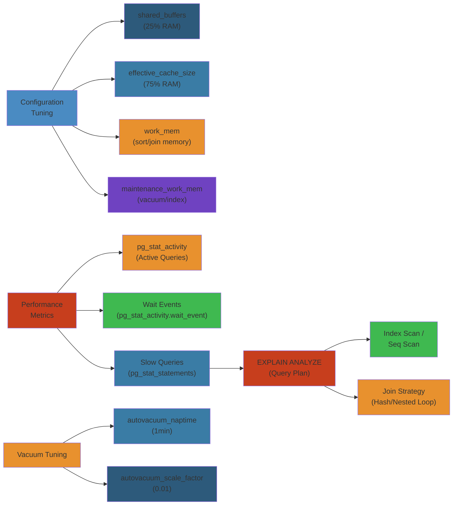

# 🛠️ PostgreSQL Tuning & Troubleshooting — Complete Deep Dive




## Table of Contents
1. [Configuration Tuning](#configuration-tuning)
2. [Query Analysis](#query-analysis)
3. [Query Optimization](#query-optimization)
4. [Performance Metrics](#performance-metrics)
5. [Wait Events](#wait-events)
6. [Index Maintenance](#index-maintenance)
7. [Connection Pooling](#connection-pooling)
8. [Replication & Backup](#replication--backup)
9. [Simplest Mental Model](#simplest-mental-model)

---

## Configuration Tuning

### Memory

```sql
shared_buffers = '4GB'               -- 25% of RAM
effective_cache_size = '12GB'        -- 50-75% of RAM (OS cache estimate)
work_mem = '32MB'                    -- per sort/hash operation
maintenance_work_mem = '1GB'         -- VACUUM, CREATE INDEX
wal_buffers = '64MB'                 -- WAL staging
```

### I/O

```sql
random_page_cost = 1.1              -- 4.0 for HDD, 1.1 for NVMe
seq_page_cost = 1.0
effective_io_concurrency = 200       -- SSD
huge_pages = 'try'
```

### Checkpoint

```sql
checkpoint_timeout = '15min'
checkpoint_completion_target = 0.9
max_wal_size = '16GB'
min_wal_size = '4GB'
```

**Burst calculation:** `WAL per checkpoint = timeout × write_rate`. With 15min × 100MB/s = 90GB → set `max_wal_size` accordingly.

### Parallelism & Connections

```sql
max_worker_processes = 16
max_parallel_workers_per_gather = 4
max_connections = 100                -- each ~10MB overhead
```

---

## Query Analysis

### EXPLAIN Variants

```sql
EXPLAIN (ANALYZE, BUFFERS, SETTINGS, WAL) SELECT ...;
```

### Reading Plans

```text
Gather                                (parallel coordinator)
  ->  Nested Loop                     (join)
        ->  Parallel Seq Scan on A    (table scan)
        ->  Index Scan using ...      (index lookup)
              Index Cond: (id = a.id) (condition pushed to index)
              Filter: (status > 5)    (post-index filter)
              Buffers: shared hit=42  (pages in cache)
```

**Index Cond vs Filter:** Index Cond is evaluated during index scan. Filter is applied after fetching tuple. Extra includes info like "Parallel", "One-Time Filter".

### Plan Node Types

```text
Scan:  Seq Scan, Index Scan, Index-Only Scan, Bitmap Scan, TID Scan
Join:  Nested Loop (small inner), Hash Join (med unindexed), Merge Join (sorted)
Sort:  Sort (work_mem spills), Incremental Sort, Merge Append
Agg:   HashAggregate (hash), GroupAggregate (sorted), Parallel Hash
```

---

## Query Optimization

### Composite Index Column Order

**Equality first, then range, then ORDER BY:**

```sql
-- WHERE a = 1 AND b > 10 ORDER BY c
CREATE INDEX ON t (a, b, c);  -- a=eq, b=range, c=sort
```

### Key Index Types

```sql
-- Partial: only index subset
CREATE INDEX idx_active ON orders (created_at) WHERE status = 'active';

-- Covering: avoid heap lookup
CREATE INDEX idx_cov ON orders (user_id, created_at) INCLUDE (total);

-- Expression
CREATE INDEX idx_lower ON users (LOWER(email));

-- BRIN for time-series (100x smaller than B-tree)
CREATE INDEX idx_brin ON orders USING brin (created_at);
```

### CTE Optimization

```sql
-- PG12+: CTEs inline by default
WITH high AS MATERIALIZED (SELECT ...)  -- force materialize
WITH high AS NOT MATERIALIZED (...)      -- force inline
```

### Statistics

```sql
ALTER TABLE users ALTER COLUMN email SET STATISTICS 1000;

CREATE STATISTICS s1 (dependencies) ON status, city FROM users;
CREATE STATISTICS s2 (mcv) ON category, region FROM orders;
CREATE STATISTICS s3 (ndistinct) ON (dept_id, role_id) FROM employees;
```

---

## Performance Metrics

```sql
-- Find long-running queries
SELECT pid, age(clock_timestamp(), query_start) AS duration,
       wait_event_type, wait_event, state, query
FROM pg_stat_activity
WHERE state = 'active' ORDER BY duration DESC;

-- Table stats (seq scans, tuple churn, HOT updates)
SELECT relname, seq_scan, idx_scan, n_tup_hot_upd,
       n_live_tup, n_dead_tup, last_autovacuum
FROM pg_stat_user_tables;

-- Index usage
SELECT indexrelname, idx_scan, idx_tup_fetch
FROM pg_stat_user_indexes;

-- bgwriter health
SELECT checkpoints_timed, checkpoints_req, buffers_checkpoint,
       buffers_backend, maxwritten_clean
FROM pg_stat_bgwriter;
```

**Interpretation:**
```text
checkpoints_req >> timed → max_wal_size too small
buffers_backend > 0      → shared_buffers too small
maxwritten_clean > 0     → bgwriter_lru_maxpages too low
```

---

## Wait Events

```text
LWLock  → Buffer mapping, WAL insert contention
Lock    → relation/tuple/page lock (DDL blocking)
IO      → DataFileRead, WALWrite (cache miss, slow I/O)
Client  → ClientRead (waiting for app query)
IPC     → Backend/bgworker signaling
Timeout → idle-in-transaction, pg_sleep
```

```sql
SELECT wait_event_type, wait_event, count(*)
FROM pg_stat_activity
WHERE wait_event IS NOT NULL
GROUP BY 1, 2 ORDER BY 3 DESC;

-- I/O wait times (needs track_io_timing=ON)
SELECT backend_type, read_time, write_time
FROM pg_stat_io WHERE read_time > 0;
```

---

## Index Maintenance

```sql
-- Bloat detection
CREATE EXTENSION pgstattuple;
SELECT * FROM pgstattuple('orders');

-- REINDEX CONCURRENTLY (PG12+, non-blocking)
REINDEX INDEX CONCURRENTLY idx_orders_created;

-- HOT updates (same-page updates, no index change)
SELECT n_tup_hot_upd * 100.0 / NULLIF(n_tup_upd, 0) AS hot_pct
FROM pg_stat_user_tables;
```

**Fillfactor:** `CREATE TABLE t (id INT) WITH (fillfactor = 90);` — reserves 10% space for HOT updates.

**Deduplication (PG13+):** `CREATE INDEX idx ON orders (status) WITH (deduplicate_items = ON);` — compresses duplicate keys.

---

## Connection Pooling

### PgBouncer

```text
Apps (200) → PgBouncer → PostgreSQL (50 conns)
```

```ini
[pgbouncer]
pool_mode = transaction              -- recommended (release after tx)
pool_size = 50
max_db_connections = 100
server_idle_timeout = 300
reserve_pool_size = 5
reserve_pool_timeout = 5.0
auth_type = scram-sha-256
```

**Modes:** `session` (per client session), `transaction` (per tx, recommended), `statement` (per stmt).

---

## Replication & Backup

```sql
-- Replication lag
SELECT pg_size_pretty(pg_wal_lsn_diff(pg_current_wal_lsn(), replay_lsn))
       AS lag_bytes, replay_lag FROM pg_stat_replication;

-- Sync replication
ALTER SYSTEM SET synchronous_standby_names = 'FIRST 1 (standby1)';

-- Quorum commit
ALTER SYSTEM SET synchronous_standby_names = 'ANY 2 (s1, s2, s3)';
```

```bash
# pg_dump (logical)
pg_dump -Fc -d mydb > mydb.dump

# pg_basebackup (physical)
pg_basebackup -h primary -D /data -X stream -P

# pgBackRest (parallel, incremental)
pgbackrest --stanza=mydb --type=full backup

# WAL-G (cloud-native)
wal-g backup-push /var/lib/pgsql/16/data
```

### PG16+ Features

```sql
-- pg_stat_io: I/O breakdown by backend type
SELECT backend_type, reads, writes, read_time FROM pg_stat_io;

-- Incremental backup support
SELECT pg_backup_start(label := 'incr', fast := true);

-- pg_createsubscriber: convert standby to logical subscriber
-- Parallel distinct + ordered aggregates
SELECT DISTINCT status, COUNT(*) FROM orders GROUP BY status;
```

---

## Simplest Mental Model

```
PostgreSQL tuning is like tuning a race car:

1. shared_buffers = fuel tank (enough to go far)
2. work_mem = nitrous (bigger = faster per query, but limited)
3. effective_cache_size = estimated track size (guides planner)
4. EXPLAIN ANALYZE = looking under the hood while driving
5. Vacuum = oil change (skip it and engine seizes)
6. Connection pool = pit crew (not 1000 people filling at once)
7. WAL = black box (survives crashes)
8. Index = GPS (find rows without scanning the whole city)
9. Wait events = check engine light (tells you what's slow)
10. Backups = spare tire (never need it until you NEED it)
```


---

## Code Examples

```python
import psycopg2
import time

# Query performance diagnostics
def diagnose_slow_query(conn, query: str):
    with conn.cursor() as cur:
        cur.execute("EXPLAIN (ANALYZE, BUFFERS, FORMAT JSON) " + query)
        plan = cur.fetchone()[0][0]

        scan_type = plan['Plan']['Node Type']
        total_cost = plan['Plan']['Total Cost']
        actual_rows = plan['Plan']['Actual Rows']
        buffers = plan['Plan'].get('Shared Hit Blocks', 0)

        print(f"Scan: {scan_type}, Cost: {total_cost}, Rows: {actual_rows}")
        if 'Parallel' in scan_type:
            print("Warning: Parallel scan on low-cardinality table")
        if buffers == 0 and actual_rows > 0:
            print("Warning: No shared buffer hits — cache miss")

# Auto-vacuum health check
def check_vacuum_health(conn):
    with conn.cursor() as cur:
        cur.execute("""
            SELECT relname, n_dead_tup, last_autovacuum,
                   age(relfrozenxid) as xid_age
            FROM pg_stat_user_tables
            WHERE n_dead_tup > 1000 OR age(relfrozenxid) > 1000000
            ORDER BY n_dead_tup DESC
        """)
        for row in cur:
            if row[2] and (time.time() - row[2].timestamp()) > 86400:
                print(f"Table {row[0]}: {row[1]} dead tuples, last VACUUM >24h ago")

conn = psycopg2.connect("dbname=prod user=admin host=/var/run/postgresql")
check_vacuum_health(conn)
```

```bash
# Find and kill a blocking session
BLOCKED=$(psql -Atc "SELECT pid FROM pg_stat_activity \
  WHERE pid = ANY(pg_blocking_pids(
    (SELECT pid FROM pg_stat_activity WHERE state = 'active' ORDER BY query_start LIMIT 1)
  ))" && echo $BLOCKED && test -n "$BLOCKED" && \
  psql -c "SELECT pg_terminate_backend($BLOCKED);"
```

---

## Common Failure Modes

**Problem**: Connection pool exhaustion during traffic spikes

**Root cause**: `max_connections` set too high (wastes memory per connection) or too low (rejects connections). Each connection consumes ~10MB. Apps that don't use connection pooling open-and-close rapidly, leaving behind `idle in transaction` sessions that hold locks.

**Detection**: `pg_stat_activity` shows many `idle in transaction` states. App logs show `FATAL: sorry, too many clients already`. `checkpoints_req >> checkpoints_timed` in `pg_stat_bgwriter`.

**Solution**: Set `max_connections = 100` and use PgBouncer in transaction mode. Kill stuck idle transactions with `pg_terminate_backend()`. Add `idle_in_transaction_session_timeout = '5min'`. Scale read replicas for read traffic.

**Problem**: Query plan regresses after ANALYZE, causing sequential scans on large tables

**Root cause**: Stale or insufficient statistics. `default_statistics_target = 100` may miss correlations. After bulk loads, `autovacuum` may not trigger quickly enough, leaving the planner with outdated row counts.

**Detection**: Same query that used an index scan now does a seq scan. `EXPLAIN (ANALYZE)` shows estimated rows vs actual rows off by 100x+. `pg_stat_user_tables` shows `last_analyze` timestamp is old.

**Solution**: Increase `default_statistics_target = 500` for columns with skewed data. Use `CREATE STATISTICS` on correlated columns. Run `ANALYZE` after bulk loads. For critical queries, use `pg_hint_plan` extension to force index scans.

---

## Interview Questions

### Q1: How does PostgreSQL handle connection management and what's the recommended approach for high-traffic apps?

**Answer**: PostgreSQL uses a one-backend-process-per-connection model (multi-process). Each connection consumes ~10MB of memory. With 1000 connections, that's 10GB before any query work. The recommended approach is PgBouncer in transaction pooling mode — it multiplexes app connections into a smaller pool of Postgres connections. Transaction mode releases the backend after each transaction, so 200 app connections share 50 Postgres connections. For high-traffic apps, also set `idle_in_transaction_session_timeout` and use read replicas to distribute load.

### Q2: How would you diagnose and fix a sudden PostgreSQL performance degradation in production?

**Answer**: First check `pg_stat_activity` for long-running queries or blocking sessions. Use `pg_blocking_pids()` to find lock holders. Next check `pg_stat_bgwriter` — if `checkpoints_req >> checkpoints_timed`, increase `max_wal_size`. Check `pg_stat_user_tables` for bloat (high dead tuple count) and trigger a manual VACUUM if needed. Use `EXPLAIN (ANALYZE, BUFFERS)` on the slow query — look for sequential scans on large tables, mismatched row estimates, or Nested Loop joins where Hash Join would be better. Check wait events via `pg_stat_activity` — `LWLock` means buffer contention, `IO` means disk bottleneck. For I/O, check if `effective_io_concurrency` and `random_page_cost` are tuned for SSD.


## Comparison Table

| Aspect | Option A | Option B | Trade-off |
| ---- | ---- | ---- | ---- |
| Performance | High | Medium | Speed vs Simplicity |
| Complexity | High | Low | Features vs Ease of Use |
| Scalability | Excellent | Good | Horizontal vs Vertical |
| Cost | High | Low | Features vs Budget |