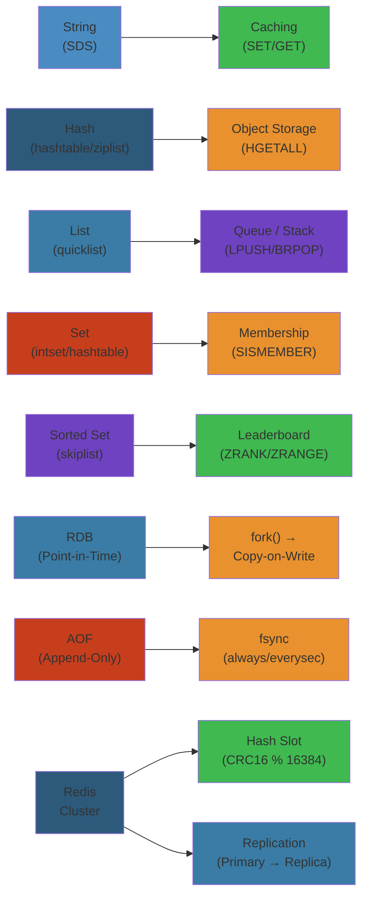
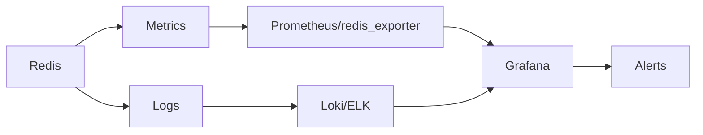

# 🚀 Redis — Complete Deep Dive




## Table of Contents


1. [Data Structures Overview](#data-structures-overview)
2. [Data Structure Internals](#data-structure-internals)
3. [Memory Optimization](#memory-optimization)
4. [Persistence](#persistence)
5. [Replication](#replication)
6. [Redis Cluster](#redis-cluster)
7. [Sentinel](#sentinel)
8. [Transactions & Lua](#transactions--lua)
9. [Modules](#modules)
10. [Simplest Mental Model](#simplest-mental-model)

---

## Data Structures Overview


```text
String      → SDS (512MB max)
List        → quicklist
Set         → intset / dict
Sorted Set  → skiplist + dict
Hash        → listpack / dict
Stream      → radix tree
Bitmap      → string as bits
HyperLogLog → probabilistic (~12KB, 2^64 count)
Geospatial  → geohash + sorted set
Bloom/Cuckoo/T-Digest/CMS → modules
```

---

## Data Structure Internals


### SDS (Simple Dynamic String)


```text
┌──────┬──────┬──────┬──────────────────────┐
│ len  │ alloc│flags │  buf[]               │
│ (4B) │ (4B) │ (1B) │ (flexible, null-term)│
└──────┴──────┴──────┴──────────────────────┘
```

O(1) length, binary safe, preallocation to next power of 2.

### Encoding


```python
EMBSTR_LIMIT = 44  # 64 - header(19) - null(1)
if len(value) <= EMBSTR_LIMIT:
    encoding = "embstr"  # single alloc
elif value.isdigit() and within_int64:
    encoding = "int"     # stored as C long
else:
    encoding = "raw"     # separate allocs
```

### SkipList (Sorted Set)


```text
Level 4:  ──────► 45 ──────────────────────────► NULL
Level 3:  ──────► 45 ─────────────► 78 ────────► NULL
Level 2:  ──────► 45 ───► 62 ─────► 78 ───► 99 ─► NULL
Level 1:  ─────► 12 ──► 45 ──► 62 ──► 78 ──► 99 ─► NULL
             HEAD

Search 78: HEAD→45(L4)→drop→45(L3)→78→FOUND
```

```python
def random_level():
    level = 1
    while random() < 0.25 and level < MAX_LEVEL:
        level += 1
    return level
```

### Dict (Hash Table)


```python
class RedisDict:
    def __init__(self):
        self.ht = [HashTable(4), HashTable(0)]
        self.rehashidx = -1

    def insert(self, key, val):
        if self.ht[0].used >= self.ht[0].size * 5:  # load factor
            self._start_rehash(self.ht[0].size * 2)
        if self.rehashidx >= 0:
            self._rehash_step()

    def _rehash_step(self):
        # Incremental: move 10 buckets per operation
        for _ in range(10):
            if self.rehashidx < 0:
                break
            # Move bucket from ht[0] → ht[1]
            self.rehashidx += 1
```

### Stream (Radix Tree)


Compressed trie with listpack leaf nodes. Each entry ID = `timestamp-sequence`.

---

## Memory Optimization


### Key Naming & Expiration


```redis
# Bad: long prefixes
SET "user:12345:profile:email:verified" "true"
# Good: short
SET "u:12345:eml_vrf" "true"
SETEX "session:abc123" 3600 "data"
```

Expiration: **Lazy** (check on access) + **Active** (sample 20 keys every 100ms, if >25% expired, repeat).

### Eviction Policies


```redis
maxmemory 4gb
maxmemory-policy allkeys-lru   # General purpose
```

```text
allkeys-lru      → LRU among all keys       [general]
allkeys-lfu      → LFU among all keys       [repeated patterns]
volatile-lru     → LRU among keys with TTL  [if you set TTLs]
noeviction       → return errors on writes  [safety]
allkeys-random   → random eviction          [uniform access]
```

### Memory Fragmentation


```bash
INFO memory | grep mem_fragmentation_ratio
# >1.5 → fragmentation (check jemalloc)
# <1.0 → swapping (BAD)

CONFIG SET activedefrag yes
```

**jemalloc:** Size classes (8, 16, 32, 48, 64, ...) — each has own arena, reduces cross-size fragmentation.

---

## Persistence


### RDB (Snapshot)


```redis
save 900 1    # 15min if ≥1 change
save 300 10   # 5min if ≥10
save 60 10000 # 1min if ≥10K
BGSAVE         # background fork + COW
```

### AOF (Append-Only File)


```redis
appendfsync everysec  # default (good balance)
appendfsync always    # safest, slowest
appendfsync no        # let OS decide
```

**AOF Rewrite:** Fork child → build new AOF from memory → parent appends buffered commands → atomic rename.

### Hybrid (Redis 4+)


```text
appendonly.aof = [RDB snapshot | AOF incremental commands]
Fast restart: load RDB, replay only incremental AOF.
```

---

## Replication (PSYNC2)


```text
REPLICAOF host port
  → PSYNC replid offset
    ├── Partial: CONTINUE (backlog has data) → send buffered cmds
    └── Full: FULLRESYNC new_replid offset
        → BGSAVE → send RDB → buffer writes → replica loads + catch up
```

**Backlog:** Circular buffer (`repl-backlog-size 64mb`). If replica offset in backlog → partial sync.

---

## Redis Cluster


```text
Nodes: A(0-5461), B(5462-10922), C(10923-16383)
         └── each has replica ──┘
         Gossip protocol (PING/PONG every 1s)
```

```python
def slot_for_key(key):
    if '{' in key and '}' in key:
        key = key[key.index('{')+1:key.index('}')]
    return crc16(key) & 16383  # 16384 slots
```

**Resharding:** MIGRATE keys → CLUSTER SETSLOT NODE. Client gets MOVED (cache permanently) or ASK (temporary redirect).

**Consistency:** No strong consistency. Async replication. Minority partition stops accepting writes.

---

## Sentinel


```text
Sentinels (3+) monitor master/replicas.
S1 marks master SDOWN (no PONG) → asks others → ODOWN → leader elected
→ picks replica with highest offset → REPLICAOF NO ONE → others follow

Config epoch prevents split-brain.
```

---

## Transactions & Lua


### MULTI/EXEC/WATCH


```redis
WATCH balance                        -- optimistic lock
MULTI                                -- queue commands
DECR balance 100
INCR other_account 100
EXEC                                 -- nil if WATCHed key changed
```

### Lua Scripting


```lua
-- Atomic transfer (runs on server, no network roundtrips)
local bal = redis.call('GET', KEYS[1])
if tonumber(bal) < tonumber(ARGV[1]) then
    return redis.error_reply('Insufficient funds')
end
redis.call('DECRBY', KEYS[1], ARGV[1])
redis.call('INCRBY', KEYS[2], ARGV[1])
```

```redis
EVAL "script" 2 from to amount
EVALSHA <sha1> 2 from to amount   -- cached script (SCRIPT FLUSH to clear)
```

---

## Modules


```redis
# RediSearch: full-text search
FT.CREATE idx ON HASH PREFIX 1 "product:" SCHEMA name TEXT
FT.SEARCH idx "@name:laptop @price:[500 1500]"

# RedisJSON: native JSON ops
JSON.SET doc $ '{"name":"Alice"}'
JSON.ARRAPPEND doc $.tags '"premium"'

# RedisBloom: probabilistic data structures
BF.ADD bloom "user:42"
BF.EXISTS bloom "user:42"

# RedisTimeSeries: time-series with downsampling
TS.CREATE sensor:temp RETENTION 86400000
TS.RANGE sensor:temp 1614556800 1614643200
```

---

## Simplest Mental Model


```
Redis is a toolbox where everything is a key:

1. STRING = sticky note (text, numbers, bits)
2. LIST = linked chain (queue, stack)
3. SET = bouncer's list (unique, fast membership)
4. SORTED SET = leaderboard (ordered by score)
5. HASH = mini filing cabinet (fields within a key)
6. STREAM = conveyor belt (event log, message queue)
7. All data lives in RAM (that's why it's fast)
8. Persistence = photo (RDB) + diary (AOF)
9. Cluster = multiple toolboxes sharing the work
10. Sentinel = friend watching the toolbox

"If you need to go to disk, you've already lost"
```


---

## Code Examples


```python
import redis
import time

r = redis.Redis(host='cluster-endpoint', port=6379, decode_responses=True)

# Distributed rate limiter using sorted sets (sliding window)
def rate_limit(user_id: str, max_requests: int, window_sec: int = 60) -> bool:
    key = f"ratelimit:{user_id}"
    now = time.time()
    cutoff = now - window_sec
    pipe = r.pipeline()
    pipe.zremrangebyscore(key, 0, cutoff)
    pipe.zadd(key, {str(now): now})
    pipe.zcard(key)
    pipe.expire(key, window_sec)
    _, _, count, _ = pipe.execute()
    return count <= max_requests

# Session cache with automatic failover
def get_session(session_id: str) -> dict | None:
    data = r.get(f"session:{session_id}")
    if data:
        r.expire(f"session:{session_id}", 3600)
        return eval(data)
    return None

def set_session(session_id: str, data: dict):
    r.setex(f"session:{session_id}", 3600, str(data))

# Leaderboard with pagination
def get_top_players(game: str, page: int = 0, page_size: int = 10):
    start = page * page_size
    end = start + page_size - 1
    return r.zrevrange(f"leaderboard:{game}", start, end, withscores=True)
```

---

## Common Failure Modes


**Problem**: Cache stampede — thundering herd when cached key expires under high concurrency

**Root cause**: Multiple concurrent requests find the key expired and all hit the backend database simultaneously. This can saturate the DB connection pool, increase latency by 10x, and cascade to other services.

**Detection**: Monitoring shows a spike in DB queries at the same moment Redis keys expire. Application latency graph shows periodic sawtooth pattern at TTL boundaries. Redis `INFO stats` shows high `expired_keys` rate.

**Solution**: Use locking (SET NX) around cache rebuild so only one request recomputes the value. Use early expiration with jitter — set TTL to base + random(0, 0.1 * base) to stagger expiry. For critical data, use a background refresh pattern: proactively recompute before TTL expires.

**Problem**: Memory fragmentation causing OOM kills despite low actual data size

**Root cause**: Redis uses jemalloc. When keys are created and deleted at varying sizes (e.g., storing small strings then overwriting with larger ones), memory becomes fragmented. `used_memory` may show 2GB but `used_memory_rss` shows 4GB. When RSS exceeds `maxmemory`, Redis gets OOM-killed by the kernel.

**Detection**: `INFO memory` shows `mem_fragmentation_ratio > 1.5`. `used_memory` is well below `maxmemory` but the process RSS is near or above it.

**Solution**: Enable `activedefrag yes` with `active-defrag-threshold-lower 10`. Rename keys to use consistent sizes. Prefer hash data type (listpack encoding) over many individual string keys. Restart during low traffic to defragment. If using VMs, ensure transparent huge pages are disabled (`echo never > /sys/kernel/mm/transparent_hugepage/enabled`).

---

## Interview Questions


### Q1: How does Redis handle eviction and what policy should you choose for a caching use case?


**Answer**: Redis applies eviction when memory exceeds `maxmemory`. It uses a combination of lazy (check on every command) and active (sample keys every 100ms) eviction. For caching, `allkeys-lru` is the general-purpose choice — it evicts the least recently used keys across all keys. `allkeys-lfu` is better for workloads with skewed access patterns (some keys accessed much more frequently than others). `volatile-lru` only evicts keys with TTL set, which is useful when some keys should never be evicted. `noeviction` returns errors on writes — use it as a safety net to prevent data loss but monitor closely.

### Q2: How would you design a Redis deployment for high availability with automatic failover?


**Answer**: Use Redis Sentinel for HA. Deploy at least 3 Sentinel nodes (odd number for quorum) monitoring a master-replica pair. Sentinels use gossip to agree on master status — if a master is unreachable, a leader election happens (requires majority), and a replica is promoted. Configure the application to connect via Sentinel (not directly to master) so it gets the current master address. For higher scale, use Redis Cluster with 3 masters and 3 replicas — data is sharded across 16384 hash slots, each master replicates to one replica. If a master fails, its replica is promoted. Cluster mode provides both HA and horizontal scaling but has limitations (multi-key operations only within same hash slot).


## Observability




### Key Metrics


| Metric | Unit | Threshold | Indicates |
|--------|------|-----------|-----------|
| Hit rate (keyspace_hits/keyspace_misses) | % | > 90% | Cache efficiency |
| Evicted keys per second | count/s | 0 | Memory pressure |
| Memory fragmentation ratio | ratio | 1.0-1.5 | Fragmentation |
| Connected clients | count | < 80% of maxclients | Connection exhaustion |
| Replication lag | bytes | 0 | Replica sync state |
| Instantaneous ops/sec | ops/s | varies | Throughput capacity |
| CPU (Redis) | % | < 75% | Command complexity |
| Slow log count | count/h | < 10 | Slow commands |

### Logs


- **ERROR**: OOM on write, replication failure, cluster fail state, AOF rewrite failure
- **WARN**: Evictions > 0, memory > maxmemory, replication buffer growing, fork delay
- **INFO**: BGSAVE complete, AOF rewrite, failover, replica connected, config rewrite

### Alerts


| Severity | Condition | Response |
|----------|-----------|----------|
| P0 | Evictions > 0 | Increase maxmemory, add nodes |
| P0 | Replication broken | Fix network, rebuild replica |
| P1 | Hit rate < 80% | Warm cache, review TTLs |
| P2 | Memory fragmentation > 1.5 | Restart or use MEMORY PURGE |

### Dashboards


**Redis Overview**: CPU, memory, hit rate, evictions, connected clients, commands/sec, network I/O.


## Common Failures


### Failure: Cache Stampede


- **Symptoms**: DB load spikes, latency increases. Cache miss rate suddenly 100% for popular keys.
- **Root Cause**: All cache keys expire at same TTL boundary. N concurrent requests hit DB simultaneously.
- **Detection**: Hit rate drops to 0 then recovers. DB CPU/IOPS spike.
- **Recovery**: Pre-warm cache. Extend TTL for popular keys. Add mutex lock.
- **Prevention**: Add TTL jitter (+-30%). Use mutex with SET NX. Probabilistic early expiration.

### Failure: Memory Fragmentation


- **Symptoms**: `used_memory_rss` >> `used_memory`. Process memory high but data small. OOM risk despite low data.
- **Root Cause**: Redis allocates/frees differently-sized objects. Jemalloc can't return pages to OS. Common with frequent expiry/deletion.
- **Detection**: `mem_fragmentation_ratio` > 1.5. RSS growing but used_memory stable.
- **Recovery**: 1) `MEMORY PURGE` (Redis 4+). 2) Restart instance (reload from AOF/RDB). 3) Add more memory.
- **Prevention**: Use `maxmemory-policy allkeys-lru`. Keep TTLs consistent (same-size keys). Use Redis 4+ jemalloc improvements.

### Failure: Fork-Based Save Latency


- **Symptoms**: Latency spikes, correlated with BGSAVE/AOF rewrite. P99 10x during save.
- **Root Cause**: BGSAVE forks Redis process. Fork blocks for large heaps. Copy-on-write page faults.
- **Detection**: Fork duration in latency history. Redis latency spikes on :6379.
- **Recovery**: 1) Disable auto BGSAVE. 2) Schedule saves off-peak. 3) Reduce instance memory.
- **Prevention**: Keep memory < 4GB per instance. Use `repl-diskless-sync`. Schedule saves.

### Failure: Cluster Failover Issues


- **Symptoms**: Data loss on failover. Cluster in fail state. Write commands fail.
- **Root Cause**: Network partition. Node timeout too aggressive. Quorum not met.
- **Detection**: `CLUSTER INFO` shows `cluster_state:fail`. `cluster_known_nodes` missing.
- **Recovery**: 1) `CLUSTER FAILOVER TAKEOVER` on replicas. 2) Re-add failed nodes. 3) Ensure slot coverage.
- **Prevention**: Set `cluster-node-timeout` appropriately. Use 3+ nodes in different AZs.
