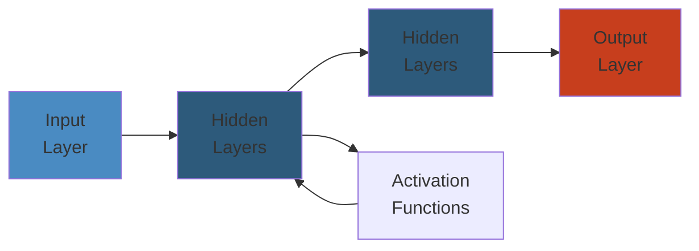

# 🎯 NoSQL Databases — Complete Deep Dive




## Table of Contents
1. [NoSQL Taxonomy](#nosql-taxonomy)
2. [DynamoDB Internals](#dynamodb-internals)
3. [MongoDB Internals](#mongodb-internals)
4. [Cassandra Internals](#cassandra-internals)
5. [Elasticsearch Internals](#elasticsearch-internals)
6. [Simplest Mental Model](#simplest-mental-model)

---

## NoSQL Taxonomy

```text
Key-Value → Redis, DynamoDB, Riak, Etcd
Document  → MongoDB, Couchbase, Firestore
Column    → Cassandra, ScyllaDB, HBase, BigTable
Graph     → Neo4j, ArangoDB, JanusGraph, Dgraph
Search    → Elasticsearch, Meilisearch, Typesense, Solr
```

### CAP Tradeoffs

```text
CP (Consistent + Partition-tolerant):
  HBase, MongoDB (default), Redis Cluster, Etcd
AP (Available + Partition-tolerant):
  Cassandra, DynamoDB (default), CouchDB, Riak
```

---

## DynamoDB Internals

### Data Model

```text
Table: Orders
  Partition Key: customer_id  (hash → partition)
  Sort Key:      order_date   (range → sort within partition)
  LSI: same PK, different SK (must create at table creation)
  GSI: different PK+SK (can create anytime, separate RCU/WCU)
```

### Partitioning

```text
Hash(key) → partition (10GB each)
RCU/WCU split evenly. Hot key throttles entire partition.

RCU: 1 RCU = 4KB strong, 8KB eventual, 2KB transactional
WCU: 1 WCU = 1KB standard, 0.5KB transactional
```

**Adaptive Capacity:** Burst unused capacity from other partitions.

### Streams & DAX

```text
DynamoDB Stream → Shards → Kinesis Adapter → Lambda/App
  24h retention, INSERT/MODIFY/REMOVE records

DAX (Accelerator): write-through cache → microsecond reads
```

---

## MongoDB Internals

### Document Model (BSON)

BSON: binary JSON with native types (Date, ObjectId, Decimal128). Max doc size: 16MB.

### WiredTiger Storage

```text
Memory: Cache (internal pages) + Snapshots (MVCC versions)
Disk:   Checkpoint (consistent snapshot) + Journal (WAL)
        Data files (B-tree, snappy/zstd/zlib compression)
```

**Checkpoint:** Block new txns → wait for active → flush dirty pages → atomic metadata update.

### Replication (Replica Set)

```text
Primary (all writes, oplog) → Secondary (replicate oplog)
                              Secondary (vote + replicate)
Optional: Arbiter (vote only, no data)
```

**Oplog:** Capped collection. Idempotent operations. Election by majority.

### Sharding

```text
mongos (router) → Config Servers (metadata, RS of 3)
                → Shard 0 (RS, range a-f)
                → Shard 1 (RS, range g-n)
                → Shard 2 (RS, range o-z)
```

**Shard key types:** Range (physical proximity), Hashed (even distribution), Zone (geographic).

### Aggregation Pipeline

```js
db.orders.aggregate([
  { $match:  { status: "completed" } },
  { $group:  { _id: "$customer_id", total: { $sum: "$amount" } } },
  { $sort:   { total: -1 } },
  { $limit:  10 },
  { $lookup: { from: "customers", localField: "_id", foreignField: "customer_id", as: "c" } },
  { $unwind: "$c" },
  { $merge:  { into: "top_customers" } }
]);
```

---

## Cassandra Internals

### Data Model

```sql
PRIMARY KEY ((category, region),  product_id,  created_at)
             └──partition key──┘  └──clustering columns──┘
```

Row key `electronics|US` → partition. Clustering: `product_id ASC, created_at ASC`.

### Partitioner & VNodes

```python
def partition(key):
    return murmur3(key) % num_vnodes  # -2^63 to 2^63-1
```

**VNodes:** 256 per node. Even distribution, less data movement on add/remove.

### Gossip

Every 1s: pick random peer, exchange state (generation, version, heartbeat). Last-writer-wins merge.

### Read Path

```text
Coordinator → digest from QUORUM replicas
           → if match: return
           → if mismatch: full read from all → reconcile → repair
```

**Hinted Handoff:** If replica down, coordinator stores hint (3h TTL). Delivered when replica returns.

### Tombstones

```python
# Delete = insert tombstone marker
def delete(pk, ck):
    write(Tombstone(deletion_time=now()))
```

Tombstones survive `gc_grace_seconds` (default 10 days). Compaction removes them after that.

### Consistency Levels

```text
ONE, TWO, THREE, QUORUM (RF/2+1), LOCAL_QUORUM, EACH_QUORUM, ALL, ANY
```

**Lightweight Transactions (Paxos):**
```sql
INSERT INTO products (id, price) VALUES (1, 100) IF NOT EXISTS;
UPDATE products SET price = 200 WHERE id = 1 IF price = 100;
```

---

## Elasticsearch Internals

### Inverted Index

```text
Doc 1: "The quick brown fox"
Doc 2: "The lazy dog"

the  → [1, 2]
quick→ [1]
brown→ [1]
fox  → [1]
lazy → [2]
dog  → [2]

Each posting: doc_id + term frequency + positions
```

### Segment Structure

```text
Index → Shard → Segments (immutable)
  .tip = term index (prefix → .tim block)
  .tim = term dictionary (block tree)
  .doc = postings (doc IDs, frequencies)
  .pos = positions

Refresh (1s): buffer → new segment (visible, but not fsynced)
Flush (30m/500MB): commit + fsync + clear translog
Merge: combine small segments → delete old
```

### Cluster State

Metadata on all nodes: index settings, mappings, routing, allocation. Only master updates it. Published via Zen Discovery.

### Query DSL

```json
{
  "query": {
    "bool": {
      "must":   [{ "match": { "title": "laptop" } }],
      "filter": [{ "range": { "price": { "gte": 500 } } }],
      "should": [{ "match": { "description": "gaming" } }]
    }
  },
  "aggs": {
    "by_cat": {
      "terms": { "field": "category" },
      "aggs": { "avg_price": { "avg": { "field": "price" } } }
    }
  }
}
```

### BM25 Scoring

```python
def bm25(tf, doc_len, avg_dl, num_docs, df):
    k1, b = 1.2, 0.75
    idf = math.log(1 + (num_docs - df + 0.5) / (df + 0.5))
    tf_norm = (tf * (k1 + 1)) / (tf + k1 * (1 - b + b * doc_len / avg_dl))
    return idf * tf_norm
```

---

## Simplest Mental Model

```
DynamoDB = luggage carousel
  Each bag (partition key) → one carousel
  Sorting (sort key) within bag
  Eventually all carousels have same bags

MongoDB = filing cabinet with labeled folders
  Drawers (shards) contain folders (documents)
  Pipeline = assembly line to transform docs
  Replica set = photocopier for backup

Cassandra = shared whiteboard divided into sections
  Anyone writes to their section
  Periodically everyone reads each other's sections
  Quorum = majority agreement
  Tombstones = whiteboard erasures (visible until cleaned)

Elasticsearch = Google for your data
  Builds index of everything (inverted index)
  Splits into chapters (shards)
  New pages refresh every second
  BM25 ranks relevance

"SQL is a Swiss Army knife. NoSQL is a toolbox."
```


---

## Code Examples

```python
# Example implementation
# [Add language-specific code demonstrating core concept]
pass
```

---

## Common Failure Modes

**Problem**: [Key issue in production]

**Root cause**: [Why it happens]

**Solution**: [How to fix]

---

## Interview Questions

### Q1: [Core concept question]

**Answer**: [Detailed explanation with trade-offs]

### Q2: [Design/architecture question]

**Answer**: [Best practices and reasoning]
