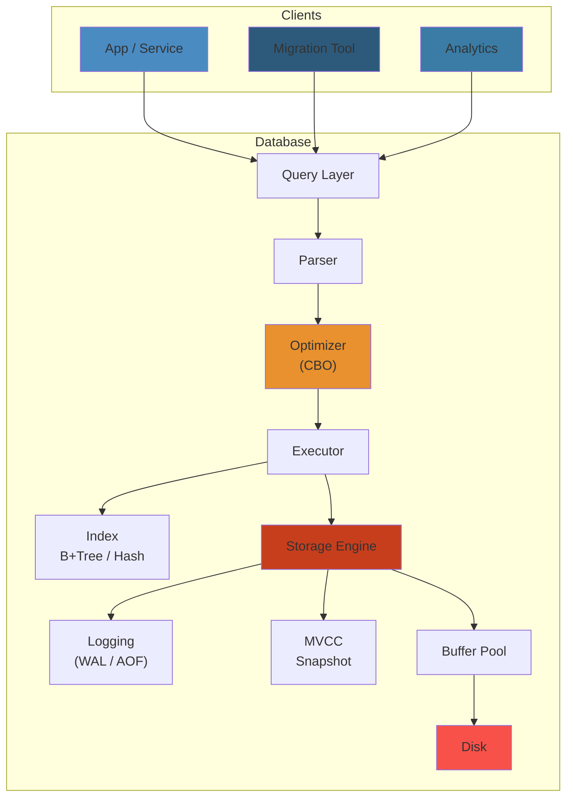
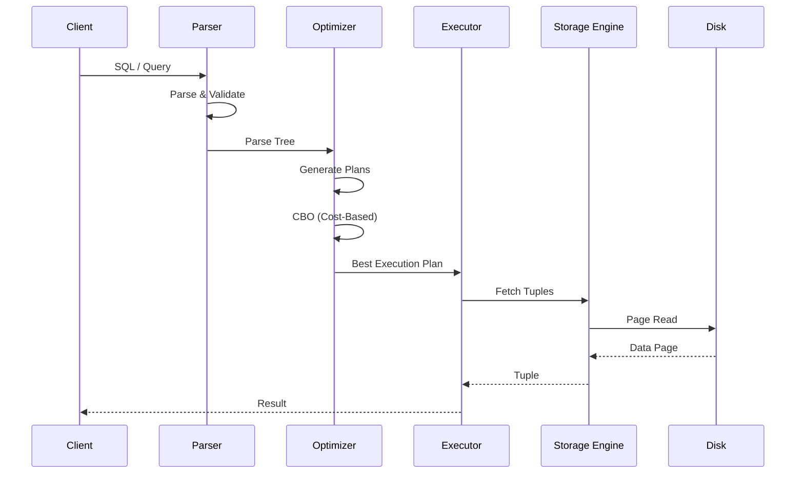

# 08 — Databases

The theory and practice of data storage, retrieval, and management. Covers relational databases (PostgreSQL, MySQL), NoSQL systems (MongoDB, Cassandra, DynamoDB), in-memory stores (Redis), distributed SQL (CockroachDB, TiDB, Spanner), storage engine internals (B+tree, LSM, MVCC, WAL), query optimization, performance tuning, and troubleshooting.

## Table of Contents

## Database Comparison

| Feature | PostgreSQL | MongoDB | Cassandra | Redis | Elasticsearch |
|---------|-----------|---------|-----------|-------|---------------|
| **Model** | Relational (SQL) | Document | Wide-Column | Key-Value | Inverted Index |
| **Consistency** | Strong | Tunable | Eventual | Strong | Near Real-Time |
| **Partitioning** | Manual | Sharding | Auto (Partitioner) | Clustering | Auto Sharding |
| **Replication** | Primary/Standby | Replica Set | Gossip + Hinted Handoff | Primary/Replica | Multi-Node |
| **Index** | B+Tree, GiST, GIN | B+Tree | SSTable/LSM | Skip List | Inverted Index |
| **Transactions** | ACID | Multi-Doc | Lightweight | MULTI/EXEC | Per Document |
| **Use Case** | OLTP, Analytics | Content, IoT | Time-Series, IoT | Cache, Session | Search, Logs |

## Query Flow

- [Relational Databases](#relational-databases)
  - [PostgreSQL](#postgresql)
  - [MySQL](#mysql)
- [NoSQL](#nosql)
  - [Document Stores](#document-stores)
  - [Wide-Column Stores](#wide-column-stores)
  - [Key-Value Stores](#key-value-stores)
  - [Search Engines](#search-engines)
  - [Graph Databases](#graph-databases)
  - [Time-Series](#time-series)
- [Redis](#redis)
  - [Data Structures](#data-structures)
  - [Persistence](#persistence)
  - [High Availability](#high-availability)
  - [Use Cases](#use-cases)
- [Distributed SQL](#distributed-sql)
  - [CockroachDB](#cockroachdb)
  - [TiDB](#tidb)
  - [Google Spanner](#google-spanner)
  - [YugabyteDB](#yugabytedb)
- [Database Internals](#database-internals)
  - [B+tree Index](#btree-index)
  - [LSM-Tree](#lsm-tree)
  - [MVCC](#mvcc)
  - [Write-Ahead Log (WAL)](#write-ahead-log-wal)
  - [Buffer Pool](#buffer-pool)
  - [Query Execution](#query-execution)
- [Troubleshooting](#troubleshooting)
  - [Slow Queries](#slow-queries)
  - [Connection Issues](#connection-issues)
  - [Replication Lag](#replication-lag)
  - [Lock Contention](#lock-contention)
  - [Resource Exhaustion](#resource-exhaustion)
- [Performance Tuning](#performance-tuning)
  - [Indexing Strategies](#indexing-strategies)
  - [Query Optimization](#query-optimization)
  - [Configuration Tuning](#configuration-tuning)
  - [Schema Design](#schema-design)
- [Learning Path](#learning-path)
- [Cross-References](#cross-references)

---

## Relational Databases

### PostgreSQL

The most advanced open-source relational database. ACID-compliant, extensibility, excellent concurrency.

- **Architecture** — process-per-connection model; shared buffers, WAL segments, checkpoint process, autovacuum launcher/workers, background writer, stats collector, logical replication walsender
- **Data Types** — numeric, text, boolean, JSON/JSONB, arrays, hstore, UUID, enum, range, interval, CIDR/inet, geometric, custom (CREATE TYPE), composite
- **Indexes** — B-tree (default), Hash (limited use), GiST (full-text, geometry), GIN (JSONB, arrays), SP-GiST (partitioned trees), BRIN (large tables, correlated ordering), Bloom (multi-column); partial, expression, unique, concurrent, covering (INCLUDE)
- **Advanced Features** — CTEs (WITH), window functions, recursive queries, DISTINCT ON, LATERAL JOIN, FOR UPDATE/SHARE, RETURNING, upsert (ON CONFLICT DO UPDATE/NOTHING), partitioning (range, list, hash, sub-partitioning)
- **Concurrency** — MVCC (snapshot isolation), transaction isolation levels (Read Uncommitted, Read Committed <default>, Repeatable Read, Serializable), row-level locking, advisory locks, SKIP LOCKED, NOWAIT
- **Extensions** — PostGIS (geospatial), pgvector (vector similarity), pg_partman (partition management), pg_stat_statements (query stats), auto_explain, pg_hint_plan, timescaledb (time-series), Citus (distributed), pg_ivm (incremental materialized views)
- **Replication** — Streaming replication (physical), synchronous/async; logical replication (publish/subscribe, selective tables, major version upgrades), pglogical, Bi-Directional
- **Backup & Restore** — pg_dump/pg_dumpall (logical), pg_basebackup (physical), WAL archiving (archive_command, restore_command), continuous archiving + PITR, pgBackRest, barman, WAL-G
- **Configuration** — shared_buffers, work_mem, maintenance_work_mem, effective_cache_size, wal_buffers, max_connections, random_page_cost, effective_io_concurrency, jit, track_io_timing

### MySQL

Most widely deployed open-source database (especially as MariaDB forks). Popular for LAMP stack, read-heavy workloads.

- **Architecture** — thread-per-connection; storage engine abstraction (MyISAM, InnoDB, Memory, CSV, Archive, Federated), InnoDB is default (ACID, MVCC, row-level locking, crash recovery)
- **InnoDB Internals** — clustered index (primary key as B+tree, rows stored in leafs), secondary indexes (pointers to PK), doublewrite buffer, change buffer (insert/update buffering for secondary indexes), adaptive hash index, redo log, undo log
- **Indexes** — B-tree (default), Hash (memory engine, NDB), Full-text, Spatial (R-tree), Descending, Functional key parts (8.0+), Generated column indexes; multi-column, prefix, INCLUDE (descending index)
- **Replication** — Async (default), semi-sync, group replication (InnoDB Cluster); binary log (statement, row, mixed); GTID-based replication, multi-source replication, delayed replication
- **Engine Comparison** — InnoDB (transactional, row locking, MVCC), MyISAM (table locking, full-text, non-transactional), Memory (heap), NDB (clustered, shared-nothing), Archive (compressed, insert-only, no indexes), TokuDB (Fractal tree, high compression)
- **Tools** — mysqldump, mysqlpump, Xtrabackup, mysqlbinlog, pt-query-digest, MySQL Shell (AdminAPI for InnoDB Cluster), ProxySQL (connection pooling, routing)

---

## NoSQL

### Document Stores

- **MongoDB** — document-oriented (BSON); collections (tables → collections, documents → rows); _id primary key (ObjectId); flexible schema, embedded documents, arrays; indexes (single, compound, multikey, text, geospatial, hashed, TTL, partial)
  - **Aggregation Pipeline** — $match, $group, $sort, $project, $lookup (join), $unwind, $facet, $bucket; optimized with indexes; vs map-reduce (deprecated)
  - **Replication** — replica set (primary + secondaries), elections (Raft-like), read preferences (primary, primaryPreferred, secondary, secondaryPreferred, nearest), write concern (w: majority, j: true)
  - **Sharding** — shard key (range, hash, zone), mongos (router), config servers; balancing, chunk migration, tag-aware sharding
  - **Storage Engines** — WiredTiger (default, document-level locking, LSM for time-series), In-memory (ephemeral)
- **Couchbase** — document + key-value; N1QL (SQL-like for JSON), FTS, analytics (via Couchbase Analytics), eventing

### Wide-Column Stores

- **Apache Cassandra** — peer-to-peer (no master), partition key → clustering columns, CQL (Cassandra Query Language); designed for write-heavy, high availability, multi-datacenter
  - **Data Model** — keyspace → table → partition key (hash determines node), clustering columns (order within partition); primary key = partition key + clustering columns; static columns, collections (list, set, map)
  - **Architecture** — gossip protocol (node discovery), snitch (topology awareness), partitioner (murmur3partitioner), virtual nodes (vnodes), hinted handoff, read repair, Merkle trees (anti-entropy)
  - **Consistency** — ANY, ONE, TWO, THREE, QUORUM, LOCAL_QUORUM, EACH_QUORUM, ALL; tunable consistency per request; consistency level + replication factor (e.g., QUORUM = RF/2 + 1)
  - **Compaction** — size-tiered (STCS), leveled (LCS), time-window (TWCS); repair (incremental vs full)
  - **DynamoDB** — (covered under cloud services) managed wide-column + document; partition key + sort key; LSI/GSI indexes; DynamoDB Streams (CDC); global tables (multi-region active-active)
- **ScyllaDB** — Cassandra-compatible, C++ rewrite; shard-per-core architecture; zero-GC pauses, lower latency

### Key-Value Stores

- **Redis** — see [Redis section](#redis) below
- **Memcached** — distributed memory cache; simple (strings only), no persistence, no replication; LRU eviction; consistent hashing for scaling
- **etcd** — distributed consistent key-value store (Raft); Kubernetes primary datastore; watch API, TTL (leases), transactions (if/then/else)
- **FoundationDB** — distributed, ACID, ordered key-value; uses deterministic simulation testing; runs multiple layers (document, relational)

### Search Engines

- **Elasticsearch** — distributed, RESTful, JSON-based search + analytics; inverted index, BM25 scoring, aggregations, percolator, cross-cluster search; Kibana for visualization
  — Cluster: nodes (master, data, ingest, coordinating), shards (primary + replicas), index lifecycle management (ILM), rollup, transforms, snapshot/restore
- **OpenSearch** — community fork of Elasticsearch (after license change); feature-compatible; OpenSearch Dashboards
- **Meilisearch** — Rust-based, developer-friendly, typo-tolerant, instant search
- **Typesense** — fast (C++), schema-optional, search and faceted filtering

### Graph Databases

- **Neo4j** — labeled property graph; Cypher query language (ASCII-art patterns); ACID; clustering (causal cluster, read replicas)
- **Amazon Neptune** — managed graph (property graph + RDF); Gremlin (Apache TinkerPop) + SPARQL

### Time-Series

- **InfluxDB** — purpose-built TSDB; measurements, tags (indexed), fields; Flux query language (now SQL in v3); TSM storage engine; continuous queries, retention policies, down-sampling
- **TimescaleDB** — PostgreSQL extension for time-series; hypertables (auto-partitioned by time); continuous aggregates, compression (native, column-level), data retention policies
- **ClickHouse** — columnar OLAP; real-time analytics; materialized views (incremental), merge tree engine; SQL-compatible (extended)

---

## Redis

In-memory data structure store—used as cache, message broker, queue, and primary database for certain workloads.

### Data Structures

- **Strings** — value up to 512MB; SET/GET, INCR/DECR, APPEND, STRLEN, GETSET, MSET/MGET
- **Lists** — linked lists; LPUSH/RPUSH, LPOP/RPOP, LRANGE, LTRIM, BLPOP/BRPOP (blocking); use cases: queues, message buffers, timeline feeds
- **Sets** — unordered, unique; SADD, SMEMBERS, SISMEMBER, SINTER/SUNION/SDIFF (set ops); SPOP, SRANDMEMBER; use cases: tags, uniqueness checks
- **Sorted Sets** — scored members; ZADD, ZRANGEBYSCORE, ZRANK, ZREVRANGE, ZINCRBY, ZINTERSTORE/ZUNIONSTORE; use cases: leaderboards, rate limiting, time-series
- **Hashes** — field-value pairs; HSET/HGET, HGETALL, HEXISTS, HINCRBY, HLEN; use cases: objects, session stores, user profiles
- **Bitmaps** — bit operations on strings; SETBIT, GETBIT, BITCOUNT, BITOP; use cases: daily active users (DAU), bloom filters
- **HyperLogLog** — approximate cardinality (~0.81% error); PFADD, PFCOUNT, PFMERGE; use cases: unique visitors, distinct elements
- **Geospatial** — GEOADD, GEODIST, GEORADIUS, GEORADIUSBYMEMBER, GEOSEARCH; use cases: location-based queries
- **Streams** — append-only log, consumer groups; XADD, XREAD, XREADGROUP, XRANGE, XDEL, XACK; use cases: message queuing, event sourcing (more flexible than Pub/Sub)
- **Pub/Sub** — channel-based messaging; PUBLISH, SUBSCRIBE, PSUBSCRIBE; fire-and-forget (no persistence)

### Persistence

- **RDB (Redis Database)** — point-in-time snapshots; configured by save intervals; compact binary; great for backups + cold starts; potential data loss (last snapshot to crash)
- **AOF (Append-Only File)** — logs every write operation; fsync policies (always, everysec <default>, no); larger than RDB, slower startup, but less data loss
- **Mixed Persistence** — use both (AOF + RDB); default since Redis 7.x (AOF rewrite creates RDB as base)
- **Redis Stack** — extends core with RediSearch, RedisJSON, RedisTimeSeries, RedisGraph, RedisBloom; all in single module package

### High Availability

- **Replication** — primary → replica (async); replicas can be chained; partial resynchronization (PSYNC), replication ID + offset
- **Sentinel** — monitoring + automatic failover; quorum (min votes for failover), majority; choose new primary from replicas; uses config rewriting
- **Redis Cluster** — sharded (16384 hash slots), automatic failover, multi-primary writes; gossip protocol; no cross-slot multi-key operations; all nodes accessible (client can connect to any)
- **Cluster Architecture** — hash slot (CRC16(key) mod 16384) → node; resharding (migrate slots), replication (primary → replica in different node), cluster bus

### Use Cases

- Cache (read-through, write-through, write-behind)
- Session store (web app sessions, TTL-based)
- Rate limiter (sliding window with sorted sets, token bucket)
- Real-time leaderboard (sorted sets)
- Message queue (list, stream + consumer groups)
- Distributed lock (SET NX EX, Redlock for consensus)
- Idempotency check (SET key NX EX TTL)

---

## Distributed SQL

### CockroachDB

- **Architecture** — shared-nothing, SQL-layer on transactional KV store; each node is equal (no master); range-based sharding (64MB ranges), range leaseholder (Raft leader)
- **Consistency** — Serializable isolation (default, strictest), also Snapshot; strongly consistent (uses Raft consensus for replication); no eventual consistency
- **Geo-distribution** — table locality, follower reads (low-latency stale reads), global tables (low-latency writes from any region via Follower + Leaseholder co-location)
- **SQL Compatibility** — PostgreSQL wire protocol, compatible with most PostgreSQL syntax; Cockroach-specific: locality-optimized search, costing differences
- **Change Data Capture** — changefeeds (Kafka, cloud storage, webhook); schema changes without blocking

### TiDB

- **Architecture** — TiDB (SQL layer, MySQL-compatible), TiKV (distributed transactional KV store, Raft), PD (placement driver, scheduling); TiFlash (columnar storage for HTAP)
- **Storage** — TiKV: RocksDB-based, LSM-tree, region-based sharding (96MB default), Raft group per region; TiFlash: columnar replicas (asynchronous replication from TiKV)
- **HTAP** — hybrid transactional + analytical; TiFlash replicas used for OLAP queries (data from TiKV in near real-time)
- **Scheduling** — PD manages region placement, balance, split/merge; labels for topology (zone, rack, host)

### Google Spanner

- **Architecture** — globally distributed SQL database; TrueTime API (GPS + atomic clocks) for external consistency; Paxos-based consensus per tablet; directory-based placement
- **Consistency** — external consistency (linearizability), serializable isolation; TrueTime enables lock-free read-only transactions, no coordinator needed
- **Storage** — tablet → split → Paxos group; interleave tables (parent-child storage co-location); F1 SQL layer (compiles queries, distributed joins, automatic query optimization)
- **Replication** — Paxos (configurable number of replicas, typically 5); atomic clocks enable global strongly consistent reads with no blocking
- **SQL** — Google-standard SQL; INTERLEAVE IN PARENT, STORED views, generated columns, change streams, sequence counters
- **Cloud Spanner** — managed service; multi-region configurations (regional, dual-region, multi-region); strong consistency across continents

### YugabyteDB

- **Architecture** — YSQL (PostgreSQL-compatible SQL), YCQL (Cassandra-compatible); DocDB distributed document store (Raft per tablet), fully replicated, sharded
- **DocDB** — LSM + B-tree hybrid; column-level compression; tablet-peers (Raft groups); automatic sharding by hash or range
- **Geo-distributed** — xCluster (asynchronous multi-region), 3-region synchronous replication; read replicas for local reads
- **PostgreSQL Compatibility** — reuses PostgreSQL query layer (same parser, planner, executor, catalogs); most PostgreSQL extensions work

---

## Database Internals

### B+tree Index

The classic database index structure. Used by MySQL InnoDB, PostgreSQL default, Oracle, SQL Server.

- **Structure** — internal nodes (keys + pointers to child nodes), leaf nodes (keys + row pointers or row data in clustered indexes); fanout (high, reduces tree height)
- **Height** — 3-4 levels for billions of rows (e.g., 4KB pages, 1000 keys per node = 1 billion rows in 3 levels)
- **Operations** — point lookup (tree traversal, O(log n)), range scan (sequential leaf node traversal), insert/split, delete/merge
- **Clustered vs Secondary** — clustered (leaf = row data, InnoDB), secondary (leaf = primary key pointer → additional lookup)
- **Page Splits** — 50/50 or 90/10 split strategies; impacts insert performance and page utilization
- **Buffer Pool & Prefetching** — sequential pages prefetched for range scans; buffer pool hit ratio critical

### LSM-Tree

Log-Structured Merge-Tree. Used by LevelDB, RocksDB, Cassandra, ScyllaDB, YugabyteDB, TiKV.

- **Structure** — in-memory memtable (sorted) → immutable memtable → level 0 SSTables (sorted string tables) → level 1 → level N; each level is larger (10x growth factor typical)
- **Writes** — append to WAL → insert into memtable; sequential writes are fast (no random seeks)
- **Reads** — check memtable → immutable → level 0 → level 1 ... ; need to merge results from multiple levels (bloom filters per SSTable to skip levels)
- **Compaction** — size-tiered (STS: merge SSTables to next level when enough files), leveled (LCS: maintain non-overlapping, merge across levels); tradeoff: write amplification vs read amplification vs space amplification
- **Bloom Filters** — per SSTable; false-negative-free, configurable false-positive rate; speeds up point queries, range queries cannot use

### MVCC

Multiversion Concurrency Control. Used by PostgreSQL, MySQL InnoDB, CockroachDB, TiDB, Oracle.

- **Snapshots** — each transaction sees a consistent snapshot of data; writers do not block readers, readers do not block writers
- **Implementation** — PostgreSQL: each row has xmin (creating transaction), xmax (deleting transaction); visibility checks compare with transaction snapshot (xmin/xmax arrays)
- **Old Versions** — dead tuples (row versions no longer visible to any transaction); need cleanup (VACUUM in PostgreSQL, purge in InnoDB)
- **Isolation Levels** — Read Committed (new snapshot per statement), Repeatable Read (single snapshot per transaction), Serializable (snapshot + conflict detection or predicate locking)
- **Conflicts** — first-committer-wins (PostgreSQL Serializable), first-updater-wins (standard locking)

### Write-Ahead Log (WAL)

Ensures durability without flushing data pages on each commit. Central to PostgreSQL, MySQL InnoDB, all ACID databases.

- **Write Path** — transaction commit → write WAL record (append) → success → data written to buffer pool (lazy) → checkpoint (flush dirty pages)
- **WAL Records** — logical (row changes, PostgreSQL) vs physical (page changes, InnoDB redo log); LSN (log sequence number) for ordering
- **Checkpoint** — sync all dirty pages to disk, write checkpoint WAL record; recovery scans from last checkpoint
- **Recovery** — redo (reapply changes from WAL after checkpoint), undo (rollback uncommitted transactions); ARIES algorithm (IBM, widely used)
- **WAL Tuning** — WAL size, checkpoint intervals, WAL buffer size, sync method (O_DIRECT)

### Buffer Pool

- **Page Replacement** — LRU,2Q, Clock, ARC (PostgreSQL used clock sweep); InnoDB uses midpoint insertion (LRU with midpoint)
- **Dirty Pages** — pages modified in memory but not yet on disk; checkpoint flushes them
- **Doublewrite Buffer** (InnoDB) — prevents partial page writes (torn pages); write to doublewrite buffer before writing to data file
- **PostgreSQL Shared Buffers** — typical 25% of RAM; effective_cache_size helps query planner (OS cache)

### Query Execution

- **Parser** — SQL → parse tree; syntax check, access check
- **Rewriter** — views, rules, subquery flattening (correlated → join), CTE inlining
- **Planner/Optimizer** — generate join orders, access paths (sequential scan, index scan, bitmap scan, index-only scan), join methods (Nested Loop, Hash Join, Merge Join)
- **Cost Model** — cost per page (seq_page_cost, random_page_cost), per tuple (cpu_tuple_cost, cpu_operator_cost, cpu_index_tuple_cost); PostgreSQL cost model is configurable; EXPLAIN (ANALYZE, BUFFERS, TIMING) essential
- **Executor** — runs the plan: sort, aggregate (hash/group), join (method from plan); hash tables, sort-merge

---

## Troubleshooting

### Slow Queries

- **EXPLAIN ANALYZE** — actual vs estimated rows, startup + total cost for each node; look for sequential scans on large tables (missing index), large row estimates vs actual (stale statistics)
- **pg_stat_statements** — top queries by total_time, mean_time, calls, rows, shared_blks_hit/read; identify problematic queries
- **Missing Indexes** — check query WHERE clause, JOIN conditions, ORDER BY; analyze index usage (pg_stat_user_indexes, sys.schema_index_statistics)
- **Index Bloat** — B-tree pages not reused after deletes; REINDEX, autovacuum (PostgreSQL), OPTIMIZE TABLE (MySQL)
- **Slow Joins** — nested loop on large tables (need hash join or index); missing join column index; wrong join order

### Connection Issues

- **Max Connections** — connection spikes → errors; connection pooler (PgBouncer, RDS Proxy, ProxySQL) essential; manage with pgbouncer, RDS Proxy, ProxySQL
- **Idle Connections** — consuming memory; set idle_in_transaction_session_timeout, statement_timeout
- **Disk Full** — partition full, binlogs accumulating, WAL not purged; monitor disk space, log retention, WAL archiving

### Replication Lag

- **Monitor** — replay lag (pg_stat_replication), seconds_behind_master (MySQL), replica lag (Mongo, Cassandra)
- **Causes** — write-heavy workload on primary, under-provisioned replica, long-running queries on replica, DDL on primary (command-logged)
- **Cascading Replica** — primary -> replica1 -> replica2; reduced primary load, increased lag at far end
- **Synchronous Replication** — no lag (primary waits for at least one sync replica), but increased write latency

### Lock Contention

- **Monitor** — pg_locks (PostgreSQL), sys.innodb_locks (MySQL), SHOW PROCESSLIST; check blocked vs blocking queries
- **Common Causes** — long transactions, missing indexes in UPDATE/DELETE (row lock → table lock escalation or many row locks), DDL locks, foreign key locks
- **Remediation** — reduce transaction length, add indexes for UPDATE/DELETE WHERE clauses, use NOWAIT/SKIP LOCKED, partition large tables

### Resource Exhaustion

- **Memory** — buffer pool / shared buffers too small (cache miss ratio high); work_mem too high per query (OLAP aggregate memory); investigate with pg_buffercache, InnoDB buffer pool metrics
- **CPU** — high query throughput, insufficient indexing, query plan changes (bad plan); missing indexes, plan regression
- **I/O** — WAL writes, checkpoints, data file reads; use faster storage (NVMe, Provisioned IOPS); adjust WAL settings, checkpoint intervals

---

## Performance Tuning

### Indexing Strategies

- **Composite Index Column Order** — most selective first, then equality columns before range columns
- **Covering Indexes** — index contains all columns needed for query; index-only scans
- **Partial Indexes** — index on subset of rows (WHERE condition); useful for active records, soft-delete, temporal tables
- **Expression Indexes** — index on function result (UPPER(name), EXTRACT(year FROM created_at))
- **Index Maintenance** — monitor bloat, REINDEX/CONCURRENTLY (non-blocking), track unused indexes

### Query Optimization

- **Avoid SELECT \*** — only fetch needed columns; benefits: less I/O, index-only scans, less network transfer
- **Use JOINs Correctly** — inner vs left vs right vs anti-join (NOT EXISTS); prefer EXISTS vs IN for subqueries
- **Limit Early** — ORDER BY ... LIMIT n (can use index for sort + stop early)
- **Window Functions vs Self-Joins** — window functions are more efficient for running totals, rankings, moving averages
- **CTEs / WITH** — optimization fences (PostgreSQL materializes CTE unless NOT MATERIALIZED); inline vs materialized performance

### Configuration Tuning

- **PostgreSQL** — shared_buffers (25% RAM), effective_cache_size (50-75% RAM), work_mem (OLTP: 4-64MB per sort), maintenance_work_mem (1GB+ for VACUUM), wal_buffers (16-64MB), random_page_cost (1.1 for SSD, 4 for HDD)
- **MySQL** — innodb_buffer_pool_size (70-80% RAM), innodb_log_file_size (256MB-4GB), innodb_flush_log_at_trx_commit (2 = better performance, 1 = full ACID), max_connections, table_open_cache, tmp_table_size / max_heap_table_size
- **MongoDB** — WiredTiger cache size (default 50% RAM, adjust), storage.wiredTiger.engineConfig.journalCompressor, net.maxIncomingConnections

### Schema Design

- **Normalization vs Denormalization** — 3NF/BCNF (OLTP), star/snowflake (OLAP); balance: too normalized = many JOINs, too denormalized = update anomalies
- **Data Types** — smallest type for data (int vs bigint, varchar vs text, timestamp vs timestamptz); avoid TEXT for short strings in MySQL (uses VARCHAR)
- **Partitioning** — range (time-series), list (region), hash (even distribution); partition pruning drastically reduces scan; manage partitions (add/drop/merge/split)
- **Constraints** — PK, FK, UNIQUE, CHECK, NOT NULL; provide data integrity + query optimizer information
- **Soft Deletes** — add deleted_at TIMESTAMP; partial index on WHERE deleted_at IS NULL for active records

---

## Learning Path

1. **Stage 1** — SQL proficiency: joins, subqueries, aggregations, window functions, CTEs
2. **Stage 2** — One relational DB in depth: PostgreSQL (recommended) or MySQL; indexing, EXPLAIN, configuration, backup/restore
3. **Stage 3** — One NoSQL DB: MongoDB (document) or Redis (caching); understand when to use NoSQL vs relational
4. **Stage 4** — Database internals: B+tree, LSM-tree, MVCC, WAL, query planning, buffer pool management
5. **Stage 5** — Distributed SQL (CockroachDB/TiDB), partitioning, replication, performance tuning, troubleshooting at scale

---

## Cross-References

| Domain | Connection |
|--------|-----------|
| [00 — Foundations](../00-foundations/) | B+tree, sorting, searching algorithms are database internals; discrete math for relational algebra |
| [01 — AI/ML](../01-ai-ml/) | Vector databases (pgvector, Milvus), feature stores, embedding storage for RAG |
| [02 — Data Engineering](../02-data-engineering/) | Warehouse (Snowflake, BigQuery), lakehouse (Delta/Iceberg), ETL from operational databases, CDC |
| [03 — Backend](../03-backend/) | Database connection management, ORM patterns, query design, data access layers |
| [05 — Cloud](../05-cloud/) | Managed databases (RDS, Cloud SQL, Azure SQL), NoSQL (DynamoDB, Firestore, Cosmos DB), ElastiCache |
| [07 — Kubernetes](../07-kubernetes/) | Running databases on K8s (stateful operators), CSI storage, database at scale on K8s |
| [09 — Distributed Systems](../09-distributed-systems/) | Consensus (Raft, Paxos) in distributed databases, CAP theorem, consistency models |
| [10 — Messaging](../10-messaging/) | CDC (Debezium, Kafka Connect), database event streaming, transactional outbox pattern |

## Related

- [Cap Consistency](09-distributed-systems/01-cap-consistency.md)
- [Consensus Replication](09-distributed-systems/01-consensus-replication.md)
- [Consensus Raft](09-distributed-systems/02-consensus-raft.md)
- [Distributed Transactions](09-distributed-systems/02-distributed-transactions.md)
- [Distributed Caching](09-distributed-systems/03-distributed-caching.md)
- [Distributed Storage](09-distributed-systems/03-distributed-storage.md)
