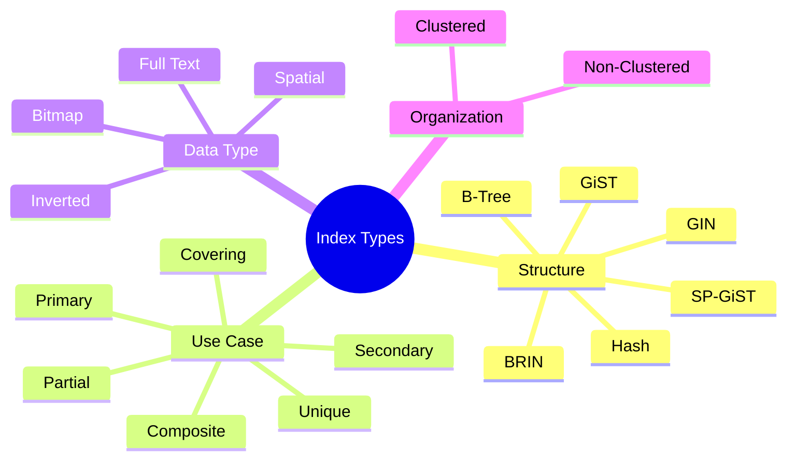
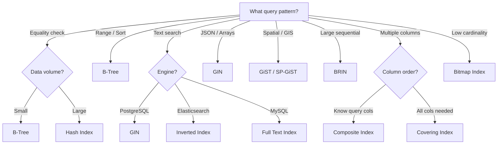
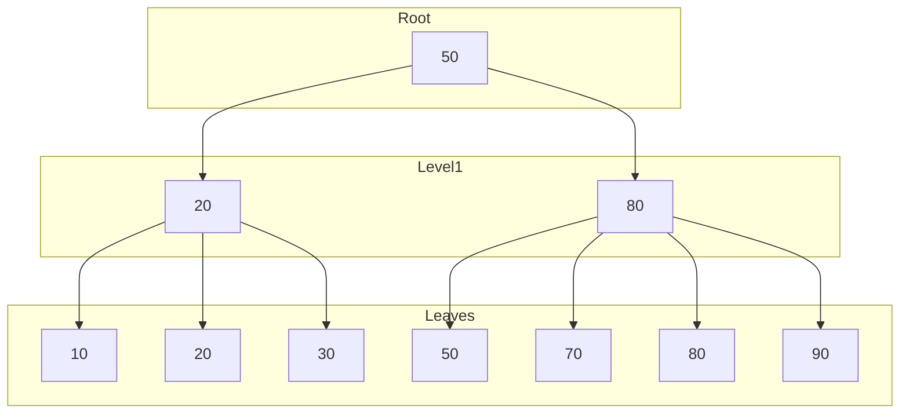
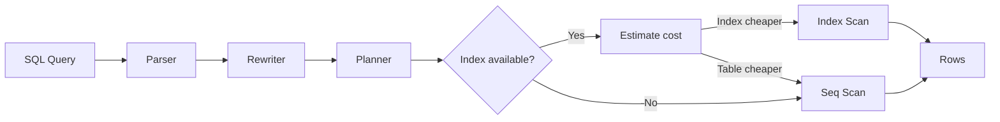

# 🗂️ Database Indexes — Complete Comparison Tables

An index is like a **book index 📖**.

Without index:

```text id="al6g5w"
Search every page
```

With index:

```text id="9g1lxn"
Jump directly to location
```

**Related**: [Microservices DB Scaling](MICROSERVICES_SYSTEM_DESIGN.md#7-databases) · [Data Model](../inputs/ff/self-study-app/docs/DATA_MODEL.md)

---

## Table of Contents

- [Index Type Mindmap](#-index-type-mindmap)
- [Main Index Types Overview](#-main-index-types-overview)
- [B-Tree Index](#-b-tree-index-)
- [Hash Index](#-hash-index)
- [Clustered vs Non-Clustered](#-clustered-vs-non-clustered)
- [Composite Index](#-composite-index)
- [Unique Index](#-unique-index)
- [Full Text Index](#-full-text-index)
- [Inverted Index](#-inverted-index-)
- [Spatial Index](#-spatial-index)
- [Bitmap Index](#-bitmap-index)
- [Covering Index](#-covering-index)
- [Partial Index](#-partial-index)
- [GIN Index (PostgreSQL)](#-gin-index-postgresql)
- [GiST Index](#-gist-index)
- [BRIN Index](#-brin-index)
- [PostgreSQL Specialized Indexes](#-postgresql-specialized-indexes)
- [Read vs Write Cost](#-read-vs-write-cost)
- [Query Type Comparison](#-query-type-comparison)
- [SQL Engine Internal Flow](#-sql-engine-internal-flow)
- [Index Tradeoffs](#-index-tradeoffs)
- [Real Production Examples](#-real-production-examples)
- [Simplest Mental Model](#-simplest-mental-model)

---

## 🧭 Index Type Mindmap



---

## 📊 Index Selection Flow



---

# 🌳 Main Index Types Overview

| Index Type          | Core Idea                  | Best For                  |
| ------------------- | -------------------------- | ------------------------- |
| Primary Index       | Ordered primary key        | Fast row lookup           |
| Secondary Index     | Non-primary column         | Searches                  |
| Clustered Index     | Data stored in index order | Range scans               |
| Non-Clustered Index | Separate pointer structure | Flexible queries          |
| B-Tree              | Balanced tree              | General purpose           |
| Hash Index          | Hash buckets               | Equality search           |
| Bitmap Index        | Bit arrays                 | Low-cardinality analytics |
| Composite Index     | Multiple columns           | Multi-condition queries   |
| Unique Index        | Prevent duplicates         | Email/usernames           |
| Full Text Index     | Word/token indexing        | Search engines            |
| Spatial Index       | Geometric indexing         | Maps/GPS                  |
| Reverse Index       | Reverse string storage     | Suffix/pattern            |
| Partial Index       | Index subset rows          | Optimized filtering       |
| Covering Index      | Index contains full query  | Avoid table access        |
| Inverted Index      | Word → document map        | Elasticsearch             |
| GiST                | Generalized tree           | Complex types             |
| GIN                 | Multi-value indexing       | JSON/arrays/fulltext      |
| BRIN                | Block range metadata       | Huge sequential tables    |

---

# 🌳 B-Tree Index 🔥

Most common index.

---

# 📊 Structure

```text id="z9q8az"
          [50]
        /      \
    [20]      [80]
```

## B-Tree Visual



---

# ✅ Best For

| Operation       | Performance |
| --------------- | ----------- |
| = equality      | Fast        |
| Range queries   | Excellent   |
| Sorting         | Excellent   |
| Prefix matching | Good        |

---

# 📱 Used In

* PostgreSQL
* MySQL
* Oracle

---

# ❌ Weakness

Not best for:

* huge write-heavy workloads
* exact hash lookups

---

# ⚡ Hash Index

Uses hash function.

---

# 📊 Structure

```text id="lpjlwm"
hash(email) → bucket
```

---

# ✅ Very Fast For

```sql id="8c6m9l"
WHERE id = 10
```

---

# ❌ Bad For

| Query       | Problem    |
| ----------- | ---------- |
| Range query | Impossible |
| Sorting     | Impossible |
| LIKE 'a%'   | Poor       |

### ⚠️ Key Insight

Hash indexes shine for **point lookups** (exact match) but fail on every other access pattern. They are storage-efficient since buckets are fixed-size, but they don't support order-based operations at all. PostgreSQL's hash index was historically not WAL-logged (pre-10), making it risky — this is fixed now, but B-Tree remains the default for good reason.

---

# 🌲 Clustered vs Non-Clustered

---

# 📊 Clustered Index

Data physically ordered.

```text id="xjlwm4"
Disk:
1
2
3
4
5
```

---

# ✅ Great For

* range scans
* sequential reads

---

# ❌ Limitation

Only ONE clustered index possible.

---

# 📊 Non-Clustered

Separate structure.

```text id="gjlwmn"
Index → pointer → row
```

---

# ✅ Flexible

Many indexes possible.

---

# ⚠️ Extra Lookup Cost

Need:

```text id="cjlwmr"
index lookup
   +
table lookup
```

---

# 📊 Clustered vs Non-Clustered Table

| Feature              | Clustered    | Non-Clustered |
| -------------------- | ------------ | ------------- |
| Physical ordering    | Yes          | No            |
| Table rows reordered | Yes          | No            |
| Count allowed        | One          | Many          |
| Range scan           | Excellent    | Good          |
| Write performance    | Slower       | Faster        |
| Storage              | Table itself | Separate      |

### 💡 Design Insight

Choose **Clustered** for range-heavy workloads (time series, logs) where Physical Ordering matches query patterns. Choose **Non-Clustered** for mixed read/write workloads where flexibility matters. InnoDB in MySQL always stores the primary key as a clustered index — secondary indexes store the PK value as the pointer, not a physical row ID.

---

# 🧩 Composite Index

Multiple columns together.

---

# 📊 Example

```sql id="d5n1ji"
INDEX(first_name, age)
```

---

# 🌊 Structure

```text id="tjlwm8"
(Alice,25)
(Alice,30)
(Bob,20)
```

---

# ✅ Best For

```sql id="7jlwmq"
WHERE first_name='Alice'
AND age=25
```

---

# ⚠️ Leftmost Prefix Rule 🔥

Works for:

```sql id="mjlwmf"
(first_name)
(first_name, age)
```

NOT:

```sql id="2djlwm"
(age)
```

alone efficiently.

---

# 📊 Composite Index Usage

| Query            | Efficient? |
| ---------------- | ---------- |
| first_name       | ✅          |
| first_name + age | ✅          |
| age only         | ❌          |

### 🧠 Design Rule

Order columns by **selectivity** (most selective first) for equality conditions, but put range-filtered columns last. The DB can only use one range condition per query from a composite index — after the first range, remaining columns are not used for filtering.

---

# 🎯 Unique Index

Ensures uniqueness.

---

# 📊 Example

```sql id="x9kz3m"
UNIQUE(email)
```

---

# ✅ Prevents

Duplicate users.

---

# 📱 Used For

* usernames
* emails
* order IDs

---

# 🔎 Full Text Index

Searches words/tokens.

---

# 📊 Example

```text id="jlwm0y"
"chatgpt ai system"
```

indexed as:

```text id="c6jlwm"
chatgpt → doc1
ai → doc1
system → doc1
```

---

# ✅ Used For

* Google-like search
* blogs
* product search

---

# 📱 Technologies

* Elasticsearch
* Solr
* PostgreSQL Fulltext

---

# 🧠 Inverted Index 🔥

Foundation of search engines.

---

# 📊 Structure

| Word | Documents |
| ---- | --------- |
| AI   | 1,5,8     |
| Java | 2,4       |
| Go   | 1,7       |

---

# ✅ Perfect For

Text search.

---

# 🌍 Spatial Index

Used for maps/GPS.

---

# 📊 Example

```text id="nhjlwm"
Find restaurants within 5km
```

---

# 🧠 Uses

* R-Tree
* QuadTree

---

# 📱 Used In

* Uber
* Google Maps

---

# 🎨 Bitmap Index

Stores bitmaps.

---

# 📊 Example

Gender column:

| Row | Male |
| --- | ---- |
| 1   | 1    |
| 2   | 0    |
| 3   | 1    |

---

# ✅ Excellent For

Low-cardinality columns.

---

# ❌ Bad For

Frequent updates.

---

# 🧠 Used In

Analytics warehouses.

---

# ⚡ Covering Index

Index contains ALL needed columns.

---

# 📊 Example

```sql id="epjlwm"
INDEX(name, age, salary)
```

Query:

```sql id="v0jlwm"
SELECT age,salary
FROM users
WHERE name='Prem'
```

---

# ✅ Advantage

No table lookup needed.

---

# 📊 Flow

Normal:

```text id="jlwmw8"
Index → Table
```

Covering:

```text id="7jjlwm"
Index only ✅
```

---

# 🧩 Partial Index

Indexes only subset.

---

# 📊 Example

```sql id="jlwmkr"
WHERE active=true
```

---

# ✅ Smaller + Faster

Great for filtered workloads.

---

# 🌲 GIN Index (PostgreSQL)

Generalized Inverted Index.

---

# ✅ Best For

| Data Type | Example  |
| --------- | -------- |
| JSONB     | metadata |
| Arrays    | tags     |
| Full text | search   |

---

# 📊 Example

```json id="8jlwm8"
{
 "tags":["go","java"]
}
```

---

# 🌳 GiST Index

Generalized Search Tree.

---

# ✅ Used For

* geometry
* ranges
* spatial queries

---

# 🌾 BRIN Index

Block Range Index.

Tiny metadata index.

---

# 📊 Idea

```text id="jlwmx4"
Rows 1-1000 → values 1-50
Rows 1001-2000 → values 51-100
```

---

# ✅ Excellent For

Huge sequential datasets.

---

# ❌ Poor For

Random values.

### 💡 When to Use BRIN

BRIN is the most underrated index. On a 10TB log table, a B-Tree might be 200GB+ while BRIN is a few MB. If your data arrives in time order and is rarely updated (logs, IoT sensor data), BRIN offers **massive space savings** with competitive read performance. It works by storing min/max values per block range — great for correlation with physical layout.

---

# 📊 PostgreSQL Specialized Indexes

| Index   | Best Use          |
| ------- | ----------------- |
| BTree   | Default           |
| Hash    | Equality          |
| GIN     | JSON/fulltext     |
| GiST    | Spatial/ranges    |
| BRIN    | Huge tables       |
| SP-GiST | Partitioned trees |

---

# ⚖️ Read vs Write Cost

| Index Type | Read Speed | Write Cost |
|---|---|---|
| B-Tree | Fast | Medium |
| Hash | Very Fast | Medium |
| Bitmap | Excellent | High |
| Composite | Fast | Medium |
| Fulltext | Excellent | High |
| Covering | Excellent | High |
| BRIN | Medium | Low |

---

# 🔥 Query Type Comparison

| Query                  | Best Index   |
| ---------------------- | ------------ |
| id=10                  | Hash/BTree   |
| age BETWEEN 10 AND 20  | BTree        |
| ORDER BY created_at    | BTree        |
| Search "chatgpt"       | Fulltext/GIN |
| JSON lookup            | GIN          |
| GPS radius search      | Spatial/GiST |
| Huge logs by timestamp | BRIN         |

---

# 📊 SQL Engine Internal Flow

Without index:

```text id="jlwm8q"
FULL TABLE SCAN
```

With index:

```text id="jlwmv0"
Index lookup
   ↓
Pointer
   ↓
Row fetch
```

### 🔄 Query Planner Flow



---

# 🚨 Index Tradeoffs

| Too Few Indexes  | Too Many Indexes  |
| ---------------- | ----------------- |
| Slow reads       | Slow writes       |
| Full scans       | Large storage     |
| High CPU queries | Heavy maintenance |

### ⚡ The Index Balancing Act

Every index speeds up reads but slows writes (each INSERT/UPDATE/DELETE must update every index). Monitor your **write/read ratio**: tables with >80% writes should have minimal indexes; read-heavy reporting tables benefit from aggressive indexing. Use `pg_stat_user_indexes` (PostgreSQL) or equivalent to find **unused indexes** eating write performance.

---

# 🧠 Real Production Examples

| System               | Common Indexes       |
| -------------------- | -------------------- |
| Amazon               | Composite + Fulltext |
| Uber                 | Spatial              |
| Netflix              | Composite + BRIN     |
| Google Search        | Inverted Index       |
| Banking systems      | BTree + Unique       |
| Analytics warehouses | Bitmap + BRIN        |

---

# 🚀 Simplest Mental Model

| Index     | Analogy                    |
| --------- | -------------------------- |
| BTree     | Dictionary 📖              |
| Hash      | Locker number 🔐           |
| Bitmap    | Yes/No sheet ✅             |
| Composite | Multi-column Excel sort 📊 |
| Fulltext  | Google search 🔎           |
| Spatial   | GPS map 🗺️                |
| BRIN      | Chapter summary 📚         |
| Covering  | Cheat sheet 📝             |
