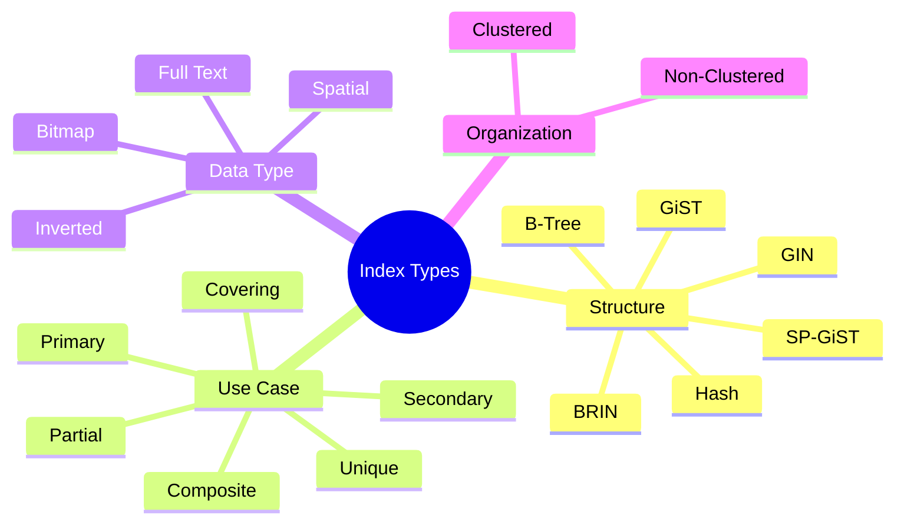
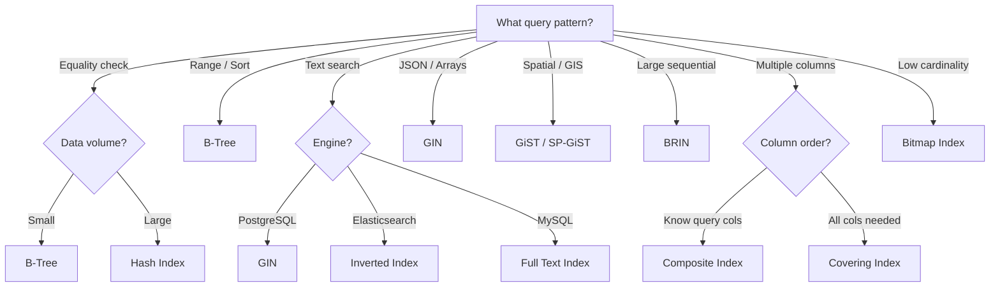
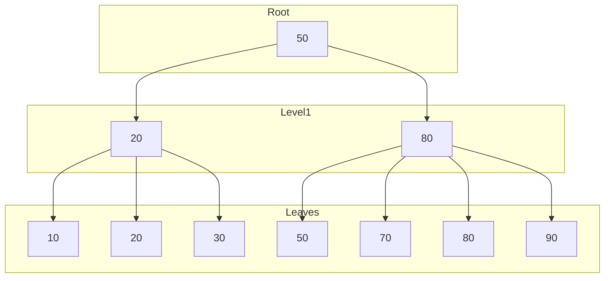
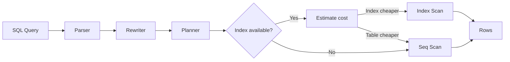

# 🗂️ Database Indexes — Complete Comparison Tables

An index is like a **book index 📖**.

Without index:

```text id="al6g5w"
Search every page
```

With index:

```text id="9g1lxn"
Jump directly to location
```

**Related**: [Microservices DB Scaling](MICROSERVICES_SYSTEM_DESIGN.md#7-databases) · [Data Model](../inputs/ff/self-study-app/docs/DATA_MODEL.md)

---

## Layer 1: Beginner Mental Model

**Analogy**: Like a restaurant waiter. Without index (memory): customer asks for "salads with tomato", waiter checks every plate on every table (1000 checks). With index (mental map): waiter remembers "tomato dishes → table 5, 12, 18" (3 lookups). Inverted index (Elasticsearch) = kitchen organizing all ingredients by name, quantities, recipes.

**Why it matters**:
- **LinkedIn**: 1 trillion indexed documents. Without indexing, every search = scan 1 trillion (impossible). Inverted index = search in milliseconds.
- **Stripe**: Search transactions by customer. With index: <10ms. Without: 10+ seconds.
- **Uber**: Spatial indexes on map (restaurants, drivers). Without: 10s latency. With: <50ms.
- **Cost**: A bad index strategy = 100x slower queries = need 10 servers. Good indexing = 1 server. That's $100K/month difference.

**Core insight**: Index is a tradeoff: faster reads, slower writes, more storage. Choose wisely based on query pattern.

---

## Layer 4: Production Reality

### Indexing Failure Modes

| Failure | Symptoms | Root Cause | Fix |
|---------|----------|-----------|-----|
| **Slow Query** | WHERE email = 'user@example.com' takes 10s | No index on email column | Create index: `CREATE INDEX idx_email ON users(email)` |
| **Index Bloat** | Index size 10GB, table only 500MB | Dead rows not cleaned, fragmentation | Rebuild: `REINDEX` (PostgreSQL) or `OPTIMIZE TABLE` (MySQL) |
| **Write Latency** | INSERT takes 100ms (should be 10ms) | Too many indexes (every INSERT updates all indexes) | Drop unused indexes, consolidate into composite |
| **Query Plan Worse** | After adding index, query slower | Query planner chose table scan instead | Update stats: `ANALYZE` (PostgreSQL) or `ANALYZE TABLE` (MySQL) |
| **Memory Exhaustion** | Server crashes with OOM | B-Tree indexes loaded entirely in RAM, heap overflow | Increase server RAM, use partial indexes, enable compression |
| **Deadlock on Insert** | INSERT hangs forever | Multiple indexes have locks, circular wait | Check lock order, adjust index order, use covering index |
| **Full Table Scan Still** | Index exists but query still scans | Index column has NULL values (indexes skip NULLs) | Use `IS NOT NULL` in WHERE, or filter NULLs in app |
| **Inverse Index Corruption** | Search returns partial results | Inverted index out of sync with table | Rebuild inverted index (Elasticsearch: `_forcemerge`, `_refresh`) |

### Production Incident: Slack Message Search Outage (2016)

**Context**: Slack's message search (millions of queries/day) suddenly slowed to 30+ seconds per query. Users couldn't search messages.

**What happened**:
- Slack indexed every message in Elasticsearch (inverted index)
- Inverted index: `word -> [message_id1, message_id2, ...]`
- Query: "coffee" → lookup inverted index → found 1M messages containing "coffee"
- But index wasn't optimized: had 1000 index segments (files)
- Each segment required opening, reading → slow merge operation
- Search latency climbed to 30s

**The bug**:
```json
// ❌ Buggy: index not optimized, 1000 segments
GET /slack-messages/_search?q=coffee
// Elasticsearch merges 1000 segments on the fly
// Takes 30 seconds
```

**The fix**:
```bash
# ✅ Fixed: force merge to optimize index
curl -X POST "localhost:9200/slack-messages/_forcemerge?max_num_segments=1"
# Merges 1000 segments → 1 segment
# Search now <1 second

# Also: enable automatic merging policy
{
  "index.merge.policy": "tiered",
  "index.merge.scheduler.max_merge_count": 8
}
```

**Result**: Search queries dropped from 30s → <1s. Slack search restored.

---

## Layer 5: Staff Engineer Perspective

### Index Strategy Tradeoffs

| Strategy | Read Speed | Write Speed | Storage | Use Case |
|----------|-----------|-----------|---------|----------|
| **No index** | Slow (scan all) | Fast | Minimal | Rare queries, small tables |
| **Single B-Tree** | Fast (balanced) | Medium | +20% | General queries, ranges |
| **Multiple Indexes** | Very fast | Slow | +100% | Complex queries, analytics |
| **Covering Index** | Fastest (no table access) | Medium | +50% | Specific queries only |
| **Inverted (Elasticsearch)** | Very fast (text search) | Medium | +200% | Full-text, documents |
| **Bitmap (low-card)** | Very fast | Medium | +10% | Analytics (gender, status) |
| **Spatial (GIS)** | Fast (range queries) | Medium | +50% | Maps, GPS |
| **Partial (filtered)** | Very fast (small) | Fast | +5% | Subset queries only |

### Scaling Pattern: Single Table → Petabyte Search

**Stage 1 (Startup)**: Single B-Tree index on primary key
- Table size: 1GB
- Query latency: <10ms
- Cost: $50/month

**Stage 2 (Growth)**: Multiple indexes (email, user_id, created_at)
- Table size: 100GB
- Query latency: <50ms
- Cost: $500/month

**Stage 3 (Scale)**: Elasticsearch for search, PostgreSQL for transactional
- Index size: 1TB (text search)
- Query latency: <100ms (ES) + <10ms (PG)
- Cost: $5K/month (ES cluster + PG)

**Stage 4 (Enterprise — Slack scale)**: Global search cluster
- Index size: 100TB (all messages ever)
- Query latency: <1s (optimized merge policy)
- Cost: $50K+/month (dedicated search team)

**Real example: Google Search**:
- v1 (1998): Simple B-Tree on URL, latency 1-5s
- v2 (2000): Inverted index on whole web, latency 0.1-0.5s
- v3 (2010): Distributed inverted index, 1B documents, latency <0.1s
- v4 (2023): Machine learning ranking on top of inverted index, latency <0.05s
- Index size: 100+ PB (entire web), compressed

---

## Layer 5: Interview Questions

### Level 1 (Junior)

**Q1: What's an index? Why do we need indexes if they use more storage?**
A: Index = lookup table (word → location). Slows writes (maintain index), but speeds reads 100x (search in milliseconds vs scan). Use if reads >> writes.
- Why asked: Tradeoff understanding
- Expected: Know read/write cost, storage cost

**Q2: What's an inverted index?**
A: Inverted index = word → documents containing word. Different from normal index (document → words). Used by Elasticsearch, search engines. Fast full-text search.
- Why asked: Text search mechanism
- Expected: Understand inversion, use case (search engines)

### Level 2 (Mid-Level)

**Q3: A query is slow even with an index. How do you debug?**
A:
1. Check if index is being used: `EXPLAIN PLAN` (PostgreSQL) or `EXPLAIN` (MySQL)
2. If not: stats stale (run `ANALYZE`), column has NULLs (index skips them)
3. If yes but still slow: index fragmented (REINDEX), or index size exceeds RAM (too much I/O)
4. Solution: rebuild index, increase RAM, create covering index
- Why asked: Diagnosis
- Expected: Know EXPLAIN, know refresh/rebuild commands

**Q4: When would you use a covering index?**
A: Covering index includes all columns needed for query (no table access). Fast but storage intensive. Use for: frequently run queries, columns rarely change, query returns few columns.
- Why asked: Index selection
- Expected: Understand storage/speed tradeoff, covering benefit

### Level 3 (Senior)

**Q5: Design indexing strategy for 100B-row table (user events: user_id, timestamp, event_type, value).**
A:
- Primary: (user_id, timestamp) — most common query is "events for user X on date Y"
- Secondary: (event_type, timestamp) — analytics on event trends
- Composite: avoid (too many combinations)
- Partial: index only last 90 days (events expire after 90 days) → smaller index
- Storage: each index 10% of table size = 100GB index space
- Write cost: inserts slow, use batch inserts (amortize index update)
- Monitoring: monitor slow queries, add indexes as patterns emerge
- Why asked: Real-world scale, index selection
- Expected: Composite indexes, partial indexes, monitoring

**Q6: Elasticsearch is slow on text search. Debug approach.**
A:
1. Check index segment count: `GET /_stats` (if >100 segments → slow)
2. Force merge to optimize: `POST /index/_forcemerge?max_num_segments=1`
3. Check query latency: use Kibana profiler to see which parts are slow
4. Common: phrase queries slow, wildcard queries slow (no prefix optimization)
5. Solution: use "match" instead of "phrase", avoid leading wildcards
6. Scale: shard larger (distribute segments), use replica (parallel search)
- Why asked: Production troubleshooting
- Expected: Know ES optimization, segment merging, profiling

### Level 4 (Staff)

**Q7: Migrate from Elasticsearch 5 to 8 (breaking changes in index format). Plan.**
A:
- Phase 1: Set up new cluster (Elasticsearch 8), run in parallel
- Phase 2: Dual-index (write to both 5 and 8), validate search result parity
- Phase 3: Reindex (bulk copy from 5 → 8, may take days for petabyte)
- Phase 4: Cut over (read from 8, monitor for issues)
- Phase 5: Sunset (delete old cluster)
- Risks: mapping changes (new fields incompatible), query DSL changes (aggregations), index size changes (reindex may expand)
- Downtime: zero (parallel indexing, gradual cutover)
- Timeline: 1-2 months for large cluster
- Cost: 2x cluster resources during parallel phase
- Why asked: Large migration, compatibility
- Expected: Parallel strategy, reindexing plan, risk management

**Q8: Design global search for 1B documents across 10 regions. Index strategy.**
A:
- Shard strategy: geographic sharding (documents hashed by location) → search hits local shard first
- Replication: 3 replicas per shard (survive 2 datacenter failures)
- Index: inverted index for full-text, composite for filtering (location + date)
- Refresh: 1-second latency for new documents (refresh every 1s)
- Merge: background merge policy (merge segments during off-peak)
- Monitoring: track query latency per region, segment count, shard balance
- Cost: 3 clusters × 10 regions = 30 shards, ~$500K/month
- Tradeoff: geographic distribution = higher latency (travel between regions), but local queries fast
- Why asked: Global scale, distributed indexing
- Expected: Sharding strategy, replication, monitoring

---

## Table of Contents

- [Index Type Mindmap](#-index-type-mindmap)
- [Main Index Types Overview](#-main-index-types-overview)
- [B-Tree Index](#-b-tree-index-)
- [Hash Index](#-hash-index)
- [Clustered vs Non-Clustered](#-clustered-vs-non-clustered)
- [Composite Index](#-composite-index)
- [Unique Index](#-unique-index)
- [Full Text Index](#-full-text-index)
- [Inverted Index](#-inverted-index-)
- [Spatial Index](#-spatial-index)
- [Bitmap Index](#-bitmap-index)
- [Covering Index](#-covering-index)
- [Partial Index](#-partial-index)
- [GIN Index (PostgreSQL)](#-gin-index-postgresql)
- [GiST Index](#-gist-index)
- [BRIN Index](#-brin-index)
- [PostgreSQL Specialized Indexes](#-postgresql-specialized-indexes)
- [Read vs Write Cost](#-read-vs-write-cost)
- [Query Type Comparison](#-query-type-comparison)
- [SQL Engine Internal Flow](#-sql-engine-internal-flow)
- [Index Tradeoffs](#-index-tradeoffs)
- [Real Production Examples](#-real-production-examples)
- [Simplest Mental Model](#-simplest-mental-model)

---

## 🧭 Index Type Mindmap



---

## 📊 Index Selection Flow



---

# 🌳 Main Index Types Overview

| Index Type          | Core Idea                  | Best For                  |
| ------------------- | -------------------------- | ------------------------- |
| Primary Index       | Ordered primary key        | Fast row lookup           |
| Secondary Index     | Non-primary column         | Searches                  |
| Clustered Index     | Data stored in index order | Range scans               |
| Non-Clustered Index | Separate pointer structure | Flexible queries          |
| B-Tree              | Balanced tree              | General purpose           |
| Hash Index          | Hash buckets               | Equality search           |
| Bitmap Index        | Bit arrays                 | Low-cardinality analytics |
| Composite Index     | Multiple columns           | Multi-condition queries   |
| Unique Index        | Prevent duplicates         | Email/usernames           |
| Full Text Index     | Word/token indexing        | Search engines            |
| Spatial Index       | Geometric indexing         | Maps/GPS                  |
| Reverse Index       | Reverse string storage     | Suffix/pattern            |
| Partial Index       | Index subset rows          | Optimized filtering       |
| Covering Index      | Index contains full query  | Avoid table access        |
| Inverted Index      | Word → document map        | Elasticsearch             |
| GiST                | Generalized tree           | Complex types             |
| GIN                 | Multi-value indexing       | JSON/arrays/fulltext      |
| BRIN                | Block range metadata       | Huge sequential tables    |

---

# 🌳 B-Tree Index 🔥

Most common index.

---

# 📊 Structure

```text id="z9q8az"
          [50]
        /      \
    [20]      [80]
```

## B-Tree Visual



---

# ✅ Best For

| Operation       | Performance |
| --------------- | ----------- |
| = equality      | Fast        |
| Range queries   | Excellent   |
| Sorting         | Excellent   |
| Prefix matching | Good        |

---

# 📱 Used In

* PostgreSQL
* MySQL
* Oracle

---

# ❌ Weakness

Not best for:

* huge write-heavy workloads
* exact hash lookups

---

# ⚡ Hash Index

Uses hash function.

---

# 📊 Structure

```text id="lpjlwm"
hash(email) → bucket
```

---

# ✅ Very Fast For

```sql id="8c6m9l"
WHERE id = 10
```

---

# ❌ Bad For

| Query       | Problem    |
| ----------- | ---------- |
| Range query | Impossible |
| Sorting     | Impossible |
| LIKE 'a%'   | Poor       |

### ⚠️ Key Insight

Hash indexes shine for **point lookups** (exact match) but fail on every other access pattern. They are storage-efficient since buckets are fixed-size, but they don't support order-based operations at all. PostgreSQL's hash index was historically not WAL-logged (pre-10), making it risky — this is fixed now, but B-Tree remains the default for good reason.

---

# 🌲 Clustered vs Non-Clustered

---

# 📊 Clustered Index

Data physically ordered.

```text id="xjlwm4"
Disk:
1
2
3
4
5
```

---

# ✅ Great For

* range scans
* sequential reads

---

# ❌ Limitation

Only ONE clustered index possible.

---

# 📊 Non-Clustered

Separate structure.

```text id="gjlwmn"
Index → pointer → row
```

---

# ✅ Flexible

Many indexes possible.

---

# ⚠️ Extra Lookup Cost

Need:

```text id="cjlwmr"
index lookup
   +
table lookup
```

---

# 📊 Clustered vs Non-Clustered Table

| Feature              | Clustered    | Non-Clustered |
| -------------------- | ------------ | ------------- |
| Physical ordering    | Yes          | No            |
| Table rows reordered | Yes          | No            |
| Count allowed        | One          | Many          |
| Range scan           | Excellent    | Good          |
| Write performance    | Slower       | Faster        |
| Storage              | Table itself | Separate      |

### 💡 Design Insight

Choose **Clustered** for range-heavy workloads (time series, logs) where Physical Ordering matches query patterns. Choose **Non-Clustered** for mixed read/write workloads where flexibility matters. InnoDB in MySQL always stores the primary key as a clustered index — secondary indexes store the PK value as the pointer, not a physical row ID.

---

# 🧩 Composite Index

Multiple columns together.

---

# 📊 Example

```sql id="d5n1ji"
INDEX(first_name, age)
```

---

# 🌊 Structure

```text id="tjlwm8"
(Alice,25)
(Alice,30)
(Bob,20)
```

---

# ✅ Best For

```sql id="7jlwmq"
WHERE first_name='Alice'
AND age=25
```

---

# ⚠️ Leftmost Prefix Rule 🔥

Works for:

```sql id="mjlwmf"
(first_name)
(first_name, age)
```

NOT:

```sql id="2djlwm"
(age)
```

alone efficiently.

---

# 📊 Composite Index Usage

| Query            | Efficient? |
| ---------------- | ---------- |
| first_name       | ✅          |
| first_name + age | ✅          |
| age only         | ❌          |

### 🧠 Design Rule

Order columns by **selectivity** (most selective first) for equality conditions, but put range-filtered columns last. The DB can only use one range condition per query from a composite index — after the first range, remaining columns are not used for filtering.

---

# 🎯 Unique Index

Ensures uniqueness.

---

# 📊 Example

```sql id="x9kz3m"
UNIQUE(email)
```

---

# ✅ Prevents

Duplicate users.

---

# 📱 Used For

* usernames
* emails
* order IDs

---

# 🔎 Full Text Index

Searches words/tokens.

---

# 📊 Example

```text id="jlwm0y"
"chatgpt ai system"
```

indexed as:

```text id="c6jlwm"
chatgpt → doc1
ai → doc1
system → doc1
```

---

# ✅ Used For

* Google-like search
* blogs
* product search

---

# 📱 Technologies

* Elasticsearch
* Solr
* PostgreSQL Fulltext

---

# 🧠 Inverted Index 🔥

Foundation of search engines.

---

# 📊 Structure

| Word | Documents |
| ---- | --------- |
| AI   | 1,5,8     |
| Java | 2,4       |
| Go   | 1,7       |

---

# ✅ Perfect For

Text search.

---

# 🌍 Spatial Index

Used for maps/GPS.

---

# 📊 Example

```text id="nhjlwm"
Find restaurants within 5km
```

---

# 🧠 Uses

* R-Tree
* QuadTree

---

# 📱 Used In

* Uber
* Google Maps

---

# 🎨 Bitmap Index

Stores bitmaps.

---

# 📊 Example

Gender column:

| Row | Male |
| --- | ---- |
| 1   | 1    |
| 2   | 0    |
| 3   | 1    |

---

# ✅ Excellent For

Low-cardinality columns.

---

# ❌ Bad For

Frequent updates.

---

# 🧠 Used In

Analytics warehouses.

---

# ⚡ Covering Index

Index contains ALL needed columns.

---

# 📊 Example

```sql id="epjlwm"
INDEX(name, age, salary)
```

Query:

```sql id="v0jlwm"
SELECT age,salary
FROM users
WHERE name='Prem'
```

---

# ✅ Advantage

No table lookup needed.

---

# 📊 Flow

Normal:

```text id="jlwmw8"
Index → Table
```

Covering:

```text id="7jjlwm"
Index only ✅
```

---

# 🧩 Partial Index

Indexes only subset.

---

# 📊 Example

```sql id="jlwmkr"
WHERE active=true
```

---

# ✅ Smaller + Faster

Great for filtered workloads.

---

# 🌲 GIN Index (PostgreSQL)

Generalized Inverted Index.

---

# ✅ Best For

| Data Type | Example  |
| --------- | -------- |
| JSONB     | metadata |
| Arrays    | tags     |
| Full text | search   |

---

# 📊 Example

```json id="8jlwm8"
{
 "tags":["go","java"]
}
```

---

# 🌳 GiST Index

Generalized Search Tree.

---

# ✅ Used For

* geometry
* ranges
* spatial queries

---

# 🌾 BRIN Index

Block Range Index.

Tiny metadata index.

---

# 📊 Idea

```text id="jlwmx4"
Rows 1-1000 → values 1-50
Rows 1001-2000 → values 51-100
```

---

# ✅ Excellent For

Huge sequential datasets.

---

# ❌ Poor For

Random values.

### 💡 When to Use BRIN

BRIN is the most underrated index. On a 10TB log table, a B-Tree might be 200GB+ while BRIN is a few MB. If your data arrives in time order and is rarely updated (logs, IoT sensor data), BRIN offers **massive space savings** with competitive read performance. It works by storing min/max values per block range — great for correlation with physical layout.

---

# 📊 PostgreSQL Specialized Indexes

| Index   | Best Use          |
| ------- | ----------------- |
| BTree   | Default           |
| Hash    | Equality          |
| GIN     | JSON/fulltext     |
| GiST    | Spatial/ranges    |
| BRIN    | Huge tables       |
| SP-GiST | Partitioned trees |

---

# ⚖️ Read vs Write Cost

| Index Type | Read Speed | Write Cost |
|---|---|---|
| B-Tree | Fast | Medium |
| Hash | Very Fast | Medium |
| Bitmap | Excellent | High |
| Composite | Fast | Medium |
| Fulltext | Excellent | High |
| Covering | Excellent | High |
| BRIN | Medium | Low |

---

# 🔥 Query Type Comparison

| Query                  | Best Index   |
| ---------------------- | ------------ |
| id=10                  | Hash/BTree   |
| age BETWEEN 10 AND 20  | BTree        |
| ORDER BY created_at    | BTree        |
| Search "chatgpt"       | Fulltext/GIN |
| JSON lookup            | GIN          |
| GPS radius search      | Spatial/GiST |
| Huge logs by timestamp | BRIN         |

---

# 📊 SQL Engine Internal Flow

Without index:

```text id="jlwm8q"
FULL TABLE SCAN
```

With index:

```text id="jlwmv0"
Index lookup
   ↓
Pointer
   ↓
Row fetch
```

### 🔄 Query Planner Flow



---

# 🚨 Index Tradeoffs

| Too Few Indexes  | Too Many Indexes  |
| ---------------- | ----------------- |
| Slow reads       | Slow writes       |
| Full scans       | Large storage     |
| High CPU queries | Heavy maintenance |

### ⚡ The Index Balancing Act

Every index speeds up reads but slows writes (each INSERT/UPDATE/DELETE must update every index). Monitor your **write/read ratio**: tables with >80% writes should have minimal indexes; read-heavy reporting tables benefit from aggressive indexing. Use `pg_stat_user_indexes` (PostgreSQL) or equivalent to find **unused indexes** eating write performance.

---

# 🧠 Real Production Examples

| System               | Common Indexes       |
| -------------------- | -------------------- |
| Amazon               | Composite + Fulltext |
| Uber                 | Spatial              |
| Netflix              | Composite + BRIN     |
| Google Search        | Inverted Index       |
| Banking systems      | BTree + Unique       |
| Analytics warehouses | Bitmap + BRIN        |

---

# 🚀 Simplest Mental Model

| Index     | Analogy                    |
| --------- | -------------------------- |
| BTree     | Dictionary 📖              |
| Hash      | Locker number 🔐           |
| Bitmap    | Yes/No sheet ✅             |
| Composite | Multi-column Excel sort 📊 |
| Fulltext  | Google search 🔎           |
| Spatial   | GPS map 🗺️                |
| BRIN      | Chapter summary 📚         |
| Covering  | Cheat sheet 📝             |
