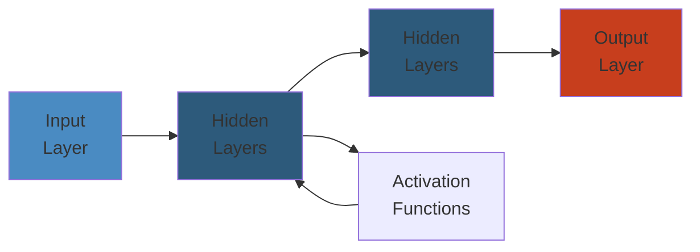

# 🌍 CAP Theorem & Consistency Models — Complete Deep Dive

> **Scope**: Formal proof of CAP (Brewer's conjecture, Gilbert-Lynch proof), tradeoffs (CP vs AP, PACELC extension), consistency model hierarchy from linearizability to eventual consistency, CRDT theory and practice, real-world consistency in Dynamo, Spanner, Cassandra, ZooKeeper, etcd, Cosmos DB, CockroachDB, MongoDB, Kafka, S3.
>
> **Related**: [02-consensus-raft.md](./02-consensus-raft.md) | [03-distributed-caching.md](./03-distributed-caching.md) | [04-distributed-transactions.md](./04-distributed-transactions.md)




## Table of Contents

1. CAP Theorem Formal Proof
2. CAP Tradeoffs: CP vs AP, PACELC
3. Consistency Models Hierarchy
4. Linearizability (Strict Consistency)
5. Sequential Consistency
6. Causal Consistency & Vector Clocks
7. PRAM & Processor Consistency
8. Eventual Consistency
9. Monotonic Consistency Guarantees
10. CRDTs: Theory & Practice
11. Consistency in Practice: Dynamo, Spanner, Cassandra, ZooKeeper, etcd, Cosmos DB
12. Consistency vs Performance Tradeoffs
13. CAP in Real Systems
14. Stale Reads & Staleness Bounds
15. Split-Brain Detection

---

## 1. CAP Theorem Formal Proof

```text
+------------------+     +------------------+     +------------------+
|   Consistency    |     |  Availability    |     | Partition Toler. |
| (every read gets |     | (every request   |     | (system continues|
|  latest write)   |     |  gets a response)|     |  despite network |
+------------------+     +------------------+     +-------+----------+
         \                      /                          |
          \                    /                           |
           +------CAP---------+                           |
           | You can pick 2 of 3          +---------------+
           | but in practice P must       |
           | always be chosen. So         |
           | it's CP vs AP (never CA).    |
           +------------------------------+
```

**Brewer's Conjecture (2000):** In a distributed data store, it is impossible to simultaneously provide all three of Consistency, Availability, and Partition Tolerance.

**Gilbert-Lynch Proof (2002):** Formal proof by contradiction. Assume a system that is both consistent and always available. Under an asynchronous network model with message loss (partition), consider two nodes on opposite sides of a partition. A write arrives at node A. Node A cannot replicate to node B (partition). A read from node B cannot return the latest write (violates consistency) unless the system waits indefinitely (violates availability). Therefore, no system can provide all three simultaneously.

**Asynchronous Network Model:** No bounded delay on message delivery. Partitions are indistinguishable from slow nodes. This is the core impossibility.

---

## 2. CAP Tradeoffs: CP vs AP, PACELC

**CP (Consistency + Partition Tolerance):** When partition occurs, sacrifice availability. Block writes/reads until partition heals. Examples: Zookeeper, etcd, HBase.

**AP (Availability + Partition Tolerance):** When partition occurs, sacrifice consistency. Accept stale reads. Examples: Dynamo, Cassandra (tunable), CouchDB.

**CA is impossible** — partitions are inevitable in any distributed system. The choice is only between CP and AP during partitions.

**PACELC Extension (Daniel J. Abadi, 2010):**

```text
        Partition (P)                            Else (E)
      /             \                         /           \
   CP               AP                  Latency (L)    Consistency (C)
  (abort)          (stale)
```

If a partition occurs (P), choose between Consistency and Availability. Else (E, normal operation), choose between Latency and Consistency. This is why DynamoDB and Cassandra offer tunable consistency — the tradeoff exists even without partitions.

---

## 3. Consistency Models Hierarchy

```text
                        STRONGEST
                            |
                    Linearizability
                            |
                    Sequential Consistency
                            |
                     Causal Consistency
                            |
                     PRAM (FIFO) Consistency
                            |
                   Processor Consistency
                            |
                     Slow Consistency
                            |
                    Eventual Consistency
                            |
                         WEAKEST
```

Each level sacrifices ordering guarantees for performance, scalability, or availability.

---

## 4. Linearizability (Strict Consistency)

**Definition (Herlihy & Wing, 1990):** An execution is linearizable if there exists a total order of operations such that:
1. The order respects real-time precedence (if op A completes before op B starts, A appears before B).
2. Each read returns the value of the most recent write preceding it in the total order.
3. All operations appear to take effect atomically at a single point (linearization point) between their invocation and response.

**Single-Copy Consistency:** All replicas appear as a single copy; reads always return the latest write.

**Linearization Points:**
- CAS (compare-and-swap): linearizes at the atomic CAS instruction.
- Read of register: linearizes when the value is fetched (or at the lock acquisition in critical section).
- Write to register: linearizes when the value is stored (or lock release).

```text
Time -->
Client A:  |----write(x=1)----|
                                 |----write(x=2)----|
Client B:                           |--read(x)=2--|
Client C:                                       |read(x)=2|

All reads return 2 after write completes. Real-time order preserved.
```

**Impossibility of Linearizability in Async Networks:** FLP impossibility (Fischer, Lynch, Paterson, 1985): In an asynchronous network, no deterministic consensus protocol can guarantee termination even with a single crash fault. Linearizability is consensus-equivalent, thus faces the same theoretical bound.

---

## 5. Sequential Consistency

**Definition (Lamport, 1979):** The result of execution is the same as if all processors' operations were executed in some sequential order, and each processor's operations appear in the order specified by its program.

**Key Difference from Linearizability:** No real-time requirement. Operations from different processors can be interleaved arbitrarily as long as per-processor program order is preserved.

```text
Sequential: OK
P1: write(x)=1 ---------> write(x)=2
P2: read(x)=2 ---------> read(x)=1
(Interleaved: P1 writes 1, P2 reads 2, P1 writes 2, P2 reads 1)
Per-process order preserved for both.

Not sequentially consistent:
P1: write(x)=1 -- write(x)=2
P2: read(x)=2 -- read(x)=1
But P1 has ordered writes: 1 then 2.
If P2 sees 2 before 1, program order is violated from P2's perspective.
```

---

## 6. Causal Consistency & Vector Clocks

**Definition:** Operations that are causally related must be seen by all processes in the same order. Concurrent operations may be seen in different orders.

**Causal Order (Happens-Before):** `a -> b` if:
1. `a` and `b` occur in same process and `a` precedes `b`
2. `a` is sending a message and `b` is receiving it
3. Transitive closure of 1 and 2

**Lamport Clocks:** Each process increments counter on each event. Each message carries the sender's clock. Receiver sets `clock = max(clock, recv_clock) + 1`. Provides total order but does NOT capture causality (if `L(a) < L(b)`, we cannot conclude `a -> b`).

**Vector Clocks:** Each process maintains a vector of size N (number of processes). On event: increment own component. On message send: attach entire vector. On receive: merge (element-wise max), then increment own component.

```text
            VCa                    VCb                    VCc
Process A: [1,0,0] -> [2,0,0] -> [2,1,0] -> [3,2,0] -> [3,2,1]
                    |           |           |
                    msg(2,0,0)  msg(2,1,0)  msg(3,2,0)
Process B: [0,1,0] -> [0,2,0] -> [2,1,0] -> [2,2,0] -> [2,3,0]
```

**Comparison:**
- If `VCa[i] <= VCb[i]` for all i AND exists j with `VCa[j] < VCb[j]`, then `a -> b` (causally ordered).
- If neither `VCa <= VCb` nor `VCb <= VCa`, then `a || b` (concurrent).

**Dotted Version Vectors (DVV):** Optimized vector clocks used in Riak. Uses a "dot" (actor, counter) per replica rather than full vector, reducing metadata size.

---

## 7. PRAM & Processor Consistency

**PRAM (Pipelined RAM) / FIFO Consistency:** Writes from a single processor are observed in the order they were issued by that processor. Writes from different processors can be seen in different orders. Weakest form of consistency that respects per-processor write order.

**Processor Consistency:** PRAM consistency + all processors agree on the order of writes to a single memory location.

```text
PRAM allows:
P1: write(x)=1 -> write(x)=2
P2: read(x)=2 -> read(x)=1 (P1's order preserved, but P2 sees 2 before 1)
P3: read(x)=1 -> read(x)=2 (P3 sees 1 before 2 — different order)

Processor consistency: P2 and P3 must agree on order of writes to x
P2: read(x)=2 -> read(x)=1  (sees 2 then 1)
P3: read(x)=1 -> read(x)=2  (sees 1 then 2)
This VIOLATES processor consistency because they disagree on write order.
```

---

## 8. Eventual Consistency

**Definition:** Given sufficiently long time without updates, all replicas converge to the same value. No ordering guarantees during the convergence period.

**Convergence Mechanisms:**
- Gossip protocols: periodic pairwise exchange of state
- Anti-entropy: full-state or Merkle-tree comparison
- Read repair: on read, fetch from all replicas, merge, write-back
- Hinted handoff: write to another node if target is down, handoff when recovered

**DNS:** Classic example. Record TTL + propagation delay. Reads may return stale records within TTL window but eventually converge.

**CDN:** Content is cached at edge. Invalidations propagate asynchronously. Reads may serve stale content until TTL expires.

**Anti-Entropy with Merkle Trees:**
```text
Node A                    Node B
   |                         |
   |   compare root hash    |
   |------------------------>|
   |<-----------------------|
   |   root matches: done   |
   |   root mismatch:       |
   |   recurse to children  |
   |   compare sub-tree     |
   |   identify divergent   |
   |   leaves, sync         |
```

---

## 9. Monotonic Consistency Guarantees

**Read-Your-Writes:** After a write, subsequent reads from the same client always reflect that write.

**Monotonic Reads:** If a client reads value `v` at time `t`, subsequent reads will always return at least `v` (not earlier values). Prevents the "back-in-time" anomaly.

**Monotonic Writes:** Writes from a client are applied in the order they were issued.

**Writes-Follow-Reads:** If a client reads value `v` and then writes `w`, the write `w` is performed on a state that includes `v` or a later state.

**Session Consistency:** All the above guarantees within a session (bounded time window). Used by MongoDB (causal consistency in sessions), Cosmos DB (session consistency level).

---

## 10. CRDTs: Theory & Practice

**Conflict-Free Replicated Data Types:** Data types that converge across replicas without consensus. Operations commute — no conflict resolution needed.

**State-based CRDT (CvRDT):** Full state is merged. Merge function is commutative, associative, idempotent (join-semilattice).

**Operation-based CRDT (CmRDT):** Operations are broadcast. All operations must commute. Requires exactly-once delivery (or idempotent operations).

```text
        CRDT Family
       /           \
  CvRDT (state)   CmRDT (op)
  merge all       commute ops
  semilattice     exactly-once
```

**Common CRDTs:**

| CRDT | Type | Description |
|------|------|-------------|
| G-Counter | State | Grow-only counter. Merge = max. Each node has unique component in vector. |
| PN-Counter | State | Pair of G-Counters (increments + decrements). Decrement adds to decrement counter. |
| G-Set | State | Grow-only set. Add only. Merge = union. |
| 2P-Set | State | Pair of G-Sets (add set + remove set). Element present if in add but not in remove. Once removed, cannot re-add. |
| LWW-Element-Set | State | 2P-Set + timestamp per element. Conflict resolution by last-writer-wins. |
| OR-Set | State/Observed-Remove | Add set + remove set with unique tags. Re-add after remove works. Per-element version vectors. |
| LWW-Register | State | Single value + timestamp. Latest timestamp wins. |
| RGA | Operation | Replicated Growable Array. Tree of list nodes with unique IDs. Insert/delete operations commute. Used in text editors. |

**CRDT in Text Editing:**

```text
Line 1: A[lid=1] B[lid=2] C[lid=3] D[lid=4]
                    |
              Insert X at pos 2
                    |
Line 1: A[lid=1] B[lid=2] X[lid=5] C[lid=3] D[lid=4]

Concurrent operations:
Replica 1: Insert X after B            Replica 2: Delete C
Result: A B X D                        Result: A B D
After merge: A B X D (both converge)
```

**Automerge:** JavaScript CRDT library based on RGA + internal op log. Used by local-first collaborative apps.

**Yjs:** High-performance CRDT for collaborative editing. Uses YATA algorithm (deletion + insertion with unique IDs). Outperforms Automerge for large documents.

---

## 11. Consistency in Practice

### Amazon Dynamo (Eventual + Vector Clocks + Read Repair)

- N = replication factor (default 3)
- R = minimal read nodes, W = minimal write nodes
- R + W > N for strong consistency
- Vector clocks for versioning, sibling resolution on reads
- Read repair: on read, merge versions, write back latest
- Hinted handoff: writes to livelier node if target is down

```text
Write: coordinator -> preference list (first N healthy nodes)
       W-1 acknowledgments required
Read:  coordinator -> preference list
       R-1 responses -> merge vector clocks -> return
       If unresolved siblings: return all, client resolves
```

### Google Spanner (TrueTime + External Consistency)

- TrueTime API: `TT.now()` returns `[earliest, latest]` (clock uncertainty interval)
- Commit wait: after Paxos commit, wait until `TT.after(commit_timestamp)` (i.e., wait past uncertainty bound)
- External consistency = linearizability across datacenters
- Commit timestamp = ±TT interval; wait ensures all replicas see consistent time

```text
Transaction at Node A (TrueTime=[t1, t2]):
  Write -> Paxos replicate -> commit at TT_ts
  Wait until TT_ts + clock_uncertainty
  TT_global = TT_ts (commit timestamp)

Transaction at Node B (TrueTime=[t3, t4]):
  Can observe A's committed transaction
  TT_global order preserved by commit wait
```

### Cassandra (Tunable Consistency)

- `ONE`: fastest, weakest. One node responds.
- `QUORUM`: `(R + W) > RF`. Strong consistency if `R + W > RF`.
- `ALL`: strongest. All replicas must respond.
- `LOCAL_QUORUM`: Quorum in local datacenter only.
- `EACH_QUORUM`: Quorum in each datacenter.
- `SERIAL`: Linearizable cas. Uses Paxos (paxos commit, prepare/accept).
- `LOCAL_SERIAL`: Linearizable cas in local datacenter.

### ZooKeeper (Linearizability via ZAB)

- ZAB (Zookeeper Atomic Broadcast): leader-based total order broadcast.
- Linearizable writes: all writes go through leader, committed via ZAB.
- Reads from leader are linearizable. Reads from followers are NOT (stale allowed).
- `sync()` call before read ensures linearizability.
- Fencing tokens: monotonically increasing `zxid` for distributed locking.

### etcd (Linearizability via Raft + Read Leases)

- Raft consensus for writes.
- Read leases: leader responds to reads without Raft round-trip if within lease interval (clock-based).
- `--quorum` flag: force quorum read for strong consistency.
- Revision-based MVCC for consistent snapshots.

### Cosmos DB (5 Consistency Levels)

1. **Strong:** Linearizable. Replicated synchronously to majority.
2. **Bounded Staleness:** Reads lag by at most K versions or T time.
3. **Session:** Monotonic reads, monotonic writes, read-your-writes within session.
4. **Consistent Prefix:** Writes are never out of order as seen by any reader (if A then B, no reader sees B without A).
5. **Eventual:** No ordering guarantees.

---

## 12. Consistency vs Performance Tradeoffs

```text
                   Latency
                     |
  Strong +------------+------------+ Eventual
  (high latency,     |             | (low latency,
   high consistency)  |             |  weak consistency)
                     |
               Throughput
   Strong <——+————————+——> Eventual
   (sync rep hurts    |
    throughput)      Async rep helps throughput)

Key Tradeoff Parameters:
  - Quorum size: larger R/W = stronger consistency, higher latency
  - Replication factor: higher = more fault tolerance, more sync overhead
  - Weak reads bypass consistency checks: lower latency
  - Strong writes require sync replication: higher latency, lower throughput
```

---

## 13. CAP in Real Systems

**MongoDB:** Causal consistency in sessions. Configure `w: majority` / `j: true` for strong writes. Reads: linearizable read concern + `maxTimeMS`.

**CockroachDB:** Strong consistency via Raft + Hybrid Logical Clocks (HLC). `SERIALIZABLE` isolation by default. No eventual consistency mode — always strongly consistent.

**Kafka:** Per-partition ordered. `acks=all` + `min.insync.replicas` for strong consistency within a partition. No cross-partition ordering.

**S3:** Read-after-write consistency for PUT of new objects. Eventual consistency for overwrite PUTs and DELETE. Strong consistency for list operations after write (since Dec 2020).

---

## 14. Stale Reads & Staleness Bounds

**Bounded Staleness:**
- K-version: at most K versions behind the latest.
- T-time: at most T time behind the latest.

**Cassandra:** `max_stale_interval` for read repair chance. Hinted handoff window.

**Cosmos DB:** `BoundedStaleness` prefix + K or T bound.

**Consistent Prefix:** Guarantees no "back in time" reads. If a client reads version 5, it will never read version 3 later. Prevents causal violations.

---

## 15. Split-Brain Detection

**Lease Mechanism:** Leader holds a lease (time-bound permission). If lease expires, another node can become leader. Prevent two active leaders simultaneously.

**Epoch/Fencing:** Monotonically increasing epoch number. Each leader generation gets a higher epoch. Stale leader's writes use old epoch — rejected by accepting nodes.

**Generation Clock:** Each leader election increments the generation counter. Resources tagged with generation ID. Older generation requests are rejected.

**ZooKeeper Sequence Counter:** `/controller` ephemeral sequential znodes. Only the lowest sequence number acts as leader. Others watch.

**etcd Cluster ID:** Each etcd cluster has a unique cluster ID. Stale leaders from different clusters cannot join.

---

## Simplest Mental Model

**CAP says:** When the network splits (which it will), you must choose between giving correct answers (consistency) or giving any answer at all (availability). You can never do both during a split. **PACELC adds:** Even without a split, you trade speed for correctness.

Consistency models are a spectrum from "always right, slow" (linearizability) to "eventually right, fast" (eventual). Pick the weakest model your application can tolerate.
