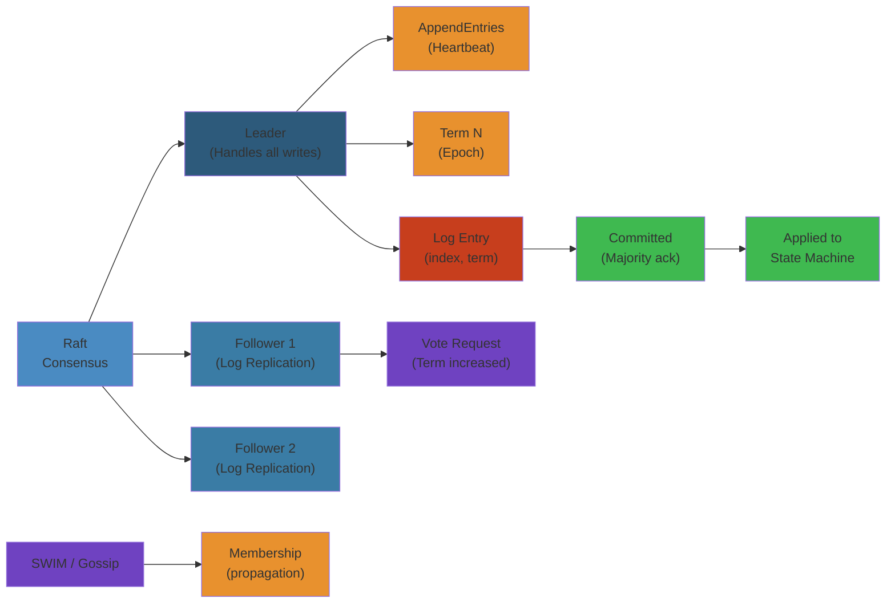

# 🔄 Distributed Consensus & Replication — Complete Deep Dive

> **Scope**: CAP theorem proof and tradeoffs, PACELC extension, FLP impossibility, Raft consensus (leader election, log replication, safety, membership change), Paxos (classic and Multi-Paxos), Zab (ZooKeeper atomic broadcast), gossip protocols (SWIM, memberlist, phi accrual), CRDTs (state-based, operation-based, common types), conflict resolution strategies.




## Table of Contents

1. CAP Theorem & Proof
2. PACELC Extension
3. FLP Impossibility
4. Raft: Leader Election
5. Raft: Log Replication
6. Raft: Safety & Commit Rule
7. Raft: Cluster Membership Change
8. Raft vs Paxos
9. Paxos: Classic & Multi-Paxos
10. Zab: ZooKeeper Atomic Broadcast
11. Gossip Protocols & SWIM
12. CRDTs: Theory & Common Types
13. Conflict Resolution Strategies

---

## 1. CAP Theorem & Proof

```text
+------------------+     +------------------+     +------------------+
|   Consistency    |     |  Availability    |     | Partition Toler. |
| (every read gets |     | (every request   |     | (system continues|
|  latest write)   |     |  gets a response)|     |  despite network |
+------------------+     +------------------+     +-------+----------+
         \                      /                          |
          +------CAP---------+--+ P is mandatory in practice
          | Pick 2 of 3      |    So CP or AP only
          | P always chosen  |
          +------------------+
```

**Gilbert-Lynch Proof (2002):** Assume consistent + available system. During a partition, a write arrives at node A but cannot reach node B. A read from B cannot return the latest write (violates consistency) unless it waits (violates availability). Contradiction.

**CP systems:** ZooKeeper, etcd, HBase — sacrifice availability during partition.
**AP systems:** Dynamo, Cassandra (tunable), CouchDB — sacrifice consistency.

---

## 2. PACELC Extension

**PACELC (Abadi, 2010):** If a Partition occurs (P), trade off C vs A. Else (E), trade off Latency vs Consistency.

```text
         Partition (P)                            Else (E)
       /             \                         /           \
    CP               AP                  Low Latency    Strong Consist.
   (abort)          (stale)              (weak reads)   (sync writes)
```

- **Cassandra:** Tunable at query time — `CL.ONE` for low latency, `CL.QUORUM` for consistency.
- **Cosmos DB:** Multiple levels from strong to eventual with bounded staleness options.
- **DynamoDB:** AP during partition; tunable consistency in normal operation.

---

## 3. FLP Impossibility

**Fischer, Lynch, Paterson (1985):** In an asynchronous distributed system where at least one process may crash, no deterministic consensus protocol can guarantee termination.

**Implications:**
- Real consensus protocols "cheat" by using timeouts (partially synchronous model).
- Raft's election timeouts and Paxos's failure detectors are practical workarounds.
- FLP doesn't say consensus is impossible — it says it cannot be *guaranteed* to terminate in a purely asynchronous model.

---

## 4. Raft: Leader Election

```text
+--------+      timeout, starts election      +-----------+
|        | ----------------------------------> |           |
|FOLLOWER|                                     | CANDIDATE |
|        | <-- discovers higher term or leader |           |
+--------+                                     +-----------+
     ^                                              |
     |                                              | wins election
     |         +--------+                           |
     +---------| LEADER |<--------------------------+
               |        |
               +--------+
```

**Term:** Monotonically increasing integer. Each term starts with an election.

**Election Timeout:** Random 150-300ms. Follower becomes candidate on timeout.

**RequestVote RPC:** `term`, `candidateId`, `lastLogIndex`, `lastLogTerm`. Receiver votes if: candidate's log is at least as up-to-date, `term >= currentTerm`, and not already voted.

```python
class RaftNode:
    def __init__(self):
        self.state = FOLLOWER
        self.current_term = 0
        self.election_timeout = random(150, 300)

    def start_election(self):
        self.state = CANDIDATE
        self.current_term += 1
        votes = 1
        for peer in self.peers:
            if peer.request_vote(self.current_term, self.last_log_index, self.last_log_term):
                votes += 1
        if votes > len(self.peers) // 2:
            self.state = LEADER

    def request_vote(self, term, last_index, last_term):
        if term < self.current_term: return False
        if (term > self.current_term or self.voted_for is None):
            if last_term >= self.last_log_term and last_index >= self.last_log_index:
                self.current_term = term; return True
        return False
```

**Pre-Vote:** Candidate checks viability before incrementing term. Prevents leader disruption on rejoin.

---

## 5. Raft: Log Replication

```text
Client            Leader                Followers
  |                 |                      |
  |--- Proposal --->|                      |
  |                 |--- AppendEntries --->|
  |                 |<-- OK ---------------|
  |                 |--- AppendEntries --->|
  |                 |<-- OK ---------------|
  |                 | (majority ack)       |
  |<-- Response ----| commit = true        |
```

**Log Structure:**
```
term:   1    1    2    2    3    3    3
index:  1    2    3    4    5    6    7
Leader: [x=3][y=1][x=5][z=2][w=1][w=3][x=9]
  F1:   [x=3][y=1][x=5][z=2][w=1][w=3]
  F2:   [x=3][y=1][x=5][z=2]
```

**AppendEntries:** `prevLogIndex`, `prevLogTerm`, `entries[]`, `leaderCommit`. Follower rejects if log doesn't match at `prevLogIndex`.

**Fast Backup:** When follower rejects, it returns `conflictTerm` and `conflictIndex`. Leader skips directly to the first conflicting index.

---

## 6. Raft: Safety & Commit Rule

**Election Safety:** At most one leader per term (majority can only vote for one candidate).

**Leader Append-Only:** Leader never overwrites or deletes log entries.

**Log Matching:** If two logs share entry `(index, term)`, all earlier entries are identical.

**Leader Completeness:** Committed entries survive in all future leaders. Proof: committed entry is on a majority; candidate needs majority; intersection contains at least one node with the entry.

**State Machine Safety:** No two servers apply different entries at the same index.

```text
Commit Rule for Previous Terms:
  S1 (term 3): [1][1][2][3]
  S2:          [1][1][2]
  S3:          [1][1]
  Entry index 3 is on S1+S2 (majority), but if S1 crashes, S3 could overwrite it!
  
  Solution: Leader must commit its own term entry first.
  S1: [1][1][2][3][3] ← commit own term 3 entry → proves term 2 entry is committed.
```

---

## 7. Raft: Cluster Membership Change

**Single-Server Changes:** Add/remove one server at a time. Overlapping majorities ensure safety.

```text
Add D (learner) → D catches up → D becomes voter → Add E (learner) → E becomes voter → Remove A
```

**Non-Voting Learners:** New nodes join as learners (receive log, no vote). Prevents cluster unavailability.

**Configuration Entry:** Stored as special log entry. Takes effect when committed.

---

## 8. Raft vs Paxos

```text
+--------------------------+  +---------------------------+
|         Raft             |  |          Paxos            |
+--------------------------+  +---------------------------+
| One strong leader        |  | Multiple proposers        |
| All writes via leader    |  | Any node can propose      |
| Simple log = ordered seq |  | Log = independent instances|
| Understandable in 1 hour |  | Complex to implement      |
| Election built in        |  | Leader election separate  |
+--------------------------+  +---------------------------+
```

**Multi-Paxos:** Elect a distinguished proposer (leader), skip prepare phase for subsequent instances. Leader-based like Raft.

---

## 9. Paxos: Classic & Multi-Paxos

```text
Phase 1: Prepare
  Proposer → Acceptors: prepare(N)
  Acceptor → Proposer:  promise(N) + last accepted value (if any)

Phase 2: Accept
  Proposer → Acceptors: accept(N, value)  (value from highest N promise, or own)
  Acceptor → Proposer:  accepted(N, value)  if no higher prepare seen
```

```python
class PaxosAcceptor:
    def __init__(self):
        self.promised_n = 0
        self.accepted_n = 0
        self.accepted_value = None

    def prepare(self, n):
        if n > self.promised_n:
            self.promised_n = n
            return (True, self.accepted_n, self.accepted_value)
        return (False, None, None)

    def accept(self, n, value):
        if n >= self.promised_n:
            self.promised_n = n
            self.accepted_n = n
            self.accepted_value = value
            return True
        return False
```

**Multi-Paxos:** Leader skips Phase 1 for all subsequent instances using same proposal number. Epoch increments on leader change.

---

## 10. Zab: ZooKeeper Atomic Broadcast

**Zab (ZooKeeper Atomic Broadcast):** Leader-based total order broadcast. Leader-only writes.

```text
zxid Format: |<- 32 bits: epoch ->|<- 32 bits: counter ->|
zxid = (epoch << 32) | counter   (monotonically increasing)
```

**Leader Activation:** 1) New leader elects with highest epoch + 1. 2) Synchronization: leader learns committed transactions from quorum. 3) Broadcast: leader accepts new proposals.

**vs Raft:** Zab uses epoch+sequence zxid; Raft uses term+index. Zab has explicit synchronization phase; Raft uses AppendEntries log matching.

---

## 11. Gossip Protocols & SWIM

**SWIM (Scalable Weakly-consistent Infection-style Membership):**

```text
Node A                    Node B
  |                         |
  |--- Ping --------------->|
  |<-- Ack -----------------|
  | If no ack:              |
  |--- PingReq(target=B) -->| C
  |<-- Ack ----------------|
```

**Phi Accrual Failure Detector:** Compute suspicion level `phi = -log10(P(elapsed | mean_interval))`. `phi > threshold` → suspect. Adaptive to network conditions.

```python
def phi(since_last_heartbeat, mean_interval):
    return -math.log10(math.exp(-since_last_heartbeat / mean_interval))
```

**Membership States:** alive → suspect (if phi threshold exceeded) → dead (after confirmation timeout). Infection-style: each gossip round picks random node, exchanges membership. O(log N) rounds to converge.

---

## 12. CRDTs: Theory & Common Types

**CRDT (Conflict-Free Replicated Data Type):** Converges without consensus. Operations commute.

```text
         CRDT Family
        /           \
   CvRDT (state)   CmRDT (op)
   join-semilattice exactly-once delivery
```

```python
# G-Counter (Grow-only)
class GCounter:
    def __init__(self, node_id, n_nodes):
        self.counts = [0] * n_nodes; self.node_id = node_id
    def inc(self): self.counts[self.node_id] += 1
    def value(self): return sum(self.counts)
    def merge(self, other):
        for i in range(len(self.counts)):
            self.counts[i] = max(self.counts[i], other.counts[i])

# PN-Counter
class PNCounter:
    def __init__(self): self.pos = GCounter(...); self.neg = GCounter(...)
    def inc(self): self.pos.inc()
    def dec(self): self.neg.inc()
    def value(self): return self.pos.value() - self.neg.value()

# LWW-Register (value + timestamp)
class LWWRegister:
    def set(self, value, ts):
        if ts > self.timestamp:
            self.value = value; self.timestamp = ts
    def merge(self, other):
        if other.timestamp > self.timestamp:
            self.value = other.value; self.timestamp = other.timestamp
```

**Common CRDTs:** G-Set (union merge), 2P-Set (add + remove sets, no re-add), OR-Set (unique tags per add, allows re-add), Causal Tree (ordered list for text editing).

---

## 13. Conflict Resolution Strategies

| Strategy | Mechanism | Pros | Cons |
|----------|-----------|------|------|
| LWW | Timestamp | Simple, always converges | Lost concurrent writes |
| Vector Clock | Causality tracking | No data loss | O(N) size, sibling explosion |
| DVV | Dot per replica | Smaller than VC | Complex implementation |
| HLC | Physical + logical clock | Compact, causal ordering | Clock sync helps |
| CRDT Merge | Semilattice merge | Automatic convergence | Constrained data types |
| Custom | App-specific reconcile | Full control | Manual implementation |

**Hybrid Logical Clock (HLC):**
```python
class HLC:
    def send_event(self):
        now = current_time()
        if now > self.physical: self.physical = now; self.logical = 0
        else: self.logical += 1
        return (self.physical, self.logical)
```

**Causal Consistency:** Causally related writes seen in same order by all. Concurrent writes may differ. Weaker than linearizability, stronger than eventual.

---

## Simplest Mental Model

**Consensus is a group of servers agreeing on one thing despite failures.** Raft makes this simple: one leader makes all decisions; if it dies, servers run a random-timer election to pick a new one. Paxos does the same with more math. **CRDTs avoid consensus entirely** — operations commute like addition: `1+2+3` is same regardless of order. CAP says: during a network split, you must choose correctness or availability, never both.


## Replication Stages Explained

### Stage 1: Write to Leader
```
Client → Leader: "insert user=alice"
         Leader writes to WAL (Write-Ahead Log)
         Returns ack to client
```

### Stage 2: Replicate to Followers
```
Leader → Follower-1: "insert user=alice"
         ↓
         Follower-1 writes to WAL
         Sends ack back
         ↓
Leader → Follower-2: "insert user=alice"
         ↓
         Follower-2 writes to WAL
         Sends ack back
```

### Stage 3: Commit
```
Leader checks: "Got acks from N/2+1 replicas?"
If YES → Marks committed in leader's log
        Notifies all followers: "this entry committed"
        Followers apply to state machine
If NO  → Entry stays in log but not applied
```

### Failure Scenarios

| Scenario | Replication State | Recovery |
|----------|------------------|----------|
| Client crashes | Entry in leader WAL | Retry on reconnect |
| Leader crashes | Entry in 1 follower | New leader may not have it |
| 3/5 replicas down | 2/5 can't quorum | Wait for replica recovery |


## Practical Example

See code examples above for practical usage patterns.