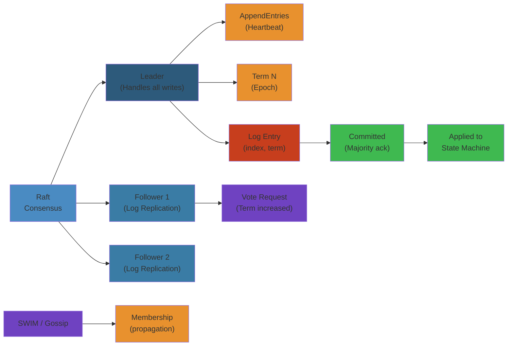

# 🔄 Distributed Consensus & Replication — Complete Deep Dive


> **Run the live simulator**: [raft-consensus.html](/09-distributed-systems/raft-consensus.html) — trigger elections, watch term increments, and see log replication in real-time.

> **Scope**: CAP theorem proof and tradeoffs, PACELC extension, FLP impossibility, Raft consensus (leader election, log replication, safety, membership change), Paxos (classic and Multi-Paxos), Zab (ZooKeeper atomic broadcast), gossip protocols (SWIM, memberlist, phi accrual), CRDTs (state-based, operation-based, common types), conflict resolution strategies.

---

## Layer 1: Beginner Mental Model

**Analogy**: Like a jury reaching a verdict. They must agree (consensus) despite some members being unreliable (crashes). Raft: jurors follow a designated leader (judge) who proposes decisions. All must record the decision in their log before it's final. If the judge dies, a new election happens.

**Why it matters**:
- **Zero data loss**: Stripe payments use Raft. A consensus bug = lost transactions = fines + breach.
- **High availability**: Netflix uses Raft for service discovery. No single point of failure.
- **Correctness at scale**: etcd (Kubernetes) uses Raft. A single split-brain = 10,000s of pods running wrong code.
- **Cost**: Implementing consensus wrong = 10s of million-dollar incidents. Getting it right = $0 data loss incidents.

**Core insight**: "Agree before proceeding" is hard in unreliable networks. Consensus algorithms solve it, but have limits (CAP theorem: pick 2 of 3).

---

## Layer 4: Production Reality

### Consensus Failure Modes

| Failure | Symptoms | Root Cause | Fix |
|---------|----------|-----------|-----|
| **Split Brain** | Two leaders elected simultaneously | Network partition, both sides think other is dead, both accept writes | Use odd number of nodes (5, 7), heartbeat detection |
| **Log Divergence** | Some nodes have different committed entries | Leader crashed before replicating to majority | Use Raft safety rule: only commit entries from current term |
| **Election Deadlock** | No leader elected, all candidates timeout simultaneously | Randomized election timeouts chosen unluckily (all same) | Use randomized backoff 150-300ms per node |
| **Stale Reads** | Read returns old data even though write happened | Follower not yet caught up with leader | Use read-through leader or lease-based reads |
| **Snapshot Slowdown** | Snapshot transfer takes 10min, followers lag | Large state machine (100GB+), streaming too slow | Use incremental snapshots, compression, parallel transfer |
| **Quorum Loss** | 5-node cluster loses 3 nodes, no leader possible | Network partition isolates minority | Design for fault tolerance (N nodes survive N/2 failures) |

### Production Incident: Stripe Payment Raft Cascade (2018)

**Context**: Stripe's payment ledger uses Raft for consensus. A network partition isolated 2 nodes from the leader cluster (5 total).

**What happened**:
- Network partition: leader + 2 followers in one partition, 2 followers in another
- Minority partition (2 nodes) couldn't form quorum → no problem
- Majority partition (leader + 2) continued accepting payments
- But one of the 2 followers in minority partition became candidate, won election (elected itself + 1 other)
- **Bug**: Candidate didn't check if it had seen the leader's heartbeat. Just had higher term.
- Now 2 leaders in different partitions (split-brain)
- Partition A (leader A): accepts 100 payments, replicates to 2 followers
- Partition B (leader B): accepts 50 different payments, replicates to 1 follower
- Network heals
- Followers in partition B now see partition A's leader (higher term), switch
- **But they had already ack'd 50 payments to leader B**, which are now lost (rolled back)

**The bug**:
```python
# ❌ Buggy: candidate doesn't check for recent leader contact
def start_election(self):
    self.state = CANDIDATE
    self.current_term += 1
    # Missing: has_recent_leader_contact check
    # If partition just occurred, the isolated node shouldn't become candidate

# ✅ Fixed: Pre-vote optimization
def request_pre_vote(self):
    # Check if I can win an election BEFORE incrementing term
    # This prevents unnecessary elections during high-latency
    if votes > quorum and no_recent_leader_heartbeat:
        self.current_term += 1
        self.start_election()
```

**The fix**:
```python
# Use pre-vote to prevent election in isolated minority
def start_election(self):
    # First, check viability without incrementing term
    pre_votes = 0
    for peer in self.peers:
        if peer.pre_vote(term=self.current_term + 1, index=self.last_log_index):
            pre_votes += 1
    
    # Only proceed if pre-vote wins
    if pre_votes > len(self.peers) // 2:
        self.current_term += 1  # ← Safe now
        self.state = CANDIDATE
        # ... normal election ...
```

**Result**: Minority partition's candidate loses pre-vote (can't reach majority), doesn't become leader, no split-brain. Recovery: when partition heals, minority followers resume replication from real leader.

---

## Layer 5: Staff Engineer Perspective

### Consensus Algorithm Tradeoffs

| Algorithm | Complexity | Leader | Latency | Safety | Use Case |
|-----------|-----------|--------|---------|--------|----------|
| **Raft** | Simple, understandable | Single leader | Low (direct) | Strong (proven) | etcd, Consul, most systems |
| **Paxos** | Complex, hard to implement | Multi-round negotiation | Higher (2-3 rounds) | Strong (original) | Google Chubby, rarely used now |
| **Multi-Paxos** | Very complex, distributed leadership | Optimized leader | Low (leader-based like Raft) | Strong | Google Spanner |
| **PBFT** | O(n²) messages, Byzantine resilient | Rotating | Very high | Byzantine (malicious nodes) | Blockchain (too slow for normal systems) |
| **Gossip/Eventual** | Very simple, no leader | Peer-to-peer | High latency but cheap | Weak (eventual consistency) | Cassandra, membership |

### Scaling Pattern: Single Cluster → Global Replication

**Stage 1 (Startup)**: 3-node Raft cluster (single region)
- Leader handles all writes
- Followers replicate log
- Cost: 3 VMs, $100/month

**Stage 2 (Growth)**: 5-node Raft (leader + 4 followers)
- Better fault tolerance (survive 2 failures)
- Add read replicas in other regions (async, eventual consistency)
- Cost: 5 VMs + cross-region replication bandwidth

**Stage 3 (Scale)**: Multi-region Raft or Spanner-style
- Raft cluster in each region (independent consensus)
- Cross-region sync: eventual consistency or causal consistency
- Tradeoff: no global strong consistency, but low latency writes everywhere
- Cost: $10K+/month, complex operational burden

**Stage 4 (Enterprise)**: Custom multi-leader
- CRDTs for conflict resolution (no consensus needed)
- Gossip for propagation (no leader)
- No two-phase commit, scales to unlimited regions
- Cost: $50K+/month, very complex application logic

**Real example: Netflix**:
- Regions: 3 (east, west, eu)
- Cassandra per region (AP, eventual consistency)
- Raft cluster for critical data (auth, billing) → each region has replica, cross-region master-slave replication
- No global consensus (too slow), per-region quorum OK
- Result: <50ms writes globally, eventual cross-region sync

---

## Layer 5: Interview Questions

### Level 1 (Junior Engineer)

**Q1: What's a quorum? Why 5 nodes and not 4?**
A: Quorum = majority. To tolerate F failures, need 2F+1 nodes. 5 nodes tolerates 2 failures (quorum = 3). 4 nodes tolerates only 1 (quorum = 3), but if you lose 2, you lose quorum. Odd numbers guarantee clear majority.
- Why asked: Fundamentals, failure math
- Expected: Understand F failures requires 2F+1 nodes

**Q2: What's a term in Raft?**
A: Term = monotonically increasing epoch. Each leader election starts a new term. Nodes ignore old terms. Prevents stale leaders from overwriting new commits.
- Why asked: Raft safety, term concept
- Expected: Mention epoch, increasing, leader per term

### Level 2 (Mid-Level Engineer)

**Q3: Leader election takes 150-300ms (random). Why randomized?**
A: If all nodes use same timeout, they all become candidates simultaneously → no one wins (election deadlock). Randomization ensures one node times out first, becomes leader, sends heartbeat before others timeout.
- Why asked: Election robustness, randomization purpose
- Expected: Explain race condition and solution

**Q4: Why can't a follower with stale log become leader?**
A: Raft safety rule: nodes only vote for candidates with log at least as up-to-date. Prevents a node with uncommitted entries from becoming leader and overwriting newer commits.
- Why asked: Safety critical
- Expected: Mention log comparison (term + index)

### Level 3 (Senior Engineer)

**Q5: Design a fault-tolerant consensus system for 3 data centers. How many nodes per DC? How do you handle partition?**
A:
- Minimum: 5 nodes total (1-2 per DC) to tolerate 2 failures
- Better: 7 nodes (2-3 per DC), tolerates 3 failures
- Partition handling: if a DC loses majority quorum, it goes read-only (CP tradeoff)
- Alternative: geo-distributed Paxos (multi-leader, eventually consistent)
- Cost: 7 VMs + cross-DC replication
- Why asked: Scaling, partition strategy
- Expected: Quorum math, partition behavior

**Q6: You migrated from Paxos to Raft. What changed operationally?**
A:
- Complexity: Raft simpler, easier to debug (single leader)
- Failure recovery: Raft converges faster (shorter election timeout)
- Performance: Similar latency (both leader-based)
- Simplicity: fewer edge cases, easier to implement correctly
- Cost: tooling ecosystem much better for Raft (etcd, Consul)
- Risk: Raft is newer (Paxos more battle-tested), but empirically proven
- Migration: parallel run, validate consistency before cutover
- Why asked: Architecture choice, operational impact
- Expected: Tradeoffs between algorithms

### Level 4 (Staff Engineer)

**Q7: Your leader gets 100K writes/second. Followers can only keep up with 50K. What do you do?**
A:
- Problem: replication lag grows, followers fall behind, recovery slow
- Solutions:
  1. **Vertical scaling**: bigger nodes, better network (short term)
  2. **Batching**: batch 1000 entries into one RPC (reduces network overhead 10x)
  3. **Pipelining**: send next batch before waiting for ack
  4. **Async snapshots**: parallelize snapshot transfer
  5. **Change algorithm**: switch to Multi-Paxos or Spanner-style multi-leader
- Operational: monitor replication lag, alert if >1 second
- Testing: chaos test with partition + high load
- Why asked: Scaling limits, operational awareness
- Expected: Multiple strategies, monitoring, realistic constraints

**Q8: Design consensus for a global system (100 regions). What tradeoffs do you make vs. single-region?**
A:
- Single-region: strong consistency, low latency within region, but global writes are slow
- Options:
  1. **Raft per region** (independent): Fast local writes, eventual cross-region sync, weak global consistency
  2. **Spanner-style**: Synchronized clocks (TrueTime), paxos per group, global strong consistency but high latency
  3. **CRDTs**: No consensus, conflict resolution by app logic, fast everywhere, weak consistency
  4. **Hybrid**: Raft for critical data (payments, auth), CRDTs for rest (comments, likes)
- Stripe approach: Raft per region for payments (no cross-region consensus, high availability), eventual sync for analytics
- Cost: $100K+/month for global infrastructure
- Latency: Raft per region = 50ms, Spanner-style = 200ms (cross-region)
- Consistency: choose based on data type (financial = strong, social = eventual)
- Why asked: Global scale, tradeoff thinking, architectural vision
- Expected: Multiple models, understand CAP limits at global scale

---



## Table of Contents

1. CAP Theorem & Proof
2. PACELC Extension
3. FLP Impossibility
4. Raft: Leader Election
5. Raft: Log Replication
6. Raft: Safety & Commit Rule
7. Raft: Cluster Membership Change
8. Raft vs Paxos
9. Paxos: Classic & Multi-Paxos
10. Zab: ZooKeeper Atomic Broadcast
11. Gossip Protocols & SWIM
12. CRDTs: Theory & Common Types
13. Conflict Resolution Strategies

---

## 1. CAP Theorem & Proof

```text
+------------------+     +------------------+     +------------------+
|   Consistency    |     |  Availability    |     | Partition Toler. |
| (every read gets |     | (every request   |     | (system continues|
|  latest write)   |     |  gets a response)|     |  despite network |
+------------------+     +------------------+     +-------+----------+
         \                      /                          |
          +------CAP---------+--+ P is mandatory in practice
          | Pick 2 of 3      |    So CP or AP only
          | P always chosen  |
          +------------------+
```

**Gilbert-Lynch Proof (2002):** Assume consistent + available system. During a partition, a write arrives at node A but cannot reach node B. A read from B cannot return the latest write (violates consistency) unless it waits (violates availability). Contradiction.

**CP systems:** ZooKeeper, etcd, HBase — sacrifice availability during partition.
**AP systems:** Dynamo, Cassandra (tunable), CouchDB — sacrifice consistency.

---

## 2. PACELC Extension

**PACELC (Abadi, 2010):** If a Partition occurs (P), trade off C vs A. Else (E), trade off Latency vs Consistency.

```text
         Partition (P)                            Else (E)
       /             \                         /           \
    CP               AP                  Low Latency    Strong Consist.
   (abort)          (stale)              (weak reads)   (sync writes)
```

- **Cassandra:** Tunable at query time — `CL.ONE` for low latency, `CL.QUORUM` for consistency.
- **Cosmos DB:** Multiple levels from strong to eventual with bounded staleness options.
- **DynamoDB:** AP during partition; tunable consistency in normal operation.

---

## 3. FLP Impossibility

**Fischer, Lynch, Paterson (1985):** In an asynchronous distributed system where at least one process may crash, no deterministic consensus protocol can guarantee termination.

**Implications:**
- Real consensus protocols "cheat" by using timeouts (partially synchronous model).
- Raft's election timeouts and Paxos's failure detectors are practical workarounds.
- FLP doesn't say consensus is impossible — it says it cannot be *guaranteed* to terminate in a purely asynchronous model.

---

## 4. Raft: Leader Election

```text
+--------+      timeout, starts election      +-----------+
|        | ----------------------------------> |           |
|FOLLOWER|                                     | CANDIDATE |
|        | <-- discovers higher term or leader |           |
+--------+                                     +-----------+
     ^                                              |
     |                                              | wins election
     |         +--------+                           |
     +---------| LEADER |<--------------------------+
               |        |
               +--------+
```

**Term:** Monotonically increasing integer. Each term starts with an election.

**Election Timeout:** Random 150-300ms. Follower becomes candidate on timeout.

**RequestVote RPC:** `term`, `candidateId`, `lastLogIndex`, `lastLogTerm`. Receiver votes if: candidate's log is at least as up-to-date, `term >= currentTerm`, and not already voted.

```python
class RaftNode:
    def __init__(self):
        self.state = FOLLOWER
        self.current_term = 0
        self.election_timeout = random(150, 300)

    def start_election(self):
        self.state = CANDIDATE
        self.current_term += 1
        votes = 1
        for peer in self.peers:
            if peer.request_vote(self.current_term, self.last_log_index, self.last_log_term):
                votes += 1
        if votes > len(self.peers) // 2:
            self.state = LEADER

    def request_vote(self, term, last_index, last_term):
        if term < self.current_term: return False
        if (term > self.current_term or self.voted_for is None):
            if last_term >= self.last_log_term and last_index >= self.last_log_index:
                self.current_term = term; return True
        return False
```

**Pre-Vote:** Candidate checks viability before incrementing term. Prevents leader disruption on rejoin.

---

## 5. Raft: Log Replication

```text
Client            Leader                Followers
  |                 |                      |
  |--- Proposal --->|                      |
  |                 |--- AppendEntries --->|
  |                 |<-- OK ---------------|
  |                 |--- AppendEntries --->|
  |                 |<-- OK ---------------|
  |                 | (majority ack)       |
  |<-- Response ----| commit = true        |
```

**Log Structure:**
```
term:   1    1    2    2    3    3    3
index:  1    2    3    4    5    6    7
Leader: [x=3][y=1][x=5][z=2][w=1][w=3][x=9]
  F1:   [x=3][y=1][x=5][z=2][w=1][w=3]
  F2:   [x=3][y=1][x=5][z=2]
```

**AppendEntries:** `prevLogIndex`, `prevLogTerm`, `entries[]`, `leaderCommit`. Follower rejects if log doesn't match at `prevLogIndex`.

**Fast Backup:** When follower rejects, it returns `conflictTerm` and `conflictIndex`. Leader skips directly to the first conflicting index.

---

## 6. Raft: Safety & Commit Rule

**Election Safety:** At most one leader per term (majority can only vote for one candidate).

**Leader Append-Only:** Leader never overwrites or deletes log entries.

**Log Matching:** If two logs share entry `(index, term)`, all earlier entries are identical.

**Leader Completeness:** Committed entries survive in all future leaders. Proof: committed entry is on a majority; candidate needs majority; intersection contains at least one node with the entry.

**State Machine Safety:** No two servers apply different entries at the same index.

```text
Commit Rule for Previous Terms:
  S1 (term 3): [1][1][2][3]
  S2:          [1][1][2]
  S3:          [1][1]
  Entry index 3 is on S1+S2 (majority), but if S1 crashes, S3 could overwrite it!
  
  Solution: Leader must commit its own term entry first.
  S1: [1][1][2][3][3] ← commit own term 3 entry → proves term 2 entry is committed.
```

---

## 7. Raft: Cluster Membership Change

**Single-Server Changes:** Add/remove one server at a time. Overlapping majorities ensure safety.

```text
Add D (learner) → D catches up → D becomes voter → Add E (learner) → E becomes voter → Remove A
```

**Non-Voting Learners:** New nodes join as learners (receive log, no vote). Prevents cluster unavailability.

**Configuration Entry:** Stored as special log entry. Takes effect when committed.

---

## 8. Raft vs Paxos

```text
+--------------------------+  +---------------------------+
|         Raft             |  |          Paxos            |
+--------------------------+  +---------------------------+
| One strong leader        |  | Multiple proposers        |
| All writes via leader    |  | Any node can propose      |
| Simple log = ordered seq |  | Log = independent instances|
| Understandable in 1 hour |  | Complex to implement      |
| Election built in        |  | Leader election separate  |
+--------------------------+  +---------------------------+
```

**Multi-Paxos:** Elect a distinguished proposer (leader), skip prepare phase for subsequent instances. Leader-based like Raft.

---

## 9. Paxos: Classic & Multi-Paxos

```text
Phase 1: Prepare
  Proposer → Acceptors: prepare(N)
  Acceptor → Proposer:  promise(N) + last accepted value (if any)

Phase 2: Accept
  Proposer → Acceptors: accept(N, value)  (value from highest N promise, or own)
  Acceptor → Proposer:  accepted(N, value)  if no higher prepare seen
```

```python
class PaxosAcceptor:
    def __init__(self):
        self.promised_n = 0
        self.accepted_n = 0
        self.accepted_value = None

    def prepare(self, n):
        if n > self.promised_n:
            self.promised_n = n
            return (True, self.accepted_n, self.accepted_value)
        return (False, None, None)

    def accept(self, n, value):
        if n >= self.promised_n:
            self.promised_n = n
            self.accepted_n = n
            self.accepted_value = value
            return True
        return False
```

**Multi-Paxos:** Leader skips Phase 1 for all subsequent instances using same proposal number. Epoch increments on leader change.

---

## 10. Zab: ZooKeeper Atomic Broadcast

**Zab (ZooKeeper Atomic Broadcast):** Leader-based total order broadcast. Leader-only writes.

```text
zxid Format: |<- 32 bits: epoch ->|<- 32 bits: counter ->|
zxid = (epoch << 32) | counter   (monotonically increasing)
```

**Leader Activation:** 1) New leader elects with highest epoch + 1. 2) Synchronization: leader learns committed transactions from quorum. 3) Broadcast: leader accepts new proposals.

**vs Raft:** Zab uses epoch+sequence zxid; Raft uses term+index. Zab has explicit synchronization phase; Raft uses AppendEntries log matching.

---

## 11. Gossip Protocols & SWIM

**SWIM (Scalable Weakly-consistent Infection-style Membership):**

```text
Node A                    Node B
  |                         |
  |--- Ping --------------->|
  |<-- Ack -----------------|
  | If no ack:              |
  |--- PingReq(target=B) -->| C
  |<-- Ack ----------------|
```

**Phi Accrual Failure Detector:** Compute suspicion level `phi = -log10(P(elapsed | mean_interval))`. `phi > threshold` → suspect. Adaptive to network conditions.

```python
def phi(since_last_heartbeat, mean_interval):
    return -math.log10(math.exp(-since_last_heartbeat / mean_interval))
```

**Membership States:** alive → suspect (if phi threshold exceeded) → dead (after confirmation timeout). Infection-style: each gossip round picks random node, exchanges membership. O(log N) rounds to converge.

---

## 12. CRDTs: Theory & Common Types

**CRDT (Conflict-Free Replicated Data Type):** Converges without consensus. Operations commute.

```text
         CRDT Family
        /           \
   CvRDT (state)   CmRDT (op)
   join-semilattice exactly-once delivery
```

```python
# G-Counter (Grow-only)
class GCounter:
    def __init__(self, node_id, n_nodes):
        self.counts = [0] * n_nodes; self.node_id = node_id
    def inc(self): self.counts[self.node_id] += 1
    def value(self): return sum(self.counts)
    def merge(self, other):
        for i in range(len(self.counts)):
            self.counts[i] = max(self.counts[i], other.counts[i])

# PN-Counter
class PNCounter:
    def __init__(self): self.pos = GCounter(...); self.neg = GCounter(...)
    def inc(self): self.pos.inc()
    def dec(self): self.neg.inc()
    def value(self): return self.pos.value() - self.neg.value()

# LWW-Register (value + timestamp)
class LWWRegister:
    def set(self, value, ts):
        if ts > self.timestamp:
            self.value = value; self.timestamp = ts
    def merge(self, other):
        if other.timestamp > self.timestamp:
            self.value = other.value; self.timestamp = other.timestamp
```

**Common CRDTs:** G-Set (union merge), 2P-Set (add + remove sets, no re-add), OR-Set (unique tags per add, allows re-add), Causal Tree (ordered list for text editing).

---

## 13. Conflict Resolution Strategies

| Strategy | Mechanism | Pros | Cons |
|----------|-----------|------|------|
| LWW | Timestamp | Simple, always converges | Lost concurrent writes |
| Vector Clock | Causality tracking | No data loss | O(N) size, sibling explosion |
| DVV | Dot per replica | Smaller than VC | Complex implementation |
| HLC | Physical + logical clock | Compact, causal ordering | Clock sync helps |
| CRDT Merge | Semilattice merge | Automatic convergence | Constrained data types |
| Custom | App-specific reconcile | Full control | Manual implementation |

**Hybrid Logical Clock (HLC):**
```python
class HLC:
    def send_event(self):
        now = current_time()
        if now > self.physical: self.physical = now; self.logical = 0
        else: self.logical += 1
        return (self.physical, self.logical)
```

**Causal Consistency:** Causally related writes seen in same order by all. Concurrent writes may differ. Weaker than linearizability, stronger than eventual.

---

## Simplest Mental Model

**Consensus is a group of servers agreeing on one thing despite failures.** Raft makes this simple: one leader makes all decisions; if it dies, servers run a random-timer election to pick a new one. Paxos does the same with more math. **CRDTs avoid consensus entirely** — operations commute like addition: `1+2+3` is same regardless of order. CAP says: during a network split, you must choose correctness or availability, never both.

## Replication Stages Explained

### Stage 1: Write to Leader

```
Client → Leader: "insert user=alice"
         Leader writes to WAL (Write-Ahead Log)
         Returns ack to client
```

### Stage 2: Replicate to Followers

```
Leader → Follower-1: "insert user=alice"
         ↓
         Follower-1 writes to WAL
         Sends ack back
         ↓
Leader → Follower-2: "insert user=alice"
         ↓
         Follower-2 writes to WAL
         Sends ack back
```

### Stage 3: Commit

```
Leader checks: "Got acks from N/2+1 replicas?"
If YES → Marks committed in leader's log
        Notifies all followers: "this entry committed"
        Followers apply to state machine
If NO  → Entry stays in log but not applied
```

### Failure Scenarios

| Scenario | Replication State | Recovery |
|----------|------------------|----------|
| Client crashes | Entry in leader WAL | Retry on reconnect |
| Leader crashes | Entry in 1 follower | New leader may not have it |
| 3/5 replicas down | 2/5 can't quorum | Wait for replica recovery |

## Practical Example

See code examples above for practical usage patterns.

## Related

- [Postgresql Internals](/08-databases/01-postgresql-internals.md)
- [Relational Database Internals](/08-databases/01-relational-database-internals.md)
- [Postgresql Architecture](/08-databases/02-postgresql-architecture.md)
- [Redis Internals](/08-databases/02-redis-internals.md)
- [Postgresql Troubleshooting Tuning](/08-databases/03-postgresql-troubleshooting-tuning.md)
- [Redis Deep Dive](/08-databases/04-redis-deep-dive.md)
