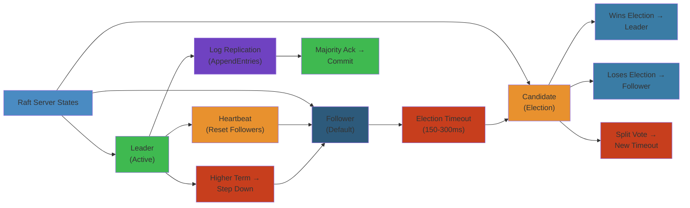
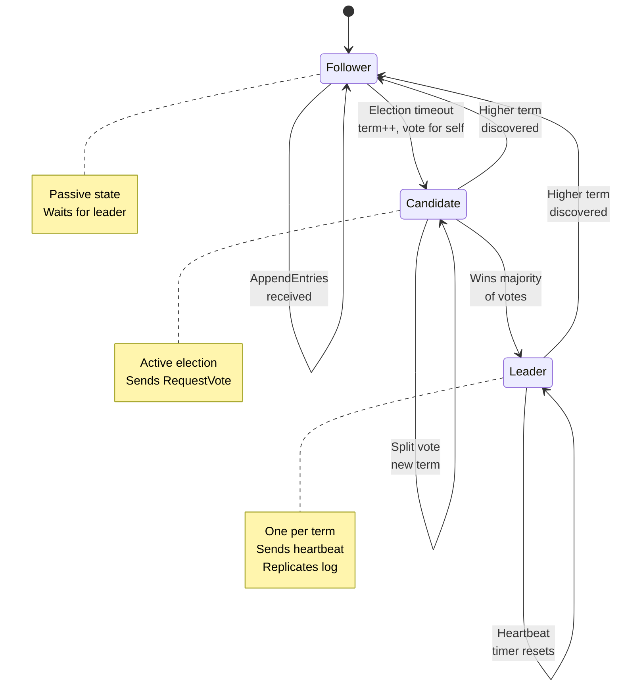
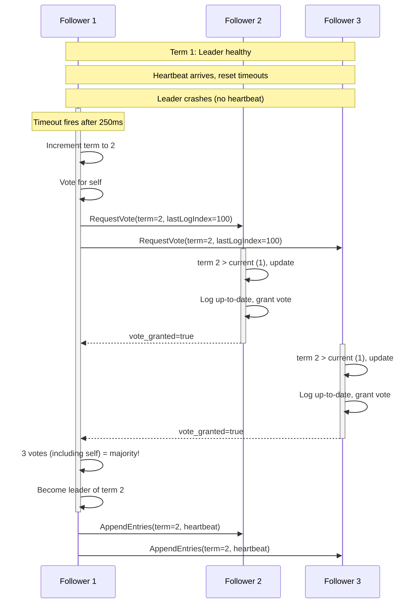

# ⛓️ Raft Consensus Algorithm — Complete Deep Dive

> **Scope**: Raft decomposition (leader election, log replication, safety, membership changes, log compaction), leader election mechanics, log replication protocol, safety guarantees, joint consensus for membership changes, snapshot/compaction, optimizations (batching, pipelining, read-only queries), Raft vs Paxos comparison, failure analysis, Raft implementations (etcd, Consul, TiKV, MongoDB, RethinkDB, Apache Ratis).
>
> **Related**: [01-cap-consistency.md](./01-cap-consistency.md) | [04-distributed-transactions.md](./04-distributed-transactions.md)




## Table of Contents

1. Raft Decomposition
2. Server States: Leader, Follower, Candidate
3. Terms & Elections
4. Leader Election Flow
5. Log Replication
6. Log Matching & Consistency
7. Safety Guarantees
8. Commit Rule
9. Membership Changes (Joint Consensus)
10. Log Compaction & Snapshots
11. Raft Optimizations
12. Raft vs Paxos
13. Failure Analysis
14. Raft Implementations

---

## 1. Raft Decomposition

```text
+---------------------------------------------------+
|                    RAFT                            |
|  +----------------+  +---------------------------+ |
|  | Leader         |  | Log Replication           | |
|  | Election       |  | - AppendEntries RPC       | |
|  | - RequestVote  |  | - Heartbeat               | |
|  | - Term/Candidate| | - Commit Index            | |
|  | - Random Timeout| | - Next/Match Index        | |
|  +-------+--------+  +------------+--------------+ |
|          |                         |               |
|  +-------+--------+  +------------+--------------+ |
|  | Safety         |  | Membership                | |
|  | - Election Safe|  | Changes                   | |
|  | - Leader Append|  | - Joint Consensus         | |
|  | - Log Matching |  | - Cold->Cold_new->Cnew    | |
|  | - Leader Compl |  | - Non-voting members      | |
|  | - State Machine|  +---------------------------+ |
|  |   Safety       |                               |
|  +----------------+                               |
+---------------------------------------------------+
```

Raft decomposes consensus into five sub-problems, each independently solvable and understandable.

---

## 2. Server States: Leader, Follower, Candidate

```text
+--------+      timeout, starts election      +-----------+
|        | ----------------------------------> |           |
|FOLLOWER|                                     | CANDIDATE |
|        | <-- discovers higher term or leader |           |
+--------+                                     +-----------+
     ^                                              |
     |                                              | wins election
     |                                              |
     |         +--------+                           |
     +---------| LEADER |<--------------------------+
               |        |
               +--------+
               |   |   heartbeat timeout,
               |   |   steps down if
               |   |   discovers higher term
               v   v
            FOLLOWER
```

**Follower:** Passive. Responds to RPCs from leader and candidates. Forwards client requests to leader. Timeout triggers election.

**Candidate:** Election phase. Increments term, sends RequestVote RPCs, collects votes. Wins with majority. If discovers higher term, reverts to follower.

**Leader:** Single active leader per term. Handles all client requests. Sends AppendEntries (heartbeat or log entries) to followers. If it discovers a higher term or cannot communicate with majority, steps down.

### Server States: Deep Dive

#### Step-by-Step

1. **Follower starts with election timeout** — Followers await AppendEntries from leader (heartbeat resets timer every 50ms).
2. **Timeout fires, follower becomes candidate** — Increments term, votes for itself, sends RequestVote to all peers.
3. **Candidate collects votes** — Waits for responses; counts votes from followers + own vote = majority needed.
4. **Wins election → becomes leader** — Sends immediate heartbeat to all followers (AppendEntries with no new entries) to reset their timeouts.
5. **Leader sends log entries** — Clients submit commands; leader appends to its log, sends AppendEntries with new entries to followers.
6. **Followers replicate** — Followers append entries to their logs, acknowledge; leader counts acks, commits when majority acked.
7. **Leader steps down if detects higher term** — If RequestVote or AppendEntries received with higher term, leader becomes follower immediately.

#### Code Example

```go
// Raft server state machine implementation (simplified)
type RaftServer struct {
    currentTerm int
    votedFor   string
    log        []LogEntry
    commitIndex int
    lastApplied int
    state      string  // "follower", "candidate", "leader"
    
    // Leader state
    nextIndex  map[string]int   // For each follower
    matchIndex map[string]int   // For each follower
}

// Handle election timeout
func (r *RaftServer) ElectionTimeout() {
    r.currentTerm += 1
    r.votedFor = r.self
    r.state = "candidate"
    
    // Send RequestVote RPC to all peers
    for peer := range r.peers {
        go r.sendRequestVote(peer)
    }
    
    // Start new election timeout
    r.resetElectionTimer()
}

// Handle RequestVote RPC
func (r *RaftServer) HandleRequestVote(req RequestVoteRPC) bool {
    // Only vote if candidate's log is at least as up-to-date
    if req.Term < r.currentTerm {
        return false
    }
    
    if req.Term > r.currentTerm {
        r.currentTerm = req.Term
        r.votedFor = ""
    }
    
    if r.votedFor == "" || r.votedFor == req.CandidateID {
        if req.LastLogTerm >= r.lastLogTerm() &&
           req.LastLogIndex >= r.lastLogIndex() {
            r.votedFor = req.CandidateID
            return true
        }
    }
    
    return false
}

// Handle becoming leader
func (r *RaftServer) BecomeLeader() {
    r.state = "leader"
    r.leader = r.self
    
    // Initialize nextIndex and matchIndex
    for peer := range r.peers {
        r.nextIndex[peer] = r.lastLogIndex() + 1
        r.matchIndex[peer] = 0
    }
    
    // Send initial empty heartbeat
    for peer := range r.peers {
        go r.sendAppendEntries(peer)
    }
    
    // Start heartbeat timer (50ms)
    r.resetHeartbeatTimer()
}
```

#### Real-World Scenario

At Etcd.io, a 5-node Raft cluster lost the leader due to network partition. The remaining 2 nodes couldn't elect a new leader (needed 3/5 majority). The other 3 nodes also couldn't reach each other, so they stayed as followers. The cluster was unavailable until the partition healed. They implemented a witness node (non-voting member) to reach 6 total nodes, so any 3 nodes could form quorum — only 2-node partitions would be unavailable.

#### Diagram



---

## 3. Terms & Elections

**Term:** Monotonically increasing integer. Each term starts with an election. If election succeeds, a single leader manages the term. If split vote, term ends without leader (immediate next term).

```text
Term 1         Term 2          Term 3           Term 4
[Election]-----[Normal]-------[Election]------[Normal]
   |               |               |               |
Leader A      Leader A       No leader       Leader B
                             (split vote)
```

**Election Timeout:** Random 150-300ms. Followers reset timeout on AppendEntries receipt. When timeout fires, follower becomes candidate.

**RequestVote RPC:**
- `term`, `candidateId`, `lastLogIndex`, `lastLogTerm`
- Receiver votes if:
  1. `term >= currentTerm`
  2. `candidate.lastLogTerm >= my.lastLogTerm`
  3. `candidate.lastLogIndex >= my.lastLogIndex`
  4. Hasn't voted for another in this term

**Election Safety:** At most one winner per term (majority required). No ties possible at scale.

**Random Timeout:** Prevents split votes. If split occurs (multiple candidates in same term), each waits random interval before starting next election. Given randomness, one will likely win next round.

**Pre-Vote:** Extension where candidate first checks if it can get votes before incrementing term. Prevents disrupted leaders from triggering new elections when rejoining.

### Terms & Elections: Deep Dive

#### Step-by-Step

1. **Term begins with election** — Any follower/candidate can start election by incrementing term and sending RequestVote.
2. **RequestVote RPC contains log info** — Candidate includes lastLogTerm and lastLogIndex so followers vote only for candidates with up-to-date logs.
3. **Voter persists vote** — Follower saves `votedFor = candidateID` in persistent storage; won't change vote in this term (prevents duplicate votes).
4. **Candidate counts votes** — Needs majority (3/5 nodes needs 3 votes including itself); any peer that votes for candidate acks the vote.
5. **Timeout + random backoff** — If split vote (multiple candidates, no majority), each candidate waits random 150-300ms, then retries; prevents livelock.
6. **Election safety guarantee** — Only one leader per term (majority requirement ensures no two candidates can both get majorities in same term).
7. **Term number enforces ordering** — Higher term = newer election; servers reject requests from lower terms, preventing stale leaders from replicating.

#### Code Example

```python
# Raft election with random timeout
import random
import time

class RaftElection:
    def __init__(self, node_id, peers, min_timeout=150, max_timeout=300):
        self.node_id = node_id
        self.peers = peers  # List of peer node IDs
        self.current_term = 0
        self.voted_for = None
        self.election_timeout = random.randint(min_timeout, max_timeout) / 1000.0
        self.last_heartbeat = time.time()
    
    def reset_election_timer(self):
        """Reset timer with new random timeout"""
        self.election_timeout = random.randint(150, 300) / 1000.0
        self.last_heartbeat = time.time()
    
    def should_start_election(self):
        """Check if election timeout has fired"""
        return (time.time() - self.last_heartbeat) > self.election_timeout
    
    def start_election(self):
        """Increment term, vote for self, send RequestVote"""
        self.current_term += 1
        self.voted_for = self.node_id
        
        votes = {self.node_id}  # Vote for self
        
        for peer in self.peers:
            response = self.send_request_vote(peer, {
                'term': self.current_term,
                'candidate_id': self.node_id,
                'last_log_term': self.get_last_log_term(),
                'last_log_index': self.get_last_log_index()
            })
            
            if response.get('vote_granted'):
                votes.add(peer)
        
        # Check if we have majority
        majority = len(self.peers) // 2 + 1
        if len(votes) >= majority:
            self.become_leader()
        else:
            # Split vote or lost election, retry with new term
            self.reset_election_timer()
    
    def handle_request_vote(self, req):
        """Handle incoming RequestVote RPC"""
        # If requester has higher term, update
        if req['term'] > self.current_term:
            self.current_term = req['term']
            self.voted_for = None
        
        # Vote only if we haven't voted and candidate log is up-to-date
        can_vote = (
            req['term'] >= self.current_term and
            (self.voted_for is None or self.voted_for == req['candidate_id']) and
            req['last_log_term'] >= self.get_last_log_term() and
            req['last_log_index'] >= self.get_last_log_index()
        )
        
        if can_vote:
            self.voted_for = req['candidate_id']
            return {'term': self.current_term, 'vote_granted': True}
        
        return {'term': self.current_term, 'vote_granted': False}
    
    def get_last_log_term(self):
        """Get term of last log entry"""
        return self.log[-1]['term'] if self.log else 0
    
    def get_last_log_index(self):
        """Get index of last log entry"""
        return len(self.log) - 1 if self.log else 0
```

#### Real-World Scenario

A Consul cluster (Raft-based) experienced split-brain during network partition: 2 nodes on one side, 3 on other. Without quorum, the 2-node partition couldn't elect a leader. But after 3 random election timeouts, they tried to form leader anyway, creating split-brain. Fix: implement `check_quorum` mode where leader steps down if it can't reach majority in last election_timeout period, preventing minority partitions from electing leaders.

#### Diagram



---

## 4. Leader Election Flow

```text
Step 1: Follower's election timeout fires.
         Follower -> Candidate
         term = currentTerm + 1
         voteFor = self
         send RequestVote to all servers

Step 2: Receive votes.
         If votes > N/2:
           Candidate -> Leader
           Send heartbeat AppendEntries to all
         Else if received AppendEntries from new leader:
           Candidate -> Follower
         Else (timeout with no majority):
           Increment term, start new election

Step 3: Leader maintains authority.
         Periodic heartbeats (AppendEntries with no entries)
         Reset follower election timers
```

**Election Timeout Tuning:**
- Too short: frequent unnecessary elections, instability
- Too long: slow fault detection, long write unavailability
- 150-300ms typical. Spread factor of 2x ensures low collision probability
- Larger clusters need wider random range

---

## 5. Log Replication

```text
Client                    Leader                    Followers
  |                         |                          |
  |--- Proposal ---------->|                          |
  |                         |--- AppendEntries ------->|
  |                         |<-- AppendEntries OK -----|
  |                         |--- AppendEntries ------->|
  |                         |<-- AppendEntries OK -----|
  |                         | (majority ack)           |
  |                         | commit = true            |
  |                         |--- AppendEntries(commit) |
  |<-- Response -----------|                          |
```

**Log Structure:**
```
                 term:  1    1    2    2    3    3    3
               index:  1    2    3    4    5    6    7
         Leader's Log: [x=3][y=1][x=5][z=2][w=1][w=3][x=9]
         Follower A:   [x=3][y=1][x=5][z=2]
         Follower B:   [x=3][y=1][x=5][z=2][w=1]
```

**AppendEntries RPC:**
- `term`, `leaderId`, `prevLogIndex`, `prevLogTerm`, `entries[]`, `leaderCommit`
- Follower checks:
  1. `term >= currentTerm`
  2. Log has entry at `prevLogIndex` with matching `prevLogTerm`
  3. If not matching: reject and return (consistency check)
  4. If matching: delete conflicting entries (if any) and append new entries
  5. Advance `commitIndex` to `min(leaderCommit, last new entry index)`

---

## 6. Log Matching & Consistency

**Log Matching Property:** If two logs have the same entry at the same index and term, the entries are identical AND all entries up to that index are identical.

**Consistency Check:** Leader includes `prevLogIndex` and `prevLogTerm` in AppendEntries. Follower checks match before appending. This ensures no divergence in the shared prefix.

**Next Index & Fast Backup:**

When follower rejects AppendEntries (log mismatch):
1. Leader decrements `nextIndex[follower]` and retries (naive)
2. **Optimization:** Follower returns `conflictTerm` and `conflictIndex`:
   - If follower doesn't have `prevLogTerm` at all: return first index in that term
   - If follower has `prevLogTerm` but wrong index: return last index of that term
3. Leader binary searches/skips directly to first conflicting index

```text
Leader:   [1:1] [1:2] [2:3] [2:4] [3:5] [3:6] [3:7]
Follower: [1:1] [1:2] [2:3] [2:4] [2:5]
                                    ^ conflict: term 2, index 5

Follower returns: conflictTerm=2, conflictIndex=5
Leader finds last entry of term 2 in its log: index 4
Leader sets nextIndex = 4 (skips all of term 2 in follower)
Fast recovery in O(log N) attempts.
```

---

## 7. Safety Guarantees

**Election Safety:** At most one leader per term. Proved by majority requirement — two different leaders cannot both win majority in same term.

**Leader Append-Only:** Leader never overwrites or deletes its log entries. Only appends. Followers may delete conflicting entries during reconciliation.

**Log Matching:** If two logs contain entry `(index, term)`, the entries are identical and all previous entries are identical. Inductive proof: initial state (empty logs match), AppendEntries consistency check ensures match propagates forward.

**Leader Completeness:** Committed entries are present in all future leaders. Proof: a committed entry is on a majority of servers. Candidate needs majority to win election. Therefore the intersection contains at least one server with the committed entry. The voting restriction `candidate.lastLogTerm >= voter.lastLogTerm` ensures the winning candidate is at least as up-to-date as the intersected server.

**State Machine Safety:** If a server applies entry at a given log index to its state machine, no other server will apply a different entry at that same index. Guaranteed because committed entries are permanent; all logs converge to leader's log.

---

## 8. Commit Rule

**Leader commits entry when:** The entry is replicated to a majority of the cluster. Leader records `commitIndex` and sends it via future AppendEntries.

**Commit of previous terms:** A leader cannot immediately commit entries from previous terms. It must commit an entry from its own term first, which proves all previous entries are also committed (due to log matching property).

```text
Why? Consider:
  S1 (leader, term 3): [1][1][2][3]
  S2:                  [1][1][2]
  S3:                  [1][1]
  S1's entry at index 3 (term 2) is on S1+S2 (majority).
  But S1 crashes. New leader S3 (with shorter log) might win election.
  S3 could overwrite index 3.

Solution: S1 must commit its own term 3 entry first:
  S1: [1][1][2][3][3] <-- own term commmitted
  This proves term 2 entry at index 3 is also committed.
```

**Commit index propagation:** Leader includes `leaderCommit` in every AppendEntries. Followers advance their `commitIndex` to `min(leaderCommit, last matched entry index)`.

---

## 9. Membership Changes (Joint Consensus)

```text
Cold:    [A, B, C]  (3 nodes, majority = 2)
Cnew:    [A, B, C, D, E]  (5 nodes, majority = 3)

Transition via Joint Consensus:
Phase 1: Cold_new = [A, B, C, D, E]  (both configs, quorum = intersection + 1)
Phase 2: Cnew = [D, E]  (but stepwise: add one at a time or use joint)

Raft approach (single-server changes):
Step 1: Add D as non-voting member (catch up)
Step 2: Add D as voting member
Step 3: Add E as non-voting member
Step 4: Add E as voting member
Step 5: Remove A (requires Cnew majority of [B,C,D,E])
```

**Single-Server Changes:** Raft adds/removes one server at a time. The cluster transitions through overlapping majorities safely without needing joint consensus.

**Non-Voting Members:** New servers join as non-voting learners. They catch up with log replication before becoming voting members. Prevents cluster unavailability from slow servers.

**Cluster Configuration:** Stored as a special log entry. Once committed, the new configuration takes effect. Cold and Cnew configurations overlap to ensure safety during transition.

---

## 10. Log Compaction & Snapshots

```text
Before Snapshot (log full of applied entries):
|1|2|3|4|5|6|7|8|9|10|11|12| (applied: 1-8)
|a|b|c|d|e|f|g|h|         |
^^^^^^^^^^^^^^^^^
Snapshotted region

After Snapshot:
|  Snapshot (state at index 8)  | 9 |10 |11 |12 |
|  lastIncludedIndex = 8        |   |   |   |   |
|  lastIncludedTerm = 3         |   |   |   |   |
|  state = {x=42, y=99}        |   |   |   |   |
```

**Snapshot Contents:**
- State machine state (serialized)
- Last included index/term (maps snapshot to log)

**InstallSnapshot RPC:** Leader sends snapshot to follower if follower's `nextIndex` is before the snapshot's lastIncludedIndex. Follower installs snapshot and truncates log up to that index.

**Snapshot Frequency:** Tradeoff between disk usage and recovery time. Common: snapshot every N entries (e.g., 10,000) or when log exceeds size threshold.

**Copy-on-Write:** Use OS fork or LSM-tree snapshot for consistent state capture without blocking.

**Pipelining:** Snapshots can be chunked and streamed to avoid large network transfers blocking normal operations.

**FSM (Finite State Machine) Interface:**
```
Snapshot() -> saves current state
Restore(snapshot) -> loads state from snapshot
Apply(entry) -> applies log entry to state
```

---

## 11. Raft Optimizations

**Batching AppendEntries:** Accumulate multiple client requests into a single AppendEntries RPC. Reduces per-entry overhead. Leader flushes batch on size or time threshold.

**Pipelining:** Allow multiple outstanding AppendEntries RPCs per follower. Don't wait for one to complete before sending next. Requires unordered delivery handling.

**Read-Only Queries (without log):**

**Leader Read (simple):** Leader responds to read request directly. But must verify it's still leader (could be partitioned). Approaches:

1. **Heartbeat check:** Send heartbeat, wait for majority response, then serve read.
2. **Read Index:** Leader determines `commitIndex`, sends `ReadIndex` request to followers to confirm leadership. Once confirmed, serve read from state machine at that index.
3. **Lease Read (clock-based):** Leader assumes leadership for a time interval (e.g., election timeout/2). If heartbeat sent and no higher term discovered, leader serves reads. Requires clock synchronization. Cheapest — no RPCs.

**Follower Read:** Follower receives read request, asks leader for current `readIndex`, then waits until its own `commitIndex >= readIndex`, then serves.

**OLM (Oppositional Log Mining):** Read-only optimization where followers can serve reads directly if they have confirmed their log is up-to-date via read index protocol.

```text
Leader Read Latency:          Follower Read Latency:
  no Raft round-trip           leader round-trip (small)
  but must check leadership    then local read
  Lease = fastest              still faster than full Raft write
```

---

## 12. Raft vs Paxos

```text
             Raft                          Paxos
+--------------------------+  +---------------------------+
| Strong Leader            |  | Multiple proposers        |
| All proposals via leader |  | Any node can propose      |
| Simple log structure     |  | Multiple log slots        |
| Understandable in 1hr    |  | "Widely known but not     |
|                          |  |  widely understood"       |
+--------------------------+  +---------------------------+
```

**Paxos Variants:**
- **Classic Paxos:** Single-decree consensus. Prepare/Promise/Accept/Accepted phases.
- **Multi-Paxos:** Elect a stable leader (distinguished proposer), then skip prepare phase for subsequent proposals.
- **Fast Paxos:** Clients send directly to acceptors (skip proposer). Requires quorum of quorums.
- **Cheap Paxos:** Use auxiliary acceptors during failure, keep primary acceptors for normal operation.
- **Stoppable Paxos:** Allow Paxos to be stopped and restarted safely.
- **Vertical Paxos:** Reconfiguration of Paxos group independently from current configuration.
- **EPaxos (Egalitarian Paxos):** Leaderless. Any node can propose commands. Commands with dependencies go through fast path (1 round trip) or general path (2 round trips). Commutativity detection: if commands commute, they can be executed in any order without conflict.

**EPaxos Key Insight:**
```text
Command A: Read x
Command B: Write x=5
A and B do NOT commute -> general path (2 round trips)

Command C: Read x
Command D: Read y
C and D commute -> fast path (1 round trip)
```

**Raft vs EPaxos:**
| Aspect | Raft | EPaxos |
|--------|------|--------|
| Leader | Required | None (leaderless) |
| Latency | 2 RTTs (proposal + replication) | 1 RTT if commute, 2 otherwise |
| Throughput | Single leader bottleneck | Distributed load |
| Complexity | Moderate | High (dependency tracking) |

---

## 13. Failure Analysis

**Leader Crash (most common):**
- Followers detect via heartbeat timeout.
- New election starts. May take 150-300ms.
- During election: no writes, reads only from followers (stale possible).
- After election: new leader continues log from commit index.
- Committed entries survive. Uncommitted entries from old leader may be lost.

**Network Partition:**
```text
           Partition
     +-----+    +-----+
     | A   |    | B   |
     |     |    |     |
     |(3/5)|    |(2/5)|
     |leader|    |     |
     +-----+    +-----+

Majority side (3 nodes): elects new leader, continues.
Minority side (2 nodes): can't elect leader, rejects writes.
When partition heals: old leader discovers higher term -> follower -> catches up.
```

**Asymmetric Partition (one-way):**
- Leader can send heartbeats but not receive client requests.
- Followers can't hear from leader -> start election.
- Leader doesn't hear new leader -> continues sending heartbeats but with old term.
- Eventually leader discovers its heartbeats are rejected (higher term) -> steps down.

**Split Vote (multiple candidates in same term):**
- No leader elected in term.
- Each candidate's election times out, starts new term.
- Random timeout ensures eventual single winner.
- Prolonged split votes cause write unavailability.

**Committed Entry Loss (rare, but possible under specific crash patterns):**
- Leader commits an entry (replicated to majority, but only just).
- Leader crashes before responding to client.
- Old leader restarts with committed entry but cluster elected a new leader without it.
- The entry IS still committed (was on majority), but might be overwritten? No! Raft safety: leader completeness prevents committed entry loss.

**Stale Reads During Partition:**
- Follower read returns stale data if partition separates it from leader.
- Mitigation: follower read with `ReadIndex` verification.
- Risk window: during election, no node can confirm leadership.

**Snapshot During High Load:**
- Generating snapshot is CPU/IO intensive.
- Can cause request latency spikes.
- Mitigation: incremental snapshots, copy-on-write, schedule during low load.

**Membership Change Unbalanced Cluster:**
- Remove too many nodes simultaneously: quorum loss, cluster unavailable.
- Raft prevents by single-server changes: can't remove majority in one step.

**Log Inconsistency (recovery):**
```text
Leader's log:  [1:1][1:2][2:3][2:4][3:5][3:6]
Follower A:    [1:1][1:2][2:3][2:4][3:5][3:6] (consistent)
Follower B:    [1:1][1:2][2:3][2:4][2:5]       (divergent: extra entry 2:5)
Follower C:    [1:1][1:2][2:3][2:4]             (divergent: missing entries)
```

Recovery via AppendEntries consistency check:
- Follower B: leader sends index 5 (term 3), prevLogIndex=4, prevLogTerm=2. Match. Append.
- Follower C: leader sends index 5 (term 3), prevLogIndex=4, prevLogTerm=2. Match. Append entries 5, 6.

---

## 14. Raft Implementations

| Implementation | Language | Notes |
|---------------|----------|-------|
| **etcd** | Go | bbolt-based storage. Learner nodes for safe membership changes. Read leases. Prevote. |
| **Consul** | Go | Serf for gossip membership + Raft for consistency. |
| **TiKV** | Rust | Multi-Raft (multiple Raft groups). Region-based sharding. |
| **MongoDB** | C++ | Raft for replica set election and oplog replication. |
| **RethinkDB** | C++ | First DB to implement Raft natively (discontinued but influential). |
| **Apache Ratis** | Java | Hadoop-compatible Raft. Apache Ozone, HDFS HA use it. |
| **braft** | C++ | Baidu's Raft implementation. Used in storage systems. |
| **Hashicorp Raft** | Go | Library used internally by Consul, Nomad, Vault. |

---

## Simplest Mental Model

**Raft is a group of servers that stay in sync by having one leader that makes all decisions.** When the leader fails, the group picks a new one via a random timeout "election." The leader keeps a log of commands; followers copy it. Most servers must agree before a command is "committed." This simple three-state machine (leader-follower-candidate) with one clear leader at a time makes the whole consensus problem look like reliable log replication instead of abstract math.


> **Run the live simulator**: [raft-consensus.html](/09-distributed-systems/raft-consensus.html) — trigger elections, watch term increments, and see log replication in real-time.


## Related

- [Postgresql Internals](08-databases/01-postgresql-internals.md)
- [Relational Database Internals](08-databases/01-relational-database-internals.md)
- [Postgresql Architecture](08-databases/02-postgresql-architecture.md)
- [Redis Internals](08-databases/02-redis-internals.md)
- [Postgresql Troubleshooting Tuning](08-databases/03-postgresql-troubleshooting-tuning.md)
- [Redis Deep Dive](08-databases/04-redis-deep-dive.md)
