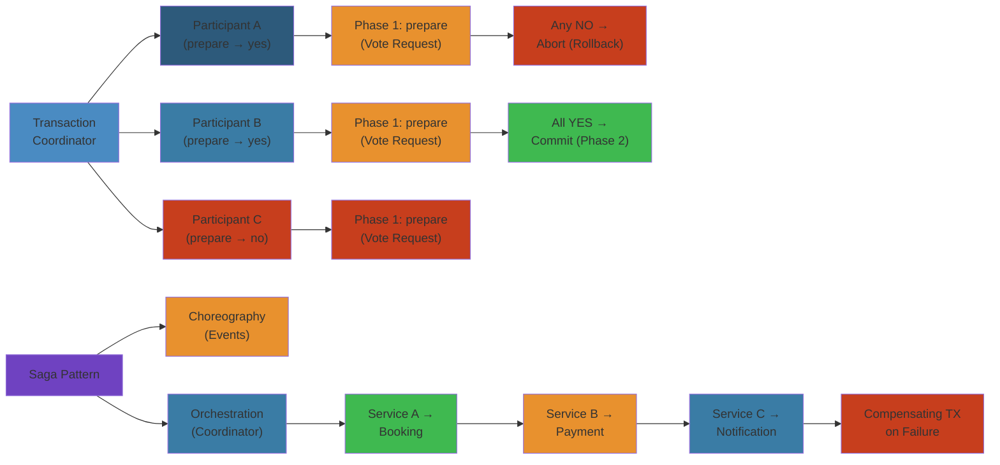

# 💰 Distributed Transactions — Complete Deep Dive

> **Scope**: Two-Phase Commit (2PC) protocol and failure modes, Three-Phase Commit (3PC) non-blocking properties, Saga patterns (choreography vs orchestration), XA specification and Java transactions (JTA, JDBC XADataSource), TCC (Try-Confirm-Cancel), Outbox pattern with CDC (Debezium, Kafka Connect), practical pattern selection guide.




## Table of Contents


1. Two-Phase Commit (2PC)
2. 2PC Failure Modes
3. Three-Phase Commit (3PC)
4. Saga: Choreography Pattern
5. Saga: Orchestration Pattern
6. XA Transactions & JTA
7. TCC: Try-Confirm-Cancel
8. Outbox Pattern & CDC
9. Distributed Transaction Pattern Guide

---

## 1. Two-Phase Commit (2PC)


```text
Phase 1: PREPARE                     Phase 2: COMMIT/ABORT

Coordinator         Participants     Coordinator         Participants
    |                    |               |                    |
    |-- prepare -------->|               |-- commit --------->|
    |<-- ready/abort ----|               |<-- ack ------------|
    |-- prepare -------->|               |-- commit --------->|
    |<-- ready/abort ----|               |<-- ack ------------|
    | commit point       |               |                    |
```

**Phase 1 — Prepare:** Coordinator sends `prepare`. Participants acquire locks, write prepare log, respond `ready` or `abort`.

**Phase 2 — Commit/Abort:** If all `ready`, coordinator logs commit, sends `commit`. If any `abort`, coordinator logs abort, sends `abort`.

**Commit Point:** The instant coordinator decides. After this, outcome is fixed.

**Doubt Period:** Phase between prepare and commit/abort. Participants hold locks, uncertain of outcome.

```sql
-- Participant prepare log
INSERT INTO tx_log (tx_id, state, data) VALUES ('txn-123', 'PREPARED', 'serialized_changes');
-- Coordinator decision log
INSERT INTO tx_log (tx_id, state) VALUES ('txn-123', 'COMMITTED');
```

---

## 2. 2PC Failure Modes


**Coordinator Crash in Phase 1:** Participants hold locks, blocked until coordinator recovers.

**Coordinator Crash After Decision:** Some participants committed, some missed decision. Recovery resolves on restart.

```text
In-Doubt Transaction:
  Participant A: PREPARED (locks held)
  Coordinator: CRASHED (decision unknown)
  
  Participants blocked indefinitely until coordinator recovers.
  
Heuristic Commit/Abort: unilateral decision by participant.
  DANGEROUS — can violate atomicity.
  Heuristic mix: some commit, some abort → data inconsistency.
```

2PC is **blocking**. Prepared participants wait indefinitely for coordinator recovery.

---

## 3. Three-Phase Commit (3PC)


3PC adds a timeout-based phase to avoid blocking.

```text
Phase 1: canCommit          Phase 2: preCommit        Phase 3: doCommit
Coordinator                 Coordinator               Coordinator
    |                           |                          |
    |-- canCommit ------------->|                          |
    |<-- yes -------------------|-- preCommit ------------>|-- doCommit --->
    |                           |<-- ack ------------------|<-- ack --------
    |-- canCommit ------------->|-- preCommit ------------>|-- doCommit --->
    |<-- yes -------------------|<-- ack ------------------|<-- ack --------
    | commit point              |                          |
```

**Differences from 2PC:**
1. **canCommit:** Probe without locks.
2. **preCommit:** Prepare and acknowledge. Commit point is after all preCommit acks.
3. **doCommit:** Actual commit. Participants commit on receipt, abort on timeout.

**Non-Blocking:** If coordinator fails during preCommit, participants time out and abort. If during doCommit, they time out and commit.

**Limitation:** Assumes eventual synchrony. True async networks can still violate atomicity.

---

## 4. Saga: Choreography Pattern


Saga: long-lived business transaction decomposed into local transactions with compensating actions.

```text
Step 1: Order Service → publishes "OrderCreated"
                ↓
Step 2: Payment Service → processes payment → publishes "PaymentProcessed"
                ↓
Step 3: Inventory → reserves → publishes "InventoryReserved"
                ↓
Step 4: Shipping → schedules → "ShipmentScheduled"

Compensation (on any failure):
  Step N fails → publish failure event
  Each prior step has a compensating handler
  e.g., PaymentFailed → RefundPayment, InventoryFailed → ReleaseReservation
```

```text
+-----------+    OrderCreated    +-----------+  PaymentProcessed  +-----------+
|   Order   | -----------------> |  Payment  | -----------------> | Inventory |
+-----------+ <----------------- +-----------+                   +-----------+
               OrderCancelled                    InventoryFailed
                        |                              |
                        v                              v
                  RefundPayment              ReleaseInventory
```

**Compensation:** Application-level rollback. Unlike 2PC, compensation is eventual and application-specific.

**Pros:** No coordinator, loose coupling. **Cons:** Hard to trace, cycles possible.

```java
// Choreography Saga — Event Handler
@Component
public class OrderSagaHandler {
    @EventListener
    public void onPaymentProcessed(PaymentProcessedEvent e) {
        reserveInventory(e.getOrderId());
    }
    @EventListener
    public void onPaymentFailed(PaymentFailedEvent e) {
        cancelOrder(e.getOrderId());
    }
    @EventListener
    public void onInventoryFailed(InventoryFailedEvent e) {
        publishRefund(e.getOrderId());  // compensation
    }
}
```

---

## 5. Saga: Orchestration Pattern


**Orchestrator (Saga Execution Coordinator):** Central state machine that tells each participant what to do.

```text
                    +-------------------+
                    |  Saga Orchestrator |
                    |  (state machine)  |
                    +--------+----------+
                           /|\
              doOrder() /  |  \ compensate()
                      v    |   v
               +-----------+ | +-----------+
               |  Order    | | |  Payment  |  (and so on for each step)
               +-----------+ | +-----------+
```

```python
class SagaOrchestrator:
    def execute_saga(self, saga_id, steps):
        self.log[saga_id] = {"step": 0, "state": "STARTED"}
        for i, step in enumerate(steps):
            try:
                step.execute()
                self.log[saga_id]["step"] = i
            except Exception:
                self._compensate(saga_id, steps[:i])
                return False
        self.log[saga_id]["state"] = "COMPLETED"
        return True

    def _compensate(self, saga_id, steps):
        for step in reversed(steps):
            step.compensate()  # reverse order
```

**Pros:** Centralized flow, easy to trace. **Cons:** Orchestrator single point of failure.

**Isolation Countermeasure:** Since saga lacks ACID isolation, steps might see intermediate states. Use semantic locks (reservation fields), reread before update, idempotent handlers.

---

## 6. XA Transactions & JTA


**X/Open XA Standard:** Distributed transaction coordination across multiple resource managers.

```text
+-------------------+          +-------------------+
| Transaction       |          | Resource Manager  |
| Manager (TM)      |<---XA--->| (RM) — DB, Queue  |
| - coordinates XA  |          | - manages resources|
+-------------------+          +-------------------+
```

**XA Interface:**

| Method | Description |
|--------|-------------|
| `xa_start` | Associate XID with current work |
| `xa_end` | Disassociate XID |
| `xa_prepare` | Phase 1 — prepare for commit |
| `xa_commit` | Phase 2 — commit prepared |
| `xa_rollback` | Abort prepared transaction |
| `xa_recover` | List prepared transactions |

```java
// XA via JDBC
XADataSource xaDS = new OracleXADataSource();
xaDS.setURL("jdbc:oracle:thin:@db-host:1521:ORCL");
XAConnection xaConn = xaDS.getXAConnection();
XAResource xaRes = xaConn.getXAResource();
Xid xid = new XidImpl(123, new byte[]{0x01}, new byte[]{0x01});

xaRes.start(xid, XAResource.TMNOFLAGS);
// ... SQL operations ...
xaRes.end(xid, XAResource.TMSUCCESS);
xaRes.prepare(xid);
xaRes.commit(xid, false);
```

**JTA (Java Transaction API):**
- `UserTransaction`: `begin()`, `commit()`, `rollback()` — simple application interface.
- `TransactionManager`: For application servers — `suspend()`, `resume()`, `setTransactionTimeout()`.

**Heuristics:** `XA_HEURCOM` (committed), `XA_HEURRB` (rolled back), `XA_HEURMIX` (mixed outcome).

---

## 7. TCC: Try-Confirm-Cancel


Three-phase protocol for resource reservation.

```text
PHASE 1: TRY (Reserve)
  Payment: Reserve $100 → "Reservation-123"
  Inventory: Reserve SKU-456 → "Hold-789"
  Shipping: Reserve slot → "Slot-ABC"

PHASE 2: CONFIRM or CANCEL
  All TRY succeed → confirm each (make permanent, idempotent)
  Any TRY fails → cancel each (release, idempotent)
```

```java
public interface PaymentTccService {
    String tryReserve(String accountId, double amount);
    boolean confirm(String reservationId);  // idempotent
    boolean cancel(String reservationId);   // idempotent
}
```

**TCC vs 2PC:**

| Aspect | TCC | 2PC |
|--------|-----|-----|
| Coordination | Application-level | Infrastructure (TM) |
| Lock Duration | Short (TRY reserves) | Long (full locks) |
| Blocking | Non-blocking | Blocking |
| Consistency | Eventual | Strong |
| Use Case | Long-lived business txns | Short ACID txns |

---

## 8. Outbox Pattern & CDC


Write domain event in the same DB transaction as the business change. Separate process publishes events reliably.

```sql
CREATE TABLE outbox (
    id              UUID PRIMARY KEY,
    aggregate_type  VARCHAR(100),
    event_type      VARCHAR(255),
    payload         JSONB,
    created_at      TIMESTAMP DEFAULT NOW(),
    published_at    TIMESTAMP
);
```

**Polling Publisher:**
```python
class OutboxPoller:
    def poll(self):
        records = self.db.fetch(
            "SELECT * FROM outbox WHERE published_at IS NULL "
            "ORDER BY created_at LIMIT 100 FOR UPDATE SKIP LOCKED")
        for record in records:
            self.broker.publish(record.event_type, record.payload)
            self.db.execute("UPDATE outbox SET published_at = NOW() WHERE id = %s", [record.id])
```

**CDC (Change Data Capture) with Debezium:**
```text
Application              PostgreSQL                      Kafka
    |                        |                             |
    |-- INSERT INTO outbox ->|                             |
    |                        |-- WAL write                 |
    |                        |  Debezium reads WAL         |
    |                        |------->Kafka Topic--------->|
    |                        |        "outbox.event"       |
```

Debezium reads PostgreSQL WAL, streams changes to Kafka via Kafka Connect. Avoids polling.

**Exactly-Once:** Consumer checks dedup table (`event_id` already processed?) before processing.

---

## 9. Distributed Transaction Pattern Guide


| Requirement | Best Pattern | Why |
|---|---|---|
| Strong ACID across DBs | 2PC | Synchronous, atomic |
| Non-blocking commit | 3PC | Timeout-based, no indefinite locks |
| Long-lived business flow | Saga | Compensation, eventual |
| Resource reservation | TCC | Short locks, reservation pattern |
| Reliable event publication | Outbox + CDC | Exactly-once delivery |

```text
Consistency Strength:
  STRONG <-------------------------------------------------> WEAK
  2PC ----- 3PC --------- TCC -------- Saga ------------- Choreography

Latency / Scalability:
  LOW (blocking) <----------------------------------------> HIGH (async)
  2PC ----- XA ------ TCC ------ Outbox/CDB ------ Saga (choreographed)
```

---

## Simplest Mental Model


**2PC is like asking everyone to promise before telling them to go — if anyone says no, nobody moves.** Everyone waits until they hear the final decision. **Saga is the opposite:** do each step, and if one fails, run cleanup for the ones that succeeded. **Outbox ensures events aren't lost** by writing them in the same DB transaction as the business change. Pick 2PC for strict atomicity; Saga for long-running flows where perfect consistency isn't required.


## Practical Example


See code examples above for practical usage patterns.

## Production Failure Modes


### Failure 1: Coordinator Crash During 2PC — Orphaned Resources


| Aspect | Detail |
|--------|--------|
| **Symptoms** | Database locks held indefinitely. Resources not released. Application performance degrades. Backlog of blocked transactions grows |
| **Root Cause** | Transaction coordinator crashes after Phase 1 prepare but before Phase 2 commit/abort. Participants are in prepared state, holding locks indefinitely. Coordinator recovery may not restore transaction state |
| **Detection** | PostgreSQL: `pg_locks` shows many `AccessExclusiveLock` held for hours. `pg_prepared_xacts` shows prepared transactions staying around. Coordinator logs: crash with no recovery for in-flight transactions |
| **Recovery** | Manually review prepared transactions: `SELECT * FROM pg_prepared_xacts`. Choose to commit or rollback based on business context. Restart coordinator with recovery log (WAL-based recovery). For XA, use `xa_recover()` to list in-doubt transactions |
| **Prevention** | Use coordinator with persistent log (transaction table in DB or WAL). Implement timeout: participants auto-abort after `transaction_timeout` if no coordinator decision received. Use Saga instead of 2PC for long-running transactions |

### Failure 2: Saga Compensation Failure — Partial Success Can't Be Undone


| Aspect | Detail |
|--------|--------|
| **Symptoms** | Saga partially completes. Compensating transaction fails (hotel cancellation API down). System in inconsistent state: payment charged but booking not confirmed. Customer support handles manually |
| **Root Cause** | Compensating action is a real API call that can fail. Saga assumes compensation always works. In practice: hotel booking API is down, email service sends wrong template, partial refund not possible |
| **Detection** | Saga log shows: `step 3: payment.processed`, `step 4: booking.failed`, `step 4: compensation.booking-cancellation.failed`. Dashboard: `saga_failed_compensations` counter increments |
| **Recovery** | Manual compensation via admin tool. Re-run saga from step 4. Contact customer support to cancel payment. Use dead-letter queue for failed compensations |
| **Prevention** | Implement retry with exponential backoff for compensations. Design idempotent compensations (cancelling an already-cancelled booking is safe). Add timeout: after 10 retry failures, escalate to manual intervention. Use saga log (event store) to determine exact compensation actions needed |

### Failure 3: Outbox Polling Data Loss


| Aspect | Detail |
|--------|--------|
| **Symptoms** | Events never published. Consumer waits indefinitely. Data inconsistent across services. No errors in application logs |
| **Root Cause** | Outbox poller reads `published_at IS NULL` rows. Between read and mark-as-published, application crashes. Same rows processed again but some already sent — duplicates or loss depending on poller implementation. Most dangerous: poller marks published without confirming message broker accepted |
| **Detection** | Outbox table shows >1000 rows where `published_at IS NULL` and `created_at` > 1 hour ago. Message broker (Kafka/SQS) shows fewer messages than outbox rows. Consumer expected event that never arrived |
| **Recovery** | Republish all unprocessed outbox rows with idempotency keys. Verify message counts match outbox rows. Add monitoring: CloudWatch alarm on `outbox_unprocessed_count > 100` |
| **Prevention** | Use Debezium CDC instead of polling: reads WAL directly, guaranteed capture. For polling, use `FOR UPDATE SKIP LOCKED` to avoid duplicate reads. Use transactional outbox: write event + mark published in same DB transaction. Add dead-letter table for events that exceed max retries |

### Failure 4: TCC Cancel Called Without Try


| Aspect | Detail |
|--------|--------|
| **Symptoms** | Negative inventory. Duplicate payments. System reports reserved resources that were never confirmed or cancelled |
| **Root Cause** | TCC Cancel called for a transaction where Try was never executed. Race condition: timeout fires cancel before Try completes. Or network partition: Try succeeds, response lost, coordinator thinks Try failed and calls Cancel |
| **Detection** | Logs show Cancel for transaction id without preceding Try. Inventory shows negative reserved count. Payment gateway shows two records: one complete (from Try) and one void (from Cancel) |
| **Recovery** | Implement idempotent Cancel that is safe to call without Try. In TCC, Cancel must handle the case where Try didn't happen. Use transaction_id to check if Try occurred before Cancel actions |
| **Prevention** | TCC Cancel and Confirm must be idempotent. Use transaction_id as key for dedup. Delay Cancel invocation: add 5-second grace period before sending Cancel. Use AT-least-once delivery for Cancel with dedup |

### Failure 5: XA Transaction Timeout Mismatch


| Aspect | Detail |
|--------|--------|
| **Symptoms** | Local transaction commits, but global transaction times out and rolls back. Data committed locally cannot be rolled back. Inconsistency between databases |
| **Root Cause** | XA transaction timeout is too short. Participant A finishes preparation quickly (100ms), but participant B takes 30s due to lock contention. Global timeout is 10s. Coordinator aborts, but participant A already committed local transaction |
| **Detection** | Application error: `XAER_RMERR` or `XA_RBTIMEOUT`. Transaction manager logs: `global_transaction_timeout exceeded`. Participant A shows committed transaction, participant B shows rolled back |
| **Recovery** | Identify inconsistency: compare participant A's latest record with participant B's. Manual reconciliation. Increase transaction timeout. Use one-phase commit optimization (1PC) for single-participant transactions |
| **Prevention** | Set XA timeout > max expected processing time for all participants. Use distributed tracing to measure actual participant durations. Implement heuristics: if participants disagree after timeout, escalate to manual reconciliation. Prefer Saga over XA for multi-service transactions |

## Edge Cases


| Scenario | Challenge | Solution |
|----------|-----------|----------|
| **Network partition during 2PC** | Coordinator can't reach participants after prepare | Participants timeout and abort automatically. Use `max_prepared_transactions` limit to prevent resource exhaustion |
| **Saga event ordering** | Compensation event received before commit event | Use event versioning. Discard out-of-order events based on saga_id + step sequence. Kafka partition per saga_id ensures ordering |
| **CDC replication lag** | Debezium reads WAL, but event arrives at consumer minutes later | Monitor `source.ts_ms` in Debezium events. Alert if lag > 5s. Increase `poll.interval.ms` |
| **TCC resource locking duration** | Resources locked between Try and Confirm/Cancel | Set lock timeout: release after 30s if no Confirm/Cancel. Use optimistic concurrency instead of pessimistic locks |
| **Distributed ID collision** | Snowflake ID collisions across regions | Use region ID in worker ID bits. Test collision probability with >1B IDs per second |

## Interview Questions


### Q1 (Beginner): What is the difference between 2PC and Saga?


**Answer**: 2PC (Two-Phase Commit) is a synchronous, blocking protocol: Phase 1 asks all participants to prepare (vote), Phase 2 commits if all voted yes. Participants hold locks during prepare. If the coordinator crashes, participants are stuck with locks held. Saga is an asynchronous, compensating pattern: each step in a saga has a compensating action. If step 3 fails, the saga runs compensation for steps 2 and 1. Sagas don't hold locks between steps — each step commits its work immediately. 2PC is ACID (atomic, consistent), Sagas are BASE (basically available, soft state, eventually consistent). Use 2PC when consistency is critical and participants are fast (same data center). Use Saga when transactions are long-lived or span services.

### Q2 (Mid-Level): Design the Outbox Pattern for a payment service that needs to publish events to Kafka.


**Answer**: On payment creation, the service does: (1) BEGIN TRANSACTION. (2) INSERT INTO payments (id, amount, status). (3) INSERT INTO outbox (event_id, aggregate_type, aggregate_id, event_type, payload, created_at). (4) COMMIT. A separate poller/Debezium reads the outbox table and publishes to Kafka. Debezium approach: uses PostgreSQL WAL (logical replication slot). When the outbox row is committed, Debezium captures the change. Kafka Connect sinks the change to a Kafka topic. This guarantees exactly-once capture: DB commit and outbox write are atomic (same transaction). Consumer receives the event and processes it. Consumer acknowledges: offset commit or at-least-once delivery. For exactly-once delivery to consumer, use idempotent processing: consumer tracks processed event_ids in a dedup table. Outbox table is compacted (DELETE old rows) to prevent unbounded growth. TTL: clean up rows older than 7 days.

### Q3 (Senior): How does Spanner achieve external consistency (linearizability) across global data centers?


**Answer**: Spanner uses TrueTime, a synchronized clock API backed by GPS and atomic clocks. TrueTime returns an interval [earliest, latest] — the true time is guaranteed to be within this interval. The interval is typically < 10ms. For a write, Spanner assigns a timestamp TT.now().latest (end of the TrueTime interval). For a read, Spanner ensures it reads at a timestamp >= TT.now().latest, guaranteeing it sees all writes committed before the read. This eliminates the "stale read" problem. For distributed transactions across regions, Spanner uses two-phase commit with leader leases and Paxos for each tablet. The commit timestamp is chosen using TrueTime to ensure causality: if transaction A happens-before transaction B, A's timestamp < B's timestamp. This gives external consistency (linearizability). Spanner is CP in the CAP theorem — it prioritizes consistency over availability during partitions. Latency: cross-region writes take 50-500ms depending on distance (RTT + Paxos). Reads from nearest replica can be fast (<10ms) if stale reads are acceptable.

### Q4 (Staff): Compare TCC, Saga, and 2PC for a travel booking system (flight + hotel + car rental).


**Answer**: 2PC: Atomic, consistent, blocking. If the coordinator crashes after flight is booked, hotel and car are stuck in prepared state. All services must support XA. Lock contention could be hours. Not suitable for across-service transactions. TCC (Try-Confirm-Cancel): Each service exposes three endpoints: Try (reserve resource), Confirm (use it), Cancel (release). Try reserves the seat/room/car temporarily. Cancel releases if booking fails. Confirm finalizes when all Try succeed. TCC requires services to support reservation semantics (flight can hold a seat for 30 min). Good for short-lived resource reservations. Saga (choreography): Each service publishes events on completion. If hotel booking fails, flight service gets event and cancels flight. Compensation for each step. Best for multi-hour booking flows. Recommendation: Use TCC for the synchronous booking flow (all reservations held during user checkout), or Saga for async booking flow (email confirmation later). Never use 2PC across services. Use orchestrator Saga: one coordinator calls each service, knows the full flow, handles compensation. Easier to monitor and test. Consider CTM (Compensating Transaction Manager) from Java EE or Axon Framework.

### Q5 (Principal): Design a distributed transaction protocol that achieves serializability without 2PC blocking.


**Answer**: Use Percolator (Google's protocol, used by TiDB). Percolator achieves ACID transactions across a distributed KV store without blocking coordinators. Key insight: use a distributed timestamp oracle (TSO) for monotonic timestamps, and a lock table stored alongside data. Transaction flow: (1) Read phase: read data + lock status. If lock exists, wait or clean stale lock. (2) Prewrite: write data to primary key with lock, write to secondary keys with pointers to primary. (3) Commit: write a write record at primary key's timestamp, release primary lock. Secondary locks cleaned asynchronously. Prewrite phase uses optimistic locking: if no lock conflict, proceed. If conflict, abort and retry. No locks are held across multiple participants simultaneously. The coordinator doesn't stay in critical path after prewrite. Conflict resolution: if a read encounters a lock, it checks if the lock's primary has been committed. If yes, the lock owner crashed, so the reader cleans up and retries. This is non-blocking because the reader never waits for the coordinator — it either finds committed data or cleans up stale locks. Scalability: TSO generates 2M timestamps/sec. Percolator used by Google F1 (ad serving DB) and TiDB. Tradeoff: Percolator requires a monotonic timestamp service (single point of failure without replication), and conflict resolution can cause cascading retries at high contention. Alternative: Calvin (FaunaDB) uses deterministic ordering of all transactions before execution — eliminates conflicts entirely but requires all participants to process transactions in same order.

## Cross-References


- [Distributed Storage](../03-distributed-storage.md) — Consistent hashing, quorum replication, gossip
- [Stream Processing](../04-stream-processing.md) — Event-time processing, exactly-once, watermarks
- [PostgreSQL Architecture](../../08-databases/02-postgresql-architecture.md) — MVCC, isolation levels, deadlock detection
- [Database Internals](../../08-databases/01-db-internals.md) — B-tree concurrency, WAL, ARIES recovery
- [Backend Roadmap](../../21-roadmaps/01-backend-engineer.md) — Phase 3 distributed systems, Phase 4 consistency models

## Related

- [Postgresql Internals](08-databases/01-postgresql-internals.md)
- [Relational Database Internals](08-databases/01-relational-database-internals.md)
- [Postgresql Architecture](08-databases/02-postgresql-architecture.md)
- [Redis Internals](08-databases/02-redis-internals.md)
- [Postgresql Troubleshooting Tuning](08-databases/03-postgresql-troubleshooting-tuning.md)
- [Redis Deep Dive](08-databases/04-redis-deep-dive.md)
