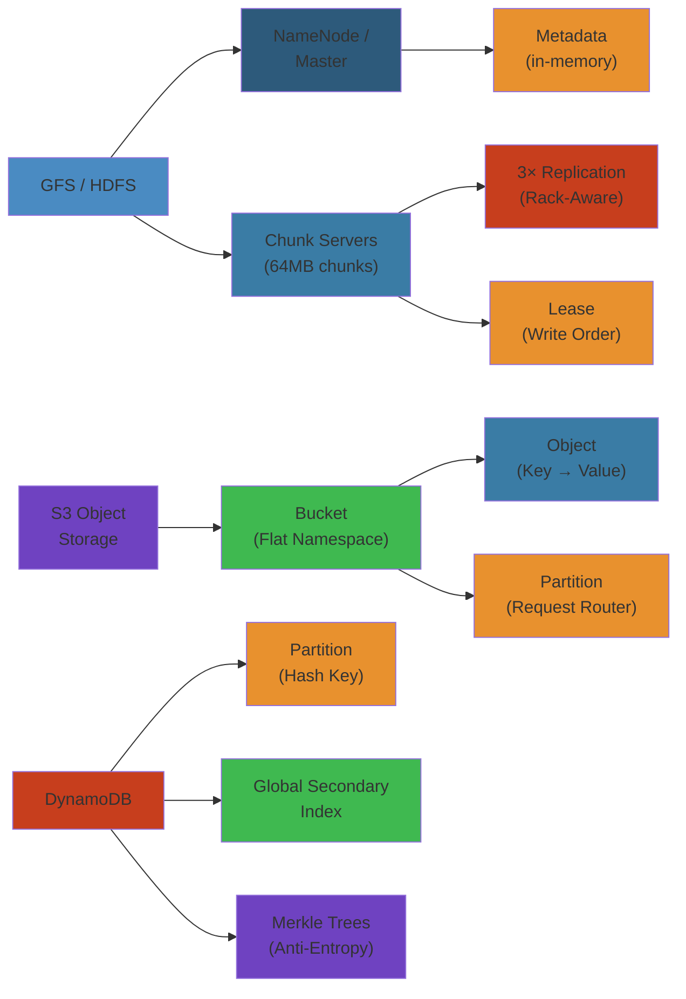

# 💾 Distributed Storage Systems — Complete Deep Dive

> **Scope**: GFS/HDFS (architecture, leases, NameNode HA, federation, erasure coding), Ceph (RADOS, CRUSH algorithm, RBD, CephFS), S3 (architecture, consistency, storage classes), DynamoDB (partitioning, GSI/LSI, adaptive capacity, Merkle trees), FoundationDB (SSI, multi-key transactions, layers), TiKV (Raft-based, PD, RocksDB), CockroachDB (range, leaseholder, geo-partitioning), InfluxDB (TSM engine), TimescaleDB (hypertable, compression).




## Table of Contents


1. GFS / HDFS Architecture
2. HDFS: HA, Federation, Erasure Coding
3. Ceph: RADOS & CRUSH
4. S3 Object Storage
5. DynamoDB Internals
6. FoundationDB & TiKV
7. Distributed SQL: CockroachDB & YugabyteDB
8. Time Series: InfluxDB & TimescaleDB

---

## 1. GFS / HDFS Architecture


```text
+------------------+        Client
|    Master        |<------->| (metadata ops)
| - file namespace |         |
| - chunk locations|         | (data ops, direct to chunkserver)
| - leases / rep   |         v
+------------------+   +-----------+
       | metadata      | ChunkServer| (64MB chunks on disk)
       | (periodic)    +-----------+
       v                |  |  |
+------------------+   +-----------+
|   ChunkServer    |   | ChunkServer|
| - 64MB chunks   |   | - 3x rep   |
| - checksum check |   | - append   |
+------------------+   +-----------+
```

**Chunk Size:** 64 MB — reduces metadata, improves sequential throughput.

**Write Path:** Client requests chunk lease from master → writes to primary replica → primary chains to secondaries.

**Master Metadata (in-memory):** File namespace, file-to-chunk mapping, chunk locations (reported by chunkservers).

**Chunk Leases:** Master grants lease to one replica (primary) for serializing writes. On primary failure, lease expires, master assigns new primary.

**Garbage Collection:** Chunks marked deleted by master; chunkservers delete lazily during periodic scan.

---

## 2. HDFS: HA, Federation, Erasure Coding


**NameNode HA:**
```text
Active NN   Standby NN
    |           |
    |-- edit log via QJM --> JN1, JN2, JN3 (Paxos-based consensus)
    |
  serves reads      watches edits, applies to memory
```

**QJM (Quorum Journal Manager):** Edit log replicated to 3 or 5 JournalNodes. Ensures no split-brain.

**Federation:** Multiple independent NameNodes managing separate namespace volumes. Increases metadata throughput.

**Erasure Coding:** Replaces 3x replication (200% overhead) with Reed-Solomon.

```
RS-6-3: 6 data + 3 parity = 9 total. Tolerates 3 failures. 50% overhead.
RS-3-2: 3 data + 2 parity = 5 total. Tolerates 2 failures. 67% overhead.
```

EC trades CPU for storage efficiency. Better for cold data; replication better for hot data.

---

## 3. Ceph: RADOS & CRUSH


**RADOS (Reliable Autonomic Distributed Object Store):** Self-healing, self-managing object store.

```text
+---------------------------------------------------+
|                  RADOS Cluster                     |
|  +------+  +------+  +------+   +------+          |
|  | OSD  |  | OSD  |  | OSD  |   | MON  | (cluster |
|  |(disk)|  |(disk)|  |(disk)|   |      |  map)    |
|  +------+  +------+  +------+   +------+          |
|  +------+                                         |
|  | MDS  |  (CephFS metadata, optional)             |
|  +------+                                         |
+---------------------------------------------------+
```

**Components:**
- **OSD:** Stores data on disk. Handles replication, recovery, rebalancing.
- **MON:** Maintains cluster map via Paxos.
- **MGR:** Metrics, dashboard, balancer.
- **MDS:** File metadata for CephFS.

**CRUSH Algorithm:** Instead of a lookup table, compute data location from the object ID.

```text
CRUSH Map:
  root
   ├── dc-1
   │   ├── rack-1: host-a(osd.0, osd.1), host-b(osd.2)
   │   └── rack-2: host-c(osd.3, osd.4)
   └── dc-2
       └── ...
```

```python
def crush_placement(object_id, replicas, crush_map):
    osds = []
    for i in range(replicas):
        osd = select_osd(hash(object_id), i, crush_map)
        osds.append(osd)
    return osds
```

**Bucket types:** Uniform (equal weights), List (linear), Tree (binary search), Straw (proportional weight).

**RBD:** Block device on top of RADOS. **CephFS:** POSIX filesystem via MDS + RADOS.

---

## 4. S3 Object Storage


```text
Client (REST HTTP)
    |
    v
Request Router (DNS bucket → partition)
    |
    v
Metadata Store (Paxos, bucket + object index)
    |
    v
Storage Nodes (replicated or EC across AZs)
```

**DNS Naming:** `bucket.s3.region.amazonaws.com/key` → routed by bucket name hash.

**Multi-Part Upload:** For objects > 5GB. Upload parts in parallel, then complete.

```python
s3 = boto3.client('s3')
upload = s3.create_multipart_upload(Bucket='b', Key='large.zip')
parts = []
for i, chunk in enumerate(chunks):
    part = s3.upload_part(Bucket='b', Key='large.zip',
                          UploadId=upload['UploadId'],
                          PartNumber=i+1, Body=chunk)
    parts.append({'ETag': part['ETag'], 'PartNumber': i+1})
s3.complete_multipart_upload(Bucket='b', Key='large.zip',
    UploadId=upload['UploadId'],
    MultipartUpload={'Parts': parts})
```

**Consistency:** Read-after-write for new PUTs (Dec 2020+). Eventual for overwrite and DELETE. List eventually consistent.

**Storage Classes:** STANDARD, INTELLIGENT_TIERING, STANDARD_IA (30d min), ONEZONE_IA, GLACIER (min/hours retrieval), DEEP_ARCHIVE (12h).

---

## 5. DynamoDB Internals


```text
Table: my-table (hash: PK, sort: SK, 1000 RCU / 500 WCU)
    |
    +-- Partition 1 (hash range xxxx-a): [Leader + 2 replicas]
    +-- Partition 2 (hash range a-ffff): [Leader + 2 replicas]
```

**Hash Partitioning:** Items distributed by hash of partition key. 10 GB max per partition.

**GSI (Global Secondary Index):** Separate table with own partitions. Eventually consistent by default.

**LSI (Local Secondary Index):** Same partition, different sort key. Strongly consistent.

**Adaptive Capacity:** Auto-splits hot partitions. No manual repartitioning needed.

**Hot Partition:** High traffic on one key. Mitigate with write sharding + aggregate reads.

```python
def put_sharded(table, item, shards=10):
    shard = random.randint(0, shards - 1)
    item['PK'] = {'S': f"{item['PK']['S']}#{shard}"}
    dynamodb.put_item(TableName=table, Item=item)
```

**Merkle Trees for Anti-Entropy:** Nodes gossip by comparing Merkle root hashes. Recurse on mismatch → sync divergent leaves.

**Throughput:** Per-partition = table throughput / partitions. Burst capacity up to 5 minutes.

---

## 6. FoundationDB & TiKV


**FoundationDB (FDB):** Distributed KV with strict serializability and multi-key transactions.

```text
Client → Proxy (batching) → Master (version/commit ordering)
    → Resolvers (conflict detection) → Storage Servers
```

**SSI (Serializable Snapshot Isolation):** Read from snapshot timestamp. On commit, resolver checks write-set vs concurrent read-sets. Conflict → abort.

**Multi-Key Transactions:** Atomic across any keys. Optimistic concurrency (no locks).

**Deterministic Simulation:** FDB tests itself via deterministic simulation — every timing/failure decision is controlled. Catches unreproducible races.

**Layers:** SQL, Document, Graph layers on top of core KV.

**TiKV:** Distributed KV using Raft per Region (~96MB range).

```text
PD (Placement Driver) — timestamps, region placement, balancing
    |
    v
TiKV-1 (Raft group leader for Region 1)  TiKV-2 (follower)  TiKV-3 (follower)
```

**RocksDB:** Local storage engine (LSM-tree). MVCC via timestamps.

**Coprocessor:** Pushdown computation (filter, aggregate) to TiKV.

---

## 7. Distributed SQL: CockroachDB & YugabyteDB


**CockroachDB:**

```text
Node 1 (Range 1 leaseholder)    Node 2 (Range 2 leaseholder)
Node 3 (Range 3 leaseholder)    Node 4 (Range 4 leaseholder)
```

**Range:** 512 MB key span with Raft group (3-5 replicas). **Leaseholder:** Handles reads, coordinates writes.

**Distributed SQL:** Gateway node plans query, pushes computation to leaseholders.

**Geo-Partitioning:** Pin partitions to regions via Zone Configs.

```sql
ALTER PARTITION us_east OF TABLE users
    CONFIGURE ZONE USING constraints = '[+region=us-east-1]',
    num_replicas = 3;
```

**YugabyteDB:** YB-Master (catalog, tablet placement), YB-TServer (DocDB on RocksDB, Raft per tablet). Cosmos-level consistency via distributed transactions.

---

## 8. Time Series: InfluxDB & TimescaleDB


**InfluxDB (TSM — Time-Structured Merge Tree):**

```text
Write Path: Points → WAL → Cache → TSM files (sorted, compressed)

TSM file: [Data Blocks | Index Blocks | Bloom Filter | Index | Footer]
```

**Point:** `measurement,tag=val field=val timestamp`. **Retention Policy:** Auto-delete by age.

**Continuous Query:** Auto-run downsampling. `SELECT MEAN(v) ... GROUP BY time(1h) INTO ...`

**TimescaleDB (PostgreSQL extension):**

```text
Hypertable (user sees one table)
    |
    +-- Chunk 1 (PostgreSQL table, time range 1, device partition 0)
    +-- Chunk 2 (PostgreSQL table, time range 1, device partition 1)
    +-- Chunk 3 (PostgreSQL table, time range 2, device partition 0)
```

**Chunk:** Standard PostgreSQL table for a time interval + optional space partition.

```python
cur.execute("SELECT create_hypertable('sensor_data', 'time', 'device_id', 4)")
cur.execute("INSERT INTO sensor_data VALUES (NOW(), 'sensor-01', 23.5, 65.2)")
```

**Compression:** Columnar per-chunk. Decompresses only requested columns.

**Continuous Aggregate:** Auto-refreshed materialized view. `WITH (timescaledb.continuous)`.

**Data Retention:** `add_retention_policy('sensor_data', INTERVAL '90 days')`.

---

## Simplest Mental Model


**Distributed storage spreads data across machines while making it look like one system.** GFS/HDFS uses a central brain (NameNode) tracking file chunks. Ceph replaces the brain with math (CRUSH — compute location from name). **DynamoDB is a giant hash table** with machines responsible for key ranges. **CockroachDB does the same with SQL** — each range of rows is a tiny Raft group. Pick central metadata for simplicity, CRUSH for scalability, key-value for performance, or distributed SQL for transactions.


---

## Code Examples


```python
import hashlib
import struct

# CRUSH algorithm (simplified) — compute OSD location from object name
def crush_hash(object_name: str, crush_map: dict) -> int:
    h = int(hashlib.md5(object_name.encode()).hexdigest()[:8], 16)
    osds = crush_map['osds']
    return osds[h % len(osds)]

# Raft-consistent distributed put (CockroachDB-style)
class RaftGroup:
    def __init__(self, node_id: int, peers: list):
        self.node_id = node_id
        self.peers = peers  # other nodes in Raft group
        self.log = []
        self.commit_index = 0
        self.current_term = 0

    def propose(self, key: str, value: str) -> bool:
        entry = {'term': self.current_term, 'key': key, 'value': value}
        self.log.append(entry)
        # In real Raft, send AppendEntries to peers, wait for quorum
        acks = sum(1 for p in self.peers if p.receive(entry))
        if acks >= len(self.peers) // 2:  # majority
            self.commit_index = len(self.log) - 1
            return True
        return False

# DynamoDB-style consistent hashing with virtual nodes
class ConsistentHashRing:
    def __init__(self, vnodes_per_node: int = 100):
        self.ring = {}  # hash → node_id
        self.vnodes = vnodes_per_node

    def add_node(self, node_id: str):
        for v in range(self.vnodes):
            h = hashlib.md5(f"{node_id}:{v}".encode()).hexdigest()
            self.ring[h] = node_id

    def get_node(self, key: str) -> str:
        if not self.ring:
            return None
        h = hashlib.md5(key.encode()).hexdigest()
        # Find first node with hash >= key hash (clockwise)
        for ring_hash in sorted(self.ring.keys()):
            if ring_hash >= h:
                return self.ring[ring_hash]
        return self.ring[sorted(self.ring.keys())[0]]  # wrap around

# Erasure coding (Reed-Solomon simplified)
def rs_encode(data: bytes, parity_count: int = 3) -> list:
    # Real RS uses Vandermonde matrix multiplication
    chunks = [data[i::4] for i in range(4)]  # split into 4 data chunks
    for _ in range(parity_count):
        chunks.append(hashlib.sha256(data + str(_).encode()).digest()[:len(chunks[0])])
    return chunks
```

---

## Common Failure Modes


**Problem**: Split-brain in distributed storage using quorum-based consensus

**Root cause**: Network partition splits the cluster into two groups, each believing it has quorum. If both groups accept writes, data diverges. After partition heals, reconciling the divergent data is difficult or impossible. This is why Raft, Paxos, and Zab require strict majority quorum — only one side can form a majority (N/2 + 1).

**Detection**: After network partition resolves, nodes discover conflicting data. Monitoring shows diverging timestamps for the same keys. HDFS NameNode HA with fencing ensures only one active. DynamoDB's last-writer-wins (LWW) silently merges conflicts.

**Solution**: Use consensus protocols with strict quorum (Raft, Paxos). Implement proper fencing for leader election (e.g., HDFS's `zkf` fencing mechanism). For DynamoDB-style AP systems, use last-writer-wins with vector clocks or CRDTs for merge. CockroachDB uses leaseholders with epoch-based leases — if a node can't renew its lease, it steps down. Never use "gossip-only" quorum detection — always have a failure detector with configurable timeout separated by at least one network round-trip.

**Problem**: Read-after-write consistency failure in eventually consistent storage

**Root cause**: In DynamoDB (before Dec 2020) or S3 (before consistency changes), a write to one node is immediately acknowledged, but a subsequent read may hit a different replica that hasn't received the update yet. For overwrite and delete, S3 remained eventually consistent until 2020. This causes issues like "I just uploaded a file and it's not found" or "I updated a config but the next request sees the old value."

**Detection**: Integration tests fail intermittently. CI/CD pipeline that writes then immediately reads fails in <1% of runs. Bug reports of stale data appearing after writes.

**Solution**: Use strongly consistent reads where available (DynamoDB `ConsistentRead: true`, S3 `GetObject` with consistency after Dec 2020 for new PUTs). For overwrites, use conditional writes with version checks. For application-level consistency, write to a transaction log before updating the storage, and have readers read their last-written timestamp. Use read-after-write consistency caches: after writing, invalidate the local cache entry. In Cassandra, use `CL: LOCAL_QUORUM` for both reads and writes to ensure read-your-writes consistency within a DC.

---

## Interview Questions


### Q1: Compare the consistency models of DynamoDB, S3, and CockroachDB — how do they handle concurrent writes?


**Answer**: **DynamoDB** uses last-writer-wins (LWW) with a timestamp — concurrent writes to the same key overwrite each other, with the most recent winning. Strongly consistent reads are available (at half the throughput). **S3** provides read-after-write consistency for new PUTs (objects that didn't exist before) but eventual consistency for overwrite PUTs and DELETEs (unless versioning is used). Concurrent PUTs to the same key: last writer wins. **CockroachDB** provides strict serializability — concurrent writes are serialized through leaseholders using Raft consensus. If two transactions update the same row, one succeeds and the other gets a serialization error (must retry). CockroachDB also detects write-skew anomalies (a form of non-serializable behavior in snapshot isolation). For multi-row transactions, CockroachDB uses a distributed transaction coordinator with parallel commit (fast path). DynamoDB's approach is highest throughput (no coordination), S3's is middle-ground (eventual), CockroachDB's is safest but slowest (consensus per write).

### Q2: How is erasure coding better than replication in distributed storage?


**Answer**: Erasure coding (EC) divides data into K data fragments + M parity fragments, storing them across K+M nodes. Any K fragments can reconstruct the data. Compared to 3x replication (200% overhead), EC-6-3 has 50% overhead (9 fragments instead of 6 data = 50%). EC-10-4 has 40% overhead. This means for the same durability, EC uses 60-75% less storage. The trade-offs: EC requires CPU-intensive computation for encoding/decoding (affects read/write latency). EC is slower for small reads (must read multiple fragments and reconstruct). EC is worse for partial reads (must read entire object to reconstruct). Therefore, use EC for cold/warm data (HDFS, Ceph, S3 Glacier) and replication for hot data. HDFS supports both: 3x replication for active data, EC for archived data. LRC (Locally Repairable Codes) further reduce repair bandwidth by creating local parity fragments.

## Related

- [Postgresql Internals](/08-databases/01-postgresql-internals.md)
- [Relational Database Internals](/08-databases/01-relational-database-internals.md)
- [Postgresql Architecture](/08-databases/02-postgresql-architecture.md)
- [Redis Internals](/08-databases/02-redis-internals.md)
- [Postgresql Troubleshooting Tuning](/08-databases/03-postgresql-troubleshooting-tuning.md)
- [Redis Deep Dive](/08-databases/04-redis-deep-dive.md)
