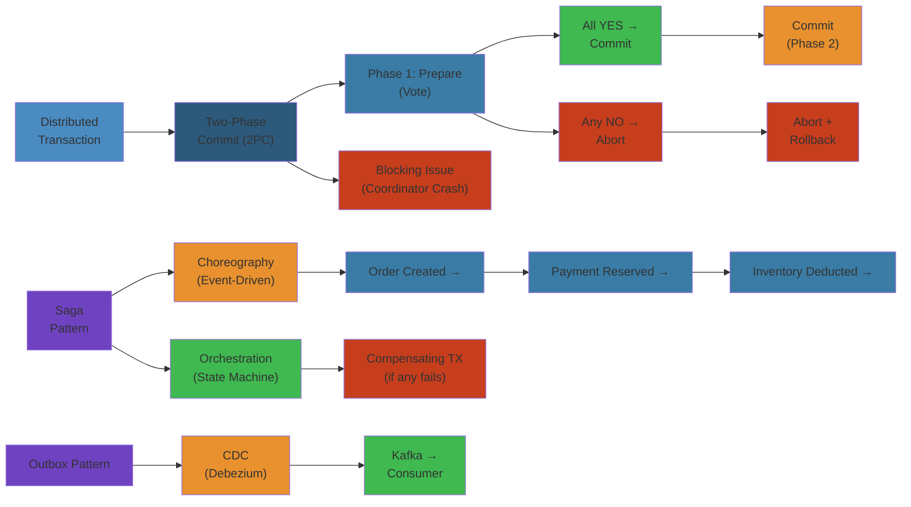

# 🔗 Distributed Transactions — Complete Deep Dive

> **Scope**: ACID in distributed systems, 2PC (prepare/commit phases, failure scenarios, coordinator crash, XA protocol), 3PC (non-blocking variant), Saga pattern (choreography vs orchestration, compensating transactions), TCC (Try-Confirm/Cancel), Seata AT, distributed transaction patterns (outbox, CDC, idempotency key), transactional messaging (Kafka transactions, exactly-once), optimistic concurrency, distributed deadlock detection, real-world implementations (Spanner, CockroachDB, PostgreSQL).
>
> **Related**: [01-cap-consistency.md](./01-cap-consistency.md) | [02-consensus-raft.md](./02-consensus-raft.md) | [05-stream-processing.md](./05-stream-processing.md)




## Table of Contents


1. ACID in Distributed Systems
2. Two-Phase Commit (2PC)
3. 2PC Failure Scenarios
4. Three-Phase Commit (3PC)
5. Saga Pattern
6. TCC (Try-Confirm/Cancel)
7. Seata AT (Automatic Transaction)
8. SAGA vs TCC vs 2PC
9. Distributed Transaction Patterns
10. Transactional Messaging
11. Optimistic Concurrency
12. Distributed Deadlock Detection
13. Real-World Implementations

---

## 1. ACID in Distributed Systems


```text
             ACID
   +----------+----------+
   |     Distributed     |
   |     Challenges      |
   +---------------------+
   | Atomicity: all or   |
   |   nothing across    |
   |   multiple nodes    |
   | Consistency:        |
   |   invariants across  |
   |   shards            |
   | Isolation: txn      |
   |   appears serial    |
   | Durability: commit  |
   |   survives crashes  |
   +---------------------+
```

**Atomicity:** In distributed systems, failure may leave some participants with committed data and others with rolled-back data. Requires coordination protocol (2PC/Saga).

**Consistency:** Referential integrity, unique constraints, check constraints must hold across nodes. Harder with async replication.

**Isolation:** Serializable isolation across shards requires distributed locking or OCC (optimistic concurrency control). Most distributed databases settle for Snapshot Isolation (SI).

**Durability:** Replication provides durability beyond single node. But sync replication has latency cost.

---

## 2. Two-Phase Commit (2PC)


```text
Coordinator                Participant 1             Participant 2
     |                           |                        |
     |======= PREPARE ==========>|                        |
     |<======= VOTE YES ========|                        |
     |======= PREPARE ==============================>    |
     |<======= VOTE YES ==============================   |
     |                           |                        |
     |======= COMMIT ===========>|                        |
     |<======= ACK =============|                        |
     |======= COMMIT ==============================>     |
     |<======= ACK ===================================   |
     |                           |                        |
     (Transaction committed on all)

If any participant votes NO:
     |======= PREPARE ==========>|                        |
     |<======= VOTE NO =========|                        |
     |======= ABORT ============>|                        |
     |======= ABORT ============>|                        |
```

**Phase 1 (Prepare):** Coordinator asks all participants to prepare. Participants write prepare record to log, acquire locks, and respond with vote (YES/NO).

**Phase 2 (Commit/Abort):** If all vote YES, coordinator sends COMMIT. Participants write commit record, release locks, acknowledge. If any NO, coordinator sends ABORT.

**Coordinator Log:** Before sending prepare, coordinator writes "begin commit" log. On prepare responses, writes commit/abort decision. This log enables recovery after crash.

**Blocking Protocol:** During phase 1, participants hold locks. If coordinator crashes after prepare but before commit decision, participants are blocked — they cannot decide whether to commit or abort.

**Performance:** 2 RTT minimum (prepare + commit). Each RPC is synchronous. Scalability suffers beyond ~10-20 participants.

---

## 3. 2PC Failure Scenarios


**Coordinator Crash BEFORE PREPARE:**
- Participants not contacted. No locks held. Normal operation.

**Coordinator Crash AFTER PREPARE (BEFORE DECISION):**
- Participants: have prepared, hold locks, sent YES vote.
- Blocked! Cannot decide commit/abort without coordinator.
- Recovery: new coordinator reads coordinator log. If decision exists, propagate. If not, participants must wait (or timeout heuristic).

**Coordinator Crash AFTER COMMIT:**
- Some participants may not have received COMMIT.
- Recovery: new coordinator reads commit decision from log, re-sends COMMIT to all participants (idempotent — participants ignore duplicate commits).

**Participant Crash AFTER PREPARE:**
- Unable to send PREPARE response. Coordinator times out.
- Coordinator sends ABORT to all other participants.
- Participant (on restart): checks log for prepare record. If prepare but no commit, asks coordinator.

**Participant Crash AFTER COMMIT:**
- Participant missed COMMIT. On restart: finds prepare record. Asks coordinator.
- Coordinator resends COMMIT (idempotent via transaction ID).

**Split-Brain:** Network partition divides participants. Coordinator and some participants on one side. Others on other side. Heuristic decisions needed (e.g., "commit if coordinator side has majority").

**Heuristic Decisions:** Participant independently decides commit/abort after timeout. Dangerous — can cause inconsistency if participant decides opposite of coordinator.

**Timeout Handling:**
- Participant timeout: after prepare, if no decision from coordinator in timeout period, participant calls coordinator. If coordinator unreachable, heuristic decision (usually abort after long timeout).
- Coordinator timeout: after prepare, if participant doesn't respond in time, abort transaction.

**XA Protocol (X/Open XA):**
```text
tm_begin()       -- start transaction
tm_prepare()     -- prepare phase
tm_commit()      -- commit phase
tm_rollback()    -- abort
tm_recover()     -- recover in-doubt transactions

XA interfaces:
  - AP (Application Program): the application
  - TM (Transaction Manager): coordinator
  - RM (Resource Manager): participant (DB, queue)
```

XA is 2PC standardized for heterogeneous resources (DB + queue + cache). Used by Spring `@Transactional`, JTA, Atomikos, Bitronix. Java `javax.transaction.xa.XAResource`.

---

## 4. Three-Phase Commit (3PC)


```text
Coordinator           Participant 1          Participant 2
     |                      |                      |
     |===== PREPARE =======>|                      |
     |<===== YES ==========|                      |
     |===== PREPARE ==========================>   |
     |<===== YES =============================    |
     |                      |                      |
     |===== PRE-COMMIT ====>|                      |
     |<===== ACK ==========|                      |
     |===== PRE-COMMIT =====================>      |
     |<===== ACK =================================|
     |                      |                      |
     |===== COMMIT ========>|                      |
     |<===== ACK ==========|                      |
     |===== COMMIT ==========================>    |
     |<===== ACK =================================|
```

**Phases:**
1. **Prepare (CanCommit):** Can you commit? (Not yet locking). Immediate NO -> abort.
2. **Pre-Commit (PreCommit):** Prepare to commit. Participants lock resources, write prepare log, respond ACK.
3. **Commit (DoCommit):** Commit. Write commit log, release locks.

**Non-Blocking Property:** If coordinator crashes after pre-commit, participants can timeout and commit (since all participants received pre-commit, they know coordinator intended to commit). If coordinator crashes before pre-commit, participants can abort.

**Why 3PC is not widely used:**
- Still susceptible to network partitions (participants may disagree on timeout)
- Requires synchronous clocks (or at least timeout agreement)
- 3 RTTs vs 2PC's 2 RTTs (more latency)
- Practical failure scenarios still require human intervention

---

## 5. Saga Pattern


**Definition (Garcia-Molina & Salem, 1987):** Saga is a sequence of local transactions `T1, T2, ..., Tn` with compensating transactions `C1, C2, ..., Cn`.

```text
Saga State Machine:
            +------+       +------+       +------+
     START--|  T1  |--(ok)-|  T2  |--(ok)-|  T3  |---> COMPLETED
            +------+       +------+       +------+
               | (fail)       | (fail)       |
               v              v              v
              C1             C2             C3
               |              |              |
               v              v              v
             ROLLBACK       ROLLBACK       ROLLBACK
```

**Choreography (Event-driven):**
```text
Order Service        Payment Service     Inventory Service
     |                     |                    |
     |-- Create Order ---->|                    |
     |                     |-- Process Payment ->|
     |<---- Event ---------|<--- Event ----------|
     |                     |                    |
     |  (order created)    |  (payment done)    |  (inventory reserved)
Each service emits events. Next service listens and acts.
Failure: emit compensating event.
```

**Orchestration (Coordinator pattern):**
```text
Saga Execution Coordinator (SEC)
     |                 |                    |
     |-- T1: Order --->|                    |
     |                 |-- T2: Payment ---->|
     |                 |                    |-- T3: Inventory ->
     |<----------------|<-------------------|<-----------------|
     |                 |                    |
Failure: SEC sends compensating commands:
     |                 |-- C2: Refund ----->|
```

**Compensating Actions Requirements:**
- Idempotent (compensation can be retried)
- Inverse of forward action
- May be approximate (cannot fully undo — e.g., sent email cannot be "un-sent")
- Must be available (even if original service is down)

**Saga Execution Coordinator (SEC):** State machine managing saga lifecycle. Commands + events. Saga log for recovery.

**Failure Recovery:**
- **Backward Recovery (compensate):** Roll back completed transactions via compensating actions. Used when retry won't help.
- **Forward Recovery (retry):** Retry failed transaction. Used for transient failures (network blip, timeout).

**Saga Log:** Persistent store of saga state. Enables recovery after SEC crash. Each state transition logged before execution.

---

## 6. TCC (Try-Confirm/Cancel)


**Phases:**
```text
Try Phase:
  - Reserve resources (lock, allocate, hold)
  - If any Try fails, Cancel all successful Trys
  - Resource timeout: auto-release if not confirmed

Confirm Phase:
  - Commit reserved resources (make permanent)
  - Must succeed eventually (idempotent)
  - If Confirm fails: retry

Cancel Phase:
  - Release reserved resources
  - Must succeed eventually (idempotent)
  - Called on any Try failure or business rejection
```

```text
Try Phase:
  Payment Service: reserve $100 (hold authorization)
  Inventory Service: reserve 1 item (allocate in stock)
  Shipping Service: reserve slot

Confirm Phase:
  Payment Service: capture $100 (finalize charge)
  Inventory Service: decrement stock
  Shipping Service: schedule shipment

Cancel Phase:
  Payment Service: release hold
  Inventory Service: release allocation
  Shipping Service: cancel slot
```

**TCC Characteristics:**
- Resource reservation prevents double-spending
- Cancel must be callable at any time after Try
- Confirm and Cancel are guaranteed to be called at least once (idempotency required)

**Used by:** Alibaba Seata, payment systems (reserve before confirm), ticket booking (hold seat, confirm on payment).

**Resource Reservation with Timeout:**
```
Try(Payment): hold $100 on card (auth hold, expires in 7 days)
Try(Inventory): allocate inventory (held for 15 minutes)
If Confirm not received within timeout: Cancel automatically.
```

---

## 7. Seata AT (Automatic Transaction)


**Seata AT (Alibaba):** Automatic transaction mode using global transaction manager + resource manager + undo log.

```text
TM (Transaction Manager)          RM (Resource Manager)
     |                                    |
     |-- Begin Global Transaction ------->|
     |                                    |
     |-- Branch Register (RM1) ---------->|
     |-- Branch Register (RM2) ---------->|
     |                                    |
     |-- Global Commit ------------------>|
     |                                    |
     |-- Send Commit to RM1 ------------->|
     |   RM1: apply changes, delete undo  |
     |-- Send Commit to RM2 ------------->|
     |   RM2: apply changes, delete undo  |
```

**Write Isolation:** Global lock. Before writing, RM acquires global lock on the row. Other transactions cannot modify same row until global transaction completes.

**Read Isolation:** UNDO_LOG visibility. Uncommitted global transactions' changes are hidden via undo log (not visible until commit).

**Undo Log:** Before any data modification, Seata records the before-image in the undo log. On rollback, restore from before-image.

**Branch Transaction:** Each database operation in a global transaction is a branch. TM coordinates branches.

---

## 8. SAGA vs TCC vs 2PC


| Aspect | 2PC | TCC | SAGA |
|--------|-----|-----|------|
| Isolation | Serial (locks held) | Resource reservation | None (no locks) |
| Atomicity | All-or-nothing | Try-all-confirm | Compensate on fail |
| Latency | High (sync RPC) | Medium (2 RTT) | Low (async) |
| Blocking | Yes (coordinator crash) | No (timeout) | No |
| Rollback | Automatic (abort) | Cancel phase | Compensating txns |
| Use Case | Strong consistency | Resource reservation | Long-running flows |
| Scalability | Poor (N participants) | Good | Excellent |
| Complexity | High (coordinator log) | Medium (resource state) | Medium (compensation) |

---

## 9. Distributed Transaction Patterns


**Outbox Pattern:** Guarantees reliable message delivery without 2PC.

```text
Application                     Database
     |                              |
     | BEGIN TX                     |
     |   UPDATE business_data       |
     |   INSERT INTO outbox (       |
     |     id, aggregate_type,      |
     |     event_type, payload,     |
     |     created_at               |
     |   )                          |
     | COMMIT                       |
     |                              |
     |               CDC Process reads outbox
     |                              |
     |                              |---> Kafka/Queue
```

**CDC (Change Data Capture):**
```text
Source DB (PostgreSQL)                   Target
  WAL -> Debezium -> Kafka Connect -> Sink (cache/ES)
  
PostgreSQL: pgoutput plugin
MySQL: binlog (row-based)
MongoDB: oplog
Each event: before/after image, transaction ID, timestamp
```

**Idempotency Key:**
```text
Client                    Service
  |                          |
  |-- POST /pay              |
  |   Idempotency-Key: UUID  |
  |                          |--- Check idempotency store:
  |                          |    GET key:UUID -> not found
  |                          |--- Process payment
  |                          |    SET key:UUID -> success
  |<-- 200 OK ---------------|

If client retries:
  |-- POST /pay              |
  |   Idempotency-Key: UUID  |
  |                          |--- GET key:UUID -> success
  |<-- 200 OK (same response)|
```

**Idempotency Store:** Redis or PostgreSQL. TTL cleanup for expired keys.

---

## 10. Transactional Messaging


**Kafka Transactions:**
```text
Transactional Producer:
  producer.initTransactions()
  producer.beginTransaction()
  producer.send(record1)
  producer.send(record2)
  producer.commitTransaction()  -- or abort

Consumer isolation:
  read_committed: only reads committed messages
  read_uncommitted: reads all (including aborted)
```

**Transaction Coordinator:** Internal Kafka component, manages transaction state. Writes transaction markers (commit/abort) to log.

**Zombie Fencing:** Each transactional producer has a producer epoch. Coordinator kills zombie producers (producers from previous generation that might write stale data).

**Two-Phase Message:**
```text
Phase 1: Send "prepare" message
Phase 2: Confirm or cancel
If timeout: check status, determine action
Requires idempotent message handlers
```

**Comparison:**

| Pattern | Guarantee | Complexity | Use Case |
|---------|-----------|------------|----------|
| Outbox + CDC | Exactly-once (at least once + idempotent) | Medium | Reliable event production |
| Kafka Transactions | Exactly-once within Kafka | High | Stream processing EOS |
| Two-Phase Message | At-most-once without confirm | Medium | Async coordination |
| Idempotency Key | At-most-once processing | Low | API idempotency |

---

## 11. Optimistic Concurrency


**Version Field:**
```text
Entity: Account(id=42, balance=100, version=5)

BEGIN TX
  SELECT balance, version FROM accounts WHERE id=42
    -> balance=100, version=5
  UPDATE accounts
    SET balance=90, version=version+1
    WHERE id=42 AND version=5
  -> rows_affected = 1 (success)
  COMMIT

If concurrent transaction read version=5 and also tries update:
  UPDATE accounts
    SET balance=90, version=version+1
    WHERE id=42 AND version=5
  -> rows_affected = 0 (conflict), retry
```

**Conditional Update / Compare-and-Swap:**
```text
UPDATE accounts
SET balance = balance - 10
WHERE id = 42 AND balance >= 10
```

**Optimistic Locking in Distributed Setting:**
- Each shard maintains version per row
- Multi-shard: compare-and-swap on each shard independently
- If any shard fails CAS, rollback all
- Works well for low-contention workloads

**Distributed OCC (Optimistic Concurrency Control):**
1. Read phase: collect reads and writes (no locks)
2. Validation phase: check timestamps against concurrent transactions
3. Write phase: apply changes

Used by: Google Spanner (under TrueTime for validation), FoundationDB.

---

## 12. Distributed Deadlock Detection


**Waits-For Graph:**
```text
Node A waits for lock held by Node B
Node B waits for lock held by Node A
     A --> B
     ^     |
     |     |
     +-----+
Cycle detected: deadlock. Choose victim to kill.
```

**Deadlock Detection Strategies:**

**Timeout-based:** If transaction waits longer than threshold, assume deadlock, abort it. Simple but can abort non-deadlocked transactions (false positives).

**Wound-Wait:** Lower-priority transaction waits for higher-priority. Higher-priority transaction never waits for lower-priority — it wounds (kills) the lower-priority one.

**Wait-Die:** Lower-priority transaction waits for higher-priority. Higher-priority transaction [dies] if it needs a resource held by lower-priority — it aborts and restarts.

```text
Wound-Wait:
  T1 (higher priority) wants lock held by T2 (lower priority)
  -> T1 wounds T2: T2 aborts, T1 gets lock

Wait-Die:
  T1 (higher priority) wants lock held by T2 (lower priority)
  -> T1 waits (it's higher priority, so dies? No: wait-die: older = die, younger = wait)
  
  Actually: T1 older, T2 younger
  T1 wants T2's lock: T1 dies (aborts) because it's older
  T2 wants T1's lock: T2 waits because it's younger
```

**Distributed Deadlock Detection in Practice:**
- **TiDB:** Centralized deadlock detector (for single-memory table). Timeout-based for global.
- **Spanner:** Timeout-based. Locks are short-lived due to TrueTime-based wound-wait.
- **CockroachDB:** Distributed deadlock detection via transaction contention resolution. Transaction pushes other transaction on conflict.

---

## 13. Real-World Implementations


**Google Spanner:**
- TrueTime + 2PC (between participants) + Paxos (within participant for replication)
- **Commit wait:** After 2PC commit, wait until `TT.after(commit_timestamp)`
- External consistency: transactions appear as if executed in serial real-time order
- Read-only transactions: lock-free (read timestamp assigned based on TrueTime)
- Wound-wait for deadlock prevention

**CockroachDB:**
- Raft for replication + optimized 2PC
- **Parallel commits:** Request writes in parallel to all Raft groups, commit when all succeed
- Non-blocking transactions: transaction record, write intent, resolve on commit
- No coordinator crash problem (transaction state in Raft replicated log)
- Serializable isolation by default

```text
CockroachDB Transaction Flow:
  1. Open transaction record (status=PENDING)
  2. Write intents to involved Ranges (staging)
  3. Parallel commit: update transaction record (status=COMMITTED)
  4. Parallel resolve write intents (async)
```

**PostgreSQL 2PC:**
```text
PREPARE TRANSACTION 'txn_id';
-- Now in prepared state (holds locks, persists across crash)
COMMIT PREPARED 'txn_id';
-- or
ROLLBACK PREPARED 'txn_id';
```

PostgreSQL's 2PC is coordinator-dependent. If coordinator crashes after PREPARE, prepared transactions must be manually committed or rolled back via `pg_prepared_xacts`.

**FoundationDB:**
- Optimistic concurrency + deterministic simulation testing
- Read: no locks. Write: conflicts checked on commit.
- Distributed transaction commit = single-round consensus via replicated transaction log.
- 1000+ transactions/sec with ACID, serializable isolation.

---

## Simplest Mental Model


**Distributed transactions are like a group of people trying to jump simultaneously.** 2PC has a leader who says "on three" followed by "jump" — but if the leader collapses mid-count, everyone freezes in place (blocked). Sagas are like a hiking trip where each leg is independent, but if someone sprains an ankle, you have a pre-planned escape route (compensation) — you can't fully undo the hike but you can get back to base. TCC is like reserving a hotel room (Try) and then checking in (Confirm) — if you don't show up, the reservation expires (Cancel). Pick your poison: strong coupling (2PC), resource reservation (TCC), or eventual compensation (Saga).


## Practical Example


See code examples above for practical usage patterns.

## Related

- [Postgresql Internals](08-databases/01-postgresql-internals.md)
- [Relational Database Internals](08-databases/01-relational-database-internals.md)
- [Postgresql Architecture](08-databases/02-postgresql-architecture.md)
- [Redis Internals](08-databases/02-redis-internals.md)
- [Postgresql Troubleshooting Tuning](08-databases/03-postgresql-troubleshooting-tuning.md)
- [Redis Deep Dive](08-databases/04-redis-deep-dive.md)
