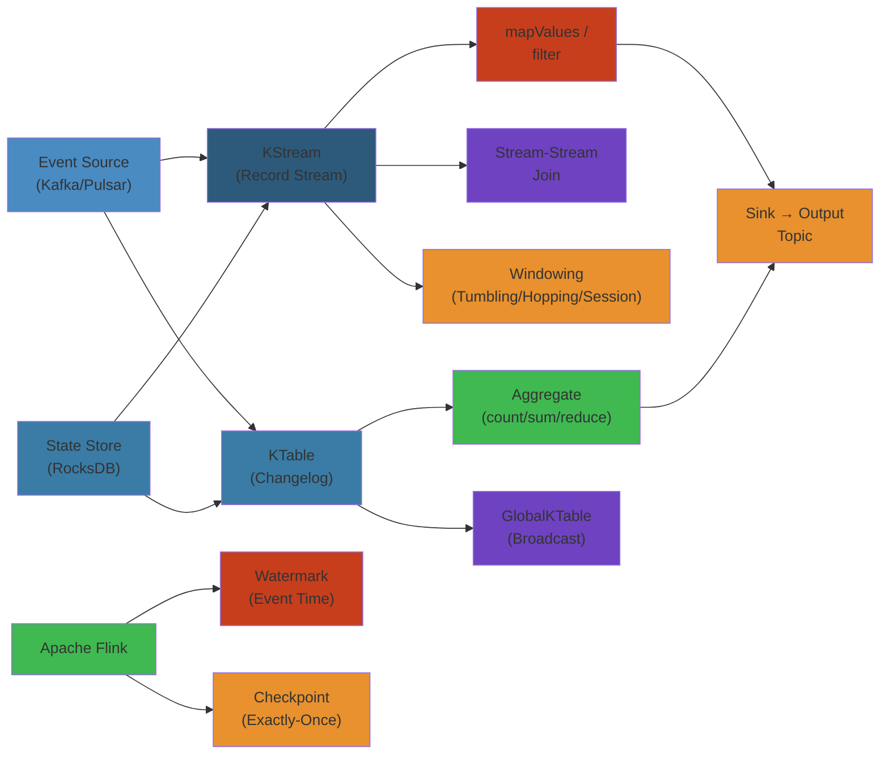

# 🌊 Stream Processing — Complete Deep Dive

> **Scope**: Processing semantics (at-most-once, at-least-once, exactly-once), Kafka Streams (topology, KStream/KTable, state stores, exactly-once, DSL operators, Processor API), Apache Flink (DataStream API, event time, watermarks, windowing, state management, checkpointing, fault tolerance), stream-batch unification.




## Table of Contents

1. Stream Processing Semantics
2. Stream vs Batch Unification
3. Kafka Streams: Topology & Core Abstractions
4. Kafka Streams: KStream, KTable, GlobalKTable
5. Kafka Streams: State Stores
6. Kafka Streams: Exactly-Once Semantics
7. Kafka Streams: DSL Operators & Windowing
8. Kafka Streams: Processor API
9. Flink: Architecture & DataStream API
10. Flink: Event Time & Watermarks
11. Flink: Windowing
12. Flink: State Management & Checkpointing
13. Flink: Fault Tolerance

---

## 1. Stream Processing Semantics

```text
+------------------+------------------+------------------+
|  At-Most-Once    |  At-Least-Once   |  Exactly-Once    |
+------------------+------------------+------------------+
| Fire and forget  | Retry on fail    | Idempotent writes|
| May lose data    | May duplicate    | Transactional    |
| Fastest          | Medium           | Costliest        |
+------------------+------------------+------------------+
```

**At-Most-Once:** Process, don't retry. Crash → data loss.
**At-Least-Once:** Process then commit offset. Crash before commit → duplicate.
**Exactly-Once Approaches:**
1. **Idempotent writes:** Same result every time (e.g., `UPDATE x=5 WHERE id=y`).
2. **Transactional consume-process-produce:** Commit offsets + produce in one atomic tx.
3. **Deduplication:** Track processed IDs, skip duplicates.

---

## 2. Stream vs Batch Unification

**Stream** = unbounded, event-triggered, incremental. **Batch** = bounded, scheduled, full recompute.

**Stream-Table Duality:** A stream is a changelog of updates to a table. A table is a snapshot of a stream. `KTable` = compacted stream (latest per key). `KStream` = full history.

**Unified APIs (Flink, Kafka Streams):** Same code processes batch and stream. Batch = bounded stream.

---

## 3. Kafka Streams: Topology & Core Abstractions

```text
Source Topic → SourceProcessor → StreamTask → Processor → SinkProcessor → Output Topic
                 (topology DAG)
```

**Processor Types:**
- **Source:** Reads from Kafka topic.
- **Stream:** Transforms (map, filter, join).
- **Sink:** Writes to Kafka topic.

**StreamTask:** Unit of parallelism. One task per topic partition. Each task runs its own processor topology instance.

---

## 4. Kafka Streams: KStream, KTable, GlobalKTable

```python
builder = StreamBuilder()

# KStream — all records (append-only event stream)
orders: KStream = builder.stream("orders")
orders.filter(lambda k, v: v["amount"] > 100) \
      .map(lambda k, v: (v["user_id"], v)) \
      .to("high-value-orders")

# KTable — latest per key (upsert from compacted topic)
users: KTable = builder.table("user-profiles")

# KStream-KTable join
enriched = orders.join(users,
    join_key=lambda o: o["user_id"],
    value_mapper=lambda o, u: {**o, "email": u["email"]})

# GlobalKTable — full replica on every node (for broadcast data)
products: GlobalKTable = builder.global_table("product-catalog")
```

**KStream (append-only):** All records. **KTable (upsert):** Latest per key, compacted internally. **GlobalKTable (broadcast):** Entire table on all nodes for small reference data.

---

## 5. Kafka Streams: State Stores

```text
StreamTask 0          StreamTask 1          StreamTask 2
+---------------+     +---------------+     +---------------+
| RocksDB Store |     | RocksDB Store |     | InMemory Store|
| (partition 0) |     | (partition 1) |     | (partition 2) |
+---------------+     +---------------+     +---------------+
      |                      |                       |
      +----------+-----------+-----------------------+
                 | Changelog Topics (backup + recovery)
                 v
```

**Types:** RocksDB (disk-backed, handles > memory), In-Memory (fast, volatile), Persistent (RocksDB + logging).

**Changelog Topics:** Every stateful op has a changelog topic. On restart, state store rebuilds from changelog.

**Standby Replicas:** Warm state copies on other nodes for fast recovery during rebalance.

**Interactive Queries:** Query state stores externally via `streams.store("store", ...).get("key")`.

---

## 6. Kafka Streams: Exactly-Once Semantics

```text
Consume → Process → Produce (committed atomically)
    |                    |
    offset committed     batch written
    in same tx           in same tx
    v                    v
Source Topic          Sink Topic
```

**Transaction Coordinator:** Broker managing producer transactions. **Epoch (Zombie Fencing):** Each producer instance gets unique epoch. Stale epochs rejected.

**Configuration:**
```python
props = {"processing.guarantee": "exactly_once_v2"}  # Kafka 3.0+
```

**EOS v1:** Separate producer per task, many concurrent transactions. **EOS v2:** One producer per thread, single transaction per poll.

---

## 7. Kafka Streams: DSL Operators & Windowing

**Stateless operators:** `filter`, `map`, `flatMap`, `selectKey`, `peek`, `branch`, `merge`.

**Stateful operators:** `groupBy` + `count`/`aggregate`/`reduce`, `join`, `cogroup`.

```python
# Windowing
tumbling = grouped.windowed_by(TimeWindows.of(Duration.ofMinutes(5))).count()

hopping = grouped.windowed_by(
    TimeWindows.of(Duration.ofMinutes(10)).advance_by(Duration.ofMinutes(5))
).count()

sessions = grouped.windowed_by(
    SessionWindows.with(Duration.ofMinutes(5))  # inactivity gap
).count()
```

```text
Tumbling: [0-5) [5-10) [10-15)    (fixed, non-overlapping)
Hopping:  [0-10)[5-15)[10-20)     (fixed, overlapping)
Session:  |--active--|gap|--active--|gap|  (gap-based)
```

**Grace Period:** `TimeWindows.of(...).grace(Duration.ofMinutes(1))` — wait for late records.

**Suppression:** `suppress(Suppressed.untilWindowCloses(...))` — emit only at window end.

---

## 8. Kafka Streams: Processor API

```python
class MyProcessor(Processor):
    def init(self, context):
        self.store = context.getStateStore("my-store")
        context.schedule(Duration.ofSeconds(30), PunctuationType.WALL_CLOCK_TIME, self.punctuate)

    def process(self, key, value):
        count = (self.store.get(key) or 0) + 1
        self.store.put(key, count)
        self.context.forward(key, {"count": count})

    def punctuate(self, ts):
        results = list(self.store.all())
        self.context.forward("__agg__", results)
```

**ProcessorContext:** `forward()` to downstream, `schedule()` for punctuators, `commit()` for manual commit.

**Custom State Store:** `Stores.persistentKeyValueStore("my-store")` connected via `connectProcessorAndStateStores`.

---

## 9. Flink: Architecture & DataStream API

```text
JobManager — coordination, checkpoint management, scheduling
    |
TaskManager 1 (slots)     TaskManager 2 (slots)     TaskManager N
    |                          |                         |
  subtasks                  subtasks                   subtasks
```

```java
StreamExecutionEnvironment env = StreamExecutionEnvironment.getExecutionEnvironment();

DataStream<SensorReading> readings = env
    .addSource(new FlinkKafkaConsumer<>("sensors", deserializer, props));

DataStream<Alert> alerts = readings
    .filter(r -> r.temperature > 100)
    .map(r -> new Alert(r.sensorId, "High temperature: " + r.temperature));

alerts.addSink(new FlinkKafkaProducer<>("alerts", serializer, props));
env.execute("Temperature Monitor");
```

**Flink SQL (Table API):**
```sql
SELECT sensor_id, TUMBLE_END(ts, INTERVAL '10' SECOND) AS win,
       AVG(temperature) AS avg_temp
FROM sensor_data
GROUP BY sensor_id, TUMBLE(ts, INTERVAL '10' SECOND);
```

---

## 10. Flink: Event Time & Watermarks

**Three time concepts:**
- **Event Time:** When the event happened (in the record).
- **Processing Time:** When Flink processes it.
- **Ingestion Time:** When it enters the pipeline.

**Watermark:** Signal "no more events with timestamp < watermark" will arrive. When watermark passes window end, window fires.

```java
readings.assignTimestampsAndWatermarks(
    WatermarkStrategy
        .<SensorReading>forBoundedOutOfOrderness(Duration.ofSeconds(5))
        .withTimestampAssigner((event, ts) -> event.timestamp)
);
```

```text
Events:  [E1@100] [E2@110] [E3@120] [E4@125] [E5@140]
Watermarks: 105      115       130      140      150
              E1 done   E2 ok      window @120 fires
```

**Idle Sources:** `withIdleness(Duration.ofSeconds(60))` — mark source idle after 60s so watermarks can proceed.

---

## 11. Flink: Windowing

```java
// Tumbling window
readings.keyBy(r -> r.sensorId)
    .window(TumblingEventTimeWindows.of(Time.minutes(5)))
    .aggregate(new AverageAggregate());

// Sliding window (size=10, slide=5)
readings.keyBy(r -> r.sensorId)
    .window(SlidingEventTimeWindows.of(Time.minutes(10), Time.minutes(5)))
    .apply(new MyWindowFunction());

// Session window (gap=5 min)
readings.keyBy(r -> r.sensorId)
    .window(EventTimeSessionWindows.withGap(Time.minutes(5)))
    .process(new MyProcessWindowFunction());
```

**Trigger:** Controls when window evaluates (count, time, custom). **Evictor:** Removes elements before evaluation.

**Functions:** `ReduceFunction` (incremental), `AggregateFunction` (accumulator different from output), `ProcessWindowFunction` (full window content).

```java
// AggregateFunction — incremental aggregation
window.aggregate(new AggregateFunction<SensorReading, AvgAccum, Double>() {
    public AvgAccum createAccumulator() { return new AvgAccum(); }
    public AvgAccum add(SensorReading r, AvgAccum a) { a.sum += r.temp; a.count++; return a; }
    public Double getResult(AvgAccum a) { return a.sum / a.count; }
    public AvgAccum merge(AvgAccum a, AvgAccum b) { ... }
});
```

---

## 12. Flink: State Management & Checkpointing

**Keyed State (per-key):**
```java
public class CountAverage extends RichFlatMapFunction<SensorReading, Double> {
    private ValueState<Tuple2<Long, Double>> state;

    public void open(Configuration c) {
        state = getRuntimeContext().getState(
            new ValueStateDescriptor<>("average", Types.TUPLE(Types.LONG, Types.DOUBLE))
        );
    }

    public void flatMap(SensorReading r, Collector<Double> out) throws Exception {
        Tuple2<Long, Double> current = state.value();
        if (current == null) current = Tuple2.of(0L, 0.0);
        current.f0++; current.f1 += r.temp;
        state.update(current);
        if (current.f0 >= 10) {
            out.collect(current.f1 / current.f0);
            state.clear();
        }
    }
}
```

**State Types:** `ValueState`, `ListState`, `MapState`, `ReducingState`, `AggregatingState`.

**Operator State (per-task):** Non-keyed, shared across all records in subtask. **Broadcast State:** Same on all instances (for rules/config).

**State Backends:** **HashMap** (heap, fast, limited), **RocksDB** (disk, more state, slower).

**State TTL:** `StateTtlConfig.newBuilder(Time.days(1)).build()`.

**Backpressure:** Downstream can't keep up. Flink uses TCP flow control + credit-based network buffers.

---

## 13. Flink: Fault Tolerance

**Checkpointing — exactly-once via barrier alignment:**

```text
Source → |BARRIER| → Operator → |BARRIER| → Sink
   |          |          |           |        |
snapshot   align      snapshot    apply     snapshot
offset    barriers    state      to sink   completed
```

```java
env.enableCheckpointing(Duration.ofMinutes(1));
env.getCheckpointConfig().setCheckpointingMode(CheckpointingMode.EXACTLY_ONCE);
env.getCheckpointConfig().setMinPauseBetweenCheckpoints(Duration.ofSeconds(30));
env.getCheckpointConfig().setCheckpointTimeout(Duration.ofMinutes(10));
```

**Savepoint:** Manual checkpoint for planned restarts (upgrade, rescaling).

**Restart Strategies:**
```java
env.setRestartStrategy(RestartStrategies.fixedDelayRestart(
    3, Duration.ofSeconds(10)));
env.setRestartStrategy(RestartStrategies.exponentialDelayRestart(
    Duration.ofSeconds(1), Duration.ofMinutes(5), 2.0, 0.1, Duration.ofMinutes(2)));
```

**Failure Recovery Flow:**
1. Task fails, JobManager detects via heartbeat timeout.
2. JobManager cancels all tasks.
3. Restarts from latest checkpoint.
4. Sources resume from checkpointed offsets.
5. Stateful operators restore from snapshots.

---

## Simplest Mental Model

**Stream processing handles an infinite series of events without storing them all.** Kafka Streams turns Kafka topics into living tables — every message is an update to a key-value store. Flink breaks streams into tiny time-based batches (windows) with guaranteed consistency via checkpoints. **Both solve: "process data as it arrives, not later."** Use Kafka Streams when already in Kafka ecosystem; use Flink for complex event-time, large state, or batch + stream unification.


## Practical Example

See code examples above for practical usage patterns.

## Production Failure Modes

### Failure 1: Watermark Skew Causes Windowed Aggregation to Never Fire

| Aspect | Detail |
|--------|--------|
| **Symptoms** | Flink job shows no output for hourly window. Watermark stuck at current time - 1 hour. EventTime processing expects window results every minute, but nothing emitted |
| **Root Cause** | Idle source partition stops sending events. Flink watermark advances only when all partitions have events. One Kafka partition with no new data blocks watermark for all partitions. Watermark = min(partition_watermarks) → if one partition is idle, watermark doesn't advance |
| **Detection** | Flink UI: watermark stays at initial value. `currentInputWatermark` shows `-9223372036854775808`. Kafka consumer lag is 0 (no new data on that partition) |
| **Recovery** | Set `withIdleness(Duration.ofSeconds(60))` on source: after 60s idle, partition is excluded from watermark calculation. Flink 1.12+: `WatermarkStrategy.idle(Duration.ofMinutes(1))` |
| **Prevention** | Always set `withIdleness()` on all streaming sources. Monitor watermark age: `flink_taskmanager_job_task_operator_currentInputWatermark`. Alert when watermark not advancing for > 5 min. Use `allowedLateness()` to handle late events |

### Failure 2: Checkpoint Failure Rate Causes Job Restart Loop

| Aspect | Detail |
|--------|--------|
| **Symptoms** | Flink job repeatedly restarts. Checkpoint duration increases. Checkpoint size grows. Job never makes progress |
| **Root Cause** | RocksDB state backend grows unbounded. Checkpoint serializer creates large snapshots. External system (S3) latency increases under load. Checkpoint timeout exceeded (default 10 min). Flink cancels job after too many failed checkpoints |
| **Detection** | Flink UI: checkpoints fail with `CheckpointDeclinedException`. Logs: `Checkpoint expired before completing`. S3 metrics: `PutObject` latency > 10s for checkpoint files |
| **Recovery** | Increase `checkpointing.timeout` to 30 min. Increase `checkpointing.minPauseBetweenCheckpoints`. Switch to incremental checkpointing (RocksDB native incremental). Compress state: `ExecutionConfig.enableForceKryo()` |
| **Prevention** | Use incremental checkpoints (save only diff, not full snapshot). Set `state.backend.incremental: true`. Tune RocksDB: `state.backend.rocksdb.block.cache-size`. Monitor checkpoint size: `lastCheckpointSize` metric. Add alert: consecutive checkpoint failures > 3 |

### Failure 3: Kafka Streams State Store Corruption After Crash

| Aspect | Detail |
|--------|--------|
| **Symptoms** | Kafka Streams application starts but produces incorrect results. Stateful operations (aggregation, join) output garbage. Standby replicas don't match active |
| **Root Cause** | RocksDB state store corrupted on disk (power loss, disk full, partial write). On restart, RocksDB loads corrupt data. Changelog topic replay may recover from corruption, but if corruption happened before the changelog was written, state diverges |
| **Detection** | `kafka-streams-state-store-lag` > 0. `rocksdb-sst-file-read-error` in logs. Queries to state store return inconsistent results compared to changelog |
| **Recovery** | Reset application: `kafka-streams-application-reset --application-id <id> --input-topics <topic>`. Delete local state directory (`/tmp/kafka-streams/<app-id>`). Restart: application rebuilds state from changelog topics |
| **Prevention** | Use `state.dir` on persistent volume (not emptyDir/ramdisk). Configure standby replicas: `num.standby.replicas = 2` for real-time failover. Enable `rocksdb.use.attributes` for RocksDB consistency checks. Monitor `rocksdb.num-running-compactions` to detect compaction issues |

### Failure 4: Flink Sink Backpressure Causes Pipeline Stall

| Aspect | Detail |
|--------|--------|
| **Symptoms** | End-to-end latency increases. Checkpoint duration spikes. Source consumption drops. Kafka consumer lag grows |
| **Root Cause** | Downstream sink (Elasticsearch, Kafka producer) can't keep up with processing rate. Sink buffer fills up. Backpressure propagates through network buffers to source. Flink's credit-based flow control slows down production |
| **Detection** | Flink UI: source shows `BackPressured` or `Idle` status. `flink_taskmanager_job_task_operator_buffers_outPoolUsage` = 1.0 (100% buffer usage). Sink shows `busy` status |
| **Recovery** | Scale sink parallelism. Check Elasticsearch cluster health (maybe yellow/red). Optimize sink: use batch writes, increase buffer size. Use async I/O in sinks |
| **Prevention** | Buffer sink writes: 1000 events or 5s flush. Use blocking sinks with bounded buffer size. Add alert: `outPoolUsage > 0.8` for any operator. Ensure downstream system has capacity for peak throughput + 50% headroom |

### Failure 5: Exactly-Once Sink Duplicates in Failure Scenario

| Aspect | Detail |
|--------|--------|
| **Symptoms** | Duplicate records in target database. Idempotency check shows repeated event_ids. Sink writes committed twice after job restart |
| **Root Cause** | Flink's exactly-once guarantee is per-operator within the pipeline, not end-to-end. After checkpoint + restart: Flink replays from last checkpoint. The sink receives the same records again. If the sink isn't idempotent, duplicates appear |
| **Detection** | Target DB has records with same business key. Sink shows `FlushFailure`. Flink checkpoint log shows `Checkpoint 42 completed`, then `Checkpoint 43 completed`, but restart goes back to 42 |
| **Recovery** | Add dedup step: before writing to sink, check idempotency table (DynamoDB/Redis). Use DB upsert: `INSERT ... ON CONFLICT DO NOTHING`. Implement Kafka transactional sink for exactly-once output |
| **Prevention** | Use idempotent sink: every record has unique ID, sink checks dedup before write. Use Flink 2-phase commit sink (TwoPhaseCommitSinkFunction). For Kafka sink, use exactly-once producer. Use DB upsert as final safety net |

## Edge Cases

| Scenario | Challenge | Solution |
|----------|-----------|----------|
| **Kafka partition rebalance during processing** | Unprocessed records reassigned to new consumer | Store offset in state store with processing status. Use Kafka Streams with exactly-once semantics |
| **Watermark gap due to different source speeds** | Fast source partitions advance watermark, slow partitions cause gap | Use per-partition watermark. Set idle timeout per partition. Different sources: use `WatermarkStrategy.withTimestampAssigner` to align |
| **Flink savepoint compatibility across versions** | Cannot restore from savepoint after Flink upgrade | Use `--allowNonRestoredState`. Ensure operator UID stable across versions. Upgrade Flink version incrementally (one minor version at a time) |
| **Kafka Streams topology change** | Changing processor topology breaks state store mapping | Use named state stores. Map old stores to new topology via `stateStores` config. Start with `--reset-offsets` if topology incompatible |
| **Reactive stream backpressure deadlock** | Publisher-subscriber both blocked waiting | Use bounded buffers with timeout. Never use synchronous blocking in reactive stream operators |

## Interview Questions

### Q1 (Beginner): What is stream processing and how is it different from batch processing?

**Answer**: Stream processing processes data in real-time as it arrives, with low latency (milliseconds to seconds). Batch processing processes data in fixed intervals (hourly, daily). Stream processing is: continuous, unbounded data, event-time aware, stateful. Batch is: finite dataset, scheduled, no concept of event time. Stream processing use cases: fraud detection (cancel transaction before it completes), real-time dashboard (current user count), anomaly detection (CPU spike alert). Batch processing: monthly billing, daily ETL, ML model training. Many systems are hybrid: Lambda architecture (batch + stream) or Kappa architecture (stream only).

### Q2 (Mid-Level): How does Flink handle event-time, watermarks, and late data?

**Answer**: Event time = when the event occurred (from the event timestamp). Watermark = a heuristic that says "no more events with timestamp < watermark are expected." Flink advances watermark based on event timestamps seen. When a watermark passes the end of a window, the window fires (produces result). Late data: events arriving after the watermark passed their window. Handling: (1) allowedLateness — define how long to wait for late events (e.g., 1 hour window with 5 min allowed lateness). When late event arrives, window recomputes and emits update. (2) Side output — route late events to a separate stream for later processing. (3) Ignore — simply discard late events (default behavior if no allowedLateness set). Best practice: set allowedLateness based on business requirement. For fraud detection: allowedLateness = 0 (must detect immediately). For analytics: allowedLateness = 5 min (accept some latency for completeness).

### Q3 (Senior): Design a real-time fraud detection pipeline using Flink and Kafka.

**Answer**: Components: Kafka topics: `transactions` (raw payment events), `user-profiles` (compacted, enriched user data), `fraud-alerts` (output). Flink job: (1) Source: consume `transactions` from Kafka with event-time watermark (max 1 min idleness). (2) Enrichment: async I/O join with `user-profiles` (KV store) via Redis lookup. (3) Feature computation: sliding windows (1 min, 5 min, 1 hour). Aggregations per user: transaction count, total amount, geo-location changes, velocity (transactions per minute). (4) ML inference: PMML model loaded at startup. Features vector → model scores transaction as fraud probability. Threshold: > 0.95 → block, > 0.8 → flag for review. (5) Sink: block transactions → Kafka `fraud-alerts` → downstream service calls bank API. Flagged → Kafka `fraud-reviews` → manual review queue. State management: per-user state stored in RocksDB (1 GB per million users). Operational considerations: metric: end-to-end latency < 100ms. Backpressure handling: if fraud model slow, buffer in Kafka. Exactly-once: idempotent sink to downstream (block idempotency). Failover: Flink savepoint every 5 min, restore from latest savepoint on failure.

### Q4 (Staff): Compare Apache Flink, Kafka Streams, and Apache Spark Structured Streaming for a production stream processing workload.

**Answer**: Flink: true streaming (event-by-event processing). Strengths: event-time semantics (watermarks, allowed lateness), complex state management (RocksDB, incremental checkpoints), exactly-once end-to-end with idempotent sinks. Weaknesses: operational complexity (job manager, task manager), JVM memory tuning. Best for: complex event processing, stateful joins, windowed aggregations, ML inference at low latency. Kafka Streams: embeddable, no separate cluster. Strengths: runs in application JVM, exactly-once built-in, KTable/KStream operations, interactive queries. Weaknesses: JVM-only, state is local (not distributed), scaling limited by partition count. Best for: per-service stream processing, projections, transformations. Spark Structured Streaming: micro-batch (not true streaming). Strengths: unified batch/stream API, large ecosystem (MLlib, SQL, GraphX), DataFrame API. Weaknesses: micro-batch latency (100ms+), no native event-time watermarks (uses processing time). Best for: ETL pipelines, large-scale aggregations with moderate latency, ML model training on streaming data. Recommendation: use Kafka Streams for in-service processing, Flink for cross-service low-latency pipelines, Spark for high-throughput ETL with 1-min+ latency tolerance.

### Q5 (Principal): Design a globally distributed streaming platform that guarantees exactly-once processing across regions.

**Answer**: Multi-region Kafka: separate Kafka cluster per region, with MirrorMaker 2 for cross-region replication. Topics are replicated asynchronously (active-active). Challenge: exactly-once across regions requires global transaction coordination. Solution: (1) Source events: assign globally unique ID (UUIDv7 with timestamp + region prefix). (2) Idempotent processing: each event processed at most once per region. Use Flink with exactly-once checkpoint per region. (3) Cross-region dedup: downstream sink (S3, BigQuery) deduplicates by event_id. (4) Transactions: avoid cross-region transactions. Use Saga pattern: per-region service performs local transaction, publishes event, other regions react. (5) Watermarks: each region has its own watermark based on local event time. No global watermark needed because windows are per-region. (6) Failover: Kafka cluster failover within region (KRaft controller). If entire region fails, other regions continue processing. Eventually consistent view across regions. (7) Monitoring: track global event lag (difference between latest event_id timestamp per region). Alert if any region falls behind by > 10 seconds. For true global exactly-once: use Google Cloud Pub/Sub with exactly-once delivery or use a strongly consistent store (Spanner) to track processed event IDs globally.

## Cross-References

- [Kafka Patterns](../../10-messaging/kafka/02-kafka-patterns.md) — Event sourcing, CQRS, stream-table duality
- [Distributed Transactions](../02-distributed-transactions.md) — Saga, exactly-once semantics, outbox pattern
- [Distributed Storage](../03-distributed-storage.md) — State backends, RocksDB configuration, checkpointing
- [Kubernetes Observability](../../07-kubernetes/06-kubernetes-observability.md) — Flink/Kafka Streams monitoring, metrics
- [Backend Roadmap](../../21-roadmaps/01-backend-engineer.md) — Phase 3 stream processing, Phase 4 large-scale design
