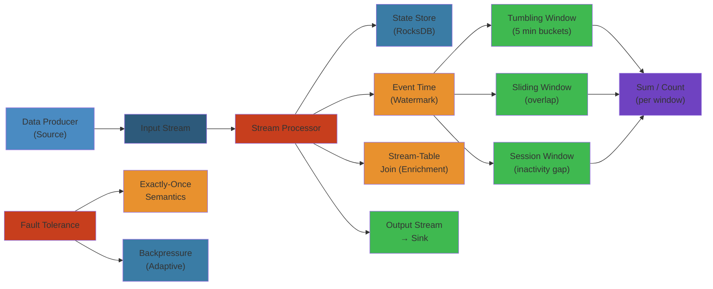

# 📊 Stream Processing — Complete Deep Dive

> **Scope**: Stream vs batch, processing models (one-at-a-time, micro-batch, continuous), time semantics (event time, processing time, watermarks, lateness), state management (keyed state, operator state, state backends, checkpointing), windowing (tumbling, sliding, session), stream joins, fault tolerance (exactly-once, at-least-once, backpressure), Apache Kafka Streams, Apache Flink, Apache Pulsar, stream processing patterns (CEP, anomaly detection), production CDC pipeline.
>
> **Related**: [04-distributed-transactions.md](./04-distributed-transactions.md)




## Table of Contents


1. Stream vs Batch Processing
2. Processing Models
3. Time Semantics & Watermarks
4. Lateness Handling
5. State Management
6. Checkpointing & Fault Tolerance
7. Windowing
8. Stream Joins
9. Backpressure
10. Apache Kafka Streams
11. Apache Flink
12. Apache Pulsar
13. Stream Processing Patterns
14. Production CDC Pipeline
15. Failure Analysis

---

## 1. Stream vs Batch Processing


```text
Batch:
  +----------+          +----------+          +----------+
  | Ingest   | --hour-->| Process  | --write->| Sink     |
  | today's  |          | all data |          | (table)  |
  | data     |          | at once  |          |          |
  +----------+          +----------+          +----------+
  Latency: hours/days   Periodic trigger      High throughput

Stream:
  +----------+          +----------+          +----------+
  | Event    | --cont-->| Process  | --write->| Sink     |
  | Source   |          | each     |          | (real-   |
  | (Kafka)  |          | event    |          | time)    |
  +----------+          +----------+          +----------+
  Latency: milliseconds  Continuous            Low per-event
```

| Aspect | Batch | Stream |
|--------|-------|--------|
| Latency | Minutes to hours | Milliseconds to seconds |
| Data | Bounded (fixed window) | Unbounded (continuous) |
| Processing | Full scan | Incremental |
| State | Temporary (per batch) | Persistent (long-lived) |
| Fault tolerance | Retry batch | Checkpoint + replay |
| Throughput | Very high | High (per-node) |

---

## 2. Processing Models


**One-at-a-Time (event-at-a-time):**
- Process each event individually as it arrives
- Lowest latency, but high per-event overhead
- Example: Apache Storm (spout -> bolt topology)

**Micro-Batch:**
- Buffer events for short interval (e.g., 5 seconds or 1000 records)
- Process as small batch
- Trade latency for throughput
- Examples: Spark Streaming (batch interval), Flink (can also do micro-batch for batch execution mode)

**Continuous Streaming:**
- Events flow through a DAG of operators
- Operators maintain state and emit results per-event
- Low latency + high throughput with operator chaining
- Examples: Flink (continuous), Kafka Streams

```text
One-at-a-Time:  [e1] -> [e2] -> [e3] -> [e4]
Micro-Batch:    [e1,e2,e3,e4] (every N seconds)
Continuous:     e1 -> op -> e2 -> op -> e3 -> op -> e4 ->
                State: [ .... stateful processing ... ]
```

---

## 3. Time Semantics & Watermarks


```text
Timeline:
                        Watermark (W)
Event Time -> [e1][e2]----[e3]--[e4]--[e5]--[e6]---->[e7]
                  \        \     \      \     \         \
Processing T->   [p1][p2][p3][p4][p5][p6][p7][p8]...

Watermark = max(event_time_seen) - allowed_lateness

Before watermark: events expected for [t-10, t] done
After watermark: late events beyond forgiveness window
```

**Event Time:** When the event actually occurred (embedded in event payload). Required for correct results regardless of processing delays.

**Processing Time:** When the system processes the event. Simple but non-deterministic. Results vary on replay.

**Ingestion Time:** Timestamp assigned by the source (Kafka) when event enters the system. Compromise between event time and processing time.

**Watermark:** Monotonically increasing timestamp tracking event time progress. Signals "no more events before this time are expected."

**Types:**
- **Periodic Watermarks:** Emitted periodically (e.g., every 100ms) based on observed max timestamp.
- **Punctuated Watermarks:** Emitted when a specific event with a special marker arrives.
- **Idle Watermark:** If a partition has no data, advance watermark anyway (avoid stalling).
- **Custom Watermark:** User-defined strategy (e.g., allow 5-second lateness for out-of-order events).

**Watermark = max(event_time) - allowed_lateness:**

```text
Kafka Topic (3 partitions):
P0: [t=10][t=12][t=15]                     watermark = 15 - 5 = 10
P1: [t=8] [t=11][t=14][t=16]              watermark = 16 - 5 = 11
P2: [t=9] [t=13]                          watermark = 13 - 5 = 8

Global watermark = min(10, 11, 8) = 8
Only complete windows up to t=8 can be emitted.
```

---

## 4. Lateness Handling


When an event arrives after the watermark has passed its event time, it is "late."

| Strategy | Behavior | Use Case |
|----------|----------|----------|
| **Drop** | Silently discard | Strict time accuracy needed, late data is noise |
| **Side Output** | Route to separate stream for later analysis | Debugging, auditing |
| **Accumulate** | Keep in state, re-trigger window results on late arrivals | Financial metrics, corrections |
| **Update** | Emit update/retraction for previous result, then new result | Materialized views |

```text
Allowed Lateness:
Window [0-10). Event at t=9 arrives -> in window, processed normally.
Event at t=11 arrives (lateness=1, allowed=5) -> watermark=12 -> not late yet.
Event at t=7 arrives (watermark=15, lateness=8 > 5) -> late! Dropped/side-output.
```

**Allowed Lateness + Retriggering:**

```text
Flink window with allowedLateness(10s):
OnTime:  [10:00:00] ... window [09:00, 10:00) emits result
Late:    [10:00:05] event with t=09:59 arrives
         Watermark not past 10:00 + 10s yet -> retrigger window update
Final:   [10:00:11] watermark = 10:00 + 10s -> window purged from state
```

---

## 5. State Management


**State Types:**

```text
Keyed State (per key):
  +-------+------+------+------+
  | Key   | Val  | Key  | Val  |
  | u1    | 42   | u2   | 99   |
  | (ValueState)   | (ListState) |
  +-------+------+------+------+
  +-------+------+------+------+
  | MapState       | Aggregating  |
  | k1:v1, k2:v2  | State        |
  +-------+------+------+------+

Operator State (per task):
  +----------------------------------+
  | Operator parallelism = 2         |
  | Task 0 offset: [p0: 100, p1:200] |
  | Task 1 offset: [p2: 150, p3:300] |
  | (ListState / UnionListState)     |
  +----------------------------------+

Broadcast State (replicated to all tasks):
  +----------------------------------+
  | Global config: threshold=0.5     |
  | Same on all parallel tasks       |
  +----------------------------------+
```

**State Backends:**

| Backend | Storage | Checkpoint | Latency | Scale |
|---------|---------|------------|---------|-------|
| In-Memory (Heap) | JVM heap | JVM serialization | Fastest | < 10GB |
| RocksDB | Local disk (native) | Incremental snapshots | Medium | 100GB+ |
| RocksDB + Incremental | Local disk | Only changed SST files | Medium | TB+ |

**RocksDB State Backend Tuning:**
- `rocksdb.block.cache-size`: memory for data blocks
- `rocksdb.writebuffer.size`: memtable size
- `rocksdb.threads`: compaction threads
- `rocksdb.compression.type`: lz4/snappy/zstd
- Memory control: managed memory fraction ensures GC stability

---

## 6. Checkpointing & Fault Tolerance


```text
Checkpoint Barrier Flow:
Source (Kafka) -> Operator A -> Operator B -> Sink
   |                |              |            |
   |--- barrier --->|              |            |
   |                |--- barrier -->|           |
   |                |              |--- barrier ->|
   |                |              |            |
   | Checkpoint N   | Checkpoint N | Checkpoint N |
```

**Exactly-Once State Guarantee:**
1. Insert checkpoint barriers into the stream (aligned)
2. Each operator receives barrier, snapshots its state
3. When all operators have snapshotted, checkpoint is complete
4. On failure: restore from last completed checkpoint
5. Source offsets also restored (replay from last committed offset)

**Aligned vs Unaligned Checkpoints:**

- **Aligned:** Barrier pauses processing until all inputs have barrier. Consistent but adds latency.
- **Unaligned:** Barrier is forwarded immediately, state is snapshotted with in-flight data. No barrier alignment pause. Good for large state, long processing.

**Savepoints vs Checkpoints:**
- **Checkpoint:** Automatic, periodic (for recovery). Fast, internal format.
- **Savepoint:** Manual, triggered by user. Self-contained, portable across Flink versions. For maintenance/upgrade.

**RocksDB Incremental Checkpointing:**
- Only modified SST files since last checkpoint are persisted
- Reference counting for shared files
- Much faster than full snapshot for large states

---

## 7. Windowing


```text
Tumbling Windows (fixed, non-overlapping):
  [0-10) [10-20) [20-30) [30-40) ... each event in exactly one window

Sliding Windows (fixed, overlapping):
  window_size=10, slide=5:
  [0-10) [5-15) [10-20) [15-25) ... event in multiple windows

Session Windows (activity gap):
  gap=5 minutes:
  |--session1--|     |--session2--|
  t=1,2,3,4,7,8      t=20,22,24,25
  session ends if no event within 5 min gap
```

**Tumbling vs Sliding vs Session:**

```text
Events:   [1][2][3][4][5][6][7][8][9][10][11][12]

Tumbling (size=3):
  [1,2,3] [4,5,6] [7,8,9] [10,11,12]

Sliding (size=3, slide=1):
  [1,2] [2,3] [3,4] [4,5] [5,6] [6,7] [7,8] [8,9] [9,10] [10,11] [11,12]

Session (gap=2):
  [1,2,3] (gap) [5,6,7] (gap) [9,10,11,12]
```

**Allowed Lateness & Window Merging:**
- `allowedLateness`: windows stay in state for this duration after watermark passes window end
- Late events within allowed lateness retrigger window evaluation
- Session windows merge when events fill the gap between adjacent sessions

---

## 8. Stream Joins


| Join Type | Description | State Requirements |
|-----------|-------------|-------------------|
| **Window Join** | Join two streams on key within same window | Key-by-key state per window |
| **Interval Join** | Join stream A with stream B within time interval of A's event | State per key (expiring) |
| **Temporal Join** | Join stream with versioned table (as-of timestamp) | Versioned table state |
| **Lookup Join** | Enrich stream with external DB (async, per event) | No state (external) |
| **Versioned Join** | Join against changelog (table at specific version) | Compacted changelog state |

```text
Window Join:
  Stream A: [1][2][3] | [4][5] | [6]
  Stream B: [a][b]    | [c][d] | [e]
  Window [0-10): result = {(1,a),(2,b),(3,b?)}

Interval Join:
  Order stream (time=0) + Payment stream (time=[-5, +5])
  Payment at time=2: join with order at time=0 (within interval)
  Payment at time=10: no join (outside interval)
```

---

## 9. Backpressure


**Local Backpressure:**
- Operator emits faster than downstream consumes
- Buffers fill up, eventually upstream must slow down
- Flink: limited buffer pools (network buffer pool)

**Flink Credit-Based Flow Control:**
```text
Sender                    Receiver
  |                         |
  |--- available credits-->|
  |<-- (N) credits --------|
  |--- N buffers --------->|
  |                         |
If receiver processes slowly: credits decrease -> sender slows down.
```

**Backpressure Monitoring in Flink:**
- Network buffer utilization: 0% = idle, 100% = backpressured
- Output buffer pool: high = upstream backpressure
- Task mailbox: high = task overwhelmed

**Kafka Consumer Backpressure:**
- `max.poll.records`: limit records per poll
- `max.partition.fetch.bytes`: limit bytes per partition fetch
- `fetch.max.bytes`: limit total bytes per fetch
- If processing is slow: consumer doesn't poll -> broker accumulates -> producer throttles (if using acks=all)

```text
Backpressure Chain:
  Slow sink -> output buffer full -> operator stalls -> input buffer full ->
  source stalls -> Kafka consumer pauses -> Kafka broker buffers -> producer blocks
  (Natural backpressure propagation)
```

---

## 10. Apache Kafka Streams


**Topology:**
```text
Source (topic) -> Processors -> Sink (topic)
     |                             |
   KStream / KTable              Output topic

Source Processor: reads from Kafka topic
Stream Processor: transforms (map, filter, aggregate)
Sink Processor: writes to Kafka topic
```

**KStream, KTable, GlobalKTable:**
- **KStream:** Record stream. Each record is an event.
- **KTable:** Changelog stream. Last update per key (materialized view). Compacted topic backing.
- **GlobalKTable:** Fully replicated KTable (all partitions on all instances). For broadcast data (lookup tables).

**Co-Partitioning Requirement:**
```text
KStream A (4 partitions) + KStream B (4 partitions)
Same key -> same partition -> local join

KStream A (4 partitions) + KStream B (3 partitions)
Different partition count -> repartition required (expensive)
```

**Interactive Queries:** Query state stores directly from application. State store accessible via RPC.

**KTable Changelog Topics:** Each KTable is backed by a changelog topic. On failure, state replayed from changelog (or restored from standby replicas).

**Standby Replicas:** Replicas of state stores for faster recovery. On rebalance, standbys can serve immediately.

**Rebalancing:** When instance joins/leaves, partitions reassigned. State stores migrated. Standby reduces recovery time.

---

## 11. Apache Flink


```text
Flink Architecture:
  +---------------+
  | JobManager    |
  | (JobGraph,    |
  |  scheduling,  |
  |  checkpoint)  |
  +-------+-------+
          |
  +-------+-------+-------+
  |TaskManager    |TaskManager    |TaskManager
  | [slot][slot]  | [slot][slot]  | [slot][slot]
  |  Task Slots   |  Task Slots   |  Task Slots
  +---------------+---------------+
```

**JobManager:** Scheduling, checkpoint coordination, recovery. Active/passive HA.

**TaskManager:** Worker process. Runs tasks in slots. Each slot = 1 thread (can run multiple operator subtasks share resources via slot sharing).

**Operator Chaining:** Sequential operators executed in same thread. No network serialization between chained operators. Reduces latency and throughput overhead.

**Slot Sharing:** Multiple operators from different tasks can run in same slot. Better resource utilization. Controlled via `slotSharingGroup`.

**Streaming vs Batch Execution:**

| Aspect | Streaming | Batch |
|--------|-----------|-------|
| Data | Unbounded | Bounded |
| Scheduling | On data arrival | All tasks upfront |
| Watermarks | Continuous | End-of-input = watermark |
| State | Persistent | Temporary (per batch) |
| Recovery | Checkpoint | Restart task |

---

## 12. Apache Pulsar


```text
Pulsar Architecture:
  +----------+     +----------+     +----------+
  | Broker 1 |     | Broker 2 |     | Broker 3 |
  +----+-----+     +-----+----+     +-----+----+
       |                 |                 |
       +-----------------+-----------------+
                         |
            +------------+-------------+
            | BookKeeper Cluster       |
            | [Ledger][Ledger][Ledger] |
            | Segment-oriented storage |
            +--------------------------+

            Tiered Storage (S3/GCS)
```

**BookKeeper Ledger:** Append-only log. Segments (ledger fragments) distributed across bookies. Each segment replicated (Ensemble). Segment size or time triggers new segment.

**Segment-Oriented Storage:**
- Log split into segments (ledgers in BookKeeper)
- Old segments offloaded to tiered storage (S3)
- Read cache (recent segments) + write cache (in-flight)
- Segment-level recovery (only recover affected segment)

**Pulsar Functions:** Lightweight stream processors. Map/filter/aggregate per message. Simplified API (no checkpoint/custom state management needed).

**Pulsar IO:** Pre-built connectors (Kafka source/sink, JDBC, Elasticsearch, etc.). Source reads from external, Sink writes to external.

**Pulsar SQL:** Presto connector for querying Pulsar topics as tables. Supports schema registry, partitioned reads.

**Pulsar vs Kafka:**
```text
Kafka: Partition = ordered log. Storage coupled with compute.
Pulsar: Topic = multiple ledgers (segments). Storage (BookKeeper)
        separate from serving (Broker).
```

---

## 13. Stream Processing Patterns


**Filter:**
```text
stream.filter(e -> e.temperature > 100)
  Input:  [95][102][98][110][88]
  Output: [102][110]
```

**Map / FlatMap:**
```text
stream.map(e -> e.userId + ":" + e.eventType)
stream.flatMap(e -> splitWords(e.text))
```

**Aggregation (tumbling window):**
```text
stream.groupByKey()
      .window(Tumbling(60s))
      .aggregate(Count)
       [,99] [,100] [,101]
       |   \   |   /   |
       v    v  v  v   v
   Count:3   Count:5

Common aggregates:
  count, sum, min, max, average, topN, distinct count
```

**Pattern Detection (CEP - Complex Event Processing):**

```text
NFA Automaton:
  States: [START] -> [SEEN_A] -> [SEEN_B] -> [MATCH]
  Events: A, B, C

  Input:  [A][B][C][A][B]

  Pattern: A followed by B
  Match at [A(1),B(2)] and [A(4),B(5)]
  C is ignored (not in pattern)
```

**Anomaly Detection:**

```text
Sliding Window Stats:
  Window last 100 events:
    mean = 50, stddev = 10
  New event: value = 95
  z-score = (95 - 50) / 10 = 4.5  (> threshold 3)
  -> Anomaly!

Moving Average (exponential):
  EMA = alpha * current_value + (1-alpha) * previous_EMA
  alpha = 0.3 weight on new value
  Anomaly if deviation > N * MAD (median absolute deviation)
```

---

## 14. Production CDC Pipeline


```text
PostgreSQL  ->  WAL  ->  Debezium  ->  Kafka  ->  Flink  ->  Sink
    |            |          |           |         |          |
   Source     Logical    CDC         Event     Stream     Elasticsearch
   Database   Replication Connector  Store     Processor  / Redis
                                                     / OLAP

State flow (Flink):  CDC events -> keyed state (current table state)
Output: Materialized cache (Redis), Search index (ES), or Data warehouse

Example: Order pipeline
  PostgreSQL orders -> Debezium -> Kafka "orders" topic
                          Flink: Enrich with user profile (KTable join)
                          Flink: Aggregate daily sales (tumbling window)
                          Sink: Elasticsearch (orders), Redis (daily agg)
```

---

## 15. Failure Analysis


**State Size Explosion:**
- Large keyed state if cardinality is huge
- Solution: State TTL, RocksDB compaction tuning, state partitioning
- Monitor: per-operator state size metrics

**RocksDB Compaction Tuning:**
- Too many level-0 files: Stalling writes
- Large compactions: CPU spikes
- Tuning: target file size, write rate limiter, compaction priority

**Watermark Skew:**
- One partition lags far behind -> watermark stalls -> window results delayed
- Detection: per-partition watermark monitoring
- Solution: idle partition detection, watermark alignment

**Kafka Consumer Lag:**
- Consumer can't keep up -> lag grows -> event staleness increases
- Detection: Kafka consumer group lag metrics
- Solution: increase parallelism, optimize processing logic

**Checkpoint Failure:**
- Checkpoint takes too long -> recovery unusable
- Possible: backpressure during checkpoint, large state
- Solution: unaligned checkpoints, increase checkpoint interval, async state snapshot

**Operator Chain Backpressure:**
- One slow operator in chain blocks entire chain
- Solution: break chain (disable chaining for slow operator), increase parallelism

**RocksDB Memory Control:**
- `RocksDB` uses memory outside JVM heap
- `taskmanager.memory.managed.fraction` controls how much Flink can manage
- If insufficient: RocksDB spills to disk, slows down

---

## Simplest Mental Model


**Stream processing is like a conveyor belt in a factory, not a warehouse.** Instead of collecting items and processing them in batches (warehouse/batch), you process each item as it moves past your station (conveyor/stream). A "watermark" is like a sign saying "no more items from 9AM will arrive" — you can now finalize the 9-10AM shift report. "State" is your notebook where you keep running totals. "Backpressure" is the conveyor belt slowing because you're too slow. "Checkpoint" is taking a photo of your notebook every few minutes — if you mess up, you go back to the last photo and replay.

## Related

- [Postgresql Internals](08-databases/01-postgresql-internals.md)
- [Relational Database Internals](08-databases/01-relational-database-internals.md)
- [Postgresql Architecture](08-databases/02-postgresql-architecture.md)
- [Redis Internals](08-databases/02-redis-internals.md)
- [Postgresql Troubleshooting Tuning](08-databases/03-postgresql-troubleshooting-tuning.md)
- [Redis Deep Dive](08-databases/04-redis-deep-dive.md)
