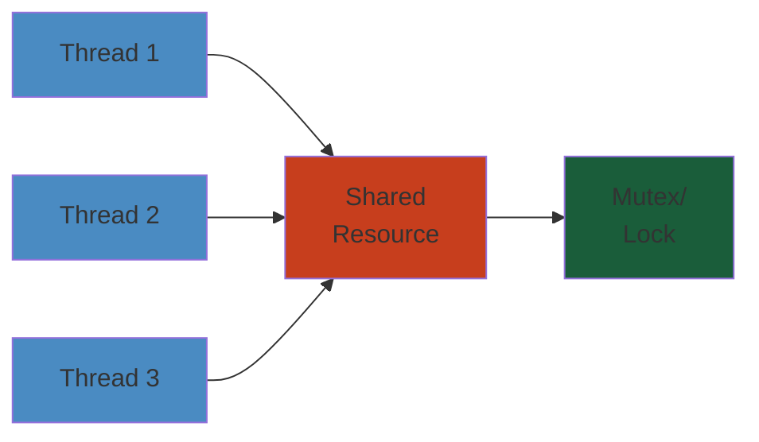

# 09 — Distributed Systems

The theory and practice of building systems that span multiple machines, networks, and data centers. Covers consensus algorithms, replication, consistency models, CAP/PACELC, distributed storage, caching, transactions, stream processing, and distributed computing patterns.

## Table of Contents

- [Consensus](#consensus)
  - [Raft](#raft)
  - [Paxos](#paxos)
  - [Zab](#zab)
  - [Other Consensus Protocols](#other-consensus-protocols)
- [Replication](#replication)
  - [Leader-Based Replication](#leader-based-replication)
  - [Leaderless Replication](#leaderless-replication)
  - [Multi-Leader Replication](#multi-leader-replication)
  - [Conflict Resolution](#conflict-resolution)
  - [Replication Lag & Monitoring](#replication-lag--monitoring)
- [Consistency Models](#consistency-models)
  - [Strong Consistency](#strong-consistency)
  - [Eventual Consistency](#eventual-consistency)
  - [Causal Consistency](#causal-consistency)
  - [Read-My-Writes & Session Consistency](#read-my-writes--session-consistency)
  - [Monotonic Reads & Writes](#monotonic-reads--writes)
- [CAP / PACELC](#cap--pacelc)
  - [CAP Theorem](#cap-theorem)
  - [PACELC](#pacelc)
  - [Practical Tradeoffs](#practical-tradeoffs)
- [Distributed Storage](#distributed-storage)
  - [Distributed File Systems](#distributed-file-systems)
  - [Distributed Object Stores](#distributed-object-stores)
  - [Distributed Key-Value Stores](#distributed-key-value-stores)
  - [Distributed Databases](#distributed-databases)
- [Distributed Caching](#distributed-caching)
  - [Cache Architectures](#cache-architectures)
  - [Consistent Hashing](#consistent-hashing)
  - [Cache Invalidation Strategies](#cache-invalidation-strategies)
  - [Global Caches](#global-caches)
- [Distributed Transactions](#distributed-transactions)
  - [Two-Phase Commit (2PC)](#two-phase-commit-2pc)
  - [Three-Phase Commit (3PC)](#three-phase-commit-3pc)
  - [Saga Pattern](#saga-pattern)
  - [Transactional Outbox](#transactional-outbox)
  - [Idempotency Patterns](#idempotency-patterns)
- [Stream Processing](#stream-processing)
  - [Streaming Models](#streaming-models)
  - [State Management](#state-management)
  - [Fault Tolerance](#fault-tolerance)
- [Distributed Computing Patterns](#distributed-computing-patterns)
  - [Leader Election](#leader-election)
  - [Distributed Locking](#distributed-locking)
  - [Distributed Coordination](#distributed-coordination)
  - [Service Discovery](#service-discovery)
  - [Health Checking & Failure Detection](#health-checking--failure-detection)
- [Learning Path](#learning-path)
- [Cross-References](#cross-references)

---

## Consensus

Consensus algorithms allow multiple nodes to agree on a value despite failures. This is the foundation of fault-tolerant distributed systems.

### Raft

Designed for understandability. Used by etcd, Consul, MongoDB (replica set election), CockroachDB, TiDB (PD), Kafka (KRaft).

- **Leader Election** — terms, election timeouts, randomized timeouts to avoid split votes; RequestVote RPC, AppendEntries RPC (heartbeat)
- **Log Replication** — leader receives client requests → appends to local log → replicates to followers → commits on majority acknowledgment; log matching property (if two logs have same index + term, they are identical up to that point)
- **Safety** — election restriction (only up-to-date candidate can become leader), commit restriction (leader cannot commit entries from previous terms unless they appear in its own term)
- **Cluster Membership Changes** — joint consensus (transitional configuration where both old and new config apply); single-server changes (simpler, add/remove one node at a time)
- **Log Compaction** — snapshots (point-in-time state); install snapshot RPC for lagging followers
- **Leader Transfer** — manual leadership transfer for maintenance
- **Pre-Vote** — prevents disrupted servers from triggering elections

### Paxos

The original consensus protocol. More theoretical, less directly implemented than Raft.

- **Classic Paxos** — proposer, acceptor, learner roles; prepare → promise (proposal number) → accept → accepted (majority)
- **Multi-Paxos** — stable leader (no prepare phase for subsequent proposals); used by Google Spanner (multi-Paxos groups per tablet)
- **Variants** — Cheapest Paxos, Fast Paxos (reduce to one round), Flexible Paxos (different quorums for different phases), EPaxos (no distinguished leader, reduced latency)
- **Challenges** — leader election not specified in core Paxos; liveness issues (competing proposals); protocol complexity

### Zab

ZooKeeper Atomic Broadcast. Used by ZooKeeper, Kafka (ZooKeeper mode).

- **Phases** — discovery (leader gathers proposed epoch), synchronization (leader sends committed proposals), broadcast (normal operation, FIFO)
- **Zxid** — two parts: epoch (leader term) + counter (within epoch); total order of state changes
- **Leader Election** — Fast Leader Election (FLE); each server votes for the server with the most up-to-date data (highest zxid)

### Other Consensus Protocols

- **Viewstamped Replication (VR)** — predecessor to Raft; similar leader + log replication approach
- **BFT (Byzantine Fault Tolerance)** — tolerates arbitrary (malicious) failures; PBFT (Practical BFT), HotStuff (used by Diem/Libra, Sui, Aptos); requires 3f+1 nodes to tolerate f faulty nodes

---

## Replication

### Leader-Based Replication

One node (leader/primary/master) accepts writes, replicates to followers (secondaries/standbys).

- **Synchronous Replication** — leader waits for at least one follower to acknowledge write; data loss risk: none (if ack received), but increased latency
- **Asynchronous Replication** — leader commits without waiting for follower; data loss risk: yes (if leader fails before replication)
- **Strongly Synchronous** — leader waits for all followers; highest durability, highest latency, least availability (if a follower fails, writes stop until quorum adjustment)
- **Chain Replication** — write → primary → secondary → ... → tail; linearizable reads from tail
- **Failover** — automated (sentinel, Raft leader election) vs manual (promote replica); risk of split-brain (both old and new leader accepting writes)

### Leaderless Replication

Any node accepts writes (Dynamo-style). Used by Cassandra, Amazon DynamoDB, Riak, Voldemort.

- **Read Repair** — client reads multiple replicas, returns latest version, writes any stale replicas behind the scenes
- **Anti-Entropy / Merkle Trees** — background process compares replicas to find differences; Merkle tree (hash tree) enables efficient comparison
- **Hinted Handoff** — if destination node is down, another node accepts the write with a hint (metadata: intended destination); when downed node returns, hint is replayed
- **Gossip Protocol** — each node periodically exchanges state with random peers; O(log N) convergence; used for membership, failure detection, metadata propagation

### Multi-Leader Replication

Multiple nodes accept writes (active-active, multi-datacenter). Used by MySQL group replication, PostgreSQL BDR, DynamoDB Global Tables, Cosmos DB multi-master.

- **Use Cases** — multi-datacenter writes, offline-first apps (CouchDB), collaborative editing (CRDT-based)
- **Topologies** — circular (A→B→C→A), star (central hub), all-to-all
- **Challenges** — write conflicts (two leaders modify same row simultaneously), auto-increment IDs, causality tracking

### Conflict Resolution

- **Last-Write-Wins (LWW)** — use timestamp or version vector; simplest, but loses data
- **CRDTs (Conflict-free Replicated Data Types)** — commutative operations guarantee convergence; counters, sets (G-Set, OR-Set), registers (LWW-Register), maps; used in Redis, Riak, Noms, Figma, collaborative software
- **Custom Merge Functions** — application-defined merge (e.g., shopping cart: merge items, keep both)
- **Version Vectors / Dotted Version Vectors** — track causality across replicas; detect conflicts and allow merging or prompt user

### Replication Lag & Monitoring

- **Asynchronous Lag Sources** — network latency, replica under-spec (CPU/I/O saturation), long-running read requests on replica
- **Impact** — reading stale data (read-after-write inconsistency), monotonic read violations
- **Monitoring** — seconds_behind_master (MySQL), pg_stat_replication replay_lag, DynamoDB replicaLag

---

## Consistency Models

### Strong Consistency

- **Linearizability** — once write completes, all subsequent reads (by any client) see that write; operations appear atomic, instant, ordered
- **Serializability** — transactions appear to execute in some sequential order; different from linearizability (individual operations)
- **Strict Serializability** — linearizability + serializability (Spanner with TrueTime)
- **CockroachDB** — Serializable isolation with strong consistency via Raft
- **Spanner** — external consistency (linearizability across all operations) using TrueTime

### Eventual Consistency

- **Convergence** — if no new updates, all replicas will eventually become identical
- **Weak guarantees** — no ordering, no freshness guarantees; can read arbitrarily stale data
- **Classic Example** — DNS (eventually consistent, TTL-based updates)
- **Cassandra** — tunable consistency (EVENTUAL to LINEARIZABLE)

### Causal Consistency

- **Causality** — if A happens-before B, all clients must see A before B
- **Concurrent Operations** — can be seen in any order
- **Implementation** — version vectors, vector clocks, dependency tracking
- **Systems** — DynamoDB (optional), MongoDB (causal consistency sessions), Riak, COPS

### Read-My-Writes & Session Consistency

- **Read-My-Writes** — after a write, the same reader always sees that write
- **Session Consistency** — within a session, reads are monotonic and reflect prior writes
- **Implementation** — sticky sessions (affinity), timestamp watermarks, read-after-write lag tracking
- **PostgreSQL** — SET SESSION CHARACTERISTICS AS TRANSACTION READ WRITE

### Monotonic Reads & Writes

- **Monotonic Reads** — if a client reads value X, subsequent reads will never return an older value
- **Monotonic Writes** — writes by the same client are applied in order

---

## CAP / PACELC

### CAP Theorem

A distributed data store cannot simultaneously provide more than two of: Consistency, Availability, Partition Tolerance.

- **CP** — choose consistency over availability during partition (HBase, MongoDB (default), Zookeeper, etcd)
- **AP** — choose availability over consistency during partition (Cassandra, DynamoDB, Riak)
- **CA** — not possible in distributed system (partitions *will* happen); so CA really means "system that will be unavailable during partition"

### PACELC

Refines CAP: if partition (P), tradeoff between Availability (A) and Consistency (C); else (E), tradeoff between Latency (l) and Consistency (C).

- **PA/EC** — default: low latency (eventual consistency); during partition: stay available (Cassandra)
- **PC/EC** — default: strong consistency (higher latency); during partition: stay consistent (HBase, etcd)
- **PC/EL** — default: low latency + strong consistency? tradeoff example: Spanner

### Practical Tradeoffs

- **Real Systems** — most databases offer tunable consistency (Cassandra: ANY to ALL, CockroachDB: strong with follower reads for stale reads)
- **Application Choice** — financial systems need strong consistency; social feeds tolerate eventual consistency
- **Hybrid** — use strong consistency for critical operations, eventual for rest; DynamoDB transactions for ACID + normal items for LWW

---

## Distributed Storage

### Distributed File Systems

- **Google File System (GFS)** — single master, large chunks (64MB), append-oriented; inspiration for HDFS
- **HDFS** — NameNode (metadata), DataNodes (block storage), replication (3x default); blocks (128MB default); rack-aware placement
- **Ceph** — decentralized metadata (CRUSH map), RADOS (object storage layer); implements block (RBD), file (CephFS), object (RGW S3) protocols

### Distributed Object Stores

- **Amazon S3** — 11 9s durability, eventually consistent (strong consistency for PUT of new objects), prefix partitioning for throughput
- **MinIO** — S3-compatible, lightweight, erasure coding (Reed-Solomon)
- **Apache Cassandra as object store** — large partitions for files (not recommended directly; combined with S3)

### Distributed Key-Value Stores

- **DynamoDB** — partition key → hash → node; consistent hashing, gossip-based membership; SSDs, auto-scaling
- **Cassandra** — partition key determines node via consistent hashing (Murmur3); replicas placed by snitch (rack-aware)
- **TiKV** — RocksDB per node, Raft per region (96MB default), PD-managed placement
- **etcd** — Raft, linearizable reads, watch API; 8GB limit (recommended < 4GB); key space organized into directory-like prefix

### Distributed Databases

- See [Distributed SQL](../08-databases/#distributed-sql) in the Databases section for CockroachDB, TiDB, Spanner, YugabyteDB details

---

## Distributed Caching

### Cache Architectures

- **Local Cache** — cache on each application node (Guava Cache, Caffeine); fastest (no network), but cache duplication, consistency challenges
- **Remote Cache** — dedicated caching tier (Redis, Memcached); network round-trip, but shared, consistent
- **Local + Remote** — two-level cache (L1 local, L2 remote); coherency challenges, invalidate L1 on L2 updates

### Consistent Hashing

Hashing scheme where only k/n keys need to be remapped when adding/removing n/k nodes.

- **Ring** — servers map to positions on hash ring; keys are assigned to nearest server clockwise
- **Virtual Nodes** — each physical server maps to multiple positions on ring; better distribution, handles heterogeneous capacity
- **Applications** — Memcached, Cassandra (partitioner), DynamoDB, CDNs (Akamai, Cloudflare)
- **Variants** — Rendezvous Hashing (HRW), Jump Hash (for Google's consistent hash with fixed number of slots)

### Cache Invalidation Strategies

- **TTL (Time-To-Live)** — simplest; stale data served until TTL expires; tradeoff: staleness vs cache freshness
- **Write-Through** — update database + cache in same transaction; cache always fresh; write latency increased
- **Write-Behind (Write-Back)** — write to cache, async write to database; better write latency, risk of data loss
- **Cache-Aside (Lazy Loading)** — app checks cache → miss → load from DB → populate cache; stale until TTL
- **Event-Driven Invalidation** — publish cache invalidation event; Kafka, Redis Pub/Sub, database triggers
- **Stampede Prevention** — probabilistic early expiration, mutex locking around cache miss, "hole punch" prevention

### Global Caches

- **CDN** — geographic distribution, static content (CloudFront, Cloudflare, Akamai, Fastly)
- **Global Redis** — Redis Enterprise (CRDB), AWS ElastiCache Global Datastore
- **Write-back CDN** — consider stale acceptance for performance; purge on data change

---

## Distributed Transactions

### Two-Phase Commit (2PC)

- **Phase 1 (Prepare)** — coordinator sends prepare to all participants; participants vote YES (promise to commit) or NO (abort)
- **Phase 2 (Commit/Abort)** — if all YES, coordinator sends COMMIT; otherwise sends ABORT. Participants that voted YES must wait for coordinator's decision
- **Blocking** — coordinator failure → participants block (hold locks) until coordinator recovers
- **Coordinator Failure** — single point of failure; participants hold resources indefinitely
- **PostgreSQL** — PREPARE TRANSACTION, COMMIT PREPARED / ROLLBACK PREPARED

### Three-Phase Commit (3PC)

- **Phase 1: CanCommit** — coordinator asks if participants can commit
- **Phase 2: PreCommit** — if all YES, coordinator sends PreCommit; participants prepare and acknowledge
- **Phase 3: DoCommit** — after all PreCommit acknowledgments, coordinator sends DoCommit
- **Non-blocking** — reduces blocking window compared to 2PC, but still can block in some failure scenarios
- **Rarely used** — more complex than 2PC, doesn't fully eliminate blocking; Raft/Paxos preferred for modern systems

### Saga Pattern

For long-running distributed transactions. Rollback via compensating transactions, not abort.

- **Choreography** — each service publishes event after local transaction; next service listens and acts; failure → compensating events flow backward
- **Orchestration** — orchestrator (e.g., Camunda, Temporal, AWS Step Functions) sends commands to each service; orchestrator knows full flow
- **Compensating Transactions** — semantic undo (not state rollback); must be idempotent; cancellation, refund, reversal
- **ACID Tradeoffs** — sagas provide A (atomicity via compensation), C (eventual, application-enforced), I (no isolation unless locking), D (durable per step)

### Transactional Outbox

Ensures database writes and message sending are atomic (both happen or both don't).

- **Pattern** — write to "outbox" table in same database transaction → separate process reads outbox and publishes to message broker → delete after successful delivery
- **Alternatives** — CDC (Debezium reads WAL/binlog), PostgreSQL LISTEN/NOTIFY, Kafka Connect JDBC source connector
- **Idempotent Consumers** — downstream must handle duplicates (deduplication key)
- **MySQL** — outbox table, binlog CDC with Debezium; Kafka producer connection

### Idempotency Patterns

- **Idempotency Key** — client generates unique key; server stores key + result; if key replayed, return stored result
- **Implementation** — Redis (SET NX + TTL), database table (unique constraint on idempotency_key), Stripe-style
- **Processing Guarantees** — at-most-once (no retry, no duplicate), at-least-once (retry + deduplicate), exactly-once (requires idempotent sinks + checkpoint + idempotent source)

---

## Stream Processing

### Streaming Models

- **At-Most-Once** — fire-and-forget, no retries; duplicates not possible, data loss possible
- **At-Least-Once** — source stores offset, records possibly processed multiple times; requires deduplication downstream
- **Exactly-Once** — transactional source, checkpointed state, idempotent sink; Flink with checkpoint + Kafka source + idempotent sink

### State Management

- **Operator State** — per-subtask/partition; checkpointed to durable storage (RocksDB, in-memory, heap)
- **Keyed State** — partitioned by key; key-value maps, value states, list states, aggregate states
- **State Backends** — EmbeddedRocksDB (large state, spill to disk), HashMap (fast, bounded heap), Filesystem (for checkpoints)
- **Savepoints vs Checkpoints** — savepoints: manual, trigger, code changes; checkpoints: automatic, incremental, failure recovery

### Fault Tolerance

- **Checkpointing** — periodic snapshot of state + source offsets; consistent snapshot using barrier alignment (Flink), async snapshots
- **Stream Reprocessing** — reset source offsets, restore state from checkpoint, re-run; fix bugs, recompute, backfill
- **Out-of-Order Handling** — watermarks, late data handling (side outputs, allowed lateness), triggers (when to emit)

---

## Distributed Computing Patterns

### Leader Election

- **Bully Algorithm** — highest-ID node is leader; election messages, coordinator messages
- **Raft Leader Election** — randomized timeouts, request vote, term-based
- **ZooKeeper** — create ephemeral sequential znode; lowest sequence number is leader; all others watch
- **etcd** — same pattern (lease + creating key); leader lease renewal
- **Considerations** — split-brain prevention, fencing (epoch-based), stale leader detection

### Distributed Locking

- **Redis (Redlock)** — acquire lock on majority of Redis nodes; controversy (Martin Kleppmann vs antirez), clock drift issues
- **ZooKeeper** — ephemeral sequential znodes; lock released on session expiration
- **etcd** — compare-and-swap on a key with lease; concurrency package (STM, mutex)
- **Fencing** — every lock holder gets a monotonically increasing token (fencing token); write operations include fencing token; resource checks token before accepting write
- **Best Practices** — prefer Raft-based consensus over redlock; keep lock scope small (timeout+boundary); fencing for safety-critical locks

### Distributed Coordination

- **ZooKeeper** — distributed coordination service; znodes (regular, ephemeral, sequential), watches (one-time triggers), ACLs; use cases: configuration, service discovery, leader election, locks, queues
- **etcd** — key-value store with watch API; use cases: service discovery (K8s), config management, leader election, coordination
- **Consul** — service discovery + health checking + KV store; DNS + HTTP API; gossip-based membership
- **Chubby** — Google's lock service (Paxos-based); inspiration for ZooKeeper; coarse-grained locks, advisory

### Service Discovery

- **DNS-Based** — classic; round-robin DNS, weighted; limited health integration, TTL delays
- **Client-Side Discovery** — client queries service registry (Consul, etcd, ZK); load balances locally (Ribbon, go-micro)
- **Server-Side Discovery** — load balancer (ALB, NLB, Linkerd, Istio) knows healthy backends; client sends to LB only
- **Service Mesh** — sidecar proxies handle discovery (Envoy → control plane Istiod/Pilot, Consul Connect)

### Health Checking & Failure Detection

- **TCP Probes** — check if port is open
- **HTTP Probes** — GET /healthz, /readyz, /livez; return 200 for healthy, anything else for unhealthy
- **gRPC Health Checking Protocol** — standard health RPC protocol
- **Phi Accrual Failure Detection** — adaptive timeout based on historical heartbeat variance (Cassandra, Akka)
- **Gossip-Based Detection** — each node tracks suspicion level for others; O(log N) convergence
- **Stale Reads vs Unavailability** — failure detector speed vs accuracy tradeoff; fast detection = more false positives

---

## Learning Path

1. **Stage 1** — Understand CAP theorem, consistency models, basic replication patterns
2. **Stage 2** — Deep dive into one consensus protocol: Raft (raft.github.io, USI Raft lecture series); understand leader election, log replication, safety
3. **Stage 3** — Replication in practice: leader-based (PostgreSQL streaming), leaderless (Cassandra), conflict resolution (CRDTs, LWW)
4. **Stage 4** — Distributed transactions: 2PC, saga, transactional outbox, idempotency; understand failure scenarios
5. **Stage 5** — Stream processing: Flink or Kafka Streams; state management, fault tolerance, exactly-once semantics
6. **Stage 6** — Distributed coordination: ZooKeeper or etcd; leader election, distributed locking, service discovery

---

## Cross-References

| Domain | Connection |
|--------|-----------|
| [00 — Foundations](../00-foundations/) | Algorithmic foundations (distributed algorithms), automata theory (state machines), complexity |
| [02 — Data Engineering](../02-data-engineering/) | Distributed processing frameworks (Spark, Flink), exactly-once semantics |
| [03 — Backend](../03-backend/) | Microservice communication, distributed transactions, service discovery |
| [05 — Cloud](../05-cloud/) | Cloud-native distributed systems, global databases (Spanner, DynamoDB Global Tables) |
| [07 — Kubernetes](../07-kubernetes/) | K8s itself is a distributed system (etcd, scheduler, controllers); orchestration of distributed workloads |
| [08 — Databases](../08-databases/) | Distributed SQL databases are the practical application of consensus and replication |
| [10 — Messaging](../10-messaging/) | Kafka's distributed log is a replicated state machine; message ordering, partitioning |
| [11 — Networking](../11-networking/) | Network partitions, latency, timeout detection are fundamental to distributed system behavior |

> **Run the live simulator**: [raft-consensus.html](/09-distributed-systems/raft-consensus.html) — trigger elections, watch term increments, and see log replication in real-time.

## Related

- [Postgresql Internals](08-databases/01-postgresql-internals.md)
- [Relational Database Internals](08-databases/01-relational-database-internals.md)
- [Postgresql Architecture](08-databases/02-postgresql-architecture.md)
- [Redis Internals](08-databases/02-redis-internals.md)
- [Postgresql Troubleshooting Tuning](08-databases/03-postgresql-troubleshooting-tuning.md)
- [Redis Deep Dive](08-databases/04-redis-deep-dive.md)
