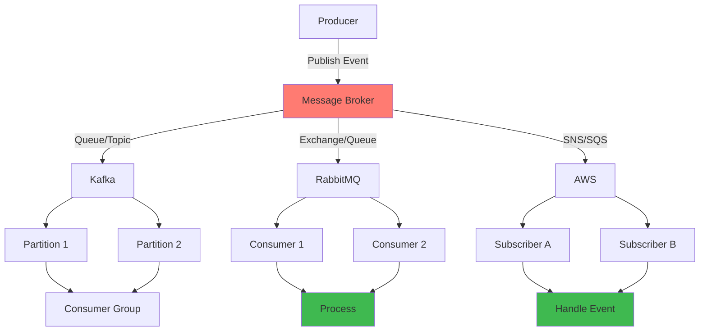
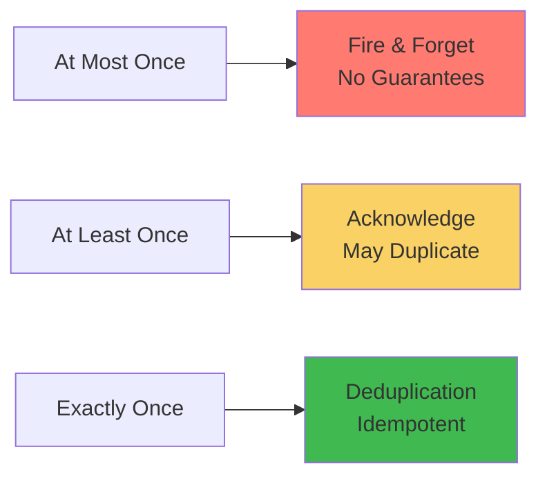

# 10 — Messaging & Streaming

The backbone of event-driven architecture. Covers message brokers, streaming platforms, event-driven patterns, message delivery semantics, idempotency, ordering guarantees, and their practical applications in building decoupled, scalable, and reliable distributed systems.

## Messaging Architecture Overview

## Message Delivery Patterns

## Table of Contents

- [Kafka](#kafka)
  - [Architecture](#architecture)
  - [Topics & Partitions](#topics--partitions)
  - [Producers](#producers)
  - [Consumers & Consumer Groups](#consumers--consumer-groups)
  - [Replication & Reliability](#replication--reliability)
  - [Kafka Connect](#kafka-connect)
  - [Kafka Streams](#kafka-streams)
  - [Schema Registry](#schema-registry)
  - [KRaft Mode](#kraft-mode)
  - [Performance Tuning](#performance-tuning)
  - [Monitoring](#monitoring)
- [RabbitMQ](#rabbitmq)
  - [Architecture](#architecture-1)
  - [Exchanges & Bindings](#exchanges--bindings)
  - [Queues](#queues)
  - [Publishers & Consumers](#publishers--consumers)
  - [Clustering & High Availability](#clustering--high-availability)
- [SNS / SQS](#sns--sqs)
  - [SQS (Simple Queue Service)](#sqs-simple-queue-service)
  - [SNS (Simple Notification Service)](#sns-simple-notification-service)
  - [Fan-Out Patterns](#fan-out-patterns)
  - [Dead-Letter Queues](#dead-letter-queues)
  - [FIFO Queues & Topics](#fifo-queues--topics)
- [Apache Pulsar](#apache-pulsar)
  - [Architecture](#architecture-2)
  - [Topics & Subscriptions](#topics--subscriptions)
  - [Replication](#replication)
  - [Pulsar Functions](#pulsar-functions)
  - [Pulsar IO](#pulsar-io)
- [Event-Driven Patterns](#event-driven-patterns)
  - [Event Sourcing](#event-sourcing)
  - [CQRS](#cqrs)
  - [Transactional Outbox](#transactional-outbox)
  - [Event Carried State Transfer](#event-carried-state-transfer)
  - [Dead Letter & Retry Patterns](#dead-letter--retry-patterns)
- [Message Delivery Semantics](#message-delivery-semantics)
  - [At-Most-Once](#at-most-once)
  - [At-Least-Once](#at-least-once)
  - [Exactly-Once](#exactly-once)
  - [Idempotency](#idempotency)
- [Ordering Guarantees](#ordering-guarantees)
  - [Partition-Level Ordering](#partition-level-ordering)
  - [Global Ordering](#global-ordering)
  - [Key-Based Ordering](#key-based-ordering)
- [Learning Path](#learning-path)
- [Cross-References](#cross-references)

---

## Kafka

The de facto event streaming platform. High-throughput, fault-tolerant, persistent, distributed commit log.

### Architecture

- **Brokers** — Kafka servers in a cluster; each broker handles data for some partitions; leader + follower per partition
- **Controller** — one broker acts as controller; manages partition leaders, cluster membership, topic operations; KRaft replaces ZooKeeper in modern deployments (KIP-500)
- **Cluster** — set of brokers identified by unique ID; topics spread across brokers; clients connect via bootstrap servers list
- **ZooKeeper (Legacy)** — stores cluster metadata, broker registry, controller election, topic configs; being replaced by KRaft (self-managed metadata quorum)
- **Metadata** — cluster metadata (configs, leaders, ISR) propagated via metadata requests (Kafka 2.8+) or ZooKeeper (older)

### Topics & Partitions

- **Topic** — logical name for a stream of records; partitioned for parallelism and scaling
- **Partition** — ordered, immutable sequence of records; each partition is a log (segments on disk); records within partition have monotonically increasing offsets
- **Partition Count** — determines max parallelism for consumer group; more partitions = higher throughput, but more files, higher leadership overhead
- **Segment** — partition is split into segments (configurable size/time); active segment for writes, older segments read-only; segments eventually deleted or compacted
- **Record** — key (optional, for partitioning), value, timestamp, headers, offset; serialized using serializer (String, Avro, Protobuf, JSON)
- **Compaction** — log cleanup policy: delete (retention-based, default) vs compact (retain latest record per key); enables key-based state reconstruction

### Producers

- **Publish** — producer sends records to topic; partitioner decides target partition (key hash, sticky partitioner for round-robin)
- **Acknowledgments (acks)** — 0 (fire-and-forget, fastest, can lose data), 1 (leader ack, default), -1/all (all in-sync replicas ack, slowest, safest)
- **Idempotent Producer** — enable.idempotence=true; producer assigns sequence numbers, broker deduplicates (avoids duplicates on retry); requires acks=all
- **Transactions** — atomic writes across multiple topics/partitions; beginTransaction, sendOffsetsToTransaction, commitTransaction; used for exactly-once semantics
- **Compression** — gzip, snappy, lz4, zstd; compresses batch at producer, decompressed at consumer; save bandwidth, more CPU
- **Batching** — linger.ms, batch.size; buffer batches for higher throughput; tradeoff: latency vs throughput
- **Retries** — retries config (default Integer.MAX_VALUE with delivery.timeout.ms); backoff (retry.backoff.ms); idempotent producers make retries safe

### Consumers & Consumer Groups

- **Consumer Group** — set of consumers that coordinate to consume from a topic; each partition is consumed by exactly one consumer in the group
- **Group Coordinator** — broker assigned to manage group membership + offset commits; heartbeats, partition assignment
- **Rebalance** — happens when consumer joins/leaves/fails; Eager (stop all, reassign), Cooperative (stop+rebalance incrementally, KIP-429)
- **Offset Management** — consumer commits offsets to __consumer_offsets internal topic; auto.commit (enable.auto.commit=true, interval ms) vs manual commit (commitSync/commitAsync)
- **Assignment Strategies** — range, round-robin, sticky, cooperative sticky; partition-aware assignors
- **Consumer Position** — seek (rewind), seekToBeginning, seekToEnd, offsetsForTimes (timestamp-based seek); useful for replay
- **Static Group Membership** — consumer with group.instance.id; avoids full rebalance on restart

### Replication & Reliability

- **Replication Factor** — number of copies of each partition; typical: 3 for production, 2 for lower durability
- **In-Sync Replicas (ISR)** — set of replicas that are fully caught up with the leader; min.insync.replicas for write guarantee
- **Unclean Leader Election** — elect a non-ISR replica as leader (data loss but availability); enable.unclean.leader.election=false (default, prefer consistency)
- **Preferred Leader** — elected when cluster first started; leader rebalance can redistribute leadership to balance load
- **Leader Election** — controlled shutdown (graceful, no data loss) vs unclean election (loss of data from non-synced replicas)
- **Data Retention** — time-based (log.retention.hours) and size-based (log.retention.bytes); cleanup policies (delete, compact)

### Kafka Connect

- **Source Connectors** — import data from external systems (database CDC, file, S3, JDBC, MQTT) into Kafka
- **Sink Connectors** — export data from Kafka to external systems (S3, HDFS, Elasticsearch, JDBC, Cassandra)
- **Standalone vs Distributed** — standalone (single process, worker config), distributed (cluster, auto-rebalancing, fault-tolerant)
- **Converters** — JSONConverter, AvroConverter, ProtobufConverter, StringConverter; schema support
- **Debezium** — CDC source connector for MySQL, PostgreSQL, MongoDB, SQL Server, Oracle, Db2; reads binlog/WAL, emits change events; uses Kafka Connect
- **Single Message Transforms (SMTs)** — lightweight transformations (rename, filter, mask, cast, drop, insert) in connector config

### Kafka Streams

- **Stream Processing Library** — lightweight, deploy in your app; no separate cluster needed; exactly-once semantics
- **KStream** — record stream; each record is independent; stateless operations (filter, map, flatMap, peek)
- **KTable** — changelog stream (keyed, latest value per key); stateful; stores (RocksDB, in-memory)
- **GlobalKTable** — fully replicated (entire table on each instance); for lookup joins
- **State Stores** — persistent (RocksDB) or in-memory; fault-tolerant via change log topics; interactive queries
- **Windowing** — tumbling, hopping, sliding, session; grace period; window stores for aggregations
- **Processor API** — lower-level API for custom processors; connect processors via topology; punctuator for timer-based operations
- **Topology** — DAG of processor nodes; scale by partitioning parallel tasks; thread model per stream task

### Schema Registry

- **Confluent Schema Registry** — central repository for Avro, Protobuf, JSON Schema; schema evolution, compatibility checks
- **Compatibility Types** — BACKWARD (new schema reads old), FORWARD (old reads new), FULL (both directions), NONE, BACKWARD_TRANSITIVE, FORWARD_TRANSITIVE, FULL_TRANSITIVE
- **Serdes** — AvroSerde, ProtobufSerde, JSONSchemaSerde; wire format includes schema ID (1-4 byte magic byte prefix)
- **Karapace** — open-source alternative to Confluent Schema Registry; Avro + Protobuf + JSON Schema

### KRaft Mode

- **Self-Managed Metadata Quorum** — replaces ZooKeeper with internal Raft-based metadata quorum (KIP-500)
- **Controller Quorum** — Raft-based; metadata topic stores cluster configs, topics, partitions, brokers
- **Benefits** — simpler architecture (no ZK), easier operations, faster metadata operations, no ZooKeeper scaling limits
- **Status** — production-ready in Kafka 3.x (KIP-833); migration from ZooKeeper mode supported
- **Broker Roles** — controller (metadata quorum node), broker (data plane), combined (both roles)

### Performance Tuning

- **Producers** — batch.size, linger.ms, compression (zstd best compression, lz4 fast), buffer.memory, max.in.flight.requests.per.connection; partition count for throughput
- **Brokers** — num.network.threads, num.io.threads, socket.send/receive buffers; log.segment.bytes, log.segment.delete.delay.ms; page cache tuning (OS)
- **Consumers** — fetch.min/max bytes, fetch.max.wait.ms, max.partition.fetch.bytes; Session timeout for rebalancing
- **OS Tuning** — page cache (unused memory for OS cache), disk (multiple disks for log dirs, RAID 10, SSD), network
- **Disk** — sequential I/O (rotation, read-ahead); SSD or NVMe for high-throughput; avoid NFS
- **Monitoring** — broker metrics (bytes-in/out, request rate, partition count, ISR shrinks), consumer lag, producer error rate

### Monitoring

- **Key Metrics** — UnderReplicatedPartitions, OfflinePartitions, ISRShrinks/Expands, TotalTimeMs (request), MessagesInPerSec, BytesIn/OutPerSec, RequestQueueSize
- **Consumer Lag** — difference between latest offset and consumer offset; Burrow (LinkedIn) for lag monitoring; Kafka Lag Exporter; Prometheus + Grafana
- **Cruise Control** — automated cluster rebalancing (partition reassignment, leadership balancing, disk balancing); anomaly detection, self-healing
- **Confluent Control Center** — commercial UI, topic management, consumer monitoring, schema registry, Kafka Connect management

---

## RabbitMQ

Mature, widely-used message broker. Supports multiple protocols (AMQP 0-9-1, MQTT, STOMP, HTTP).

### Architecture

- **Broker** — central server; accepts connections, routes messages, manages queues
- **Virtual Host (vhost)** — isolated namespace (topics, exchanges, queues, bindings, permissions)
- **Connections** — long-lived TCP connections; multiplexed into channels (lightweight connections over a single TCP)
- **Channels** — each connection can have many channels; AMQP operations happen on channels
- **Management** — management plugin (web UI + HTTP API); command-line tool (rabbitmqctl)

### Exchanges & Bindings

- **Direct Exchange** — routing key = binding key (exact match); point-to-point message routing
- **Topic Exchange** — routing key pattern match (words separated by dots, * matches one word, # matches zero or more)
- **Fanout Exchange** — broadcast to all bound queues (ignores routing key)
- **Headers Exchange** — routing based on message header attributes (ignores routing key)
- **Default Exchange** — direct exchange with empty name; queues are bound automatically with queue name as routing key
- **Alternate Exchange** — routes unroutable messages to alternate exchange (dead letter, unhandled)

### Queues

- **Properties** — durable (survive broker restart), exclusive (connection-only), auto-delete (when last consumer unsubscribes)
- **Message TTL** — per-queue (x-message-ttl) and per-message (expiration); expired messages moved to dead letter or dropped
- **Queue Length Limit** — max-length, max-length-bytes; overflow behavior (drop-head, reject-publish, reject-publish-dlx)
- **Priority Queues** — priority values (0-255); messages with higher priority are consumed first
- **Lazy Queues** — messages written to disk immediately; lower RAM usage, higher latency; for long queues
- **Quorum Queues** — Raft-based replicated queue; strong consistency, data safety; replaces mirrored queues (deprecated in favor of quorum)
- **Stream Queues** — immutable append-only log; consumers can read from any point; offset tracking; for replay, large fan-out

### Publishers & Consumers

- **Publisher Confirms** — producer gets ack from broker; guarantees at-least-once delivery; channel.confirmSelect()
- **Consumer ACKs** — basic.ack (success), basic.nack (fail, requeue or dead-letter), basic.reject (single message); auto ack vs manual ack
- **Prefetch Count** — qos/prefetch; number of unacknowledged messages sent to consumer; important for fair dispatch
- **Consumer Cancel** — consumer cancellation notification; broker notifies consumer when queue is deleted
- **Dead Letter Exchange (DLX)** — message from DLQ routed to alternate exchange; dead letter reason header (max retries, TTL expired, rejected, queue length exceeded)

### Clustering & High Availability

- **Cluster** — nodes connected via Erlang clustering; queues, exchanges, bindings shared; metadata replicated, queues placed on one node (default)
- **Quorum Queues** — Raft consensus across nodes; min nodes 3, recommended 5; automatic leader election; network partition handling (pause-minority, autoheal)
- **Federation** — loosely-coupled; upstream exchange/queue → federation link → downstream exchange; for multi-site replication
- **Shovel** — configurable message mover; source → shovel → destination; can connect different clusters/clouds
- **Performance** — Erlang VM (BEAM); per-queue throughput depends on persistence, ack mode, and queue type

---

## SNS / SQS

AWS's managed messaging services. Tightly integrated with the AWS ecosystem.

### SQS (Simple Queue Service)

- **Standard Queue** — at-least-once, best-effort ordering, high throughput (unlimited TPS); use when duplicates and reordering are acceptable
- **FIFO Queue** — exactly-once (deduplication ID), strict first-in-first-out, limited to 300 TPS (3000 with batching); .fifo suffix
- **Visibility Timeout** — after consumer receives message, it becomes hidden; if consumer doesn't delete within timeout, message reappears (for retry)
- **Long Polling** — wait for messages to arrive (up to 20 sec); reduces empty responses (polling cost)
- **Delay Queue** — initial delay before messages become available (0-900 sec)
- **Dead-Letter Queue** — messages that exceed maxReceiveCount moved to DLQ; use separate queue as DLQ; set redrive policy
- **Message Attributes** — metadata (name, type, value); attributes can be used for filtering in SNS subscriptions
- **Server-Side Encryption** — SSE with KMS (SQS managed keys or customer CMK)
- **Queue Types Comparison** — Standard (nearly unlimited TPS, best-effort ordering, at-least-once), FIFO (3000 TPS batch, strict ordering, exactly-once)

### SNS (Simple Notification Service)

- **Topic** — pub/sub endpoint; publishers send to topic, subscribers receive via chosen protocol
- **Subscriptions** — HTTP/HTTPS, SQS, Lambda, email, SMS, mobile push, platform application endpoint
- **Message Filtering** — subscription filter policy (message attributes matching); reduces duplicate processing
- **Message Attributes** — metadata for filtering, routing, and processing
- **FIFO Topics** — strict ordering, exactly-once delivery to FIFO SQS subscribers; requires .fifo suffix
- **Message Archiving** — store all messages published to topic; replay by time range
- **Raw Message Delivery** — HTTP/SQS subscribers can receive messages without JSON envelope
- **Delivery Policies** — retry policy, dead-letter queue for HTTP/SQS; exponential backoff

### Fan-Out Patterns

- **SNS + SQS Fan-Out** — publish once to SNS topic → multiple SQS queues subscribe → each queue processed independently; same message goes to multiple services
- **SNS + Lambda Fan-Out** — multiple Lambda functions subscribe to same SNS topic; each receives every message
- **SNS Filtering** — use subscription filter policies so each subscriber only receives relevant messages
- **S3 Event Notifications** — S3 → SNS → SQS/Lambda/HTTP; for async S3 event processing

### Dead-Letter Queues

- **SQS DLQ** — after maxReceiveCount attempts, message redirected to DLQ
- **SNS DLQ** — undeliverable messages (bad endpoints, rejected) redirected to DLQ
- **Redrive** — DLQ → source queue redrive (move messages back for reprocessing)
- **Monitoring** — ApproximateNumberOfMessagesVisible for DLQ; alarm when DLQ has messages

### FIFO Queues & Topics

- **SQS FIFO** — `.fifo` suffix; exactly-once via deduplication ID; message ordering per message group ID; 300 TPS base (3,000 with batching of 10)
- **SNS FIFO** — `.fifo` suffix; strict ordering delivery to one or more FIFO SQS queues; message group ID required; content-based deduplication or explicit deduplication ID
- **Deduplication** — content-based (SHA-256 hash of message body) or explicit (MessageDeduplicationId)
- **Message Group ID** — messages within same group are delivered in order; different groups are independent

---

## Apache Pulsar

Unified messaging and streaming platform. Uses a separate storage layer (BookKeeper) for scalability.

### Architecture

- **Components** — Pulsar broker (serving layer), Apache BookKeeper (persistent storage), ZooKeeper (metadata + coordination)
- **Broker** — handles producer/consumer connections; no local storage; transparently routes messages to BookKeeper
- **BookKeeper** — distributed write-ahead log; segments (ledgers) stored by bookies; each entry replicated (Ensemble > Write Quorum > Ack Quorum); rack-aware placement
- **Segments (Ledgers)** — BookKeeper segments; Pulsar topics consist of segments stored across bookies; segment-oriented storage enables fast catch-up reads and tiered storage
- **Offload to Tiered Storage** — older segments offloaded to S3/GCS/ Azure Blob; infinite retention without local disk constraint

### Topics & Subscriptions

- **Topic** — partitioned (scale across brokers) or non-partitioned; fully managed routing
- **Subscriptions** — Exclusive (single consumer), Shared (round-robin), Failover (one active, multiple standbys), Key_Shared (key-based ordering)
- **Cursors** — per-subscription cursor tracks consumer position; durable (BookKeeper) or non-durable
- **Message Retention** — time-based (broker: retention.ms) and size-based; backlog quota policy (producer block, oldest, expire)
- **Deduplication** — broker-level deduplication (producer name + sequence ID); prevents duplicates in broker

### Replication

- **Geo-Replication** — cross-region asynchronous replication; configured per topic; producer writes to local cluster → broker replicates to remote clusters
- **Replication Model** — native Pulsar async replication (no external MirrorMaker); replication follows subscription cursors
- **Replicator** — per-topic replicator within broker; shadow producers in remote clusters

### Pulsar Functions

- Lightweight compute at the messaging layer; process each message (filter, transform, enrich, route)
- **Processors** — Java, Python, Go functions; run within Pulsar (no separate cluster)
- **State** — state store (BookKeeper-backed); counters, key-value state; exactly-once semantics
- **Windowing** — sliding, tumbling, session windows for functions; triggers based on count/time
- **Function Mesh** — chaining functions (output of one → input of next); DAG topology

### Pulsar IO

- **Source** — import data from external systems (Debezium CDC, Mongo, JDBC, Netty, Kafka) into Pulsar
- **Sink** — export data to external systems (Elasticsearch, JDBC, HBase, S3, Cassandra)
- **Connectors** — pre-built connectors for common sources/sinks; customizable via schema

---

## Event-Driven Patterns

### Event Sourcing

- Store all state changes as an event log; current state derived by replaying events; event store is the source of truth
- **Benefits** — complete audit trail, temporal query, reconstruct past states, event-driven integrations
- **Challenges** — schema evolution, event versioning, event store querying, snapshot for performance
- **Event Store** — Kafka (compact topic per entity), EventStoreDB, Axon Server; PostgreSQL as event store (for simple cases)
- **Snapshots** — periodic snapshots of current state; reduce replay time; stored in event store or separate cache

### CQRS

Command Query Responsibility Segregation. Separate read and write models.

- **Commands** — change state; validated, authorized; write model (command handler, aggregate); result: events
- **Queries** — read data; no side effects; read model (optimized materialized view, denormalized)
- **Implementation** — write side → events → read side (materialize view); read side can use different storage (Elasticsearch, Redis, PostgreSQL)
- **When to use** — complex domain, different read/write workloads, high read throughput, team scaling

### Transactional Outbox

(Early covered in [Distributed Systems — Transactional Outbox](../09-distributed-systems/#transactional-outbox))

Ensures DB write + message publish atomic: write to outbox table in same transaction → relay outbox → publish to broker → delete.

### Event Carried State Transfer

- Include relevant data in the event payload (not just IDs); reduces chattiness (no need for follow-up queries)
- **Benefits** — consumers have data locally, fewer service calls, lower latency, resilience
- **Risks** — data duplication, stale data, event size growth

### Dead Letter & Retry Patterns

- **Fixed Retry** — retry N times with fixed delay; simple, can cause thundering herd
- **Exponential Backoff** — delay doubles with each retry; must cap max delay and randomize (jitter)
- **Dead Letter Queue** — messages beyond max retries go to DLQ; DLQ alerts trigger human investigation; DLQ can be consumed for re-processing after fix
- **Retry Queues** — dedicated queue for retry messages; check TTL, re-publish to main queue after delay (RabbitMQ: TTL + DLX)

---

## Message Delivery Semantics

### At-Most-Once

- Message sent once, no retries; may lose messages but no duplicates
- **Use Cases** — monitoring metrics, telemetry, loss-tolerant notifications
- **Kafka** — acks=0 (fire-and-forget)
- **SQS** — not applicable (SQS always retries on failure, but consumer can not retry on error)

### At-Least-Once

- Messages may be retried and delivered more than once; no data loss
- **Kafka** — acks=1 or all, producer retries; consumer processes then commits offset
- **RabbitMQ** — publisher confirms + consumer manual ack
- **SQS** — standard queue (default); VisibilityTimeout ensures message reappears if not deleted
- **Implementation** — consumer must handle duplicates (idempotent processing)

### Exactly-Once

- Each message processed exactly once; no duplicates, no data loss
- **Kafka** — idempotent producer + transactions + consumer transaction isolation or idempotent sink; EOS requires careful configuration (transactional.id, isolation.level=read_committed)
- **FIFO SQS** — deduplication ID prevents duplicates; message group ID ensures ordering
- **RabbitMQ** — quorum queues + publisher confirms + manual ack + idempotent consumer (eventual exactly-once)
- **Pulsar** — broker-level deduplication + exactly-once sinks
- **Important** — true end-to-end exactly-once requires source, processing, and sink coordination

### Idempotency

- **Consumer-Side** — deduplication key in message; store processed message IDs (database unique constraint, Redis SET); skip replay
- **Idempotency Key** — client generates unique key; server stores key + response; replay returns same response (Stripe model)
- **Database Upserts** — INSERT ... ON CONFLICT DO NOTHING; dedup by (topic, partition, offset) or business key
- **Kafka Idempotent Producer** — producer assigns sequence per partition; broker deduplicates

---

## Ordering Guarantees

### Partition-Level Ordering

- **Kafka** — ordering guaranteed within a partition; producer sends messages to same partition (key-based) → same order as produced
- **Kafka Streams** — records per key processed in order within partition
- **SQS FIFO** — ordering per message group ID
- **Pulsar Key_Shared** — ordering per key
- **Tradeoff** — more partitions = more parallelism = less ordering scope

### Global Ordering

- **Kafka** — single partition topic (loses parallelism); rarely used due to throughput limit
- **SQS FIFO** — single message group ID (300 TPS limit)
- **RabbitMQ** — single queue (consumers in sequence)
- **Practical** — partition-level ordering is usually sufficient; key-based partitioning groups related events

### Key-Based Ordering

- Events with same key go to same partition; related events processed in order by partition
- **Key Selection** — choose key that groups related messages (user ID, order ID, session ID)
- **Hot Keys** — one key with much more data than others; causes partition skew; random salt/number partitioning with aggregation

---

## Learning Path

1. **Stage 1** — Messaging fundamentals: pub/sub, queues, point-to-point vs pub/sub, push vs pull
2. **Stage 2** — One broker in depth: Kafka (recommended) or RabbitMQ; understand architecture, produce/consume, topics/queues, persistence
3. **Stage 3** — Advanced Kafka: Kafka Connect, Kafka Streams, schema registry, exactly-once semantics, performance tuning
4. **Stage 4** — Event-driven architecture: event sourcing, CQRS, transactional outbox, idempotency patterns, multi-broker integration
5. **Stage 5** — Comparison & selection: when to use Kafka vs RabbitMQ vs SQS/SNS vs Pulsar; tradeoffs (ordering, latency, throughput, durability)

---

## Cross-References

| Domain | Connection |
|--------|-----------|
| [01 — AI/ML](../01-ai-ml/) | Event streams for ML feature computation, streaming inference, event-driven AI pipelines |
| [02 — Data Engineering](../02-data-engineering/) | Kafka is the backbone of data engineering; streaming ETL, CDC, data pipeline triggers |
| [03 — Backend](../03-backend/) | Microservice async communication, event-driven backend services, task queues |
| [05 — Cloud](../05-cloud/) | SQS/SNS (AWS), Pub/Sub (GCP), Azure Service Bus; managed messaging services on cloud |
| [06 — DevOps](../06-devops/) | CI/CD event triggers, pipeline notification, deployment events via messaging |
| [08 — Databases](../08-databases/) | CDC (Debezium streaming DB changes), transactional outbox, database event triggers |
| [09 — Distributed Systems](../09-distributed-systems/) | Distributed log as replicated state machine, partitioned processing, exactly-once semantics |

## Related

- [Cap Consistency](09-distributed-systems/01-cap-consistency.md)
- [Consensus Replication](09-distributed-systems/01-consensus-replication.md)
- [Consensus Raft](09-distributed-systems/02-consensus-raft.md)
- [Distributed Transactions](09-distributed-systems/02-distributed-transactions.md)
- [Distributed Caching](09-distributed-systems/03-distributed-caching.md)
- [Distributed Storage](09-distributed-systems/03-distributed-storage.md)
