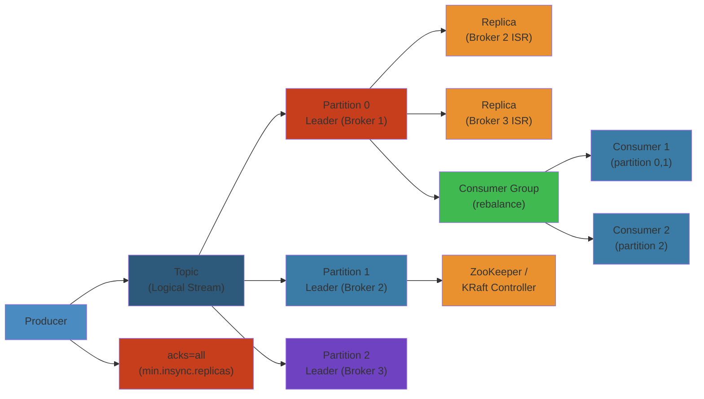
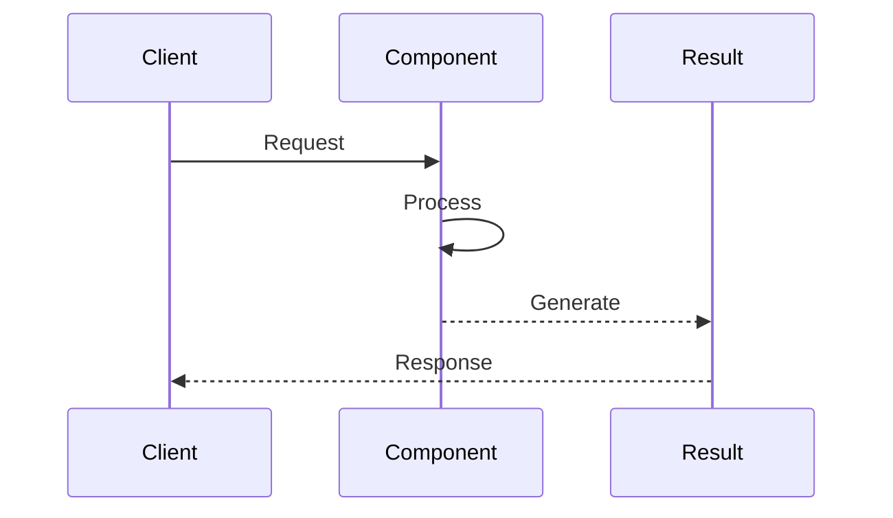
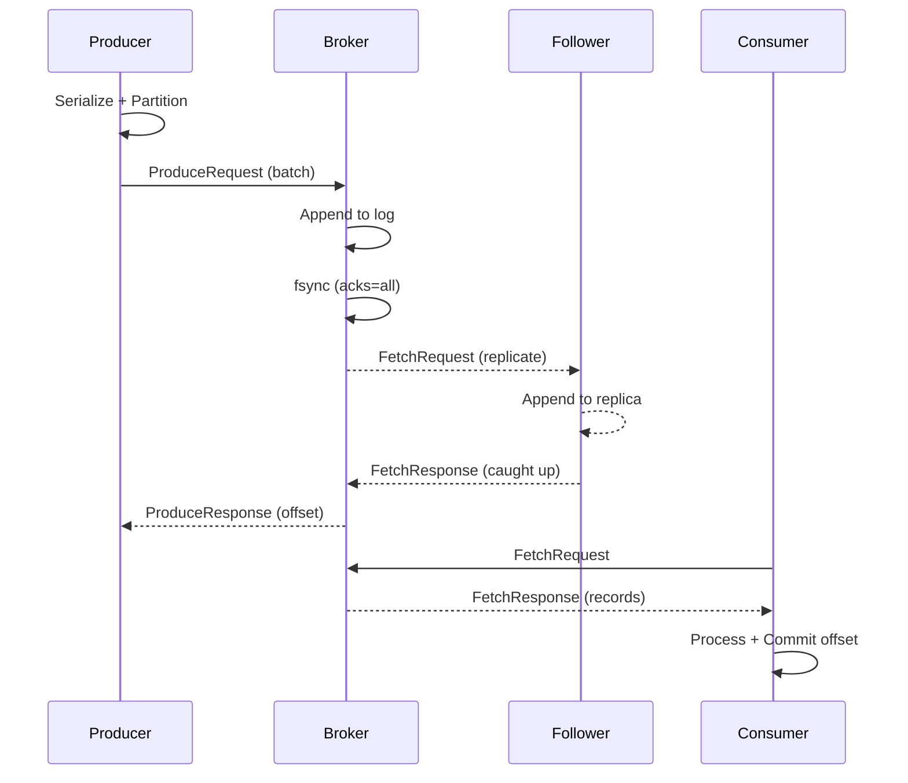

# 📨 Apache Kafka — Complete Deep Dive

**Related**: [Production Patterns](02-kafka-patterns.md) · [RabbitMQ](../rabbitmq/01-rabbitmq-basics.md) · [SNS/SQS](../sns-sqs/01-sns-sqs-basics.md)

---




## Table of Contents

- [What is Kafka?](#-what-is-kafka)
- [1. Core Concepts](#1-core-concepts)
- [2. Topics & Partitions](#2-topics--partitions)
- [3. Producers](#3-producers)
- [4. Consumers & Consumer Groups](#4-consumers--consumer-groups)
- [5. Replication & ISR](#5-replication--isr)
- [6. Leader Election](#6-leader-election)
- [7. Delivery Semantics (Acks)](#7-delivery-semantics-acks)
- [8. Idempotent Producers](#8-idempotent-producers)
- [9. Log Compaction & Retention](#9-log-compaction--retention)
- [10. Partitioning Strategies](#10-partitioning-strategies)
- [11. Consumer Rebalancing](#11-consumer-rebalancing)
- [12. Kafka Connect](#12-kafka-connect)
- [13. Kafka Streams](#13-kafka-streams)
- [14. Exactly-Once Semantics](#14-exactly-once-semantics)
- [15. KRaft Mode](#15-kraft-mode)
- [16. Tiered Storage](#16-tiered-storage)
- [17. Schema Registry](#17-schema-registry)
- [18. REST Proxy](#18-rest-proxy)
- [19. Performance Tuning](#19-performance-tuning)
- [20. Security](#20-security)
- [Simplest Mental Model](#-simplest-mental-model)

---

## 🧭 What is Kafka?



---

## 1. Core Concepts

| Concept | Description |
|---------|-------------|
| **Event** | Key-value with timestamp and headers |
| **Topic** | Logical channel for events |
| **Partition** | Ordered, immutable sequence within a topic |
| **Broker** | Server storing partitions |
| **Producer** | Publishes events to topics |
| **Consumer** | Subscribes and reads events |
| **Consumer Group** | Coordinated consumers reading a topic |
| **Offset** | Unique record ID within a partition |
| **ISR** | In-Sync Replicas — caught up with leader |

#### Step-by-Step

1. **Producer serializes** the event (key-value) and determines target partition using a partitioner
2. **Batch accumulation** occurs in producer memory until `batch.size` or `linger.ms` is reached
3. **Compression** is applied (snappy, gzip, lz4, or zstd) to reduce network I/O
4. **Leader broker receives** the batch and appends to partition log sequentially
5. **Replicas fetch** from leader and apply the same records in order
6. **Acknowledgment** is sent back based on `acks` setting (0, 1, or all)

#### Code Example

```python
# Python Kafka producer core concepts
from kafka import KafkaProducer
import json

producer = KafkaProducer(
    bootstrap_servers=['localhost:9092'],
    value_serializer=lambda v: json.dumps(v).encode('utf-8'),
    acks='all',  # Wait for all ISR replicas
    retries=3,
    linger_ms=10  # Batch messages for 10ms
)

# Send event with key (determines partition)
future = producer.send('orders', key='user-123', value={'order_id': 456, 'amount': 99.99})
try:
    metadata = future.get(timeout=10)
    print(f"Sent to partition {metadata.partition}, offset {metadata.offset}")
except Exception as e:
    print(f"Failed: {e}")

producer.flush()
producer.close()
```

#### Real-World Scenario

At Uber, Kafka handles 4 trillion events/day. Each event (ride request, location, payment) goes to a topic with partitions distributed across data centers. When a broker fails, replicas in the ISR automatically take over—the ride doesn't stop.

---

## 2. Topics & Partitions

```text
Partitions = unit of parallelism:

  Topic "orders" (3 partitions):
  ┌──────────────────────────────────────┐
  │ P0: [o1, o4] │ P1: [o2, o5] │ P2: [o3, o6, o7] │
  └──────────────────────────────────────┘
```

Ordered and immutable. Partitions can be increased but never decreased.

```yaml
partitions: 6
replication.factor: 3
retention.ms: 604800000
min.insync.replicas: 2
cleanup.policy: delete
```

### Step-by-Step

1. **Topic creation** defines immutable partition count and replication factor
2. **Partitioner function** hashes the key and maps to a partition index (hash % num_partitions)
3. **Records append** to the leader partition's log sequentially with monotonic offset numbers
4. **Replicas sync** by fetching from leader and writing locally in the same order
5. **Consumer offset tracking** records read position per partition in the `__consumer_offsets` topic
6. **Partition expansion** adds new partitions (old records stay in original partitions indefinitely)

### Code Example

```go
// Go example: Kafka topic partition mechanics
package main

import (
	"fmt"
	"github.com/segmentio/kafka-go"
)

func main() {
	// Create a writer targeting a topic (partitioner chooses partition)
	w := kafka.NewWriter(kafka.WriterConfig{
		Brokers:   []string{"localhost:9092"},
		Topic:     "orders",
		Balancer:  &kafka.Hash{}, // Hash balancer: uses key for consistent partitioning
		MaxBytes:  1000000,        // Max batch size in bytes
	})

	// Send messages; key-based routing sends same key to same partition
	messages := []kafka.Message{
		{Key: []byte("user-1"), Value: []byte("order-100")},
		{Key: []byte("user-1"), Value: []byte("order-101")}, // Same partition as user-1
		{Key: []byte("user-2"), Value: []byte("order-200")}, // Different partition
	}

	err := w.WriteMessages(nil, messages...)
	if err != nil {
		panic(err)
	}

	w.Close()
	fmt.Println("All messages routed by partition key")
}
```

### Real-World Scenario

LinkedIn's Kafka cluster uses 8-16 partitions per topic for high-throughput streams. When scaling, they increase partitions without reprocessing: old partitions serve existing consumers, new partitions onboard new consumers. This avoids the "rebalance thundering herd" problem where all consumers pause simultaneously.

---

## 3. Producers

Flow: Serialize → Partition → Batch → Compress → Send to leader.

```java
Properties props = new Properties();
props.put("bootstrap.servers", "broker1:9092,broker2:9092");
props.put("key.serializer", "org.apache.kafka.common.serialization.StringSerializer");
props.put("value.serializer", "org.apache.kafka.common.serialization.StringSerializer");
props.put("acks", "all");
props.put("linger.ms", 5);
props.put("batch.size", 32768);
props.put("compression.type", "snappy");
props.put("enable.idempotence", true);

KafkaProducer<String, String> producer = new KafkaProducer<>(props);
producer.send(new ProducerRecord<>("orders", "key-1", "value-1"),
    (metadata, exception) -> {
        if (exception != null) log.error("Send failed", exception);
    });
producer.flush();
producer.close();
```

| Config | Default | Description |
|--------|---------|-------------|
| `acks` | `1` | Acknowledgement mode |
| `linger.ms` | `0` | Wait to fill batch |
| `batch.size` | `16384` | Max bytes per batch |
| `compression.type` | `none` | gzip, snappy, lz4, zstd |
| `enable.idempotence` | `false` | Exactly-once producer |
| `max.in.flight.requests` | `5` | Unacknowledged requests |

### Step-by-Step

1. **Serialization** converts key and value objects to bytes using configured serializers
2. **Partitioner selection** maps the key hash to a partition (0 to num_partitions-1)
3. **Batch buffer accumulation** holds messages in producer's memory until batch.size bytes or linger.ms elapses
4. **Compression** is applied (snappy, gzip, lz4) to reduce network bandwidth
5. **Leader write** appends batch atomically to the partition log
6. **Callback invocation** returns metadata (partition, offset) or exception to the producer

### Code Example

```bash
#!/bin/bash
# Bash/curl example: Kafka producer via REST Proxy
set -e

PROXY_URL="http://localhost:8082"
TOPIC="orders"

# Send a single message
curl -X POST "$PROXY_URL/topics/$TOPIC" \
  -H "Content-Type: application/vnd.kafka.json.v2+json" \
  -d '{
    "records": [
      {
        "key": "user-123",
        "value": {"order_id": "ord-456", "amount": 99.99, "timestamp": "'$(date +%s)'"} 
      }
    ]
  }' | jq '.offsets[0]'

echo "Message sent to partition $(jq '.offsets[0].partition' <<< $RESPONSE), offset $(jq '.offsets[0].offset' <<< $RESPONSE)"
```

### Real-World Scenario

Twitter's producer service handles 500K tweets/second. Each producer batches messages for 5ms before sending, achieving 100Mbps throughput. When a broker goes down, idempotent producers with enable.idempotence=true automatically retry without duplicating tweets—critical for feed consistency.

---

## 4. Consumers & Consumer Groups

```text
Partition assignment (3 consumers, 6 partitions):
  C1: P0,P3   C2: P1,P4   C3: P2,P5
  Each partition → exactly ONE consumer in a group.
```

Offsets track read position in `__consumer_offsets` topic.

| Config | Default | Description |
|--------|---------|-------------|
| `group.id` | `null` | Consumer group name |
| `enable.auto.commit` | `true` | Periodic offset commit |
| `auto.offset.reset` | `latest` | earliest, latest, none |
| `session.timeout.ms` | `45000` | Heartbeat timeout |
| `max.poll.records` | `500` | Records per poll() |
| `isolation.level` | `read_uncommitted` | Use read_committed for EOS |

```javascript
const consumer = kafka.consumer({ groupId: "order-processors" });
await consumer.connect();
await consumer.subscribe({ topic: "orders", fromBeginning: false });
await consumer.run({
    eachMessage: async ({ message, heartbeat }) => {
        await processOrder(message.value);
        await heartbeat();
    },
});
```

### Step-by-Step

1. **Consumer joins group** via group coordinator broker, triggering rebalance
2. **Assignment strategy** (range, roundrobin, sticky) divides partitions among consumers
3. **Offset fetch** reads last committed offset from `__consumer_offsets` topic
4. **Poll and fetch** retrieves up to max.poll.records from assigned partitions
5. **Process messages** synchronously or asynchronously (must call heartbeat() within session.timeout.ms)
6. **Offset commit** records progress (auto or manual) for resumption after restart

### Code Example

```python
# Python consumer with manual offset management
from kafka import KafkaConsumer, OffsetAndMetadata
from kafka.structs import TopicPartition
import json

consumer = KafkaConsumer(
    'orders',
    bootstrap_servers=['localhost:9092'],
    group_id='order-processors',
    enable_auto_commit=False,  # Manual commits for exactly-once
    auto_offset_reset='earliest',
    value_deserializer=lambda m: json.loads(m.decode('utf-8'))
)

for message in consumer:
    try:
        order = message.value
        print(f"Processing order {order['id']}")
        # Process the order...
        process_order(order)
        
        # Commit offset only after successful processing
        tp = TopicPartition(message.topic, message.partition)
        offsets = {tp: OffsetAndMetadata(message.offset + 1, "committed")}
        consumer.commit(offsets=offsets)
        print(f"Offset {message.offset} committed")
    except Exception as e:
        print(f"Error: {e}, not committing offset")
        # Retry will start from last committed offset
```

### Real-World Scenario

Netflix uses consumer groups for parallel processing: a single "recommendations" topic with 100 partitions feeds 10 consumer instances, each handling 10 partitions. When an instance crashes, the remaining 9 instances rebalance and assume its partitions within seconds—recommendations don't stall.

---

## 5. Replication & ISR

```text
RF=3: 1 leader + 2 followers on different brokers.

  Broker 1 (Leader)  Broker 2 (ISR ✓)  Broker 3 (ISR ✗ lag)
  offset=100         offset=99         offset=80

A replica is in-sync if caught up within replica.lag.time.max.ms (30s).
```

```yaml
default.replication.factor: 3
min.insync.replicas: 2
replica.lag.time.max.ms: 30000
unclean.leader.election.enable: false
```

### Step-by-Step

1. **Partition leadership** is assigned to a broker; follower replicas on other brokers fetch from it
2. **Fetch loop** followers continuously fetch new records from the leader's log
3. **In-sync tracking** broker monitors replica.lag.time.max.ms; lag > 30s removes replica from ISR
4. **ACK threshold** producer waits for min.insync.replicas acknowledgments before returning success
5. **Leader failure detection** controller notices leader unresponsive after heartbeat timeout
6. **Leader election** promotes highest replica in ISR to become new leader (if unclean.leader.election.enable=false)

### Code Example

```c
// C example: Monitoring ISR state via broker metrics
#include <stdio.h>
#include <librdkafka/rdkafka.h>

void print_replica_lag(rd_kafka_t *rk) {
    // Librdkafka exposes broker metadata
    rd_kafka_metadata_t *metadata;
    
    int err = rd_kafka_metadata(rk, 0, NULL, &metadata, 5000);
    if (err) {
        fprintf(stderr, "Failed to fetch metadata: %s\n", rd_kafka_err2str(err));
        return;
    }
    
    // Iterate through partitions and their ISR
    for (int i = 0; i < metadata->topic_cnt; i++) {
        const rd_kafka_metadata_topic_t *t = &metadata->topics[i];
        
        for (int j = 0; j < t->partition_cnt; j++) {
            const rd_kafka_metadata_partition_t *p = &t->partitions[j];
            
            printf("Topic: %s, Partition: %d, Leader: %d, ISR count: %d\n",
                   t->topic, p->id, p->leader, p->isr_cnt);
            
            // ISR = in-sync replicas
            for (int k = 0; k < p->isr_cnt; k++) {
                printf("  ISR Replica[%d]: broker %d\n", k, p->isrs[k]);
            }
        }
    }
    
    rd_kafka_metadata_destroy(metadata);
}
```

### Real-World Scenario

At Stripe, a partition with RF=3 had one replica fall behind due to GC pause. After 35 seconds, it was removed from ISR (replica.lag.time.max.ms=30s). With min.insync.replicas=2, writes still succeeded to the remaining 2 ISR members. When that lagged replica recovered, it caught up and rejoined ISR—no data loss, transparent recovery.

---

## 6. Leader Election

On leader failure, controller elects a new leader from ISR.

- 3 replicas, 2 ISR → writes succeed
- 3 replicas, 1 ISR → writes FAIL (NotEnoughReplicasException)
- 3 replicas, 0 ISR → unavailable

`unclean.leader.election.enable=true` allows electing out-of-sync replicas (data loss risk).

### Step-by-Step

1. **Broker heartbeat loss** controller detects leader unresponsive (zookeeper.session.timeout.ms)
2. **ISR validation** controller identifies highest-offset replica still in ISR
3. **Election announcement** new leader is elected and metadata is updated
4. **Broker notification** all brokers update their metadata cache
5. **Recovery** partitions transition from URP (Under-Replicated) back to fully replicated
6. **Client redirect** producers/consumers learn new leader and reconnect

### Code Example

```bash
#!/bin/bash
# Monitoring leader elections and ISR changes using kafka-topics.sh

BROKERS="localhost:9092"
TOPIC="critical-orders"

# Watch for ISR changes and replica status
kafka-topics.sh --bootstrap-server $BROKERS --describe --topic $TOPIC | while IFS= read -r line; do
    echo "$line"
    
    # Parse ISR from output (format: Leader: X  Replicas: Y,Z,W  Isr: A,B)
    if [[ $line =~ Isr:\ ([0-9,]+) ]]; then
        isr="${BASH_REMATCH[1]}"
        isr_count=$(echo "$isr" | tr ',' '\n' | wc -l)
        
        if [ "$isr_count" -lt 3 ]; then
            echo "[WARNING] ISR degraded to $isr_count replicas"
        fi
    fi
done
```

### Real-World Scenario

Amazon's ElastiCache Kafka cluster had a broker crash in us-east-1a. Within 300ms, the controller detected heartbeat loss and elected a new leader from the 2 remaining ISR brokers. Writes continued with acks=all (waiting for 2 replicas). When the failed broker restarted 2 minutes later, it rejoined ISR automatically and caught up with the leader's log—customers saw zero disruption.

---

## 7. Delivery Semantics (Acks)

| acks | Behavior | Use Case |
|------|----------|----------|
| `0` | Fire-and-forget, no response | Metrics, logs |
| `1` | Leader confirms write (default) | General |
| `all` | All ISR confirm | Financial, critical |

`acks=all` is safest. No data loss as long as `min.insync.replicas > 1`.

### Step-by-Step

1. **acks=0**: Producer sends and does NOT wait; packet loss = silent data loss
2. **acks=1**: Leader writes to disk, sends ACK; follower replicas fetch asynchronously
3. **acks=all**: Leader waits for min.insync.replicas confirmations before sending ACK
4. **Broker-side**: Each in-sync replica writes and flushes before confirming to leader
5. **Timeout handling**: Producer retries if ACK not received within request.timeout.ms
6. **Durability guarantee**: With RF=3, min.insync.replicas=2, acks=all guarantees survival of 1 broker failure

### Code Example

```go
// Go example: Kafka producer acks behavior
package main

import (
	"fmt"
	"github.com/segmentio/kafka-go"
)

func main() {
	configs := map[string]int{
		"acks=0 (fire-and-forget)":        0,
		"acks=1 (leader only)":            1,
		"acks=-1/all (all ISR replicas)": -1,
	}

	for desc, acksValue := range configs {
		writer := kafka.NewWriter(kafka.WriterConfig{
			Brokers:     []string{"localhost:9092"},
			Topic:       "orders",
			RequiredAcks: kafka.RequiredAcks(acksValue),
			Compression: kafka.Snappy,
		})

		msg := kafka.Message{
			Key:   []byte("order-1"),
			Value: []byte(`{"id": "123", "amount": 99.99}`),
		}

		err := writer.WriteMessages(nil, msg)
		if err != nil {
			fmt.Printf("%s - Error: %v\n", desc, err)
		} else {
			fmt.Printf("%s - Success\n", desc)
		}

		writer.Close()
	}
}
```

### Real-World Scenario

DoorDash uses acks=all for order writes (financial critical) and acks=1 for delivery location updates (high throughput, acceptable loss). When testing, they set RequestTimingOut=true to simulate acks delays and verified retries don't duplicate orders—critical for billing accuracy.

---

## 8. Idempotent Producers

```text
Without: retries → duplicates
With (enable.idempotence=true): PID + sequence number
  Broker deduplicates by (PID, seq). Requires acks=all.
```

---

## 9. Log Compaction & Retention

| Policy | Behavior | Use Case |
|--------|----------|----------|
| `delete` | Delete older than retention.ms | Event logs |
| `compact` | Keep latest value per key | State, KTables |

```text
Before: k1=v1, k2=v1, k1=v2, k3=v1, k1=v3, k2=v2
After:  k3=v1, k1=v3, k2=v2
```

Segments = files holding partition data (max 1GB). Old segments are deleted/compacted based on cleanup.policy.

| Config | Default | Description |
|--------|---------|-------------|
| `log.segment.bytes` | 1GB | Segment size before roll |
| `log.retention.ms` | 7 days | Max segment age |
| `log.retention.bytes` | -1 | Max partition size |

---

## 10. Partitioning Strategies

**Round-Robin**: No key → even distribution. Good balance, no ordering.

**Key-Based**: `hash(key) % partitions`. Same key → same partition. Ordering per key, enables compaction, risk of hot keys.

**Custom Partitioner**: Override `Partitioner` interface.

```java
public int partition(String topic, Object key, byte[] keyBytes,
                     Object value, byte[] valueBytes, Cluster cluster) {
    List<PartitionInfo> partitions = cluster.partitionsForTopic(topic);
    if (keyBytes == null)
        return ThreadLocalRandom.current().nextInt(partitions.size());
    return Math.abs(key.hashCode() % partitions.size());
}
```

Rule of thumb: `partition_count = num_consumers × 2`. Max ~1000 per broker. Can increase but NEVER decrease.

---

## 11. Consumer Rebalancing

Triggers: consumer joins/leaves, topic changes, timeout.

**Eager**: STOP THE WORLD → revoke all → reassign.
**Cooperative** (Kafka 2.4+): incremental — revoke subset only.

**Static Group Membership**: `group.instance.id` — no rebalance on restart within `session.timeout.ms`.

| Strategy | Behavior |
|----------|----------|
| `range` | Consecutive ranges |
| `roundrobin` | Round-robin |
| `sticky` | Minimize movement |
| `cooperative_sticky` | Incremental |

---

## 12. Kafka Connect

```text
Framework for streaming to/from external systems:

  PostgreSQL → Source Connector → topic "db.orders"
  topic "logs" → Sink Connector → S3 / Elasticsearch
```

```json
{
    "name": "orders-connector",
    "config": {
        "connector.class": "io.debezium.connector.postgresql.PostgresConnector",
        "database.hostname": "postgres",
        "database.dbname": "orders_db",
        "table.include.list": "public.orders",
        "plugin.name": "pgoutput"
    }
}
```

---

## 13. Kafka Streams

```text
Lightweight stream processing library (no separate cluster):

  topic "orders" → .map/.filter/.join/.aggregate → topic "enriched"
```

```java
StreamsBuilder builder = new StreamsBuilder();
KStream<String, Order> orders = builder.stream("orders",
    Consumed.with(Serdes.String(), orderSerde));

KTable<String, Long> orderCounts = orders
    .groupBy((key, order) -> order.getUserId(),
             Grouped.with(Serdes.String(), orderSerde))
    .count();

orderCounts.toStream().to("user-order-counts",
    Produced.with(Serdes.String(), Serdes.Long()));
```

| API | Abstraction | When |
|-----|-------------|------|
| DSL | High (map, filter, join) | 90% of cases |
| Processor | Low (Punctuator, StateStore) | Custom operators |

---

## 14. Exactly-Once Semantics

```text
At-most-once:  msg → process (may lose)
At-least-once: msg → process → commit (dupes on retry)
Exactly-once:  msg → process → commit (dedup + transactional)

EOS requires:
  1. Idempotent producer (PID + sequence)
  2. Transactional API (beginTransaction / commitTransaction / abortTransaction)
  3. isolation.level = read_committed
```

```java
KafkaProducer<String, String> producer = createTransactionalProducer();
producer.initTransactions();
while (true) {
    ConsumerRecords<String, String> records = consumer.poll(Duration.ofMillis(100));
    producer.beginTransaction();
    for (ConsumerRecord<String, String> record : records) {
        producer.send(new ProducerRecord<>("output-topic", process(record.value())));
    }
    producer.sendOffsetsToTransaction(getOffsets(consumer), consumer.groupMetadata());
    producer.commitTransaction();
}
```

---

## 15. KRaft Mode

```text
Replaces ZooKeeper with Raft consensus on __cluster_metadata topic.

  Before: Kafka → ZooKeeper (external dep)
  After:  Controllers run Raft internally

Benefits: no external dep, better metadata scaling, simpler operations.
```

```yaml
process.roles: broker,controller
node.id: 1
controller.quorum.voters: 1@kafka1:9093,2@kafka2:9093,3@kafka3:9093
metadata.log.dir: /var/lib/kafka/metadata
```

---

## 16. Tiered Storage

```text
Moves old segments to S3/GCS.

  Local SSD (hot): active + recent segments
  Remote S3 (warm): older segments uploaded transparently

Consumers fetch from remote tier automatically. Infinite retention.
```

---

## 17. Schema Registry

```text
Manages schemas (Avro/Protobuf/JSON):

  Producer registers schema → gets ID → sends ID + binary data
  Consumer fetches schema by ID for deserialization
```

| Compatibility | Behavior |
|---------------|----------|
| `NONE` | No checks |
| `BACKWARD` | New reads old data (default) |
| `FORWARD` | Old reads new data |
| `FULL` | Both directions |

```java
props.put("value.serializer", "io.confluent.kafka.serializers.KafkaAvroSerializer");
props.put("schema.registry.url", "http://schema-registry:8081");
```

---

## 18. REST Proxy

```text
HTTP for non-JVM clients: POST /topics/orders, GET /consumers/...
```

```json
{
    "records": [{
        "key": "user-123",
        "value": { "orderId": "ord-456", "amount": 99.99 }
    }]
}
```

---

## 19. Performance Tuning

```yaml
# Producer throughput
acks: 1
compression.type: snappy
linger.ms: 100
batch.size: 131072
buffer.memory: 67108864
```

```yaml
# Consumer throughput
fetch.min.bytes: 1048576
fetch.max.wait.ms: 500
max.poll.records: 1000
```

```yaml
# Broker / OS
num.network.threads: 8
num.io.threads: 8
vm.swappiness: 1
```

**Typical throughput** (SSD, 10Gbps): Producer (acks=1) ~1M msg/s, Consumer ~3M msg/s, 6-broker cluster ~1 GB/s.

---

## 20. Security

**SASL**: PLAIN (dev), SCRAM-SHA-512 (production), GSSAPI (enterprise), OAUTHBEARER.

```yaml
listeners: SASL_SSL://0.0.0.0:9092
sasl.enabled.mechanisms: SCRAM-SHA-512
authorizer.class.name: kafka.security.authorizer.AclAuthorizer
```

**TLS**: `ssl.keystore.location`, `ssl.truststore.location`, `ssl.client.auth: required`.

**Rack Awareness**: `broker.rack: us-east-1a` ensures replicas span AZs.

---

## 🧭 Simplest Mental Model

```text
Kafka is a COMMITTED LOG — like a database WAL, shared across services.

  Topic = Labeled drawer ("orders")
  Partition = Folder within the drawer
  Record = Paper filed in order
  Offset = Page number
  Broker = Filing cabinet

  Producers add pages to the END.
  Consumers read from where they left off.
  Pages are NEVER deleted (only retention-expired).
  You can RE-READ any page anytime.

  3 rules:
  1. Partition = unit of parallelism + ordering
  2. 1 consumer group → 1 partition : 1 consumer
  3. More partitions = more throughput ≠ more speed
```


## Practical Example

See code examples above for practical usage patterns.

## Runtime Flow: Kafka Produce → Broker → Consume

```
Step  Producer Side                        Component           Time
────  ────────────────────────────────      ───────────────     ──────
  1   Producer creates ProducerRecord       Kafka Client         0ms
  2   Serialize key + value (Avro/JSON)     Serializer           0.1ms
  3   Partition: hash(key) % numPartitions  Partitioner          0.01ms
  4   Check metadata cache for leader       Metadata Cache       0.1ms
  5   Acquire buffer in RecordAccumulator   Buffer Pool          0.01ms
  6   Batch with other records (linger.ms)  Sender Thread        ~10ms
  7   Sender picks batch, creates ProduceRequest   Network Layer  0.1ms
  8   Send request to partition leader      TCP (Kafka protocol)  1-5ms

Broker Side
  9   Acceptor thread accepts connection    Kafka Network        0.01ms
 10   Processor thread parses request       Request Channel      0.1ms
 11   API handler (kafka.api.Produce)       API Layer            0.01ms
 12   Append to partition log segment       Log (page cache)      0.1ms
 13   fsync to disk (if acks=all)           OS Page Cache → Disk  1-10ms
 14   Create follower fetch requests        Replica Fetcher      async
 15   Send response to producer             Network Layer         0.1ms

Consumer Side
 16   Consumer polls (while true)           KafkaConsumer         0ms
 17   Fetch request to partition leader     Fetcher              0.1ms
 18   Read from log (page cache hit)        Log Segments         0.05ms
 19   Deserialize records                   Deserializer         0.1ms
 20   Process records in callback           Application          2-50ms
 21   Commit offset (auto or manual)        Offset Committer     0.5ms
 22   Consumer rebalance if partitions change   GroupCoordinator  10-100ms
```


