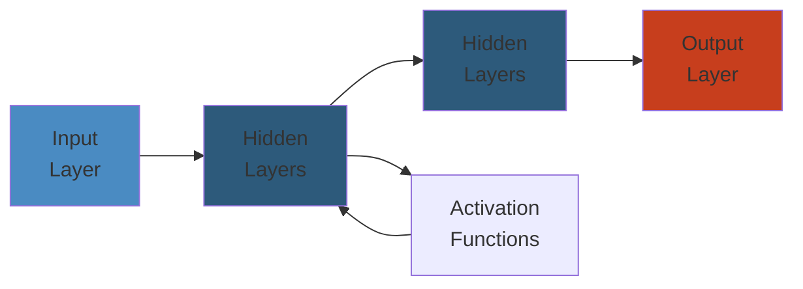

# 📨 Apache Kafka — Complete Deep Dive

**Related**: [Production Patterns](02-kafka-patterns.md) · [RabbitMQ](../rabbitmq/01-rabbitmq-basics.md) · [SNS/SQS](../sns-sqs/01-sns-sqs-basics.md)

---




## Table of Contents

- [What is Kafka?](#-what-is-kafka)
- [1. Core Concepts](#1-core-concepts)
- [2. Topics & Partitions](#2-topics--partitions)
- [3. Producers](#3-producers)
- [4. Consumers & Consumer Groups](#4-consumers--consumer-groups)
- [5. Replication & ISR](#5-replication--isr)
- [6. Leader Election](#6-leader-election)
- [7. Delivery Semantics (Acks)](#7-delivery-semantics-acks)
- [8. Idempotent Producers](#8-idempotent-producers)
- [9. Log Compaction & Retention](#9-log-compaction--retention)
- [10. Partitioning Strategies](#10-partitioning-strategies)
- [11. Consumer Rebalancing](#11-consumer-rebalancing)
- [12. Kafka Connect](#12-kafka-connect)
- [13. Kafka Streams](#13-kafka-streams)
- [14. Exactly-Once Semantics](#14-exactly-once-semantics)
- [15. KRaft Mode](#15-kraft-mode)
- [16. Tiered Storage](#16-tiered-storage)
- [17. Schema Registry](#17-schema-registry)
- [18. REST Proxy](#18-rest-proxy)
- [19. Performance Tuning](#19-performance-tuning)
- [20. Security](#20-security)
- [Simplest Mental Model](#-simplest-mental-model)

---

## 🧭 What is Kafka?

```text
Kafka is a distributed event streaming platform — a committed log.

  Producers → [Broker1│Broker2│Broker3] → Consumers / Streams / Connect

Pull-based, append-only log, ordered within partition, sequential I/O.
```

---

## 1. Core Concepts

| Concept | Description |
|---------|-------------|
| **Event** | Key-value with timestamp and headers |
| **Topic** | Logical channel for events |
| **Partition** | Ordered, immutable sequence within a topic |
| **Broker** | Server storing partitions |
| **Producer** | Publishes events to topics |
| **Consumer** | Subscribes and reads events |
| **Consumer Group** | Coordinated consumers reading a topic |
| **Offset** | Unique record ID within a partition |
| **ISR** | In-Sync Replicas — caught up with leader |

---

## 2. Topics & Partitions

```text
Partitions = unit of parallelism:

  Topic "orders" (3 partitions):
  ┌──────────────────────────────────────┐
  │ P0: [o1, o4] │ P1: [o2, o5] │ P2: [o3, o6, o7] │
  └──────────────────────────────────────┘
```

Ordered and immutable. Partitions can be increased but never decreased.

```yaml
partitions: 6
replication.factor: 3
retention.ms: 604800000
min.insync.replicas: 2
cleanup.policy: delete
```

---

## 3. Producers

Flow: Serialize → Partition → Batch → Compress → Send to leader.

```java
Properties props = new Properties();
props.put("bootstrap.servers", "broker1:9092,broker2:9092");
props.put("key.serializer", "org.apache.kafka.common.serialization.StringSerializer");
props.put("value.serializer", "org.apache.kafka.common.serialization.StringSerializer");
props.put("acks", "all");
props.put("linger.ms", 5);
props.put("batch.size", 32768);
props.put("compression.type", "snappy");
props.put("enable.idempotence", true);

KafkaProducer<String, String> producer = new KafkaProducer<>(props);
producer.send(new ProducerRecord<>("orders", "key-1", "value-1"),
    (metadata, exception) -> {
        if (exception != null) log.error("Send failed", exception);
    });
producer.flush();
producer.close();
```

| Config | Default | Description |
|--------|---------|-------------|
| `acks` | `1` | Acknowledgement mode |
| `linger.ms` | `0` | Wait to fill batch |
| `batch.size` | `16384` | Max bytes per batch |
| `compression.type` | `none` | gzip, snappy, lz4, zstd |
| `enable.idempotence` | `false` | Exactly-once producer |
| `max.in.flight.requests` | `5` | Unacknowledged requests |

---

## 4. Consumers & Consumer Groups

```text
Partition assignment (3 consumers, 6 partitions):
  C1: P0,P3   C2: P1,P4   C3: P2,P5
  Each partition → exactly ONE consumer in a group.
```

Offsets track read position in `__consumer_offsets` topic.

| Config | Default | Description |
|--------|---------|-------------|
| `group.id` | `null` | Consumer group name |
| `enable.auto.commit` | `true` | Periodic offset commit |
| `auto.offset.reset` | `latest` | earliest, latest, none |
| `session.timeout.ms` | `45000` | Heartbeat timeout |
| `max.poll.records` | `500` | Records per poll() |
| `isolation.level` | `read_uncommitted` | Use read_committed for EOS |

```javascript
const consumer = kafka.consumer({ groupId: "order-processors" });
await consumer.connect();
await consumer.subscribe({ topic: "orders", fromBeginning: false });
await consumer.run({
    eachMessage: async ({ message, heartbeat }) => {
        await processOrder(message.value);
        await heartbeat();
    },
});
```

---

## 5. Replication & ISR

```text
RF=3: 1 leader + 2 followers on different brokers.

  Broker 1 (Leader)  Broker 2 (ISR ✓)  Broker 3 (ISR ✗ lag)
  offset=100         offset=99         offset=80

A replica is in-sync if caught up within replica.lag.time.max.ms (30s).
```

```yaml
default.replication.factor: 3
min.insync.replicas: 2
replica.lag.time.max.ms: 30000
unclean.leader.election.enable: false
```

---

## 6. Leader Election

On leader failure, controller elects a new leader from ISR.

- 3 replicas, 2 ISR → writes succeed
- 3 replicas, 1 ISR → writes FAIL (NotEnoughReplicasException)
- 3 replicas, 0 ISR → unavailable

`unclean.leader.election.enable=true` allows electing out-of-sync replicas (data loss risk).

---

## 7. Delivery Semantics (Acks)

| acks | Behavior | Use Case |
|------|----------|----------|
| `0` | Fire-and-forget, no response | Metrics, logs |
| `1` | Leader confirms write (default) | General |
| `all` | All ISR confirm | Financial, critical |

`acks=all` is safest. No data loss as long as `min.insync.replicas > 1`.

---

## 8. Idempotent Producers

```text
Without: retries → duplicates
With (enable.idempotence=true): PID + sequence number
  Broker deduplicates by (PID, seq). Requires acks=all.
```

---

## 9. Log Compaction & Retention

| Policy | Behavior | Use Case |
|--------|----------|----------|
| `delete` | Delete older than retention.ms | Event logs |
| `compact` | Keep latest value per key | State, KTables |

```text
Before: k1=v1, k2=v1, k1=v2, k3=v1, k1=v3, k2=v2
After:  k3=v1, k1=v3, k2=v2
```

Segments = files holding partition data (max 1GB). Old segments are deleted/compacted based on cleanup.policy.

| Config | Default | Description |
|--------|---------|-------------|
| `log.segment.bytes` | 1GB | Segment size before roll |
| `log.retention.ms` | 7 days | Max segment age |
| `log.retention.bytes` | -1 | Max partition size |

---

## 10. Partitioning Strategies

**Round-Robin**: No key → even distribution. Good balance, no ordering.

**Key-Based**: `hash(key) % partitions`. Same key → same partition. Ordering per key, enables compaction, risk of hot keys.

**Custom Partitioner**: Override `Partitioner` interface.

```java
public int partition(String topic, Object key, byte[] keyBytes,
                     Object value, byte[] valueBytes, Cluster cluster) {
    List<PartitionInfo> partitions = cluster.partitionsForTopic(topic);
    if (keyBytes == null)
        return ThreadLocalRandom.current().nextInt(partitions.size());
    return Math.abs(key.hashCode() % partitions.size());
}
```

Rule of thumb: `partition_count = num_consumers × 2`. Max ~1000 per broker. Can increase but NEVER decrease.

---

## 11. Consumer Rebalancing

Triggers: consumer joins/leaves, topic changes, timeout.

**Eager**: STOP THE WORLD → revoke all → reassign.
**Cooperative** (Kafka 2.4+): incremental — revoke subset only.

**Static Group Membership**: `group.instance.id` — no rebalance on restart within `session.timeout.ms`.

| Strategy | Behavior |
|----------|----------|
| `range` | Consecutive ranges |
| `roundrobin` | Round-robin |
| `sticky` | Minimize movement |
| `cooperative_sticky` | Incremental |

---

## 12. Kafka Connect

```text
Framework for streaming to/from external systems:

  PostgreSQL → Source Connector → topic "db.orders"
  topic "logs" → Sink Connector → S3 / Elasticsearch
```

```json
{
    "name": "orders-connector",
    "config": {
        "connector.class": "io.debezium.connector.postgresql.PostgresConnector",
        "database.hostname": "postgres",
        "database.dbname": "orders_db",
        "table.include.list": "public.orders",
        "plugin.name": "pgoutput"
    }
}
```

---

## 13. Kafka Streams

```text
Lightweight stream processing library (no separate cluster):

  topic "orders" → .map/.filter/.join/.aggregate → topic "enriched"
```

```java
StreamsBuilder builder = new StreamsBuilder();
KStream<String, Order> orders = builder.stream("orders",
    Consumed.with(Serdes.String(), orderSerde));

KTable<String, Long> orderCounts = orders
    .groupBy((key, order) -> order.getUserId(),
             Grouped.with(Serdes.String(), orderSerde))
    .count();

orderCounts.toStream().to("user-order-counts",
    Produced.with(Serdes.String(), Serdes.Long()));
```

| API | Abstraction | When |
|-----|-------------|------|
| DSL | High (map, filter, join) | 90% of cases |
| Processor | Low (Punctuator, StateStore) | Custom operators |

---

## 14. Exactly-Once Semantics

```text
At-most-once:  msg → process (may lose)
At-least-once: msg → process → commit (dupes on retry)
Exactly-once:  msg → process → commit (dedup + transactional)

EOS requires:
  1. Idempotent producer (PID + sequence)
  2. Transactional API (beginTransaction / commitTransaction / abortTransaction)
  3. isolation.level = read_committed
```

```java
KafkaProducer<String, String> producer = createTransactionalProducer();
producer.initTransactions();
while (true) {
    ConsumerRecords<String, String> records = consumer.poll(Duration.ofMillis(100));
    producer.beginTransaction();
    for (ConsumerRecord<String, String> record : records) {
        producer.send(new ProducerRecord<>("output-topic", process(record.value())));
    }
    producer.sendOffsetsToTransaction(getOffsets(consumer), consumer.groupMetadata());
    producer.commitTransaction();
}
```

---

## 15. KRaft Mode

```text
Replaces ZooKeeper with Raft consensus on __cluster_metadata topic.

  Before: Kafka → ZooKeeper (external dep)
  After:  Controllers run Raft internally

Benefits: no external dep, better metadata scaling, simpler operations.
```

```yaml
process.roles: broker,controller
node.id: 1
controller.quorum.voters: 1@kafka1:9093,2@kafka2:9093,3@kafka3:9093
metadata.log.dir: /var/lib/kafka/metadata
```

---

## 16. Tiered Storage

```text
Moves old segments to S3/GCS.

  Local SSD (hot): active + recent segments
  Remote S3 (warm): older segments uploaded transparently

Consumers fetch from remote tier automatically. Infinite retention.
```

---

## 17. Schema Registry

```text
Manages schemas (Avro/Protobuf/JSON):

  Producer registers schema → gets ID → sends ID + binary data
  Consumer fetches schema by ID for deserialization
```

| Compatibility | Behavior |
|---------------|----------|
| `NONE` | No checks |
| `BACKWARD` | New reads old data (default) |
| `FORWARD` | Old reads new data |
| `FULL` | Both directions |

```java
props.put("value.serializer", "io.confluent.kafka.serializers.KafkaAvroSerializer");
props.put("schema.registry.url", "http://schema-registry:8081");
```

---

## 18. REST Proxy

```text
HTTP for non-JVM clients: POST /topics/orders, GET /consumers/...
```

```json
{
    "records": [{
        "key": "user-123",
        "value": { "orderId": "ord-456", "amount": 99.99 }
    }]
}
```

---

## 19. Performance Tuning

```yaml
# Producer throughput
acks: 1
compression.type: snappy
linger.ms: 100
batch.size: 131072
buffer.memory: 67108864
```

```yaml
# Consumer throughput
fetch.min.bytes: 1048576
fetch.max.wait.ms: 500
max.poll.records: 1000
```

```yaml
# Broker / OS
num.network.threads: 8
num.io.threads: 8
vm.swappiness: 1
```

**Typical throughput** (SSD, 10Gbps): Producer (acks=1) ~1M msg/s, Consumer ~3M msg/s, 6-broker cluster ~1 GB/s.

---

## 20. Security

**SASL**: PLAIN (dev), SCRAM-SHA-512 (production), GSSAPI (enterprise), OAUTHBEARER.

```yaml
listeners: SASL_SSL://0.0.0.0:9092
sasl.enabled.mechanisms: SCRAM-SHA-512
authorizer.class.name: kafka.security.authorizer.AclAuthorizer
```

**TLS**: `ssl.keystore.location`, `ssl.truststore.location`, `ssl.client.auth: required`.

**Rack Awareness**: `broker.rack: us-east-1a` ensures replicas span AZs.

---

## 🧭 Simplest Mental Model

```text
Kafka is a COMMITTED LOG — like a database WAL, shared across services.

  Topic = Labeled drawer ("orders")
  Partition = Folder within the drawer
  Record = Paper filed in order
  Offset = Page number
  Broker = Filing cabinet

  Producers add pages to the END.
  Consumers read from where they left off.
  Pages are NEVER deleted (only retention-expired).
  You can RE-READ any page anytime.

  3 rules:
  1. Partition = unit of parallelism + ordering
  2. 1 consumer group → 1 partition : 1 consumer
  3. More partitions = more throughput ≠ more speed
```


## Practical Example

See code examples above for practical usage patterns.