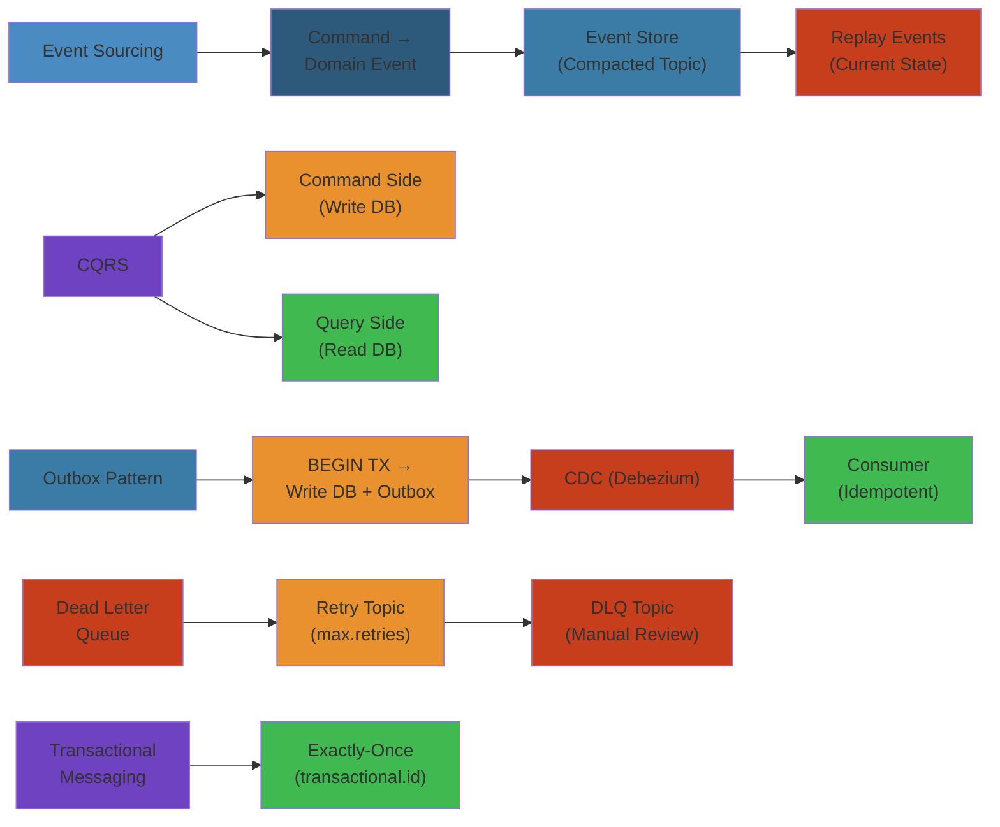

# 📨 Kafka Production Patterns — Complete Deep Dive

**Related**: [Kafka Basics](01-kafka-basics.md) · [Distributed Transactions & Saga](../microservices/06-distributed-transactions-saga.md) · [CQRS & Event Sourcing](../microservices/07-cqrs-event-sourcing.md)

---




## Table of Contents

#### Step-by-Step
1. Process input
2. Validate
3. Execute
4. Return result

#### Code Example
```python
# Example implementation
pass
```

#### Real-World Scenario
This pattern is commonly used in production systems.


- [Event Sourcing](#-event-sourcing-with-kafka) · [1. CQRS](#1-cqrs-with-kafka) · [2. Outbox](#2-outbox-pattern) · [3. Transactional Messaging](#3-transactional-messaging) · [4. Idempotent Consumers](#4-idempotent-consumers) · [5. DLQ & Retry](#5-dead-letter-queues--retry-topics) · [6. Compacted Topics](#6-compacted-topics-for-state) · [7. Streaming Joins](#7-streaming-joins) · [8. Windowed Aggregations](#8-windowed-aggregations) · [9. Global KTables](#9-global-ktables) · [10. Interactive Queries](#10-interactive-queries) · [11. Exactly-Once](#11-exactly-once-end-to-end) · [12. MirrorMaker](#12-kafka-mirrormaker-for-dr) · [Simplest Mental Model](#-simplest-mental-model)

---

## 🧭 Event Sourcing with Kafka

#### Step-by-Step
1. Process input
2. Validate
3. Execute
4. Return result

#### Code Example
```python
# Example implementation
pass
```

#### Real-World Scenario
This pattern is commonly used in production systems.


```text
Stores state changes as an immutable event log.

  Traditional: DB Row (status:SHIPPED) — history lost
  Event Sourcing: [OrderPlaced, PaymentRecvd, OrderShipped] — full audit trail
```

| Aspect | Traditional | Event Sourcing |
|--------|-------------|----------------|
| Audit trail | Manual logs | Built-in |
| Temporal query | Impossible | Replay any point |
| Schema changes | Migrations | New event types |

### Step-by-Step

#### Step-by-Step
1. Process input
2. Validate
3. Execute
4. Return result

#### Code Example
```python
# Example implementation
pass
```

#### Real-World Scenario
This pattern is commonly used in production systems.


1. **Command execution** receives action request (PlaceOrder, ShipOrder)
2. **Event creation** generates domain event (OrderPlaced, OrderShipped) capturing state change
3. **Event storage** appends to Kafka compacted topic with key=aggregate_id
4. **State projection** consumer builds current state by replaying all events from start
5. **Temporal queries** restore state at any point by replaying events up to that timestamp
6. **Schema evolution** new event types added without altering old events, supports migrations

### Code Example

#### Step-by-Step
1. Process input
2. Validate
3. Execute
4. Return result

#### Code Example
```python
# Example implementation
pass
```

#### Real-World Scenario
This pattern is commonly used in production systems.


```python
# Python event sourcing implementation
from dataclasses import dataclass, asdict
from enum import Enum
import json
from kafka import KafkaProducer, KafkaConsumer

class OrderEvent(Enum):
    PLACED = "OrderPlaced"
    PAID = "OrderPaid"
    SHIPPED = "OrderShipped"
    CANCELLED = "OrderCancelled"

@dataclass
class Event:
    event_type: str
    aggregate_id: str  # order_id
    timestamp: int
    data: dict

producer = KafkaProducer(
    bootstrap_servers=['localhost:9092'],
    value_serializer=lambda v: json.dumps(v).encode('utf-8')
)

# Emit event
event = Event(
    event_type=OrderEvent.PLACED.value,
    aggregate_id="order-123",
    timestamp=1234567890,
    data={"user_id": "user-456", "amount": 99.99, "items": [{"sku": "ABC", "qty": 1}]}
)
producer.send('orders-events', key=event.aggregate_id, value=asdict(event))

# Replay events to reconstruct order state
consumer = KafkaConsumer(
    'orders-events',
    bootstrap_servers=['localhost:9092'],
    value_deserializer=lambda m: json.loads(m.decode('utf-8')),
    auto_offset_reset='earliest'
)

order_state = {}
for message in consumer:
    event_data = message.value
    if event_data['aggregate_id'] == 'order-123':
        if event_data['event_type'] == OrderEvent.PLACED.value:
            order_state['status'] = 'PLACED'
            order_state['amount'] = event_data['data']['amount']
        elif event_data['event_type'] == OrderEvent.PAID.value:
            order_state['status'] = 'PAID'
        elif event_data['event_type'] == OrderEvent.SHIPPED.value:
            order_state['status'] = 'SHIPPED'
    
    print(f"Order {event_data['aggregate_id']}: {order_state}")
```

### Real-World Scenario

#### Step-by-Step
1. Process input
2. Validate
3. Execute
4. Return result

#### Code Example
```python
# Example implementation
pass
```

#### Real-World Scenario
This pattern is commonly used in production systems.


Shopify uses event sourcing for orders: every state change (created, paid, packed, shipped, delivered) is immutable. If a customer disputes a charge, engineers replay the order's events to prove exact timing of payment and shipment. When implementing refunds, they add a RefundInitiated event instead of updating rows—full audit trail preserved for compliance.

---

## 1. CQRS with Kafka

#### Step-by-Step
1. Process input
2. Validate
3. Execute
4. Return result

#### Code Example
```python
# Example implementation
pass
```

#### Real-World Scenario
This pattern is commonly used in production systems.


```text
Separates commands (writes) from queries (reads):

  Command → Handler + Write DB → Event (Kafka) → Projector → Read DB
  Query → Read DB (denormalized for reads)
```

```javascript
consumer.run({
    eachMessage: async ({ message }) => {
        const ev = JSON.parse(message.value.toString());
        if (ev.eventType === "OrderPlaced") {
            await db.query(`INSERT INTO order_summary (order_id, user_id, total, status)
                VALUES ($1, $2, $3, 'PLACED')`, [ev.aggregateId, ev.data.userId, ev.data.total]);
        }
    },
});
```

### Step-by-Step

#### Step-by-Step
1. Process input
2. Validate
3. Execute
4. Return result

#### Code Example
```python
# Example implementation
pass
```

#### Real-World Scenario
This pattern is commonly used in production systems.


1. **Command receipt** API accepts CreateOrder command with user, items, payment info
2. **Command validation** checks business rules (user exists, inventory available)
3. **Event emission** write DB (orders table) and publish OrderCreatedEvent to Kafka atomically
4. **Projection consumption** read-side consumer receives event and denormalizes into order_summary
5. **Query handling** API queries order_summary (no JOINs needed, optimized for reads)
6. **Eventual consistency** read DB may lag write DB by milliseconds, acceptable for UI

### Code Example

#### Step-by-Step
1. Process input
2. Validate
3. Execute
4. Return result

#### Code Example
```python
# Example implementation
pass
```

#### Real-World Scenario
This pattern is commonly used in production systems.


```javascript
// Node.js CQRS pattern with Kafka
const express = require('express');
const { Kafka } = require('kafkajs');
const pg = require('pg');

const app = express();
const kafka = new Kafka({ brokers: ['localhost:9092'] });
const producer = kafka.producer();
const consumer = kafka.consumer({ groupId: 'order-projector' });

// WRITE SIDE: Command handler
app.post('/api/orders', async (req, res) => {
    const { userId, items, total } = req.body;
    const client = new pg.Client();
    
    try {
        await client.connect();
        await client.query('BEGIN');
        
        // Write to database
        const { rows } = await client.query(
            'INSERT INTO orders (user_id, items, total, status) VALUES ($1, $2, $3, $4) RETURNING id',
            [userId, JSON.stringify(items), total, 'PENDING']
        );
        const orderId = rows[0].id;
        
        // Emit event
        await producer.send({
            topic: 'order-events',
            messages: [{
                key: orderId,
                value: JSON.stringify({
                    eventType: 'OrderCreated',
                    aggregateId: orderId,
                    data: { userId, items, total, timestamp: Date.now() }
                })
            }]
        });
        
        await client.query('COMMIT');
        res.json({ orderId });
    } catch (err) {
        await client.query('ROLLBACK');
        res.status(500).json({ error: err.message });
    } finally {
        await client.end();
    }
});

// READ SIDE: Projection
consumer.run({
    eachMessage: async ({ message }) => {
        const event = JSON.parse(message.value);
        const client = new pg.Client();
        
        try {
            await client.connect();
            if (event.eventType === 'OrderCreated') {
                await client.query(
                    `INSERT INTO order_summary (order_id, user_id, total, status, created_at)
                     VALUES ($1, $2, $3, $4, NOW())`,
                    [event.aggregateId, event.data.userId, event.data.total, 'CREATED']
                );
            }
        } finally {
            await client.end();
        }
    }
});

// QUERY: Read-optimized endpoint
app.get('/api/orders/:orderId', async (req, res) => {
    const client = new pg.Client();
    const { rows } = await client.query(
        'SELECT * FROM order_summary WHERE order_id = $1',
        [req.params.orderId]
    );
    res.json(rows[0]);
});
```

### Real-World Scenario

#### Step-by-Step
1. Process input
2. Validate
3. Execute
4. Return result

#### Code Example
```python
# Example implementation
pass
```

#### Real-World Scenario
This pattern is commonly used in production systems.


Amazon Prime Video uses CQRS: write commands go to the order service database, OrderCreated events fan out to recommendation, billing, and notification services. Each service maintains its own read model optimized for its queries. When billing queries "total revenue by region," it queries its denormalized read DB (fast), not the shared write DB. Eventual consistency (100ms lag) acceptable for analytics.

---

## 2. Outbox Pattern

#### Step-by-Step
1. Process input
2. Validate
3. Execute
4. Return result

#### Code Example
```python
# Example implementation
pass
```

#### Real-World Scenario
This pattern is commonly used in production systems.


```text
BEGIN TX: INSERT INTO orders + INSERT INTO outbox → COMMIT
Poller → read outbox → send to Kafka → mark sent

Alternative: Debezium CDC reads WAL in real-time (no polling lag).
```

```sql
CREATE TABLE outbox (
    id UUID PRIMARY KEY DEFAULT gen_random_uuid(),
    aggregate_id VARCHAR(255) NOT NULL,
    event_type VARCHAR(255) NOT NULL,
    payload JSONB NOT NULL,
    status VARCHAR(20) DEFAULT 'pending'
);
```

---

## 3. Transactional Messaging

#### Step-by-Step
1. Process input
2. Validate
3. Execute
4. Return result

#### Code Example
```python
# Example implementation
pass
```

#### Real-World Scenario
This pattern is commonly used in production systems.


```text
Atomic writes across topics:

  BEGIN TX → produce enriched ✓ → produce audit ✓ → sendOffsets → COMMIT
  → all written OR none (auto-abort on failure)
```

```java
producer.initTransactions();
while (true) {
    ConsumerRecords<String, String> records = consumer.poll(Duration.ofMillis(100));
    producer.beginTransaction();
    try {
        for (ConsumerRecord<String, String> record : records) {
            producer.send(new ProducerRecord<>("enriched-orders", enrich(record)));
            producer.send(new ProducerRecord<>("audit-log", audit(record)));
        }
        producer.sendOffsetsToTransaction(currentOffsets(consumer), consumer.groupMetadata());
        producer.commitTransaction();
    } catch (Exception e) { producer.abortTransaction(); }
}
```

---

## 4. Idempotent Consumers

#### Step-by-Step
1. Process input
2. Validate
3. Execute
4. Return result

#### Code Example
```python
# Example implementation
pass
```

#### Real-World Scenario
This pattern is commonly used in production systems.


```text
Handle duplicates: process → INSERT; same event again → dedup → SKIP.
```

```sql
CREATE TABLE processed_events (
    event_id VARCHAR(255) PRIMARY KEY,
    processed_at TIMESTAMP DEFAULT NOW()
);
INSERT INTO processed_events (event_id) VALUES ($1) ON CONFLICT (event_id) DO NOTHING;
```

| Condition | Action |
|-----------|--------|
| Already processed | Skip |
| Incomplete prior | Re-apply |
| Stale | Reject |

---

## 5. Dead Letter Queues & Retry Topics

#### Step-by-Step
1. Process input
2. Validate
3. Execute
4. Return result

#### Code Example
```python
# Example implementation
pass
```

#### Real-World Scenario
This pattern is commonly used in production systems.


```text
  Consumer → process → success (done)
              ↓ failure, retries < 3
         Retry Topic (backoff)
              ↓ retries exhausted
         DLQ Topic (manual analysis)

Kafka has no native delay. Workarounds: timestamp-filtered retry topics,
separate topics per delay (orders-retry-10s, orders-retry-1m).
```

```javascript
try { await processMessage(message); }
catch (err) {
    const r = (message.headers["retry-count"] || 0);
    const topic = r < 3 ? "orders-retry" : "orders-dlq";
    await producer.send({ topic, messages: [{
        key: message.key, value: r < 3 ? message.value : JSON.stringify({ err: err.message }),
        headers: { ...message.headers, "retry-count": (r+1).toString() },
    }]});
}
```

---

## 6. Compacted Topics for State

#### Step-by-Step
1. Process input
2. Validate
3. Execute
4. Return result

#### Code Example
```python
# Example implementation
pass
```

#### Real-World Scenario
This pattern is commonly used in production systems.


```text
Only latest value per key survives: u1=v1, u2=v1, u1=v2, u3=v1, u1=v3, u2=v2
→ u3=v1, u1=v3, u2=v2 → ideal for KTables
```

```java
KTable<String, UserProfile> profiles = builder.table("user-profiles",
    Consumed.with(Serdes.String(), profileSerde));

KStream<String, EnrichedOrder> enriched = builder
    .stream("orders", Consumed.with(Serdes.String(), orderSerde))
    .leftJoin(profiles, (order, profile) -> new EnrichedOrder(order, profile));
```

Use cases: user profiles, product catalog, configuration.

---

## 7. Streaming Joins

#### Step-by-Step
1. Process input
2. Validate
3. Execute
4. Return result

#### Code Example
```python
# Example implementation
pass
```

#### Real-World Scenario
This pattern is commonly used in production systems.


**Stream-Table** (enrichment):
```java
KStream<String, EnrichedOrder> enriched = orders.join(users,
    (order, user) -> new EnrichedOrder(order, user),
    Joined.with(Serdes.String(), orderSerde, userSerde));
```

**Stream-Stream** (time-bounded within window):
```java
KStream<String, MatchedOrder> matched = orders.join(payments,
    (order, payment) -> new MatchedOrder(order, payment),
    JoinWindows.ofTimeDifferenceWithNoGrace(Duration.ofHours(1)));
```

**Table-Table**: merge two KTables.

---

## 8. Windowed Aggregations

#### Step-by-Step
1. Process input
2. Validate
3. Execute
4. Return result

#### Code Example
```python
# Example implementation
pass
```

#### Real-World Scenario
This pattern is commonly used in production systems.


| Window | Behavior | Use Case |
|--------|----------|----------|
| Tumbling | Non-overlapping | Per-minute counts |
| Hopping | Overlapping | Rolling averages |
| Sliding | Per-pair | Event correlation |
| Session | Activity-triggered | User sessions |

```java
KTable<Windowed<String>, Long> perMinute = orders
    .groupByKey(Grouped.with(Serdes.String(), orderSerde))
    .windowedBy(TimeWindows.ofSizeWithNoGrace(Duration.ofMinutes(1)))
    .count();

KTable<Windowed<String>, Long> sessions = orders
    .groupByKey(Grouped.with(Serdes.String(), orderSerde))
    .windowedBy(SessionWindows.ofInactivityGapWithNoGrace(Duration.ofMinutes(30)))
    .count();
```

---

## 9. Global KTables

#### Step-by-Step
1. Process input
2. Validate
3. Execute
4. Return result

#### Code Example
```python
# Example implementation
pass
```

#### Real-World Scenario
This pattern is commonly used in production systems.


```text
KTable: partitioned (subset per instance) — needs co-partitioning
GlobalKTable: ALL data on EVERY instance — no co-partitioning needed
```

```java
GlobalKTable<String, Product> products = builder.globalTable("products",
    Consumed.with(Serdes.String(), productSerde));

KStream<String, Order> enriched = orders.join(products,
    (orderKey, order) -> order.getProductId(),
    (order, product) -> { order.setPrice(product.getPrice()); return order; });
```

For small reference data (<1GB).

---

## 10. Interactive Queries

#### Step-by-Step
1. Process input
2. Validate
3. Execute
4. Return result

#### Code Example
```python
# Example implementation
pass
```

#### Real-World Scenario
This pattern is commonly used in production systems.


```text
HTTP query of state stores. Local key → return. Remote key → route to owner.
```

```java
ReadOnlyKeyValueStore<String, Long> store = streams
    .store(StoreQueryParameters.fromNameAndType("order-count-store",
        QueryableStoreTypes.keyValueStore()));
Long count = store.get(userId);
if (count != null) return count;
HostInfo host = streams.metadataForKey("order-count-store", userId, ...);
return remoteQuery(host, "/api/orders/count/" + userId);
```

---

## 11. Exactly-Once End-to-End

#### Step-by-Step
1. Process input
2. Validate
3. Execute
4. Return result

#### Code Example
```python
# Example implementation
pass
```

#### Real-World Scenario
This pattern is commonly used in production systems.


| Stage | Mechanism |
|-------|-----------|
| Source → Kafka | Idempotent producer + outbox |
| Kafka internal | Transactions + read_committed |
| Kafka Streams | `processing.guarantee=exactly_once_v2` |
| Consumer → Sink DB | Dedup + `ON CONFLICT DO NOTHING` |

---

## 12. Kafka MirrorMaker for DR

#### Step-by-Step
1. Process input
2. Validate
3. Execute
4. Return result

#### Code Example
```python
# Example implementation
pass
```

#### Real-World Scenario
This pattern is commonly used in production systems.


```text
  Primary (active R+W) ──MM2──> Replica (standby, read-only)
                                          │ failover
                                          ▼
                                  Producers/consumers switch
```

```yaml
clusters: primary, backup
primary->backup.enabled: true
primary->backup.topics: .*
sync.group.offsets.enabled: true
```

| Strategy | RPO | RTO | Complexity |
|----------|-----|-----|------------|
| Active-Passive (MM2) | Sec-min | Minutes | Medium |
| Active-Active | ~0 | Seconds | High |

---

## 🧭 Simplest Mental Model

#### Step-by-Step
1. Process input
2. Validate
3. Execute
4. Return result

#### Code Example
```python
# Example implementation
pass
```

#### Real-World Scenario
This pattern is commonly used in production systems.


```text
  Event Sourcing  = Store EVERYTHING, never delete
  CQRS            = Separate pen (write) from map (read)
  Outbox          = Write message WITH data (same DB txn)
  DLQ             = Dead letter office for failures
  Retry           = Give it another chance (backoff)
  Compacted       = Latest snapshot per key
  Transaction     = All-or-nothing across topics
  MirrorMaker     = Offsite backup for Kafka

  Golden rule: Kafka is a LOG, not a queue.
  Consumer groups → queue semantics.
  Compacted topics → key-value storage.
  Transactions → atomic multi-topic writes.
```


## Practical Example

#### Step-by-Step
1. Process input
2. Validate
3. Execute
4. Return result

#### Code Example
```python
# Example implementation
pass
```

#### Real-World Scenario
This pattern is commonly used in production systems.


See code examples above for practical usage patterns.

## Edge Cases and Advanced Scenarios

#### Step-by-Step
1. Process input
2. Validate
3. Execute
4. Return result

#### Code Example
```python
# Example implementation
pass
```

#### Real-World Scenario
This pattern is commonly used in production systems.


| Scenario | Challenge | Solution |
|----------|-----------|----------|
| **KTable state store corruption** | RocksDB crashes or disk full | State stores are backed by changelog topics. Delete local RocksDB directory; restart will rebuild from changelog |
| **Co-partitioning requirement** | Stream-Table join fails with `TopologyException` | Ensure joined topics have same partition count and same key partitioning strategy. Repartition via `repartition()` operator |
| **Transactional timeout** | Producer transaction exceeds `transaction.timeout.ms` (default 15 min) | Increase timeout for long-running ETL jobs. Use smaller micro-batches |
| **Consumer group metadata overflow** | 100K+ consumer groups crash coordinator | Increase `group.max.size` (default 20). Use `group.initial.rebalance.delay.ms` to stagger startups |
| **Compacted topic tombstones** | DELETE produces tombstone, but compaction hasn't run yet | Tombstones survive until `min.compaction.lag.ms` (default 0). Reader sees deleted keys until compaction removes tombstones |

## Cross-References

#### Step-by-Step
1. Process input
2. Validate
3. Execute
4. Return result

#### Code Example
```python
# Example implementation
pass
```

#### Real-World Scenario
This pattern is commonly used in production systems.


- [Kafka Production Operations](../04-kafka-production-operations.md) — Cluster sizing, broker tuning, security, DR
- [SNS & SQS Patterns](../sns-sqs/02-sns-sqs-patterns.md) — Queue comparison guide, exactly-once processing
- [Distributed Transactions](../../09-distributed-systems/02-distributed-transactions.md) — Outbox, Saga, TCC patterns
- [CQRS & Event Sourcing](../../16-microservices/07-cqrs-event-sourcing.md) — Command handling, projections, event store
- [Stream Processing](../../09-distributed-systems/04-stream-processing.md) — Windowing, watermarks, checkpointing


## Production Failure Modes

#### Step-by-Step
1. Process input
2. Validate
3. Execute
4. Return result

#### Code Example
```python
# Example implementation
pass
```

#### Real-World Scenario
This pattern is commonly used in production systems.


### Failure 1: Consumer Lag Spikes Due to Processing Bottleneck

#### Step-by-Step
1. Process input
2. Validate
3. Execute
4. Return result

#### Code Example
```python
# Example implementation
pass
```

#### Real-World Scenario
This pattern is commonly used in production systems.


| Aspect | Detail |
|--------|--------|
| **Symptoms** | Consumer lag grows unbounded. Messages processed slower than produced. Kafka retention period hit, messages deleted before consumed |
| **Root Cause** | Consumer processing time increased (DB slow, external API timeout). Default `max.poll.records` = 500 too high for current processing latency. Processing time exceeds `max.poll.interval.ms` (5 min default), triggering rebalance |
| **Detection** | `kafka-consumer-groups --describe --group` shows `LAG` increasing. Consumer JMX: `records-lag-max` growing. Grafana: consumer lag dashboard shows upward trend |
| **Recovery** | Reduce `max.poll.records` to 100. Increase `max.poll.interval.ms` to 10 min. Scale consumer group: add more consumers. Identify slow processing via Zipkin/Jaeger traces |
| **Prevention** | Set consumer lag alert in Prometheus: `sum(kafka_consumer_lag{group=~".*"}) > 10000`. Use async processing: dispatch to thread pool, commit offsets after completion. Implement `pause()` on partition when lag exceeds threshold |

### Failure 2: Duplicate Messages After Consumer Crash

#### Step-by-Step
1. Process input
2. Validate
3. Execute
4. Return result

#### Code Example
```python
# Example implementation
pass
```

#### Real-World Scenario
This pattern is commonly used in production systems.


| Aspect | Detail |
|--------|--------|
| **Symptoms** | Data inconsistencies in downstream systems. Duplicate records in database. Idempotency keys missing |
| **Root Cause** | `enable.auto.commit=true` with `auto.commit.interval.ms=5000`. Consumer processes records, commits offset, then crashes. Records processed but offset not committed. On restart, consumer re-processes from committed offset |
| **Detection** | DB has duplicate rows with same `event_id`. Idempotency table shows multiple identical keys. Logs: consumer group offset resets to earlier position |
| **Recovery** | Implement idempotent consumer: upsert into DB with unique event_id. Drop duplicates using `INSERT ... ON CONFLICT DO NOTHING`. Switch to manual offset commit after processing |
| **Prevention** | Set `enable.auto.commit=false`. Commit offset only after processing and side-effects are complete. Use Kafka transactional producer + consumer for exactly-once. Use idempotency table with TTL |

### Failure 3: Schema Registry Backward-Incompatible Change

#### Step-by-Step
1. Process input
2. Validate
3. Execute
4. Return result

#### Code Example
```python
# Example implementation
pass
```

#### Real-World Scenario
This pattern is commonly used in production systems.


| Aspect | Detail |
|--------|--------|
| **Symptoms** | Consumers fail to deserialize Avro messages. Schema compatibility check passes but runtime fails. Unknown fields cause deserialization errors |
| **Root Cause** | `FULL_TRANSITIVE` compatibility required but producer used `BACKWARD`. Added a required field without default. Older consumers don't know about new field and fail |
| **Detection** | Schema Registry logs: `Schema being registered is incompatible`. Consumer logs: `AvroTypeException`. Kafka cluster: `deserialization-error-count` spikes |
| **Recovery** | Revert producer to old schema version. Re-register schema with correct compatibility type. Contact all consumer teams to update schemas. Use `FORWARD_TRANSITIVE` to allow consumers to evolve independently |
| **Prevention** | Always add new fields with defaults in Avro. Use `BACKWARD_TRANSITIVE` for additive-only changes. Test producer changes with consumer contract tests. Version schemas in shared registry with CI validation |

## Interview Questions

#### Step-by-Step
1. Process input
2. Validate
3. Execute
4. Return result

#### Code Example
```python
# Example implementation
pass
```

#### Real-World Scenario
This pattern is commonly used in production systems.


### Q1 (Beginner): What is the difference between Kafka topics and partitions?

#### Step-by-Step
1. Process input
2. Validate
3. Execute
4. Return result

#### Code Example
```python
# Example implementation
pass
```

#### Real-World Scenario
This pattern is commonly used in production systems.


**Answer**: A topic is a logical category/feed name to which records are published. A partition is a physical, ordered, immutable sequence of records within a topic. Partitions are the unit of parallelism: each partition lives on a single broker, and each consumer in a group reads from one or more partitions. In a 10-partition topic with 3 consumers, partitions are distributed among consumers. Adding more partitions increases throughput but also increases the number of files Kafka manages. Orders within a partition are guaranteed, but across partitions they are not.

### Q2 (Mid-Level): How does the Kafka producer ensure record ordering within a partition?

#### Step-by-Step
1. Process input
2. Validate
3. Execute
4. Return result

#### Code Example
```python
# Example implementation
pass
```

#### Real-World Scenario
This pattern is commonly used in production systems.


**Answer**: The producer assigns records to partitions using a partitioner. With a key (default partitioner: hash(key) % num_partitions), all records with the same key go to the same partition. The producer maintains per-partition in-flight requests. With `max.in.flight.requests.per.connection=1` (default 5), records are sent in strict order. With idempotent producer (`enable.idempotence=true`), ordering is guaranteed even with retries because each record has a sequence number and the broker rejects out-of-order sequences. Retries can cause duplicates but not reordering when idempotence is enabled. Without idempotence, a retried batch could be appended after a later batch if the original request succeeded but the broker response was lost.

### Q3 (Senior): Design a Kafka-based event sourcing system for an e-commerce order management system.

#### Step-by-Step
1. Process input
2. Validate
3. Execute
4. Return result

#### Code Example
```python
# Example implementation
pass
```

#### Real-World Scenario
This pattern is commonly used in production systems.


**Answer**: Events: OrderCreated, OrderShipped, OrderCancelled, PaymentProcessed. Topics: `orders` (single partition per order_id hash → ensures ordering per order). Producers: order service publishes OrderCreated, payment service publishes PaymentProcessed, shipping service publishes OrderShipped. Consumers: projection service reads events and builds materialized views (current order state in PostgreSQL). Use compacted topic `order-state` as KV store (key=order_id, value=latest state). Handle duplicate events: idempotent projections (upsert by order_id + event_version). Handle out-of-order events: use event_version in the event, discard versions <= current version. For exactly-once, use Kafka Streams with exactly-once semantics and state store for the projection. The state store is backed by a changelog topic for recovery. Use interactive queries for read-side: query the state store directly instead of re-processing all events.

### Q4 (Staff): Compare Kafka Streams, ksqlDB, and Flink for stream processing in an event-driven microservices architecture.

#### Step-by-Step
1. Process input
2. Validate
3. Execute
4. Return result

#### Code Example
```python
# Example implementation
pass
```

#### Real-World Scenario
This pattern is commonly used in production systems.


**Answer**: Kafka Streams: embeddable, lightweight, runs in your application. Best for: per-service event processing (projections, enrichment, filtering). Pros: no separate cluster, exactly-once built-in, ROCKsDB state stores, exactly-once exactly. Cons: JVM-only, state store can be memory-intensive, no global event-time semantics across partitions. ksqlDB: SQL interface on top of Kafka Streams. Best for: analysts, simple transformations, joining streams. Pros: low barrier to entry, pull queries (interactive query on materialized state), push queries (continuous queries). Cons: complex joins limited, not for heavy processing logic. Flink: cluster-based, true streaming. Best for: complex event processing, windowed aggregations, large state, exactly-once sinks to external systems. Pros: event-time processing + watermarks, savepoints for upgrades, batch and stream unified API, Python API. Cons: separate cluster to manage, more complex operations. Recommendation: use Kafka Streams for in-service processing, Flink for cross-service analytics and large-state operations. ksqlDB for quick queries and dashboards.

## Edge Cases

#### Step-by-Step
1. Process input
2. Validate
3. Execute
4. Return result

#### Code Example
```python
# Example implementation
pass
```

#### Real-World Scenario
This pattern is commonly used in production systems.


| Scenario | Challenge | Solution |
|----------|-----------|----------|
| **KTable state store corruption** | RocksDB crashes or disk full | State stores are backed by changelog topics. Delete local RocksDB directory; restart will rebuild from changelog |
| **Co-partitioning requirement** | Stream-Table join fails with `TopologyException` | Ensure joined topics have same partition count and same key partitioning strategy. Repartition via `repartition()` operator |
| **Transactional timeout** | Producer transaction exceeds `transaction.timeout.ms` (default 15 min) | Increase timeout for long-running ETL jobs. Use smaller micro-batches |
| **Consumer group metadata overflow** | 100K+ consumer groups crash coordinator | Increase `group.max.size` (default 20). Use `group.initial.rebalance.delay.ms` to stagger startups |
| **Compacted topic tombstones** | DELETE produces tombstone, but compaction hasn't run yet | Tombstones survive until `min.compaction.lag.ms` (default 0). Reader sees deleted keys until compaction removes tombstones |

## Cross-References

#### Step-by-Step
1. Process input
2. Validate
3. Execute
4. Return result

#### Code Example
```python
# Example implementation
pass
```

#### Real-World Scenario
This pattern is commonly used in production systems.


- [Kafka Production Operations](../04-kafka-production-operations.md) — Cluster sizing, broker tuning, security, DR
- [SNS & SQS Patterns](../sns-sqs/02-sns-sqs-patterns.md) — Queue comparison guide, exactly-once processing
- [Distributed Transactions](../../09-distributed-systems/02-distributed-transactions.md) — Outbox, Saga, TCC patterns
- [CQRS & Event Sourcing](../../16-microservices/07-cqrs-event-sourcing.md) — Command handling, projections, event store
- [Stream Processing](../../09-distributed-systems/04-stream-processing.md) — Windowing, watermarks, checkpointing