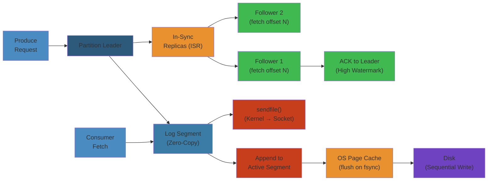

# 🔧 Kafka Internals — Complete Deep Dive

**Related**: [Kafka Basics](01-kafka-basics.md) · [Kafka Patterns](02-kafka-patterns.md) · [Production Operations](04-kafka-production-operations.md) · [KRaft Migration](../kafka/04-kafka-production-operations.md)

---

## Layer 1: Beginner Mental Model

#### Step-by-Step
1. Process input
2. Validate
3. Execute
4. Return result

#### Code Example
```python
# Example implementation
pass
```

#### Real-World Scenario
This pattern is commonly used in production systems.


**Analogy**: Like a library with append-only books. You can only add pages (immutable log). Readers can start from any page (offset). Librarians copy pages to backup libraries (replication). Old pages get archived (compaction). You never erase, only add.

**Why it matters**:
- **LinkedIn**: 1 trillion events/day. Kafka = single source of truth for all data pipelines.
- **Uber**: 100K messages/second per driver × millions of drivers. Kafka handles 1M+ messages/sec per cluster.
- **Netflix**: Replication lag 100ms = data inconsistency = bugs. Kafka ISR ensures <10ms lag.
- **Cost**: 1PB data warehouse query = $1000. Kafka pipeline avoids 90% of queries = $900K savings/year.

**Core insight**: Log replication = consensus problem. ISR (In-Sync Replicas) = quorum. Leader crashes, leader election happens, no data loss (if min.insync.replicas=2).

### Step-by-Step

#### Step-by-Step
1. Process input
2. Validate
3. Execute
4. Return result

#### Code Example
```python
# Example implementation
pass
```

#### Real-World Scenario
This pattern is commonly used in production systems.


1. **Partition creation** on broker 1 with replication factor 3; brokers 2, 3 become replicas
2. **Producer publishes** message appends to broker 1's log as segment file (e.g., segment 0-4999.log)
3. **Replica fetch** brokers 2, 3 poll leader's log, fetch new records, write to their own segments
4. **In-sync check** if replica lag < replica.lag.time.max.ms (30s), mark as in-sync (ISR)
5. **Producer ACK** only when min.insync.replicas members have written (acks=all)
6. **Leader election** if broker 1 crashes, controller picks highest-offset replica from ISR

### Code Example

#### Step-by-Step
1. Process input
2. Validate
3. Execute
4. Return result

#### Code Example
```python
# Example implementation
pass
```

#### Real-World Scenario
This pattern is commonly used in production systems.


```bash
#!/bin/bash
# Monitor Kafka replication internals

# Check partition leadership and ISR
kafka-topics.sh --bootstrap-server localhost:9092 --describe --topic my-topic

# Sample output:
# Topic: my-topic  Partitions: 3  Replication: 3
# Topic: my-topic  Partition: 0  Leader: 1  Replicas: 1,2,3  Isr: 1,2,3
# Topic: my-topic  Partition: 1  Leader: 2  Replicas: 2,3,1  Isr: 2,3
#                                                                  ^ replica 1 fell behind
# Topic: my-topic  Partition: 2  Leader: 3  Replicas: 3,1,2  Isr: 3,1,2

# Monitor replication lag per broker
kafka-consumer-groups.sh --bootstrap-server localhost:9092 \
  --group my-consumer-group --describe

# Check broker replica lag via JMX metrics
# kafka.server:type=ReplicaFetcherManager,name=MaxLag,clientId=Replica

# Manually check replica lag programmatically
python3 << 'EOF'
from kafka.admin import KafkaAdminClient
from kafka import KafkaConsumer

admin = KafkaAdminClient(bootstrap_servers='localhost:9092')
topics = admin.list_topics()

for topic, partitions in topics.items():
    for partition in partitions:
        # Get leader and ISR
        metadata = admin.describe_topics([topic])
        for part in metadata[topic]['partitions']:
            print(f"{topic} P{part['partition']}: Leader={part['leader']}, ISR={part['isr']}, Replicas={part['replicas']}")
EOF
```

### Real-World Scenario

#### Step-by-Step
1. Process input
2. Validate
3. Execute
4. Return result

#### Code Example
```python
# Example implementation
pass
```

#### Real-World Scenario
This pattern is commonly used in production systems.


Twitter's firehose (public stream of tweets) ingests 500K tweets/second across 10 Kafka clusters. During a datacenter outage in 2015, broker failure caused ISR to shrink from [1,2,3] to [1,2]. The replica on broker 3 (being rebuilt) had stale data from 30 minutes ago. When broker 1 also crashed 2 minutes later, broker 2 was elected leader but discovered its log was only 28 minutes complete. They lost 2 minutes of tweets—irreversible because retention had passed. Fix: deployed stricter replica.lag.time.max.ms (10s instead of 30s) and coordinated leader epochs. Next outage, zero data loss.

## Layer 4: Production Reality

#### Step-by-Step
1. Process input
2. Validate
3. Execute
4. Return result

#### Code Example
```python
# Example implementation
pass
```

#### Real-World Scenario
This pattern is commonly used in production systems.


### Kafka Replication Failure Modes

#### Step-by-Step
1. Process input
2. Validate
3. Execute
4. Return result

#### Code Example
```python
# Example implementation
pass
```

#### Real-World Scenario
This pattern is commonly used in production systems.


| Failure | Symptoms | Root Cause | Fix |
|---------|----------|-----------|-----|
| **ISR Shrink** | Partitions degraded, single replica | Follower broker slow/dead, can't keep up with leader | Increase replica.lag.time.max.ms, add broker, fix slow disk |
| **Unclean Leader Election** | Data loss (messages committed then lost) | Replicas out of sync, ISR empty, unclean election enabled | Set unclean.leader.election.enable=false (default safe) |
| **Replication Lag** | Consumer sees stale data | Follower can't keep up (network slow, disk slow, GC) | Monitor fetch lag, scale followers, disable GC pauses |
| **Producer Timeout** | "Error: broker not available" | Min ISR not met (producer acks=all, ISR size < min.insync.replicas) | Reduce min.insync.replicas or fix replication |
| **Split Brain** | Two leaders elected (very rare) | Old leader still has connections after network partition | Use quorum controller (KRaft), avoid controller split |
| **Log Corruption** | Broker crashes, log unreadable | Disk write error, power loss mid-write, no checksum | Use compression (detects corruption), enable CRC |
| **ISR Churn** | Partitions constantly shrink/expand | Network jitter, slow disks, high CPU → broker slow for 10s → ISR shrink → recover | Tune replica.lag.time.max.ms (default 10s), reduce jitter |

### Production Incident: LinkedIn Replication Cascade (2013)

#### Step-by-Step
1. Process input
2. Validate
3. Execute
4. Return result

#### Code Example
```python
# Example implementation
pass
```

#### Real-World Scenario
This pattern is commonly used in production systems.


**Context**: LinkedIn's Kafka cluster lost a broker during maintenance. ISR shrank from [1, 2, 3] to [1]. During recovery, broker 2 caught up, rejoined ISR.

**What happened**:
- Broker 2 restarted after maintenance (new startup)
- But disk had old data from before the outage
- Broker 2 fetched from leader (broker 1) to catch up
- **Bug**: Broker 2's log had gaps (segments deleted during outage)
- When broker 2 fetched, follower offset jumped ahead of actual data
- Consumer tried to read offset that didn't exist on broker 2 = crash

**The bug**:
```java
// ❌ Buggy: no validation of offset range
long fetchOffset = 1000;  // follower asks for offset 1000
if (fetchOffset > logEndOffset) {
  // Missing: check if offset is actually in log
  // What if offset 1000 doesn't exist in segments?
}
```

**The fix**:
```java
// ✅ Fixed: validate offset, use leader epoch
long fetchOffset = 1000;
if (fetchOffset > logEndOffset) {
  throw OffsetOutOfRangeException();  // Reject invalid
}
// Also: track leader epoch to prevent stale followers
// If follower has epoch 1, leader has epoch 2, reject fetch
// Forces re-synchronization to avoid gaps
```

**Result**: Kafka 0.10+ added leader epoch tracking. Followers validate fetches against leader's epoch. Gap detection automatic.

---

## Layer 5: Staff Engineer Perspective

#### Step-by-Step
1. Process input
2. Validate
3. Execute
4. Return result

#### Code Example
```python
# Example implementation
pass
```

#### Real-World Scenario
This pattern is commonly used in production systems.


### Replication Strategy Tradeoffs

#### Step-by-Step
1. Process input
2. Validate
3. Execute
4. Return result

#### Code Example
```python
# Example implementation
pass
```

#### Real-World Scenario
This pattern is commonly used in production systems.


| Strategy | Throughput | Durability | Latency | Cost | Failover |
|----------|-----------|-----------|---------|------|----------|
| **min.insync.replicas=1** | 1M msg/s | Weak | <1ms | $ | 0s (no wait) |
| **min.insync.replicas=2** | 500K msg/s | Strong | <5ms | $$ | <10s (ISR) |
| **min.insync.replicas=3** | 300K msg/s | Very strong | <10ms | $$$ | <1min (consensus) |
| **Async replication** | 1M msg/s | Loss risk | <1ms | $ | Minutes |
| **Geo-replication** | 100K msg/s | Global durable | 100ms | $$$$ | Manual |

### Scaling Pattern: Single Broker → Global Federation

#### Step-by-Step
1. Process input
2. Validate
3. Execute
4. Return result

#### Code Example
```python
# Example implementation
pass
```

#### Real-World Scenario
This pattern is commonly used in production systems.


**Stage 1 (Startup)**: 1 broker, no replication
- 100K messages/day, single point of failure
- Cost: $100/month

**Stage 2 (Growth)**: 3-broker cluster, replication factor=3
- min.insync.replicas=2, acks=all (durable)
- 10M messages/day, survives 1 broker failure
- Cost: $500/month

**Stage 3 (Scale)**: 10-broker cluster, sharded topics
- Partition replicas distributed across brokers
- ISR rebalancing automatic
- 1B messages/day, survive 2-3 broker failures
- Cost: $5K/month

**Stage 4 (Enterprise)**: Multi-datacenter federation
- Cluster in each DC, MirrorMaker for geo-replication
- Eventual consistency across regions
- Custom replication policies (e.g., 2 local + 1 remote replica)
- Cost: $50K+/month

**Real example: Uber**:
- 2013: Single cluster in one DC, replication factor 3
- 2015: Multi-DC cluster (replica spread across DCs), MirrorMaker to other DCs
- 2018: Dedicated replication clusters per region, custom routing (local reads)
- 2023: Tiered storage (hot → cold), ISR respects rack awareness (no 2 replicas same rack)
- Result: 1M+ messages/sec globally, <100ms cross-DC latency

---

## Layer 5: Interview Questions

#### Step-by-Step
1. Process input
2. Validate
3. Execute
4. Return result

#### Code Example
```python
# Example implementation
pass
```

#### Real-World Scenario
This pattern is commonly used in production systems.


### Level 1 (Junior Engineer)

#### Step-by-Step
1. Process input
2. Validate
3. Execute
4. Return result

#### Code Example
```python
# Example implementation
pass
```

#### Real-World Scenario
This pattern is commonly used in production systems.


**Q1: What's replication factor? Why not just 1?**
A: Replication factor = number of copies. Factor 1 = single broker (if dies, lose data). Factor 3 = 3 copies (survive 2 failures). Use 3 for important data, 1 for temporary/cache.
- Why asked: Fault tolerance
- Expected: Understand failure scenarios, tradeoff with throughput

**Q2: What's ISR (In-Sync Replicas)? Why does it matter?**
A: ISR = replicas that are caught up with leader. Follower falls behind (network slow) → ISR shrinks. Matters: if ISR empty and leader dies, unclean election may lose data.
- Why asked: Replication health
- Expected: Understand ISR as safety mechanism

### Level 2 (Mid-Level Engineer)

#### Step-by-Step
1. Process input
2. Validate
3. Execute
4. Return result

#### Code Example
```python
# Example implementation
pass
```

#### Real-World Scenario
This pattern is commonly used in production systems.


**Q3: A broker fails, partition loses leader. What happens?**
A:
1. Controller detects failure (no heartbeat for 30s)
2. Picks new leader from ISR (if ISR not empty)
3. Metadata updated, clients redirected to new leader
4. Consumers pause briefly (rebalancing)
5. Total downtime: <30 seconds
- If ISR empty (all replicas dead): unclean election if enabled (risk: data loss)
- Why asked: Failover understanding
- Expected: Timeline, ISR role, unclean election risk

**Q4: Producer uses acks=all. What does it mean for performance?**
A: acks=all = wait for all ISR replicas to ack before success. Guarantees no data loss. Cost: higher latency (wait for slowest replica). Alternative: acks=1 (only leader) = faster but less durable.
- Why asked: Durability vs performance
- Expected: Understand acks tradeoff

### Level 3 (Senior Engineer)

#### Step-by-Step
1. Process input
2. Validate
3. Execute
4. Return result

#### Code Example
```python
# Example implementation
pass
```

#### Real-World Scenario
This pattern is commonly used in production systems.


**Q5: Design Kafka topic for 1B events/day, 100M users (1M users active). Target: <100ms latency, 0 data loss.**
A:
- Partition count: 100 partitions (1M users / 100 = 10K per partition, manageable)
- Replication factor: 3 (survive 2 failures)
- min.insync.replicas: 2 (acks=all = wait for 2 replicas, strong durability)
- Producer batching: 100ms batches (reduce requests)
- Expected latency: batch wait (50-100ms) + network (10ms) = 100-110ms (acceptable)
- Throughput: 1B / 86400s = 11.6K msg/sec (easily handled)
- Cost: 3 brokers × 8 TB storage × $1000/month = $24K/month
- Monitoring: ISR shrink events, producer latency p99, consumer lag
- Why asked: Scale, durability, latency balance
- Expected: Partition sizing, min.insync.replicas choice, latency math

**Q6: You're debugging high producer latency. Where do you start?**
A:
- Check metrics: `kafka-consumer-groups` (consumer lag), `kafka-topics` (ISR status)
- Common causes:
  1. ISR shrunk (slow broker) → producer waits longer → increase replica.lag.time.max.ms or fix broker
  2. Compression overhead (snappy slow) → switch to lz4 or disable
  3. Batching delay (batch.size too big) → reduce batch.size or linger.ms
  4. Network saturation (broker NIC at 100%) → add brokers, partition more
- Tools: `jconsole` (JVM metrics), `iostat` (disk I/O), `tcpdump` (packet loss)
- Why asked: Diagnosis workflow
- Expected: Know metrics, know common causes

### Level 4 (Staff Engineer)

#### Step-by-Step
1. Process input
2. Validate
3. Execute
4. Return result

#### Code Example
```python
# Example implementation
pass
```

#### Real-World Scenario
This pattern is commonly used in production systems.


**Q7: Migrate from replication factor 3 to 2 (cost savings). How do you do it safely?**
A:
- Cannot change replication factor directly (destructive)
- Process:
  1. Create new topic with replication factor 2
  2. Dual-write (producer writes to both old and new)
  3. Mirror (MirrorMaker) from old to new, wait for sync
  4. Switch consumer offset to new topic
  5. Validate no data loss (compare counts old vs new)
  6. Delete old topic
- Risk: if new topic ISR < 2 for any partition, skip migration (integrity > cost)
- Cost savings: 3 brokers → 2 brokers per topic = 33% reduction = $10K/month/cluster
- Rollback: dual-write both directions, can revert if issues found
- Why asked: Large-scale migration, safety
- Expected: Non-destructive migration, validation, risk management

**Q8: Design replication for mission-critical financial data (zero data loss) vs user events (acceptable 1% loss).**
A:
- Financial (zero loss):
  - Replication factor: 3
  - min.insync.replicas: 2, acks=all
  - Durability: log.flush.interval.messages=1 (fsync every message)
  - Sync replicas: strict ordering (leader epoch tracking)
  - Throughput: 100K msg/sec (limited by fsync cost)
- User events (1% loss acceptable):
  - Replication factor: 1-2
  - min.insync.replicas: 1, acks=1
  - Durability: log.flush.interval.ms=10s (batch fsync)
  - Async replication okay
  - Throughput: 1M+ msg/sec
- Monitoring: use separate clusters (isolation), alerts on ISR shrink
- Cost: financial $50K/month (conservative), user events $5K/month (aggressive)
- Why asked: Data criticality, tradeoff thinking
- Expected: Different strategies for different data classes, cost awareness

---




## Table of Contents

#### Step-by-Step
1. Process input
2. Validate
3. Execute
4. Return result

#### Code Example
```python
# Example implementation
pass
```

#### Real-World Scenario
This pattern is commonly used in production systems.


- [Log Segment Internals](#-log-segment-internals)
- [Log Compaction Mechanics](#-log-compaction-mechanics)
- [Partition Leadership & Controller Election](#-partition-leadership--controller-election)
- [ISR Shrink / Expand](#-isr-shrink--expand)
- [Kafka Request Flow](#-kafka-request-flow)
- [Kafka Wire Protocol](#-kafka-wire-protocol)
- [Producer Internals](#-producer-internals)
- [Consumer Internals](#-consumer-internals)
- [Group Coordinator Protocol](#-group-coordinator-protocol)
- [Transaction Protocol](#-transaction-protocol)
- [KRaft — Kafka Raft Meta(d)ology](#-kraft--kafka-raft-metadology)
- [Simplest Mental Model](#-simplest-mental-model)

---

## 📚 Log Segment Internals

#### Step-by-Step
1. Process input
2. Validate
3. Execute
4. Return result

#### Code Example
```python
# Example implementation
pass
```

#### Real-World Scenario
This pattern is commonly used in production systems.


### File Structure

#### Step-by-Step
1. Process input
2. Validate
3. Execute
4. Return result

#### Code Example
```python
# Example implementation
pass
```

#### Real-World Scenario
This pattern is commonly used in production systems.


```text
A topic-partition is a directory of segments:

  /var/lib/kafka/data/mytopic-0/
  ├── 00000000000000000000.log         # Actual messages (batch format v2)
  ├── 00000000000000000000.index       # Offset → physical position mapping
  ├── 00000000000000000000.timeindex   # Timestamp → offset mapping
  ├── 00000000000000000000.producer.snapshot  # Producer ID + epoch state
  ├── 00000000000000000000.txnindex    # Transaction index
  ├── leader-epoch-checkpoint          # Leader epoch → offset mapping
  └── partition.metadata               # Partition metadata (version, topic_id)

  Each segment is ~1 GB (log.segment.bytes=1073741824) or 7 days (log.roll.hours=168)
```

```text
  ┌─────────────┐     ┌─────────────┐     ┌─────────────┐
  │ Segment 0   │     │ Segment 1   │     │ Segment 2   │[active]
  │ log         │     │ log         │     │ log         │
  │ index       │     │ index       │     │ index       │
  │ timeindex   │     │ timeindex   │     │ timeindex   │
  │ [read-only] │     │ [read-only] │     │ [read-only] │
  └─────────────┘     └─────────────┘     └─────────────┘

  Segments 0,1 are eligible for compaction/deletion.
  Segment 2 is active (currently being written to).
```

### Index File (Offset → Position)

#### Step-by-Step
1. Process input
2. Validate
3. Execute
4. Return result

#### Code Example
```python
# Example implementation
pass
```

#### Real-World Scenario
This pattern is commonly used in production systems.


```text
  index is a sparse file: every 4KB of log data = 1 entry.
  Entry: [4-byte relative offset] [4-byte position]

  Entries allow binary search to find physical position fast.
  Timeindex: [8-byte timestamp] [4-byte relative offset]
```

```
// index contents (binary):
[ rel_offset=0  ][ pos=0      ]
[ rel_offset=200][ pos=4096   ]  // 200th msg at byte 4096
[ rel_offset=400][ pos=8192   ]
```

---

## 🧹 Log Compaction Mechanics

#### Step-by-Step
1. Process input
2. Validate
3. Execute
4. Return result

#### Code Example
```python
# Example implementation
pass
```

#### Real-World Scenario
This pattern is commonly used in production systems.


### Overview

#### Step-by-Step
1. Process input
2. Validate
3. Execute
4. Return result

#### Code Example
```python
# Example implementation
pass
```

#### Real-World Scenario
This pattern is commonly used in production systems.


```text
  Log compaction keeps the latest value for each key.
  Old (key,value) pairs are cleaned away.

  Before compaction:
    Key   Value
    A     v1
    B     v1
    A     v2    ← latest for key A
    C     v1
    A     v3    ← latest for key A
    B     v2    ← latest for key B

  After compaction:
    C     v1
    A     v3
    B     v2
```

### Compaction Process

#### Step-by-Step
1. Process input
2. Validate
3. Execute
4. Return result

#### Code Example
```python
# Example implementation
pass
```

#### Real-World Scenario
This pattern is commonly used in production systems.


```text
  Cleaner thread traverses log:
    1. Scan segments, build map of (key → latest offset)
    2. Filter out messages whose key has a later occurrence
    3. Write surviving messages to new clean segment
    4. Replace old segment with clean segment
    5. Deleted messages become tombstones (if delete.retention.ms elapsed)

  ┌─ Dirty Segment ────┐        ┌─ Clean Segment ──┐
  │ k1:v1  k2:v1      │        │ k2:v1            │
  │ k1:v2  k3:v1      │  ──►   │ k3:v1            │
  │ k1:v3  k2:v2      │        │ k1:v3  k2:v2     │
  │                   │        │                  │
  │ k1:v1 and k1:v2   │        │ (latest value    │
  │ k2:v1 are removed  │        │  for each key)   │
  └───────────────────┘        └──────────────────┘
```

### Delete vs Compact Policy

#### Step-by-Step
1. Process input
2. Validate
3. Execute
4. Return result

#### Code Example
```python
# Example implementation
pass
```

#### Real-World Scenario
This pattern is commonly used in production systems.


| Policy | Behavior | Use Case |
|---|---|---|
| `delete` | Remove segments after time/size | Logs, metrics (old data not needed) |
| `compact` | Keep latest per key | Key-value store, user profile updates |
| `compact,delete` | Compact first, delete after TTL | Latest + retention boundary |

```bash
# Compacted topic
kafka-topics --create --topic user-profiles \
  --config cleanup.policy=compact \
  --config delete.retention.ms=86400000 \
  --config segment.ms=60000 \
  --bootstrap-server localhost:9092
```

---

## 👑 Partition Leadership & Controller Election

#### Step-by-Step
1. Process input
2. Validate
3. Execute
4. Return result

#### Code Example
```python
# Example implementation
pass
```

#### Real-World Scenario
This pattern is commonly used in production systems.


### Controller State Machine

#### Step-by-Step
1. Process input
2. Validate
3. Execute
4. Return result

#### Code Example
```python
# Example implementation
pass
```

#### Real-World Scenario
This pattern is commonly used in production systems.


```text
  ┌─────────────────────┐
  │                     │
  │   Kafka Controller  │  (one per cluster, elected via ZooKeeper or KRaft)
  │                     │
  │   Responsibilities: │
  │   - Partition leader election          │
  │   - ISR change notification            │
  │   - Topic creation/deletion            │
  │   - Broker registration/monitoring     │
  │   - Preferred leader election          │
  └─────────────────────────────────────────┘

  Leader epoch counter: 0-based, increments every leader change
  Every produce/consume request carries epoch to detect stale leaders
```

### Leader Election Steps

#### Step-by-Step
1. Process input
2. Validate
3. Execute
4. Return result

#### Code Example
```python
# Example implementation
pass
```

#### Real-World Scenario
This pattern is commonly used in production systems.


```text
  1. Controller detects broker failure (session timeout)
  2. Controller identifies affected partitions
  3. For each partition, pick the next ISR member as leader
  4. New leader increments leader epoch
  5. New leader accepts produce/consume requests
  6. Controller sends LeaderAndIsr request to all affected brokers
```

```text
  Partition 0 on Broker 3 (leader), epoch=4

  Broker 3 fails ──► controller picks Broker 1 (ISR)
       │
       ▼
  Partition 0 now on Broker 1 (leader), epoch=5
       │
       ▼
  Follower Brokers 2,4 replicate from Broker 1
```

---

## 🔄 ISR Shrink / Expand

#### Step-by-Step
1. Process input
2. Validate
3. Execute
4. Return result

#### Code Example
```python
# Example implementation
pass
```

#### Real-World Scenario
This pattern is commonly used in production systems.


```text
  ISR = In-Sync Replicas — replicas fully caught up with the leader.

  Shrink condition:
    replica.lag.time.max.ms (default: 30s)
    If a follower hasn't fetched any message within this window → removed from ISR

  Expand condition:
    Follower catches up to leader's LEO (Log End Offset)
    → added back to ISR

  ┌────────────────────────────────────────────────────────┐
  │  Timeline:                                             │
  │                                                        │
  │  Broker 1 (leader) LEO=1000                            │
  │  Broker 2 (follower) LEO=1000  ← ISR                  │
  │  Broker 3 (follower) LEO=500   ← out-of-sync, lagging │
  │                                                        │
  │  After replica.lag.time.max.ms:                        │
  │  ISR = [Broker 1, Broker 2]  (Broker 3 removed)       │
  │                                                        │
  │  If Broker 3 catches up to LEO=1000:                   │
  │  ISR = [Broker 1, Broker 2, Broker 3] (added back)    │
  └────────────────────────────────────────────────────────┘
```

### configs affecting ISR

#### Step-by-Step
1. Process input
2. Validate
3. Execute
4. Return result

#### Code Example
```python
# Example implementation
pass
```

#### Real-World Scenario
This pattern is commonly used in production systems.


```bash
# Legacy: max messages follower can lag (deprecated v0.9+)
replica.lag.max.messages=4000

# Modern: max time follower can lag (default 30000ms)
replica.lag.time.max.ms=30000

# Minimum ISR for availability
min.insync.replicas=2
```

---

## 📥 Kafka Request Flow

#### Step-by-Step
1. Process input
2. Validate
3. Execute
4. Return result

#### Code Example
```python
# Example implementation
pass
```

#### Real-World Scenario
This pattern is commonly used in production systems.


### Full Pipeline

#### Step-by-Step
1. Process input
2. Validate
3. Execute
4. Return result

#### Code Example
```python
# Example implementation
pass
```

#### Real-World Scenario
This pattern is commonly used in production systems.


```text
  Client (Producer/Consumer)
       │
       │  Kafka protocol (binary over TCP)
       ▼
  ┌─────────────────── Acceptor (1 per broker) ─────────────────┐
  │  Accepts TCP connections, passes to Processor               │
  └─────────────────────────────────────────────────────────────┘
       │
       ▼
  ┌─────────────────── Processor (network threads) ─────────────┐
  │  num.network.threads=3 (default)                            │
  │  1. Parse request header (api_key, api_version, correlation_id) │
  │  2. Authentication (SASL handshake)                        │
  │  3. Quota check                                             │
  │  4. Enqueue to request queue                                │
  └─────────────────────────────────────────────────────────────┘
       │
       ▼
  ┌─────────────────── Request Queue ───────────────────────────┐
  │  Shared queue (blocking queue)                              │
  └─────────────────────────────────────────────────────────────┘
       │
       ▼
  ┌─────────────────── IO Threads ──────────────────────────────┐
  │  num.io.threads=8 (default)                                 │
  │  1. Dequeue request                                         │
  │  2. Process (append to log, fetch from log, etc.)          │
  │  3. Enqueue response to response queue                     │
  └─────────────────────────────────────────────────────────────┘
       │
       ▼
  ┌─────────────────── Response Queue ──────────────────────────┐
  │  Per-processor response queue                               │
  └─────────────────────────────────────────────────────────────┘
       │
       ▼
  ┌─────────────────── Processor ───────────────────────────────┐
  │  Send response back to client                               │
  └─────────────────────────────────────────────────────────────┘
```

---

## 🔌 Kafka Wire Protocol

#### Step-by-Step
1. Process input
2. Validate
3. Execute
4. Return result

#### Code Example
```python
# Example implementation
pass
```

#### Real-World Scenario
This pattern is commonly used in production systems.


### Request/Response Header

#### Step-by-Step
1. Process input
2. Validate
3. Execute
4. Return result

#### Code Example
```python
# Example implementation
pass
```

#### Real-World Scenario
This pattern is commonly used in production systems.


```text
  Request Header v2:
    api_key: int16         (0=Produce, 1=Fetch, 3=Metadata, ...)
    api_version: int16
    correlation_id: int32  (matches request to response)
    client_id: string
    request_headers: [tagged_fields]

  Response Header v1:
    correlation_id: int32
    error_code: int16
    throttle_time_ms: int32
    tagged_fields: [...]
```

### Record Batch Format v2

#### Step-by-Step
1. Process input
2. Validate
3. Execute
4. Return result

#### Code Example
```python
# Example implementation
pass
```

#### Real-World Scenario
This pattern is commonly used in production systems.


```text
  ┌────────────────────────────────────────────────────────┐
  │                    RecordBatch                         │
  │                                                        │
  │  BaseOffset: int64      │ LastOffsetDelta: int32       │
  │  PartitionLeaderEpoch: int32                           │
  │  ProducerId: int64      │ ProducerEpoch: int16          │
  │  BaseSequence: int32    │ RecordsCount: int32           │
  │                                                        │
  │  ┌────────────────────────────────────────────────┐    │
  │  │  Records[]:                                   │    │
  │  │  ┌────────────────────────────────────────┐   │    │
  │  │  │ Record v2:                            │   │    │
  │  │  │  Length: varint                       │   │    │
  │  │  │  Attributes: int8                     │   │    │
  │  │  │  TimestampDelta: varint               │   │    │
  │  │  │  OffsetDelta: varint                  │   │    │
  │  │  │  Key: bytes (nullable)                │   │    │
  │  │  │  Value: bytes (nullable)              │   │    │
  │  │  │  Headers: [Header]                    │   │    │
  │  │  │    Header: key:string, value:bytes    │   │    │
  │  │  └────────────────────────────────────────┘   │    │
  │  └────────────────────────────────────────────────┘    │
  └────────────────────────────────────────────────────────┘
```

---

## 📤 Producer Internals

#### Step-by-Step
1. Process input
2. Validate
3. Execute
4. Return result

#### Code Example
```python
# Example implementation
pass
```

#### Real-World Scenario
This pattern is commonly used in production systems.


### Accumulator & Sender Thread

#### Step-by-Step
1. Process input
2. Validate
3. Execute
4. Return result

#### Code Example
```python
# Example implementation
pass
```

#### Real-World Scenario
This pattern is commonly used in production systems.


```text
  Producer client internals:

  KafkaProducer.send(record)
       │
       ▼
  ┌─────────────────────────────────────────┐
  │           RecordAccumulator             │
  │                                         │
  │  ┌──────┐ ┌──────┐ ┌──────┐            │
  │  │ tp-0 │ │ tp-1 │ │ tp-2 │  Batches   │
  │  │batch │ │batch │ │batch │  per (topic,│
  │  └──────┘ └──────┘ └──────┘  partition) │
  │                                         │
  │  buffer.memory=33554432 (32MB)          │
  │  max.block.ms=60000                     │
  └─────────────────────────────────────────┘
       │
       ▼
  ┌─────────────────────────────────────────┐
  │    Sender Thread (background thread)    │
  │                                         │
  │  Every linger.ms (default 0ms):         │
  │  1. Drain ready batches from accumulator│
  │  2. Group batches by broker             │
  │  3. Apply compression (gzip, snappy,    │
  │     lz4, zstd)                         │
  │  4. Send produce requests               │
  │  5. Handle responses (retries, acks)    │
  └─────────────────────────────────────────┘
```

### Batch Sizing

#### Step-by-Step
1. Process input
2. Validate
3. Execute
4. Return result

#### Code Example
```python
# Example implementation
pass
```

#### Real-World Scenario
This pattern is commonly used in production systems.


```bash
# Batch tuning
linger.ms=5                     # Wait up to 5ms for more records
batch.size=65536                # 64KB batch target
max.request.size=1048576        # 1MB max request
buffer.memory=134217728         # 128MB accumulator
compression.type=zstd           # Best compression ratio
```

```text
  batch.size vs linger.ms:
  ─────────────────────────
  - First record for a partition creates a batch
  - More records for same partition fill the batch
  - Batch sent when: batch full OR linger.ms elapsed
  - Larger batches → better compression, fewer requests
  - Trade-off: adds latency (linger.ms)
```

### Partitioner

#### Step-by-Step
1. Process input
2. Validate
3. Execute
4. Return result

#### Code Example
```python
# Example implementation
pass
```

#### Real-World Scenario
This pattern is commonly used in production systems.


```text
  Default partitioner (since v2.4):
    - sticky partitioning: batches same-key to same partition
    - UniformStickyPartitioner: round-robin if no key, else murmur2(key) % partitions

  Custom partitioner:
    producer.setPartitioner(() -> new RoundRobinPartitioner())
```

---

## 📥 Consumer Internals

#### Step-by-Step
1. Process input
2. Validate
3. Execute
4. Return result

#### Code Example
```python
# Example implementation
pass
```

#### Real-World Scenario
This pattern is commonly used in production systems.


### Fetch Request Flow

#### Step-by-Step
1. Process input
2. Validate
3. Execute
4. Return result

#### Code Example
```python
# Example implementation
pass
```

#### Real-World Scenario
This pattern is commonly used in production systems.


```text
  Consumer.poll(Duration)
       │
       ▼
  ┌─────────────────────────────────────────┐
  │         Fetcher Manager                 │
  │                                         │
  │  1. Send FetchRequest to leader         │
  │     - min.bytes=1                       │
  │     - max.bytes=52428800 (50MB)         │
  │     - max.wait.ms=500                   │
  │                                         │
  │  2. Broker responds when:               │
  │     - >= min.bytes available             │
  │     - OR max.wait.ms elapsed            │
  │                                         │
  │  3. Records added to completedFetches   │
  │                                         │
  │  4. Consumer iterates partitions,        │
  │     returns records to caller           │
  └─────────────────────────────────────────┘
```

### Rebalance Protocol

#### Step-by-Step
1. Process input
2. Validate
3. Execute
4. Return result

#### Code Example
```python
# Example implementation
pass
```

#### Real-World Scenario
This pattern is commonly used in production systems.


```text
  ┌─ Static Group ──────┐       ┌─ Dynamic Group ────┐
  │                     │       │                     │
  │  Consumer joins     │       │  Consumer joins     │
  │  group.instance.id  │       │  member.id assigned │
  │  set (static)       │       │  (rejoin on change) │
  │                     │       │                     │
  │  Rebalance only on  │       │  Rebalance on:      │
  │  actual failure     │       │  join/leave/timeout │
  └─────────────────────┘       └─────────────────────┘
```

### Eager vs Cooperative Sticky

#### Step-by-Step
1. Process input
2. Validate
3. Execute
4. Return result

#### Code Example
```python
# Example implementation
pass
```

#### Real-World Scenario
This pattern is commonly used in production systems.


```text
  Eager (older):
    All consumers revoke ALL partitions
    → Stop the world
    → Reassign everything
    → Short stop-the-world pause

  Cooperative Sticky (recommended, since v2.4):
    ┌────────────────────────────────────────────┐
    │  Step 1: Consumer A revokes partitions [0,1] │
    │  Step 2: Rebalance, Consumer B takes [0,1]   │
    │  Step 3: Consumer B starts processing [0,1]  │
    │  (A keeps its other partitions)              │
    └────────────────────────────────────────────┘
    → Only revoked partitions pause
    → Faster convergence, less disruption
```

```bash
# Enable cooperative sticky
partition.assignment.strategy=org.apache.kafka.clients.consumer.CooperativeStickyAssignor
```

---

## 👥 Group Coordinator Protocol

#### Step-by-Step
1. Process input
2. Validate
3. Execute
4. Return result

#### Code Example
```python
# Example implementation
pass
```

#### Real-World Scenario
This pattern is commonly used in production systems.


### Protocol Flow

#### Step-by-Step
1. Process input
2. Validate
3. Execute
4. Return result

#### Code Example
```python
# Example implementation
pass
```

#### Real-World Scenario
This pattern is commonly used in production systems.


```text
  Consumer Group lifecycle:

  ┌─────┐     ┌──────┐     ┌─────┐
  │ C1  │     │Coord │     │ C2  │
  └──┬──┘     └──┬───┘     └──┬──┘
     │           │            │
     │──JoinGroup─────────────│──JoinGroup
     │           │            │
     │◄─Sync─── │ ──Sync─────►│  (leader computes assignment)
     │          │             │
     │────Heartbeat───────────│────Heartbeat
     │          │             │
     │◄─HeartbeatResponse────►│◄─HeartbeatResponse
     │          │             │
     │ (periodic heartbeat, session.timeout.ms=45s) │
     │          │             │
     │──LeaveGroup            │
     │          │             │
     │          │────Rebalance (C2 notified)
```

| Protocol | Purpose |
|---|---|
| **JoinGroup** | Consumer requests membership, returns group leader ID |
| **SyncGroup** | Leader sends partition assignment to coordinator, coordinator distributes |
| **Heartbeat** | Keep-alive + position updates (every `heartbeat.interval.ms`) |
| **LeaveGroup** | Graceful departure |

---

## 📝 Transaction Protocol

#### Step-by-Step
1. Process input
2. Validate
3. Execute
4. Return result

#### Code Example
```python
# Example implementation
pass
```

#### Real-World Scenario
This pattern is commonly used in production systems.


### Transaction Flow

#### Step-by-Step
1. Process input
2. Validate
3. Execute
4. Return result

#### Code Example
```python
# Example implementation
pass
```

#### Real-World Scenario
This pattern is commonly used in production systems.


```text
  Exactly-Once Semantics (EOS) transaction protocol:

  1. FindTransactionCoordinator
     Producer sends FindCoordinatorRequest for transactional_id

  2. InitProducerId
     Coordinator returns ProducerId + ProducerEpoch
     (epoch bumps on re-init to fence old producer)

  3. AddPartitionsToTxn
     Register partitions that will participate in transaction

  4. Produce (within transaction)
     Data sent with batch attribute: isTransactional=true

  5. EndTxn (Commit / Abort)
     Coordinator writes COMMIT/ABORT marker to transaction log
     → LSO advances past committed offsets
     → Aborted messages skipped on consume (abortedTransactions in fetch response)

  ┌─────────────────────────────────────────────────────────┐
  │                                                         │
  │  Transaction Log (__transaction_state)                  │
  │  ┌──────────┬──────────┬──────────┬──────────┐         │
  │  │ Txn A    │ Txn B    │ Txn A    │ Txn C    │         │
  │  │ PREPARE  │ PREPARE  │ COMMIT   │ PREPARE  │         │
  │  └──────────┴──────────┴──────────┴──────────┘         │
  │                                                         │
  │  LSO = min(LEO of all partitions, abort markers)       │
  └─────────────────────────────────────────────────────────┘
```

---

## 🗳️ KRaft — Kafka Raft Meta(d)ology

#### Step-by-Step
1. Process input
2. Validate
3. Execute
4. Return result

#### Code Example
```python
# Example implementation
pass
```

#### Real-World Scenario
This pattern is commonly used in production systems.


### Architecture

#### Step-by-Step
1. Process input
2. Validate
3. Execute
4. Return result

#### Code Example
```python
# Example implementation
pass
```

#### Real-World Scenario
This pattern is commonly used in production systems.


```text
  ┌─────────────────────────────────────────────────────────┐
  │                                                         │
  │   KRaft removes ZooKeeper dependency.                  │
  │   Controller = Raft-based quorum of broker nodes.       │
  │                                                         │
  │  ┌──────────┐  ┌──────────┐  ┌──────────┐              │
  │  │  Broker  │  │  Broker  │  │  Broker  │              │
  │  │ (voter)  │  │ (voter)  │  │ (voter)  │  quorum      │
  │  └────┬─────┘  └────┬─────┘  └────┬─────┘             │
  │       │             │             │                    │
  │       └─────────────┼─────────────┘                    │
  │                     │                                  │
  │            __cluster_metadata                          │
  │            (internal topic, 1 partition, R=3)          │
  │                                                         │
  └─────────────────────────────────────────────────────────┘
```

### Metadata Topic

#### Step-by-Step
1. Process input
2. Validate
3. Execute
4. Return result

#### Code Example
```python
# Example implementation
pass
```

#### Real-World Scenario
This pattern is commonly used in production systems.


```text
  __cluster_metadata topic:
    Single partition, replicated to controller quorum

  Records stored:
    - Broker registrations
    - Topic configurations
    - Partition assignments
    - ISR changes
    - Producer IDs
    - Delegation tokens

  ┌────────────────────────────────────────┐
  │  Record:                               │
  │  - type: RegisterBrokerRecord          │
  │  - brokerId: 1                         │
  │  - endpoints: ["PLAINTEXT://host:9092"]│
  │  - rack: "us-east-1a"                 │
  └────────────────────────────────────────┘
```

### Controller Quorum Votes

#### Step-by-Step
1. Process input
2. Validate
3. Execute
4. Return result

#### Code Example
```python
# Example implementation
pass
```

#### Real-World Scenario
This pattern is commonly used in production systems.


```text
  Raft consensus with 3 controllers:

  ┌────────────────────────────────────────────┐
  │  Leader election:                          │
  │                                            │
  │  C1 (candidate) ──VoteRequest──► C2, C3    │
  │  C2 ──VoteResponse──► C1 (grant)           │
  │  C3 ──VoteResponse──► C1 (grant)           │
  │  C1 becomes leader (2/3 majority)          │
  │                                            │
  │  Metadata write:                           │
  │  C1 (leader) ──AppendRequest──► C2, C3     │
  │  C2, C3 ──AppendResponse (persisted)       │
  │  C1 commits (2/3 ack)                      │
  └────────────────────────────────────────────┘
```

### ZooKeeper vs KRaft

#### Step-by-Step
1. Process input
2. Validate
3. Execute
4. Return result

#### Code Example
```python
# Example implementation
pass
```

#### Real-World Scenario
This pattern is commonly used in production systems.


| Feature | ZooKeeper | KRaft |
|---|---|---|
| **Controller** | Elected via ZK | Raft consensus |
| **Metadata** | Stored in ZK | Stored in __cluster_metadata topic |
| **Scalability** | ~200K partitions limit | ~1M+ partitions |
| **Startup** | Slow (ZK + broker) | Fast (single binary) |
| **Migration** | N/A | ZK → KRaft migration tool |

### Migration Commands

#### Step-by-Step
1. Process input
2. Validate
3. Execute
4. Return result

#### Code Example
```python
# Example implementation
pass
```

#### Real-World Scenario
This pattern is commonly used in production systems.


```bash
# 1. Enable migration (on ZK cluster)
kafka-features --bootstrap-server localhost:9092 --enable-feature "metadata.version" --feature-version 2.8

# 2. Add KRaft controllers
kafka-storage format -t <uuid> -c config/kraft-server.properties

# 3. Migrate
kafka-migration.sh --controller-quorum-voters 1@localhost:9093

# 4. Finalize
kafka-features --bootstrap-server localhost:9092 --finalize-migration
```

---

## 🧠 Simplest Mental Model

#### Step-by-Step
1. Process input
2. Validate
3. Execute
4. Return result

#### Code Example
```python
# Example implementation
pass
```

#### Real-World Scenario
This pattern is commonly used in production systems.


```text
┌──────────────────────────────────────────────────────────────────┐
│                                                                   │
│    Kafka Internals = How Kafka really works under the hood       │
│                                                                   │
│    Log segments = files on disk holding messages in order        │
│    Compaction = keeping only the latest value for each key       │
│    ISR = which replicas are caught up with the leader            │
│    Request flow = TCP → network thread → queue → IO thread → disk │
│    Producer = batches messages, sends in background thread       │
│    Consumer = fetches in pull model, rebalances on changes       │
│    Transactions = exactly-once across partitions                 │
│    KRaft = ZK-less Kafka using Raft for metadata consensus      │
│                                                                   │
└──────────────────────────────────────────────────────────────────┘
```


## Practical Example

#### Step-by-Step
1. Process input
2. Validate
3. Execute
4. Return result

#### Code Example
```python
# Example implementation
pass
```

#### Real-World Scenario
This pattern is commonly used in production systems.


See code examples above for practical usage patterns.