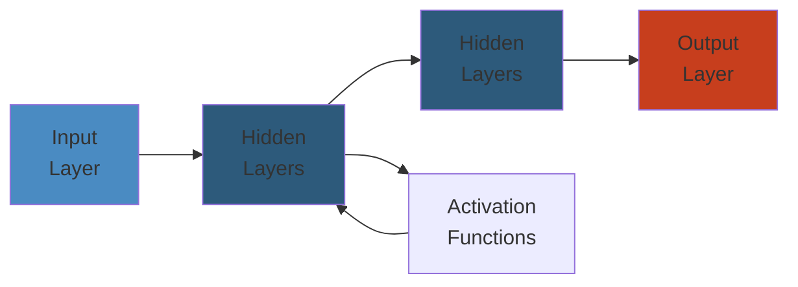

# 🔧 Kafka Internals — Complete Deep Dive

**Related**: [Kafka Basics](01-kafka-basics.md) · [Kafka Patterns](02-kafka-patterns.md) · [Production Operations](04-kafka-production-operations.md) · [KRaft Migration](../kafka/04-kafka-production-operations.md)

---




## Table of Contents

- [Log Segment Internals](#-log-segment-internals)
- [Log Compaction Mechanics](#-log-compaction-mechanics)
- [Partition Leadership & Controller Election](#-partition-leadership--controller-election)
- [ISR Shrink / Expand](#-isr-shrink--expand)
- [Kafka Request Flow](#-kafka-request-flow)
- [Kafka Wire Protocol](#-kafka-wire-protocol)
- [Producer Internals](#-producer-internals)
- [Consumer Internals](#-consumer-internals)
- [Group Coordinator Protocol](#-group-coordinator-protocol)
- [Transaction Protocol](#-transaction-protocol)
- [KRaft — Kafka Raft Meta(d)ology](#-kraft--kafka-raft-metadology)
- [Simplest Mental Model](#-simplest-mental-model)

---

## 📚 Log Segment Internals

### File Structure

```text
A topic-partition is a directory of segments:

  /var/lib/kafka/data/mytopic-0/
  ├── 00000000000000000000.log         # Actual messages (batch format v2)
  ├── 00000000000000000000.index       # Offset → physical position mapping
  ├── 00000000000000000000.timeindex   # Timestamp → offset mapping
  ├── 00000000000000000000.producer.snapshot  # Producer ID + epoch state
  ├── 00000000000000000000.txnindex    # Transaction index
  ├── leader-epoch-checkpoint          # Leader epoch → offset mapping
  └── partition.metadata               # Partition metadata (version, topic_id)

  Each segment is ~1 GB (log.segment.bytes=1073741824) or 7 days (log.roll.hours=168)
```

```text
  ┌─────────────┐     ┌─────────────┐     ┌─────────────┐
  │ Segment 0   │     │ Segment 1   │     │ Segment 2   │[active]
  │ log         │     │ log         │     │ log         │
  │ index       │     │ index       │     │ index       │
  │ timeindex   │     │ timeindex   │     │ timeindex   │
  │ [read-only] │     │ [read-only] │     │ [read-only] │
  └─────────────┘     └─────────────┘     └─────────────┘

  Segments 0,1 are eligible for compaction/deletion.
  Segment 2 is active (currently being written to).
```

### Index File (Offset → Position)

```text
  index is a sparse file: every 4KB of log data = 1 entry.
  Entry: [4-byte relative offset] [4-byte position]

  Entries allow binary search to find physical position fast.
  Timeindex: [8-byte timestamp] [4-byte relative offset]
```

```
// index contents (binary):
[ rel_offset=0  ][ pos=0      ]
[ rel_offset=200][ pos=4096   ]  // 200th msg at byte 4096
[ rel_offset=400][ pos=8192   ]
```

---

## 🧹 Log Compaction Mechanics

### Overview

```text
  Log compaction keeps the latest value for each key.
  Old (key,value) pairs are cleaned away.

  Before compaction:
    Key   Value
    A     v1
    B     v1
    A     v2    ← latest for key A
    C     v1
    A     v3    ← latest for key A
    B     v2    ← latest for key B

  After compaction:
    C     v1
    A     v3
    B     v2
```

### Compaction Process

```text
  Cleaner thread traverses log:
    1. Scan segments, build map of (key → latest offset)
    2. Filter out messages whose key has a later occurrence
    3. Write surviving messages to new clean segment
    4. Replace old segment with clean segment
    5. Deleted messages become tombstones (if delete.retention.ms elapsed)

  ┌─ Dirty Segment ────┐        ┌─ Clean Segment ──┐
  │ k1:v1  k2:v1      │        │ k2:v1            │
  │ k1:v2  k3:v1      │  ──►   │ k3:v1            │
  │ k1:v3  k2:v2      │        │ k1:v3  k2:v2     │
  │                   │        │                  │
  │ k1:v1 and k1:v2   │        │ (latest value    │
  │ k2:v1 are removed  │        │  for each key)   │
  └───────────────────┘        └──────────────────┘
```

### Delete vs Compact Policy

| Policy | Behavior | Use Case |
|---|---|---|
| `delete` | Remove segments after time/size | Logs, metrics (old data not needed) |
| `compact` | Keep latest per key | Key-value store, user profile updates |
| `compact,delete` | Compact first, delete after TTL | Latest + retention boundary |

```bash
# Compacted topic
kafka-topics --create --topic user-profiles \
  --config cleanup.policy=compact \
  --config delete.retention.ms=86400000 \
  --config segment.ms=60000 \
  --bootstrap-server localhost:9092
```

---

## 👑 Partition Leadership & Controller Election

### Controller State Machine

```text
  ┌─────────────────────┐
  │                     │
  │   Kafka Controller  │  (one per cluster, elected via ZooKeeper or KRaft)
  │                     │
  │   Responsibilities: │
  │   - Partition leader election          │
  │   - ISR change notification            │
  │   - Topic creation/deletion            │
  │   - Broker registration/monitoring     │
  │   - Preferred leader election          │
  └─────────────────────────────────────────┘

  Leader epoch counter: 0-based, increments every leader change
  Every produce/consume request carries epoch to detect stale leaders
```

### Leader Election Steps

```text
  1. Controller detects broker failure (session timeout)
  2. Controller identifies affected partitions
  3. For each partition, pick the next ISR member as leader
  4. New leader increments leader epoch
  5. New leader accepts produce/consume requests
  6. Controller sends LeaderAndIsr request to all affected brokers
```

```text
  Partition 0 on Broker 3 (leader), epoch=4

  Broker 3 fails ──► controller picks Broker 1 (ISR)
       │
       ▼
  Partition 0 now on Broker 1 (leader), epoch=5
       │
       ▼
  Follower Brokers 2,4 replicate from Broker 1
```

---

## 🔄 ISR Shrink / Expand

```text
  ISR = In-Sync Replicas — replicas fully caught up with the leader.

  Shrink condition:
    replica.lag.time.max.ms (default: 30s)
    If a follower hasn't fetched any message within this window → removed from ISR

  Expand condition:
    Follower catches up to leader's LEO (Log End Offset)
    → added back to ISR

  ┌────────────────────────────────────────────────────────┐
  │  Timeline:                                             │
  │                                                        │
  │  Broker 1 (leader) LEO=1000                            │
  │  Broker 2 (follower) LEO=1000  ← ISR                  │
  │  Broker 3 (follower) LEO=500   ← out-of-sync, lagging │
  │                                                        │
  │  After replica.lag.time.max.ms:                        │
  │  ISR = [Broker 1, Broker 2]  (Broker 3 removed)       │
  │                                                        │
  │  If Broker 3 catches up to LEO=1000:                   │
  │  ISR = [Broker 1, Broker 2, Broker 3] (added back)    │
  └────────────────────────────────────────────────────────┘
```

### configs affecting ISR

```bash
# Legacy: max messages follower can lag (deprecated v0.9+)
replica.lag.max.messages=4000

# Modern: max time follower can lag (default 30000ms)
replica.lag.time.max.ms=30000

# Minimum ISR for availability
min.insync.replicas=2
```

---

## 📥 Kafka Request Flow

### Full Pipeline

```text
  Client (Producer/Consumer)
       │
       │  Kafka protocol (binary over TCP)
       ▼
  ┌─────────────────── Acceptor (1 per broker) ─────────────────┐
  │  Accepts TCP connections, passes to Processor               │
  └─────────────────────────────────────────────────────────────┘
       │
       ▼
  ┌─────────────────── Processor (network threads) ─────────────┐
  │  num.network.threads=3 (default)                            │
  │  1. Parse request header (api_key, api_version, correlation_id) │
  │  2. Authentication (SASL handshake)                        │
  │  3. Quota check                                             │
  │  4. Enqueue to request queue                                │
  └─────────────────────────────────────────────────────────────┘
       │
       ▼
  ┌─────────────────── Request Queue ───────────────────────────┐
  │  Shared queue (blocking queue)                              │
  └─────────────────────────────────────────────────────────────┘
       │
       ▼
  ┌─────────────────── IO Threads ──────────────────────────────┐
  │  num.io.threads=8 (default)                                 │
  │  1. Dequeue request                                         │
  │  2. Process (append to log, fetch from log, etc.)          │
  │  3. Enqueue response to response queue                     │
  └─────────────────────────────────────────────────────────────┘
       │
       ▼
  ┌─────────────────── Response Queue ──────────────────────────┐
  │  Per-processor response queue                               │
  └─────────────────────────────────────────────────────────────┘
       │
       ▼
  ┌─────────────────── Processor ───────────────────────────────┐
  │  Send response back to client                               │
  └─────────────────────────────────────────────────────────────┘
```

---

## 🔌 Kafka Wire Protocol

### Request/Response Header

```text
  Request Header v2:
    api_key: int16         (0=Produce, 1=Fetch, 3=Metadata, ...)
    api_version: int16
    correlation_id: int32  (matches request to response)
    client_id: string
    request_headers: [tagged_fields]

  Response Header v1:
    correlation_id: int32
    error_code: int16
    throttle_time_ms: int32
    tagged_fields: [...]
```

### Record Batch Format v2

```text
  ┌────────────────────────────────────────────────────────┐
  │                    RecordBatch                         │
  │                                                        │
  │  BaseOffset: int64      │ LastOffsetDelta: int32       │
  │  PartitionLeaderEpoch: int32                           │
  │  ProducerId: int64      │ ProducerEpoch: int16          │
  │  BaseSequence: int32    │ RecordsCount: int32           │
  │                                                        │
  │  ┌────────────────────────────────────────────────┐    │
  │  │  Records[]:                                   │    │
  │  │  ┌────────────────────────────────────────┐   │    │
  │  │  │ Record v2:                            │   │    │
  │  │  │  Length: varint                       │   │    │
  │  │  │  Attributes: int8                     │   │    │
  │  │  │  TimestampDelta: varint               │   │    │
  │  │  │  OffsetDelta: varint                  │   │    │
  │  │  │  Key: bytes (nullable)                │   │    │
  │  │  │  Value: bytes (nullable)              │   │    │
  │  │  │  Headers: [Header]                    │   │    │
  │  │  │    Header: key:string, value:bytes    │   │    │
  │  │  └────────────────────────────────────────┘   │    │
  │  └────────────────────────────────────────────────┘    │
  └────────────────────────────────────────────────────────┘
```

---

## 📤 Producer Internals

### Accumulator & Sender Thread

```text
  Producer client internals:

  KafkaProducer.send(record)
       │
       ▼
  ┌─────────────────────────────────────────┐
  │           RecordAccumulator             │
  │                                         │
  │  ┌──────┐ ┌──────┐ ┌──────┐            │
  │  │ tp-0 │ │ tp-1 │ │ tp-2 │  Batches   │
  │  │batch │ │batch │ │batch │  per (topic,│
  │  └──────┘ └──────┘ └──────┘  partition) │
  │                                         │
  │  buffer.memory=33554432 (32MB)          │
  │  max.block.ms=60000                     │
  └─────────────────────────────────────────┘
       │
       ▼
  ┌─────────────────────────────────────────┐
  │    Sender Thread (background thread)    │
  │                                         │
  │  Every linger.ms (default 0ms):         │
  │  1. Drain ready batches from accumulator│
  │  2. Group batches by broker             │
  │  3. Apply compression (gzip, snappy,    │
  │     lz4, zstd)                         │
  │  4. Send produce requests               │
  │  5. Handle responses (retries, acks)    │
  └─────────────────────────────────────────┘
```

### Batch Sizing

```bash
# Batch tuning
linger.ms=5                     # Wait up to 5ms for more records
batch.size=65536                # 64KB batch target
max.request.size=1048576        # 1MB max request
buffer.memory=134217728         # 128MB accumulator
compression.type=zstd           # Best compression ratio
```

```text
  batch.size vs linger.ms:
  ─────────────────────────
  - First record for a partition creates a batch
  - More records for same partition fill the batch
  - Batch sent when: batch full OR linger.ms elapsed
  - Larger batches → better compression, fewer requests
  - Trade-off: adds latency (linger.ms)
```

### Partitioner

```text
  Default partitioner (since v2.4):
    - sticky partitioning: batches same-key to same partition
    - UniformStickyPartitioner: round-robin if no key, else murmur2(key) % partitions

  Custom partitioner:
    producer.setPartitioner(() -> new RoundRobinPartitioner())
```

---

## 📥 Consumer Internals

### Fetch Request Flow

```text
  Consumer.poll(Duration)
       │
       ▼
  ┌─────────────────────────────────────────┐
  │         Fetcher Manager                 │
  │                                         │
  │  1. Send FetchRequest to leader         │
  │     - min.bytes=1                       │
  │     - max.bytes=52428800 (50MB)         │
  │     - max.wait.ms=500                   │
  │                                         │
  │  2. Broker responds when:               │
  │     - >= min.bytes available             │
  │     - OR max.wait.ms elapsed            │
  │                                         │
  │  3. Records added to completedFetches   │
  │                                         │
  │  4. Consumer iterates partitions,        │
  │     returns records to caller           │
  └─────────────────────────────────────────┘
```

### Rebalance Protocol

```text
  ┌─ Static Group ──────┐       ┌─ Dynamic Group ────┐
  │                     │       │                     │
  │  Consumer joins     │       │  Consumer joins     │
  │  group.instance.id  │       │  member.id assigned │
  │  set (static)       │       │  (rejoin on change) │
  │                     │       │                     │
  │  Rebalance only on  │       │  Rebalance on:      │
  │  actual failure     │       │  join/leave/timeout │
  └─────────────────────┘       └─────────────────────┘
```

### Eager vs Cooperative Sticky

```text
  Eager (older):
    All consumers revoke ALL partitions
    → Stop the world
    → Reassign everything
    → Short stop-the-world pause

  Cooperative Sticky (recommended, since v2.4):
    ┌────────────────────────────────────────────┐
    │  Step 1: Consumer A revokes partitions [0,1] │
    │  Step 2: Rebalance, Consumer B takes [0,1]   │
    │  Step 3: Consumer B starts processing [0,1]  │
    │  (A keeps its other partitions)              │
    └────────────────────────────────────────────┘
    → Only revoked partitions pause
    → Faster convergence, less disruption
```

```bash
# Enable cooperative sticky
partition.assignment.strategy=org.apache.kafka.clients.consumer.CooperativeStickyAssignor
```

---

## 👥 Group Coordinator Protocol

### Protocol Flow

```text
  Consumer Group lifecycle:

  ┌─────┐     ┌──────┐     ┌─────┐
  │ C1  │     │Coord │     │ C2  │
  └──┬──┘     └──┬───┘     └──┬──┘
     │           │            │
     │──JoinGroup─────────────│──JoinGroup
     │           │            │
     │◄─Sync─── │ ──Sync─────►│  (leader computes assignment)
     │          │             │
     │────Heartbeat───────────│────Heartbeat
     │          │             │
     │◄─HeartbeatResponse────►│◄─HeartbeatResponse
     │          │             │
     │ (periodic heartbeat, session.timeout.ms=45s) │
     │          │             │
     │──LeaveGroup            │
     │          │             │
     │          │────Rebalance (C2 notified)
```

| Protocol | Purpose |
|---|---|
| **JoinGroup** | Consumer requests membership, returns group leader ID |
| **SyncGroup** | Leader sends partition assignment to coordinator, coordinator distributes |
| **Heartbeat** | Keep-alive + position updates (every `heartbeat.interval.ms`) |
| **LeaveGroup** | Graceful departure |

---

## 📝 Transaction Protocol

### Transaction Flow

```text
  Exactly-Once Semantics (EOS) transaction protocol:

  1. FindTransactionCoordinator
     Producer sends FindCoordinatorRequest for transactional_id

  2. InitProducerId
     Coordinator returns ProducerId + ProducerEpoch
     (epoch bumps on re-init to fence old producer)

  3. AddPartitionsToTxn
     Register partitions that will participate in transaction

  4. Produce (within transaction)
     Data sent with batch attribute: isTransactional=true

  5. EndTxn (Commit / Abort)
     Coordinator writes COMMIT/ABORT marker to transaction log
     → LSO advances past committed offsets
     → Aborted messages skipped on consume (abortedTransactions in fetch response)

  ┌─────────────────────────────────────────────────────────┐
  │                                                         │
  │  Transaction Log (__transaction_state)                  │
  │  ┌──────────┬──────────┬──────────┬──────────┐         │
  │  │ Txn A    │ Txn B    │ Txn A    │ Txn C    │         │
  │  │ PREPARE  │ PREPARE  │ COMMIT   │ PREPARE  │         │
  │  └──────────┴──────────┴──────────┴──────────┘         │
  │                                                         │
  │  LSO = min(LEO of all partitions, abort markers)       │
  └─────────────────────────────────────────────────────────┘
```

---

## 🗳️ KRaft — Kafka Raft Meta(d)ology

### Architecture

```text
  ┌─────────────────────────────────────────────────────────┐
  │                                                         │
  │   KRaft removes ZooKeeper dependency.                  │
  │   Controller = Raft-based quorum of broker nodes.       │
  │                                                         │
  │  ┌──────────┐  ┌──────────┐  ┌──────────┐              │
  │  │  Broker  │  │  Broker  │  │  Broker  │              │
  │  │ (voter)  │  │ (voter)  │  │ (voter)  │  quorum      │
  │  └────┬─────┘  └────┬─────┘  └────┬─────┘             │
  │       │             │             │                    │
  │       └─────────────┼─────────────┘                    │
  │                     │                                  │
  │            __cluster_metadata                          │
  │            (internal topic, 1 partition, R=3)          │
  │                                                         │
  └─────────────────────────────────────────────────────────┘
```

### Metadata Topic

```text
  __cluster_metadata topic:
    Single partition, replicated to controller quorum

  Records stored:
    - Broker registrations
    - Topic configurations
    - Partition assignments
    - ISR changes
    - Producer IDs
    - Delegation tokens

  ┌────────────────────────────────────────┐
  │  Record:                               │
  │  - type: RegisterBrokerRecord          │
  │  - brokerId: 1                         │
  │  - endpoints: ["PLAINTEXT://host:9092"]│
  │  - rack: "us-east-1a"                 │
  └────────────────────────────────────────┘
```

### Controller Quorum Votes

```text
  Raft consensus with 3 controllers:

  ┌────────────────────────────────────────────┐
  │  Leader election:                          │
  │                                            │
  │  C1 (candidate) ──VoteRequest──► C2, C3    │
  │  C2 ──VoteResponse──► C1 (grant)           │
  │  C3 ──VoteResponse──► C1 (grant)           │
  │  C1 becomes leader (2/3 majority)          │
  │                                            │
  │  Metadata write:                           │
  │  C1 (leader) ──AppendRequest──► C2, C3     │
  │  C2, C3 ──AppendResponse (persisted)       │
  │  C1 commits (2/3 ack)                      │
  └────────────────────────────────────────────┘
```

### ZooKeeper vs KRaft

| Feature | ZooKeeper | KRaft |
|---|---|---|
| **Controller** | Elected via ZK | Raft consensus |
| **Metadata** | Stored in ZK | Stored in __cluster_metadata topic |
| **Scalability** | ~200K partitions limit | ~1M+ partitions |
| **Startup** | Slow (ZK + broker) | Fast (single binary) |
| **Migration** | N/A | ZK → KRaft migration tool |

### Migration Commands

```bash
# 1. Enable migration (on ZK cluster)
kafka-features --bootstrap-server localhost:9092 --enable-feature "metadata.version" --feature-version 2.8

# 2. Add KRaft controllers
kafka-storage format -t <uuid> -c config/kraft-server.properties

# 3. Migrate
kafka-migration.sh --controller-quorum-voters 1@localhost:9093

# 4. Finalize
kafka-features --bootstrap-server localhost:9092 --finalize-migration
```

---

## 🧠 Simplest Mental Model

```text
┌──────────────────────────────────────────────────────────────────┐
│                                                                   │
│    Kafka Internals = How Kafka really works under the hood       │
│                                                                   │
│    Log segments = files on disk holding messages in order        │
│    Compaction = keeping only the latest value for each key       │
│    ISR = which replicas are caught up with the leader            │
│    Request flow = TCP → network thread → queue → IO thread → disk │
│    Producer = batches messages, sends in background thread       │
│    Consumer = fetches in pull model, rebalances on changes       │
│    Transactions = exactly-once across partitions                 │
│    KRaft = ZK-less Kafka using Raft for metadata consensus      │
│                                                                   │
└──────────────────────────────────────────────────────────────────┘
```


## Practical Example

See code examples above for practical usage patterns.