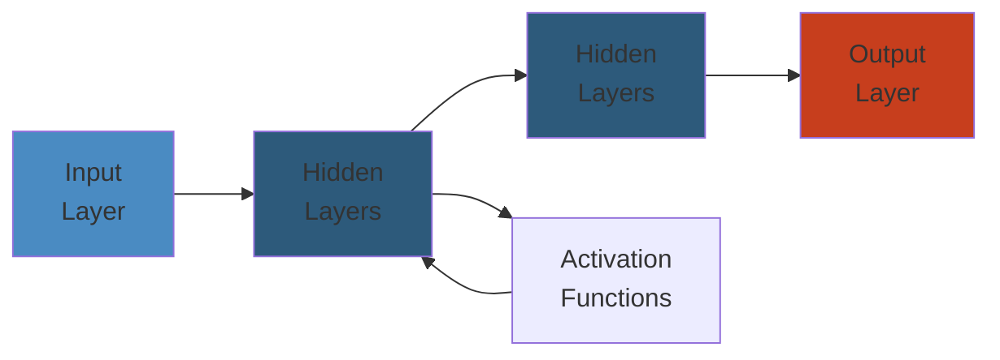

# ⚙️ Kafka Production Operations — Complete Deep Dive




## 📋 Table of Contents
- [Cluster Sizing](#cluster-sizing)
- [Disk Sizing](#disk-sizing)
- [Broker Tuning](#broker-tuning)
- [JMX Monitoring](#jmx-monitoring)
- [Burrow & Cruise Control](#burrow--cruise-control)
- [Partition Reassignment](#partition-reassignment)
- [Rolling Upgrade](#rolling-upgrade)
- [Security](#security)
- [MirrorMaker 2](#mirrormaker-2)
- [Disaster Recovery](#disaster-recovery)
- [Client Tuning](#client-tuning)
- [Quotas](#quotas)

---

## Cluster Sizing

```
Brokers = max(
    (total_throughput / per_broker_throughput),
    (total_partitions / 4000),
    RF * 2 + 1  (ISR quorum)
)
```

**Replication Factor**: RF=3 for production (tolerates 1 failure). `min.insync.replicas=2`.

### Partitions
```text
target = 100 MB/s, max partition throughput = 20 MB/s
min partitions = 5 → double for headroom → 10

Rule: total partitions < 4000 per broker (controller load grows beyond)
```

---

## Disk Sizing

```
total_storage = daily_throughput * retention_days * RF
Example: 1 TB/day × 7 days × 3 RF = 21 TB (3.5 TB/broker at 6 brokers)
```

**Hardware**: NVMe SSD mandatory (no NFS/NAS). Separate `log.dirs` by mount for parallelism.

---

## Broker Tuning

```properties
num.network.threads=8           # CPU cores × 2
num.io.threads=16                # CPU cores × 4
num.recovery.threads.per.data.dir=2

log.segment.bytes=1073741824     # 1 GB
log.retention.hours=168          # 7 days
log.cleaner.threads=4

compression.type=producer        # inherit from producer (use zstd)
unclean.leader.election.enable=false   # NEVER enable — data loss
min.insync.replicas=2
```

---

## Simplest Mental Model

> **Kafka is a distributed commit log. Partitions are parallel lanes (ordered). Replication copies each lane to 3 brokers. The controller is the traffic cop. Zookeeper/KRaft is the map.**

---

## JMX Monitoring

```bash
export KAFKA_JMX_OPTS="-Dcom.sun.management.jmxremote -Dcom.sun.management.jmxremote.port=9999"
```

### Critical Metrics

| MBean | Alert Threshold |
|-------|----------------|
| `UnderReplicatedPartitions` | > 0 for > 1 min |
| `OfflinePartitionsCount` | > 0 |
| `RequestHandlerAvgIdlePercent` | < 0.3 |
| G1 GC time | > 5% of runtime |

---

## Burrow & Cruise Control

**Burrow**: Linkedin's lag monitor — evaluates consumer progress across 3 windows (EXP/OK/LAG). Consumer-agnostic.
```bash
curl http://burrow:8000/v3/kafka/local/consumer/my-group/lag
```

**Cruise Control**: automatic partition rebalancing via REST API.
```bash
curl -X POST "http://localhost:9090/kafkacruisecontrol/rebalance?dryrun=false"
```
Goals (priority): RackAware → MinTopicLeaders → ReplicaDistribution → DiskCapacity.

---

## Partition Reassignment

When adding/removing brokers:
```bash
kafka-reassign-partitions.sh --bootstrap-server localhost:9092 \
  --generate --topics-to-move-json-file topics.json --broker-list "1,2,3,4"
kafka-reassign-partitions.sh --bootstrap-server localhost:9092 --execute \
  --reassignment-json-file reassign.json
```

**Preferred leader election**: `auto.leader.rebalance.enable=true` (default).

---

## Rolling Upgrade

```text
1. Set inter.broker.protocol.version=OLD (leave new binary)
2. Rolling restart one broker at a time:
   wait → SIGTERM → start new → wait for ISR
3. ALL upgraded: set inter.broker.protocol.version=NEW
4. Second rolling restart
5. (Optional) upgrade message format
```

```properties
inter.broker.protocol.version=3.4
```

---

## Security

### SASL/SCRAM (hashed creds in ZK/KRaft)
```bash
kafka-configs.sh --bootstrap-server localhost:9092 \
  --alter --add-config 'SCRAM-SHA-256=[password=secret]' \
  --entity-type users --entity-name producer-user
```

### mTLS
```properties
ssl.keystore.location=/var/kafka/server.keystore.jks
ssl.client.auth=required
```

### ACLs
```bash
kafka-acls.sh --authorizer-properties zookeeper.connect=localhost:2181 \
  --add --allow-principal User:producer-user \
  --operation Write --topic my-topic
```

---

## MirrorMaker 2

Replicates topics across clusters. Internal topics: `A.my-topic`, `heartbeat`, `checkpoint`.

```properties
clusters=A,B
A.bootstrap.servers=broker-a1:9092
B.bootstrap.servers=broker-b1:9092
A->B.enabled=true
topics=.*
sync.group.offsets.enabled=true
```

---

## Disaster Recovery

### Active-Passive
```text
PROD (active) ──► MM2 ──► DR (passive, standby consumers)
  Failover: redirect DNS/producer config to DR
```

### Active-Active
Both clusters have producers. Challenge: conflict resolution for same keys.

### Recovery
1. Stop MM2, redirect producers to DR
2. Validate offsets
3. Redirect consumers
4. When primary back: reverse replicate, fail back

---

## Client Tuning

### Producer
```properties
acks=all                     # Strongest durability
batch.size=16384             # 16 KB — increase for throughput
linger.ms=5                  # Fill batch up to 5ms
compression.type=zstd        # Best compression ratio
enable.idempotence=true      # Exactly-once
retries=2147483647           # Infinite retries
```

### Consumer
```properties
enable.auto.commit=false
auto.offset.reset=earliest
fetch.min.bytes=1
max.poll.records=500
session.timeout.ms=45000
heartbeat.interval.ms=3000
max.poll.interval.ms=300000
partition.assignment.strategy=org.apache.kafka.clients.consumer.CooperativeStickyAssignor
```

---

## Quotas

Limit network throughput per client-id:
```bash
kafka-configs.sh --bootstrap-server localhost:9092 \
  --alter --add-config 'producer_byte_rate=10485760,consumer_byte_rate=20971520' \
  --entity-type clients --entity-default
```

**Use**: prevent noisy tenants from saturating broker bandwidth.

---

## 📚 Key Takeaways

| Topic | Golden Rule |
|-------|-------------|
| Sizing | RF=3, min.insync=2, partitions < 4000/broker |
| Compression | Always enable (zstd) — 2-4x bandwidth reduction |
| Monitoring | UnderReplicatedPartitions = #1 signal |
| Security | SCRAM > PLAIN; mTLS for prod; ACL everything |
| Upgrades | Two rolling restarts: protocol first, then format |
| DR | Active-passive with MM2; test failover quarterly |
| Clients | Idempotent producer, cooperative rebalance |
| Quotas | Essential for multi-tenant clusters |


---

## Code Examples

```python
# Example implementation
# [Add language-specific code demonstrating core concept]
pass
```

---

## Common Failure Modes

**Problem**: [Key issue in production]

**Root cause**: [Why it happens]

**Solution**: [How to fix]

---

## Interview Questions

### Q1: [Core concept question]

**Answer**: [Detailed explanation with trade-offs]

### Q2: [Design/architecture question]

**Answer**: [Best practices and reasoning]
