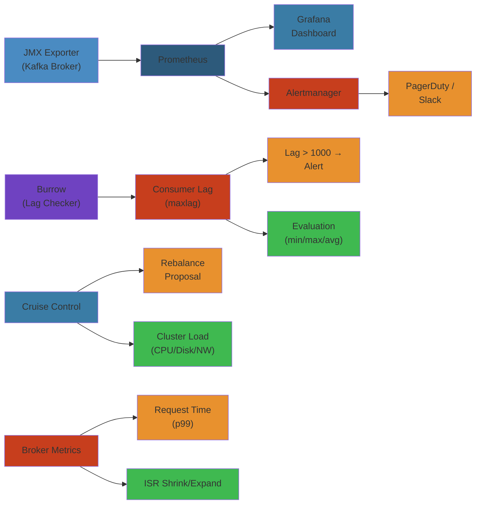

# 📊 Kafka Monitoring & Alerting — Complete Deep Dive




## Scope


Production-grade reference for Kafka observability covering JMX metrics, consumer lag monitoring (Burrow), Cruise Control for cluster rebalancing, Prometheus/Grafana dashboards, Alertmanager rules, and operational runbooks for broker/consumer/partition failures.

## Table of Contents


- [Monitoring Stack Architecture](#monitoring-stack-architecture)
- [Metrics Taxonomy](#metrics-taxonomy)
- [Broker-Level Metrics](#broker-level-metrics)
- [Topic & Partition Metrics](#topic--partition-metrics)
- [Consumer & Lag Metrics](#consumer--lag-metrics)
- [Consumer Lag Evaluation (Burrow)](#consumer-lag-evaluation-burrow)
- [Kafka Cruise Control](#kafka-cruise-control)
- [Prometheus + Grafana Setup](#prometheus--grafana-setup)
- [Alerting Rules](#alerting-rules)
- [Operational Runbooks](#operational-runbooks)
- [Failure Analysis](#failure-analysis)

---

## Monitoring Stack Architecture


```
                        ┌──────────────────────────────┐
                        │        Kafka Cluster           │
                        │  ┌─────┐ ┌─────┐ ┌─────┐     │
                        │  │B1   │ │B2   │ │B3   │     │
                        │  └──┬──┘ └──┬──┘ └──┬──┘     │
                        │     │       │       │         │
                        └─────┼───────┼───────┼─────────┘
                              │       │       │
          ┌───────────────────┼───────┼───────┼───────────────────┐
          │                   │       │       │                   │
          ▼                   ▼       ▼       ▼                   ▼
  ┌──────────────┐   ┌──────────────────────────┐   ┌──────────────────┐
  │  JMX Exporter │   │    kafka_exporter        │   │  Burrow (Lag)    │
  │ (broker JMX)  │   │  (lag + topic metrics)   │   │  evaluation      │
  │ port 9404     │   │  port 9308               │   │  port 8000       │
  └───────┬───────┘   └───────────┬──────────────┘   └──────┬───────────┘
          │                       │                         │
          ▼                       ▼                         ▼
  ┌─────────────────────────────────────────────────────────────┐
  │                   Prometheus Server                           │
  │  Targets: JMX exporter (per broker), kafka_exporter, Burrow   │
  │  Scrape interval: 15s                                        │
  │  Retention: 30d                                              │
  └─────────────────────────┬───────────────────────────────────┘
                            │
                            ▼
  ┌─────────────────────────────────────────────────────────────┐
  │                    Grafana Dashboards                        │
  │  - Kafka Cluster Overview (JMX)                             │
  │  - Kafka Topic Detail                                       │
  │  - Consumer Group Lag                                       │
  │  - Consumer Group Detail                                    │
  │  - Cruise Control Cluster Load                              │
  └─────────────────────────────────────────────────────────────┘
                            │
                            ▼
  ┌─────────────────────────────────────────────────────────────┐
  │                    Alertmanager                              │
  │  Routes -> receivers (PagerDuty, Slack, Email)              │
  │  Inhibition rules: critical silences warning                │
  └─────────────────────────────────────────────────────────────┘
```

---

## Metrics Taxonomy


```
  ┌──────────────────┐
  │   Broker         │  UnderReplicatedPartitions, OfflinePartitions
  │   Metrics        │  ActiveController, LeaderElectionRate
  │                  │  RequestHandlerAvgIdle, NetworkProcessorAvgIdle
  │                  │  Produce/Fetch total time p99
  │                  │  LogFlushRateAndTime, ISRShrink/Expand
  └──────────────────┘
  ┌──────────────────┐
  │   Topic /        │  BytesInPerSec, BytesOutPerSec
  │   Partition      │  MessagesInPerSec, TotalFetchRequestsPerSec
  │   Metrics        │  TotalProduceRequestsPerSec
  │                  │  ReplicationBytesIn/OutPerSec
  │                  │  PreferredReplicaImbalanceCount
  │                  │  PartitionSize, SegmentCount
  └──────────────────┘
  ┌──────────────────┐
  │   Producer       │  request-latency-avg, response-rate
  │   Metrics        │  outgoing-byte-rate, io-wait-time-ns-avg
  │   (JXM or Mic.)  │  batch-size-avg, compression-rate-avg
  │                  │  record-error-rate, record-retry-rate
  └──────────────────┘
  ┌──────────────────┐
  │   Consumer       │  records-lag-max, records-lag
  │   Metrics        │  fetch-rate, fetch-latency-avg
  │                  │  records-consumed-rate, committed-offset
  │                  │  assignment-size (sticky assignor)
  └──────────────────┘
  ┌──────────────────┐
  │   Cluster        │  ActiveBrokers, ControllerOnline
  │   (via JMX)      │  ClusterPartitions, ClusterTopics
  └──────────────────┘
```

## Broker-Level Metrics


### Critical MBeans


```
  MBean                                Metric                   Interpretation
  ─────────────────────────────────────────────────────────────────────────────
  kafka.server:type=BrokerTopicMetrics
    .BytesInPerSec                     rate                     request rate
    .BytesOutPerSec                    rate                     response rate
    .MessagesInPerSec                  rate                     message rate

  kafka.server:type=ReplicaManager
    .UnderReplicatedPartitions         gauge                    count of URP
    .UnderMinIsrPartitionCount         gauge                    partitions below min.insync.replicas
    .LeaderCount                       gauge                    leader partitions on broker
    .PartitionCount                    gauge                    total partitions on broker
    .OfflineReplicaCount               gauge                    offline replicas

  kafka.controller:type=KafkaController
    .ActiveControllerCount             gauge                    should always be 1
    .OfflinePartitionsCount            gauge                    partitions with no leader
    .PreferredReplicaImbalanceCount    gauge                    partitions not on preferred leader
    .LeaderElectionRateAndTimeMs       rate + histogram         frequency/duration of leader elections
    .UncleanLeaderElectionsPerSec      rate                     elections with out-of-sync replicas

  kafka.server:type=RequestMetrics
    .requestLatencyMs                  histogram                p50/p90/p99/avg
      (name=Produce/Fetch/ConsumerMetadata/etc)

  kafka.network:type=RequestMetrics
    .TotalTimeMs                       histogram                total request handling time

  kafka.server:type=KafkaRequestHandlerPool
    .RequestHandlerAvgIdlePercent      gauge                    < 30% = bottleneck

  kafka.network:type=Processor
    .NetworkProcessorAvgIdlePercent    gauge                    < 10% = network saturation

  kafka.server:type=SessionExpireListener
    .ZooKeeperAuthFailedPerSec         rate                     auth issues
    .ZooKeeperDisconnectsPerSec        rate                     connectivity issues
```

### Key Broker Thresholds


```yaml
UnderReplicatedPartitions:
  warning: > 0 for > 5m
  critical: > 0 for > 30m
  action: check ISR shrink events, broker disk/CPU, network

RequestHandlerAvgIdlePercent:
  warning: < 30%
  critical: < 10%
  action: increase num.io.threads (default 8)

NetworkProcessorAvgIdlePercent:
  warning: < 10%
  action: increase num.network.threads (default 3)

Produce/Fetch p99:
  warning: > 500ms
  critical: > 2000ms
  action: check disk I/O, network, kafka tier, produce acks config

ActiveControllerCount:
  critical: != 1
  action: investigate ZK connectivity, forced leader election

LogFlushTime p99:
  warning: > 100ms
  action: check disk I/O, fsync behavior
```

---

## Topic & Partition Metrics


### Partition Size Monitoring


```bash
# Get partition sizes per topic (scripts/kafka-log-dirs.sh)
kafka-log-dirs.sh --bootstrap-server localhost:9092 \
  --describe --topic-list my-topic | jq '.brokers[].logDirs[].partitions[]'
```

```yaml
# Partition sizing thresholds
partition_size:
  warning: > 50GB
  critical: > 100GB
  action: increase partition count, adjust retention

segment_count:
  warning: > 1000
  action: compaction may need tuning, check log.cleaner.backoff.ms

preferredReplicaImbalanceCount:
  warning: > 0
  action: run kafka-leader-election.sh --election-type preferred
```

### Partition Distribution Dashboard


```
  Broker │ Leader Count │ Partition Count │ Disk Used │ Throughput (MB/s)
  ───────┼──────────────┼─────────────────┼───────────┼─────────────────
  B1     │ 120          │ 350             │ 2.1 TB    │ 45              │
  B2     │ 80           │ 290             │ 1.8 TB    │ 38              │
  B3     │ 150          │ 410             │ 2.5 TB    │ 52              │
  ───────┼──────────────┼─────────────────┼───────────┼─────────────────
  Total  │ 350          │ 1050            │ 6.4 TB    │ 135             │
  Goal   │ balanced     │ balanced        │ even      │ even            │
```

---

## Consumer & Lag Metrics


### Consumer Fetch Manager MBeans


```
  MBean                                              Metric
  ─────────────────────────────────────────────────────────
  kafka.consumer:type=consumer-fetch-manager-metrics
    .records-lag-max                                gauge (all partitions)
    .records-lag                                    gauge (current partition)
    .records-lag-avg                                gauge
    .fetch-rate                                     rate
    .fetch-latency-avg                              gauge (ms)
    .records-consumed-rate                          rate
    .bytes-consumed-rate                            rate
    .records-per-request-avg                        gauge

  kafka.consumer:type=consumer-coordinator-metrics
    .assigned-partitions                            gauge
    .commit-rate                                    rate
    .commit-latency-avg                             gauge (ms)
    .heartbeat-response-time-max                    gauge (ms)
    .last-heartbeat-seconds-ago                     gauge
    .rebalance-latency-avg                          gauge (ms)
    .rebalance-rate-per-hour                        rate
    .failed-rebalance-rate-per-hour                 rate
```

### Consumer Lag Graph


```
  Consumer Group: my-app-1
  Partition │ Current Offset │ Log End Offset │ Lag     │ Status
  ──────────┼────────────────┼────────────────┼─────────┼─────────
  p0        │ 1500000        │ 1500500        │ 500     │ OK
  p1        │ 3200000        │ 3200200        │ 200     │ OK
  p2        │ 2800000        │ 2801000        │ 1000    │ WARNING │
  p3        │ 1000000        │ 1000300        │ 300     │ OK
  ──────────┼────────────────┼────────────────┼─────────┼─────────
  Total     │ 8500000        │ 8505000        │ 2000    │ WARNING

  Lag over time:

   Lag
  5000 │
  4000 │              ░░░█
  3000 │        ░░░░░█
  2000 │  ░░░░░█
  1000 │█░░
     0 └──────────────────────────────────►
       10:00  10:05  10:10  10:15  10:20
              ^ consumer restart ← lag spike
```

---

## Consumer Lag Evaluation (Burrow)


### Burrow Architecture


```
  ┌──────────┐    ┌──────────┐    ┌──────────┐
  │ Kafka    │    │ Kafka    │    │ Kafka    │
  │ Broker 1 │    │ Broker 2 │    │ Broker 3 │
  └────┬─────┘    └────┬─────┘    └────┬─────┘
       │                │               │
       └────────────────┼───────────────┘
                        │
               ┌────────▼────────┐
               │   Burrow        │
               │  (consumer lag  │
               │   evaluation)   │
               │  port 8000      │
               └────────┬────────┘
                        │
          ┌─────────────┼─────────────┐
          │             │             │
          ▼             ▼             ▼
  ┌────────────┐ ┌────────────┐ ┌────────────┐
  │ Prometheus │ │   HTTP     │ │  Notifier  │
  │   scrape   │ │   API      │ │  (Slack/   │
  │   /v3/lag  │ │  /v3/kafka │ │  Email)    │
  └────────────┘ └────────────┘ └────────────┘
```

### Burrow Consumer Status Evaluation


```
  Burrow uses a 2-window evaluation:
  - MAXLAG window: current lag compared to max observed lag
  - EXPIRATION window: how long the consumer has been lagging

  States:
  OK      ──► Consumer is keeping up
  WARNING ──► Lag increasing, approaching threshold
  ERROR   ──► Lag critical, consumer falling behind
  STOP    ──► Consumer has committed no offsets recently

  Evaluation matrix:
                      Lag <= MaxLag*0.5    Lag > MaxLag*0.5
  ─────────────────────────────────────────────────────────
  No expiration        OK                  WARNING
  Expired              WARNING             ERROR
  Stale (no commit)    STOP                STOP
```

### Burrow Configuration


```hcl
# burrow-config.toml
[general]
log-level = "INFO"

[kafka.local]
broker = "kafka-broker-1:9092,kafka-broker-2:9092,kafka-broker-3:9092"
client-id = "burrow"
[tls]

[consumer.local]
servers = "kafka-broker-1:9092,kafka-broker-2:9092,kafka-broker-3:9092"
group-whitelist = ".*"          # monitor all consumer groups
group-blacklist = "burrow.*"    # exclude internal groups
offsets-topic = "__consumer_offsets"

[consumer.local.lagcheck]
threshold = 1000                # warning threshold
expire-group = "0s"             # eval expiration after group disappears

[httpserver.default]
address = ":8000"
enable-unsafe = true            # enables /v3/kafka endpoint
```

### Burrow API Endpoints


```bash
# List all monitored consumer groups
curl -s http://burrow:8000/v3/kafka/local/consumer | jq

# Get consumer group detail with lag
curl -s http://burrow:8000/v3/kafka/local/consumer/my-app-1/lag | jq

# Get consumer group status
curl -s http://burrow:8000/v3/kafka/local/consumer/my-app-1/status | jq
# Response:
# {
#   "status": "WARNING",
#   "partitions": [
#     {"partition": 0, "status": "OK", "lag": 500},
#     {"partition": 2, "status": "WARNING", "lag": 2000}
#   ]
# }

# Prometheus endpoint
curl -s http://burrow:8000/v3/kafka/local/consumer/my-app-1/lag/prometheus
```

---

## Kafka Cruise Control


### Cruise Control Architecture


```
  ┌──────────────────────────────────────────────────┐
  │              Cruise Control                       │
  │  ┌─────────────┐  ┌──────────┐  ┌──────────────┐ │
  │  │ Load        │  │ Goal     │  │ Executor     │ │
  │  │ Monitor     │  │ Evaluator│  │ (partition   │ │
  │  │ (metrics)   │  │          │  │  reassigner) │ │
  │  └──────┬──────┘  └────┬─────┘  └──────┬───────┘ │
  │         │              │                │         │
  │         ▼              ▼                ▼         │
  │  ┌──────────────────────────────────────────────┐ │
  │  │            Anomaly Detector                   │ │
  │  │  (broker failure, disk failure, metric        │ │
  │  │   anomaly -> triggers self-healing)           │ │
  │  └──────────────────────────────────────────────┘ │
  └──────────────────────────────────────────────────┘
                              │
    ┌─────────────────────────┼─────────────────────────┐
    │                         │                         │
    ▼                         ▼                         ▼
  ┌──────────┐          ┌──────────┐              ┌──────────┐
  │ Kafka    │          │ Kafka    │              │ Kafka    │
  │ Broker 1 │          │ Broker 2 │              │ Broker 3 │
  └──────────┘          └──────────┘              └──────────┘
```

### Key Goals


```java
// Cruise Control goals (ordered by priority)
// 1. RackAwareGoal        - replicas on different racks
// 2. MinTopicLeadersPerBrokerGoal - leader distribution
// 3. ReplicaCapacityGoal  - ensure no broker exceeds replica limit
// 4. DiskCapacityGoal     - ensure no broker exceeds disk capacity
// 5. NetworkInboundCapacityGoal - inbound throughput
// 6. NetworkOutboundCapacityGoal - outbound throughput
// 7. CpuCapacityGoal      - CPU utilization
// 8. LeaderBytesInDistributionGoal - even leader load
// 9. TopicReplicaDistributionGoal - even partition distribution
// 10. PreferredLeaderElectionGoal - preferred leaders
```

### Rebalance Commands


```bash
# Get cluster load
curl -s "http://cruise-control:8090/kafkacruisecontrol/load" | jq

# Propose rebalance plan
curl -s "http://cruise-control:8090/kafkacruisecontrol/analyze?goals=LeaderBytesInDistributionGoal,DiskCapacityGoal" | jq

# Execute rebalance
curl -s -X POST "http://cruise-control:8090/kafkacruisecontrol/rebalance?dryRun=false&goals=RackAwareGoal,CpuCapacityGoal,DiskCapacityGoal" | jq

# Check ongoing execution
curl -s "http://cruise-control:8090/kafkacruisecontrol/user_tasks" | jq

# Stop execution
curl -s -X POST "http://cruise-control:8090/kafkacruisecontrol/stop_proposal_execution"
```

---

## Prometheus + Grafana Setup


### JMX Exporter Configuration


```yaml
# kafka-prometheus.yml — JMX Exporter rules
lowercaseOutputName: true
lowercaseOutputLabelNames: true
whitelistObjectNames:
  - "kafka.server:*"
  - "kafka.controller:*"
  - "kafka.network:*"
  - "java.lang:*"

rules:
  - pattern: kafka.server<type=BrokerTopicMetrics, name=(.+)>
    name: kafka_broker_topic_$1
    type: GAUGE

  - pattern: kafka.controller<type=KafkaController, name=(.+)>
    name: kafka_controller_$1
    type: GAUGE

  - pattern: kafka.server<type=ReplicaManager, name=(.+)>
    name: kafka_replica_manager_$1
    type: GAUGE

  - pattern: kafka.network<type=RequestMetrics, name=(.+), request=(.+)>
    name: kafka_request_$1_$2
    type: GAUGE
```

### Prometheus Scrape Config


```yaml
# prometheus.yml
scrape_configs:
  - job_name: 'kafka-broker'
    scrape_interval: 15s
    static_configs:
      - targets:
        - broker-1:9404
        - broker-2:9404
        - broker-3:9404

  - job_name: 'kafka-exporter'
    scrape_interval: 30s
    static_configs:
      - targets:
        - kafka-exporter:9308

  - job_name: 'burrow'
    scrape_interval: 30s
    metrics_path: /v3/kafka/local/consumer/__all/lag/prometheus
    static_configs:
      - targets:
        - burrow:8000
```

### Grafana Dashboard Panels


```
  Panel                     Metric                       Type
  ────────────────────────────────────────────────────────────────────
  Broker Incoming Rate      sum(kafka_broker_topic_BytesInPerSec)  by instance
  Broker Outgoing Rate      sum(kafka_broker_topic_BytesOutPerSec) by instance
  Under Replicated Parts    kafka_replica_manager_UnderReplicatedPartitions
  Active Controller         kafka_controller_ActiveControllerCount
  Request Handler Idle      kafka_request_RequestHandlerAvgIdlePercent
  Network Idle              kafka_network_NetworkProcessorAvgIdlePercent
  Produce P99               histogram_quantile(0.99, ...)
  Fetch P99                 histogram_quantile(0.99, ...)
  Max Lag per Group         burrow_partition_lag{group=~"$group"}
  Consumer Lag Max          burrow_partition_maxlag{group=~"$group"}
  Partition Count           kafka_replica_manager_PartitionCount
  Leader Count              kafka_replica_manager_LeaderCount
```

---

## Alerting Rules


### Alertmanager Configuration


```yaml
# alertmanager.yml
groups:
  - name: kafka-broker
    interval: 30s
    rules:

    # ============== CRITICAL ALERTS ==============
    - alert: OfflinePartitions
      expr: kafka_controller_OfflinePartitionsCount > 0
      for: 1m
      labels:
        severity: critical
      annotations:
        summary: "Kafka has {{ $value }} offline partitions"
        runbook: "Check ZK connectivity, broker health, leader election"

    - alert: NoActiveController
      expr: kafka_controller_ActiveControllerCount != 1
      for: 1m
      labels:
        severity: critical
      annotations:
        summary: "Active controller count is {{ $value }}"
        runbook: "Check ZK cluster, force leader election if needed"

    - alert: UnderReplicatedCritical
      expr: kafka_replica_manager_UnderReplicatedPartitions > 0
      for: 30m
      labels:
        severity: critical
      annotations:
        summary: "{{ $value }} under-replicated partitions for 30m"
        runbook: "URP investigation — see runbook section"

    # ============== WARNING ALERTS ==============
    - alert: UnderReplicatedWarning
      expr: kafka_replica_manager_UnderReplicatedPartitions > 0
      for: 5m
      labels:
        severity: warning
      annotations:
        summary: "{{ $value }} under-replicated partitions for 5m"

    - alert: RequestHandlerIdleLow
      expr: kafka_request_RequestHandlerAvgIdlePercent < 30
      for: 5m
      labels:
        severity: warning
      annotations:
        summary: "Request handler idle {{ $value }}%, check io threads"

    - alert: RequestHandlerIdleCritical
      expr: kafka_request_RequestHandlerAvgIdlePercent < 10
      for: 2m
      labels:
        severity: critical
      annotations:
        summary: "Request handler idle {{ $value }}%, brokers saturated"

    - alert: ISRShrinkRate
      expr: rate(kafka_replica_manager_ISRShrinksPerSec[5m]) >
            rate(kafka_replica_manager_ISRExpandsPerSec[5m])
      for: 10m
      labels:
        severity: warning
      annotations:
        summary: "ISR shrinking faster than expanding"
        runbook: "Check broker load, network, min.insync.replicas"

    # ============== CONSUMER LAG ==============
    - alert: ConsumerLagHigh
      expr: burrow_partition_lag > 10000
      for: 5m
      labels:
        severity: critical
      annotations:
        summary: "Partition {{ $labels.partition }} lag: {{ $value }}"

    - alert: ConsumerLagWarning
      expr: burrow_partition_lag > 1000
      for: 5m
      labels:
        severity: warning
      annotations:
        summary: "Partition {{ $labels.partition }} lag: {{ $value }}"

    - alert: ConsumerStopped
      expr: burrow_partition_status == 0  # STOP state
      for: 2m
      labels:
        severity: critical
      annotations:
        summary: "Consumer group {{ $labels.group }} stopped committing"

    # ============== PERFORMANCE ==============
    - alert: ProduceHighLatency
      expr: histogram_quantile(0.99,
             rate(kafka_request_TotalTimeMs_bucket{request="Produce"}[5m])) > 2000
      for: 5m
      labels:
        severity: warning
      annotations:
        summary: "Produce p99: {{ $value }}ms"

    - alert: DiskUsageHigh
      expr: kafka_log_DirectorySize / kafka_log_DirectoryCapacity * 100 > 80
      for: 10m
      labels:
        severity: warning
      annotations:
        summary: "Broker disk {{ $value }}% used"

    - alert: DiskUsageCritical
      expr: kafka_log_DirectorySize / kafka_log_DirectoryCapacity * 100 > 90
      for: 5m
      labels:
        severity: critical
      annotations:
        summary: "Broker disk {{ $value }}% — delete logs or expand"
```

### Alert Escalation Flow


```
  Alert Fires ──────────────────────
       │
       ▼
  ┌──────────────┐     PAGER          ┌──────────────────┐
  │  CRITICAL    │ ───────────────────►│  PagerDuty       │
  │  severity    │                     │  Notify on-call  │
  └──────────────┘                     └──────────────────┘
       │
       │ WARNING                       ┌──────────────────┐
       ├──────────────────────────────►│  Slack #alerts   │
       │                               │  No pager        │
       │                               └──────────────────┘
       │
       │ INFO (no severity)            ┌──────────────────┐
       └──────────────────────────────►│  Dashboard only  │
                                        └──────────────────┘

  Inhibition: if OfflinePartitions (critical) is firing,
              suppress UnderReplicatedPartitions (warning)
              Noise reduction for cascading failures
```

---

## Operational Runbooks


### Runbook 1: UnderReplicatedPartitions (URP)


```yaml
Symptoms:
  - Prometheus: kafka_replica_manager_UnderReplicatedPartitions > 0
  - Grafana: partition with 1 in-sync replica instead of configured
  - Consumer may stall if min.insync.replicas not met

Checklist:
  1. IDENTIFY URP topics:
     ./kafka-topics.sh --describe --bootstrap-server $BROKER \
       --under-replicated-partitions

  2. CHECK ISR shrink rate:
     rate(kafka_replica_manager_ISRShrinksPerSec[5m]) >
     rate(kafka_replica_manager_ISRExpandsPerSec[5m])
     If true: replicas dropping out of ISR — investigation needed

  3. INVESTIGATE broker for missing replica:
     - Check broker CPU: top -H, CPU > 70% → overloaded
     - Check broker disk I/O: iostat -x 1, await > 20ms → disk problem
     - Check network: sar -n DEV 1, bandwidth near limit?
     - Check segment retention: log.retention.bytes, log.segment.bytes

  4. CHECK replica.lag.time.max.ms:
     Default: 30000ms (30s)
     If followers cannot keep up, increase to 60000ms
     Temporary mitigation while investigating root cause

  5. TRIGGER preferred leader election:
     kafka-leader-election.sh --bootstrap-server $BROKER \
       --election-type preferred --all-topic-partitions

Root Causes:
  - Broker overload (CPU, disk, network)
  - Zookeeper session expiry
  - Follower fetch thread starved
  - Network partition
  - GC pauses > max lag time
```

### Runbook 2: Consumer Lag


```yaml
Symptoms:
  - Burrow status: WARNING or ERROR
  - Consumer processing falling behind

Triage:
  1. Check consumer lag per partition:
     curl http://burrow:8000/v3/kafka/local/consumer/$GROUP/lag

  2. Check consumer resource allocation:
     - Container CPU limits (throttled?)
     - Container memory limits (OOMKilled recently?)
     - JVM GC overhead > 5%?

  3. Check consumer config:
     - max.poll.records: too high → processing takes too long
       (default 500, reduce to 100 if processing is slow)
     - session.timeout.ms: too low → unnecessary rebalances
       (default 45000ms, try 60000ms)
     - max.poll.interval.ms: too low → considered dead
       (default 300000ms, must be > processing time * max.poll.records)
     - enable.auto.commit: set to false, manual commit for control

  4. Check rebalance frequency:
     - rebalance-rate-per-hour > 2 → investigate
     - Check for: failed-rebalance-rate-per-hour > 0
     - Sticky assignor reduces rebalances vs range assignor

  5. Check partition count vs consumer threads:
     - More consumers than partitions → idle consumers
     - Fewer consumers than partitions → some consumers handle multiple

Mitigation:
  - Scale up consumer replicas (up to partition count)
  - Increase consumer resources (CPU/memory)
  - Optimize processing: batch DB writes, async I/O
  - Increase max.poll.records only if underutilized
  - Set partition.assignment.strategy: org.apache.kafka.clients.consumer.StickyAssignor
```

### Runbook 3: Broker Down


```yaml
Symptoms:
  - Grafana: broker metrics missing for that instance
  - Producer: LEADER_NOT_AVAILABLE errors
  - Consumer: rebalancing
  - Alert: OfflinePartitions > 0, broker down

Short-term actions:
  1. Confirm broker is down:
     curl -s $BROKER:9092  (connection refused)
     systemctl status kafka or check Kubernetes pod status

  2. Check ZooKeeper:
     zookeeper-shell.sh $ZK:2181 "get /brokers/ids/$BROKER_ID"
     (null response means ZK thinks broker is dead)

  3. Start broker recovery:
     systemctl start kafka  (or kubectl rollout restart)
     Check logs: /var/log/kafka/server.log

  4. Verify ISR recovery:
     kafka-topics.sh --describe --bootstrap-server $BROKER \
       --under-replicated-partitions
     Should trend to 0 as follower catches up

  5. Verify leader election completed:
     kafka_controller_OfflinePartitionsCount == 0
     kafka_controller_LeaderElectionRateAndTimeMs stable

Long-term actions:
  - Drain broker gracefully:
    kafka-reassign-partitions --bootstrap-server $BROKER \
      --broker-list "1,2" --generate --topics-to-move-json-file topics.json
    # Remove broker 3 from the plan

  - If permanent, remove from cluster:
    kafka-broker-api-versions --bootstrap-server $BROKER \
      --command-config admin.properties
    zkCli.sh delete /brokers/ids/$BROKER_ID

  - Add replacement broker with same broker.id
```

---

## Failure Analysis


### 1. ISR Churn — Network or Disk Issue


```
  Symptoms:
    - UnderReplicatedPartitions oscillates (0 → 5 → 0 → 8)
    - ISRShrinksPerSec > ISRExpandsPerSec over 10m window

  Root Causes:
    1. Network bandwidth saturation on follower broker
       Check: sar -n DEV 1, netstat -s
    2. Disk I/O wait > 20ms on follower
       Check: iostat -x 1, %util near 100%
    3. GC pause > replica.lag.time.max.ms on follower JVM
       Check: GC logs, jstat -gcutil
    4. Follower fetch thread count too low
       Check: num.replica.fetchers (default 1, increase to 4)

  Resolution:
    - Increase num.replica.fetchers to 4-8
    - Tune replica.lag.time.max.ms to 60s (from 30s)
    - Add network bandwidth or dedicated network for replication
    - Add NVMe SSDs if using spinning disks
    - Tune GC on brokers
```

### 2. Consumer Group Rebalance Storm


```
  Symptoms:
    - Consumer stops processing for 30s+ every few minutes
    - failed-rebalance-rate-per-hour > 0
    - Lag spikes during rebalance
    - Kafka server.log: GroupCoordinator: preparing to rebalance

  Root Causes:
    1. session.timeout.ms too low → heartbeat timeout
       Check: last-heartbeat-seconds-ago metric
    2. max.poll.interval.ms too low → processing takes too long
       Check: consumer processing latency
    3. Consumer pod OOMKilled → restarts frequently
       Check: container restart count
    4. Unstable broker connection → coordinator change

  Resolution:
    - Increase session.timeout.ms to 45-60s
    - Increase max.poll.interval.ms to 5-10min
    - Use StickyAssignor to minimize partition movement
    - Use cooperative rebalancing (Kafka 2.4+)
    - pin consumer to specific coordinator for stability
```

### 3. Controller Failover


```
  Symptoms:
    - ActiveControllerCount != 1 (oscillates)
    - LeaderElectionRateAndTimeMs spikes
    - Producers see NOT_LEADER_FOR_PARTITION
    - Consumers rebalance frequently

  Root Causes:
    1. ZooKeeper connectivity issue on controller broker
       Check: ZK disconnect rate, network latency to ZK
    2. Controller thread too busy → ZK heartbeat timeout
       Check: GC logs, CPU on controller broker
    3. ZooKeeper cluster instability
       Check: ZK follower sync status, election counts

  Resolution:
    - Dedicate ZK ensemble (not shared with other apps)
    - Tighten ZK session timeout (zookeeper.session.timeout.ms = 18s)
    - Consider KRaft mode (ZooKeeper removal) for KIP-500
    - Isolate controller to dedicated broker instance
    - Ensure ZooKeeper is on SSDs
```

### 4. Log Compaction Failure


```
  Symptoms:
    - Topic size growing despite cleanup.policy=compact
    - Segment count per partition > threshold
    - Log cleaner thread not keeping up

  Root Causes:
    1. Dirty ratio too high → cleaner overwhelmed
       Check: log.cleaner.dirty.ratio (default 0.5)
    2. Thread starvation: log.cleaner.threads (default 1)
       Check: Cleaner threads < partitions / 2
    3. Key dedup rate high → segments not mergeable
    4. Individual segment too large → slower compaction

  Resolution:
    - Increase log.cleaner.threads to 4-8
    - Decrease log.cleaner.dirty.ratio to 0.3 (more aggressive cleanup)
    - Decrease log.segment.bytes to 256MB (faster compaction)
    - Increase log.cleaner.io.max.bytes.per.second to throttle less
    - Ensure min.compaction.lag.ms allows sufficient dedup window
```
